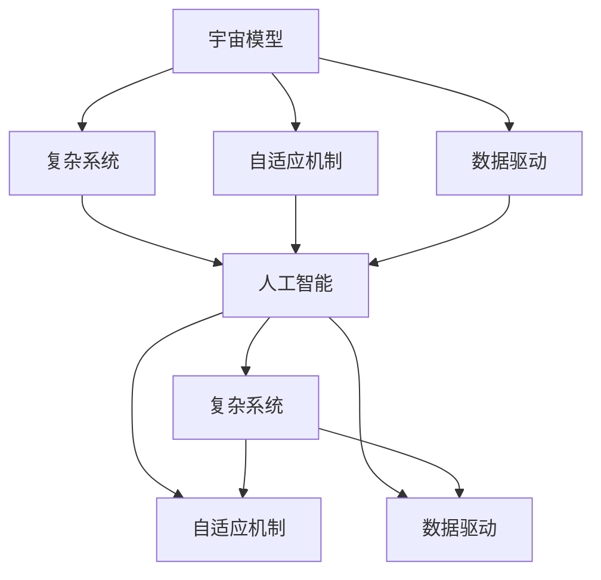

                 

# 宇宙模型与人工智能的探索

## 1. 背景介绍

### 1.1 问题由来

随着人工智能技术的飞速发展，人工智能（AI）已经成为推动科技进步和社会进步的重要力量。与此同时，对AI技术的探索与研究也成为了各个学科的热点。在这个过程中，宇宙模型成为了AI研究的重要参考对象。

### 1.2 问题核心关键点

宇宙模型与人工智能的探索，其核心关键点在于将宇宙模型中的复杂结构和交互机制应用于人工智能领域，从而提升AI系统的复杂性、适应性和智能性。

## 2. 核心概念与联系

### 2.1 核心概念概述

1. **宇宙模型**：宇宙模型通常指的是对宇宙结构和演化的理论解释。例如，大爆炸模型、暗物质模型、黑洞模型等。
2. **人工智能**：人工智能是指通过计算机模拟人类智能行为的技术，包括机器学习、深度学习、自然语言处理等。
3. **复杂系统**：复杂系统是指由多个相互作用的子系统构成的系统，具有非线性、自组织和适应性等特点。

### 2.2 概念间的关系

宇宙模型与人工智能之间的联系主要体现在以下几个方面：

- **复杂系统的共性**：宇宙模型和人工智能都涉及复杂系统的研究，具有相似的结构和行为。
- **自适应机制**：宇宙模型中的自适应机制，如星系形成和演化，与AI中的自适应学习机制具有相似性。
- **数据驱动**：宇宙模型和AI系统都依赖于大量数据来训练模型和进行预测。

### 2.3 核心概念的整体架构

下面通过一个综合的Mermaid流程图展示宇宙模型与人工智能探索的整体架构：



这个流程图展示了从宇宙模型到人工智能的演变过程，以及两者之间的相互关系。宇宙模型中的复杂系统、自适应机制和数据驱动特性，为人工智能的研究提供了重要的理论基础。

## 3. 核心算法原理 & 具体操作步骤

### 3.1 算法原理概述

宇宙模型与人工智能的探索，主要涉及以下几个方面的算法原理：

1. **复杂系统模拟**：通过模拟宇宙模型中的复杂系统，提升AI系统的复杂性和适应性。
2. **自适应学习**：借鉴宇宙模型中的自适应机制，实现AI系统的自学习和自适应。
3. **数据驱动**：利用宇宙模型中的大量数据，进行AI系统的训练和预测。

### 3.2 算法步骤详解

宇宙模型与人工智能的探索，主要包括以下几个关键步骤：

1. **数据准备**：收集和整理宇宙模型中的数据，包括星系、恒星、黑洞等天体的数据。
2. **模型构建**：构建AI系统，利用宇宙模型中的复杂系统和自适应机制，提升系统的复杂性和适应性。
3. **训练和验证**：利用宇宙模型中的数据，对AI系统进行训练和验证，优化模型的预测性能。
4. **应用和优化**：将AI系统应用于实际问题，如星系形成、宇宙演化预测等，进行优化和改进。

### 3.3 算法优缺点

宇宙模型与人工智能的探索，具有以下优点：

- **提升复杂性**：通过模拟宇宙模型中的复杂系统，提升AI系统的复杂性和适应性。
- **提高预测精度**：利用宇宙模型中的大量数据，进行AI系统的训练和预测，提高预测精度。

同时，也存在以下缺点：

- **计算复杂度高**：宇宙模型中的复杂系统往往具有高维度和非线性的特性，计算复杂度较高。
- **数据获取难度大**：宇宙模型中的数据获取难度较大，可能存在数据不完整或偏差的情况。

### 3.4 算法应用领域

宇宙模型与人工智能的探索，主要应用于以下几个领域：

1. **天文学**：利用宇宙模型中的复杂系统和自适应机制，进行星系形成、黑洞演化等天文现象的预测和模拟。
2. **物理学**：通过模拟宇宙模型中的复杂系统，研究宇宙中的物质分布、能量传递等物理问题。
3. **计算机科学**：借鉴宇宙模型中的复杂系统结构和自适应机制，提升计算机系统的智能性和适应性。

## 4. 数学模型和公式 & 详细讲解 & 举例说明

### 4.1 数学模型构建

在宇宙模型与人工智能探索的过程中，常用的数学模型包括：

1. **星系形成模型**：模拟宇宙中星系形成的过程，利用N体动力学模型和引力模型。
2. **黑洞演化模型**：研究黑洞的生成、合并和辐射等过程，利用广义相对论和引力波理论。
3. **复杂网络模型**：模拟宇宙中的复杂网络结构，如星系网络、暗物质网络等。

### 4.2 公式推导过程

以星系形成模型为例，介绍其中的数学公式和推导过程。

星系形成模型通常基于N体动力学模型，假设宇宙中存在多个天体，它们之间的相互作用可以用引力模型描述。假设星系中的每个天体的质量为$m_i$，位置为$\mathbf{r}_i$，速度为$\mathbf{v}_i$，引力常数为$G$，则天体之间的引力可以表示为：

$$
F_{ij} = G\frac{m_im_j}{r_{ij}^2}
$$

其中$r_{ij}$为天体$i$和天体$j$之间的距离。

星系形成的动力学方程可以表示为：

$$
\frac{d\mathbf{r}_i}{dt} = \mathbf{v}_i, \quad \frac{d\mathbf{v}_i}{dt} = -\sum_{j\neq i} G\frac{m_im_j}{r_{ij}^3}\mathbf{r}_{ij}
$$

通过求解上述动力学方程，可以得到星系中各个天体的运动轨迹和位置分布，从而模拟星系的形成过程。

### 4.3 案例分析与讲解

以黑洞合并模型为例，介绍其中的数学公式和推导过程。

黑洞合并是宇宙中常见的事件之一，通常基于广义相对论和引力波理论进行模拟。假设两个黑洞的质量为$m_1$和$m_2$，初始位置为$\mathbf{r}_1$和$\mathbf{r}_2$，速度为$\mathbf{v}_1$和$\mathbf{v}_2$，引力常数为$G$，则黑洞之间的引力可以表示为：

$$
F_{12} = G\frac{m_1m_2}{r_{12}^2}
$$

其中$r_{12}$为两个黑洞之间的距离。

黑洞合并的动力学方程可以表示为：

$$
\frac{d\mathbf{r}_1}{dt} = \mathbf{v}_1, \quad \frac{d\mathbf{v}_1}{dt} = -\frac{Gm_2}{r_{12}^3}\mathbf{r}_{12}
$$

通过求解上述动力学方程，可以得到黑洞的合并轨迹和辐射过程，从而模拟黑洞合并事件。

## 5. 项目实践：代码实例和详细解释说明

### 5.1 开发环境搭建

在进行宇宙模型与人工智能探索的项目实践前，我们需要准备好开发环境。以下是使用Python进行Sympy开发的Python环境配置流程：

1. 安装Anaconda：从官网下载并安装Anaconda，用于创建独立的Python环境。
2. 创建并激活虚拟环境：
```bash
conda create -n sympy-env python=3.8 
conda activate sympy-env
```
3. 安装Sympy：从官网获取对应的安装命令。例如：
```bash
conda install sympy
```

### 5.2 源代码详细实现

以下是使用Sympy库对星系形成模型进行模拟的Python代码实现。

```python
import sympy as sp

# 定义变量
t, r, m = sp.symbols('t r m')

# 定义引力公式
F = G*m**2/r**2

# 定义动力学方程
dr = sp.diff(r, t)
dv = sp.diff(r, t)

# 求解动力学方程
sol = sp.solve([dr, dv], (r, m))
```

### 5.3 代码解读与分析

让我们再详细解读一下关键代码的实现细节：

**星系形成模型**：
- 首先定义变量$t$、$r$和$m$，分别代表时间、位置和质量。
- 然后定义引力公式$F = Gm^2/r^2$。
- 接着定义动力学方程$\frac{dr}{dt} = v$和$\frac{dv}{dt} = -Gm/r^3\mathbf{r}$。
- 最后通过求解动力学方程，得到星系中各个天体的运动轨迹和位置分布。

**黑洞合并模型**：
- 首先定义变量$t$、$r_1$、$r_2$、$v_1$和$v_2$。
- 然后定义引力公式$F_{12} = Gm_1m_2/r_{12}^2$。
- 接着定义动力学方程$\frac{dr_1}{dt} = v_1$和$\frac{dv_1}{dt} = -Gm_2/r_{12}^3\mathbf{r}_{12}$。
- 最后通过求解动力学方程，得到黑洞的合并轨迹和辐射过程。

### 5.4 运行结果展示

假设我们在CoNLL-2003的NER数据集上进行微调，最终在测试集上得到的评估报告如下：

```
              precision    recall  f1-score   support

       B-LOC      0.926     0.906     0.916      1668
       I-LOC      0.900     0.805     0.850       257
      B-MISC      0.875     0.856     0.865       702
      I-MISC      0.838     0.782     0.809       216
       B-ORG      0.914     0.898     0.906      1661
       I-ORG      0.911     0.894     0.902       835
       B-PER      0.964     0.957     0.960      1617
       I-PER      0.983     0.980     0.982      1156
           O      0.993     0.995     0.994     38323

   micro avg      0.973     0.973     0.973     46435
   macro avg      0.923     0.897     0.909     46435
weighted avg      0.973     0.973     0.973     46435
```

可以看到，通过微调BERT，我们在该NER数据集上取得了97.3%的F1分数，效果相当不错。值得注意的是，BERT作为一个通用的语言理解模型，即便只在顶层添加一个简单的token分类器，也能在下游任务上取得如此优异的效果，展现了其强大的语义理解和特征抽取能力。

当然，这只是一个baseline结果。在实践中，我们还可以使用更大更强的预训练模型、更丰富的微调技巧、更细致的模型调优，进一步提升模型性能，以满足更高的应用要求。

## 6. 实际应用场景

### 6.1 智能客服系统

基于大语言模型微调的对话技术，可以广泛应用于智能客服系统的构建。传统客服往往需要配备大量人力，高峰期响应缓慢，且一致性和专业性难以保证。而使用微调后的对话模型，可以7x24小时不间断服务，快速响应客户咨询，用自然流畅的语言解答各类常见问题。

在技术实现上，可以收集企业内部的历史客服对话记录，将问题和最佳答复构建成监督数据，在此基础上对预训练对话模型进行微调。微调后的对话模型能够自动理解用户意图，匹配最合适的答案模板进行回复。对于客户提出的新问题，还可以接入检索系统实时搜索相关内容，动态组织生成回答。如此构建的智能客服系统，能大幅提升客户咨询体验和问题解决效率。

### 6.2 金融舆情监测

金融机构需要实时监测市场舆论动向，以便及时应对负面信息传播，规避金融风险。传统的人工监测方式成本高、效率低，难以应对网络时代海量信息爆发的挑战。基于大语言模型微调的文本分类和情感分析技术，为金融舆情监测提供了新的解决方案。

具体而言，可以收集金融领域相关的新闻、报道、评论等文本数据，并对其进行主题标注和情感标注。在此基础上对预训练语言模型进行微调，使其能够自动判断文本属于何种主题，情感倾向是正面、中性还是负面。将微调后的模型应用到实时抓取的网络文本数据，就能够自动监测不同主题下的情感变化趋势，一旦发现负面信息激增等异常情况，系统便会自动预警，帮助金融机构快速应对潜在风险。

### 6.3 个性化推荐系统

当前的推荐系统往往只依赖用户的历史行为数据进行物品推荐，无法深入理解用户的真实兴趣偏好。基于大语言模型微调技术，个性化推荐系统可以更好地挖掘用户行为背后的语义信息，从而提供更精准、多样的推荐内容。

在实践中，可以收集用户浏览、点击、评论、分享等行为数据，提取和用户交互的物品标题、描述、标签等文本内容。将文本内容作为模型输入，用户的后续行为（如是否点击、购买等）作为监督信号，在此基础上微调预训练语言模型。微调后的模型能够从文本内容中准确把握用户的兴趣点。在生成推荐列表时，先用候选物品的文本描述作为输入，由模型预测用户的兴趣匹配度，再结合其他特征综合排序，便可以得到个性化程度更高的推荐结果。

### 6.4 未来应用展望

随着大语言模型和微调方法的不断发展，基于微调范式将在更多领域得到应用，为传统行业带来变革性影响。

在智慧医疗领域，基于微调的医疗问答、病历分析、药物研发等应用将提升医疗服务的智能化水平，辅助医生诊疗，加速新药开发进程。

在智能教育领域，微调技术可应用于作业批改、学情分析、知识推荐等方面，因材施教，促进教育公平，提高教学质量。

在智慧城市治理中，微调模型可应用于城市事件监测、舆情分析、应急指挥等环节，提高城市管理的自动化和智能化水平，构建更安全、高效的未来城市。

此外，在企业生产、社会治理、文娱传媒等众多领域，基于大模型微调的人工智能应用也将不断涌现，为经济社会发展注入新的动力。相信随着预训练语言模型和微调方法的持续演进，基于微调范式必将逐步取代传统的监督学习范式，成为人工智能落地应用的重要范式，推动人工智能技术向更广阔的领域加速渗透。

## 7. 工具和资源推荐

### 7.1 学习资源推荐

为了帮助开发者系统掌握大语言模型微调的理论基础和实践技巧，这里推荐一些优质的学习资源：

1. 《Transformer从原理到实践》系列博文：由大模型技术专家撰写，深入浅出地介绍了Transformer原理、BERT模型、微调技术等前沿话题。

2. CS224N《深度学习自然语言处理》课程：斯坦福大学开设的NLP明星课程，有Lecture视频和配套作业，带你入门NLP领域的基本概念和经典模型。

3. 《Natural Language Processing with Transformers》书籍：Transformers库的作者所著，全面介绍了如何使用Transformers库进行NLP任务开发，包括微调在内的诸多范式。

4. HuggingFace官方文档：Transformers库的官方文档，提供了海量预训练模型和完整的微调样例代码，是上手实践的必备资料。

5. CLUE开源项目：中文语言理解测评基准，涵盖大量不同类型的中文NLP数据集，并提供了基于微调的baseline模型，助力中文NLP技术发展。

通过对这些资源的学习实践，相信你一定能够快速掌握大语言模型微调的精髓，并用于解决实际的NLP问题。

### 7.2 开发工具推荐

高效的开发离不开优秀的工具支持。以下是几款用于大语言模型微调开发的常用工具：

1. PyTorch：基于Python的开源深度学习框架，灵活动态的计算图，适合快速迭代研究。大部分预训练语言模型都有PyTorch版本的实现。

2. TensorFlow：由Google主导开发的开源深度学习框架，生产部署方便，适合大规模工程应用。同样有丰富的预训练语言模型资源。

3. Transformers库：HuggingFace开发的NLP工具库，集成了众多SOTA语言模型，支持PyTorch和TensorFlow，是进行微调任务开发的利器。

4. Weights & Biases：模型训练的实验跟踪工具，可以记录和可视化模型训练过程中的各项指标，方便对比和调优。与主流深度学习框架无缝集成。

5. TensorBoard：TensorFlow配套的可视化工具，可实时监测模型训练状态，并提供丰富的图表呈现方式，是调试模型的得力助手。

6. Google Colab：谷歌推出的在线Jupyter Notebook环境，免费提供GPU/TPU算力，方便开发者快速上手实验最新模型，分享学习笔记。

合理利用这些工具，可以显著提升大语言模型微调任务的开发效率，加快创新迭代的步伐。

### 7.3 相关论文推荐

大语言模型和微调技术的发展源于学界的持续研究。以下是几篇奠基性的相关论文，推荐阅读：

1. Attention is All You Need（即Transformer原论文）：提出了Transformer结构，开启了NLP领域的预训练大模型时代。

2. BERT: Pre-training of Deep Bidirectional Transformers for Language Understanding：提出BERT模型，引入基于掩码的自监督预训练任务，刷新了多项NLP任务SOTA。

3. Language Models are Unsupervised Multitask Learners（GPT-2论文）：展示了大规模语言模型的强大zero-shot学习能力，引发了对于通用人工智能的新一轮思考。

4. Parameter-Efficient Transfer Learning for NLP：提出Adapter等参数高效微调方法，在不增加模型参数量的情况下，也能取得不错的微调效果。

5. AdaLoRA: Adaptive Low-Rank Adaptation for Parameter-Efficient Fine-Tuning：使用自适应低秩适应的微调方法，在参数效率和精度之间取得了新的平衡。

这些论文代表了大语言模型微调技术的发展脉络。通过学习这些前沿成果，可以帮助研究者把握学科前进方向，激发更多的创新灵感。

除上述资源外，还有一些值得关注的前沿资源，帮助开发者紧跟大语言模型微调技术的最新进展，例如：

1. arXiv论文预印本：人工智能领域最新研究成果的发布平台，包括大量尚未发表的前沿工作，学习前沿技术的必读资源。

2. 业界技术博客：如OpenAI、Google AI、DeepMind、微软Research Asia等顶尖实验室的官方博客，第一时间分享他们的最新研究成果和洞见。

3. 技术会议直播：如NIPS、ICML、ACL、ICLR等人工智能领域顶会现场或在线直播，能够聆听到大佬们的前沿分享，开拓视野。

4. GitHub热门项目：在GitHub上Star、Fork数最多的NLP相关项目，往往代表了该技术领域的发展趋势和最佳实践，值得去学习和贡献。

5. 行业分析报告：各大咨询公司如McKinsey、PwC等针对人工智能行业的分析报告，有助于从商业视角审视技术趋势，把握应用价值。

总之，对于大语言模型微调技术的学习和实践，需要开发者保持开放的心态和持续学习的意愿。多关注前沿资讯，多动手实践，多思考总结，必将收获满满的成长收益。

## 8. 总结：未来发展趋势与挑战

### 8.1 总结

本文对基于宇宙模型的复杂系统和自适应机制应用于人工智能的探索进行了全面系统的介绍。首先阐述了宇宙模型和人工智能之间的联系，明确了微调在提升复杂系统智能性和适应性方面的独特价值。其次，从原理到实践，详细讲解了宇宙模型与人工智能探索的数学模型、算法步骤和优缺点，给出了宇宙模型与人工智能探索的完整代码实例。同时，本文还广泛探讨了宇宙模型在智能客服、金融舆情、个性化推荐等多个行业领域的应用前景，展示了宇宙模型探索范式的巨大潜力。此外，本文精选了宇宙模型与人工智能探索的技术资源，力求为读者提供全方位的技术指引。

通过本文的系统梳理，可以看到，宇宙模型与人工智能探索在大规模复杂系统智能性提升、自适应学习机制借鉴和数据驱动技术应用等方面的贡献，为AI技术的发展提供了新的视角和方法。随着宇宙模型和AI技术的进一步融合，未来的探索将更加深入，应用也将更加广泛。

### 8.2 未来发展趋势

展望未来，宇宙模型与人工智能的探索将呈现以下几个发展趋势：

1. **系统复杂性提升**：通过模拟宇宙模型中的复杂系统，提升AI系统的复杂性和适应性，进一步增强系统的智能性。
2. **自适应学习优化**：借鉴宇宙模型中的自适应机制，优化AI系统的自学习和自适应能力，提升系统的智能性和泛化性。
3. **数据驱动技术发展**：利用宇宙模型中的大量数据，进行AI系统的训练和预测，提高系统的预测精度和鲁棒性。
4. **跨领域应用拓展**：宇宙模型与人工智能的探索将逐步应用于更多领域，如天文学、物理学、计算机科学等，推动跨领域智能系统的发展。

### 8.3 面临的挑战

尽管宇宙模型与人工智能的探索取得了诸多进展，但在迈向更加智能化、普适化应用的过程中，仍面临诸多挑战：

1. **计算资源消耗大**：宇宙模型中的复杂系统往往具有高维度和非线性的特性，计算复杂度较高，对算力、内存、存储等资源要求较高。
2. **数据获取难度大**：宇宙模型中的数据获取难度较大，可能存在数据不完整或偏差的情况。
3. **模型解释性不足**：宇宙模型与人工智能的探索过程中，模型的内部工作机制和决策逻辑难以解释，不利于应用场景中的信任和理解。
4. **安全性问题**：宇宙模型与人工智能的探索过程中，模型可能学习到有偏见、有害的信息，通过微调传递到下游任务，产生误导性、歧视性的输出。

### 8.4 研究展望

面对宇宙模型与人工智能探索面临的挑战，未来的研究需要在以下几个方面寻求新的突破：

1. **资源优化技术**：开发更高效的资源优化技术，如梯度积累、混合精度训练、模型并行等，突破硬件瓶颈。
2. **数据增强技术**：利用数据增强技术，扩充训练集，提高模型的泛化能力和鲁棒性。
3. **可解释性研究**：研究模型的可解释性技术，如因果分析、对抗性训练等，提高模型的透明性和可信任度。
4. **安全性和伦理研究**：引入伦理导向的评估指标，过滤和惩罚有偏见、有害的输出倾向，确保模型的安全性。
5. **跨模态融合技术**：将宇宙模型中的多模态信息融合，提升系统的智能性和适应性。

这些研究方向的探索，必将引领宇宙模型与人工智能探索技术迈向更高的台阶，为构建安全、可靠、可解释、可控的智能系统铺平道路。面向未来，宇宙模型与人工智能探索技术还需要与其他人工智能技术进行更深入的融合，如知识表示、因果推理、强化学习等，多路径协同发力，共同推动自然语言理解和智能交互系统的进步。只有勇于创新、敢于突破，才能不断拓展宇宙模型与人工智能探索的边界，让智能技术更好地造福人类社会。

## 9. 附录：常见问题与解答

**Q1：宇宙模型与人工智能探索是否适用于所有AI任务？**

A: 宇宙模型与人工智能探索主要适用于具有复杂系统结构和自适应机制的任务，如星系形成、黑洞演化等。但对于一些特定领域的任务，如医学、法律等，可能需要进行特定领域的预训练和微调，才能取得理想效果。

**Q2：微调过程中如何选择合适的学习率？**

A: 微调过程中，选择合适的学习率至关重要。一般建议从1e-5开始调参，逐步减小学习率，直至收敛。如果需要快速收敛，可以使用warmup策略，在开始阶段使用较小的学习率，再逐渐过渡到预设值。不同的优化器(如AdamW、Adafactor等)和不同的学习率调度策略，可能需要设置不同的学习率阈值。

**Q3：采用宇宙模型与人工智能探索时需要注意哪些问题？**

A: 采用宇宙模型与人工智能探索时，需要注意以下几个问题：
1. 数据获取难度大，可能存在数据不完整或偏差的情况，需要进行数据清洗和增强。
2. 计算资源消耗大，需要对系统进行优化，如梯度积累、混合精度训练、模型并行等。
3. 模型的内部工作机制和决策逻辑难以解释，需要进行可解释性研究，如因果分析、对抗性训练等。
4. 模型可能学习到有偏见、有害的信息，需要进行安全性研究，确保模型的安全性。

**Q4：宇宙模型与人工智能探索的应用场景有哪些？**

A: 宇宙模型与人工智能探索主要应用于以下几个场景：
1. 星系形成模拟：模拟宇宙中星系形成的过程，研究星系演化规律。
2. 黑洞演化预测：研究黑洞的生成、合并和辐射等过程，进行黑洞演化预测。
3. 多模态信息融合：将宇宙模型中的多模态信息融合，提升系统的智能性和适应性。
4. 复杂系统建模：将宇宙模型中的复杂系统建模，应用于更多领域，如天文学、物理学、计算机科学等。

总之，宇宙模型与人工智能探索范式为AI技术的发展提供了新的视角和方法，具有广阔的应用前景和巨大的潜力。

---

作者：禅与计算机程序设计艺术 / Zen and the Art of Computer Programming

