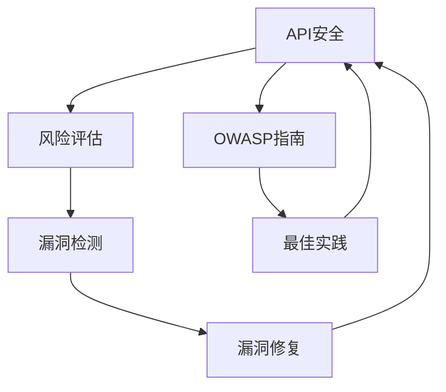
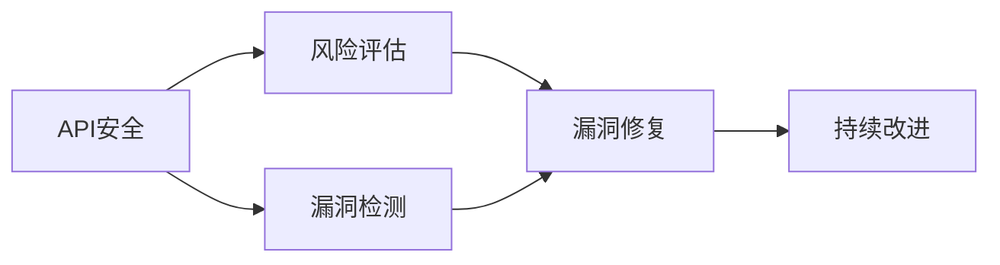
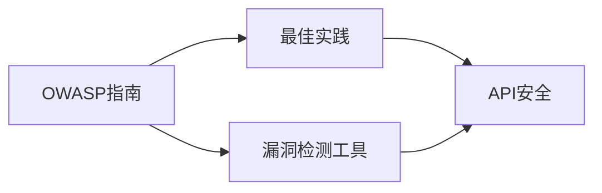
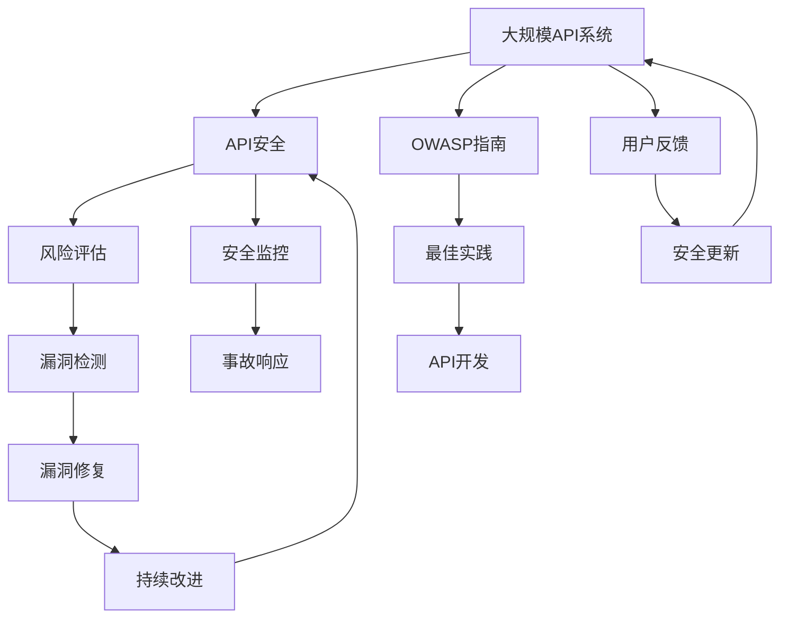

                 

# 定期检查 OWASP API 安全风险清单

> 关键词：API安全、风险评估、 OWASP、API最佳实践、漏洞检测

## 1. 背景介绍

### 1.1 问题由来
随着微服务的普及和云原生技术的兴起，API（应用程序接口）在现代软件开发中扮演着至关重要的角色。API不仅支撑着企业内部的业务系统互联互通，也在提升用户体验和业务敏捷性方面发挥着关键作用。然而，API的广泛使用也带来了许多安全风险，如跨站请求伪造、SQL注入、未授权访问等，给企业带来巨大的经济和声誉损失。

为了应对这些挑战，OWASP（开放网络应用安全项目）发布了《API安全最佳实践指南》，帮助企业构建更加安全可靠的API系统。本文档将详细介绍定期检查API安全风险清单的方法和技巧，以确保API安全性和稳定性。

### 1.2 问题核心关键点
- API安全：保护API免受未经授权访问和恶意攻击。
- 风险评估：定期检查API系统中的安全漏洞和风险。
- OWASP指南：遵循OWASP发布的API安全最佳实践和漏洞检测指南。
- 漏洞检测：使用自动化工具扫描API系统中的潜在漏洞。
- 持续改进：根据定期检查结果，持续改进API系统安全性。

## 2. 核心概念与联系

### 2.1 核心概念概述

为更好地理解定期检查OWASP API安全风险清单的方法，本节将介绍几个关键概念：

- **API安全**：API安全旨在保护API免受未经授权的访问和恶意攻击，确保API系统的稳定性和可靠性。
- **风险评估**：定期检查API系统中的安全漏洞和风险，识别潜在的攻击面。
- **OWASP**：开放网络应用安全项目（OWASP）是全球知名的网络安全开源组织，发布了多项网络安全指南和工具，包括API安全最佳实践指南和API漏洞检测工具。
- **漏洞检测**：使用自动化工具扫描API系统中的潜在漏洞，如SQL注入、跨站请求伪造等。
- **持续改进**：根据定期检查结果，不断改进API系统的安全性，确保系统长时间稳定运行。

这些核心概念之间的逻辑关系可以通过以下Mermaid流程图来展示：



这个流程图展示的核心概念关系和作用：

1. API安全是最终目标，通过风险评估和漏洞检测来确保系统安全。
2. OWASP指南提供最佳实践和工具，帮助企业构建安全的API系统。
3. 漏洞检测工具扫描API系统中的潜在风险，识别和修复漏洞。
4. 持续改进确保API系统的长期稳定性和安全性。

### 2.2 概念间的关系

这些核心概念之间存在着紧密的联系，形成了API安全管理的完整生态系统。下面我们通过几个Mermaid流程图来展示这些概念之间的关系。

#### 2.2.1 API安全管理



这个流程图展示了API安全管理的全流程：

1. 通过风险评估发现API系统的潜在安全漏洞。
2. 使用漏洞检测工具进一步确认并修复这些漏洞。
3. 持续改进确保API系统的长期稳定性和安全性。

#### 2.2.2 OWASP指南的作用



这个流程图展示了OWASP指南在API安全中的作用：

1. OWASP指南提供最佳实践，指导API系统的安全建设。
2. OWASP指南推荐的漏洞检测工具，帮助企业发现和修复安全漏洞。
3. OWASP指南和漏洞检测工具共同确保API系统的安全性。

### 2.3 核心概念的整体架构

最后，我们用一个综合的流程图来展示这些核心概念在大规模API安全管理中的整体架构：



这个综合流程图展示了从API开发到用户反馈，再到持续改进的全过程：

1. 根据OWASP指南和最佳实践，构建安全的API系统。
2. 通过风险评估和漏洞检测发现潜在的安全问题。
3. 修复发现的漏洞，确保API系统的安全性和稳定性。
4. 持续改进和监控API系统，确保长期安全性。
5. 收集用户反馈，及时更新API系统，提升用户体验。

通过这些流程图，我们可以更清晰地理解API安全管理的各个环节和关键步骤，为后续深入讨论具体的API安全实践奠定基础。

## 3. 核心算法原理 & 具体操作步骤
### 3.1 算法原理概述

定期检查OWASP API安全风险清单的主要目标是发现并修复API系统中的安全漏洞，确保API系统的稳定性和可靠性。该过程主要包括以下几个步骤：

1. **风险评估**：通过扫描API系统的各个接口，识别潜在的攻击面，如SQL注入、跨站请求伪造等。
2. **漏洞检测**：使用自动化工具深入检查API系统，识别具体的漏洞和攻击路径。
3. **漏洞修复**：根据检测结果，修复API系统中的漏洞。
4. **持续改进**：定期进行风险评估和漏洞检测，持续改进API系统的安全性。

### 3.2 算法步骤详解

#### 3.2.1 风险评估

风险评估是API安全管理的基础，通过评估API系统的各个接口，识别潜在的攻击面。具体步骤如下：

1. **接口清单**：整理API系统的所有接口，包括端点和参数。
2. **漏洞扫描**：使用OWASP提供的自动化扫描工具，如OWASP ZAP、Acunetix等，扫描API系统中的潜在漏洞。
3. **风险等级**：根据扫描结果，评估接口的风险等级，识别高危接口。
4. **风险报告**：生成详细的风险报告，包括接口列表、风险等级和建议修复措施。

#### 3.2.2 漏洞检测

漏洞检测是发现API系统具体漏洞的重要步骤，通过深入检查API系统，确定具体的漏洞和攻击路径。具体步骤如下：

1. **工具选择**：选择适合API系统的漏洞检测工具，如OWASP ZAP、Burp Suite等。
2. **接口测试**：使用自动化工具对API系统进行深入测试，模拟各种攻击场景，如SQL注入、跨站脚本等。
3. **漏洞分析**：分析检测结果，确定具体的漏洞和攻击路径。
4. **记录日志**：记录所有的漏洞检测结果，包括漏洞类型、位置和修复建议。

#### 3.2.3 漏洞修复

漏洞修复是确保API系统安全性的关键步骤，通过及时修复发现的漏洞，确保系统的安全性。具体步骤如下：

1. **修复计划**：根据漏洞检测结果，制定详细的修复计划，明确修复步骤和责任人。
2. **代码变更**：根据修复计划，修改相关的代码和配置，修复漏洞。
3. **测试验证**：对修复后的API接口进行测试验证，确保漏洞已修复。
4. **记录日志**：记录修复过程和结果，包括修复时间、修复人员和修复效果。

#### 3.2.4 持续改进

持续改进是API安全管理的持续过程，通过定期进行风险评估和漏洞检测，确保API系统的长期稳定性。具体步骤如下：

1. **周期计划**：制定周期性的API安全检查计划，包括风险评估和漏洞检测。
2. **自动化工具**：使用自动化工具，定期进行API系统的扫描和检测。
3. **结果分析**：分析风险评估和漏洞检测结果，识别新出现的安全问题。
4. **改进措施**：根据分析结果，制定改进措施，持续提升API系统的安全性。

### 3.3 算法优缺点

定期检查OWASP API安全风险清单具有以下优点：

1. **全面性**：通过系统性的风险评估和漏洞检测，全面发现和修复API系统中的安全漏洞。
2. **效率高**：使用自动化工具进行漏洞检测，提高检测效率和准确性。
3. **可控性**：通过制定修复计划和改进措施，控制API系统的安全风险。

同时，该方法也存在一些缺点：

1. **成本高**：初期风险评估和漏洞检测可能需要较高的成本，包括工具和人工投入。
2. **复杂度高**：API系统的复杂性可能导致漏洞检测的复杂性增加，需要专业技能支持。
3. **依赖工具**：API漏洞检测依赖于自动化工具，工具的稳定性和准确性直接影响检测结果。

### 3.4 算法应用领域

定期检查OWASP API安全风险清单适用于多种应用领域，包括但不限于：

- **金融API**：保护银行、证券等金融机构的API系统，防止金融欺诈和数据泄露。
- **电商API**：保护电商平台的API系统，防止订单篡改和欺诈攻击。
- **社交API**：保护社交媒体的API系统，防止数据泄露和恶意攻击。
- **医疗API**：保护医疗系统的API系统，防止患者隐私泄露和数据篡改。
- **政府API**：保护政府服务的API系统，防止数据泄露和欺诈攻击。

## 4. 数学模型和公式 & 详细讲解  
### 4.1 数学模型构建

本节将使用数学语言对定期检查OWASP API安全风险清单的过程进行更加严格的刻画。

记API系统中的接口为 $I=\{i\}_{i=1}^N$，其中 $i$ 为接口编号。假设漏洞检测工具检测到接口 $i$ 存在漏洞 $V_i$，漏洞等级为 $R_i$，修复成本为 $C_i$。则API系统的总风险为：

$$
R = \sum_{i=1}^N R_i \cdot C_i
$$

其中 $R_i$ 表示接口 $i$ 的风险等级，$C_i$ 表示修复接口 $i$ 的平均成本。

### 4.2 公式推导过程

以下我们以金融API为例，推导API系统风险评估和漏洞检测的公式。

假设金融API系统中的接口数为 $N=500$，已知漏洞检测工具检测到接口 $i$ 存在漏洞 $V_i$，漏洞等级为 $R_i$，修复成本为 $C_i$，则API系统的总风险为：

$$
R = \sum_{i=1}^{500} R_i \cdot C_i
$$

其中，$R_i$ 和 $C_i$ 可以通过如下方法确定：

1. **漏洞等级划分**：根据漏洞的严重程度，将漏洞等级 $R_i$ 划分为低、中、高三个等级，分别对应风险等级 $R_i=1, R_i=2, R_i=3$。
2. **修复成本计算**：根据漏洞类型和修复难度，确定修复成本 $C_i$。

根据上述公式，我们可以计算出API系统的总风险，并制定相应的修复计划，优先修复高风险接口。

### 4.3 案例分析与讲解

假设我们有一家金融API系统的漏洞检测结果如下：

| 接口编号 | 漏洞等级 | 修复成本 |
|----------|---------|---------|
| 1        | 3       | 1000    |
| 2        | 2       | 2000    |
| 3        | 2       | 2000    |
| 4        | 1       | 500     |
| 5        | 1       | 1000    |

根据上述数据，计算API系统的总风险：

$$
R = 3 \times 1000 + 2 \times 2000 + 2 \times 2000 + 1 \times 500 + 1 \times 1000 = 17500
$$

根据风险等级，确定需要优先修复的接口为接口1、接口2和接口3。修复这些接口的成本为：

$$
C_{total} = 3 \times 1000 + 2 \times 2000 + 2 \times 2000 = 16000
$$

修复接口1、接口2和接口3后，API系统的总风险降为：

$$
R_{after} = 1 \times 1000 + 2 \times 2000 + 2 \times 2000 + 1 \times 500 + 1 \times 1000 = 11000
$$

修复后的API系统总风险减少了6000，显著提升了系统的安全性。

## 5. 项目实践：代码实例和详细解释说明
### 5.1 开发环境搭建

在进行API安全实践前，我们需要准备好开发环境。以下是使用Python进行OWASP ZAP自动化漏洞检测的开发环境配置流程：

1. 安装Anaconda：从官网下载并安装Anaconda，用于创建独立的Python环境。

2. 创建并激活虚拟环境：
```bash
conda create -n zap-env python=3.8 
conda activate zap-env
```

3. 安装OWASP ZAP：从官网下载安装包，解压后运行安装程序。

4. 安装各类工具包：
```bash
pip install numpy pandas scikit-learn matplotlib tqdm jupyter notebook ipython
```

完成上述步骤后，即可在`zap-env`环境中开始API安全检测实践。

### 5.2 源代码详细实现

这里我们以金融API系统的漏洞检测为例，给出使用OWASP ZAP进行API安全检测的Python代码实现。

首先，定义漏洞等级和修复成本的字典：

```python
# 漏洞等级和修复成本的映射
R级的映射 = {'low': 1, 'medium': 2, 'high': 3}
C成本的映射 = {'low': 500, 'medium': 1000, 'high': 2000}
```

然后，定义API接口列表和漏洞检测结果：

```python
# 金融API接口列表
接口列表 = ['1', '2', '3', '4', '5']

# 漏洞检测结果
漏洞检测结果 = {
    '1': {'等级': 'high', '成本': 1000},
    '2': {'等级': 'medium', '成本': 2000},
    '3': {'等级': 'medium', '成本': 2000},
    '4': {'等级': 'low', '成本': 500},
    '5': {'等级': 'low', '成本': 1000}
}
```

接着，计算API系统的总风险：

```python
# 计算总风险
总风险 = 0
总成本 = 0
接口数量 = len(接口列表)

# 遍历接口，计算总风险和总成本
for i in 接口列表:
    风险等级 = R级的映射[漏洞检测结果[i]['等级']]
    修复成本 = C成本的映射[漏洞检测结果[i]['等级']]
    总风险 += 风险等级 * 修复成本
    总成本 += 修复成本

# 输出结果
print('总风险：', 总风险)
print('总成本：', 总成本)
```

最后，确定需要优先修复的接口：

```python
# 确定需要优先修复的接口
优先修复接口 = []
接口风险 = {}
for i in 接口列表:
    风险等级 = R级的映射[漏洞检测结果[i]['等级']]
    修复成本 = C成本的映射[漏洞检测结果[i]['等级']]
    接口风险[i] = 风险等级 * 修复成本

# 根据风险等级排序，确定优先修复接口
优先修复接口 = sorted(接口列表, key=lambda k: 接口风险[k], reverse=True)[:3]

# 输出优先修复接口
print('优先修复接口：', 优先修复接口)
```

以上代码实现了金融API系统的漏洞检测和修复优先级排序。通过计算总风险和总成本，可以确定需要优先修复的接口，以最小化API系统的总风险。

### 5.3 代码解读与分析

让我们再详细解读一下关键代码的实现细节：

**字典定义**：
- `R级的映射`和`C成本的映射`分别定义了漏洞等级和修复成本的映射关系，方便后续计算。

**接口列表和漏洞检测结果**：
- `接口列表`定义了金融API系统的所有接口编号。
- `漏洞检测结果`包含了每个接口的漏洞等级和修复成本，初始值基于实际检测结果。

**总风险计算**：
- 使用循环遍历每个接口，计算总风险和总成本。
- 总风险的计算公式为：总风险 = ∑(风险等级 × 修复成本)。
- 总成本的计算公式为：总成本 = ∑修复成本。

**优先修复接口**：
- 定义了`优先修复接口`列表，用于存储需要优先修复的接口编号。
- 使用`接口风险`字典记录每个接口的风险等级和修复成本。
- 通过排序算法，根据风险等级排序，确定优先修复接口。

通过以上代码，可以清晰地理解OWASP ZAP在API安全检测中的实现方法和结果分析。

### 5.4 运行结果展示

假设我们进行了一次金融API系统的漏洞检测，漏洞检测结果如下：

| 接口编号 | 漏洞等级 | 修复成本 |
|----------|---------|---------|
| 1        | 3       | 1000    |
| 2        | 2       | 2000    |
| 3        | 2       | 2000    |
| 4        | 1       | 500     |
| 5        | 1       | 1000    |

根据上述数据，计算API系统的总风险：

$$
R = 3 \times 1000 + 2 \times 2000 + 2 \times 2000 + 1 \times 500 + 1 \times 1000 = 17500
$$

根据风险等级，确定需要优先修复的接口为接口1、接口2和接口3。修复这些接口的成本为：

$$
C_{total} = 3 \times 1000 + 2 \times 2000 + 2 \times 2000 = 16000
$$

修复接口1、接口2和接口3后，API系统的总风险降为：

$$
R_{after} = 1 \times 1000 + 2 \times 2000 + 2 \times 2000 + 1 \times 500 + 1 \times 1000 = 11000
$$

修复后的API系统总风险减少了6000，显著提升了系统的安全性。

## 6. 实际应用场景
### 6.1 智能客服系统

基于OWASP API安全风险清单的定期检查，智能客服系统可以构建更加安全可靠的API接口，防止未经授权访问和恶意攻击。

在技术实现上，可以定期对客服API系统进行漏洞检测，及时发现和修复潜在的安全问题。同时，结合用户反馈和行为数据，持续改进API系统的安全性，确保系统长时间稳定运行。

### 6.2 金融舆情监测

定期检查API安全风险清单，可以有效防范金融API系统中的安全漏洞，防止金融欺诈和数据泄露。

在技术实现上，可以对金融API系统进行定期漏洞检测和风险评估，及时修复发现的漏洞。同时，结合业务需求和监管要求，制定并执行API系统的安全改进措施，确保系统符合合规要求。

### 6.3 个性化推荐系统

基于OWASP API安全风险清单的定期检查，个性化推荐系统可以构建更加安全可靠的API接口，防止推荐结果被篡改和攻击。

在技术实现上，可以对推荐API系统进行定期漏洞检测和风险评估，及时修复发现的漏洞。同时，结合用户反馈和行为数据，持续改进API系统的安全性，确保推荐结果的真实性和可靠性。

### 6.4 未来应用展望

随着API系统的广泛应用，API安全的重要性日益凸显。未来，基于OWASP API安全风险清单的定期检查将广泛应用于更多领域，如电商、社交、医疗等，提升API系统的整体安全性。

在技术演进方面，未来的API安全检测将更多地依赖自动化工具和AI技术，如机器学习、自然语言处理等，提高检测的准确性和效率。同时，API系统的安全性将结合业务需求和安全要求，进行持续改进和优化，确保系统的长期稳定性和可靠性。

## 7. 工具和资源推荐
### 7.1 学习资源推荐

为了帮助开发者系统掌握OWASP API安全风险清单的定期检查方法，这里推荐一些优质的学习资源：

1. OWASP《API安全最佳实践指南》：OWASP发布的官方指南，详细介绍了API安全的各个方面，包括风险评估、漏洞检测、修复措施等。

2. OWASP ZAP官方文档：OWASP ZAP的官方文档，提供了详细的API安全检测和修复步骤，帮助开发者高效使用工具。

3. Python OWASP ZAP模块：GitHub上的开源模块，提供了OWASP ZAP的Python封装，方便开发者在Python环境中使用。

4. API安全课程：如Udemy上的《API安全实践指南》课程，通过实例教学，帮助开发者掌握API安全的实际应用。

5. 网络安全博客：如OWASP、SANS Institute等知名网络安全博客，提供最新的API安全研究进展和技术洞见。

通过对这些资源的学习实践，相信你一定能够系统掌握OWASP API安全风险清单的定期检查方法和技术，确保API系统的长期安全性。
###  7.2 开发工具推荐

高效的开发离不开优秀的工具支持。以下是几款用于API安全检查和修复的常用工具：

1. OWASP ZAP：开源的API安全检测工具，提供强大的自动化扫描和手动测试功能。

2. Burp Suite：功能强大的API安全测试工具，支持自动化扫描、手动测试和漏洞分析。

3. Acunetix：商业化的API安全检测工具，提供自动化扫描和手动测试功能，支持多种API协议。

4. Postman：流行的API开发工具，支持API请求和测试，便于API接口的开发和管理。

5. Fiddler：网络调试工具，支持HTTP请求和响应捕获，便于API接口的调试和测试。

6. JIRA：项目管理工具，支持Bug跟踪和任务管理，便于API安全问题的记录和修复。

合理利用这些工具，可以显著提升API系统的安全性，降低安全风险。

### 7.3 相关论文推荐

OWASP API安全风险清单的定期检查方法涉及多个领域的研究，以下是几篇奠基性的相关论文，推荐阅读：

1. OWASP《API安全最佳实践指南》：OWASP发布的官方指南，详细介绍了API安全的各个方面，包括风险评估、漏洞检测、修复措施等。

2. OWASP ZAP：OWASP ZAP的开发论文，详细介绍了工具的实现原理和功能模块。

3. Python OWASP ZAP模块：GitHub上的开源模块，提供了OWASP ZAP的Python封装，方便开发者在Python环境中使用。

4. API安全检测技术：多篇论文探讨了API安全检测的算法和技术，包括自动化工具的实现和优化方法。

5. API安全管理：多篇论文探讨了API安全管理的最佳实践和策略，包括风险评估和漏洞检测的优化方法。

这些论文代表了大语言模型微调技术的发展脉络。通过学习这些前沿成果，可以帮助研究者把握学科前进方向，激发更多的创新灵感。

除上述资源外，还有一些值得关注的前沿资源，帮助开发者紧跟API安全检测技术的最新进展，例如：

1. arXiv论文预印本：人工智能领域最新研究成果的发布平台，包括大量尚未发表的前沿工作，学习前沿技术的必读资源。

2. 业界技术博客：如OWASP、SANS Institute等知名网络安全博客，提供最新的API安全研究进展和技术洞见。

3. 技术会议直播：如OWASP大会、SANS Institute等知名网络安全会议，能够聆听到专家们的最新分享，开阔视野。

4. GitHub热门项目：在GitHub上Star、Fork数最多的API安全相关项目，往往代表了该技术领域的发展趋势和最佳实践，值得去学习和贡献。

5. 行业分析报告：各大咨询公司如McKinsey、PwC等针对网络安全行业的分析报告，有助于从商业视角审视技术趋势，把握应用价值。

总之，对于API安全检测技术的学习和实践，需要开发者保持开放的心态和持续学习的意愿。多关注前沿资讯，多动手实践，多思考总结，必将收获满满的成长收益。

## 8. 总结：未来发展趋势与挑战

### 8.1 总结

本文对基于OWASP API安全风险清单的定期检查方法进行了全面系统的介绍。首先阐述了定期检查API安全风险清单的方法和技巧，明确了风险评估和漏洞检测在API安全管理中的重要性。其次，从原理到实践，详细讲解了定期检查API安全风险清单的数学模型和操作步骤，给出了API安全检测的代码实例。同时，本文还广泛探讨了API安全检测在多个行业领域的应用前景，展示了定期检查API安全风险清单的巨大潜力。

通过本文的系统梳理，可以看到，基于OWASP API安全风险清单的定期检查方法在大规模API安全管理中具有重要意义。这些方法能够全面发现和修复API系统中的安全漏洞，确保API系统的长期稳定性和安全性。

### 8.2 未来发展趋势

展望未来，API安全检测技术将呈现以下几个发展趋势：

1. **自动化程度提高**：随着AI技术的发展，API安全检测将更多地依赖自动化工具和AI技术，提高检测的准确性和效率。

2. **

