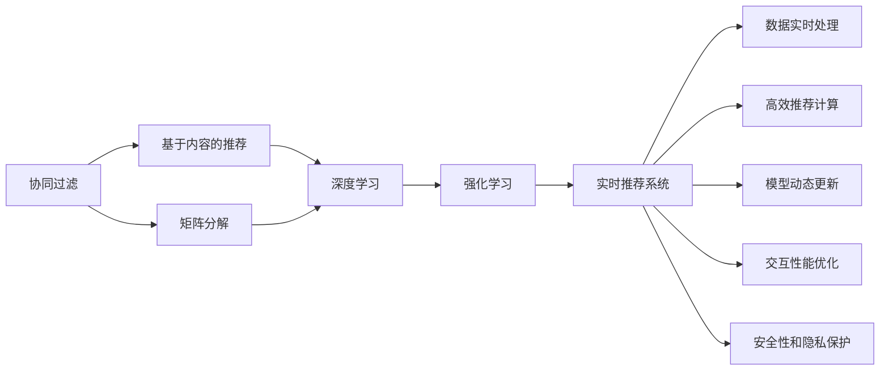
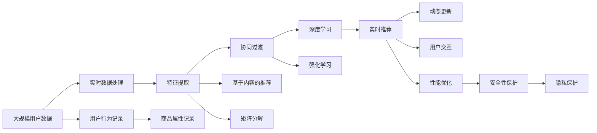

                 

# 实时推荐技术的实现方法

> 关键词：推荐系统, 实时推荐, 协同过滤, 基于内容的推荐, 矩阵分解, 深度学习, 强化学习

## 1. 背景介绍

### 1.1 问题由来
随着互联网和电子商务的迅猛发展，用户每天生成的大量数据为推荐系统提供了丰富的信息来源。推荐系统通过挖掘这些数据，为用户提供个性化的信息服务，大幅提升用户体验和满意度。实时推荐系统（Real-time Recommendation Systems）更进一步，能够实时响应用户需求，提供动态的个性化推荐。这不仅要求系统具备高效的查询和处理能力，还需要在极短的时间内完成数据分析和推荐计算。

### 1.2 问题核心关键点
实时推荐系统的主要挑战包括：
1. 数据实时处理：快速、准确地处理用户行为数据和上下文信息，是实时推荐的前提。
2. 高效推荐计算：在毫秒级别内完成推荐计算，才能满足实时响应的要求。
3. 模型动态更新：实时推荐需要根据用户的即时行为和偏好，不断更新推荐模型。
4. 交互性能优化：确保系统响应流畅，避免延迟和卡顿。
5. 安全性和隐私保护：确保数据隐私，防止数据滥用。

这些挑战驱动了实时推荐技术的发展，使其成为推荐系统研究与应用的热点。本文将详细介绍实时推荐系统的主要实现方法和技术，并展望其未来应用前景。

### 1.3 问题研究意义
实时推荐技术有助于提升用户体验，帮助电商平台提升销售业绩，还能为在线内容平台提供精准的内容推送。其应用领域广泛，包括电商推荐、社交媒体内容推荐、视频推荐等，具有重要的商业价值。同时，实时推荐系统的研究有助于深化对推荐机制的理解，推动推荐技术的发展，对学术界和工业界都具有重要意义。

## 2. 核心概念与联系

### 2.1 核心概念概述

为更好地理解实时推荐系统的实现方法，本节将介绍几个核心概念：

- 协同过滤(Collaborative Filtering, CF)：基于用户和物品的协同行为数据，通过相似性度量进行推荐的方法。
- 基于内容的推荐(Content-based Recommendation)：通过分析用户和物品的属性特征，进行推荐的方法。
- 矩阵分解(Matrix Factorization)：将用户-物品评分矩阵分解成低秩矩阵，进行推荐的方法。
- 深度学习(Deep Learning)：通过多层神经网络模型，从用户行为数据中提取高级特征，进行推荐的方法。
- 强化学习(Reinforcement Learning)：通过学习智能体的行为策略，不断优化推荐效果的方法。
- 交互性(Interactivity)：实时推荐系统需要与用户进行互动，以获得用户的即时反馈和行为。

这些概念之间存在密切联系，通过组合和优化，可以构建高效的实时推荐系统。

### 2.2 概念间的关系

这些核心概念之间的关系可以通过以下Mermaid流程图来展示：



这个流程图展示了实时推荐系统的主要组成部分及其之间的关系：

1. 协同过滤、基于内容的推荐和矩阵分解是推荐系统的主要方法，通过数据处理和特征提取，为实时推荐提供数据基础。
2. 深度学习和强化学习是实时推荐系统的核心技术，通过模型训练和策略优化，提升推荐效果。
3. 实时推荐系统需要高效的数据处理和推荐计算，以及动态模型更新和用户交互。
4. 安全性和隐私保护是实时推荐系统的重要考量，确保数据的合法使用和用户隐私的保护。

这些概念共同构成了实时推荐系统的技术框架，为其高效实现提供了基本思路。

### 2.3 核心概念的整体架构

最后，我们用一个综合的流程图来展示这些核心概念在大规模实时推荐系统中的整体架构：



这个综合流程图展示了实时推荐系统从数据收集到推荐服务提供全流程的技术架构，有助于理解实时推荐系统的实现流程和关键技术点。

## 3. 核心算法原理 & 具体操作步骤
### 3.1 算法原理概述

实时推荐系统的核心算法原理包括协同过滤、基于内容的推荐、矩阵分解、深度学习、强化学习等多种方法，每种算法都有其独特的原理和应用场景。以下我们详细介绍这些核心算法的基本原理。

#### 3.1.1 协同过滤

协同过滤算法通过分析用户与物品之间的协同行为，计算用户间的相似性和物品间的相似性，从而推荐用户可能感兴趣的物品。协同过滤算法分为基于用户的协同过滤和基于物品的协同过滤两种类型。

基于用户的协同过滤算法（User-based Collaborative Filtering）通过计算用户之间的相似度，为每个用户推荐与相似用户喜欢的物品。算法流程如下：

1. 计算用户之间的相似度。
2. 根据相似度选择与目标用户相似度最高的用户。
3. 基于选择的相似用户喜欢的物品，为用户推荐相似的物品。

基于物品的协同过滤算法（Item-based Collaborative Filtering）通过计算物品之间的相似度，为每个物品推荐与相似物品喜欢的用户。算法流程如下：

1. 计算物品之间的相似度。
2. 根据相似度选择与目标物品相似度最高的物品。
3. 基于选择的相似物品喜欢的用户，为物品推荐相似的用户。

#### 3.1.2 基于内容的推荐

基于内容的推荐算法通过分析用户和物品的特征，进行推荐。常见的特征包括物品的类型、价格、品牌等。算法流程如下：

1. 分析用户和物品的特征。
2. 计算用户和物品之间的相似度。
3. 根据相似度为用户推荐物品或为物品推荐用户。

基于内容的推荐算法通常适用于信息明确的场景，如电商中的商品推荐。但由于用户和物品的特征可能随时间变化，因此需要动态更新特征信息。

#### 3.1.3 矩阵分解

矩阵分解算法通过将用户-物品评分矩阵分解成两个低秩矩阵，进行推荐。常见的矩阵分解方法包括奇异值分解（SVD）和交替最小二乘法（ALS）。算法流程如下：

1. 将用户-物品评分矩阵分解为两个低秩矩阵。
2. 使用分解后的矩阵计算用户和物品的预测评分。
3. 根据预测评分为用户推荐物品或为物品推荐用户。

矩阵分解算法适用于大规模数据集，但需要大量计算资源进行矩阵分解。

#### 3.1.4 深度学习

深度学习算法通过多层神经网络模型，从用户行为数据中提取高级特征，进行推荐。常见的深度学习推荐模型包括深度矩阵分解（Deep Matrix Factorization）和深度强化学习（Deep Reinforcement Learning）。算法流程如下：

1. 使用多层神经网络模型处理用户行为数据。
2. 提取高级特征，计算用户和物品的相似度。
3. 根据相似度为用户推荐物品或为物品推荐用户。

深度学习算法适用于复杂场景，但需要大量计算资源进行模型训练和推理。

#### 3.1.5 强化学习

强化学习算法通过智能体的行为策略，不断优化推荐效果。常见的强化学习推荐模型包括Q-learning、策略梯度（Policy Gradient）等。算法流程如下：

1. 设计智能体的行为策略。
2. 智能体与环境交互，收集反馈信息。
3. 根据反馈信息更新智能体的策略，优化推荐效果。

强化学习算法适用于实时交互场景，但需要大量的交互数据进行模型训练。

### 3.2 算法步骤详解

#### 3.2.1 数据预处理

实时推荐系统需要处理大量的用户行为数据和上下文信息。数据预处理包括以下步骤：

1. 数据采集：通过日志、传感器、社交媒体等渠道采集用户行为数据和上下文信息。
2. 数据清洗：去除噪声和异常数据，进行数据补全。
3. 数据存储：将数据存储在分布式数据库或数据仓库中，以便高效访问和处理。

#### 3.2.2 特征提取

实时推荐系统需要从用户行为数据中提取特征，用于推荐计算。特征提取包括以下步骤：

1. 特征选择：选择与推荐目标相关的特征。
2. 特征工程：构建特征工程管道，提取、变换和选择特征。
3. 特征存储：将提取的特征存储在分布式存储系统中，如Hadoop、Spark等。

#### 3.2.3 推荐计算

实时推荐系统需要进行推荐计算，计算用户和物品之间的相似度，并生成推荐结果。推荐计算包括以下步骤：

1. 相似度计算：计算用户和物品之间的相似度，生成相似度矩阵。
2. 推荐排序：根据相似度矩阵生成推荐列表，排序并推荐结果。
3. 推荐展示：将推荐结果展示给用户，接收用户反馈。

#### 3.2.4 模型更新

实时推荐系统需要根据用户即时行为和偏好，动态更新推荐模型。模型更新包括以下步骤：

1. 模型训练：使用实时采集的用户行为数据，训练推荐模型。
2. 模型部署：将训练好的模型部署到服务器，进行实时推荐。
3. 模型监控：监控推荐模型的性能，及时发现和修复问题。

#### 3.2.5 交互优化

实时推荐系统需要保证与用户的交互流畅，避免延迟和卡顿。交互优化包括以下步骤：

1. 异步处理：使用异步处理技术，提高系统响应速度。
2. 缓存机制：使用缓存机制，提高数据访问速度。
3. 负载均衡：使用负载均衡技术，平衡系统负载。

#### 3.2.6 安全性和隐私保护

实时推荐系统需要保护用户数据和隐私。安全性和隐私保护包括以下步骤：

1. 数据加密：对用户数据进行加密存储和传输。
2. 访问控制：使用访问控制策略，保护数据隐私。
3. 审计和监控：监控系统访问和使用，防止数据滥用。

### 3.3 算法优缺点

实时推荐系统的优点包括：
1. 个性化推荐：能够根据用户即时行为和偏好，提供个性化的推荐服务。
2. 实时响应：能够快速响应用户请求，提高用户体验。
3. 高精度推荐：通过多种推荐方法结合，提供高精度的推荐结果。

实时推荐系统的缺点包括：
1. 数据存储和计算成本高：需要大量计算资源和存储空间，成本较高。
2. 系统复杂度高：系统设计复杂，需要综合考虑多个组件和算法。
3. 数据隐私问题：需要处理用户数据，存在数据隐私和安全问题。

尽管存在这些缺点，但实时推荐系统通过高效的数据处理和推荐计算，在个性化推荐方面具有不可替代的优势，将继续推动推荐技术的发展。

### 3.4 算法应用领域

实时推荐系统已经在多个领域得到广泛应用，包括：

- 电商推荐：电商平台通过实时推荐系统，为每个用户提供个性化的商品推荐，提升购物体验和转化率。
- 社交媒体内容推荐：社交媒体平台通过实时推荐系统，为用户推荐相关内容，提高用户粘性和活跃度。
- 视频推荐：视频平台通过实时推荐系统，为用户推荐感兴趣的视频内容，提高用户满意度和留存率。
- 新闻推荐：新闻平台通过实时推荐系统，为用户推荐相关新闻，提高用户阅读量和点击率。
- 金融推荐：金融机构通过实时推荐系统，为用户推荐理财产品，提高用户购买率和收益。

未来，实时推荐系统将在更多领域得到应用，为各行各业提供精准的信息服务和决策支持。

## 4. 数学模型和公式 & 详细讲解 & 举例说明

### 4.1 数学模型构建

实时推荐系统的数学模型包括以下几个关键部分：

1. 用户行为数据建模：将用户行为数据建模为向量或矩阵，用于计算相似度。
2. 用户和物品特征建模：将用户和物品的特征建模为向量或矩阵，用于特征提取。
3. 相似度计算模型：使用协同过滤、矩阵分解等方法，计算用户和物品之间的相似度。
4. 推荐排序模型：使用推荐算法，生成推荐列表，并排序推荐结果。

#### 4.1.1 用户行为数据建模

用户行为数据通常包括用户的历史行为记录和上下文信息，如浏览、点击、购买、评分等。将用户行为数据建模为向量或矩阵，可以用于计算相似度。假设用户集合为 $U$，物品集合为 $I$，用户行为数据为 $\mathbf{D} \in \mathbb{R}^{m \times n}$，其中 $m$ 为物品数量，$n$ 为用户数量。每个行为数据表示为 $(d_{ui})$，其中 $d_{ui}$ 为用户 $u$ 对物品 $i$ 的行为记录。

#### 4.1.2 用户和物品特征建模

用户和物品的特征通常包括类别、属性、评分等。将用户和物品的特征建模为向量或矩阵，可以用于特征提取。假设用户特征向量为 $\mathbf{P} \in \mathbb{R}^{n \times k}$，其中 $k$ 为特征维度。物品特征向量为 $\mathbf{Q} \in \mathbb{R}^{m \times k}$。每个特征表示为 $(p_{uk})$ 和 $(q_{ik})$，其中 $p_{uk}$ 为用户 $u$ 的特征记录，$q_{ik}$ 为物品 $i$ 的特征记录。

#### 4.1.3 相似度计算模型

相似度计算模型使用协同过滤、矩阵分解等方法，计算用户和物品之间的相似度。假设用户和物品之间的相似度矩阵为 $\mathbf{S} \in \mathbb{R}^{n \times m}$，其中 $s_{ui}$ 为用户 $u$ 和物品 $i$ 之间的相似度。

#### 4.1.4 推荐排序模型

推荐排序模型使用推荐算法，生成推荐列表，并排序推荐结果。假设推荐结果为 $\mathbf{R} \in \mathbb{R}^{n \times m}$，其中 $r_{ui}$ 为用户 $u$ 对物品 $i$ 的推荐得分。推荐排序模型包括协同过滤、基于内容的推荐、矩阵分解、深度学习、强化学习等多种方法。

### 4.2 公式推导过程

#### 4.2.1 协同过滤

基于用户的协同过滤算法（User-based Collaborative Filtering）公式推导如下：

1. 计算用户之间的相似度：
   $$
   \mathbf{S}_{u} = \frac{1}{1 + \sqrt{\sum_{v \neq u} (d_{uv} - \mu)^2}} \times \mathbf{D}_{u}
   $$
   其中 $\mu$ 为用户的平均评分，$\mathbf{D}_{u}$ 为用户 $u$ 的行为记录向量。

2. 计算推荐结果：
   $$
   \mathbf{R}_{u} = \mathbf{S}_{u}^T \mathbf{D}_{u}
   $$

#### 4.2.2 基于内容的推荐

基于内容的推荐算法公式推导如下：

1. 计算用户和物品之间的相似度：
   $$
   \mathbf{S}_{u} = \frac{1}{1 + \sqrt{\sum_{k=1}^{k} (p_{uk} - \mu_p)^2}} \times \mathbf{P}_{u}
   $$
   其中 $\mu_p$ 为用户 $u$ 的特征平均值，$\mathbf{P}_{u}$ 为用户 $u$ 的特征向量。

2. 计算推荐结果：
   $$
   \mathbf{R}_{u} = \mathbf{S}_{u}^T \mathbf{Q}_{i}
   $$

#### 4.2.3 矩阵分解

矩阵分解算法公式推导如下：

1. 矩阵分解：
   $$
   \mathbf{D} = \mathbf{U} \times \mathbf{V}
   $$
   其中 $\mathbf{U} \in \mathbb{R}^{m \times k}$，$\mathbf{V} \in \mathbb{R}^{n \times k}$，$k$ 为矩阵分解的秩。

2. 计算推荐结果：
   $$
   \mathbf{R}_{u} = \mathbf{U}^T \mathbf{U} \times \mathbf{V}^T \times \mathbf{V} \times \mathbf{Q}_{i}
   $$

#### 4.2.4 深度学习

深度学习算法公式推导如下：

1. 使用多层神经网络模型处理用户行为数据：
   $$
   \mathbf{H} = \mathbf{D} \times \mathbf{W}_1 \times \mathbf{b}_1 \times \sigma(\mathbf{D} \times \mathbf{W}_1 \times \mathbf{b}_1 \times \sigma)
   $$
   其中 $\mathbf{H}$ 为神经网络的隐藏层输出，$\mathbf{W}_1$ 和 $\mathbf{b}_1$ 为神经网络的权重和偏置，$\sigma$ 为激活函数。

2. 提取高级特征，计算用户和物品的相似度：
   $$
   \mathbf{S}_{u} = \mathbf{H}_u \times \mathbf{W}_2 \times \mathbf{b}_2 \times \sigma(\mathbf{H}_u \times \mathbf{W}_2 \times \mathbf{b}_2 \times \sigma)
   $$
   其中 $\mathbf{H}_u$ 为用户 $u$ 的隐藏层输出。

3. 根据相似度为用户推荐物品或为物品推荐用户：
   $$
   \mathbf{R}_{u} = \mathbf{S}_{u} \times \mathbf{W}_3 \times \mathbf{b}_3 \times \sigma(\mathbf{S}_{u} \times \mathbf{W}_3 \times \mathbf{b}_3 \times \sigma)
   $$

#### 4.2.5 强化学习

强化学习算法公式推导如下：

1. 设计智能体的行为策略：
   $$
   \mathbf{A} = \mathbf{Q} \times \mathbf{W}_4 \times \mathbf{b}_4 \times \sigma(\mathbf{Q} \times \mathbf{W}_4 \times \mathbf{b}_4 \times \sigma)
   $$
   其中 $\mathbf{Q}$ 为智能体的行为策略向量，$\mathbf{W}_4$ 和 $\mathbf{b}_4$ 为策略网络的权重和偏置，$\sigma$ 为激活函数。

2. 智能体与环境交互，收集反馈信息：
   $$
   \mathbf{R}_{ui} = \mathbf{Q} \times \mathbf{W}_5 \times \mathbf{b}_5 \times \sigma(\mathbf{Q} \times \mathbf{W}_5 \times \mathbf{b}_5 \times \sigma)
   $$
   其中 $\mathbf{R}_{ui}$ 为用户 $u$ 对物品 $i$ 的反馈信息。

3. 根据反馈信息更新智能体的策略，优化推荐效果：
   $$
   \mathbf{Q} = \mathbf{Q} + \alpha \times (\mathbf{R}_{ui} - \mathbf{Q} \times \mathbf{A}) \times \mathbf{W}_6 \times \mathbf{b}_6 \times \sigma(\mathbf{Q} \times \mathbf{A} \times \mathbf{W}_6 \times \mathbf{b}_6 \times \sigma)
   $$

### 4.3 案例分析与讲解

#### 4.3.1 电商推荐

电商推荐系统使用协同过滤和深度学习结合的方法，提供个性化商品推荐。用户的行为数据包括浏览、点击、购买、评分等。将用户行为数据建模为向量或矩阵，使用协同过滤和深度学习计算相似度，生成推荐结果。

#### 4.3.2 社交媒体内容推荐

社交媒体内容推荐系统使用基于内容的推荐和强化学习结合的方法，提供个性化内容推荐。用户的行为数据包括关注、点赞、评论、分享等。将用户行为数据建模为向量或矩阵，使用基于内容的推荐和强化学习计算相似度，生成推荐结果。

#### 4.3.3 视频推荐

视频推荐系统使用协同过滤和深度学习结合的方法，提供个性化视频内容推荐。用户的行为数据包括观看、点赞、评论等。将用户行为数据建模为向量或矩阵，使用协同过滤和深度学习计算相似度，生成推荐结果。

## 5. 项目实践：代码实例和详细解释说明

### 5.1 开发环境搭建

在进行实时推荐系统开发前，我们需要准备好开发环境。以下是使用Python进行PyTorch和TensorFlow开发的环境配置流程：

1. 安装Anaconda：从官网下载并安装Anaconda，用于创建独立的Python环境。

2. 创建并激活虚拟环境：
```bash
conda create -n recsys python=3.8 
conda activate recsys
```

3. 安装PyTorch和TensorFlow：根据CUDA版本，从官网获取对应的安装命令。例如：
```bash
conda install pytorch torchvision torchaudio cudatoolkit=11.1 -c pytorch -c conda-forge
conda install tensorflow tensorflow-gpu -c tensorflow
```

4. 安装各类工具包：
```bash
pip install numpy pandas scikit-learn matplotlib tqdm jupyter notebook ipython
```

完成上述步骤后，即可在`recsys`环境中开始实时推荐系统的开发。

### 5.2 源代码详细实现

这里我们以电商推荐系统为例，给出使用PyTorch进行实时推荐系统的代码实现。

首先，定义用户行为数据和用户特征：

```python
import numpy as np
from sklearn.model_selection import train_test_split

# 用户行为数据，每个行为表示为 (item_id, score)
D = np.array([[1, 4], [2, 3], [3, 5], [1, 3], [4, 5]])

# 用户特征，每个用户表示为 (user_id, feature1, feature2)
P = np.array([[1, 0.5, 0.3], [2, 0.4, 0.6], [3, 0.6, 0.4]])

# 物品特征，每个物品表示为 (item_id, feature1, feature2)
Q = np.array([[1, 0.7, 0.8], [2, 0.6, 0.9], [3, 0.8, 0.5]])

# 用户行为数据分片，训练集和验证集
train_D, dev_D = train_test_split(D, test_size=0.2, random_state=42)

# 用户特征分片，训练集和验证集
train_P, dev_P = train_test_split(P, test_size=0.2, random_state=42)
```

然后，定义模型和优化器：

```python
from torch import nn
import torch

# 定义神经网络模型
class MLP(nn.Module):
    def __init__(self, input_dim, hidden_dim, output_dim):
        super(MLP, self).__init__()
        self.layers = nn.Sequential(
            nn.Linear(input_dim, hidden_dim),
            nn.ReLU(),
            nn.Linear(hidden_dim, output_dim)
        )

    def forward(self, x):
        return self.layers(x)

# 定义优化器
optimizer = torch.optim.Adam(MLP.parameters(), lr=0.01)
```

接着，定义训练和评估函数：

```python
def train_epoch(model, D, P, Q, batch_size, optimizer):
    train_D = D[:batch_size]
    train_P = P[:batch_size]
    train_Q = Q[:batch_size]

    model.train()
    model.zero_grad()

    for batch_i in range(0, len(train_D), batch_size):
        D_batch = train_D[batch_i:batch_i + batch_size]
        P_batch = train_P[batch_i:batch_i + batch_size]
        Q_batch = train_Q[batch_i:batch_i + batch_size]

        with torch.no_grad():
            scores = model(torch.tensor(D_batch[:, 0], dtype=torch.long).to(device), P_batch)

        loss = nn.BCEWithLogitsLoss()(scores, torch.tensor(D_batch[:, 1], dtype=torch.float).to(device))
        loss.backward()
        optimizer.step()

    return loss.item() / batch_size

def evaluate(model, D, P, Q, batch_size):
    test_D = D[batch_size:]
    test_P = P[batch_size:]
    test_Q = Q[batch_size:]

    model.eval()
    total_score = 0

    for batch_i in range(0, len(test_D), batch_size):
        D_batch = test_D[batch_i:batch_i + batch_size]
        P_batch = test_P[batch_i:batch_i + batch_size]
        Q_batch = test_Q[batch_i:batch_i + batch_size]

        with torch.no_grad():
            scores =

