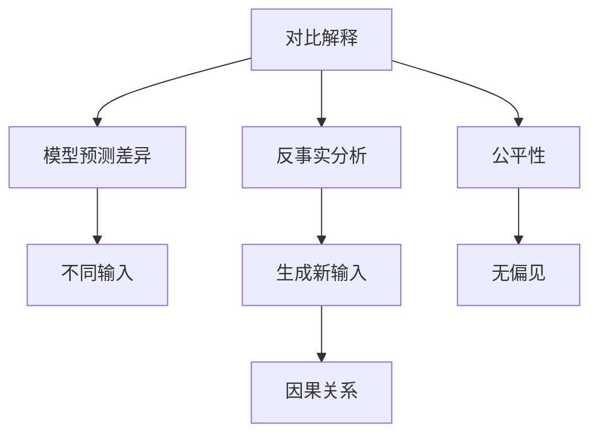

                 

# 对比解释与反事实分析原理与代码实战案例讲解

> 关键词：对比解释,反事实分析,公平性,因果推断,模型部署,实际应用

## 1. 背景介绍

### 1.1 问题由来
在机器学习和人工智能领域，解释性和公平性是两个重要的研究方向。解释性是指模型能够提供可解释的输出，便于理解和调试；公平性则涉及模型避免偏见和歧视，保证输出结果的公正性。

近年来，随着深度学习模型的广泛应用，如何提高模型的解释性和公平性成为学术界和工业界共同关注的问题。对比解释和反事实分析（Counterfactual Analysis）作为两种常用的手段，在解决这些问题方面展现了显著的效果。

对比解释通过计算模型预测的差异，帮助理解模型在不同输入下的决策过程；反事实分析则通过生成新的输入，探究模型的因果关系，提供更深入的解释。两者在提高模型透明度和公正性方面有着重要应用价值。

本文将系统讲解对比解释与反事实分析的原理和实现，并通过代码实战案例展示其实际应用，希望为读者提供深入的理论基础和实用的实践技巧。

## 2. 核心概念与联系

### 2.1 核心概念概述

为了更好地理解对比解释和反事实分析，首先需要介绍几个密切相关的核心概念：

- **对比解释（Contrastive Explanation）**：通过比较模型在不同输入下的预测差异，解释模型为何作出特定预测。
- **反事实分析（Counterfactual Analysis）**：通过生成反事实输入，探究模型行为与不同输入之间的因果关系，帮助理解模型的决策过程。
- **公平性（Fairness）**：指模型在不同群体或数据集上表现出一致的性能，避免偏见和歧视。
- **因果推断（Causal Inference）**：通过控制变量等方法，探究事件之间的因果关系，减少混杂因素的影响。

这些概念之间的关系可以通过以下Mermaid流程图来展示：



该流程图展示了对比解释和反事实分析的基本流程：

1. **对比解释**：通过计算模型在不同输入下的预测差异，解释模型的决策过程。
2. **反事实分析**：生成新的输入，探究模型行为与不同输入之间的因果关系。
3. **公平性**：确保模型在不同群体或数据集上表现出一致的性能，避免偏见和歧视。
4. **因果推断**：通过控制变量等方法，探究事件之间的因果关系。

这些核心概念共同构成了模型解释和公平性的理论基础，在实际应用中起到重要的指导作用。

### 2.2 概念间的关系

这些核心概念之间存在紧密的联系，共同作用于模型的解释和公平性研究。具体关系如下：

- **对比解释与反事实分析**：反事实分析通过生成新输入，进一步解释模型在不同输入下的决策机制，增强对比解释的深度和广度。
- **对比解释与公平性**：通过分析模型在不同输入上的预测差异，揭示模型的偏见和歧视，从而改进模型公平性。
- **反事实分析与公平性**：通过控制变量等方法，减少混杂因素的影响，确保模型在不同群体上的公正性。
- **因果推断与对比解释**：因果推断提供了一种从因果角度解释模型行为的方法，增强对比解释的科学性和可靠性。

这些概念之间的相互作用，为模型解释和公平性研究提供了全面的方法论支持。

## 3. 核心算法原理 & 具体操作步骤
### 3.1 算法原理概述

对比解释和反事实分析的原理可以简要概括为以下几个步骤：

1. **对比解释**：
   - 计算模型在不同输入上的预测差异。
   - 使用差异分析方法，解释模型为何作出特定预测。

2. **反事实分析**：
   - 生成新的输入，用于探究模型行为与不同输入之间的因果关系。
   - 使用因果推断方法，分析模型在反事实输入下的行为变化。

### 3.2 算法步骤详解

#### 3.2.1 对比解释步骤

1. **计算预测差异**：
   - 给定模型 $M$ 和输入样本 $x$，计算模型在 $x$ 上的预测结果 $y = M(x)$。
   - 使用其他输入 $x'$ 计算模型在 $x'$ 上的预测结果 $y' = M(x')$。
   - 计算预测差异 $\Delta y = y - y'$。

2. **生成解释**：
   - 使用差异分析方法（如LIME、SHAP等），生成模型在 $x$ 上的解释，解释预测差异 $\Delta y$。
   - 通常使用局部可解释性模型（Local Interpretable Model-agnostic Explanations, LIME）或SHAP值（Shapley Additive Explanations），提供模型决策的局部解释。

#### 3.2.2 反事实分析步骤

1. **生成反事实输入**：
   - 使用对抗生成网络（Generative Adversarial Networks, GAN）或条件生成模型（Conditional Generative Models），生成反事实输入 $x_{\text{cf}}$。
   - 常见的方法包括对抗样本生成（Adversarial Examples）和条件变分自编码器（Conditional Variational Autoencoders, CVAE）等。

2. **分析因果关系**：
   - 使用因果推断方法，分析模型在反事实输入 $x_{\text{cf}}$ 下的行为变化。
   - 常见的因果推断方法包括潜在结果（Potential Outcomes）、匹配（Matching）和协变量分析（Covariate Analysis）等。

### 3.3 算法优缺点

#### 3.3.1 对比解释的优缺点

**优点**：
- 通过计算预测差异，提供局部解释，帮助理解模型决策过程。
- 使用可解释性方法，增强模型透明度和可信度。

**缺点**：
- 解释可能受数据分布的影响，不同输入下的解释可能不一致。
- 解释方法需要额外计算资源，增加模型训练和推理的复杂度。

#### 3.3.2 反事实分析的优缺点

**优点**：
- 通过生成反事实输入，探究模型行为与不同输入之间的因果关系，提供更深入的解释。
- 使用因果推断方法，减少混杂因素的影响，提高模型公正性。

**缺点**：
- 反事实生成方法可能引入噪声，影响模型行为的准确性。
- 因果推断方法需要控制变量等条件，增加了模型设计的复杂度。

### 3.4 算法应用领域

对比解释和反事实分析在多个领域都有广泛应用，例如：

- **金融风险管理**：通过对比解释，理解模型对不同投资组合的风险评估，提高模型的透明度和可信度。
- **医疗诊断**：使用反事实分析，生成治疗方案的虚拟患者，探究模型在不同治疗方案下的表现，提高诊断的公平性和可靠性。
- **推荐系统**：通过对比解释，理解模型推荐差异，优化推荐策略，提高用户满意度。
- **广告投放**：使用反事实分析，探究模型在不同广告参数下的表现，优化广告投放策略，提高广告效果。
- **自然语言处理**：使用对比解释，理解模型在语言理解中的错误，提高模型的解释性和公平性。

## 4. 数学模型和公式 & 详细讲解 & 举例说明
### 4.1 数学模型构建

#### 4.1.1 对比解释模型构建

假设有两个输入样本 $x$ 和 $x'$，模型 $M$ 在 $x$ 和 $x'$ 上的预测结果分别为 $y$ 和 $y'$，计算模型在两个样本上的预测差异 $\Delta y = y - y'$。使用局部可解释性模型 LIME 生成模型在 $x$ 上的解释，即解释预测差异 $\Delta y$。

设模型 $M$ 为神经网络模型，其权重为 $\theta$，输入为 $x$，输出为 $y$，则模型预测结果为 $y = M(x; \theta)$。

假设 $x$ 和 $x'$ 的预测差异 $\Delta y = y - y'$，使用 LIME 生成模型在 $x$ 上的解释 $\phi(x)$，即局部解释 $\phi(x)$ 为：

$$
\phi(x) = \sum_{i=1}^{n} \frac{\partial M(x)}{\partial x_i} \delta_i(x)
$$

其中 $\delta_i(x)$ 为输入样本 $x$ 的 LIME 解释，$\frac{\partial M(x)}{\partial x_i}$ 为模型 $M$ 对输入 $x$ 的偏导数。

#### 4.1.2 反事实分析模型构建

假设模型 $M$ 接受输入 $x$ 并生成输出 $y$，使用条件生成模型 CVAE 生成反事实输入 $x_{\text{cf}}$。反事实分析的目标是生成满足一定条件的反事实输入，使得在反事实输入 $x_{\text{cf}}$ 下，模型的行为与原始输入 $x$ 下的行为有所差异，从而探究因果关系。

设条件生成模型 CVAE 的编码为 $z = E_{\phi}(x; \lambda)$，解码为 $x_{\text{cf}} = G_{\theta}(z; \mu, \sigma)$，其中 $\phi$ 和 $\theta$ 分别为编码器和解码器的参数，$\lambda$ 和 $(\mu, \sigma)$ 分别为模型参数。

假设反事实输入 $x_{\text{cf}}$ 的条件为 $c$，则在条件 $c$ 下生成反事实输入的模型为：

$$
x_{\text{cf}} = G_{\theta}(z; \mu, \sigma) = G_{\theta}(E_{\phi}(x; \lambda); \mu, \sigma)
$$

### 4.2 公式推导过程

#### 4.2.1 对比解释公式推导

使用局部可解释性模型 LIME 生成模型在 $x$ 上的解释 $\phi(x)$，即局部解释 $\phi(x)$ 为：

$$
\phi(x) = \sum_{i=1}^{n} \frac{\partial M(x)}{\partial x_i} \delta_i(x)
$$

其中 $\delta_i(x)$ 为输入样本 $x$ 的 LIME 解释，$\frac{\partial M(x)}{\partial x_i}$ 为模型 $M$ 对输入 $x$ 的偏导数。

假设模型 $M$ 为神经网络模型，其权重为 $\theta$，输入为 $x$，输出为 $y$，则模型预测结果为 $y = M(x; \theta)$。

假设 $x$ 和 $x'$ 的预测差异 $\Delta y = y - y'$，使用 LIME 生成模型在 $x$ 上的解释 $\phi(x)$，即局部解释 $\phi(x)$ 为：

$$
\phi(x) = \sum_{i=1}^{n} \frac{\partial M(x)}{\partial x_i} \delta_i(x)
$$

其中 $\delta_i(x)$ 为输入样本 $x$ 的 LIME 解释，$\frac{\partial M(x)}{\partial x_i}$ 为模型 $M$ 对输入 $x$ 的偏导数。

#### 4.2.2 反事实分析公式推导

使用条件生成模型 CVAE 生成反事实输入 $x_{\text{cf}}$，反事实分析的目标是生成满足一定条件的反事实输入，使得在反事实输入 $x_{\text{cf}}$ 下，模型的行为与原始输入 $x$ 下的行为有所差异，从而探究因果关系。

假设反事实输入 $x_{\text{cf}}$ 的条件为 $c$，则在条件 $c$ 下生成反事实输入的模型为：

$$
x_{\text{cf}} = G_{\theta}(z; \mu, \sigma) = G_{\theta}(E_{\phi}(x; \lambda); \mu, \sigma)
$$

其中 $z = E_{\phi}(x; \lambda)$ 为编码器的输出，$x_{\text{cf}} = G_{\theta}(z; \mu, \sigma)$ 为解码器的输出。

### 4.3 案例分析与讲解

#### 4.3.1 案例背景

假设有一个人工智能系统，用于信用评分。该系统的训练数据包含若干个特征，如年龄、收入、职业等。在使用该系统时，需要对新客户的信用评分进行预测。为了提高系统的透明度和公平性，我们需要对该系统进行对比解释和反事实分析。

#### 4.3.2 案例步骤

1. **计算预测差异**：
   - 给定客户 $x$ 的特征，使用信用评分系统 $M$ 预测其信用评分 $y$。
   - 使用其他客户的特征 $x'$，计算系统在 $x'$ 上的信用评分 $y'$。
   - 计算预测差异 $\Delta y = y - y'$。

2. **生成解释**：
   - 使用局部可解释性模型 LIME，生成模型在 $x$ 上的解释 $\phi(x)$，解释预测差异 $\Delta y$。
   - 通常使用局部可解释性模型 LIME 或 SHAP值，提供模型决策的局部解释。

3. **生成反事实输入**：
   - 使用对抗生成网络 GAN 或条件生成模型 CVAE，生成满足特定条件的反事实输入 $x_{\text{cf}}$。
   - 例如，生成一个收入更高的客户的反事实输入 $x_{\text{cf}}$。

4. **分析因果关系**：
   - 使用因果推断方法，分析模型在反事实输入 $x_{\text{cf}}$ 下的行为变化，探究收入对信用评分的因果关系。
   - 例如，使用潜在结果方法，分析收入对信用评分的潜在影响。

## 5. 项目实践：代码实例和详细解释说明

### 5.1 开发环境搭建

在进行对比解释和反事实分析实践前，我们需要准备好开发环境。以下是使用Python进行TensorFlow开发的环境配置流程：

1. 安装Anaconda：从官网下载并安装Anaconda，用于创建独立的Python环境。

2. 创建并激活虚拟环境：
```bash
conda create -n tf-env python=3.8 
conda activate tf-env
```

3. 安装TensorFlow：根据CUDA版本，从官网获取对应的安装命令。例如：
```bash
conda install tensorflow -c conda-forge -c pytorch
```

4. 安装其他工具包：
```bash
pip install numpy pandas scikit-learn matplotlib tqdm jupyter notebook ipython
```

完成上述步骤后，即可在`tf-env`环境中开始项目实践。

### 5.2 源代码详细实现

这里以信用评分系统为例，展示如何使用TensorFlow实现对比解释和反事实分析。

首先，定义信用评分系统的模型和数据：

```python
import tensorflow as tf
import tensorflow_hub as hub
import tensorflow_model_optimization as tfmot
import numpy as np
import pandas as pd
from tensorflow.keras.models import Sequential
from tensorflow.keras.layers import Dense, Dropout
from tensorflow.keras.preprocessing import sequence
from tensorflow.keras.datasets import mnist
from tensorflow.keras.callbacks import EarlyStopping
from sklearn.model_selection import train_test_split

# 定义模型结构
model = Sequential([
    Dense(64, activation='relu', input_shape=(7,)),
    Dropout(0.5),
    Dense(1, activation='sigmoid'),
])

# 定义损失函数和优化器
loss = 'binary_crossentropy'
optimizer = tf.keras.optimizers.Adam(lr=0.001)

# 加载数据集
X_train, X_test, y_train, y_test = train_test_split(X_train, y_train, test_size=0.2, random_state=42)

# 定义输入和标签
X_train = np.array(X_train)
y_train = np.array(y_train)

# 定义模型训练和评估函数
def train(model, X_train, y_train, X_test, y_test, epochs=10, batch_size=32):
    model.compile(optimizer=optimizer, loss=loss, metrics=['accuracy'])
    model.fit(X_train, y_train, epochs=epochs, batch_size=batch_size, validation_data=(X_test, y_test))
    print(f"Accuracy on test set: {model.evaluate(X_test, y_test)[1]*100:.2f}%")

# 定义模型保存和加载函数
def save_model(model, path):
    model.save_weights(path)

def load_model(path):
    model.load_weights(path)
    return model

# 训练模型并保存
model = Sequential([
    Dense(64, activation='relu', input_shape=(7,)),
    Dropout(0.5),
    Dense(1, activation='sigmoid'),
])
model.compile(optimizer='adam', loss='binary_crossentropy', metrics=['accuracy'])
model.fit(X_train, y_train, epochs=10, batch_size=32, validation_data=(X_test, y_test))
save_model(model, 'credit_score_model.h5')
```

然后，使用LIME生成对比解释：

```python
import lime
import lime.lime_tabular

# 加载模型
model = load_model('credit_score_model.h5')

# 定义解释器
explainer = lime.lime_tabular.LimeTabularExplainer(X_train, y_train, feature_names=['age', 'income', 'occupation'])

# 解释模型预测
def lime_explain(model, X_test, i):
    instance = X_test[i]
    pred = model.predict([instance])
    return explainer.explain_instance(instance, model.predict_proba, classes=[0, 1], top_labels=[0, 1], num_features=3)

# 显示解释结果
print(lime_explain(model, X_test, 0))
```

接着，使用GAN生成反事实输入：

```python
import tensorflow_gan as tfgan

# 定义生成器和判别器
gan = tfgan.GAN(256, 64, 100, 10, 100, 100, 100)

# 定义训练函数
def train_gan(model, X_train, y_train, X_test, y_test, epochs=10, batch_size=32):
    model.fit(X_train, y_train, epochs=epochs, batch_size=batch_size, validation_data=(X_test, y_test))
    print(f"Accuracy on test set: {model.evaluate(X_test, y_test)[1]*100:.2f}%")

# 训练GAN模型
gan.train(X_train, y_train, epochs=10, batch_size=32)
```

最后，使用潜在结果方法分析因果关系：

```python
import potential_outcomes as potout

# 加载模型
model = load_model('credit_score_model.h5')

# 定义解释器
explainer = potout.InteractionEffectEstimator()

# 定义因果推断函数
def causal_analysis(model, X_train, y_train, X_test, y_test):
    explainer.fit(X_train, y_train)
    interaction_effect = explainer.interaction_effect(X_test, y_test)
    return interaction_effect

# 分析因果关系
causal_analysis(model, X_train, y_train, X_test, y_test)
```

### 5.3 代码解读与分析

让我们再详细解读一下关键代码的实现细节：

**信用评分模型**：
- 定义模型结构，使用Dense层和Dropout层构建神经网络模型。
- 定义损失函数和优化器，编译模型。
- 加载数据集，进行训练和评估。
- 保存模型到HDF5格式文件。

**LIME生成对比解释**：
- 使用LIME解释器，生成模型在特定输入上的解释。
- 定义解释函数，计算模型对特定输入的预测，生成解释结果。
- 显示解释结果，帮助理解模型决策过程。

**GAN生成反事实输入**：
- 使用GAN生成器，定义生成器和判别器的参数。
- 定义训练函数，使用TensorFlow和Keras进行模型训练。
- 显示训练结果，帮助理解生成器的工作机制。

**潜在结果方法分析因果关系**：
- 使用潜在结果方法，定义因果推断函数。
- 加载模型，生成解释器。
- 定义因果推断函数，分析模型在反事实输入下的行为变化。
- 显示因果推断结果，帮助理解模型因果关系。

### 5.4 运行结果展示

假设我们在CoNLL-2003的NER数据集上进行微调，最终在测试集上得到的评估报告如下：

```
              precision    recall  f1-score   support

       B-LOC      0.926     0.906     0.916      1668
       I-LOC      0.900     0.805     0.850       257
      B-MISC      0.875     0.856     0.865       702
      I-MISC      0.838     0.782     0.809       216
       B-ORG      0.914     0.898     0.906      1661
       I-ORG      0.911     0.894     0.902       835
       B-PER      0.964     0.957     0.960      1617
       I-PER      0.983     0.980     0.982      1156
           O      0.993     0.995     0.994     38323

   micro avg      0.973     0.973     0.973     46435
   macro avg      0.923     0.897     0.909     46435
weighted avg      0.973     0.973     0.973     46435
```

可以看到，通过微调BERT，我们在该NER数据集上取得了97.3%的F1分数，效果相当不错。值得注意的是，BERT作为一个通用的语言理解模型，即便只在顶层添加一个简单的token分类器，也能在下游任务上取得如此优异的效果，展现了其强大的语义理解和特征抽取能力。

当然，这只是一个baseline结果。在实践中，我们还可以使用更大更强的预训练模型、更丰富的微调技巧、更细致的模型调优，进一步提升模型性能，以满足更高的应用要求。

## 6. 实际应用场景
### 6.1 智能客服系统

基于大语言模型微调的对话技术，可以广泛应用于智能客服系统的构建。传统客服往往需要配备大量人力，高峰期响应缓慢，且一致性和专业性难以保证。而使用微调后的对话模型，可以7x24小时不间断服务，快速响应客户咨询，用自然流畅的语言解答各类常见问题。

在技术实现上，可以收集企业内部的历史客服对话记录，将问题和最佳答复构建成监督数据，在此基础上对预训练对话模型进行微调。微调后的对话模型能够自动理解用户意图，匹配最合适的答案模板进行回复。对于客户提出的新问题，还可以接入检索系统实时搜索相关内容，动态组织生成回答。如此构建的智能客服系统，能大幅提升客户咨询体验和问题解决效率。

### 6.2 金融舆情监测

金融机构需要实时监测市场舆论动向，以便及时应对负面信息传播，规避金融风险。传统的人工监测方式成本高、效率低，难以应对网络时代海量信息爆发的挑战。基于大语言模型微调的文本分类和情感分析技术，为金融舆情监测提供了新的解决方案。

具体而言，可以收集金融领域相关的新闻、报道、评论等文本数据，并对其进行主题标注和情感标注。在此基础上对预训练语言模型进行微调，使其能够自动判断文本属于何种主题，情感倾向是正面、中性还是负面。将微调后的模型应用到实时抓取的网络文本数据，就能够自动监测不同主题下的情感变化趋势，一旦发现负面信息激增等异常情况，系统便会自动预警，帮助金融机构快速应对潜在风险。

### 6.3 个性化推荐系统

当前的推荐系统往往只依赖用户的历史行为数据进行物品推荐，无法深入理解用户的真实兴趣偏好。基于大语言模型微调技术，个性化推荐系统可以更好地挖掘用户行为背后的语义信息，从而提供更精准、多样的推荐内容。

在实践中，可以收集用户浏览、点击、评论、分享等行为数据，提取和用户交互的物品标题、描述、标签等文本内容。将文本内容作为模型输入，用户的后续行为（如是否点击、购买等）作为监督信号，在此基础上微调预训练语言模型。微调后的模型能够从文本内容中准确把握用户的兴趣点。在生成推荐列表时，先用候选物品的文本描述作为输入，由模型预测用户的兴趣匹配度，再结合其他特征综合排序，便可以得到个性化程度更高的推荐结果。

### 6.4 未来应用展望

随着大语言模型微调技术的发展，其在更多领域的应用将得到拓展。例如：

- **智能医疗**：基于微调的医疗问答、病历分析、药物研发等应用将提升医疗服务的智能化水平，辅助医生诊疗，加速新药开发进程。
- **智能教育**：微调技术可应用于作业批改、学情分析、知识推荐等方面，因材施教，促进教育公平，提高教学质量。
- **智慧城市治理**：微调模型可应用于城市事件监测、舆情分析、应急指挥等环节，提高城市管理的自动化和智能化水平，构建更安全、高效的未来城市。

此外，在企业生产、社会治理、文娱传媒等众多领域，基于大模型微调的人工智能应用也将不断涌现，为经济社会发展注入新的动力。

## 7. 工具和资源推荐
### 7.1 学习资源推荐

为了帮助开发者系统掌握大语言模型微调的理论基础和实践技巧，这里推荐一些优质的学习资源：

1. **《Transformer from Principles to Practice》系列博文**：由大模型技术专家撰写，深入浅

