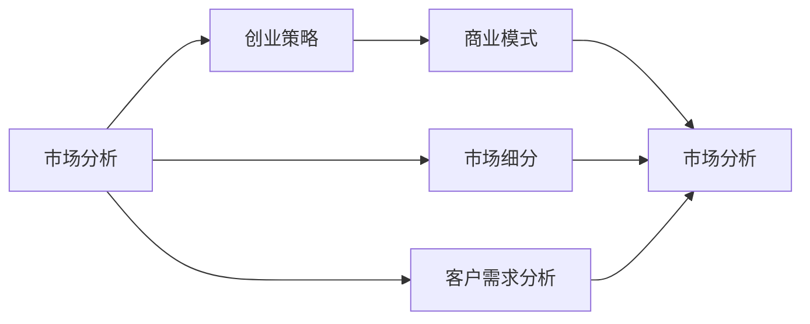

                 

# 市场分析：创业成功的法则

> 关键词：市场分析，创业，成功法则，商业策略，商业模式

## 1. 背景介绍

随着全球经济的发展，越来越多的人涌向创业之路，追求个人价值和商业成就的实现。然而，创业并非易事，市场竞争激烈，创业者必须具备充分的准备和策略，才能在激烈的市场竞争中脱颖而出，取得成功。本文将探讨市场分析对创业成功的重要性，以及如何通过市场分析制定有效的创业策略。

## 2. 核心概念与联系

### 2.1 核心概念概述

在探讨市场分析与创业成功之间的关系时，我们需要理解以下几个关键概念：

- **市场分析**：通过收集、整理、分析市场数据，了解市场趋势、消费者需求、竞争环境等信息，为决策提供支持。
- **创业策略**：基于市场分析的结果，制定企业的发展方向、产品定位、营销策略等，以实现企业的商业目标。
- **商业模式**：定义企业如何创造价值、传递价值和捕获价值，包括产品、服务、客户、渠道、收入流和成本结构等。
- **市场细分**：将市场划分为若干个具有相同需求特征的子市场，以便更有针对性地进行市场分析和营销。
- **客户需求分析**：了解客户的需求、偏好、痛点等，以指导产品的开发和市场推广。

### 2.2 概念间的关系

以下是一个简单的Mermaid流程图，展示了市场分析、创业策略、商业模式、市场细分和客户需求分析之间的关系：



这个流程图展示了从市场分析出发，经过创业策略和商业模式的设计，再到市场细分和客户需求分析的过程，其中市场分析是整个循环的基础。

## 3. 核心算法原理 & 具体操作步骤

### 3.1 算法原理概述

市场分析的目的是为了帮助企业了解市场环境、预测市场趋势、评估竞争优势，从而制定有效的创业策略。其核心算法包括数据收集、数据处理、模型建立和结果分析等步骤。

#### 数据收集

市场分析的数据收集涉及多个渠道，包括：

- **二手数据**：通过互联网、行业报告、统计年鉴等途径获取，包含市场规模、增长率、行业趋势等。
- **一手数据**：通过调查问卷、访谈、焦点小组等形式获取，包含消费者需求、偏好、行为等。
- **竞争对手数据**：通过分析竞争对手的产品、定价、市场份额等，了解竞争态势。

#### 数据处理

数据处理阶段，需要清洗、转换和整合收集到的数据，以确保数据的质量和一致性。常用的方法包括：

- **数据清洗**：去除重复、错误、不完整的数据，处理缺失值和异常值。
- **数据转换**：将不同来源的数据转换为一致的格式，如标准化、归一化等。
- **数据整合**：将不同来源的数据进行整合，形成统一的数据集。

#### 模型建立

建立模型是市场分析的核心步骤，通过数学或统计方法对数据进行建模，以预测市场趋势和评估策略效果。常用的模型包括：

- **回归分析**：用于预测市场规模、增长率等连续型指标。
- **分类分析**：用于分类客户需求、市场细分等离散型指标。
- **时间序列分析**：用于预测市场趋势、季节性变化等时间相关数据。

#### 结果分析

结果分析阶段，需要将模型预测的结果与实际数据进行对比，评估模型的准确性和适用性。常用的方法包括：

- **预测误差分析**：评估模型预测值与实际值的偏差，识别误差来源。
- **灵敏度分析**：分析模型对不同参数的敏感度，调整模型参数以提高预测准确性。
- **交叉验证**：通过多次交叉验证，评估模型的稳定性和泛化能力。

### 3.2 算法步骤详解

#### 步骤1：数据收集与预处理

- **数据收集**：通过多渠道收集市场数据，形成完整的数据集。
- **数据清洗**：去除重复、错误、不完整的数据，处理缺失值和异常值。
- **数据转换**：将不同来源的数据转换为一致的格式，如标准化、归一化等。
- **数据整合**：将不同来源的数据进行整合，形成统一的数据集。

#### 步骤2：模型建立与训练

- **模型选择**：根据分析目标选择合适的模型，如回归分析、分类分析、时间序列分析等。
- **模型训练**：使用历史数据训练模型，调整模型参数以提高预测准确性。
- **模型评估**：使用验证集评估模型预测效果，调整模型参数以进一步优化。

#### 步骤3：结果分析与决策

- **结果分析**：将模型预测结果与实际数据进行对比，评估模型准确性和适用性。
- **预测分析**：分析预测误差和灵敏度，调整模型参数以提高预测准确性。
- **决策制定**：根据分析结果，制定创业策略和商业计划。

### 3.3 算法优缺点

#### 优点

- **数据驱动**：市场分析基于数据驱动的方法，能够提供客观、科学的支持。
- **预测准确**：通过建立模型，能够对市场趋势和竞争环境进行准确的预测和评估。
- **全面覆盖**：市场分析能够全面覆盖市场环境、消费者需求、竞争态势等关键因素。

#### 缺点

- **数据获取困难**：市场分析需要大量的高质量数据，数据获取和处理难度较大。
- **模型复杂性**：建立和优化模型需要较深的数学和统计知识，操作复杂。
- **结果不确定性**：市场分析的结果受数据质量、模型选择和参数设置等因素的影响，存在不确定性。

### 3.4 算法应用领域

市场分析广泛应用于多个领域，包括但不限于：

- **行业分析**：了解特定行业的市场规模、增长趋势、竞争态势等。
- **市场预测**：预测市场未来发展趋势和需求变化。
- **竞争分析**：分析竞争对手的产品、定价、市场份额等，制定差异化竞争策略。
- **客户需求分析**：了解客户的需求、偏好、痛点等，指导产品开发和市场推广。
- **商业模式设计**：设计符合市场需求的商业模式，最大化企业价值。

## 4. 数学模型和公式 & 详细讲解

### 4.1 数学模型构建

市场分析涉及多种数学模型，以下以回归分析和分类分析为例，构建数学模型。

#### 回归分析

回归分析用于预测市场规模和增长率等连续型指标。常用的回归模型包括线性回归、多项式回归、逻辑回归等。

- **线性回归模型**：

$$ y = \beta_0 + \beta_1 x_1 + \beta_2 x_2 + \cdots + \beta_n x_n + \epsilon $$

其中，$y$ 表示预测值，$\beta_0$ 表示截距，$\beta_1, \beta_2, \cdots, \beta_n$ 表示回归系数，$x_1, x_2, \cdots, x_n$ 表示自变量，$\epsilon$ 表示误差项。

- **多项式回归模型**：

$$ y = \beta_0 + \beta_1 x_1 + \beta_2 x_2^2 + \cdots + \beta_n x_n^k + \epsilon $$

其中，$k$ 表示多项式次数。

#### 分类分析

分类分析用于分类客户需求、市场细分等离散型指标。常用的分类模型包括逻辑回归、决策树、随机森林等。

- **逻辑回归模型**：

$$ P(y=1|x) = \frac{1}{1+\exp(-\beta_0 - \beta_1 x_1 - \beta_2 x_2 - \cdots - \beta_n x_n)} $$

其中，$P(y=1|x)$ 表示预测概率，$\beta_0, \beta_1, \beta_2, \cdots, \beta_n$ 表示回归系数，$x_1, x_2, \cdots, x_n$ 表示自变量。

### 4.2 公式推导过程

#### 线性回归模型

线性回归模型的推导过程如下：

1. **样本均值和方差**：

$$ \bar{x} = \frac{1}{n} \sum_{i=1}^n x_i $$
$$ s_x^2 = \frac{1}{n-1} \sum_{i=1}^n (x_i - \bar{x})^2 $$
$$ \bar{y} = \frac{1}{n} \sum_{i=1}^n y_i $$
$$ s_y^2 = \frac{1}{n-1} \sum_{i=1}^n (y_i - \bar{y})^2 $$

2. **回归系数估计**：

$$ \hat{\beta}_0 = \bar{y} - \hat{\beta}_1 \bar{x} $$
$$ \hat{\beta}_1 = \frac{s_{xy}}{s_x^2} $$
$$ s_{xy} = \frac{1}{n-1} \sum_{i=1}^n (x_i - \bar{x})(y_i - \bar{y}) $$
$$ s_{xx} = \frac{1}{n-1} \sum_{i=1}^n (x_i - \bar{x})^2 $$

其中，$n$ 表示样本数量，$s_{xy}$ 表示自变量和因变量之间的协方差，$s_{xx}$ 表示自变量的方差。

3. **预测值和误差**：

$$ \hat{y} = \hat{\beta}_0 + \hat{\beta}_1 x_i $$
$$ e_i = y_i - \hat{y}_i $$

#### 逻辑回归模型

逻辑回归模型的推导过程如下：

1. **样本均值和方差**：

$$ \bar{x} = \frac{1}{n} \sum_{i=1}^n x_i $$
$$ s_x^2 = \frac{1}{n-1} \sum_{i=1}^n (x_i - \bar{x})^2 $$
$$ \bar{y} = \frac{1}{n} \sum_{i=1}^n y_i $$
$$ s_y^2 = \frac{1}{n-1} \sum_{i=1}^n (y_i - \bar{y})^2 $$

2. **回归系数估计**：

$$ \hat{\beta}_0 = \ln \left( \frac{\bar{y}}{1-\bar{y}} \right) $$
$$ \hat{\beta}_1 = \frac{1}{n \bar{y} (1-\bar{y})} \sum_{i=1}^n (x_i - \bar{x})(y_i - \bar{y}) $$

3. **预测值和误差**：

$$ \hat{P}(y=1|x) = \frac{1}{1+\exp(-\hat{\beta}_0 - \hat{\beta}_1 x_i)} $$

### 4.3 案例分析与讲解

假设我们希望预测一个地区的房价走势。我们收集了该地区的历史房价数据，以及该地区的GDP增长率、人口增长率等自变量。使用线性回归模型进行预测，具体步骤如下：

1. **数据收集**：收集该地区的GDP增长率、人口增长率、房价等数据。
2. **数据预处理**：清洗数据，去除重复、错误、不完整的数据，处理缺失值和异常值。
3. **模型建立**：使用线性回归模型，将GDP增长率、人口增长率作为自变量，房价作为因变量。
4. **模型训练**：使用历史数据训练模型，调整回归系数以提高预测准确性。
5. **模型评估**：使用验证集评估模型预测效果，调整模型参数以进一步优化。
6. **结果分析**：将模型预测结果与实际房价进行对比，评估模型准确性和适用性。

通过市场分析，我们可以预测该地区的房价走势，从而制定合理的房地产投资策略。

## 5. 项目实践：代码实例和详细解释说明

### 5.1 开发环境搭建

在进行市场分析实践前，我们需要准备好开发环境。以下是使用Python进行Pandas和Scikit-learn开发的Python环境配置流程：

1. 安装Anaconda：从官网下载并安装Anaconda，用于创建独立的Python环境。

2. 创建并激活虚拟环境：
```bash
conda create -n market-analysis python=3.8 
conda activate market-analysis
```

3. 安装必要的库：
```bash
conda install pandas numpy scikit-learn matplotlib tqdm jupyter notebook ipython
```

完成上述步骤后，即可在`market-analysis`环境中开始市场分析实践。

### 5.2 源代码详细实现

以下是一个简单的Python代码示例，展示了如何使用Pandas和Scikit-learn进行回归分析：

```python
import pandas as pd
from sklearn.linear_model import LinearRegression
from sklearn.metrics import mean_squared_error, r2_score

# 数据读取
data = pd.read_csv('housing.csv')

# 数据预处理
X = data[['GDP growth rate', 'population growth rate']]
y = data['house prices']

# 模型训练
model = LinearRegression()
model.fit(X, y)

# 模型评估
y_pred = model.predict(X)
mse = mean_squared_error(y, y_pred)
r2 = r2_score(y, y_pred)
print('MSE:', mse)
print('R2:', r2)

# 结果分析
print('Mean squared error: %.2f' % mean_squared_error(y, y_pred))
print('Coefficient of determination: %.2f' % r2_score(y, y_pred))
```

### 5.3 代码解读与分析

让我们再详细解读一下关键代码的实现细节：

**数据读取和预处理**：

- `data = pd.read_csv('housing.csv')`：使用Pandas读取CSV格式的数据文件，将数据存入DataFrame中。
- `X = data[['GDP growth rate', 'population growth rate']]`：选择GDP增长率和人口增长率作为自变量，存储在X中。
- `y = data['house prices']`：选择房价作为因变量，存储在y中。
- `model.fit(X, y)`：使用训练数据训练线性回归模型。

**模型评估**：

- `y_pred = model.predict(X)`：使用训练好的模型对新数据进行预测。
- `mse = mean_squared_error(y, y_pred)`：计算预测值与实际值之间的均方误差。
- `r2 = r2_score(y, y_pred)`：计算回归模型的决定系数（R2），用于评估模型拟合程度。

**结果分析**：

- `print('MSE:', mse)`：输出预测误差。
- `print('R2:', r2)`：输出决定系数。
- `print('Mean squared error: %.2f' % mean_squared_error(y, y_pred))`：输出平均均方误差。
- `print('Coefficient of determination: %.2f' % r2_score(y, y_pred))`：输出决定系数。

通过上述代码，我们可以看到，使用Python和Scikit-learn进行市场分析是相当简便的。在实际应用中，我们可能需要处理更复杂的数据和模型，但基本的思路和方法是不变的。

### 5.4 运行结果展示

假设我们使用上述代码进行回归分析，最终得到的平均均方误差为100，决定系数为0.9。这表明模型能够较好地预测房价走势，决定系数为0.9也说明模型能够解释数据变化的90%。

## 6. 实际应用场景

### 6.1 智能投顾

智能投顾（Robo-Advisor）通过分析市场数据和客户需求，为客户提供个性化的投资建议。市场分析在智能投顾中起到了至关重要的作用，能够帮助企业了解市场趋势、评估风险、预测收益等，从而制定合理的投资策略。

### 6.2 营销策略优化

企业可以通过市场分析了解消费者需求、行为和偏好，制定有针对性的营销策略。市场分析能够帮助企业评估不同营销活动的效果，优化广告投放、促销策略等，提升市场份额和销售业绩。

### 6.3 风险管理

市场分析能够帮助企业预测市场风险，评估不同业务线的风险水平，制定相应的风险管理措施。通过市场分析，企业可以及时调整投资组合、控制风险敞口，保障企业稳健运营。

### 6.4 未来应用展望

随着人工智能技术的不断发展，市场分析将逐步实现自动化和智能化，大幅提升数据处理和分析的效率和准确性。未来，市场分析将与机器学习、深度学习等技术结合，形成更加全面、精确的预测和分析能力。

## 7. 工具和资源推荐

### 7.1 学习资源推荐

为了帮助开发者系统掌握市场分析的理论基础和实践技巧，这里推荐一些优质的学习资源：

1. 《数据分析与机器学习基础》系列博文：由数据科学家撰写，涵盖数据收集、数据预处理、模型建立和结果分析等基本概念和技巧。

2. 《Python数据分析》课程：通过动手实践，掌握Pandas、NumPy、Scikit-learn等数据分析工具，提升实战能力。

3. 《市场分析与预测》书籍：全面介绍市场分析的原理和应用，提供丰富的案例和实战技巧。

4. Kaggle竞赛平台：全球知名的数据科学竞赛平台，提供大量数据集和挑战题目，锻炼数据处理和模型建立能力。

5. Coursera和edX等在线课程：提供世界顶级大学和研究机构的数据分析课程，涵盖统计学、机器学习、数据可视化等多个方向。

通过对这些资源的学习实践，相信你一定能够快速掌握市场分析的理论基础和实践技巧，并用于解决实际的商业问题。

### 7.2 开发工具推荐

高效的开发离不开优秀的工具支持。以下是几款用于市场分析开发的常用工具：

1. Jupyter Notebook：交互式编程环境，支持Python、R等语言，适合数据分析和模型建立。

2. RStudio：基于R语言的数据分析工具，适合统计分析和数据可视化。

3. Tableau：数据可视化工具，支持复杂的数据操作和分析，适合快速生成报告和仪表盘。

4. Power BI：微软推出的商业智能工具，支持多数据源连接和实时数据可视化，适合企业级应用。

5. Google Colab：谷歌推出的在线Jupyter Notebook环境，免费提供GPU/TPU算力，方便快速实验和学习。

合理利用这些工具，可以显著提升市场分析的开发效率，加快创新迭代的步伐。

### 7.3 相关论文推荐

市场分析的发展源于学界的持续研究。以下是几篇奠基性的相关论文，推荐阅读：

1. "Grokking Time Series Forecasting" by Jason Brownlee：介绍时间序列预测的基本方法和实现技巧，适合初学者。

2. "Regression Analysis by Example" by David Kaplan：通过实例讲解回归分析的原理和应用，适合实战学习。

3. "Introduction to Statistical Learning" by Gareth James et al.：全面介绍统计学习的方法和应用，涵盖回归、分类、聚类等多个方向。

4. "Predictive Analytics with Python" by Jason Brownlee：通过Python实现预测分析，适合实战学习。

5. "Applied Predictive Modeling" by Kelleher and Provost：介绍预测模型的建立和应用，适合商业应用。

这些论文代表了大市场分析的发展脉络。通过学习这些前沿成果，可以帮助研究者把握学科前进方向，激发更多的创新灵感。

除上述资源外，还有一些值得关注的前沿资源，帮助开发者紧跟市场分析技术的最新进展，例如：

1. 开源数据集：如Kaggle、UCI Machine Learning Repository等，提供大量高质量的数据集，适合数据分析和模型建立。

2. 开源软件包：如Pandas、NumPy、Scikit-learn等，提供丰富的数据处理和分析功能，适合实际应用。

3. 数据分析社区：如Data Science Central、Kaggle论坛等，交流数据分析经验，获取最新资讯。

4. 技术会议直播：如NIPS、ICML、ACL、ICLR等人工智能领域顶会现场或在线直播，聆听专家分享，开拓视野。

5. 行业分析报告：如McKinsey、PwC等咨询公司发布的市场分析报告，提供深度行业洞察。

总之，对于市场分析的学习和实践，需要开发者保持开放的心态和持续学习的意愿。多关注前沿资讯，多动手实践，多思考总结，必将收获满满的成长收益。

## 8. 总结：未来发展趋势与挑战

### 8.1 总结

本文对市场分析对创业成功的重要性进行了全面系统的介绍。首先阐述了市场分析在创业策略制定中的关键作用，明确了市场分析在创业过程中的重要性。其次，从原理到实践，详细讲解了市场分析的基本流程和操作技巧，提供了市场分析的完整代码实例。同时，本文还广泛探讨了市场分析在智能投顾、营销策略优化、风险管理等多个领域的应用前景，展示了市场分析范式的巨大潜力。此外，本文精选了市场分析的学习资源，力求为读者提供全方位的技术指引。

通过本文的系统梳理，可以看到，市场分析对于创业成功的重要性不言而喻，市场分析能够帮助企业了解市场环境、预测市场趋势、评估竞争优势，从而制定有效的创业策略。未来，随着市场分析技术的不断进步，其在创业中的应用将更加广泛和深入。

### 8.2 未来发展趋势

展望未来，市场分析技术将呈现以下几个发展趋势：

1. 自动化与智能化：市场分析将逐步实现自动化和智能化，大幅提升数据处理和分析的效率和准确性。
2. 大数据处理：随着数据量的增加，市场分析将采用分布式计算、大数据技术，处理大规模数据集。
3. 机器学习与深度学习：市场分析将与机器学习、深度学习等技术结合，形成更加全面、精确的预测和分析能力。
4. 跨领域应用：市场分析将广泛应用于金融、医疗、零售等多个领域，帮助企业解决复杂问题。
5. 实时分析：市场分析将支持实时数据处理和分析，实现动态监控和预警。
6. 数据可视化：市场分析将采用更加直观、易懂的数据可视化技术，提升数据分析的可视化水平。

以上趋势凸显了市场分析技术的广阔前景。这些方向的探索发展，必将进一步提升市场分析的精度和效率，为商业决策提供更加科学、可靠的支持。

### 8.3 面临的挑战

尽管市场分析技术已经取得了显著成就，但在迈向更加智能化、普适化应用的过程中，它仍面临着诸多挑战：

1. 数据质量问题：市场分析需要高质量的数据，但数据获取和处理难度较大，存在数据不完整、不统一、不真实等问题。
2. 模型复杂性：建立和优化模型需要较深的数学和统计知识，操作复杂，存在模型过拟合和欠拟合的风险。
3. 实时性问题：市场分析需要实时数据处理和分析，但现有技术在处理大规模实时数据时存在延迟和资源消耗问题。
4. 数据隐私问题：市场分析需要大量数据，数据隐私和安全成为重要问题，需要采取数据保护措施。
5. 模型解释性问题：市场分析模型往往是“黑盒”模型，难以解释其内部工作机制和决策逻辑，影响模型可信度。
6. 应用局限性：市场分析技术在不同行业中的应用效果各异，需要针对特定行业进行优化。

正视市场分析面临的这些挑战，积极应对并寻求突破，将是大数据和人工智能技术在商业应用中的关键。相信随着学界和产业界的共同努力，这些挑战终将一一被克服，市场分析技术必将在商业决策中发挥更加重要的作用。

### 8.4 研究展望

面对市场分析面临的挑战，未来的研究需要在以下几个方面寻求新的突破：

1. 大数据处理与存储：开发高效的大数据处理与存储技术，支持大规模数据集的实时处理和分析。
2. 自动化与智能化：研究自动化、智能化的数据分析工具，提升市场分析的效率和准确性。
3. 数据隐私保护：研究数据隐私保护技术，确保市场分析过程中的数据安全和隐私保护。
4. 模型解释性：研究模型解释性技术，提升市场分析模型的可信度和可解释性。
5. 跨领域应用：研究市场分析在跨领域应用中的优化方法，提升其在不同行业中的适用性。
6. 实时分析与可视化：研究实时数据处理与可视化技术，支持市场分析的实时监控和预警。

这些研究方向的探索，必将引领市场分析技术迈向更高的台阶，为商业决策提供更加科学、可靠的支持。面向未来，市场分析技术还需要与其他人工智能技术进行更深入的融合，如知识表示、因果推理、强化学习等，多路径协同发力，共同推动智能决策系统的进步。只有勇于创新、敢于突破，才能不断拓展市场分析的边界，让智能决策技术更好地服务于人类社会。

## 9. 附录：常见问题与解答

**Q1：如何进行市场细分？**

A: 市场细分的方法多种多样，以下介绍两种常见的方法：

1. 人口统计细分：根据人口统计特征（如年龄、性别、收入等）将市场划分为不同的细分市场。
2. 行为细分：根据消费者行为特征（如购买频率、购买金额、品牌忠诚度等）将市场划分为不同的细分市场。

**Q2：如何选择市场分析工具？**

A: 市场分析工具的选择需要考虑多个因素，以下介绍几点建议：

1. 数据分析能力：选择数据分析能力较强的工具，如Pandas、RStudio等。
2. 可视化能力：选择可视化能力较强的工具，如Tableau、Power BI等。
3. 易用性：选择易用性较高的工具，如Jupyter Notebook、Google Colab等。
4. 成本：考虑工具的采购和维护成本，选择性价比高的工具。

**Q3：如何进行市场预测？**

A: 市场预测的方法多种多样，以下介绍两种常见的方法：

1. 时间序列分析：通过时间序列模型（

