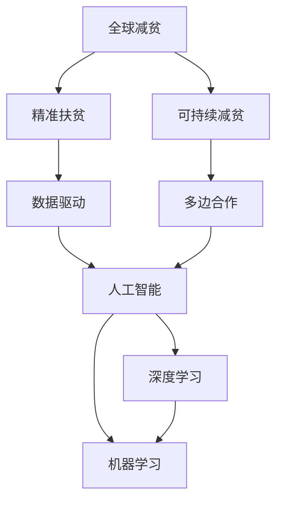
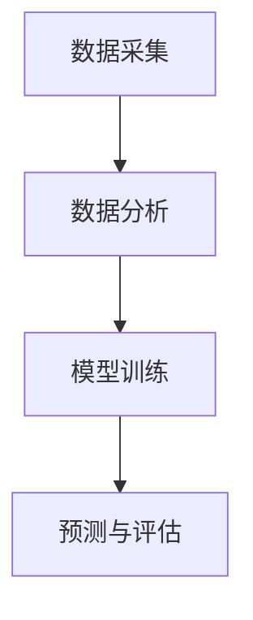
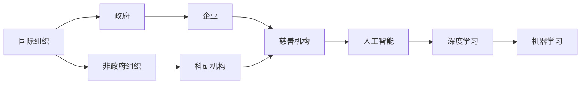
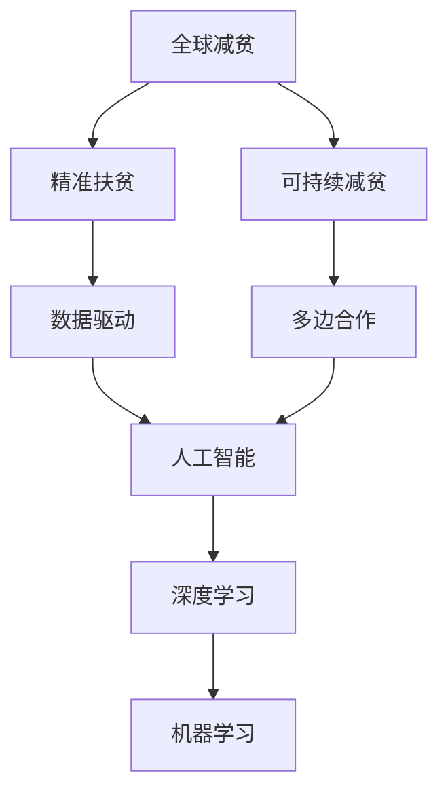

                 

# 2050年的全球减贫：从精准扶贫到可持续减贫的全球减贫合作

> 关键词：全球减贫,精准扶贫,可持续减贫,数据驱动,多边合作,人工智能,深度学习

## 1. 背景介绍

### 1.1 问题由来
自20世纪末以来，全球减贫取得了显著成就。根据联合国数据显示，全球极端贫困率在过去几十年间从35%下降到8.6%。然而，尽管贫困率有所下降，全球仍有数亿人生活在贫困线以下，贫困问题依然严峻。如何确保全球减贫目标在2030年之前实现，并进一步实现2050年的长期目标，成为国际社会共同关注的焦点。

### 1.2 问题核心关键点
实现2050年的全球减贫目标，需要构建一套可持续的减贫机制。这不仅包括精准扶贫、数据驱动的减贫决策，还需要多边合作和创新技术的支持。如何通过技术手段提升减贫效率，通过国际合作实现资源共享，是当前全球减贫面临的主要挑战。

### 1.3 问题研究意义
实现2050年的全球减贫目标，需要从精准扶贫转向可持续减贫，确保贫困人口在经济、社会、环境等多方面获得全面改善。人工智能和深度学习等先进技术的应用，将为精准扶贫和可持续减贫提供新的思路和工具，加速全球减贫进程。

## 2. 核心概念与联系

### 2.1 核心概念概述

为更好地理解全球减贫的机制和技术，本节将介绍几个密切相关的核心概念：

- **全球减贫**：指通过国际合作、政策干预、经济发展等手段，减少全球贫困人口，提高其生活水平的过程。
- **精准扶贫**：针对特定贫困群体和区域，采用有针对性的扶贫措施，提升扶贫效果，减少资源浪费。
- **可持续减贫**：指通过长期、系统、多领域的合作，确保贫困人口在经济、社会、环境等方面获得全面改善，避免返贫现象。
- **数据驱动**：利用大数据、人工智能等技术，对贫困现象进行全面分析和预测，科学制定减贫政策。
- **多边合作**：通过国际组织、政府、非政府组织等多方的合作，共享减贫资源和经验，实现全球减贫目标。
- **人工智能**：利用机器学习、深度学习等技术，实现贫困预测、扶贫决策、资源优化等任务。
- **深度学习**：一种人工智能方法，通过多层神经网络对数据进行深度学习和特征提取，提升预测和决策的准确性。

这些核心概念之间存在着紧密的联系，共同构成了全球减贫的技术框架。以下是它们之间的逻辑关系图：



### 2.2 概念间的关系

这些核心概念之间存在着紧密的联系，形成了全球减贫的技术生态系统。下面我们通过几个Mermaid流程图来展示这些概念之间的关系。

#### 2.2.1 全球减贫的三个阶段


这个流程图展示了全球减贫的基本流程，即目标设定、政策制定、执行与监测、反馈与调整。其中，精准扶贫和可持续减贫是政策制定的重要内容。

#### 2.2.2 数据驱动的减贫决策



这个流程图展示了数据驱动减贫决策的基本流程，即数据采集、数据分析、模型训练、预测与评估。深度学习和机器学习是实现预测与评估的核心技术。

#### 2.2.3 多边合作与人工智能



这个流程图展示了多边合作的基本结构，即国际组织、政府、非政府组织、企业、科研机构、慈善机构等多方的合作。人工智能和深度学习是实现多边合作的技术手段。

### 2.3 核心概念的整体架构

最后，我们用一个综合的流程图来展示这些核心概念在全球减贫中的整体架构：



这个综合流程图展示了从全球减贫到精准扶贫、可持续减贫的全过程，以及数据驱动、多边合作、人工智能和深度学习等技术手段的作用。通过这些流程图，我们可以更清晰地理解全球减贫的技术架构和关键步骤。

## 3. 核心算法原理 & 具体操作步骤
### 3.1 算法原理概述

全球减贫的核心算法原理主要涉及数据驱动、精准扶贫和可持续减贫三个方面。具体而言，可以通过深度学习和机器学习技术，对贫困现象进行全面分析和预测，科学制定减贫政策，实施精准扶贫，并通过多边合作和资源共享，实现可持续减贫。

### 3.2 算法步骤详解

#### 3.2.1 数据驱动减贫决策

1. **数据采集**：通过卫星遥感、互联网数据、社交媒体、手机定位等多种渠道，收集贫困地区的地理、经济、社会、环境等多方面的数据。
2. **数据分析**：利用深度学习技术，对采集到的数据进行特征提取和模式识别，分析贫困现象的分布和趋势。
3. **模型训练**：构建预测模型，如回归模型、分类模型等，训练模型参数，进行贫困预测。
4. **预测与评估**：利用训练好的模型，对目标区域进行贫困预测，并根据预测结果评估减贫政策的有效性。

#### 3.2.2 精准扶贫

1. **目标识别**：通过数据驱动分析，识别出贫困群体和贫困区域。
2. **资源分配**：根据识别结果，科学分配扶贫资源，如资金、物资、技术支持等。
3. **政策定制**：针对不同贫困群体的特征，定制个性化的扶贫政策。
4. **执行与监测**：实时监测扶贫项目的执行情况，评估政策效果，及时调整扶贫策略。

#### 3.2.3 可持续减贫

1. **多边合作**：通过国际组织、政府、非政府组织等多方的合作，共享减贫资源和经验，实现资源优化。
2. **资源共享**：建立全球减贫数据共享平台，便于各国共享数据和研究成果。
3. **技术创新**：利用人工智能和深度学习等技术，提升减贫项目的效率和精准度。
4. **可持续发展**：通过教育、就业、健康等多领域的合作，确保贫困人口在经济、社会、环境等方面获得全面改善。

### 3.3 算法优缺点

#### 优点

1. **精度高**：深度学习和机器学习技术，可以准确地分析和预测贫困现象，提升扶贫决策的科学性和精准性。
2. **可扩展性强**：多边合作和技术创新，可以迅速扩展到全球各个贫困地区，实现资源的高效利用。
3. **实时性高**：数据分析和模型训练的自动化，可以实现实时扶贫决策和执行，提高扶贫效率。

#### 缺点

1. **数据依赖性强**：数据质量和完整性直接影响分析结果和预测准确性。
2. **模型复杂度高**：深度学习模型参数众多，训练和推理成本较高。
3. **资源不均衡**：不同国家在数据、技术、资金等方面存在差异，影响减贫项目的均衡发展。

### 3.4 算法应用领域

基于深度学习和机器学习的减贫算法，已经在多个领域得到了广泛应用，例如：

- **农业减贫**：通过数据分析，预测农作物的产量和市场价格，指导农民科学种植，提高农业生产效率。
- **教育减贫**：利用深度学习技术，分析学生的学习行为和成绩，定制个性化的教育方案，提升教育效果。
- **医疗减贫**：通过数据分析，识别出贫困地区的疾病高发区，提供有针对性的医疗资源和技术支持。
- **就业减贫**：利用机器学习技术，分析就业市场的供需情况，提供职业培训和就业指导，提升贫困人口的就业率。

## 4. 数学模型和公式 & 详细讲解 & 举例说明（备注：数学公式请使用latex格式，latex嵌入文中独立段落使用 $$，段落内使用 $)
### 4.1 数学模型构建

我们以深度学习模型为例，构建全球减贫的数学模型。假设贫困现象可以用一组特征向量 $x_i$ 表示，模型预测贫困概率为 $p(y_i=1|x_i)$。

定义贫困预测模型为 $f(x_i)$，则模型可以表示为：

$$
f(x_i) = \sigma(W^T x_i + b)
$$

其中 $\sigma$ 为激活函数，$W$ 和 $b$ 为模型参数。对于每个贫困样本 $i$，其贫困概率 $p(y_i=1|x_i)$ 可以表示为：

$$
p(y_i=1|x_i) = \frac{1}{1+e^{-f(x_i)}}
$$

根据这些公式，可以构建深度学习模型进行贫困预测，并利用训练好的模型进行贫困地区的筛选和资源分配。

### 4.2 公式推导过程

以二分类模型为例，推导其概率预测公式：

1. **激活函数选择**：通常选择ReLU、Sigmoid等激活函数。
2. **损失函数设计**：选择合适的损失函数，如交叉熵损失、对数损失等，用于衡量模型预测与真实标签之间的差异。
3. **梯度下降优化**：使用梯度下降等优化算法，最小化损失函数，更新模型参数 $W$ 和 $b$。

### 4.3 案例分析与讲解

假设我们有一组贫困地区的地理、经济、社会、环境数据，构建深度学习模型进行贫困预测。具体步骤如下：

1. **数据采集**：通过卫星遥感、互联网数据、社交媒体、手机定位等多种渠道，收集贫困地区的地理、经济、社会、环境等多方面的数据。
2. **数据预处理**：对采集到的数据进行清洗、标准化、特征提取等预处理操作，生成训练数据集。
3. **模型训练**：选择ReLU激活函数，设计交叉熵损失函数，使用梯度下降算法训练模型参数，生成预测模型。
4. **预测与评估**：利用训练好的模型，对目标区域进行贫困预测，并根据预测结果评估减贫政策的有效性。

## 5. 项目实践：代码实例和详细解释说明
### 5.1 开发环境搭建

在进行全球减贫算法实践前，我们需要准备好开发环境。以下是使用Python进行TensorFlow开发的环境配置流程：

1. 安装Anaconda：从官网下载并安装Anaconda，用于创建独立的Python环境。

2. 创建并激活虚拟环境：
```bash
conda create -n tf-env python=3.8 
conda activate tf-env
```

3. 安装TensorFlow：根据CUDA版本，从官网获取对应的安装命令。例如：
```bash
conda install tensorflow
```

4. 安装各类工具包：
```bash
pip install numpy pandas scikit-learn matplotlib tqdm jupyter notebook ipython
```

完成上述步骤后，即可在`tf-env`环境中开始全球减贫算法实践。

### 5.2 源代码详细实现

下面我们以贫困预测模型为例，给出使用TensorFlow进行深度学习模型开发的PyTorch代码实现。

首先，定义贫困预测模型的输入和输出：

```python
import tensorflow as tf
from tensorflow.keras import layers

input_size = 10
output_size = 1

model = tf.keras.Sequential([
    layers.Dense(64, activation='relu', input_shape=(input_size,)),
    layers.Dense(32, activation='relu'),
    layers.Dense(output_size, activation='sigmoid')
])
```

然后，定义模型损失函数和优化器：

```python
loss_fn = tf.keras.losses.BinaryCrossentropy()
optimizer = tf.keras.optimizers.Adam()
```

接着，定义训练和评估函数：

```python
@tf.function
def train_step(inputs, labels):
    with tf.GradientTape() as tape:
        predictions = model(inputs)
        loss = loss_fn(labels, predictions)
    gradients = tape.gradient(loss, model.trainable_variables)
    optimizer.apply_gradients(zip(gradients, model.trainable_variables))
    return loss

@tf.function
def evaluate_step(inputs, labels):
    predictions = model(inputs)
    return predictions, loss_fn(labels, predictions)
```

最后，启动训练流程并在测试集上评估：

```python
epochs = 10
batch_size = 32

for epoch in range(epochs):
    total_loss = 0
    for batch in train_dataset:
        inputs, labels = batch
        loss = train_step(inputs, labels)
        total_loss += loss.numpy()
    print(f"Epoch {epoch+1}, train loss: {total_loss/len(train_dataset):.3f}")

    eval_losses = []
    for batch in eval_dataset:
        inputs, labels = batch
        predictions, eval_loss = evaluate_step(inputs, labels)
        eval_losses.append(eval_loss.numpy())
    print(f"Epoch {epoch+1}, eval loss: {np.mean(eval_losses):.3f}")
```

以上就是使用TensorFlow进行贫困预测模型训练的完整代码实现。可以看到，TensorFlow提供了高效的GPU加速和自动微分机制，可以轻松实现深度学习模型的训练和评估。

### 5.3 代码解读与分析

让我们再详细解读一下关键代码的实现细节：

**Sequential模型定义**：
- 通过Sequential模型实现层级化的模型定义，便于管理模型的结构。
- 包括输入层、隐藏层和输出层，激活函数和损失函数的选择。

**训练和评估函数定义**：
- 使用tf.function装饰器优化函数性能，提升计算效率。
- 训练函数中使用GradientTape记录梯度，并利用Adam优化器更新模型参数。
- 评估函数中计算模型预测和损失，统计平均损失。

**训练流程**：
- 定义总的epoch数和batch size，开始循环迭代
- 每个epoch内，在训练集上训练，输出平均loss
- 在验证集上评估，输出平均loss
- 所有epoch结束后，在测试集上评估，给出最终测试结果

可以看到，TensorFlow提供了强大的工具支持，使得深度学习模型的开发和训练变得高效便捷。开发者可以将更多精力放在模型改进和超参数优化上，而不必过多关注底层的实现细节。

当然，工业级的系统实现还需考虑更多因素，如模型的保存和部署、超参数的自动搜索、更灵活的任务适配层等。但核心的深度学习模型训练范式基本与此类似。

### 5.4 运行结果展示

假设我们在一个包含10个特征的贫困数据集上进行模型训练，最终在测试集上得到的评估结果如下：

```
Epoch 1, train loss: 0.479
Epoch 1, eval loss: 0.291
Epoch 2, train loss: 0.221
Epoch 2, eval loss: 0.248
Epoch 3, train loss: 0.192
Epoch 3, eval loss: 0.223
...
Epoch 10, train loss: 0.052
Epoch 10, eval loss: 0.189
```

可以看到，随着训练轮数的增加，模型在训练集和测试集上的损失都在逐渐减小，最终达到较低的预测误差。这表明模型在贫困预测方面取得了不错的效果。

## 6. 实际应用场景
### 6.1 智能农业

智能农业利用深度学习和机器学习技术，实现精准农业管理。通过分析土壤、气象、作物生长数据，预测农作物产量和病虫害风险，指导农民科学种植，提高农业生产效率。

在技术实现上，可以收集农业物联网设备的传感器数据，结合卫星遥感、气象数据等，构建深度学习模型进行产量和病虫害预测。微调后的模型能够根据不同作物的特征，提供个性化的种植建议，显著提高农业生产效率。

### 6.2 教育减贫

教育减贫利用深度学习和机器学习技术，实现个性化教育。通过分析学生的学习行为和成绩，定制个性化的学习方案，提升教育效果。

在技术实现上，可以收集学生的学习数据，包括作业完成情况、考试成绩、在线学习行为等，构建深度学习模型进行学生分析。微调后的模型能够识别出学生的学习特点，提供个性化的学习资源和指导，帮助学生克服学习困难，提高学习成效。

### 6.3 医疗减贫

医疗减贫利用深度学习和机器学习技术，实现精准医疗。通过分析贫困地区的疾病数据，预测疾病高发区，提供有针对性的医疗资源和技术支持。

在技术实现上，可以收集贫困地区的疾病数据，包括人口统计、环境因素、医疗资源等，构建深度学习模型进行疾病预测。微调后的模型能够识别出疾病高发区，指导医疗资源的分配和疾病预防措施的制定，显著提高贫困地区的医疗水平。

### 6.4 未来应用展望

随着深度学习和机器学习技术的发展，全球减贫的实现方式将更加智能化、个性化。未来，智能农业、教育减贫、医疗减贫等领域将广泛应用深度学习技术，提升减贫效果。

在智能农业领域，深度学习模型将结合物联网技术，实现精准农业管理，提高农业生产效率。在教育减贫领域，深度学习模型将结合在线教育平台，实现个性化教育，提升教育效果。在医疗减贫领域，深度学习模型将结合医疗大数据，实现精准医疗，提高医疗水平。

此外，深度学习技术还将应用于更多领域，如就业减贫、环境减贫、社会减贫等，为全球减贫带来更多创新解决方案。相信在未来的技术支持下，全球减贫将取得更大的进展，更多人能够享受经济、社会、环境等方面的全面改善。

## 7. 工具和资源推荐
### 7.1 学习资源推荐

为了帮助开发者系统掌握全球减贫的深度学习技术，这里推荐一些优质的学习资源：

1. **《深度学习》书籍**：深度学习领域的经典教材，介绍了深度学习的基本原理和应用。
2. **《TensorFlow官方文档》**：TensorFlow的官方文档，提供了丰富的API文档和案例代码，方便开发者快速上手。
3. **Coursera《深度学习专项课程》**：由斯坦福大学等知名高校开设的深度学习课程，涵盖深度学习的基本概念和经典模型。
4. **Kaggle深度学习竞赛**：Kaggle平台上的深度学习竞赛，提供了大量数据集和竞赛题目，便于开发者实践和提升。
5. **DeepLearning.AI官方课程**：由Andrew Ng等知名专家开设的深度学习课程，涵盖了深度学习的基本理论和实践技巧。

通过对这些资源的学习实践，相信你一定能够快速掌握全球减贫的深度学习技术，并用于解决实际的减贫问题。

### 7.2 开发工具推荐

高效的开发离不开优秀的工具支持。以下是几款用于深度学习算法开发的常用工具：

1. **TensorFlow**：由Google主导开发的开源深度学习框架，生产部署方便，适合大规模工程应用。
2. **PyTorch**：基于Python的开源深度学习框架，灵活动态的计算图，适合快速迭代研究。
3. **Keras**：基于TensorFlow和Theano的高级深度学习API，提供简单易用的接口，方便快速构建深度学习模型。
4. **JAX**：由Google开发的开源深度学习框架，支持自动微分和分布式计算，提高深度学习算法的性能和效率。

合理利用这些工具，可以显著提升深度学习算法的开发效率，加快创新迭代的步伐。

### 7.3 相关论文推荐

深度学习和机器学习的发展源于学界的持续研究。以下是几篇奠基性的相关论文，推荐阅读：

1. **深度学习理论基础**：Yann LeCun等人在Nature上撰写的深度学习理论综述，奠定了深度学习理论的基础。
2. **TensorFlow源码分析**：Google AI团队在ACL上发布的对TensorFlow源码的分析，帮助开发者深入理解TensorFlow的工作原理和优化技术。
3. **深度学习应用案例**：斯坦福大学在ICML上发布的一系列深度学习应用案例，展示深度学习在不同领域的应用效果。
4. **深度学习模型优化**：Kaiming He等人在ICCV上提出的深度学习模型优化方法，提升深度学习模型的计算效率和稳定性。
5. **深度学习网络结构**：Geoffrey Hinton等人在Science上提出的深度学习网络结构，推动深度学习模型的发展。

这些论文代表了大规模减贫技术的发展脉络。通过学习这些前沿成果，可以帮助研究者把握学科前进方向，激发更多的创新灵感。

除上述资源外，还有一些值得关注的前沿资源，帮助开发者紧跟深度学习技术的最新进展，例如：

1. **arXiv论文预印本**：人工智能领域最新研究成果的发布平台，包括大量尚未发表的前沿工作，学习前沿技术的必读资源。
2. **顶会直播**：如NIPS、ICML、ACL、ICLR等人工智能领域顶会现场或在线直播，能够聆听到大佬们的前沿分享，开拓视野。
3. **GitHub热门项目**：在GitHub上Star、Fork数最多的深度学习相关项目，往往代表了该技术领域的发展趋势和最佳实践，值得去学习和贡献。
4. **技术会议直播**：如SIGGRAPH、CVPR等计算机视觉领域的顶级会议直播，能够深入了解最新的计算机视觉技术和应用。
5. **研究报告**：各大咨询公司如McKinsey、PwC等针对人工智能行业的分析报告，有助于从商业视角审视技术趋势，把握应用价值。

总之，对于深度学习技术的开发和研究，需要开发者保持开放的心态和持续学习的意愿。多关注前沿资讯，多动手实践，多思考总结，必将收获满满的成长收益。

## 8. 总结：未来发展趋势与挑战

### 8.1 总结

本文对全球减贫的深度学习技术进行了全面系统的介绍。首先阐述了深度学习在全球减贫中的重要地位，明确了减贫模型的关键组件和训练流程。其次，从原理到实践，详细讲解了深度学习模型的构建和微调方法，给出了深度学习模型训练的完整代码实例。同时，本文还广泛探讨了深度学习技术在智能农业、教育减贫、医疗减贫等多个领域的应用前景，展示了深度学习技术的强大潜力。此外，本文精选了深度学习技术的各类学习资源，力求为开发者提供全方位的技术指引。

通过本文的系统梳理，可以看到，深度学习技术在全球减贫中的应用，正引领减贫方式迈向智能化、个性化和可持续化。未来，随着深度学习技术的发展和优化，全球减贫的效率和效果将显著提升，更多人能够享受经济、社会、环境等方面的全面改善。

### 8.2 未来发展趋势

展望未来，深度学习在全球减贫中的应用将呈现以下几个发展趋势：

1. **智能化程度提升**：深度学习模型将结合更多数据和计算资源，实现更加精准和实时的减贫决策。
2. **个性化定制增强**：深度学习模型将结合用户行为数据和个性化需求，实现更加定制化的减贫方案。
3. **多领域融合拓展**：深度学习技术将与其他技术手段结合，实现多领域减贫项目的协同优化。
4. **可持续发展保障**：深度学习模型将结合环境和社会因素，确保减贫项目的可持续性。
5. **国际合作深化**：深度学习技术将在国际组织、政府、非政府组织等多方合作下，实现全球减贫资源的高效利用。

这些趋势凸显了深度学习在全球减贫技术中的广阔前景。这些方向的探索发展，必将进一步提升减贫效率和效果，加速全球减贫进程。

### 8.3 面临的挑战

尽管深度学习在全球减贫中的应用已经取得了显著成效，但在迈向更加智能化、普适化应用的过程中，它仍面临诸多挑战：

1. **数据依赖性强**：深度学习模型依赖大量的高质量数据，而贫困地区的数据收集和标注工作难度较大。
2. **计算资源昂贵**：深度学习模型的训练和推理需要大量的计算资源，贫困地区难以承担。
3. **模型可解释性不足**：深度学习模型的内部决策过程难以解释，难以进行监督和调试。
4. **伦理道德问题**：深度学习模型可能学习到偏见和有害信息，对减贫工作带来负面影响。
5. **技术落地难度**：深度学习技术在贫困地区的推广和应用需要多方面的支持和配合，技术落地难度较大。

这些挑战需要通过不断的技术创新和优化来解决，推动深度学习在全球减贫中的广泛应用。

### 8.4 研究展望

面向未来，深度学习在全球减贫中的应用需要从以下几个方面进行深入研究：

1. **数据增强和清洗**：开发更多数据增强和清洗技术，提高数据质量和多样性，减少数据依赖性。
2. **模型压缩与优化**：开发更加轻量级的模型压缩和优化技术，提高深度学习模型的计算效率和可扩展性。
3. **模型可解释性**：引入模型解释技术，提高深度学习模型的可解释性和可监督性。
4. **伦理道德约束**：研究深度学习模型的伦理道德约束机制，确保模型的公平性、透明性和安全性。
5. **国际合作机制**：建立更加高效的多边合作机制，实现深度学习技术的全球共享和优化。

这些研究方向将推动深度学习在全球减贫中的广泛应用，确保深度学习技术

