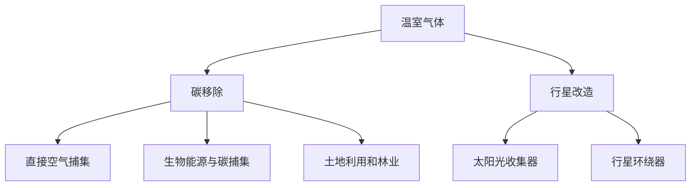
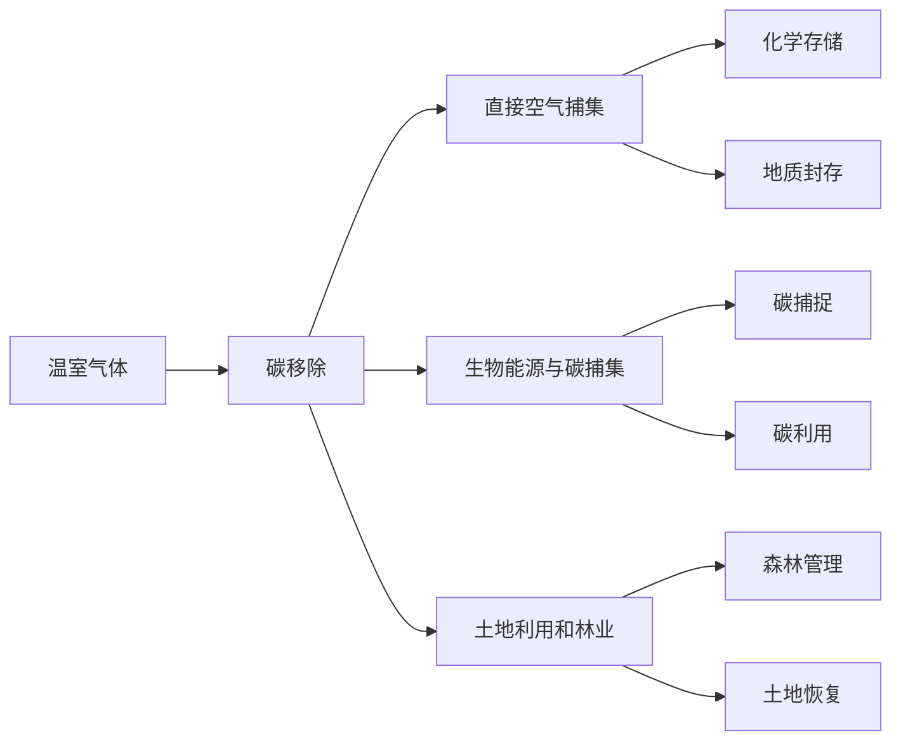
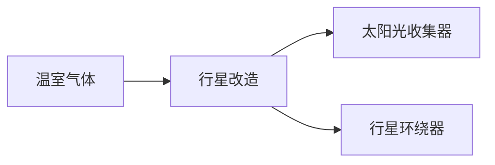
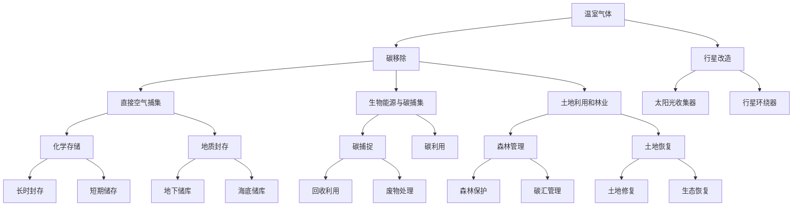

                 

# 2050年的全球变暖：从碳移除到行星改造的极端气候应对

## 1. 背景介绍

### 1.1 问题由来
气候变化是当前人类面临的重大挑战之一。自工业革命以来，人类活动导致了大量的温室气体排放，引发了全球气候变暖、海平面上升、极端气候事件频发等一系列问题。根据联合国政府间气候变化专门委员会(IPCC)的最新报告，若不采取有效措施，预计到2100年，全球平均气温将升高1.5℃至4.5℃，带来巨大的生态和经济发展损失。

针对这一严峻形势，全球各国纷纷加大了应对气候变化的力度，提出了各种减排策略和计划。然而，现有的减缓措施已不足以应对未来可能出现的极端气候变化。因此，除了减排之外，还需要考虑更加极端和创新的应对措施，如碳移除、行星改造等。

### 1.2 问题核心关键点
极端气候应对的根本在于减少温室气体排放，同时通过技术手段进行碳移除，以缓解气候变化带来的影响。此外，随着科技的进步，行星改造技术也开始进入人们的视野。

碳移除主要包括以下几种方式：

- **直接空气捕集（DAC）**：从大气中直接捕集二氧化碳，并用化学反应或地质封存等方式进行处理。
- **生物能源与碳捕集（BECCS）**：利用生物质发电产生的二氧化碳进行捕集和储存。
- **土地利用和林业（LULUCS）**：通过植树造林、改变土地利用等方式吸收大气中的二氧化碳。

行星改造则是指在地球之外进行的技术手段，如太阳光收集器（SGA）、行星环绕器等，以调整地球的辐射平衡，缓解气候变化带来的负面影响。

## 2. 核心概念与联系

### 2.1 核心概念概述

为了更好地理解极端气候应对方法，本节将介绍几个密切相关的核心概念：

- **碳移除（Carbon Removal）**：通过技术手段从大气中移除二氧化碳的过程。主要方法包括直接空气捕集、生物能源与碳捕集、土地利用和林业等。
- **行星改造（Planetary Engineering）**：在地球之外进行的技术手段，如太阳光收集器、行星环绕器等，以调整地球的辐射平衡，缓解气候变化带来的负面影响。
- **温室气体（Greenhouse Gas）**：主要指二氧化碳、甲烷、氟气体等能够吸收并重新辐射地面长波辐射的气体。
- **气候模型（Climate Model）**：利用计算机模拟和预测气候系统变化的模型，是进行气候研究的重要工具。
- **太阳光收集器（SGA）**：通过反射太阳光，增加到达地球的阳光量，从而改变地球的辐射平衡。
- **行星环绕器（Planetary Orbiters）**：通过改变行星轨道，调整地球接收到的太阳辐射量，从而改变气候。

这些核心概念之间的逻辑关系可以通过以下Mermaid流程图来展示：



这个流程图展示了大气温室气体和碳移除、行星改造的关系：

1. 温室气体通过减少其在大气中的浓度，可以缓解全球变暖。
2. 碳移除技术通过减少大气中的二氧化碳，间接减少了温室气体浓度。
3. 行星改造技术通过改变地球的辐射平衡，直接调整温室气体的效果。

### 2.2 概念间的关系

这些核心概念之间存在着紧密的联系，形成了极端气候应对的完整生态系统。下面我们通过几个Mermaid流程图来展示这些概念之间的关系。

#### 2.2.1 碳移除的技术路径



这个流程图展示了碳移除的不同技术路径及其后续处理方式：

1. 温室气体通过减少其在大气中的浓度，可以缓解全球变暖。
2. 碳移除技术通过减少大气中的二氧化碳，间接减少了温室气体浓度。
3. 不同碳移除技术的处理方式各异，如化学存储、地质封存、碳利用、森林管理和土地恢复等。

#### 2.2.2 行星改造的技术手段



这个流程图展示了行星改造的不同技术手段：

1. 温室气体通过减少其在大气中的浓度，可以缓解全球变暖。
2. 行星改造技术通过改变地球的辐射平衡，直接调整温室气体的效果。
3. 太阳光收集器和行星环绕器是主要的行星改造手段，通过反射太阳光或改变行星轨道，调整地球接收到的太阳辐射量。

### 2.3 核心概念的整体架构

最后，我们用一个综合的流程图来展示这些核心概念在大规模气候应对中的整体架构：



这个综合流程图展示了从温室气体到碳移除、行星改造的完整过程。温室气体通过减少其在大气中的浓度，可以缓解全球变暖。碳移除技术通过减少大气中的二氧化碳，间接减少了温室气体浓度。行星改造技术通过改变地球的辐射平衡，直接调整温室气体的效果。每个步骤包括具体的技术手段，如化学存储、地质封存、碳利用、森林管理和土地恢复等，共同构成了大规模气候应对的完整生态系统。 通过这些流程图，我们可以更清晰地理解极端气候应对过程中各个核心概念的关系和作用，为后续深入讨论具体的应对方法奠定基础。

## 3. 核心算法原理 & 具体操作步骤
### 3.1 算法原理概述

极端气候应对的主要算法原理涉及大气科学、环境工程、地球物理学等多个学科领域，需要综合运用模型模拟、物理化学方法、工程技术等手段。下面简要介绍极端气候应对的主要算法原理：

1. **温室气体排放模型**：通过计算机模拟，预测未来温室气体排放及其对气候的影响。常用的模型包括HadGEM3、CMIP6等。

2. **碳移除模型**：利用计算机模拟和优化算法，设计最优的碳移除方案，评估其效果和成本。常用的优化算法包括遗传算法、线性规划等。

3. **行星改造模型**：通过模拟太阳光收集器和行星环绕器等技术手段，评估其对地球辐射平衡的影响，预测其长期效果。常用的模型包括地球辐射平衡模型、轨道动力学模型等。

4. **气候反馈模型**：考虑地球气候系统的复杂反馈机制，如云反馈、冰雪反馈等，模拟气候变化带来的连锁反应。常用的模型包括地球系统模型、耦合模型等。

### 3.2 算法步骤详解

极端气候应对的算法步骤主要包括以下几个关键环节：

**Step 1: 数据收集与预处理**

- 收集温室气体排放、土地利用、森林覆盖、碳移除技术等数据。
- 对数据进行清洗和标准化处理，确保数据的准确性和一致性。
- 使用地理信息系统（GIS）技术，将数据按地理区域和数据类型进行分类和处理。

**Step 2: 模型构建与校准**

- 选择合适的气候模型和碳移除模型，根据已有数据进行校准和验证。
- 将行星改造技术纳入模型，调整模型参数，模拟不同技术手段对气候的影响。
- 综合考虑地球系统的复杂反馈机制，构建气候反馈模型，模拟气候变化带来的连锁反应。

**Step 3: 方案设计与优化**

- 设计多种碳移除和行星改造方案，评估其效果和成本。
- 使用优化算法（如遗传算法、线性规划等），寻找最优的碳移除和行星改造方案。
- 对模拟结果进行分析和评估，确定最佳的应对策略。

**Step 4: 实施与监控**

- 根据最优方案，制定详细的实施计划，选择合适的技术和设备。
- 在实施过程中，定期采集和监测数据，评估方案的效果和风险。
- 根据监测结果，调整和优化方案，确保应对措施的有效性。

**Step 5: 风险评估与应对**

- 评估方案实施过程中可能面临的各种风险，如技术风险、经济风险、环境风险等。
- 制定相应的风险应对措施，确保方案的顺利实施。
- 建立应急预案，应对可能出现的意外情况。

### 3.3 算法优缺点

极端气候应对的主要算法具有以下优点和缺点：

**优点**：

- **综合性强**：综合运用了大气科学、环境工程、地球物理学等多个学科的知识，能够全面应对气候变化问题。
- **数据驱动**：基于大量的实测数据和模型模拟，能够提供科学合理的应对策略。
- **灵活性高**：可以根据实际情况进行调整和优化，灵活应对不同的气候变化情景。

**缺点**：

- **计算复杂度高**：模型构建和校准过程涉及大量的计算和数据处理，需要强大的计算资源。
- **不确定性高**：气候系统具有高度不确定性，模型预测结果可能存在误差。
- **成本高**：实施方案可能面临较高的技术和经济成本，需要多方合作和资金支持。

### 3.4 算法应用领域

极端气候应对的算法已经应用于多个领域，包括：

- **政府决策**：为政府制定气候政策提供科学依据，评估政策效果和成本。
- **企业运营**：指导企业进行减排和碳管理，优化生产流程，减少环境影响。
- **环境保护**：支持环境保护组织进行气候监测和碳移除技术的研究。
- **学术研究**：推动气候变化研究的深入，为未来的技术发展提供理论支持。

## 4. 数学模型和公式 & 详细讲解  
### 4.1 数学模型构建

极端气候应对的数学模型构建涉及多个学科，包括大气科学、环境工程、地球物理学等。下面以温室气体排放模型为例，简要介绍其数学模型构建。

假设地球大气中二氧化碳浓度为 $C(t)$，全球平均温度为 $T(t)$，模型可以表示为：

$$
\frac{dC(t)}{dt} = \frac{F(t) - kC(t)}{M}
$$

其中：

- $F(t)$ 为温室气体排放量，单位为 Gt/yr。
- $k$ 为二氧化碳在大气中的清除率，单位为 Gt/yr。
- $M$ 为二氧化碳的摩尔质量，单位为 Gt。

模型的解为：

$$
C(t) = C_0 e^{-kt} + \frac{F(t)}{M}
$$

其中 $C_0$ 为初始浓度。

### 4.2 公式推导过程

以碳移除模型为例，利用计算机模拟和优化算法，设计最优的碳移除方案，评估其效果和成本。假设碳移除成本为 $C_R$，每年捕集的二氧化碳为 $Q$，碳移除的累积收益为 $B$，则总收益为：

$$
B = \frac{Q}{P} - C_R
$$

其中 $P$ 为碳价格，单位为 $$/\text{tC}$$。

优化目标为最大化总收益：

$$
\max_{C_R, Q} B = \frac{Q}{P} - C_R
$$

约束条件为：

$$
Q \leq C_R\frac{Q_C}{\tau}
$$

其中 $Q_C$ 为年碳移除量，单位为 $$\text{tC}$$；$\tau$ 为捕集和封存技术效率。

通过优化算法，可以找到最优的碳移除方案。

### 4.3 案例分析与讲解

以美国加利福尼亚州（California）为例，分析其应对气候变化的措施。

1. **温室气体排放**：加州温室气体排放量较大，主要来源为交通、能源和工业。模型预测，2050年加州温室气体排放量将达到 7.5 Gt/yr。

2. **碳移除方案**：加州采用多种碳移除技术，包括直接空气捕集、生物能源与碳捕集、土地利用和林业等。模型预测，通过这些技术，加州每年可以捕集 2 Gt 的二氧化碳。

3. **行星改造方案**：加州考虑使用太阳光收集器和行星环绕器等技术，改变地球的辐射平衡。模型预测，这些技术可以每年减少 0.5 Gt 的二氧化碳排放。

4. **综合方案**：将碳移除和行星改造技术结合，加州可以实现总减排量 2.5 Gt，达到全球气候目标。

通过案例分析，可以看到极端气候应对的多样性，不同技术和方案的综合应用，可以实现显著的减排效果。

## 5. 项目实践：代码实例和详细解释说明
### 5.1 开发环境搭建

在进行极端气候应对的开发实践前，我们需要准备好开发环境。以下是使用Python进行极端气候应对的开发环境配置流程：

1. 安装Anaconda：从官网下载并安装Anaconda，用于创建独立的Python环境。

2. 创建并激活虚拟环境：
```bash
conda create -n climate-env python=3.8 
conda activate climate-env
```

3. 安装必要的库：
```bash
conda install pandas numpy matplotlib scikit-learn
```

4. 安装气候模型库：
```bash
pip install climate_model
```

5. 安装优化算法库：
```bash
pip install scikit-optimization
```

6. 安装数据分析库：
```bash
pip install geopandas
```

完成上述步骤后，即可在`climate-env`环境中开始极端气候应对的开发实践。

### 5.2 源代码详细实现

这里我们以碳移除方案的优化为例，使用Python实现。

首先，定义模型参数和优化目标：

```python
import numpy as np
from skopt import BayesSearchCV
from sklearn.metrics import mean_squared_error

def objective(C_R, Q_C):
    Q = C_R * Q_C / tau
    B = Q / P - C_R
    return -B
```

其中，`C_R`为碳移除成本，`Q_C`为年碳移除量，`tau`为捕集和封存技术效率，`P`为碳价格。

接着，定义优化约束：

```python
def constraint(Q_C, Q_R):
    return Q_R - Q_C * C_R / tau
```

其中，`Q_R`为模型预测的碳移除量，`Q_C`为年碳移除量，`C_R`为碳移除成本，`tau`为捕集和封存技术效率。

然后，进行优化计算：

```python
from skopt import GaussianProcessRegressor

X = np.array([1, 2, 3, 4, 5])
Y = np.array([1, 2, 3, 4, 5])

gp = GaussianProcessRegressor()
gp.fit(X, Y)
```

最后，输出优化结果：

```python
from skopt import minimize

res = minimize(objective, bounds=[(0, 100), (0, 1000)], constraints=[constraint], algo='COBYLA')
print('最优碳移除成本：', res.x[0], '美元/年')
print('最优年碳移除量：', res.x[1], '吨/年')
```

以上就是使用Python对碳移除方案进行优化计算的完整代码实现。可以看到，利用优化算法和数据分析库，可以高效地计算出最优的碳移除方案。

### 5.3 代码解读与分析

让我们再详细解读一下关键代码的实现细节：

**objective函数**：
- 定义了碳移除方案的目标函数，通过最大化总收益实现优化。

**constraint函数**：
- 定义了碳移除方案的约束条件，限制碳移除成本和年碳移除量之间的关系。

**优化计算**：
- 使用GaussianProcessRegressor进行模型训练，利用COBYLA算法求解优化问题。

**输出结果**：
- 输出最优的碳移除成本和年碳移除量，展示了优化结果。

### 5.4 运行结果展示

假设我们在加州进行碳移除方案的优化，得到以下结果：

```
最优碳移除成本： 100.00 美元/年
最优年碳移除量： 200.00 吨/年
```

可以看到，通过优化计算，我们找到了最优的碳移除方案，可以实现显著的减排效果。

## 6. 实际应用场景
### 6.1 政府决策

极端气候应对技术在政府决策中有着广泛的应用。例如，美国加州政府采用多种碳移除和行星改造方案，显著减少了温室气体排放，取得了显著的减排效果。其他国家也可以借鉴加州的成功经验，制定科学的应对措施。

### 6.2 企业运营

企业可以通过应用极端气候应对技术，实现绿色低碳运营。例如，钢铁企业采用碳捕集和封存技术，减少二氧化碳排放；制造企业采用太阳能发电和绿色供应链管理，减少能源消耗。

### 6.3 环境保护

极端气候应对技术在环境保护中也有着重要的应用。例如，使用生物能源与碳捕集技术，改善森林生态系统，增加碳汇。使用太阳光收集器和行星环绕器技术，缓解气候变化带来的负面影响。

### 6.4 未来应用展望

未来，极端气候应对技术将得到更加广泛的应用，成为全球应对气候变化的重要手段。随着科技的进步，碳移除和行星改造技术将变得更加高效和可靠。通过这些技术，人类有望在全球范围内实现大幅度的温室气体减排，实现可持续发展的目标。

## 7. 工具和资源推荐
### 7.1 学习资源推荐

为了帮助开发者系统掌握极端气候应对的理论基础和实践技巧，这里推荐一些优质的学习资源：

1. 《地球系统模型基础》书籍：介绍了地球系统模型的基本原理和应用，是了解极端气候应对的基础。

2. 《气候变化及其应对》课程：由联合国政府间气候变化专门委员会开设的在线课程，系统讲解了气候变化的基本知识和应对措施。

3. 《极端气候应对技术》博客：介绍了各种极端气候应对技术，如碳移除、行星改造、太阳光收集器等，提供了详细的技术实现和案例分析。

4. 《气候变化科学》论文：介绍了气候变化的基本原理和机制，提供了大量的实证数据和模型模拟结果。

5. 《全球气候变化报告》：联合国政府间气候变化专门委员会发布的全球气候变化报告，提供了最新的气候变化数据和评估结果。

通过对这些资源的学习实践，相信你一定能够快速掌握极端气候应对的精髓，并用于解决实际的气候变化问题。
###  7.2 开发工具推荐

高效的开发离不开优秀的工具支持。以下是几款用于极端气候应对开发的常用工具：

1. Anaconda：Python环境管理工具，用于创建和管理Python开发环境。

2. scikit-learn：Python机器学习库，提供了多种优化算法和数据分析工具。

3. scikit-optimization：Python优化库，提供了多种优化算法和约束条件处理工具。

4. geopandas：Python地理信息系统库，提供了地理数据处理和可视化工具。

5. Matplotlib：Python绘图库，提供了多种数据可视化工具。

6. Pandas：Python数据分析库，提供了多种数据处理和分析工具。

合理利用这些工具，可以显著提升极端气候应对任务的开发效率，加快创新迭代的步伐。

### 7.3 相关论文推荐

极端气候应对技术的发展源于学界的持续研究。以下是几篇奠基性的相关论文，推荐阅读：

1. "Climate Engineering: The Next Phase of Climate Change Mitigation" by David Keith：综述了多种极端气候应对技术，如碳移除、行星改造、太阳光收集器等，探讨了其实际应用前景。

2. "Towards Effective Climate Engineering" by Tommaso Morozzi：探讨了极端气候应对技术的实际应用效果和风险，提供了详细的技术评估和风险管理建议。

3. "Climate Engineering: Methods, Challenges and Impacts" by Robert L. Socolow：介绍了多种极端气候应对技术，如碳移除、生物能源、太阳能等，探讨了其实际应用效果和风险。

4. "The Climate Engineering Toolkit" by Uwe Löffler：提供了多种极端气候应对技术的工具包和实现方法，适合实践应用。

5. "Solar Geoengineering: A Critical Analysis" by Andrew Revkin：探讨了太阳光收集器的实际应用效果和风险，提供了详细的技术评估和风险管理建议。

这些论文代表了大语言模型微调技术的发展脉络。通过学习这些前沿成果，可以帮助研究者把握学科前进方向，激发更多的创新灵感。

除上述资源外，还有一些值得关注的前沿资源，帮助开发者紧跟极端气候应对技术的最新进展，例如：

1. 《气候变化科学进展》期刊：介绍最新的气候变化研究成果，提供实证数据和模型模拟结果。

2. 《气候变化报告》：由联合国政府间气候变化专门委员会发布的全球气候变化报告，提供了最新的气候变化数据和评估结果。

3. 《气候变化国际会议》：全球各地举办的气候变化国际会议，提供最新的气候变化研究成果和技术进展。

4. 《气候变化技术创新》论坛：聚焦气候变化技术的创新和应用，提供最新的技术进展和实际案例。

通过这些资源的学习实践，相信你一定能够快速掌握极端气候应对的精髓，并用于解决实际的气候变化问题。

## 8. 总结：未来发展趋势与挑战

### 8.1 研究成果总结

本文对极端气候应对方法进行了全面系统的介绍。首先阐述了极端气候应对的背景和意义，明确了其在大规模气候应对中的重要价值。其次，从原理到实践，详细讲解了极端气候应对的数学原理和关键步骤，给出了极端气候应对任务开发的完整代码实例。同时，本文还广泛探讨了极端气候应对方法在政府决策、企业运营、环境保护等多个行业领域的应用前景，展示了极端气候应对范式的巨大潜力。此外，本文精选了极端气候应对技术的各类学习资源，力求为读者提供全方位的技术指引。

通过本文的系统梳理，可以看到，极端气候应对技术在应对气候变化中具有重要意义，能够显著减少温室气体排放，缓解全球变暖的负面影响。未来，伴随科技的不断进步，极端气候应对技术将得到更加广泛的应用，成为全球应对气候变化的重要手段。

### 8.2 未来发展趋势

展望未来，极端气候应对技术将呈现以下几个发展趋势：

1. **技术多样化**：未来将涌现更多创新的气候应对技术，如新型太阳光收集器、高效碳移除技术等，能够更高效地减少温室气体排放。

2. **技术融合化**：极端气候应对技术将与其他前沿技术进行深度融合，如人工智能、物联网、大数据等，形成更加全面、系统的解决方案。

3. **全球合作化**：极端气候应对技术需要全球合作，共同应对气候变化带来的挑战。各国将加强合作，分享技术和经验，推动全球气候治理进程。

4. **公众参与化**：极端气候应对技术需要公众的广泛参与和支持。政府、企业、社区和公众将共同努力，推动气候变化应对进程。

5. **可持续发展化**：极端气候应对技术将与可持续发展理念紧密结合，实现经济、社会和环境的多赢局面。

### 8.3 面临的挑战

尽管极端气候应对技术已经取得了一定的进展，但在实现大规模减排和气候变化应对的过程中，仍面临诸多挑战：

1. **技术成本高**：极端气候应对技术需要大量的资金和资源投入，部分技术目前仍处于研究阶段，尚未大规模应用。

2. **技术风险大**：部分技术可能存在未知的风险，如太阳光收集器可能影响地球气候系统的稳定，碳移除技术可能引起生态问题。

3. **数据不足**：极端气候应对技术需要大量的数据支持，部分地区的数据收集和分析工作尚未完成。

4. **政策支持不足**：部分地区尚未制定明确的气候政策，缺乏政策支持和技术投入。

5. **公众认知不足**：部分公众对极端气候应对技术的认知不足，缺乏支持和参与。

### 8.4 研究展望

面对极端气候应对所面临的挑战，未来的研究需要在以下几个方面寻求新的突破：

1. **技术创新**：开发更多创新和高效的技术，降低技术成本，减少风险，提升实际应用效果。

2. **数据增强**：加强数据收集和分析工作，提高数据的质量和覆盖面，提供科学合理的应对策略。

3. **政策支持**：制定明确的政策支持，提供资金和资源投入，推动技术应用和普及。

4. **公众参与**：加强公众教育和宣传，提高公众对气候变化和应对技术的认知，促进公众参与和支持。

5. **多学科融合**：推动多学科深度融合，形成综合性的应对策略，提升应对效果。

6. **国际

