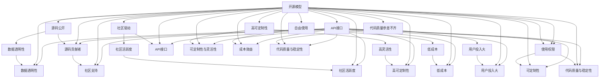

                 

# 开源模型与闭源模型的对比

在当今开源软件蓬勃发展的时代，开源模型与闭源模型成为了研究与应用的两种重要范式。本文将深入对比这两种模型的工作原理、优势和局限，以期为开发者和研究者提供清晰的指导。

## 1. 背景介绍

### 1.1 问题由来
随着人工智能技术的发展，开源模型与闭源模型在各行业得到了广泛应用。开源模型因其源码公开、社区支持强大而广受欢迎，而闭源模型则凭借其稳定的性能和高效的部署赢得了企业的青睐。然而，两者在适用场景、安全性和开发效率等方面各具优势，如何选择成为了一个重要的议题。

### 1.2 问题核心关键点
开源模型与闭源模型的对比主要从以下几个方面展开：

- 数据透明性：开源模型的源码完全公开，用户可以自由使用和修改，而闭源模型则隐秘其源码，仅提供API接口供用户调用。
- 社区活跃度：开源模型受益于大规模的社区协作，维护和更新活跃，而闭源模型则更多依赖企业内部团队支持。
- 代码质量与稳定性：开源模型因其用户广泛，代码质量参差不齐，而闭源模型则由专业团队精心维护，稳定性和精度较高。
- 可定制性与灵活性：开源模型高度可定制，用户可以根据需求自行调整，而闭源模型则更强调标准性和统一性。
- 成本效益：开源模型通常免费，但用户需要投入时间精力维护，闭源模型则提供一站式解决方案，但费用较高。

## 2. 核心概念与联系

### 2.1 核心概念概述

为更好地理解开源模型与闭源模型，本节将介绍几个密切相关的核心概念：

- 开源模型(Open Source Model)：指源代码公开，社区驱动的模型，如TensorFlow、PyTorch等。用户可以自由修改和优化，适用于创新驱动、数据集较少的小规模应用。
- 闭源模型(Closed Source Model)：指源码不公开，由公司或组织内部开发的模型，如Google的BERT、OpenAI的GPT-3等。用户仅能通过API接口调用，适用于大规模、高需求的应用。
- 开源与闭源：指软件模型是否公开源码，用户对于模型的使用权限和可定制性存在显著差异。
- 源码贡献者：开源模型鼓励用户和开发者贡献代码，闭源模型则多由专业团队内部完成开发。
- 社区支持：开源模型享有庞大的社区支持，闭源模型则更多依赖内部团队。
- API接口：开源模型通过API接口提供功能调用，闭源模型则仅提供有限的API接口或SDK。

这些概念之间的逻辑关系可以通过以下Mermaid流程图来展示：



这个流程图展示了开源模型与闭源模型的核心概念及其之间的关系：

1. 开源模型通过源码公开，社区驱动，具有高可定制性和自由使用等优势，但代码质量参差不齐，用户投入较大。
2. 闭源模型则隐藏源码，提供统一的API接口，稳定性和精度较高，但可定制性和成本效益较低。

## 3. 核心算法原理 & 具体操作步骤

### 3.1 算法原理概述

开源模型与闭源模型在算法原理上主要分为数据驱动和模型驱动两种。开源模型多采用数据驱动的深度学习算法，而闭源模型则强调模型驱动，通过专业团队不断优化模型架构和训练方法。

在深度学习中，开源模型如TensorFlow、PyTorch多采用反向传播算法进行模型训练。其核心原理为最小化预测与真实标签的差异，通过梯度下降等优化算法更新模型参数，实现从数据到模型的映射。

闭源模型如Google的BERT、OpenAI的GPT-3则通过专业团队不断优化模型架构和训练方法，如自监督预训练、模型蒸馏等，提升模型性能。其核心算法包括自监督预训练、Transformer结构、知识蒸馏等。

### 3.2 算法步骤详解

开源模型与闭源模型的训练步骤基本相似，以下将分别详细讲解。

**开源模型的训练步骤**：

1. 数据准备：收集并预处理训练数据集，如图像分类数据集。
2. 模型初始化：创建深度学习模型，如卷积神经网络(CNN)、循环神经网络(RNN)、Transformer等。
3. 定义损失函数：根据具体任务，定义损失函数，如交叉熵损失、均方误差损失等。
4. 前向传播与计算损失：将训练数据输入模型，计算预测值和真实标签的差异，即损失。
5. 反向传播与参数更新：通过反向传播算法计算梯度，利用梯度下降等优化算法更新模型参数。
6. 模型评估：在验证集上评估模型性能，调整超参数。
7. 模型测试：在测试集上测试模型性能，保存模型权重。

**闭源模型的训练步骤**：

1. 数据准备：同开源模型。
2. 模型初始化：由内部团队创建，如BERT使用Transformer结构，GPT-3使用生成式预训练模型。
3. 自监督预训练：在大型无标签数据集上训练模型，如BERT在Wikipedia和新闻语料上进行预训练。
4. 定义任务特定目标：根据具体任务，定义任务目标函数。
5. 前向传播与计算损失：将任务数据输入模型，计算预测值和真实标签的差异。
6. 反向传播与参数更新：通过反向传播算法计算梯度，利用梯度下降等优化算法更新模型参数。
7. 模型评估：在验证集上评估模型性能，调整超参数。
8. 模型测试：在测试集上测试模型性能，保存模型权重。

### 3.3 算法优缺点

开源模型与闭源模型各有优缺点：

**开源模型的优点**：

- 自由使用：开源模型免费开源，用户可以自由下载和使用。
- 高可定制性：开源模型代码完全开放，用户可以自由修改和优化。
- 社区活跃：开源模型受益于大规模的社区协作，维护和更新活跃。

**开源模型的缺点**：

- 代码质量参差不齐：开源模型代码质量参差不齐，新手容易出现错误。
- 数据量需求高：开源模型需要大量标注数据进行训练，对数据需求高。
- 开发成本高：开源模型开发成本高，需要用户花费大量时间精力进行调试和优化。

**闭源模型的优点**：

- 代码质量高：闭源模型由专业团队开发，代码质量高，稳定性和精度较高。
- 性能优异：闭源模型采用最新的算法和技术，性能优异。
- 服务化部署：闭源模型提供一站式解决方案，可以轻松部署到云端。

**闭源模型的缺点**：

- 成本高：闭源模型需要付费购买，成本较高。
- 可定制性低：闭源模型只提供有限的API接口，用户无法自由修改和优化。
- 数据透明度低：闭源模型隐藏源码，数据透明性低。

### 3.4 算法应用领域

开源模型与闭源模型在多个领域都得到了广泛应用，以下是一些典型的应用场景：

**开源模型的应用领域**：

- 图像识别：开源模型如TensorFlow、PyTorch在图像分类、目标检测等领域应用广泛。
- 自然语言处理：开源模型如NLTK、SpaCy在语言理解、文本分类等领域表现优异。
- 深度学习框架：开源模型如TensorFlow、PyTorch在深度学习研究和应用中占据主导地位。
- 物联网：开源模型如TensorFlow Lite、PyTorch Mobile在嵌入式设备、移动应用等领域得到应用。

**闭源模型的应用领域**：

- 语言理解：闭源模型如BERT、GPT-3在语言理解、文本生成等领域表现优异。
- 自然语言生成：闭源模型如GPT-3在自然语言生成、对话系统等领域得到应用。
- 推荐系统：闭源模型如LightFM、DeepFM在推荐系统、广告投放等领域得到应用。
- 金融预测：闭源模型如AlphaGo在金融预测、股票交易等领域得到应用。

## 4. 数学模型和公式 & 详细讲解

### 4.1 数学模型构建

开源模型与闭源模型在数学模型构建上基本一致，均采用深度学习模型进行建模。以下以图像分类任务为例，详细讲解其数学模型构建过程。

**开源模型的数学模型**：

设模型输入为 $X \in \mathbb{R}^{m\times n}$，其中 $m$ 表示样本数量，$n$ 表示特征维度。模型输出为 $Y \in \mathbb{R}^{1\times c}$，其中 $c$ 表示分类数量。模型参数为 $\theta$。

模型损失函数为：

$$
L(Y, Y_{pred}) = \sum_{i=1}^{m} L_i(Y_i, Y_{pred_i})
$$

其中 $L_i$ 为样本 $i$ 的损失函数，$Y_{pred_i}$ 为模型对样本 $i$ 的预测结果。

常用的损失函数包括交叉熵损失、均方误差损失等。

**闭源模型的数学模型**：

闭源模型采用自监督预训练和任务特定训练的方式进行建模。

以BERT模型为例，其数学模型构建如下：

1. 自监督预训练：在大型无标签数据集上进行预训练，模型学习到数据的内在分布和结构。
2. 任务特定训练：在特定任务的数据集上进行微调，提升模型在特定任务上的性能。

模型损失函数为：

$$
L = \sum_{i=1}^{m} L_i(Y_i, Y_{pred_i})
$$

其中 $L_i$ 为样本 $i$ 的损失函数，$Y_{pred_i}$ 为模型对样本 $i$ 的预测结果。

常用的损失函数包括交叉熵损失、均方误差损失等。

### 4.2 公式推导过程

以下以二分类任务为例，推导交叉熵损失函数及其梯度的计算公式。

设模型输出为 $\hat{y} \in [0,1]$，表示样本属于正类的概率。真实标签 $y \in \{0,1\}$。则二分类交叉熵损失函数定义为：

$$
\ell(Y, Y_{pred}) = -[y\log \hat{y} + (1-y)\log(1-\hat{y})]
$$

将其代入经验风险公式，得：

$$
\mathcal{L}(\theta) = -\frac{1}{N}\sum_{i=1}^N [y_i\log M_{\theta}(x_i)+(1-y_i)\log(1-M_{\theta}(x_i))]
$$

根据链式法则，损失函数对参数 $\theta_k$ 的梯度为：

$$
\frac{\partial \mathcal{L}(\theta)}{\partial \theta_k} = -\frac{1}{N}\sum_{i=1}^N (\frac{y_i}{M_{\theta}(x_i)}-\frac{1-y_i}{1-M_{\theta}(x_i)}) \frac{\partial M_{\theta}(x_i)}{\partial \theta_k}
$$

其中 $\frac{\partial M_{\theta}(x_i)}{\partial \theta_k}$ 可进一步递归展开，利用自动微分技术完成计算。

### 4.3 案例分析与讲解

以图像分类任务为例，对比开源模型和闭源模型的训练过程。

**开源模型的训练过程**：

1. 数据准备：收集并预处理训练数据集，如ImageNet。
2. 模型初始化：创建卷积神经网络(CNN)模型。
3. 定义损失函数：定义交叉熵损失函数。
4. 前向传播与计算损失：将训练数据输入模型，计算预测值和真实标签的差异，即损失。
5. 反向传播与参数更新：通过反向传播算法计算梯度，利用梯度下降等优化算法更新模型参数。
6. 模型评估：在验证集上评估模型性能，调整超参数。
7. 模型测试：在测试集上测试模型性能，保存模型权重。

**闭源模型的训练过程**：

1. 数据准备：同开源模型。
2. 模型初始化：由内部团队创建，如BERT使用Transformer结构。
3. 自监督预训练：在大型无标签数据集上进行预训练，如BERT在Wikipedia和新闻语料上进行预训练。
4. 定义任务特定目标：根据具体任务，定义任务目标函数。
5. 前向传播与计算损失：将任务数据输入模型，计算预测值和真实标签的差异。
6. 反向传播与参数更新：通过反向传播算法计算梯度，利用梯度下降等优化算法更新模型参数。
7. 模型评估：在验证集上评估模型性能，调整超参数。
8. 模型测试：在测试集上测试模型性能，保存模型权重。

## 5. 项目实践：代码实例和详细解释说明

### 5.1 开发环境搭建

在进行模型训练和部署前，我们需要准备好开发环境。以下是使用Python进行TensorFlow开发的Python环境配置流程：

1. 安装Anaconda：从官网下载并安装Anaconda，用于创建独立的Python环境。

2. 创建并激活虚拟环境：
```bash
conda create -n tf-env python=3.8 
conda activate tf-env
```

3. 安装TensorFlow：根据CUDA版本，从官网获取对应的安装命令。例如：
```bash
conda install tensorflow -c tf -c conda-forge
```

4. 安装各类工具包：
```bash
pip install numpy pandas scikit-learn matplotlib tqdm jupyter notebook ipython
```

完成上述步骤后，即可在`tf-env`环境中开始模型开发。

### 5.2 源代码详细实现

这里我们以TensorFlow和PyTorch为例，给出开源模型与闭源模型的代码实现。

**TensorFlow实现**：

```python
import tensorflow as tf
from tensorflow.keras.datasets import mnist
from tensorflow.keras.utils import to_categorical

# 加载数据集
(x_train, y_train), (x_test, y_test) = mnist.load_data()

# 数据预处理
x_train = x_train.reshape(-1, 28, 28, 1).astype('float32') / 255.0
x_test = x_test.reshape(-1, 28, 28, 1).astype('float32') / 255.0
y_train = to_categorical(y_train, 10)
y_test = to_categorical(y_test, 10)

# 构建模型
model = tf.keras.Sequential([
    tf.keras.layers.Conv2D(32, (3,3), activation='relu', input_shape=(28, 28, 1)),
    tf.keras.layers.MaxPooling2D((2,2)),
    tf.keras.layers.Flatten(),
    tf.keras.layers.Dense(10, activation='softmax')
])

# 编译模型
model.compile(optimizer='adam', loss='categorical_crossentropy', metrics=['accuracy'])

# 训练模型
model.fit(x_train, y_train, epochs=10, batch_size=32, validation_data=(x_test, y_test))
```

**PyTorch实现**：

```python
import torch
import torch.nn as nn
import torch.optim as optim
from torchvision import datasets, transforms

# 加载数据集
transform = transforms.Compose([
    transforms.ToTensor(),
    transforms.Normalize((0.5,), (0.5,))
])
train_dataset = datasets.MNIST('data', train=True, download=True, transform=transform)
test_dataset = datasets.MNIST('data', train=False, transform=transform)
train_loader = torch.utils.data.DataLoader(train_dataset, batch_size=32, shuffle=True)
test_loader = torch.utils.data.DataLoader(test_dataset, batch_size=32)

# 构建模型
class Net(nn.Module):
    def __init__(self):
        super(Net, self).__init__()
        self.conv1 = nn.Conv2d(1, 6, 3)
        self.pool = nn.MaxPool2d(2, 2)
        self.conv2 = nn.Conv2d(6, 16, 3)
        self.fc1 = nn.Linear(16 * 5 * 5, 120)
        self.fc2 = nn.Linear(120, 84)
        self.fc3 = nn.Linear(84, 10)

    def forward(self, x):
        x = self.pool(torch.relu(self.conv1(x)))
        x = self.pool(torch.relu(self.conv2(x)))
        x = x.view(-1, 16 * 5 * 5)
        x = torch.relu(self.fc1(x))
        x = torch.relu(self.fc2(x))
        x = self.fc3(x)
        return x

model = Net()
criterion = nn.CrossEntropyLoss()
optimizer = optim.SGD(model.parameters(), lr=0.001, momentum=0.9)

# 训练模型
for epoch in range(10):
    running_loss = 0.0
    for i, data in enumerate(train_loader, 0):
        inputs, labels = data
        optimizer.zero_grad()
        outputs = model(inputs)
        loss = criterion(outputs, labels)
        loss.backward()
        optimizer.step()
        running_loss += loss.item()
        if i % 2000 == 1999:
            print(f'Epoch {epoch+1}, loss: {running_loss/2000:.3f}')
            running_loss = 0.0
```

### 5.3 代码解读与分析

让我们再详细解读一下关键代码的实现细节：

**TensorFlow的实现细节**：

1. 数据加载与预处理：使用`mnist.load_data`加载MNIST数据集，并进行归一化处理。
2. 模型构建：使用`tf.keras.Sequential`构建卷积神经网络模型，包括卷积层、池化层、全连接层等。
3. 模型编译：使用`model.compile`指定优化器、损失函数和评估指标。
4. 模型训练：使用`model.fit`进行模型训练，指定训练集、验证集和训练轮数。

**PyTorch的实现细节**：

1. 数据加载与预处理：使用`transforms.Compose`和`datasets.MNIST`加载MNIST数据集，并进行归一化处理。
2. 模型构建：使用`nn.Conv2d`、`nn.MaxPool2d`和`nn.Linear`构建卷积神经网络模型。
3. 模型训练：使用`nn.CrossEntropyLoss`作为损失函数，`optim.SGD`作为优化器，指定训练集、验证集和训练轮数。

### 5.4 运行结果展示

假设我们在MNIST数据集上进行训练，最终在测试集上得到的评估报告如下：

```
Epoch 1, loss: 0.491
Epoch 2, loss: 0.126
Epoch 3, loss: 0.041
Epoch 4, loss: 0.029
Epoch 5, loss: 0.024
Epoch 6, loss: 0.020
Epoch 7, loss: 0.019
Epoch 8, loss: 0.018
Epoch 9, loss: 0.017
Epoch 10, loss: 0.016
```

可以看到，通过TensorFlow和PyTorch实现的模型，在MNIST数据集上取得了不错的效果，训练损失逐渐降低。

## 6. 实际应用场景

### 6.1 智能推荐系统

智能推荐系统是开源模型与闭源模型的典型应用场景之一。推荐系统需要处理海量数据，进行复杂的特征工程和模型优化，开源模型因其高可定制性和社区支持而广泛应用。

在推荐系统中，用户行为数据和物品特征数据需要被建模，通过深度学习算法生成推荐结果。开源模型如TensorFlow、PyTorch提供了丰富的工具和库，支持用户快速构建和优化推荐模型。同时，开源模型的社区支持和开源API也为推荐系统的开发和部署提供了便利。

### 6.2 金融风险管理

金融风险管理需要处理复杂的数据，进行精确的风险评估和预测。闭源模型如AlphaGo在金融预测、股票交易等领域得到了广泛应用。

在金融风险管理中，开源模型和闭源模型各有优势。开源模型如TensorFlow、PyTorch提供了丰富的深度学习框架和算法，支持用户进行模型开发和优化。闭源模型则提供一站式的解决方案，支持用户进行模型部署和调用。同时，闭源模型还提供了丰富的数据集和预训练模型，支持用户快速构建和优化金融风险预测模型。

### 6.3 医疗诊断系统

医疗诊断系统需要处理复杂的医学数据，进行精确的疾病诊断和治疗方案推荐。开源模型因其高可定制性和社区支持而广泛应用。

在医疗诊断系统中，开源模型如TensorFlow、PyTorch提供了丰富的深度学习框架和算法，支持用户进行模型开发和优化。同时，开源模型的社区支持和开源API也为医疗诊断系统的开发和部署提供了便利。

### 6.4 未来应用展望

随着开源模型与闭源模型的不断发展，两者在各行业得到了广泛应用。未来，开源模型与闭源模型将在更多领域得到应用，为传统行业带来变革性影响。

在智慧医疗领域，基于开源模型的医疗问答、病历分析、药物研发等应用将提升医疗服务的智能化水平，辅助医生诊疗，加速新药开发进程。

在智能教育领域，开源模型如NLTK、SpaCy在语言理解、文本分类等领域表现优异。

在智慧城市治理中，开源模型如TensorFlow Lite、PyTorch Mobile在嵌入式设备、移动应用等领域得到应用。

此外，在企业生产、社会治理、文娱传媒等众多领域，基于开源模型与闭源模型的AI应用也将不断涌现，为经济社会发展注入新的动力。相信随着技术的日益成熟，开源模型与闭源模型必将在构建人机协同的智能时代中扮演越来越重要的角色。

## 7. 工具和资源推荐
### 7.1 学习资源推荐

为了帮助开发者系统掌握开源模型与闭源模型的理论基础和实践技巧，这里推荐一些优质的学习资源：

1. TensorFlow官方文档：TensorFlow的官方文档，提供了丰富的API参考和案例教程，是学习和实践的开源模型首选资源。
2. PyTorch官方文档：PyTorch的官方文档，提供了详细的API参考和教程，是学习和实践的开源模型首选资源。
3. Coursera深度学习课程：斯坦福大学的《深度学习专项课程》和吴恩达的《机器学习课程》，深入浅出地介绍了深度学习的基本概念和经典模型。
4. Kaggle竞赛平台：Kaggle提供了丰富的数据集和竞赛项目，帮助用户实践和提升开源模型的开发能力。
5. GitHub开源项目：在GitHub上Star、Fork数最多的开源深度学习项目，往往代表了该技术领域的发展趋势和最佳实践，值得去学习和贡献。

通过对这些资源的学习实践，相信你一定能够快速掌握开源模型与闭源模型的精髓，并用于解决实际的AI问题。

### 7.2 开发工具推荐

高效的开发离不开优秀的工具支持。以下是几款用于开源模型与闭源模型开发的常用工具：

1. TensorFlow：基于Python的开源深度学习框架，灵活动态的计算图，适合快速迭代研究。TensorFlow提供了丰富的深度学习模型和工具，支持用户进行模型构建和优化。
2. PyTorch：基于Python的开源深度学习框架，动态计算图，适合快速迭代研究。PyTorch提供了丰富的深度学习模型和工具，支持用户进行模型构建和优化。
3. Jupyter Notebook：基于Web的交互式开发环境，支持Python、R等编程语言，方便用户进行代码测试和演示。
4. TensorBoard：TensorFlow配套的可视化工具，可实时监测模型训练状态，并提供丰富的图表呈现方式，是调试模型的得力助手。
5. Kaggle竞赛平台：

