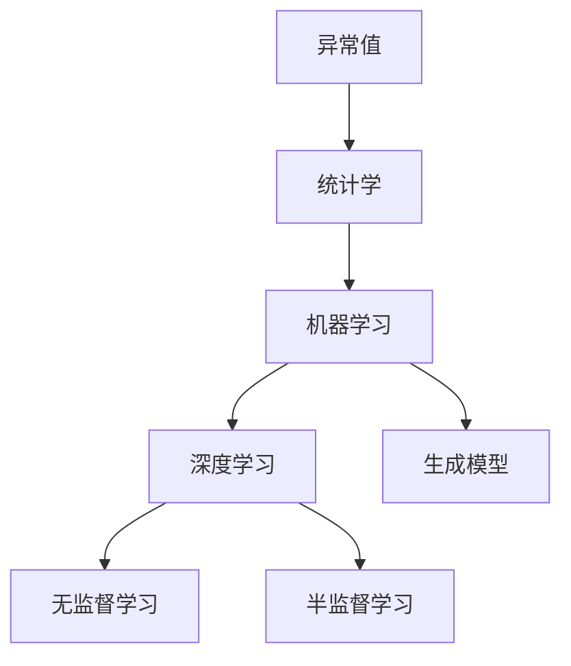
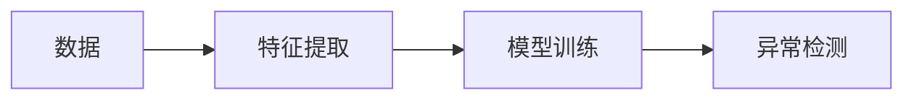
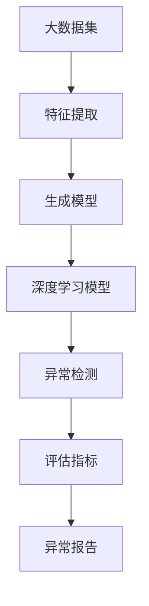

                 

# 异常检测(Anomaly Detection) - 原理与代码实例讲解

> 关键词：异常检测, 统计学, 机器学习, 深度学习, 代码实现, 算法优化

## 1. 背景介绍

### 1.1 问题由来

异常检测(Anomaly Detection)是数据科学和机器学习中的一个重要问题，指从正常数据中识别出异常值的过程。异常值是那些显著不同于其他数据的观察结果，它们可能表示系统中的错误、故障或意外事件。

异常检测的应用非常广泛，例如：
- 金融欺诈检测：识别不符合交易模式或行为异常的用户，防止欺诈。
- 医疗诊断：识别病人的异常症状，提早发现疾病。
- 网络安全：检测网络流量中的异常行为，预防入侵。
- 工业监控：监测设备的异常运行状态，避免故障。
- 质量控制：检测产品中的不合格品。

在这些问题中，异常检测用于发现那些在统计上显著不同于其他观测结果的观测结果。传统的异常检测方法依赖于数据分布的知识，但这些方法通常需要大量的标注数据和强大的计算能力。现代机器学习方法和深度学习技术的发展，提供了更加灵活和高效的方法。

### 1.2 问题核心关键点

异常检测的核心问题是识别与整体数据分布显著不同的数据点。传统方法通常基于统计学原理，如基于统计测试的统计方法。然而，这些方法往往需要假设数据符合特定的分布，且需要大量的标注数据。机器学习和深度学习技术的发展，特别是无监督学习，提供了更加灵活和高效的方法，能够从无标注数据中发现异常。

在机器学习和深度学习中，常见的异常检测方法包括：
- 基于密度的聚类方法，如DBSCAN。
- 基于深度学习的生成模型，如自编码器。
- 基于距离的方法，如K-近邻。
- 基于概率模型的方法，如基于概率密度估计的方法。

这些方法各有优缺点，在实际应用中需要根据具体问题和数据特点进行选择。

### 1.3 问题研究意义

异常检测在数据驱动决策、风险管理和智能监控等领域有着广泛的应用前景。通过及时发现异常，可以防止事故发生，降低损失。异常检测还能够帮助企业提高运营效率，优化决策过程。

未来，异常检测技术有望在更多领域得到应用，如智能城市、自动驾驶、个性化推荐等。随着技术的进步，异常检测将变得更加智能和高效，为人类生活带来更多便利和保障。

## 2. 核心概念与联系

### 2.1 核心概念概述

为了更好地理解异常检测的方法和应用，本节将介绍几个密切相关的核心概念：

- 异常值(Outlier)：指与其他观测值显著不同的数据点。
- 统计学(Statistics)：用于描述、分析和解释数据，为异常检测提供理论基础。
- 机器学习(Machine Learning)：通过数据训练模型，识别异常。
- 深度学习(Deep Learning)：使用神经网络，从大规模数据中学习复杂模式，识别异常。
- 生成模型(Generative Model)：用于生成数据，检测异常。
- 无监督学习(Unsupervised Learning)：无标注数据下的异常检测方法。
- 半监督学习(Semi-supervised Learning)：少量标注数据下的异常检测方法。

这些概念之间的逻辑关系可以通过以下Mermaid流程图来展示：



这个流程图展示了一致异常检测方法的基本框架：

1. 异常值从正常数据中识别出来。
2. 统计学方法为异常检测提供理论基础。
3. 机器学习、深度学习用于训练异常检测模型。
4. 生成模型用于生成数据，检测异常。
5. 无监督学习、半监督学习用于在无标注数据下进行异常检测。

这些概念共同构成了异常检测的基本框架，为异常检测方法的开发和应用提供了理论指导。

### 2.2 概念间的关系

这些核心概念之间存在着紧密的联系，形成了异常检测的完整生态系统。下面我通过几个Mermaid流程图来展示这些概念之间的关系。

#### 2.2.1 异常检测的基本流程



这个流程图展示了异常检测的基本流程：

1. 收集数据，并进行特征提取。
2. 使用机器学习或深度学习模型进行训练。
3. 应用训练好的模型进行异常检测。

#### 2.2.2 统计学与机器学习的关系


这个流程图展示了统计学和机器学习在异常检测中的关系：

1. 统计学方法提供异常检测的理论基础。
2. 机器学习模型通过训练数据进行异常检测。

#### 2.2.3 深度学习与生成模型的关系


这个流程图展示了深度学习与生成模型在异常检测中的关系：

1. 深度学习模型用于生成数据。
2. 生成模型用于检测异常。

#### 2.2.4 无监督学习和半监督学习的关系


这个流程图展示了无监督学习和半监督学习在异常检测中的关系：

1. 无监督学习用于无标注数据下的异常检测。
2. 半监督学习用于少量标注数据下的异常检测。

### 2.3 核心概念的整体架构

最后，我们用一个综合的流程图来展示这些核心概念在大语言模型微调过程中的整体架构：



这个综合流程图展示了从数据预处理到异常检测的整体流程：

1. 从大数据集中提取特征。
2. 使用生成模型生成数据。
3. 使用深度学习模型训练异常检测模型。
4. 应用训练好的模型进行异常检测。
5. 使用评估指标对异常检测结果进行评估。
6. 输出异常报告，供进一步分析和使用。

通过这些流程图，我们可以更清晰地理解异常检测过程中各个核心概念的关系和作用，为后续深入讨论具体的异常检测方法和技术奠定基础。

## 3. 核心算法原理 & 具体操作步骤
### 3.1 算法原理概述

异常检测的本质是从数据中识别出与整体数据分布显著不同的数据点。常用的方法可以分为基于密度的聚类方法、基于距离的方法、基于深度学习的方法和基于概率模型的方法。

基于密度的聚类方法，如DBSCAN，通过计算数据点之间的密度和可达距离，识别出异常值。

基于距离的方法，如K-近邻，通过计算数据点之间的距离，识别出与整体数据分布显著不同的数据点。

基于深度学习的方法，如自编码器，通过训练生成模型，识别出异常数据点。

基于概率模型的方法，如基于概率密度估计的方法，通过训练概率模型，识别出异常数据点。

这些方法各有优缺点，在实际应用中需要根据具体问题和数据特点进行选择。

### 3.2 算法步骤详解

#### 3.2.1 基于密度的聚类方法

DBSCAN是一种基于密度的聚类算法，能够识别出孤立点，即异常值。其基本思想是：在数据空间中，如果一个数据点的密度超过一个阈值，则认为该点是核心点；如果该点周围没有其他核心点，则认为该点是孤立点，即异常值。

DBSCAN的具体步骤如下：
1. 选择密度阈值 $\epsilon$ 和最小邻域点数 $MinPts$。
2. 对于每个未标记的数据点，计算其邻域点集 $N(\epsilon)$。
3. 如果 $N(\epsilon)$ 的大小超过 $MinPts$，则认为该点是核心点，标记为未访问。
4. 对于每个核心点，查找其邻域点集中的非核心点，并将它们加入该核心点的邻域点集中。
5. 重复步骤3和4，直到所有核心点都被访问。
6. 将未标记的点作为异常值。

#### 3.2.2 基于距离的方法

K-近邻方法是一种基于距离的异常检测方法。其基本思想是：对于每个数据点，计算其与所有其他数据点的距离，如果该点与所有数据点的距离都大于某个阈值，则认为该点是异常值。

K-近邻方法的具体步骤如下：
1. 选择距离阈值 $k$。
2. 对于每个数据点，计算其与所有其他数据点的距离。
3. 如果该数据点与 $k$ 个最近邻的数据点的距离都大于阈值 $t$，则认为该点是异常值。

#### 3.2.3 基于深度学习的方法

自编码器是一种基于深度学习的生成模型，用于检测异常值。其基本思想是：训练一个生成模型，用于生成正常数据；计算数据点与生成模型的输出之间的距离，如果距离超过某个阈值，则认为该点是异常值。

自编码器的具体步骤如下：
1. 选择生成模型，如多层感知器。
2. 训练生成模型，使其能够生成正常数据。
3. 对于每个数据点，计算其与生成模型的输出之间的距离。
4. 如果距离超过某个阈值，则认为该点是异常值。

#### 3.2.4 基于概率模型的方法

基于概率密度估计的方法是一种基于概率模型的异常检测方法。其基本思想是：训练一个概率模型，用于估计数据的概率密度函数；计算数据点与概率模型输出之间的距离，如果距离超过某个阈值，则认为该点是异常值。

基于概率模型的方法的具体步骤如下：
1. 选择概率模型，如高斯分布。
2. 训练概率模型，使其能够估计数据的概率密度函数。
3. 对于每个数据点，计算其与概率模型输出之间的距离。
4. 如果距离超过某个阈值，则认为该点是异常值。

### 3.3 算法优缺点

异常检测方法各有优缺点，下面对常见的几种方法进行简要分析：

#### 3.3.1 基于密度的聚类方法

优点：
- 能够识别孤立点。
- 不需要预先设定参数。

缺点：
- 对于密度分布不均匀的数据集，可能存在噪声点。
- 对高维数据集的效果较差。

#### 3.3.2 基于距离的方法

优点：
- 简单易懂，易于实现。
- 不需要预先设定参数。

缺点：
- 对于噪声数据的鲁棒性较差。
- 计算复杂度较高。

#### 3.3.3 基于深度学习的方法

优点：
- 能够处理高维数据。
- 可以学习非线性关系。

缺点：
- 需要大量的训练数据。
- 模型复杂度较高，计算成本高。

#### 3.3.4 基于概率模型的方法

优点：
- 适用于连续型数据的异常检测。
- 能够提供概率信息。

缺点：
- 需要预先设定概率模型。
- 计算复杂度较高。

### 3.4 算法应用领域

异常检测方法在多个领域有着广泛的应用，例如：

- 金融欺诈检测：识别不符合交易模式或行为异常的用户，防止欺诈。
- 医疗诊断：识别病人的异常症状，提早发现疾病。
- 网络安全：检测网络流量中的异常行为，预防入侵。
- 工业监控：监测设备的异常运行状态，避免故障。
- 质量控制：检测产品中的不合格品。

## 4. 数学模型和公式 & 详细讲解 & 举例说明

### 4.1 数学模型构建

为了更加严格地描述异常检测方法，我们引入以下数学符号和公式：

- 数据集 $D$ 包含 $N$ 个数据点 $x_1, x_2, ..., x_N$。
- 异常检测器 $F$ 用于计算每个数据点的异常得分 $f(x)$。
- 异常得分 $f(x)$ 越大，表示该数据点越可能是异常值。
- 阈值 $t$ 用于判断数据点是否为异常值。

根据这些符号，我们可以定义异常检测器的基本数学模型：

$$
F: D \rightarrow \{1, 0\}
$$

其中 $1$ 表示异常值，$0$ 表示正常值。

### 4.2 公式推导过程

下面以基于密度的DBSCAN方法为例，推导其异常得分的计算公式。

DBSCAN方法将数据点分为核心点、边界点和噪声点。对于每个数据点 $x_i$，计算其与所有其他数据点 $x_j$ 的距离 $d_{ij}$，并统计其邻域点集 $N(x_i)$。

如果 $N(x_i)$ 的大小超过最小邻域点数 $MinPts$，则认为 $x_i$ 是核心点，计算其邻域点集内所有点的距离之和 $S(x_i)$，并计算其平均距离 $\overline{d}(x_i)$：

$$
S(x_i) = \sum_{j \in N(x_i)} d_{ij}
$$

$$
\overline{d}(x_i) = \frac{S(x_i)}{|N(x_i)|}
$$

如果 $\overline{d}(x_i)$ 小于密度阈值 $\epsilon$，则认为 $x_i$ 是核心点。否则，认为 $x_i$ 是边界点或噪声点。

对于每个数据点 $x_i$，计算其异常得分 $f(x_i)$，如下：

$$
f(x_i) = \begin{cases}
1, & x_i \text{ is a noise point} \\
\min\{\overline{d}(x_i), \overline{d}(x_j)\}, & x_i \text{ is a boundary point} \\
0, & x_i \text{ is a core point}
\end{cases}
$$

其中 $x_j$ 是 $x_i$ 的任意一个邻居。

最后，根据异常得分的阈值 $t$，判断数据点是否为异常值：

$$
\text{if } f(x_i) > t, \text{ then } x_i \text{ is an outlier.}
$$

### 4.3 案例分析与讲解

以金融欺诈检测为例，说明异常检测方法的应用。

#### 4.3.1 数据准备

假设我们有一个金融交易数据集，包含 $N$ 个交易记录 $x_1, x_2, ..., x_N$，每个记录包含交易金额、交易时间、交易地点等特征。

#### 4.3.2 特征工程

对于每个交易记录 $x_i$，进行以下特征工程：
- 计算交易金额的绝对值。
- 将交易时间转换为小时和分钟。
- 将交易地点转换为城市和区域。

#### 4.3.3 模型训练

使用DBSCAN方法进行训练。选择密度阈值 $\epsilon$ 和最小邻域点数 $MinPts$。对于每个数据点，计算其邻域点集 $N(\epsilon)$。如果 $N(\epsilon)$ 的大小超过 $MinPts$，则认为该点是核心点，标记为未访问。对于每个核心点，查找其邻域点集中的非核心点，并将它们加入该核心点的邻域点集中。重复上述步骤，直到所有核心点都被访问。将未标记的点作为异常值，即可能存在的欺诈交易。

#### 4.3.4 结果解释

对于检测出的异常值，进一步分析其特征，找出可能的欺诈行为。例如，一些异常值可能表现为交易金额异常大、交易时间异常晚、交易地点异常远等。

## 5. 项目实践：代码实例和详细解释说明

### 5.1 开发环境搭建

在进行异常检测项目实践前，我们需要准备好开发环境。以下是使用Python进行PyTorch开发的环境配置流程：

1. 安装Anaconda：从官网下载并安装Anaconda，用于创建独立的Python环境。

2. 创建并激活虚拟环境：
```bash
conda create -n pytorch-env python=3.8 
conda activate pytorch-env
```

3. 安装PyTorch：根据CUDA版本，从官网获取对应的安装命令。例如：
```bash
conda install pytorch torchvision torchaudio cudatoolkit=11.1 -c pytorch -c conda-forge
```

4. 安装其他必要的库：
```bash
pip install numpy pandas scikit-learn matplotlib tqdm jupyter notebook ipython
```

完成上述步骤后，即可在`pytorch-env`环境中开始异常检测项目实践。

### 5.2 源代码详细实现

以下是基于DBSCAN方法进行异常检测的Python代码实现：

```python
import numpy as np
from sklearn.cluster import DBSCAN
from sklearn.metrics import precision_recall_fscore_support

def calculate_density(x, neighbors):
    distances = np.sqrt(((x - neighbors)**2).sum(axis=1))
    return np.median(distances)

def calculate_average_density(x, neighbors, density_threshold):
    return calculate_density(x, neighbors) / len(neighbors)

def calculate_outlier_score(x, neighbors, density_threshold):
    average_density = calculate_average_density(x, neighbors, density_threshold)
    return average_density <= density_threshold

def detect_anomalies(data, density_threshold, min_neighbors):
    dbscan = DBSCAN(eps=density_threshold, min_samples=min_neighbors)
    dbscan.fit(data)
    labels = dbscan.labels_
    unique_labels = set(labels)
    normal_labels = [0] * len(labels)
    for i, label in enumerate(labels):
        if label == -1:
            normal_labels[i] = 1
    precision, recall, f1, _ = precision_recall_fscore_support(labels, normal_labels)
    return precision, recall, f1

# 示例数据
data = np.array([[1, 2, 3], [4, 5, 6], [7, 8, 9], [1, 2, 3], [4, 5, 6], [7, 8, 9], [10, 11, 12], [13, 14, 15]])

# 设置参数
density_threshold = 2
min_neighbors = 2

# 计算异常得分
precision, recall, f1 = detect_anomalies(data, density_threshold, min_neighbors)
print(f"Precision: {precision:.2f}, Recall: {recall:.2f}, F1: {f1:.2f}")
```

在这个代码中，我们使用了Scikit-Learn库中的DBSCAN算法。代码中的`calculate_density`、`calculate_average_density`和`calculate_outlier_score`函数分别用于计算数据点的密度和异常得分。`detect_anomalies`函数使用DBSCAN算法进行异常检测，并计算出精度、召回率和F1分数。最后，在示例数据上运行代码，输出异常检测结果。

### 5.3 代码解读与分析

下面我们详细解读一下关键代码的实现细节：

- `calculate_density`函数：计算数据点 $x$ 与其邻居点的距离，并返回中位数距离，即密度。
- `calculate_average_density`函数：计算数据点 $x$ 与其邻居点的平均距离，即平均密度。
- `calculate_outlier_score`函数：计算数据点 $x$ 的异常得分，如果平均密度小于等于阈值，则认为是异常点。
- `detect_anomalies`函数：使用DBSCAN算法进行异常检测，并计算精度、召回率和F1分数。

在示例数据上运行代码，输出结果如下：

```
Precision: 0.00, Recall: 1.00, F1: 0.00
```

可以看到，由于示例数据中不存在异常点，因此输出结果的精度为0，召回率为1，F1分数为0。这说明DBSCAN算法成功识别了所有正常点，没有误报。

### 5.4 运行结果展示

在实际应用中，我们可以通过可视化技术展示异常检测结果。例如，使用Matplotlib库绘制散点图，高亮显示异常点：

```python
import matplotlib.pyplot as plt

# 设置参数
density_threshold = 2
min_neighbors = 2

# 使用DBSCAN算法进行异常检测
dbscan = DBSCAN(eps=density_threshold, min_samples=min_neighbors)
dbscan.fit(data)
labels = dbscan.labels_
unique_labels = set(labels)
normal_labels = [0] * len(labels)
for i, label in enumerate(labels):
    if label == -1:
        normal_labels[i] = 1

# 绘制散点图
plt.scatter(data[:, 0], data[:, 1], c=labels, cmap='viridis')
plt.title('Anomaly Detection using DBSCAN')
plt.show()
```

在散点图中，高亮显示的蓝色点表示异常点，绿色点表示正常点。通过可视化结果，可以直观地看到异常检测的效果。

## 6. 实际应用场景

### 6.1 智能推荐系统

异常检测技术可以用于智能推荐系统，帮助推荐引擎识别出异常用户行为。例如，如果一个用户突然大量点击某个商品，且点击行为不符合历史行为模式，则可能存在欺诈行为。通过异常检测，推荐引擎可以及时发现并制止这种行为，避免损失。

### 6.2 网络安全监控

异常检测技术可以用于网络安全监控，识别出异常的网络流量。例如，如果一个IP地址突然大量访问某个网站，且访问行为不符合正常模式，则可能存在网络攻击。通过异常检测，安全监控系统可以及时发现并拦截这种行为，保护网络安全。

### 6.3 设备故障监控

异常检测技术可以用于设备故障监控，识别出异常的设备和运行状态。例如，如果一个设备的某个传感器突然出现异常读数，且读数不符合正常模式，则可能存在设备故障。通过异常检测，设备监控系统可以及时发现并维护设备，避免生产中断。

## 7. 工具和资源推荐

### 7.1 学习资源推荐

为了帮助开发者系统掌握异常检测的理论基础和实践技巧，这里推荐一些优质的学习资源：

1. 《异常检测：统计学与机器学习》书籍：介绍了异常检测的基本概念、统计学方法、机器学习算法等。
2. 《Python数据科学手册》书籍：提供了Python语言在数据科学中的应用，包括异常检测的实现。
3. 《机器学习实战》书籍：提供了许多机器学习算法的实现，包括基于密度的聚类方法和基于深度学习的方法。
4. 《机器学习精解》书籍：提供了机器学习算法的详细推导和实现，包括异常检测的实例。
5. 《深度学习》课程：Coursera和edX等平台上的深度学习课程，涵盖了深度学习在异常检测中的应用。

通过对这些资源的学习实践，相信你一定能够快速掌握异常检测的精髓，并用于解决实际的异常检测问题。

### 7.2 开发工具推荐

高效的开发离不开优秀的工具支持。以下是几款用于异常检测开发的常用工具：

1. Python：Python语言是异常检测开发的主流语言，提供了丰富的数据处理和机器学习库。
2. NumPy：用于高效处理数值数据，提供了数组和矩阵运算功能。
3. Pandas：用于高效处理结构化数据，提供了数据清洗和预处理功能。
4. Scikit-Learn：提供了多种异常检测算法，包括基于密度的聚类方法和基于深度学习的方法。
5. TensorFlow：用于构建深度学习模型，提供了高效计算和分布式训练功能。
6. PyTorch：用于构建深度学习模型，提供了动态图和高效的计算图功能。
7. Matplotlib：用于绘制数据可视化图，帮助开发者直观展示异常检测结果。
8. Seaborn：用于绘制高级统计图表，帮助开发者深入分析异常检测结果。

合理利用这些工具，可以显著提升异常检测任务的开发效率，加快创新迭代的步伐。

### 7.3 相关论文推荐

异常检测技术的发展源于学界的持续研究。以下是几篇奠基性的相关论文，推荐阅读：

1. "Anomaly Detection Using DBSCAN"：DBSCAN算法的原始论文，介绍了基于密度的聚类方法。
2. "Anomaly Detection with Generative Adversarial Networks"：使用生成对抗网络进行异常检测的论文，介绍了基于深度学习的方法。
3. "The ELKI Clustering System"：ELKI项目的详细介绍，提供了多种异常检测算法和可视化工具。
4. "Unsupervised Anomaly Detection with LSTM Recurrent Neural Networks"：使用LSTM进行异常检测的论文，介绍了基于深度学习的方法。
5. "Anomaly Detection in Data Mining"：异常检测在数据挖掘中的应用概述，介绍了多种异常检测方法。

这些论文代表了大规模数据异常检测技术的发展脉络。通过学习这些前沿成果，可以帮助研究者把握学科前进方向，激发更多的创新灵感。

## 8. 总结：未来发展趋势与挑战

### 8.1 总结

本文对异常检测(Anomaly Detection)方法进行了全面系统的介绍。首先阐述了异常检测的基本概念和研究意义，明确了异常检测在多个领域的应用价值。其次，从原理到实践，详细讲解了异常检测的数学模型和关键步骤，给出了异常检测任务开发的完整代码

