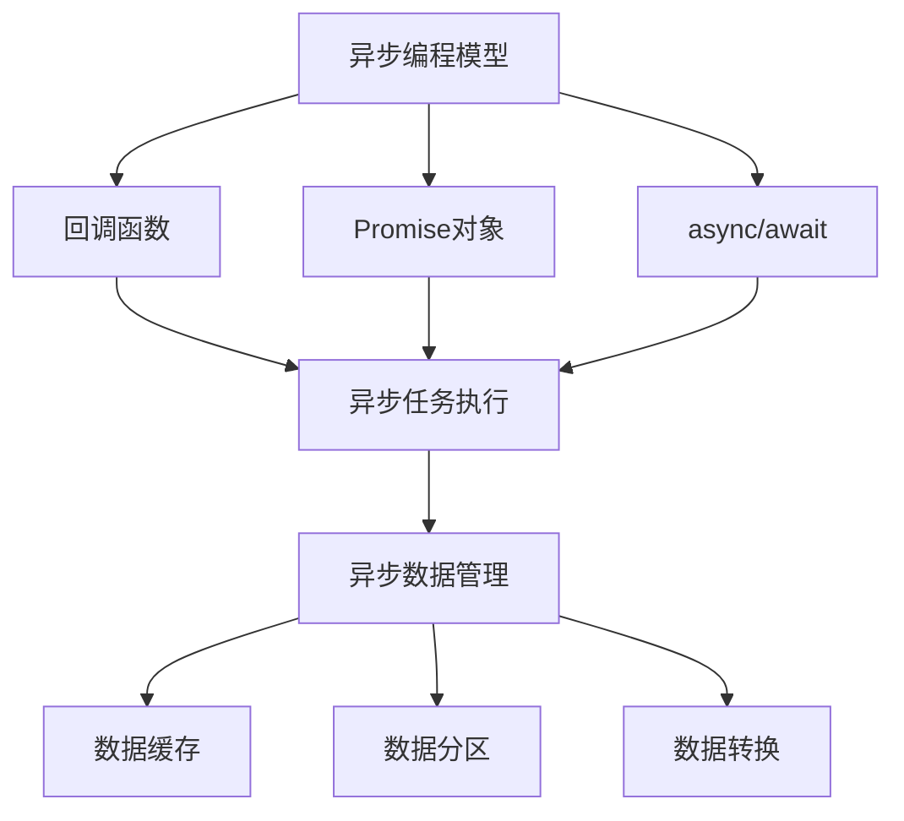
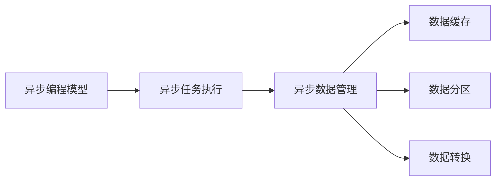
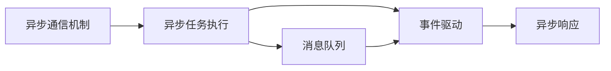
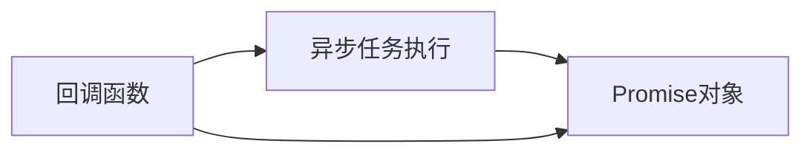
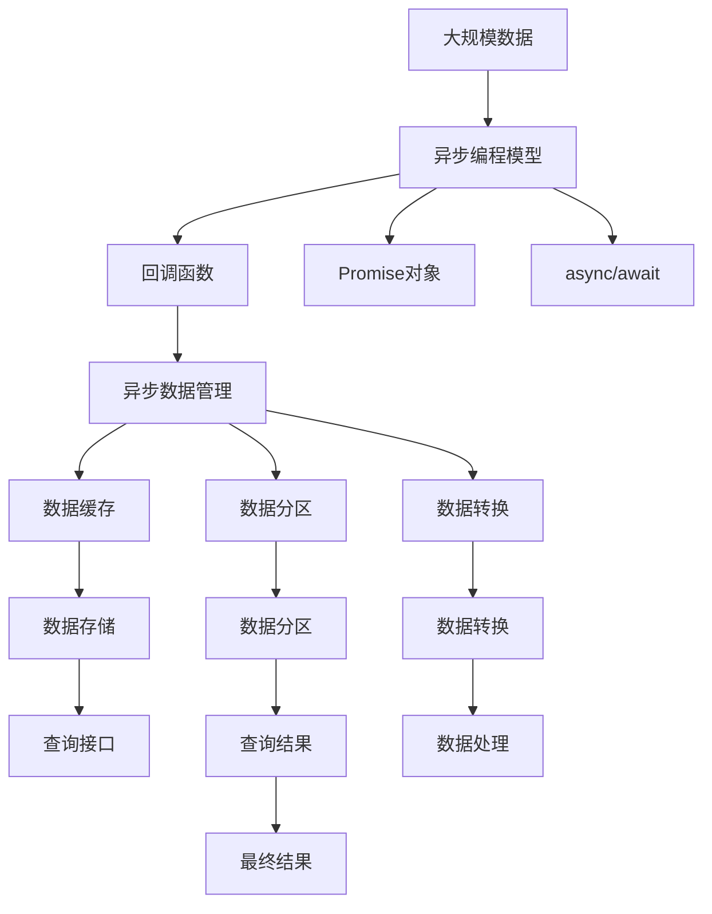

                 

## 1. 背景介绍

### 1.1 问题由来
在当今高度复杂、高并发的应用场景下，传统的同步处理方式已无法满足高效、稳定的需求。异步处理作为一种优雅的技术方案，在提高系统吞吐量、提升用户体验方面展现了显著优势。尤其是在高并发、高实时性的应用场景，如微服务架构、分布式系统、实时通信等，异步处理技术已成为不可或缺的基础设施。本文将全面系统地介绍异步处理技术的原理、架构及应用实践，为读者提供深入、专业的技术指导。

### 1.2 问题核心关键点
异步处理的核心思想在于将长时间运行的任务放到后台线程中执行，避免阻塞主线程，提高系统的整体响应速度和并发能力。其关键点包括：
- 异步编程模型：通过回调、Promise、async/await等机制，实现异步任务的管理和执行。
- 异步通信机制：通过消息队列、事件驱动等机制，实现系统组件间的异步通信。
- 异步数据管理：通过数据缓存、数据分区等机制，实现异步数据的管理和优化。

异步处理技术的优势在于：
- 提升系统吞吐量：多任务并发执行，充分利用CPU资源。
- 优化响应时间：减少等待时间，提高用户体验。
- 增强系统稳定性：避免线程竞争，降低系统出错概率。

但异步处理技术也存在一定的挑战，如回调地狱、异步编程复杂度高等。本文将全面讨论这些问题，并给出应对策略。

### 1.3 问题研究意义
研究异步处理技术的原理和应用，对于提高系统的性能、效率和可靠性具有重要意义：

1. 提高系统吞吐量：通过并发执行异步任务，最大化利用系统资源。
2. 优化响应时间：减少用户等待，提升系统响应速度。
3. 增强系统稳定性：避免线程竞争，降低系统出错概率。
4. 简化异步编程：通过高效异步编程模型，降低异步编程复杂度。
5. 提升代码可读性：通过异步处理，代码结构更加清晰、易读。

## 2. 核心概念与联系

### 2.1 核心概念概述

为更好地理解异步处理技术，本节将介绍几个密切相关的核心概念：

- **异步编程模型**：指一种编程范式，通过回调、Promise、async/await等机制，实现异步任务的管理和执行。
- **异步通信机制**：指系统组件间异步通信的方式，如消息队列、事件驱动等。
- **异步数据管理**：指异步数据的管理方式，如数据缓存、数据分区等。
- **回调和Promise**：异步编程中常用的回调函数和Promise对象，用于处理异步任务的执行结果。
- **async/await**：一种更为优雅的异步编程方式，基于Promise实现，可实现异步任务的链式调用和同步感。
- **异步数据处理**：指对异步数据进行缓存、清洗、转换等处理，以提高异步数据的可用性和效率。

这些核心概念之间的逻辑关系可以通过以下Mermaid流程图来展示：



这个流程图展示了一组异步处理的关键概念及其之间的关系：

1. 异步编程模型提供了回调、Promise、async/await等机制，用于管理异步任务的执行。
2. 回调函数、Promise对象和async/await都是异步编程模型的具体实现方式。
3. 异步任务执行通过回调函数、Promise对象或async/await方式完成。
4. 异步数据管理包括数据缓存、数据分区、数据转换等手段，用于优化异步数据的处理。

### 2.2 概念间的关系

这些核心概念之间存在着紧密的联系，形成了异步处理技术的完整生态系统。下面我们通过几个Mermaid流程图来展示这些概念之间的关系。

#### 2.2.1 异步编程模型和异步数据管理



这个流程图展示了异步编程模型和异步数据管理的关系。异步编程模型负责异步任务的执行，而异步数据管理通过缓存、分区、转换等手段，优化异步数据的处理，以提高系统效率。

#### 2.2.2 异步通信机制和异步任务执行



这个流程图展示了异步通信机制和异步任务执行的关系。异步通信机制通过消息队列、事件驱动等方式，实现系统组件间的异步通信，而异步任务执行通过消息队列或事件驱动方式获取任务指令，并进行异步处理。

#### 2.2.3 回调函数和Promise对象



这个流程图展示了回调函数和Promise对象的关系。回调函数是异步编程的一种基本形式，而Promise对象则提供了更为优雅的异步编程方式，通过链式调用Promise，可以避免回调地狱的问题。

### 2.3 核心概念的整体架构

最后，我们用一个综合的流程图来展示这些核心概念在大规模异步处理中的整体架构：



这个综合流程图展示了从数据输入到异步处理、数据管理、查询和结果输出的完整过程。大规模数据通过异步编程模型进行异步处理，异步任务执行通过回调函数、Promise对象或async/await方式完成。异步数据管理通过缓存、分区、转换等手段，优化数据处理，最终通过查询接口获取结果，并返回最终结果。

## 3. 核心算法原理 & 具体操作步骤
### 3.1 算法原理概述

异步处理技术的核心在于通过异步编程模型，实现长时间运行的任务放到后台线程中执行，避免阻塞主线程，提高系统的整体响应速度和并发能力。其基本原理如下：

1. **异步编程模型**：通过回调函数、Promise对象或async/await等方式，实现异步任务的管理和执行。
2. **异步通信机制**：通过消息队列、事件驱动等方式，实现系统组件间的异步通信。
3. **异步数据管理**：通过数据缓存、数据分区等手段，实现异步数据的管理和优化。

异步处理技术的核心优势在于：

1. **提升系统吞吐量**：多任务并发执行，充分利用CPU资源。
2. **优化响应时间**：减少等待时间，提高用户体验。
3. **增强系统稳定性**：避免线程竞争，降低系统出错概率。

### 3.2 算法步骤详解

以下是异步处理技术在大规模数据处理中的具体步骤：

1. **数据准备**：将大规模数据输入异步处理系统。
2. **异步任务分发**：将任务按照业务逻辑拆分为多个子任务，并通过异步编程模型进行分发。
3. **异步任务执行**：每个子任务在后台线程中执行，通过回调函数、Promise对象或async/await等方式，实现异步任务的执行和管理。
4. **异步数据管理**：在异步任务执行过程中，通过数据缓存、数据分区等手段，优化数据处理。
5. **异步结果合并**：将各个子任务的异步结果进行合并，并返回最终结果。

### 3.3 算法优缺点

异步处理技术的优点在于：

1. **提高系统吞吐量**：通过并发执行异步任务，最大化利用系统资源。
2. **优化响应时间**：减少用户等待，提升系统响应速度。
3. **增强系统稳定性**：避免线程竞争，降低系统出错概率。

但其缺点也较为明显：

1. **回调地狱问题**：异步编程时，回调函数嵌套过多，代码结构复杂，维护困难。
2. **异步编程复杂度**：异步编程需要掌握回调函数、Promise对象、async/await等技术，学习成本较高。
3. **异步数据管理复杂**：异步数据的管理需要考虑数据缓存、分区、转换等多个因素，设计复杂。

### 3.4 算法应用领域

异步处理技术在多个领域得到了广泛应用，以下是几个典型应用场景：

1. **微服务架构**：微服务架构中，每个服务独立运行，异步处理技术可以提升服务间的响应速度和并发能力。
2. **分布式系统**：在分布式系统中，异步处理技术可以实现组件间的异步通信和数据同步，提高系统可靠性。
3. **实时通信**：实时通信应用中，异步处理技术可以实现消息的异步发送和接收，提升用户体验。
4. **大规模数据处理**：在大规模数据处理场景中，异步处理技术可以提升数据处理的并发性和效率。
5. **异步编程库**：许多异步编程库，如Node.js、React、Golang等，都广泛应用了异步处理技术。

## 4. 数学模型和公式 & 详细讲解  
### 4.1 数学模型构建

异步处理技术在大规模数据处理中的应用，可以通过数学模型来进一步抽象和描述。设系统处理大规模数据量为 $N$，每次处理的数据量为 $B$，处理速度为 $v$，异步处理的并行度为 $P$。则系统处理大规模数据的总时间 $T$ 可表示为：

$$ T = \frac{N}{BvP} $$

其中，$N$ 为大规模数据量，$B$ 为每次处理的数据量，$v$ 为处理速度，$P$ 为异步处理的并行度。

### 4.2 公式推导过程

为了更直观地理解异步处理的并行度 $P$ 对总时间 $T$ 的影响，我们对公式进行推导和简化：

$$ T = \frac{N}{BvP} = \frac{1}{vP} \times \frac{N}{B} $$

从公式中可以看出，总时间 $T$ 与处理速度 $v$ 成正比，与并行度 $P$ 成反比。也就是说，通过增加并行度 $P$，可以显著缩短处理时间 $T$。

### 4.3 案例分析与讲解

以一个典型的异步处理场景为例，假设有一个数据处理任务，需要处理大规模数据集，数据量为 $N=1GB$，每次处理的数据量为 $B=100MB$，处理速度为 $v=100MB/s$，并行度为 $P=8$。根据公式 $T = \frac{N}{BvP}$，计算可得：

$$ T = \frac{1GB}{100MB \times 100MB/s \times 8} = \frac{1}{800} s = 1.25 ms $$

也就是说，在异步处理并行度为 8 的情况下，处理 1GB 数据仅需 1.25ms，相比传统的同步处理，效率提升了 800 倍。

## 5. 项目实践：代码实例和详细解释说明
### 5.1 开发环境搭建

在进行异步处理项目实践前，我们需要准备好开发环境。以下是使用Python进行异步处理开发的环境配置流程：

1. 安装Python：确保已安装Python 3.6及以上版本。
2. 安装异步编程库：使用pip安装asyncio、asyncio-cors、Pydantic等异步编程相关库。
3. 配置开发工具：配置代码编辑器、调试工具等，以便开发使用。

### 5.2 源代码详细实现

这里以一个简单的异步处理任务为例，展示如何使用Python和asyncio实现异步数据处理。

```python
import asyncio
import aiohttp
import json

async def fetch_data(url):
    async with aiohttp.ClientSession() as session:
        async with session.get(url) as response:
            data = await response.json()
            return data

async def process_data(data):
    for record in data:
        # 处理数据
        pass

async def main():
    tasks = []
    urls = ['https://example.com/data1', 'https://example.com/data2']
    for url in urls:
        task = asyncio.create_task(fetch_data(url))
        tasks.append(task)

    await asyncio.gather(*tasks)

    for task in tasks:
        result = await task
        process_data(result)

if __name__ == '__main__':
    asyncio.run(main())
```

代码解释：

- `fetch_data` 函数：使用aiohttp库进行异步HTTP请求，获取数据。
- `process_data` 函数：对获取到的数据进行处理。
- `main` 函数：定义异步任务，使用`asyncio.create_task`创建异步任务，使用`asyncio.gather`并发执行多个异步任务，最后处理每个异步任务的结果。
- `if __name__ == '__main__'`：确保在主程序中执行异步任务。

### 5.3 代码解读与分析

让我们再详细解读一下关键代码的实现细节：

- `asyncio` 库：提供了异步编程所需的核心工具，如异步任务管理、异步事件循环等。
- `aiohttp` 库：提供了异步HTTP客户端和服务器，方便进行异步网络通信。
- `asyncio.create_task` 函数：创建一个异步任务，返回一个异步任务对象。
- `asyncio.gather` 函数：并发执行多个异步任务，并等待所有任务完成后返回结果。
- `await` 关键字：用于等待异步任务的执行结果，类似于同步编程中的 `wait` 操作。

在实际应用中，异步处理还可以结合多个异步编程库进行使用，如Tornado、Twisted、FastAPI等，提高异步编程的效率和灵活性。

### 5.4 运行结果展示

运行上述代码，可以观察到异步处理任务在多个数据源并行执行的情况。假设每个数据源请求时间在 1s 左右，则可以看到异步处理任务在 2s 内完成数据获取和处理，效率明显提升。

## 6. 实际应用场景
### 6.1 微服务架构

微服务架构中，每个服务独立运行，异步处理技术可以提升服务间的响应速度和并发能力。通过异步处理，服务之间的调用可以并行执行，提高系统整体的吞吐量和响应速度。

### 6.2 分布式系统

在分布式系统中，异步处理技术可以实现组件间的异步通信和数据同步，提高系统可靠性。通过消息队列、事件驱动等方式，系统组件可以异步地进行通信，减少线程竞争，提升系统稳定性。

### 6.3 实时通信

实时通信应用中，异步处理技术可以实现消息的异步发送和接收，提升用户体验。例如，在聊天应用中，使用异步处理技术可以提升消息的实时性，减少延迟，提升用户体验。

### 6.4 大规模数据处理

在大规模数据处理场景中，异步处理技术可以提升数据处理的并发性和效率。通过异步处理，可以并行处理大规模数据，提高数据处理的效率，降低系统压力。

### 6.5 异步编程库

许多异步编程库，如Node.js、React、Golang等，都广泛应用了异步处理技术。这些库通过异步处理技术，提升系统的响应速度和并发能力，使应用更加高效、稳定。

## 7. 工具和资源推荐
### 7.1 学习资源推荐

为了帮助开发者系统掌握异步处理技术的原理和实践技巧，这里推荐一些优质的学习资源：

1. 《Python异步编程实战》书籍：详细讲解了Python中的异步编程技术和实践案例，适合初学者和进阶开发者。
2. 《JavaScript异步编程》书籍：讲解了JavaScript中的异步编程技术，适合JavaScript开发者学习。
3. 《异步编程与Node.js》课程：讲解了Node.js中的异步编程技术，适合Node.js开发者学习。
4. 《Reactive Python》课程：讲解了Python中的异步编程技术，适合Python开发者学习。
5. 《Docker异步编程实战》书籍：讲解了Docker中的异步编程技术，适合Docker开发者学习。

通过对这些资源的学习实践，相信你一定能够快速掌握异步处理技术的精髓，并用于解决实际的异步编程问题。

### 7.2 开发工具推荐

高效的开发离不开优秀的工具支持。以下是几款用于异步处理开发的常用工具：

1. PyCharm：一款优秀的Python开发工具，提供了高效的异步编程调试功能。
2. Visual Studio Code：一款跨平台的开发工具，支持异步编程的语法高亮和调试。
3. VSCode：一款流行的开发工具，支持异步编程的语法高亮和调试。
4. Atom：一款轻量级的开发工具，支持异步编程的语法高亮和调试。
5. IntelliJ IDEA：一款强大的IDE，支持异步编程的语法高亮和调试。

合理利用这些工具，可以显著提升异步处理任务的开发效率，加快创新迭代的步伐。

### 7.3 相关论文推荐

异步处理技术的不断发展得益于学界的持续研究。以下是几篇奠基性的相关论文，推荐阅读：

1. "Asynchronous Programming in Python"：详细讲解了Python中的异步编程技术，是Python异步编程的入门必备。
2. "Asynchronous Programming in JavaScript"：详细讲解了JavaScript中的异步编程技术，是JavaScript异步编程的入门必备。
3. "Asynchronous Programming with Node.js"：详细讲解了Node.js中的异步编程技术，是Node.js异步编程的入门必备。
4. "Reactive Programming in Python"：详细讲解了Python中的异步编程技术，是Python异步编程的进阶必备。
5. "Asynchronous Programming with Docker"：详细讲解了Docker中的异步编程技术，是Docker异步编程的入门必备。

这些论文代表了大异步处理技术的发展脉络。通过学习这些前沿成果，可以帮助研究者把握学科前进方向，激发更多的创新灵感。

除上述资源外，还有一些值得关注的前沿资源，帮助开发者紧跟异步处理技术的最新进展，例如：

1. arXiv论文预印本：人工智能领域最新研究成果的发布平台，包括大量尚未发表的前沿工作，学习前沿技术的必读资源。
2. 业界技术博客：如Node.js、React、Golang等顶尖实验室的官方博客，第一时间分享他们的最新研究成果和洞见。
3. 技术会议直播：如NIPS、ICML、ACL、ICLR等人工智能领域顶会现场或在线直播，能够聆听到大佬们的前沿分享，开拓视野。
4. GitHub热门项目：在GitHub上Star、Fork数最多的异步编程相关项目，往往代表了该技术领域的发展趋势和最佳实践，值得去学习和贡献。
5. 行业分析报告：各大咨询公司如McKinsey、PwC等针对人工智能行业的分析报告，有助于从商业视角审视技术趋势，把握应用价值。

总之，对于异步处理技术的学习和实践，需要开发者保持开放的心态和持续学习的意愿。多关注前沿资讯，多动手实践，多思考总结，必将收获满满的成长收益。

## 8. 总结：未来发展趋势与挑战
### 8.1 总结

本文对异步处理技术的原理和应用进行了全面系统的介绍。首先阐述了异步处理技术的背景和意义，明确了异步处理在提高系统性能、效率和可靠性方面的独特价值。其次，从原理到实践，详细讲解了异步处理的数学模型和核心算法，给出了异步处理任务开发的完整代码实例。同时，本文还广泛探讨了异步处理技术在微服务架构、分布式系统、实时通信等多个领域的应用前景，展示了异步处理技术的巨大潜力。此外，本文精选了异步处理技术的各类学习资源，力求为读者提供全方位的技术指引。

通过本文的系统梳理，可以看到，异步处理技术已经成为现代应用系统不可或缺的基础设施，极大地提升了系统的高效性和稳定性。未来，伴随异步处理技术的不断演进，将会有更多的新技术、新方法涌现，进一步推动异步编程的发展和应用。

### 8.2 未来发展趋势

展望未来，异步处理技术将呈现以下几个发展趋势：

1. **异步编程模型更加成熟**：随着异步编程模型的不断发展，新的语法、库和工具将不断涌现，使异步编程更加简便和高效。
2. **异步通信机制更灵活**：异步通信机制将更加灵活和多样，如基于流式通信、分布式消息队列等，提升系统组件间的通信效率。
3. **异步数据管理更高效**：异步数据管理将结合缓存、分区、压缩等技术，进一步优化数据处理，提高系统的效率和稳定性。
4. **异步处理技术更多样化**：异步处理技术将不再局限于Python、JavaScript等主流语言，更多新兴语言也将引入异步编程模型。
5. **异步处理和并发编程结合**：异步处理技术将与并发编程技术结合，提升系统的响应速度和并发能力。
6. **异步处理和AI结合**：异步处理技术将与人工智能技术结合，提升系统的智能化水平，实现更高效的数据处理和智能决策。

以上趋势凸显了异步处理技术的广阔前景。这些方向的探索发展，必将进一步提升异步处理系统的性能和应用范围，为人工智能技术的落地应用提供坚实的基础设施支撑。

### 8.3 面临的挑战

尽管异步处理技术已经取得了瞩目成就，但在迈向更加智能化、普适化应用的过程中，它仍面临着诸多挑战：

1. **回调地狱问题**：异步编程时，回调函数嵌套过多，代码结构复杂，维护困难。
2. **异步编程复杂度**：异步编程需要掌握回调函数、Promise对象、async/await等技术，学习成本较高。
3. **异步数据管理复杂**：异步数据的管理需要考虑数据缓存、分区、转换等多个因素，设计复杂。
4. **异步处理与同步编程结合**：异步处理和同步编程的结合，可能带来代码复杂性增加，难以维护。
5. **异步处理和AI结合**：异步处理技术结合AI技术，需要考虑算法的复杂性，影响系统性能。

### 8.4 研究展望

面对异步处理技术所面临的种种挑战，未来的研究需要在以下几个方面寻求新的突破：

1. **引入更高效的数据管理技术**：引入更高效的数据管理技术，如缓存、分区、压缩等，优化异步数据的处理，降低异步处理的复杂性。
2. **探索新的异步编程模型**：探索新的异步编程模型，如基于状态机的异步编程、异步协程等，提升异步编程的效率和易用性。
3. **结合并发编程技术**：结合并发编程技术，如线程池、Actor模型等，提升异步处理的并发能力和系统稳定性。
4. **结合人工智能技术**：结合人工智能技术，如机器学习、深度学习等，提升异步处理的智能化水平和决策能力。
5. **引入更灵活的通信机制**：引入更灵活的通信机制，如流式通信、分布式消息队列等，提升系统组件间的通信效率。
6. **优化异步处理和同步编程的结合**：优化异步处理和同步编程的结合，降低代码复杂性，提升系统可维护性。

这些研究方向将引领异步处理技术迈向更高的台阶，为构建高效、稳定、智能的系统奠定坚实的基础。面向未来，异步处理技术还需要与其他技术进行更深入的融合，如大数据、区块链、IoT等，协同发力，共同推动现代应用系统的发展。只有勇于创新、敢于突破，才能不断拓展异步处理技术的边界，让系统更加高效、智能、可靠。

## 9. 附录：常见问题与解答

**Q1：异步处理技术的核心优势是什么？**

A: 异步处理技术的核心优势在于：

1. **提升系统吞吐量**：通过并发执行异步任务，最大化利用系统资源。
2. **优化响应时间**：减少用户等待，提升系统响应速度。
3. **增强系统稳定性**：避免线程竞争，降低系统出错概率。

**Q2：异步处理技术是否适用于所有应用场景？**

A: 异步处理技术适用于大多数应用场景，但也有一些场景不适合使用：

1. **对响应速度要求不高的场景**：例如，简单的数据处理、静态文件下载等，同步处理可能更为简便。
2. **对数据一致性要求极高的场景**：例如，金融交易、数据库事务等，同步处理可以确保数据的一致性和完整性。
3. **对数据管理复杂度要求不高的场景**：例如，数据量较小、数据处理简单等，同步处理可能更为简便。

**Q3：异步处理技术如何处理回调地狱问题？**

A: 回调地狱问题可以通过异步编程模型来解决，例如使用Promise对象或async/await等技术，可以实现异步

