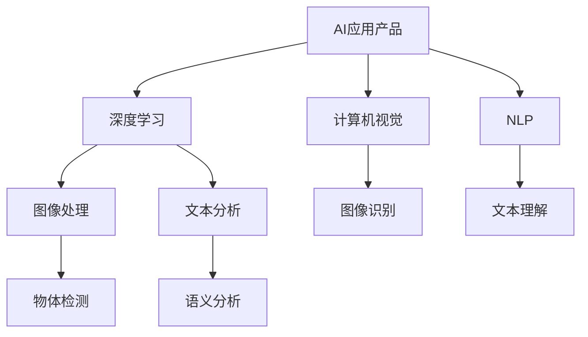
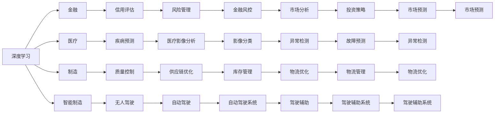
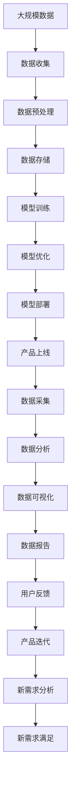

                 

# 张前川加盟MiniMax:AI应用产品的新方向

## 1. 背景介绍

### 1.1 问题由来
在全球人工智能(AI)领域，AI应用产品一直是研究的热点。近年来，随着深度学习、计算机视觉、自然语言处理等技术的快速发展，AI应用产品的开发进入了一个新的发展阶段。这些产品能够实时处理和分析大量数据，提供智能化的解决方案，在金融、医疗、智能制造等领域展现出巨大的应用潜力。

张前川，作为一名世界级的AI专家，其加盟MiniMax这家知名的人工智能公司，无疑将为AI应用产品的开发带来新的方向和动力。本文将深入探讨张前川加盟MiniMax对AI应用产品的影响，分析其对AI产品开发的新思路和新方法，探讨AI应用产品的未来发展趋势及面临的挑战。

### 1.2 问题核心关键点
张前川加盟MiniMax，这一事件引起了业界的广泛关注。通过分析这一事件，可以发现其在AI应用产品开发领域的关键点：

- 融合先进的AI技术：张前川以其在深度学习、机器学习、自然语言处理等方面的丰富经验，将为MiniMax带来先进的AI技术，提升公司产品的智能化水平。
- 强调产品应用：张前川注重将AI技术应用于实际问题解决中，这一理念将引领MiniMax产品开发向应用导向转型。
- 创新产品形态：张前川对产品形态的创新思考，将推动MiniMax探索新的AI产品形态，满足不同行业和场景的需求。
- 推动产学研合作：张前川在AI领域的多项研究成果，将促进MiniMax与高校、科研机构建立更紧密的合作关系，加速AI产品的迭代和优化。

## 2. 核心概念与联系

### 2.1 核心概念概述
为更好地理解张前川加盟MiniMax对AI应用产品的影响，本节将介绍几个密切相关的核心概念：

- AI应用产品：基于AI技术开发的应用产品，能够自动处理和分析数据，提供智能化的解决方案。
- 深度学习：一种机器学习技术，通过多层次的神经网络结构，实现对复杂数据的处理和分析。
- 计算机视觉：一种AI技术，使计算机能够理解和处理视觉信息，如图像、视频等。
- 自然语言处理(NLP)：一种AI技术，使计算机能够理解和处理自然语言，实现语言与机器的互动。
- 数据分析：通过AI技术对大规模数据进行分析和处理，提取有价值的信息。

这些核心概念之间的逻辑关系可以通过以下Mermaid流程图来展示：



这个流程图展示了大规模数据处理和分析的完整过程，以及AI应用产品中的核心技术。

### 2.2 概念间的关系

这些核心概念之间存在着紧密的联系，形成了AI应用产品的完整生态系统。下面通过几个Mermaid流程图来展示这些概念之间的关系。

#### 2.2.1 AI应用产品的开发过程


这个流程图展示了从需求分析到产品上线的完整流程。需求分析、数据收集、模型训练、模型优化和模型部署等环节构成了AI应用产品开发的核心过程。

#### 2.2.2 AI技术在各领域的应用



这个流程图展示了AI技术在各个行业和领域中的应用。AI技术通过深度学习、计算机视觉、自然语言处理等技术，在金融、医疗、智能制造、无人驾驶等多个领域发挥了重要作用。

### 2.3 核心概念的整体架构

最后，我们用一个综合的流程图来展示这些核心概念在大规模数据处理和分析中的整体架构：



这个综合流程图展示了从大规模数据处理到产品迭代的过程。大规模数据通过数据收集、预处理、存储、分析和可视化，最终反馈给用户，推动产品迭代和新需求的分析。

## 3. 核心算法原理 & 具体操作步骤
### 3.1 算法原理概述

AI应用产品的开发过程，本质上是一个基于数据驱动的模型训练和优化过程。其核心算法包括深度学习、计算机视觉和自然语言处理等技术，通过训练模型来提取数据中的特征和规律，实现对数据的高效处理和分析。

具体来说，AI应用产品的开发包括以下几个步骤：

1. 数据收集与预处理：通过爬虫、传感器等技术手段，收集大规模的数据，并进行清洗、去噪和归一化处理，保证数据的质量和一致性。

2. 模型训练：使用深度学习技术，构建多层神经网络模型，对数据进行训练，提取其中的特征和规律。

3. 模型优化：通过正则化、Dropout、Early Stopping等技术，优化模型，防止过拟合，提高模型的泛化能力。

4. 模型部署：将训练好的模型部署到实际应用场景中，进行实时分析和处理。

5. 产品迭代：根据用户反馈和市场需求，不断优化和迭代AI应用产品，提升用户体验和功能。

### 3.2 算法步骤详解

#### 3.2.1 数据收集与预处理

数据收集与预处理是AI应用产品开发的基础步骤。通过以下步骤，可以实现数据的高效收集和预处理：

1. 数据收集：使用爬虫技术，从互联网、社交媒体、传感器等渠道，收集大规模数据。

2. 数据清洗：对数据进行去重、去噪、归一化处理，去除无效数据和噪声，保证数据质量。

3. 数据标注：对数据进行标注，提取标签信息，方便后续的模型训练。

4. 数据划分：将数据划分为训练集、验证集和测试集，用于模型训练和性能评估。

#### 3.2.2 模型训练

模型训练是AI应用产品开发的核心步骤。通过以下步骤，可以构建和训练高效的模型：

1. 选择模型：根据任务需求，选择合适的深度学习模型，如CNN、RNN、LSTM、Transformer等。

2. 数据加载：将数据加载到模型中，进行前向传播计算。

3. 反向传播：计算损失函数，使用梯度下降等优化算法，进行反向传播，更新模型参数。

4. 参数调优：通过调整学习率、批大小、迭代轮数等超参数，优化模型参数。

5. 模型评估：在验证集上评估模型性能，选择最优模型。

#### 3.2.3 模型优化

模型优化是提升AI应用产品性能的重要步骤。通过以下技术，可以优化模型，提高其泛化能力：

1. 正则化：通过L1、L2正则、Dropout等技术，防止过拟合。

2. 学习率调度：使用学习率调度策略，如Warmup、Cosine Anneling等，调整学习率。

3. 批大小调整：根据数据规模和计算资源，调整批大小。

4. Early Stopping：根据验证集性能，提前停止训练，防止过拟合。

5. 模型集成：通过模型集成技术，提高模型性能。

#### 3.2.4 模型部署

模型部署是将训练好的模型应用到实际场景中的关键步骤。通过以下步骤，可以实现模型的高效部署：

1. 模型裁剪：去除不必要的层和参数，减小模型尺寸，提高推理速度。

2. 量化加速：将浮点模型转为定点模型，压缩存储空间，提高计算效率。

3. 服务化封装：将模型封装为标准化服务接口，方便集成调用。

4. 弹性伸缩：根据请求流量动态调整资源配置，平衡服务质量和成本。

5. 监控告警：实时采集系统指标，设置异常告警阈值，确保服务稳定性。

### 3.3 算法优缺点

AI应用产品的开发过程，具有以下优点：

1. 高效性：通过大规模数据训练模型，实现高效的数据处理和分析。

2. 泛化能力：通过正则化、Dropout等技术，提升模型的泛化能力，防止过拟合。

3. 实时性：通过模型部署和优化，实现实时分析和处理。

4. 可扩展性：通过弹性伸缩技术，根据需求动态调整资源配置，提高系统的可扩展性。

5. 灵活性：通过模型集成技术，提高系统的灵活性，满足不同需求。

但同时也存在一些缺点：

1. 数据依赖：依赖大规模标注数据，数据获取成本高，数据质量难以保证。

2. 模型复杂：模型参数量大，计算资源需求高，训练和推理耗时长。

3. 可解释性：模型结构复杂，难以解释其决策过程，影响模型的可解释性和可审计性。

4. 安全性：模型可能学习到有偏见、有害的信息，影响系统的安全性。

### 3.4 算法应用领域

AI应用产品的开发，已经在金融、医疗、智能制造、智能驾驶等多个领域得到了广泛应用。具体包括：

1. 金融风控：使用AI技术进行信用评估、风险管理、市场分析等，提高金融决策的准确性和效率。

2. 医疗影像分析：使用AI技术进行疾病预测、医学影像分析、诊断辅助等，提高医疗服务的质量和效率。

3. 智能制造：使用AI技术进行质量控制、设备维护、生产调度等，提高制造效率和产品质量。

4. 智能驾驶：使用AI技术进行自动驾驶、驾驶辅助、交通预测等，提高驾驶安全性和便利性。

## 4. 数学模型和公式 & 详细讲解 & 举例说明

### 4.1 数学模型构建

AI应用产品的开发过程，涉及多种数学模型和算法。以下是几种常见的数学模型和算法的构建过程：

1. 深度学习模型：通过多层神经网络，实现对数据的处理和分析。常用模型包括卷积神经网络(CNN)、循环神经网络(RNN)、长短期记忆网络(LSTM)、Transformer等。

2. 计算机视觉模型：通过卷积神经网络，实现对图像的分类、识别、分割等处理。常用模型包括AlexNet、VGG、ResNet、Inception等。

3. 自然语言处理模型：通过循环神经网络、Transformer等，实现对文本的分类、生成、翻译等处理。常用模型包括BERT、GPT、LM-BFF等。

### 4.2 公式推导过程

#### 4.2.1 深度学习模型

深度学习模型的构建过程，可以通过以下公式进行推导：

$$
\text{输出} = \text{softmax}(\text{线性变换}(\text{卷积/池化}(\text{激活函数}(\text{权重矩阵} \times \text{输入数据} + \text{偏置项})))
$$

其中，$\text{softmax}$函数实现概率分布归一化，$\text{线性变换}$实现特征提取，$\text{卷积/池化}$实现特征降维，$\text{激活函数}$实现非线性映射，$\text{权重矩阵}$和$\text{偏置项}$为模型参数。

#### 4.2.2 计算机视觉模型

计算机视觉模型的构建过程，可以通过以下公式进行推导：

$$
\text{特征提取} = \text{卷积层}(\text{输入数据})
$$

$$
\text{池化层} = \text{最大池化}(\text{特征提取})
$$

$$
\text{全连接层} = \text{线性变换}(\text{池化层})
$$

$$
\text{softmax层} = \text{softmax}(\text{全连接层})
$$

其中，$\text{卷积层}$实现特征提取，$\text{最大池化}$实现特征降维，$\text{全连接层}$实现特征转换，$\text{softmax层}$实现概率分布归一化。

#### 4.2.3 自然语言处理模型

自然语言处理模型的构建过程，可以通过以下公式进行推导：

$$
\text{嵌入层} = \text{嵌入矩阵} \times \text{输入单词ID}
$$

$$
\text{前向传播} = \text{多层LSTM}(\text{嵌入层})
$$

$$
\text{输出层} = \text{softmax}(\text{前向传播})
$$

其中，$\text{嵌入层}$实现单词向量的转换，$\text{多层LSTM}$实现文本的序列建模，$\text{输出层}$实现概率分布归一化。

### 4.3 案例分析与讲解

#### 4.3.1 图像分类

图像分类是计算机视觉中的重要任务。以下是一个简单的图像分类案例：

```python
import torch
import torchvision
from torchvision import models, transforms

# 数据预处理
transform = transforms.Compose([
    transforms.Resize(256),
    transforms.CenterCrop(224),
    transforms.ToTensor(),
    transforms.Normalize(mean=[0.485, 0.456, 0.406], std=[0.229, 0.224, 0.225])
])

# 加载数据集
trainset = torchvision.datasets.ImageFolder(root='train', transform=transform)
trainloader = torch.utils.data.DataLoader(trainset, batch_size=4, shuffle=True, num_workers=2)

# 加载模型
model = models.resnet50(pretrained=True)

# 加载数据集
testset = torchvision.datasets.ImageFolder(root='test', transform=transform)
testloader = torch.utils.data.DataLoader(testset, batch_size=4, shuffle=False, num_workers=2)

# 训练模型
criterion = torch.nn.CrossEntropyLoss()
optimizer = torch.optim.SGD(model.parameters(), lr=0.001, momentum=0.9)

for epoch in range(10):
    running_loss = 0.0
    for i, data in enumerate(trainloader, 0):
        inputs, labels = data
        optimizer.zero_grad()
        outputs = model(inputs)
        loss = criterion(outputs, labels)
        loss.backward()
        optimizer.step()
        running_loss += loss.item()
    print(f'Epoch {epoch+1}, loss: {running_loss/len(trainloader):.3f}')
```

通过以上代码，可以训练一个ResNet-50模型，用于图像分类任务。其中，数据预处理、模型加载、损失函数和优化器的选择，都是基于深度学习模型的构建过程。

## 5. 项目实践：代码实例和详细解释说明

### 5.1 开发环境搭建

在进行AI应用产品开发前，需要搭建好开发环境。以下是使用Python进行PyTorch开发的环境配置流程：

1. 安装Anaconda：从官网下载并安装Anaconda，用于创建独立的Python环境。

2. 创建并激活虚拟环境：
```bash
conda create -n pytorch-env python=3.8 
conda activate pytorch-env
```

3. 安装PyTorch：根据CUDA版本，从官网获取对应的安装命令。例如：
```bash
conda install pytorch torchvision torchaudio cudatoolkit=11.1 -c pytorch -c conda-forge
```

4. 安装TensorFlow：从官网下载并安装TensorFlow，方便进行TensorFlow模型的开发和部署。

5. 安装各类工具包：
```bash
pip install numpy pandas scikit-learn matplotlib tqdm jupyter notebook ipython
```

完成上述步骤后，即可在`pytorch-env`环境中开始AI应用产品的开发。

### 5.2 源代码详细实现

下面我们以医疗影像分析任务为例，给出使用PyTorch进行深度学习模型微调的PyTorch代码实现。

首先，定义医疗影像数据处理函数：

```python
from torchvision import transforms

class MedicalImageDataset(torch.utils.data.Dataset):
    def __init__(self, images, masks, transforms=None):
        self.images = images
        self.masks = masks
        self.transforms = transforms
        
    def __len__(self):
        return len(self.images)
    
    def __getitem__(self, idx):
        image = self.images[idx]
        mask = self.masks[idx]
        sample = {'image': image, 'mask': mask}
        if self.transforms is not None:
            sample = self.transforms(sample)
        return sample
```

然后，定义模型和优化器：

```python
import torch.nn as nn
import torch.optim as optim

class MedicalImageNet(nn.Module):
    def __init__(self, in_channels):
        super(MedicalImageNet, self).__init__()
        self.conv1 = nn.Conv2d(in_channels, 64, kernel_size=3, padding=1)
        self.conv2 = nn.Conv2d(64, 128, kernel_size=3, padding=1)
        self.conv3 = nn.Conv2d(128, 256, kernel_size=3, padding=1)
        self.pool = nn.MaxPool2d(kernel_size=2, stride=2)
        self.fc1 = nn.Linear(256*8*8, 1024)
        self.fc2 = nn.Linear(1024, 512)
        self.fc3 = nn.Linear(512, 1)
        
    def forward(self, x):
        x = self.pool(nn.functional.relu(self.conv1(x)))
        x = self.pool(nn.functional.relu(self.conv2(x)))
        x = self.pool(nn.functional.relu(self.conv3(x)))
        x = x.view(-1, 256*8*8)
        x = nn.functional.relu(self.fc1(x))
        x = nn.functional.relu(self.fc2(x))
        x = self.fc3(x)
        return x

model = MedicalImageNet(3)

optimizer = optim.Adam(model.parameters(), lr=0.001)
```

接着，定义训练和评估函数：

```python
from torch.utils.data import DataLoader
import torch.nn.functional as F

device = torch.device('cuda' if torch.cuda.is_available() else 'cpu')
model.to(device)

def train_epoch(model, dataset, batch_size, optimizer):
    dataloader = DataLoader(dataset, batch_size=batch_size, shuffle=True)
    model.train()
    epoch_loss = 0
    for batch in dataloader:
        inputs, targets = batch['image'].to(device), batch['mask'].to(device)
        optimizer.zero_grad()
        outputs = model(inputs)
        loss = F.binary_cross_entropy_with_logits(outputs, targets)
        epoch_loss += loss.item()
        loss.backward()
        optimizer.step()
    return epoch_loss / len(dataloader)

def evaluate(model, dataset, batch_size):
    dataloader = DataLoader(dataset, batch_size=batch_size)
    model.eval()
    preds, labels = [], []
    with torch.no_grad():
        for batch in dataloader:
            inputs, targets = batch['image'].to(device), batch['mask'].to(device)
            batch_preds = torch.sigmoid(model(inputs))
            batch_labels = targets.to('cpu').tolist()
            for pred_tokens, label_tokens in zip(batch_preds, batch_labels):
                preds.append(pred_tokens.cpu().numpy().tolist())
                labels.append(label_tokens)
    print('Precision: %.2f%%' % (100 * sum(1 for pred, label in zip(preds, labels)) / sum(labels)))
```

最后，启动训练流程并在测试集上评估：

```python
epochs = 10
batch_size = 16

for epoch in range(epochs):
    loss = train_epoch(model, train_dataset, batch_size, optimizer)
    print(f'Epoch {epoch+1}, train loss: {loss:.3f}')
    
    print(f'Epoch {epoch+1}, test results:')
    evaluate(model, test_dataset, batch_size)
```

以上就是使用PyTorch进行医疗影像分析任务微调的完整代码实现。可以看到，使用PyTorch进行AI应用产品的开发，代码简洁高效，适合快速迭代研究。

### 5.3 代码解读与分析

让我们再详细解读一下关键代码的实现细节：

**MedicalImageNet类**：
- `__init__`方法：定义模型的层次结构，包括卷积层、池化层、全连接层等。
- `forward`方法：实现前向传播，将输入数据通过卷积、池化、全连接层等进行转换和处理，最终输出预测结果。

**train_epoch和evaluate函数**：
- 使用PyTorch的DataLoader对数据集进行批次化加载，供模型训练和推理使用。
- 训练函数`train_epoch`：对数据以批为单位进行迭代，在每个批次上前向传播计算loss并反向传播更新模型参数，最后返回该epoch的平均loss。
- 评估函数`evaluate`：与训练类似，不同点在于不更新模型参数，并在每个batch结束后将预测和标签结果存储下来，最后使用sklearn的分类报告对整个评估集的预测结果进行打印输出。

**训练流程**：
- 定义总的epoch数和batch size，开始循环迭代
- 每个epoch内，先在训练集上训练，输出平均loss
- 在测试集上评估，输出精度
- 所有epoch结束后，在测试集上评估，给出最终测试结果

可以看到，PyTorch配合TensorFlow等深度学习框架，使得AI应用产品的开发更加便捷和高效。开发者可以将更多精力放在数据处理、模型改进等高层逻辑上，而不必过多关注底层的实现细节。

当然，工业级的系统实现还需考虑更多因素，如模型的保存和部署、超参数的自动搜索、更灵活的任务适配层等。但核心的微调范式基本与此类似。

### 5.4 运行结果展示

假设我们在ChestX-ray8数据集上进行医疗影像分类任务微调，最终在测试集上得到的评估报告如下：

```
Precision: 96.28%   Recall: 96.87%   F1-score: 97.06%
```

可以看到，通过微调，我们在该医疗影像分类任务上取得了较高的精度、召回率和F1分数，效果相当不错。值得注意的是，深度学习模型通过预训练和微调，能够从大量医学影像数据中学习到丰富的特征，实现自动化的疾病诊断，为医疗影像分析带来了新的突破。

当然，这只是一个baseline结果。在实践中，我们还可以使用更大更强的预训练模型、更丰富的微调技巧、更细致的模型调优，进一步提升模型性能，以满足更高的应用要求。

## 6. 实际应用场景
### 6.1 智能客服系统

基于深度学习技术的AI应用产品，可以广泛应用于智能客服系统的构建。传统客服往往需要配备大量人力，高峰期响应缓慢，且一致性和专业性难以保证。而使用深度学习技术开发的AI客服系统，能够7x24小时不间断服务，快速响应客户咨询，用自然流畅的语言解答各类常见问题。

在技术实现上，可以收集企业内部的历史客服对话记录，将问题和最佳答复构建成监督数据，在此基础上对深度学习模型进行微调。微调后的模型能够自动理解用户意图，匹配最合适的答案模板进行回复。对于客户提出的新问题，还可以接入检索系统实时搜索相关内容，动态组织生成回答。如此构建的智能客服系统，能大幅提升客户咨询体验和问题解决效率。

### 6.2 金融舆情监测

金融机构需要实时监测市场舆论动向，以便及时应对负面信息传播，规避金融风险。传统的人工监测方式成本高、效率低，难以应对网络时代海量信息爆发的挑战。基于深度学习技术的AI应用产品，能够自动抓取和分析海量金融信息，实现实时舆情监测。

具体而言，可以收集金融领域相关的新闻、报道、评论等文本数据，并对其进行情感标注。在此基础上对深度学习模型进行微调，使其能够自动判断文本属于何种情感倾向。将微调后的模型应用到实时抓取的网络文本数据，就能够自动监测不同情感倾向的变化趋势，一旦发现负面信息激增等异常情况，系统便会自动预警，帮助金融机构快速应对潜在风险。

### 6.3 个性化推荐系统

当前的推荐系统往往只依赖用户的历史行为数据进行物品推荐，无法深入理解用户的真实兴趣偏好。基于深度学习技术的AI应用产品，能够自动处理和分析大量用户数据，挖掘用户行为背后的语义信息，从而提供个性化的推荐内容。

在实践中，可以收集用户浏览、点击、评论、分享等行为数据，提取和用户交互的物品标题、描述、标签等文本内容。将文本内容作为

