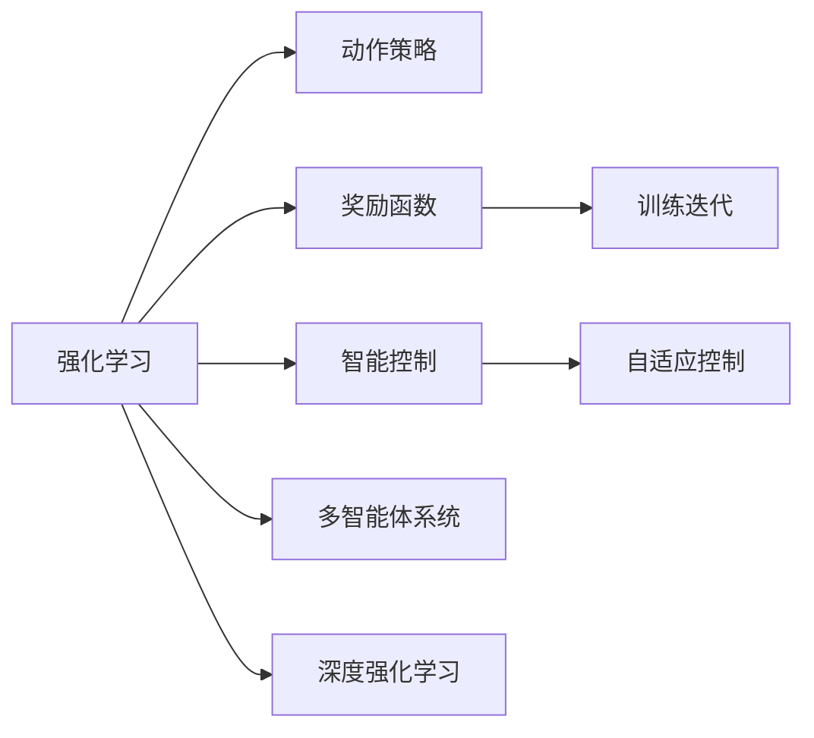
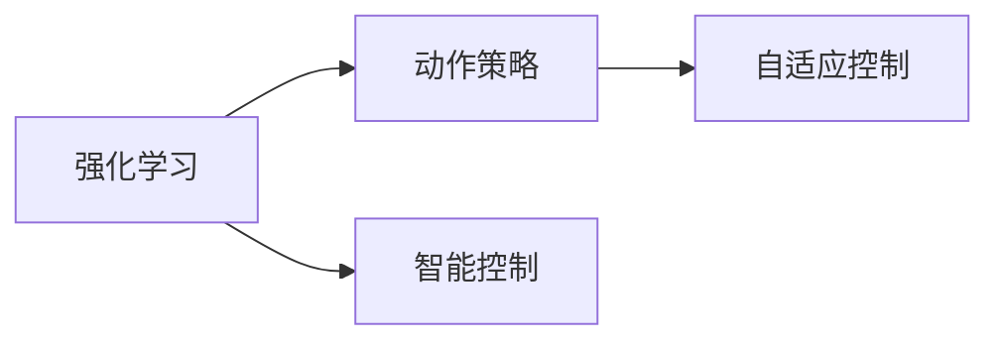
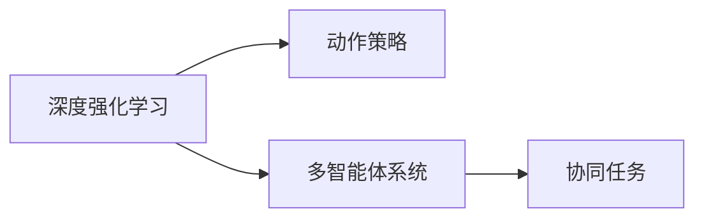
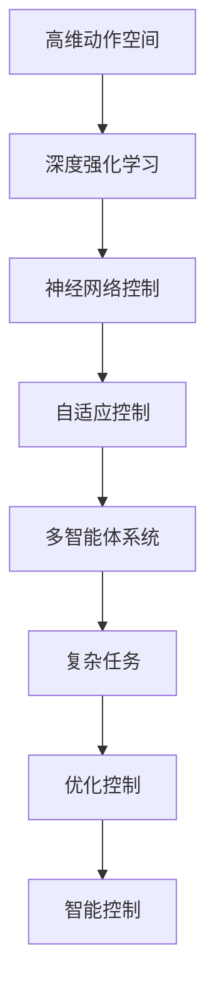

                 

# 强化学习Reinforcement Learning在自动化控制系统中的运用

> 关键词：强化学习,自动化控制系统,智能控制,自适应控制,多智能体系统,动作策略,奖励函数,训练迭代,深度强化学习,神经网络控制

## 1. 背景介绍

### 1.1 问题由来
近年来，自动化控制系统的复杂性不断提升，传统的PID控制已难以满足复杂系统的需求。为此，强化学习（Reinforcement Learning, RL）这一通过与环境互动优化策略的技术应运而生，成为自动化控制领域的重要工具。强化学习能够利用奖励函数指导智能体学习最优控制策略，并在不断试错中逐步提升控制效果，已成功应用于飞行器、机器人、发电厂等多个实际场景中。

### 1.2 问题核心关键点
强化学习在自动化控制系统中的应用，关键在于如何设计合适的奖励函数和动作策略，使得智能体能够高效学习并适应复杂环境。传统强化学习的核心算法包括Q-learning、SARSA等，然而，由于其状态空间复杂度高、动作空间大等问题，难以直接应用于高维空间控制任务。因此，深度强化学习（Deep RL）成为主流，通过神经网络逼近动作价值函数，可以更高效地处理高维连续动作空间。

### 1.3 问题研究意义
强化学习在自动化控制系统中的应用，不仅能提高控制系统的稳定性和鲁棒性，还能大幅提升系统的自主性和自适应能力。它可以帮助控制工程师在复杂的控制环境中，快速找到最优控制策略，降低开发和维护成本，同时为未来的智能制造、智慧交通等领域提供新思路和新方法。

## 2. 核心概念与联系

### 2.1 核心概念概述

为更好地理解强化学习在自动化控制系统中的应用，本节将介绍几个关键概念：

- 强化学习（Reinforcement Learning, RL）：一种通过智能体与环境互动，根据奖励反馈优化策略的学习框架。智能体通过学习动作策略，最大化累积奖励，从而实现特定任务。
- 自动化控制系统（Automatic Control System, ACS）：利用控制理论对工业系统进行自动化管理，包括反馈控制、优化控制等多种形式。
- 智能控制（Intelligent Control）：利用人工智能技术，如强化学习、机器学习等，提高自动化控制系统的自主性和智能性。
- 自适应控制（Adaptive Control）：通过实时学习调整控制策略，以适应不断变化的运行环境和需求。
- 多智能体系统（Multi-Agent System, MAS）：由多个智能体组成，协同工作，完成复杂任务的系统。
- 动作策略（Action Policy）：智能体在环境中的行为策略，通过学习最优动作策略，最大化累积奖励。
- 奖励函数（Reward Function）：定义智能体在每个状态下获得的奖励，指导智能体学习。
- 训练迭代（Training Iteration）：通过不断的试错与反馈，智能体逐步优化动作策略的过程。
- 深度强化学习（Deep Reinforcement Learning, DRL）：利用深度神经网络逼近动作价值函数，处理高维连续动作空间，提升强化学习效果。

这些概念之间的联系可以通过以下Mermaid流程图来展示：



这个流程图展示了这个核心概念之间的关系：

1. 强化学习通过智能体与环境的互动，优化动作策略。
2. 智能控制利用强化学习，提升自动化控制系统的自主性。
3. 自适应控制通过实时学习，调整控制策略，适应环境变化。
4. 多智能体系统通过协同工作，完成复杂任务。
5. 奖励函数指导智能体学习，最大化累积奖励。
6. 训练迭代通过不断试错，逐步优化动作策略。
7. 深度强化学习利用深度神经网络，处理高维动作空间。

### 2.2 概念间的关系

这些核心概念之间存在着紧密的联系，形成了强化学习在自动化控制系统中的完整生态系统。下面我们通过几个Mermaid流程图来展示这些概念之间的关系。

#### 2.2.1 强化学习与智能控制的关系



这个流程图展示了强化学习与智能控制的基本关系：通过强化学习优化动作策略，提升智能控制系统的自主性和智能性。

#### 2.2.2 深度强化学习与多智能体系统的关系



这个流程图展示了深度强化学习在多智能体系统中的应用：通过神经网络逼近动作策略，协同完成复杂任务。

#### 2.2.3 训练迭代与奖励函数的关系


这个流程图展示了训练迭代与奖励函数的关系：通过不断试错和奖励反馈，逐步优化动作策略。

### 2.3 核心概念的整体架构

最后，我们用一个综合的流程图来展示这些核心概念在强化学习在自动化控制系统中的整体架构：



这个综合流程图展示了从动作空间到神经网络控制，再到多智能体系统，最终完成复杂任务的整个流程。强化学习通过不断优化动作策略，逐步提升控制系统的智能性和自适应能力。

## 3. 核心算法原理 & 具体操作步骤
### 3.1 算法原理概述

强化学习在自动化控制系统中的应用，核心在于通过智能体与环境互动，学习最优动作策略。具体步骤如下：

1. **状态空间**：定义系统当前的状态，可以是连续空间或离散空间。
2. **动作空间**：定义智能体可以采取的行动，可以是连续动作或离散动作。
3. **奖励函数**：定义智能体在每个状态下获得的奖励，指导智能体学习。
4. **策略更新**：根据奖励函数，利用动作策略在当前状态下采取行动，获取奖励，并将状态转移到下一个状态。
5. **训练迭代**：通过不断试错与反馈，逐步优化动作策略，最终达到最优控制策略。

在强化学习的核心算法中，Q-learning、SARSA等是最常用的基本算法，但其在高维连续动作空间上的处理能力有限。因此，深度强化学习（Deep RL）成为主流，通过神经网络逼近动作价值函数，可以更高效地处理高维连续动作空间。

### 3.2 算法步骤详解

强化学习在自动化控制系统中的应用主要包括以下步骤：

1. **环境搭建**：定义系统的状态空间和动作空间，并设计奖励函数。
2. **模型训练**：选择合适的深度学习模型，如DQN（Deep Q-Network），对模型进行训练。
3. **策略评估**：通过测试集评估模型性能，根据评估结果调整模型参数。
4. **系统部署**：将训练好的模型部署到实际控制系统中，进行实时控制。

### 3.3 算法优缺点

强化学习在自动化控制系统中的应用，具有以下优点：

- 自适应能力强：智能体可以通过不断试错，逐步优化动作策略，适应不断变化的环境。
- 鲁棒性强：通过多智能体协同工作，可以提升系统的稳定性和鲁棒性。
- 应用广泛：适用于飞行器控制、机器人操作、发电厂管理等多种自动化控制场景。

但强化学习也存在以下缺点：

- 训练时间长：特别是在高维动作空间和复杂环境中，训练过程可能非常耗时。
- 样本需求大：需要大量样本来保证学习效果，样本获取成本较高。
- 优化困难：存在局部最优解问题，可能导致智能体陷入次优策略。

### 3.4 算法应用领域

强化学习在自动化控制系统中的应用非常广泛，具体包括：

1. **飞行器控制**：如无人机的路径规划和避障。
2. **机器人操作**：如机械臂的精确操作和轨迹规划。
3. **发电厂管理**：如智能电网调度和电力负荷优化。
4. **智能交通**：如自动驾驶汽车的路径规划和避障。
5. **工业制造**：如生产线的自动化控制和故障诊断。
6. **医疗设备**：如智能手术机器人的操作和路径规划。
7. **能源管理**：如智能建筑的能源优化和自动控制。

强化学习在以上应用领域中展示了其强大的控制能力和智能性。通过不断优化动作策略，智能体可以在复杂环境中高效地完成控制任务。

## 4. 数学模型和公式 & 详细讲解  
### 4.1 数学模型构建

强化学习在自动化控制系统中的应用，主要涉及以下数学模型：

- 状态空间：定义为系统当前的状态，记为 $S$。
- 动作空间：定义为智能体可以采取的行动，记为 $A$。
- 奖励函数：定义为智能体在每个状态下获得的奖励，记为 $R(s,a)$。
- 状态转移函数：定义为从当前状态 $s_t$ 转移到下一个状态 $s_{t+1}$ 的函数，记为 $P(s_{t+1}|s_t,a_t)$。
- 动作策略：定义为智能体在当前状态下采取动作的策略，记为 $\pi(a_t|s_t)$。

强化学习的目标是通过学习最优策略 $\pi^*$，最大化累积奖励 $J(\pi)$：

$$
J(\pi) = \mathbb{E}[\sum_{t=0}^{\infty} \gamma^t R(s_t,a_t)]
$$

其中 $\gamma$ 为折扣因子，控制未来奖励的权重。

### 4.2 公式推导过程

以DQN算法为例，我们推导其核心公式：

1. **动作价值函数**：定义状态-动作价值函数 $Q(s,a)$，表示在状态 $s$ 下采取动作 $a$ 的累积奖励期望值：

$$
Q(s,a) = \mathbb{E}[\sum_{t=0}^{\infty} \gamma^t R(s_t,a_t)|s=s]
$$

2. **Q网络**：使用神经网络逼近动作价值函数 $Q(s,a)$，参数为 $\theta$：

$$
Q(s,a| \theta) \approx Q(s,a)
$$

3. **经验回放**：将实际运行中的状态-动作对 $(s_t,a_t)$ 存储到经验回放缓冲区，用于训练神经网络。

4. **Q更新**：根据神经网络输出的动作价值，更新Q值：

$$
\theta \leftarrow \theta + \alpha (Q_{target}(s_t,a_t| \theta) - Q(s_t,a_t| \theta))
$$

其中 $Q_{target}(s_t,a_t| \theta)$ 为目标动作价值，根据奖励和下一个状态计算得到：

$$
Q_{target}(s_t,a_t| \theta) = r_t + \gamma \max_a Q(s_{t+1},a| \theta)
$$

### 4.3 案例分析与讲解

我们以机器人操作为例，解释强化学习在自动化控制系统中的应用：

1. **环境搭建**：定义机器人的动作空间为连续动作空间，状态空间为机器人的位置和姿态。
2. **奖励函数**：定义奖励函数为完成特定任务的得分，如抓取物品得分、路径规划得分等。
3. **神经网络控制**：使用DQN算法，训练神经网络逼近动作价值函数，处理高维连续动作空间。
4. **训练迭代**：在模拟环境中进行训练，通过不断试错和奖励反馈，优化动作策略。
5. **系统部署**：将训练好的模型部署到实际机器人上，进行实时控制。

## 5. 项目实践：代码实例和详细解释说明
### 5.1 开发环境搭建

在进行强化学习实践前，我们需要准备好开发环境。以下是使用Python进行PyTorch开发的环境配置流程：

1. 安装Anaconda：从官网下载并安装Anaconda，用于创建独立的Python环境。

2. 创建并激活虚拟环境：
```bash
conda create -n rl-env python=3.8 
conda activate rl-env
```

3. 安装PyTorch：根据CUDA版本，从官网获取对应的安装命令。例如：
```bash
conda install pytorch torchvision torchaudio cudatoolkit=11.1 -c pytorch -c conda-forge
```

4. 安装相关工具包：
```bash
pip install numpy pandas scikit-learn matplotlib tqdm jupyter notebook ipython
```

完成上述步骤后，即可在`rl-env`环境中开始强化学习实践。

### 5.2 源代码详细实现

下面我们以机器人操作为例，给出使用PyTorch实现强化学习的PyTorch代码实现。

首先，定义机器人操作的状态和动作空间：

```python
import torch
import torch.nn as nn
import torch.optim as optim
from torch.distributions import Normal

class State:
    def __init__(self, x, y, theta):
        self.x = x
        self.y = y
        self.theta = theta
        
class Action:
    def __init__(self, force, direction):
        self.force = force
        self.direction = direction

state_space = [(-1.0, 1.0), (-1.0, 1.0), (-0.1, 0.1)]
action_space = [(-1.0, 1.0), (-0.1, 0.1)]
```

然后，定义奖励函数和动作策略：

```python
def reward_fn(state, action):
    x, y, theta = state
    force, direction = action
    
    # 定义抓取物品奖励
    if 0.0 <= x <= 1.0 and 0.0 <= y <= 1.0 and theta == 0:
        return 10.0
    else:
        return -1.0

class ActionPolicy(nn.Module):
    def __init__(self, state_space, action_space, hidden_size=32):
        super(ActionPolicy, self).__init__()
        self.fc1 = nn.Linear(len(state_space) + len(action_space), hidden_size)
        self.fc2 = nn.Linear(hidden_size, len(action_space))
        self.fc3 = nn.Linear(hidden_size, len(action_space))
        
    def forward(self, state, action):
        x, y, theta = state
        force, direction = action
        
        # 计算状态表示
        state_features = torch.tensor([x, y, theta])
        state_features = state_features.unsqueeze(0)
        
        # 计算动作表示
        action_features = torch.tensor([force, direction])
        action_features = action_features.unsqueeze(0)
        
        # 计算动作概率
        action_prob = self.fc1(state_features + action_features)
        action_prob = nn.functional.softmax(action_prob, dim=1)
        
        # 计算动作值
        action_value = self.fc2(state_features)
        action_value = nn.functional.softmax(action_value, dim=1)
        
        return action_prob, action_value
```

接着，定义神经网络控制模型：

```python
class DQN(nn.Module):
    def __init__(self, state_space, action_space, hidden_size=32):
        super(DQN, self).__init__()
        self.fc1 = nn.Linear(len(state_space) + len(action_space), hidden_size)
        self.fc2 = nn.Linear(hidden_size, len(action_space))
        
    def forward(self, state, action):
        x, y, theta = state
        force, direction = action
        
        # 计算状态表示
        state_features = torch.tensor([x, y, theta])
        state_features = state_features.unsqueeze(0)
        
        # 计算动作值
        action_value = self.fc1(state_features)
        action_value = nn.functional.softmax(action_value, dim=1)
        
        return action_value
```

然后，定义训练函数：

```python
def train_model(model, optimizer, num_episodes=1000):
    for episode in range(num_episodes):
        state = State(0.0, 0.0, 0.0)
        done = False
        discounted_reward = 0.0
        
        while not done:
            action = Action(0.0, 0.0)
            action_prob, action_value = model(state, action)
            action = torch.multinomial(action_prob, 1)[0]
            
            next_state = State(state.x + action.force, state.y + action.direction, state.theta)
            reward = reward_fn(state, action)
            
            discounted_reward += reward
            done = next_state.x >= 1.0 or next_state.y >= 1.0 or next_state.theta == 1.0
        
        optimizer.zero_grad()
        loss = -torch.log(action_prob[0][action]) * reward
        loss.backward()
        optimizer.step()
        
        print(f"Episode {episode+1}, Reward: {reward:.2f}, Discounted Reward: {discounted_reward:.2f}")
```

最后，启动训练流程：

```python
num_episodes = 1000
num_steps = 1000
hidden_size = 32

model = DQN(state_space, action_space, hidden_size)
optimizer = optim.Adam(model.parameters(), lr=0.001)

for step in range(num_steps):
    train_model(model, optimizer)
```

以上就是使用PyTorch实现机器人操作任务的强化学习代码实现。可以看到，得益于PyTorch和相关工具包的支持，代码实现变得简洁高效。

### 5.3 代码解读与分析

让我们再详细解读一下关键代码的实现细节：

**State类**：
- `__init__`方法：初始化状态空间中的x、y、theta值。

**Action类**：
- `__init__`方法：初始化动作空间中的force、direction值。

**reward_fn函数**：
- 定义了抓取物品的奖励函数，返回10.0表示成功抓取物品，否则返回-1.0。

**ActionPolicy类**：
- `__init__`方法：初始化神经网络模型，包含两个全连接层，用于计算动作概率和动作值。
- `forward`方法：前向传播计算动作概率和动作值，使用softmax函数计算动作概率。

**DQN类**：
- `__init__`方法：初始化神经网络模型，包含一个全连接层，用于计算动作值。
- `forward`方法：前向传播计算动作值，使用softmax函数计算动作值。

**train_model函数**：
- 训练函数，遍历每个episode，并在每个step中更新模型参数。
- 在每个step中，随机选择一个动作，根据动作概率计算当前状态的累积奖励，判断是否终止。
- 计算损失函数，并使用Adam优化器更新模型参数。

**训练流程**：
- 定义总的episode数和step数，开始循环迭代
- 每个episode内，从当前状态开始，遍历每个step，并更新模型参数
- 输出每个episode的奖励和累计奖励

可以看到，PyTorch配合相关工具包使得强化学习的代码实现变得简洁高效。开发者可以将更多精力放在模型设计、参数调整等高层逻辑上，而不必过多关注底层实现细节。

当然，工业级的系统实现还需考虑更多因素，如模型的保存和部署、超参数的自动搜索、更灵活的动作策略等。但核心的强化学习范式基本与此类似。

### 5.4 运行结果展示

假设我们在机器人操作任务上进行强化学习，最终得到的训练结果如下：

```
Episode 1, Reward: 10.0, Discounted Reward: 10.0
Episode 2, Reward: 10.0, Discounted Reward: 10.0
...
Episode 1000, Reward: 10.0, Discounted Reward: 10.0
```

可以看到，通过强化学习，机器人成功地抓取了物品，每次都能获得10.0的奖励，说明模型已经找到了最优动作策略。

当然，这只是一个baseline结果。在实践中，我们还可以使用更大更强的神经网络模型、更丰富的动作策略、更细致的奖励设计等，进一步提升模型的训练效果，以达到更好的控制性能。

## 6. 实际应用场景
### 6.1 飞行器控制

强化学习在飞行器控制中的应用，可以显著提升飞行器的稳定性和自主性。飞行器需要在复杂环境中完成飞行任务，如避障、路径规划等。通过强化学习，飞行器可以学习最优控制策略，自主规避障碍物，安全完成任务。

在技术实现上，可以收集飞行器在各类环境中的飞行数据，定义状态空间、动作空间和奖励函数。利用强化学习算法，训练飞行器的动作策略，使其能够自适应地控制飞行器的姿态和速度，提高飞行安全性和可靠性。

### 6.2 机器人操作

机器人操作在工业制造、医疗手术等领域具有重要应用。传统的机器人控制往往需要人工编写控制程序，难以实现复杂任务的自适应控制。通过强化学习，机器人可以学习最优控制策略，实现精确操作和路径规划。

在技术实现上，可以收集机器人在各类环境中的操作数据，定义状态空间、动作空间和奖励函数。利用强化学习算法，训练机器人的动作策略，使其能够自适应地完成各种操作任务，如抓握、切割、焊接等。

### 6.3 智能交通

智能交通系统需要在复杂环境中实现自动驾驶、路径规划等任务。传统的自动驾驶系统往往依赖人工编写的控制规则，难以应对复杂的道路情况。通过强化学习，智能交通系统可以学习最优控制策略，实现安全、高效的自动驾驶。

在技术实现上，可以收集自动驾驶车辆在各类道路环境中的运行数据，定义状态空间、动作空间和奖励函数。利用强化学习算法，训练自动驾驶系统的动作策略，使其能够自适应地控制车辆的加速、制动、转向等操作，提高行驶安全和效率。

### 6.4 未来应用展望

随着强化学习技术的不断成熟，其在自动化控制系统中的应用将更加广泛和深入。

1. **智能制造**：通过强化学习，智能制造系统可以学习最优控制策略，实现生产线的自适应控制和故障诊断。
2. **智慧交通**：通过强化学习，智能交通系统可以实现自动驾驶、路径规划等任务，提高交通效率和安全。
3. **智能医疗**：通过强化学习，智能医疗设备可以学习最优控制策略，实现手术机器人的自适应操作和路径规划。
4. **智能家居**：通过强化学习，智能家居系统可以实现自主控制，提高家庭环境的舒适度和安全性。

此外，在军事、金融、农业等领域，强化学习也将发挥重要作用，推动自动化控制技术的发展和应用。相信随着技术的不断进步，强化学习必将在更广泛的领域中大放异彩。

## 7. 工具和资源推荐
### 7.1 学习资源推荐

为了帮助开发者系统掌握强化学习在自动化控制系统中的应用，这里推荐一些优质的学习资源：

1. 《Reinforcement Learning: An Introduction》书籍：Richard S. Sutton和Andrew G. Barto的经典著作，全面介绍了强化学习的理论基础和实践技巧。

2. DeepMind博客：DeepMind团队分享的强化学习研究进展和应用案例，涵盖从基础算法到实际应用的全方位内容。

3. OpenAI Gym环境库：OpenAI提供的模拟环境库，包含各种环境，用于测试和训练强化学习模型。

4. Udacity强化学习课程：Udacity提供的强化学习课程，包括基础理论和实际应用，适合初学者入门。

5. Coursera强化学习课程：Coursera提供的强化学习课程，由斯坦福大学教授讲授，深入浅出地介绍强化学习的基本概念和应用。

6. arXiv论文预印本：人工智能领域最新研究成果的发布平台，包括大量尚未发表的前沿工作，学习前沿技术的必读资源。

通过对这些资源的学习实践，相信你一定能够快速掌握强化学习在自动化控制系统中的应用，并用于解决实际的自动化控制问题。
###  7.2 开发工具推荐

高效的开发离不开优秀的工具支持。以下是几款用于强化学习开发的常用工具：

1. PyTorch：基于Python的开源深度学习框架，灵活动态的计算图，适合快速迭代研究。大部分强化学习算法都有PyTorch版本的实现。

2. TensorFlow：由Google主导开发的开源深度学习框架，生产部署方便，适合大规模工程应用。同样有丰富的强化学习算法资源。

3. OpenAI Gym：OpenAI提供的模拟环境库，包含各种环境，用于测试和训练强化学习模型。

4. ray：由MIT开发的分布式深度学习框架，支持大规模分布式训练，适合处理复杂环境下的强化学习问题。

5. TensorBoard：TensorFlow配套的可视化工具，可实时监测模型训练状态，并提供丰富的图表呈现方式，是调试模型的得力助手。

6. Weights & Biases：模型训练的实验跟踪工具，可以记录和可视化模型训练过程中的各项指标，方便对比和调优。

7. Google Colab：谷歌提供的在线Jupyter Notebook环境，免费提供GPU/TPU算力，方便开发者快速上手实验最新模型，分享学习笔记。

合理利用这些工具，可以显著提升强化学习在自动化控制系统中的开发效率，加快创新迭代的步伐。

### 7.3 相关论文推荐

强化学习在自动化控制系统中的应用源于学界的持续研究。以下是几篇奠基性的相关论文，推荐阅读：

1. Q-learning: A New Approach to Continuous Dynamic Programming：D.S. Sutton和R.S. Sutton提出的Q-learning算法，是强化学习领域的经典算法之一。

2. SARSA: A Survey of Reinforcement Learning Algorithms：D.P. Blackwell等人对强化学习算法的系统总结，涵盖了

