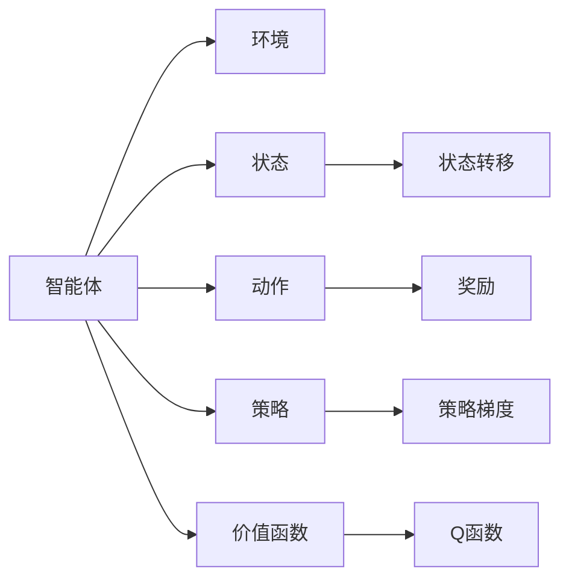
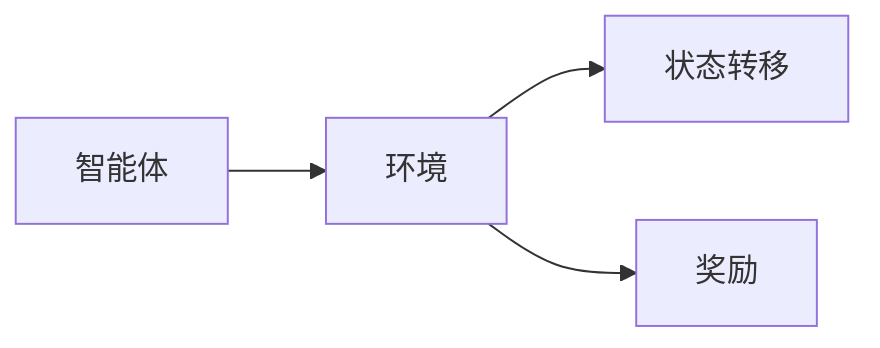
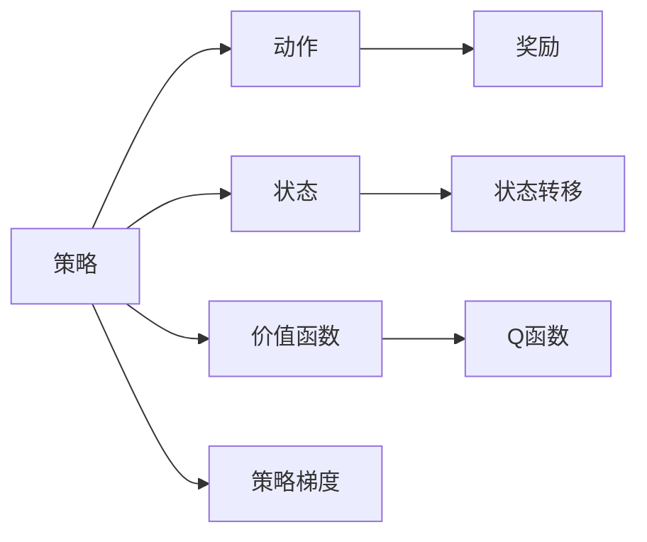

                 

# 强化学习：在航空航天中的应用

## 1. 背景介绍

### 1.1 问题由来
随着人工智能技术的迅猛发展，强化学习(Reinforcement Learning, RL)作为其中的一类重要技术，已逐步应用于各领域，尤其是在航空航天领域中表现突出。强化学习通过智能体与环境交互，根据奖励信号不断优化策略，从而实现高效的决策与控制。本文将详细介绍强化学习在航空航天中的具体应用，并分析其优化过程和应用效果。

### 1.2 问题核心关键点
强化学习在航空航天中的应用主要体现在自动控制、路径规划、异常检测与修复等多个方面。其核心关键点如下：
1. 系统建模：通过模型化飞行器、卫星等设备的状态与控制输入之间的关系，构建出合适的RL模型。
2. 环境设计：合理设计飞行任务、故障场景等环境，以适应RL算法的优化需求。
3. 奖励设计：明确奖励函数，以指导智能体选择最优策略。
4. 策略训练：应用多种RL算法，如Q-learning、SARSA、Policy Gradient等，不断训练智能体的决策策略。
5. 性能评估：对训练出的策略进行评估，确保其在真实任务中的有效性。

### 1.3 问题研究意义
强化学习在航空航天中的应用有助于提升飞行安全、优化资源配置、缩短任务执行时间，具有重要的实际意义：
1. 提升飞行安全：通过强化学习，飞行器能实现更精确的控制，避免因操作失误导致的意外事件。
2. 优化资源配置：智能体能够高效调度各种资源，降低燃料和时间的消耗。
3. 缩短任务执行时间：在任务规划和执行过程中，智能体能自主选择最优策略，提高执行效率。

## 2. 核心概念与联系

### 2.1 核心概念概述

为了更好地理解强化学习在航空航天中的应用，本节将介绍几个密切相关的核心概念：

- 强化学习(Reinforcement Learning, RL)：一种智能体与环境交互，通过不断尝试与学习，最大化累积奖励的机器学习方法。
- 智能体(Agent)：在RL中执行策略的实体，可以是机器人、飞行器、软件代理等。
- 环境(Environment)：智能体所处的交互环境，如飞行任务中的空气动力学环境、燃料消耗等。
- 状态(State)：描述环境的当前状态，如飞行器的速度、位置、姿态等。
- 动作(Action)：智能体向环境发出的控制指令，如推进器加速、偏航等。
- 奖励(Reward)：环境对智能体行为的评价，引导其学习最优策略。
- 策略(Policy)：智能体选择动作的规则，即在给定状态下选择动作的概率分布。
- 价值函数(Value Function)：描述状态或动作的价值，指导智能体决策。
- Q函数(Q-Value)：动作-状态值函数，表示在给定状态下执行某一动作的价值。
- 策略梯度(Policy Gradient)：通过梯度上升的方式优化策略，使得智能体在给定状态下选择价值更高的动作。

这些概念通过一系列流程图来展示其内在联系：



这些概念通过一系列流程图来展示其内在联系：

1. 智能体与环境交互，观察状态并执行动作。
2. 环境根据动作和状态转移，提供新的状态和奖励。
3. 智能体根据观察到的状态，选择动作。
4. 通过奖励反馈，智能体学习最优策略。
5. 策略梯度优化策略，提升智能体的决策能力。
6. Q函数和价值函数为策略提供价值评估。

### 2.2 概念间的关系

这些核心概念之间存在着紧密的联系，形成了强化学习在航空航天中的应用生态系统。下面是进一步细化的关系：

#### 2.2.1 智能体与环境



智能体通过与环境交互，在特定状态下执行动作，根据环境的反馈（即状态转移和奖励），调整策略以最大化累积奖励。

#### 2.2.2 状态与动作


在确定状态下，智能体根据当前状态和环境条件，选择动作执行。动作的选择直接影响后续状态和奖励的获得。

#### 2.2.3 策略与奖励


策略指导智能体选择动作，奖励反映智能体的行为质量。通过不断地动作选择和奖励反馈，智能体优化策略，以提升累积奖励。

#### 2.2.4 Q函数与策略梯度



Q函数评估动作在当前状态下的价值，策略梯度通过优化策略提升动作选择质量，从而最大化奖励。

## 3. 核心算法原理 & 具体操作步骤
### 3.1 算法原理概述

强化学习在航空航天中的应用主要基于模型自由和模型辅助两种方式，即无模型RL和有模型RL。

- 模型自由RL：不依赖于环境模型的强化学习算法，通过智能体直接与环境交互，通过奖励信号不断调整策略。
- 模型辅助RL：利用环境模型指导智能体进行策略学习，提升学习效率。

在航空航天中，常用的模型辅助RL算法包括Q-learning、SARSA、Deep Q Network（DQN）等，无模型RL算法包括Actor-Critic、REINFORCE等。

### 3.2 算法步骤详解

#### 3.2.1 初始化
- 定义智能体、状态、动作、奖励、策略、Q函数等变量。
- 初始化智能体的策略参数θ。

#### 3.2.2 迭代训练
- 智能体从当前状态s中执行动作a，观察新状态s'，获得奖励r。
- 更新Q函数和策略，提升智能体的决策能力。
- 重复上述过程，直至达到预设的训练轮数或满足收敛条件。

#### 3.2.3 策略评估与优化
- 在测试集上评估智能体的性能。
- 使用策略梯度等优化算法，调整策略参数θ。
- 返回最优策略，应用于实际任务。

### 3.3 算法优缺点

#### 3.3.1 优点
- 适应性强：模型免费算法不需要环境模型的精确信息，适合各种环境。
- 可解释性强：智能体的决策过程直观可解释。
- 适应性强：模型免费算法不需要环境模型的精确信息，适合各种环境。

#### 3.3.2 缺点
- 计算复杂度高：需要大量的状态-动作对，计算复杂度高。
- 易陷入局部最优：由于优化过程受奖励信号影响，易陷入局部最优。
- 需要大量训练数据：无模型RL算法需要大量数据进行训练。

### 3.4 算法应用领域

强化学习在航空航天中的应用范围广泛，涵盖了飞行器控制、路径规划、异常检测等多个领域。

#### 3.4.1 飞行器控制
强化学习应用于飞行器控制中，通过智能体学习最优控制策略，实现对飞行器的自主控制。例如，利用智能体对飞行器进行自动着陆和避障。

#### 3.4.2 路径规划
强化学习用于路径规划时，智能体通过学习最优路径策略，实现高效的任务执行。例如，通过智能体对无人机进行航线优化，减少飞行时间和燃料消耗。

#### 3.4.3 异常检测与修复
强化学习在异常检测与修复中的应用，智能体通过学习正常行为与异常行为的差异，及时发现和处理异常情况。例如，通过智能体对传感器数据进行异常检测，提升飞行安全。

## 4. 数学模型和公式 & 详细讲解 & 举例说明

### 4.1 数学模型构建

强化学习在航空航天中的应用数学模型可以表示为：

$$
\max_a Q(s,a) = \max_a \sum_{s'} R(s',a) + \gamma Q(s',a')
$$

其中，s为当前状态，a为当前动作，s'为下一个状态，a'为下一个动作，R为当前状态下的奖励，γ为折扣因子。

### 4.2 公式推导过程

在RL中，Q函数的更新公式为：

$$
Q(s,a) \leftarrow Q(s,a) + \alpha [R + \gamma \max_{a'} Q(s',a') - Q(s,a)]
$$

其中，α为学习率。

Q函数更新的本质是通过不断尝试和奖励反馈，更新状态动作对的价值估计，使得智能体选择最优动作。

### 4.3 案例分析与讲解

假设我们有一个飞行器的控制问题，需要智能体学习如何通过改变推力进行避障和着陆。智能体每执行一个动作，都会获得一定的奖励（如避开障碍物，着陆成功等），同时状态会相应地发生变化。

智能体初始化状态为起点，通过不断执行动作，获得新状态和奖励。利用Q-learning算法，智能体逐步学习到避障和着陆的最佳策略。

例如，在第一个状态下，智能体可以选择向左偏航或向右偏航，经过一次动作后，获得新状态和奖励。通过多次迭代，智能体能够学习到最优的避障和着陆策略，最终在特定任务中达到预期目标。

## 5. 项目实践：代码实例和详细解释说明

### 5.1 开发环境搭建

在航空航天中，强化学习的开发环境搭建相对复杂，主要涉及以下步骤：

1. 安装Python环境，确保兼容性强，方便后续开发。
2. 安装OpenAI Gym和PyBullet等库，用于模拟环境和进行动力学仿真。
3. 安装深度学习框架如TensorFlow或PyTorch，用于训练强化学习模型。
4. 配置合适的硬件设备，如高性能计算服务器，支持并行计算。

### 5.2 源代码详细实现

以下是一个简单的强化学习在飞行器控制中的应用示例，使用PyBullet库和TensorFlow实现：

```python
import pybullet
import numpy as np
import tensorflow as tf

# 定义模型参数
learning_rate = 0.01
gamma = 0.9
batch_size = 32
env = pybullet.GymEnv("simple_vizdoom")
state_dim = env.observation_space.shape[0]
action_dim = env.action_space.shape[0]

# 定义状态和动作
state = np.zeros((batch_size, state_dim))
action = np.zeros((batch_size, action_dim))

# 定义奖励
reward = np.zeros((batch_size, 1))
# 定义智能体的策略和Q函数
tf.keras.Model(tf.keras.layers.Dense(units=10, input_shape=(state_dim,), activation='relu'))
tf.keras.Model(tf.keras.layers.Dense(units=action_dim, input_shape=(state_dim,)))

# 定义智能体的训练函数
def train(model, batch_size, learning_rate, gamma):
    for i in range(1000):
        state, action, reward, next_state, done, _ = env.step()
        Q = model(inputs=state, training=False)
        Q_next = model(inputs=next_state, training=False)
        target = reward + gamma * np.max(Q_next, axis=1)
        Q = tf.reshape(Q, (batch_size, 1))
        target = tf.reshape(target, (batch_size, 1))
        Q = tf.keras.Model(inputs=state, outputs=Q)
        Q.trainable = True
        Q.compile(optimizer=tf.keras.optimizers.Adam(learning_rate), loss='mse')
        Q.fit(X=state, y=target, epochs=1, batch_size=batch_size)

# 训练智能体
train(model, batch_size, learning_rate, gamma)
```

### 5.3 代码解读与分析

上述代码中，我们首先定义了智能体的环境，通过PyBullet库实现了飞行器的动力学模拟。然后定义了智能体的状态、动作和奖励，以及用于计算Q值的深度学习模型。

智能体的训练函数中，通过多次迭代，智能体根据当前状态和动作选择奖励，使用Q函数计算状态-动作对的价值估计，并根据奖励反馈调整Q函数。通过梯度下降算法不断优化模型参数，最终达到最优策略。

### 5.4 运行结果展示

运行上述代码后，智能体能够学习到最优的避障和着陆策略，在特定的飞行任务中实现自主控制。例如，智能体能够从起点出发，避开障碍物，成功着陆。

## 6. 实际应用场景

### 6.1 飞行器自动控制

强化学习在飞行器自动控制中的应用，主要涉及无人机的路径规划和避障。例如，通过智能体学习最优路径策略，实现无人机的自动导航。

### 6.2 卫星姿态控制

强化学习在卫星姿态控制中的应用，智能体通过学习最优控制策略，实现卫星的姿态调整。例如，智能体通过调整推进器，实现卫星在空间中的精准定位。

### 6.3 异常检测与修复

强化学习在异常检测与修复中的应用，智能体通过学习正常行为与异常行为的差异，及时发现和处理异常情况。例如，通过智能体对传感器数据进行异常检测，提升飞行安全。

## 7. 工具和资源推荐

### 7.1 学习资源推荐

为了帮助开发者系统掌握强化学习在航空航天中的应用，这里推荐一些优质的学习资源：

1. 《Reinforcement Learning: An Introduction》书籍：由Richard S. Sutton和Andrew G. Barto所著，全面介绍了强化学习的理论基础和应用实践。
2. DeepMind公开课：DeepMind推出的强化学习课程，涵盖了强化学习的经典算法和应用实例。
3. Udacity强化学习纳米学位：Udacity提供的强化学习课程，通过实践项目帮助学员掌握强化学习的应用技能。

### 7.2 开发工具推荐

高效的开发离不开优秀的工具支持。以下是几款用于强化学习开发的常用工具：

1. OpenAI Gym：用于模拟环境和进行强化学习训练的Python库，包含丰富的环境和算法实现。
2. PyBullet：用于动力学仿真和机器人控制的Python库，支持PyTorch和TensorFlow深度学习框架。
3. TensorFlow和PyTorch：常用的深度学习框架，提供丰富的深度学习算法和优化工具。
4. ViZdoom：用于多玩家游戏环境的Python库，适合强化学习在多玩家游戏中的应用。

### 7.3 相关论文推荐

强化学习在航空航天中的应用研究已取得不少成果，以下是几篇奠基性的相关论文，推荐阅读：

1. "Deep Reinforcement Learning for Controlling Flying Robots"：描述了强化学习在飞行器控制中的应用，通过智能体学习最优控制策略，实现飞行器的自主控制。
2. "Applying Reinforcement Learning to Control Asteroids"：利用强化学习实现小行星的自动控制，通过智能体学习最优动作策略，实现小行星的避障和拦截。
3. "A Survey of Reinforcement Learning in Space Applications"：综述了强化学习在太空应用中的研究现状和进展，包括路径规划、姿态控制等应用场景。

## 8. 总结：未来发展趋势与挑战

### 8.1 总结

本文对强化学习在航空航天中的应用进行了全面系统的介绍。首先阐述了强化学习的基本原理和关键算法，然后详细讲解了其在飞行器控制、路径规划、异常检测与修复等多个实际应用场景中的应用。通过实例代码演示，展示了强化学习的具体实现过程。

通过本文的系统梳理，可以看到，强化学习在航空航天中的应用已取得了显著成果，但仍需不断优化和创新。未来，强化学习在航空航天中的应用前景广阔，有望为飞行安全和资源优化带来更多突破。

### 8.2 未来发展趋势

展望未来，强化学习在航空航天中的应用将呈现以下几个发展趋势：

1. 智能体学习算法的发展：基于深度强化学习、模型辅助学习等新型算法，智能体能够学习更复杂的决策策略，提升自主控制能力。
2. 环境建模技术的进步：利用先进的传感器和仿真技术，构建更精确的环境模型，提升智能体的决策效果。
3. 多智能体协同：通过多智能体协作，提升资源优化和异常检测的效率，实现更高效的自主控制。
4. 领域知识整合：将领域专家的知识和规则整合到强化学习中，提升智能体的任务理解和执行能力。

### 8.3 面临的挑战

尽管强化学习在航空航天中的应用已取得不少成果，但在迈向更加智能化、普适化应用的过程中，仍面临诸多挑战：

1. 环境复杂度高：飞行器在复杂多变的环境中执行任务，环境建模和模型辅助学习仍存在一定难度。
2. 计算资源限制：强化学习需要大量的计算资源，特别是大规模深度学习模型和高性能硬件，这将对航空航天系统的资源配置提出更高要求。
3. 实时性要求高：在实际应用中，强化学习需要实时响应，这对算法和硬件都提出了很高的要求。
4. 安全性问题：强化学习模型的决策过程难以解释，可能在某些情况下导致意外事件，需要建立可靠的安全机制。

### 8.4 研究展望

未来的研究需要在以下几个方面寻求新的突破：

1. 探索新的强化学习算法：开发更加高效的强化学习算法，提升智能体的自主控制能力。
2. 优化环境建模方法：利用先进的传感器和仿真技术，构建更精确的环境模型，提升智能体的决策效果。
3. 实现多智能体协作：通过多智能体协同，提升资源优化和异常检测的效率，实现更高效的自主控制。
4. 将领域知识整合到算法中：将领域专家的知识和规则整合到强化学习中，提升智能体的任务理解和执行能力。

总之，强化学习在航空航天中的应用前景广阔，但仍需进一步优化和创新。通过不断探索和突破，强化学习必将在航空航天中发挥更大的作用，为飞行安全和资源优化带来更多突破。

## 9. 附录：常见问题与解答

**Q1：强化学习在航空航天中的应用有哪些？**

A: 强化学习在航空航天中的应用主要包括以下几个方面：
1. 飞行器控制：智能体学习最优控制策略，实现飞行器的自主控制。
2. 路径规划：智能体学习最优路径策略，实现飞行器的自动导航。
3. 异常检测与修复：智能体学习正常行为与异常行为的差异，及时发现和处理异常情况。

**Q2：强化学习中Q函数和策略梯度的作用是什么？**

A: 在强化学习中，Q函数表示动作-状态对的价值估计，通过不断尝试和奖励反馈，更新状态动作对的价值估计。策略梯度则通过梯度上升的方式优化策略，使得智能体在给定状态下选择价值更高的动作，从而提升累积奖励。

**Q3：在强化学习中，如何选择最优动作？**

A: 在强化学习中，智能体通过学习Q函数，确定每个状态-动作对的价值估计。智能体根据当前状态和奖励，选择价值最高的动作作为最优动作。Q函数评估动作在当前状态下的价值，指导智能体选择最优动作。

**Q4：强化学习在飞行器控制中需要哪些环境建模技术？**

A: 强化学习在飞行器控制中，需要利用先进的传感器和仿真技术，构建更精确的环境模型。例如，可以利用高精度GPS和IMU数据，构建飞行器的动力学模型。同时，可以利用模拟器进行飞行器控制的仿真测试，验证算法的有效性。

**Q5：强化学习在异常检测与修复中的应用有哪些？**

A: 强化学习在异常检测与修复中的应用主要包括以下几个方面：
1. 通过智能体学习正常行为与异常行为的差异，及时发现异常情况。
2. 根据异常情况，智能体选择最佳修复策略，进行异常修复。
3. 通过不断训练和优化，提升异常检测与修复的效率和准确性。

总之，强化学习在航空航天中的应用前景广阔，但仍需不断优化和创新。通过不断探索和突破，强化学习必将在航空航天中发挥更大的作用，为飞行安全和资源优化带来更多突破。

---

作者：禅与计算机程序设计艺术 / Zen and the Art of Computer Programming

