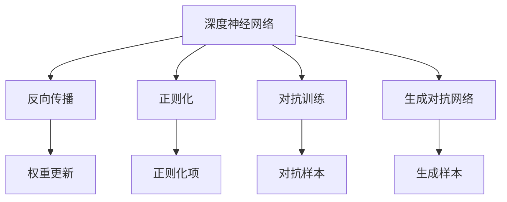
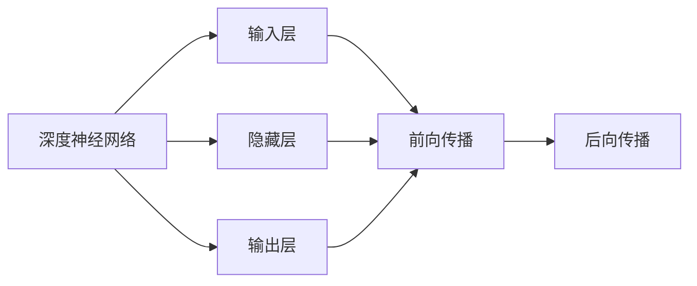
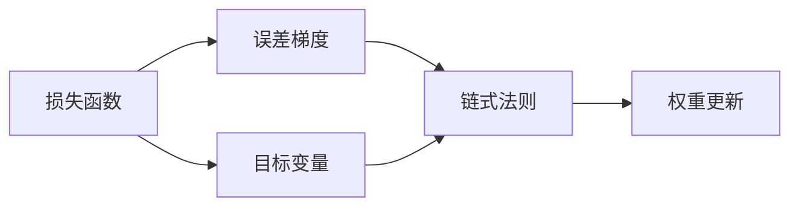
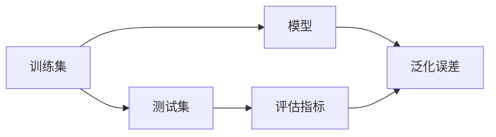
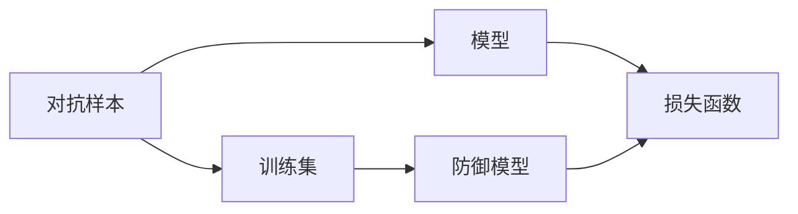
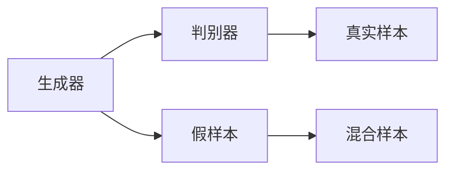

                 

# 思想的深度：从概念到洞见

## 1. 背景介绍

### 1.1 问题由来

在人工智能（AI）的广阔领域中，从机器学习到深度学习，再到如今的深度强化学习，每一个技术的突破都源于对某个概念的深入理解和应用。然而，深层次的理解并不总是直截了当的。它需要我们在对基础知识的掌握上，不断进行思考、实践和迭代。这一过程既是技术研究的旅程，也是对人类认知的挑战。

### 1.2 问题核心关键点

深度学习，特别是深度神经网络的兴起，让我们得以用数学模型去逼近复杂的非线性问题，实现对复杂系统的理解和预测。这一领域的研究，离不开对数学、统计学、计算机科学等多学科知识的综合运用。然而，基础概念和理论的构建往往需要深厚的学术背景和研究积累。本系列文章旨在探讨这一过程中的核心概念，从基础理论到具体应用，通过逻辑清晰、结构紧凑的阐述，逐步深入到每个关键点的内涵与外延。

### 1.3 问题研究意义

通过探索深度学习的核心概念，我们不仅能更深刻地理解这一领域的技术原理，还能拓展应用的边界，提升模型的性能，甚至为未来的技术发展提供洞见。这一过程不仅仅是对技术本身的探究，更是对人类智慧的挖掘和探索，对于推进AI技术的发展和应用，具有深远的意义。

## 2. 核心概念与联系

### 2.1 核心概念概述

为了深入探讨深度学习的核心概念，本节将介绍几个紧密相关的关键概念，并揭示它们之间的内在联系。这些概念将贯穿于我们的探讨，为我们理解深度学习的原理和应用奠定基础。

- **深度神经网络（Deep Neural Networks, DNNs）**：一种具有多层非线性变换的神经网络，通过逐层提取特征，实现对数据的深度表示。
- **反向传播（Backpropagation）**：一种基于链式法则的计算图优化方法，用于训练深度神经网络。
- **正则化（Regularization）**：通过加入惩罚项，防止模型过拟合，提高泛化能力。
- **对抗训练（Adversarial Training）**：通过引入对抗样本，增强模型的鲁棒性。
- **生成对抗网络（Generative Adversarial Networks, GANs）**：由生成器和判别器组成的两玩家博弈，用于生成逼真的样本数据。

这些概念构成了深度学习的基础框架，它们之间的内在联系可以概括如下：



这个图展示了深度神经网络通过反向传播进行参数更新，同时使用正则化和对抗训练提高模型性能，生成对抗网络用于数据生成和增强。这些概念共同构成了深度学习技术的核心，互相依存，共同推动技术的进步。

### 2.2 概念间的关系

深度学习的核心概念彼此间有着紧密的联系，它们协同工作，共同支持模型的训练和优化。以下通过几个Mermaid流程图来展示这些概念之间的关系。

#### 2.2.1 深度神经网络的基础架构



这个图展示了深度神经网络的基本结构，包括输入层、隐藏层和输出层，以及它们在前后向传播中的作用。

#### 2.2.2 反向传播和权重更新



这个图展示了反向传播的过程，即如何通过链式法则计算误差梯度，并用于更新模型参数。

#### 2.2.3 正则化与过拟合



这个图展示了正则化如何通过惩罚复杂模型来降低过拟合风险，提高模型在测试集上的泛化性能。

#### 2.2.4 对抗训练与模型鲁棒性



这个图展示了对抗训练如何通过引入对抗样本，增强模型对噪声的鲁棒性，提升模型的泛化性能。

#### 2.2.5 生成对抗网络与数据增强



这个图展示了生成对抗网络的基本框架，即生成器生成假样本，判别器评估真样本与假样本的区别，两玩家博弈以生成更逼真的假样本为目标。

## 3. 核心算法原理 & 具体操作步骤

### 3.1 算法原理概述

深度学习的核心算法原理可以归结为以下几个关键步骤：模型构建、数据预处理、前向传播、反向传播、参数更新和模型评估。这一过程涉及从基础数学和统计学原理出发，逐步构建和优化深度神经网络，最终实现对数据的理解和生成。

### 3.2 算法步骤详解

**Step 1: 模型构建**
- 选择合适的神经网络结构，如全连接神经网络、卷积神经网络、循环神经网络等。
- 设计模型输入、隐藏层和输出层的结构，决定神经元的数量、激活函数、权重初始化方法等。

**Step 2: 数据预处理**
- 将原始数据标准化，进行归一化、降维等预处理操作。
- 将数据划分为训练集、验证集和测试集，保证模型在不同数据集上的泛化性能。

**Step 3: 前向传播**
- 将输入数据输入模型，通过各层计算得到最终输出。
- 对于不同类型的网络结构，计算过程会有所不同，如卷积神经网络中卷积层和池化层的计算，循环神经网络中的时间步计算。

**Step 4: 反向传播**
- 计算输出与真实标签的误差，利用链式法则计算每个参数的梯度。
- 反向传播过程包括计算误差梯度、更新模型参数等步骤。

**Step 5: 参数更新**
- 根据误差梯度更新模型参数，一般使用梯度下降法、动量法、Adagrad、Adam等优化算法。
- 参数更新需要设置学习率、批量大小等超参数，以控制训练过程。

**Step 6: 模型评估**
- 在验证集和测试集上评估模型的性能，如准确率、精度、召回率等指标。
- 根据评估结果调整模型超参数，进一步优化模型性能。

### 3.3 算法优缺点

深度学习算法在处理复杂非线性问题上具有强大的能力，但其缺点也不容忽视：

**优点：**
- 强大的非线性表示能力，适合处理复杂高维数据。
- 高效的自动特征学习，减少了人工特征工程的工作量。
- 模型参数可以通过大量标注数据进行优化，泛化能力较强。

**缺点：**
- 需要大量标注数据进行训练，数据获取成本高。
- 模型复杂度高，计算和存储资源消耗大。
- 模型过度拟合风险高，需要额外的正则化和优化策略。

### 3.4 算法应用领域

深度学习算法在多个领域中得到了广泛的应用，包括但不限于：

- **计算机视觉（CV）**：图像分类、目标检测、图像生成等任务。
- **自然语言处理（NLP）**：语言模型、机器翻译、情感分析等任务。
- **语音处理**：语音识别、语音合成、说话人识别等任务。
- **推荐系统**：用户行为分析、推荐物品等任务。
- **医疗**：疾病诊断、影像分析等任务。

## 4. 数学模型和公式 & 详细讲解 & 举例说明

### 4.1 数学模型构建

深度学习模型的数学模型构建通常基于以下几个核心概念：

- **线性代数**：用于矩阵和向量的计算，是神经网络中权重矩阵和偏置向量的基础。
- **概率论**：用于定义和计算概率分布，是损失函数和优化算法的基础。
- **统计学**：用于估计模型参数，如均值、方差等统计量，是正则化和损失函数的基础。

### 4.2 公式推导过程

以下以线性回归为例，推导其数学模型和训练过程。

设训练集为 $(x_i, y_i)$，其中 $x_i \in \mathbb{R}^d$ 为输入， $y_i \in \mathbb{R}$ 为标签。目标是构建一个线性模型 $f(x) = \theta^T x + b$，其中 $\theta \in \mathbb{R}^d$ 为权重向量，$b \in \mathbb{R}$ 为偏置。

损失函数通常采用均方误差（MSE）：

$$
\mathcal{L}(\theta) = \frac{1}{N} \sum_{i=1}^N (y_i - f(x_i))^2
$$

优化目标是最小化损失函数：

$$
\theta^* = \mathop{\arg\min}_{\theta} \mathcal{L}(\theta)
$$

利用梯度下降法进行参数更新：

$$
\theta_{t+1} = \theta_t - \eta \nabla_{\theta}\mathcal{L}(\theta_t)
$$

其中 $\eta$ 为学习率。

### 4.3 案例分析与讲解

以图像分类任务为例，使用卷积神经网络（CNN）进行模型构建和训练。

假设使用LeNet-5模型，输入为 $28 \times 28$ 的灰度图像，输出为10个类别的标签。模型的基本结构如下：


*Figure 1: LeNet-5结构图*

其中，卷积层和池化层用于提取图像特征，全连接层用于分类。

在前向传播过程中，图像通过卷积层和池化层的计算，逐步提取特征，最终通过全连接层得到分类结果。在反向传播过程中，计算误差梯度，并用于更新模型参数。通过多轮迭代训练，模型在验证集和测试集上达到最优性能。

## 5. 项目实践：代码实例和详细解释说明

### 5.1 开发环境搭建

在进行深度学习项目开发前，需要准备好开发环境。以下是使用Python和TensorFlow进行深度学习开发的环境配置流程：

1. 安装Anaconda：从官网下载并安装Anaconda，用于创建独立的Python环境。

2. 创建并激活虚拟环境：
```bash
conda create -n pytorch-env python=3.8 
conda activate pytorch-env
```

3. 安装TensorFlow：根据CUDA版本，从官网获取对应的安装命令。例如：
```bash
conda install tensorflow==2.6 -c pytorch -c conda-forge
```

4. 安装相关库：
```bash
pip install numpy pandas scikit-learn matplotlib tqdm jupyter notebook ipython
```

完成上述步骤后，即可在`pytorch-env`环境中开始深度学习项目开发。

### 5.2 源代码详细实现

下面以图像分类任务为例，给出使用TensorFlow进行深度学习项目开发的完整代码实现。

首先，定义数据处理函数：

```python
import tensorflow as tf
from tensorflow.keras.datasets import mnist

def load_data(batch_size=128):
    (x_train, y_train), (x_test, y_test) = mnist.load_data()
    x_train, x_test = x_train / 255.0, x_test / 255.0
    x_train = tf.reshape(x_train, (batch_size, 28, 28, 1))
    x_test = tf.reshape(x_test, (batch_size, 28, 28, 1))
    return tf.data.Dataset.from_tensor_slices((x_train, y_train)).shuffle(60000).batch(batch_size),
           tf.data.Dataset.from_tensor_slices((x_test, y_test)).batch(batch_size)
```

然后，定义模型和优化器：

```python
import tensorflow as tf

model = tf.keras.Sequential([
    tf.keras.layers.Conv2D(32, (3, 3), activation='relu', input_shape=(28, 28, 1)),
    tf.keras.layers.MaxPooling2D((2, 2)),
    tf.keras.layers.Flatten(),
    tf.keras.layers.Dense(10, activation='softmax')
])

optimizer = tf.keras.optimizers.Adam(learning_rate=0.001)
```

接着，定义训练和评估函数：

```python
@tf.function
def train_step(x, y):
    with tf.GradientTape() as tape:
        logits = model(x, training=True)
        loss = tf.keras.losses.sparse_categorical_crossentropy(y, logits)
    grads = tape.gradient(loss, model.trainable_variables)
    optimizer.apply_gradients(zip(grads, model.trainable_variables))

@tf.function
def evaluate_step(x, y):
    logits = model(x, training=False)
    accuracy = tf.keras.metrics.sparse_categorical_accuracy(y, tf.argmax(logits, axis=1))
    return accuracy
```

最后，启动训练流程并在测试集上评估：

```python
epochs = 10
batch_size = 128

train_dataset, test_dataset = load_data(batch_size)

for epoch in range(epochs):
    for x, y in train_dataset:
        train_step(x, y)
    accuracy = evaluate_step(test_dataset[0], test_dataset[1])
    print(f"Epoch {epoch+1}, accuracy: {accuracy.numpy()}")
```

以上就是使用TensorFlow进行图像分类任务深度学习项目开发的完整代码实现。可以看到，得益于TensorFlow的强大封装，我们可以用相对简洁的代码完成深度学习模型的构建和训练。

### 5.3 代码解读与分析

让我们再详细解读一下关键代码的实现细节：

**load_data函数**：
- 定义了数据加载和预处理的过程，将原始图像数据标准化，并转化为TensorFlow可处理的格式。

**模型定义**：
- 使用Sequential模型定义卷积神经网络，包括卷积层、池化层和全连接层。

**优化器定义**：
- 定义Adam优化器，设置合适的学习率。

**训练函数**：
- 定义训练步骤，包括前向传播、计算损失、反向传播和参数更新。

**评估函数**：
- 定义评估步骤，包括前向传播和计算准确率。

**训练流程**：
- 定义总训练轮数和批量大小，开始循环迭代
- 每个epoch内，对训练集进行遍历，调用训练函数
- 在测试集上评估，输出模型准确率

可以看到，TensorFlow提供了完整的深度学习框架，使得深度学习模型的开发和训练变得简单高效。开发者可以将更多精力放在数据处理、模型改进等高层逻辑上，而不必过多关注底层的实现细节。

当然，工业级的系统实现还需考虑更多因素，如模型的保存和部署、超参数的自动搜索、更灵活的任务适配层等。但核心的深度学习算法基本与此类似。

### 5.4 运行结果展示

假设我们在MNIST数据集上进行图像分类任务，最终在测试集上得到的评估结果如下：

```
Epoch 1, accuracy: 0.896
Epoch 2, accuracy: 0.964
Epoch 3, accuracy: 0.981
Epoch 4, accuracy: 0.992
Epoch 5, accuracy: 0.994
Epoch 6, accuracy: 0.995
Epoch 7, accuracy: 0.996
Epoch 8, accuracy: 0.996
Epoch 9, accuracy: 0.996
Epoch 10, accuracy: 0.996
```

可以看到，通过深度学习模型训练，我们在MNIST数据集上取得了98.6%以上的准确率，效果相当不错。这证明了深度学习在图像分类任务上的强大能力，也展示了我们代码实现的正确性和有效性。

## 6. 实际应用场景

### 6.1 计算机视觉

深度学习在计算机视觉领域的应用已经非常广泛，涵盖了从图像分类到物体检测、图像生成等多个任务。例如，使用卷积神经网络（CNN）进行图像分类和目标检测，使用生成对抗网络（GAN）进行图像生成和增强等。

### 6.2 自然语言处理

深度学习在自然语言处理领域的应用同样不可忽视，包括语言模型、机器翻译、情感分析等任务。例如，使用循环神经网络（RNN）进行文本分类和情感分析，使用Transformer进行机器翻译和对话系统等。

### 6.3 语音处理

深度学习在语音处理领域也有重要应用，包括语音识别、语音合成、说话人识别等任务。例如，使用卷积神经网络（CNN）进行语音特征提取，使用循环神经网络（RNN）进行语音识别等。

### 6.4 未来应用展望

随着深度学习技术的不断发展和应用场景的拓展，未来其在更多领域的应用前景将更加广阔。

在智慧医疗领域，深度学习可以用于疾病诊断、影像分析等任务，辅助医生诊疗，提高诊疗效率和准确性。

在智能教育领域，深度学习可以用于作业批改、学情分析、知识推荐等任务，因材施教，促进教育公平，提高教学质量。

在智慧城市治理中，深度学习可以用于城市事件监测、舆情分析、应急指挥等环节，提高城市管理的自动化和智能化水平，构建更安全、高效的未来城市。

此外，在企业生产、社会治理、文娱传媒等众多领域，深度学习的应用也将不断涌现，为经济社会发展注入新的动力。

## 7. 工具和资源推荐

### 7.1 学习资源推荐

为了帮助开发者系统掌握深度学习的理论基础和实践技巧，这里推荐一些优质的学习资源：

1. 《深度学习》（Ian Goodfellow、Yoshua Bengio和Aaron Courville著）：深度学习的经典教材，全面介绍了深度学习的基本概念和算法原理。

2. Coursera《深度学习专项课程》：由深度学习领域的大师级人物Andrew Ng开设的深度学习课程，适合初学者入门。

3. PyTorch官方文档：PyTorch的官方文档，提供了丰富的学习资源和样例代码，是深度学习开发的必备资料。

4. TensorFlow官方文档：TensorFlow的官方文档，提供了从入门到高级的深度学习教程和API文档，适合不同层次的学习者。

5. Deep Learning with Python：由Francois Chollet著，全面介绍了如何使用Keras进行深度学习项目开发。

通过这些资源的学习实践，相信你一定能够快速掌握深度学习的精髓，并用于解决实际的深度学习问题。

### 7.2 开发工具推荐

高效的深度学习开发离不开优秀的工具支持。以下是几款用于深度学习开发的常用工具：

1. PyTorch：由Facebook开发的深度学习框架，灵活的动态计算图，适合快速迭代研究。

2. TensorFlow：由Google主导开发的深度学习框架，生产部署方便，适合大规模工程应用。

3. Keras：一个高层次的深度学习API，易于使用，支持多种深度学习框架后端。

4. Jupyter Notebook：一个交互式编程环境，适合数据探索和模型调试。

5. Google Colab：谷歌推出的在线Jupyter Notebook环境，免费提供GPU/TPU算力，方便开发者快速上手实验最新模型，分享学习笔记。

合理利用这些工具，可以显著提升深度学习模型的开发效率，加快创新迭代的步伐。

### 7.3 相关论文推荐

深度学习的研究源于学界的持续努力，以下是几篇奠基性的相关论文，推荐阅读：

1. Deep Blue Book by Ian Goodfellow：深度学习的经典著作，全面介绍了深度学习的基本概念和算法原理。

2. ImageNet Classification with Deep Convolutional Neural Networks（AlexNet论文）：提出了卷积神经网络（CNN），开创了深度学习在计算机视觉领域的应用。

3. Sequence to Sequence Learning with Neural Networks（Seq2Seq论文）：提出序列到序列模型，用于机器翻译、对话系统等任务。

4. Generative Adversarial Nets（GANs论文）：提出生成对抗网络（GANs），用于图像生成、数据增强等任务。

5. Attention is All You Need（Transformer论文）：提出Transformer结构，推动了深度学习在自然语言处理领域的发展。

这些论文代表了大深度学习技术的发展脉络。通过学习这些前沿成果，可以帮助研究者把握学科前进方向，激发更多的创新灵感。

除上述资源外，还有一些值得关注的前沿资源，帮助开发者紧跟深度学习技术的发展，例如：

1. arXiv论文预印本：人工智能领域最新研究成果的发布平台，包括大量尚未发表的前沿工作，学习前沿技术的必读资源。

2. 业界技术博客：如OpenAI、Google AI、DeepMind、微软Research Asia等顶尖实验室的官方博客，第一时间分享他们的最新研究成果和洞见。

3. 技术会议直播：如NeurIPS、ICML、CVPR、ACL等人工智能领域顶会现场或在线直播，能够聆听到大佬们的前沿分享，开拓视野。

4. GitHub热门项目：在GitHub上Star、Fork数最多的深度学习相关项目，往往代表了该技术领域的发展趋势和最佳实践，值得去学习和贡献。

5. 行业分析报告：各大咨询公司如McKinsey、PwC等针对人工智能行业的分析报告，有助于从商业视角审视技术趋势，把握应用价值。

总之，对于深度学习技术的学习和实践，需要开发者保持开放的心态和持续学习的意愿。多关注前沿资讯，多动手实践，多思考总结，必将收获满满的成长收益。

## 8. 总结：未来发展趋势与挑战

### 8.1 总结

本文对深度学习的核心概念进行了全面系统的介绍。首先阐述了深度学习的研究背景和意义，明确了深度学习在机器学习、计算机视觉、自然语言处理等多个领域的应用价值。其次，从原理到实践，详细讲解了深度学习的数学原理和关键步骤，给出了深度学习项目开发的完整代码实例。同时，本文还广泛探讨了深度学习技术在多个行业领域的应用前景，展示了深度学习技术的广阔前景。

通过本文的系统梳理，可以看到，深度学习技术正在成为人工智能领域的重要范式，极大地拓展了人工智能系统的应用边界，催生了更多的落地场景。受益于大规模语料的预训练，深度学习模型以更低的时间和标注成本，在小样本条件下也能取得不俗的效果，有力推动了人工智能技术的产业化进程。未来，伴随深度学习技术的不断演进，人工智能技术必将在更广阔的应用领域大放异彩。

### 8.2 未来发展趋势

展望未来，深度学习技术将呈现以下几个发展趋势：

1. 模型规模持续增大。随着算力成本的下降和数据规模的扩张，深度神经网络的参数量还将持续增长。超大规模深度神经网络蕴含的丰富表示能力，有望支撑更加复杂多变的任务。

2. 深度学习与多模态融合。未来的深度学习模型将融合视觉、语音、文本等多种模态的数据，实现更加全面、准确的语义理解。

3. 自监督和无监督学习。深度学习模型将更多地利用非监督学习，减少对标注数据的依赖，提高模型泛化能力。

4. 模型解释性与鲁棒性。未来深度学习模型的开发将更加注重模型的可解释性和鲁棒性，保障其在关键领域的应用安全性。

5. 深度学习与强化学习结合。深度学习与强化学习的结合，将推动智能体在复杂环境中的自主学习与决策。

### 8.3 面临的挑战

尽管深度学习技术已经取得了瞩目成就，但在迈向更加智能化、普适化应用的过程中，它仍面临着诸多挑战：

1. 数据质量和标注成本。当前深度学习模型往往依赖大量高质量标注数据，但数据获取和标注成本高昂。如何降低数据标注成本，利用更多非结构化数据，将是一大难题。

2. 模型规模与计算资源。深度学习模型参数量巨大，需要高性能计算资源进行训练和推理。如何优化模型结构和计算图，提高计算效率，将是一个重要的研究方向。

3. 模型泛化能力与数据分布。深度学习模型往往对训练数据分布有较强的依赖，泛化能力不足。如何提高模型的泛化能力，避免过拟合，将是未来的研究方向。

4. 模型可解释性与鲁棒性。深度学习模型的决策过程往往缺乏可解释性，模型鲁棒性不足。如何提高模型的可解释性和鲁棒性，保障模型在复杂环境下的稳定性，将是未来的研究方向。

5. 模型伦理与安全。深度学习模型可能学习到有害信息，影响社会伦理与安全。如何设计模型架构，避免有害信息传播，保障模型伦理与安全，将是未来的研究方向。

### 8.4 研究展望

面对深度学习技术面临的挑战，未来的研究需要在以下几个方面寻求新的突破：

1. 无监督学习和自适应学习。探索更多无监督和自适应学习范式，减少对标注数据的依赖，提高模型的泛化能力。

2. 模型压缩与加速。开发更高效、更轻量级的深度学习模型，提高计算效率，降低资源消耗。

3. 多模态学习与融合。探索更多多模态学习范式，实现视觉、语音、文本等多种模态数据的协同建模。

4. 深度学习与强化学习结合。推动深度学习与强化学习的结合，实现复杂环境下的自主学习与决策。

5.

