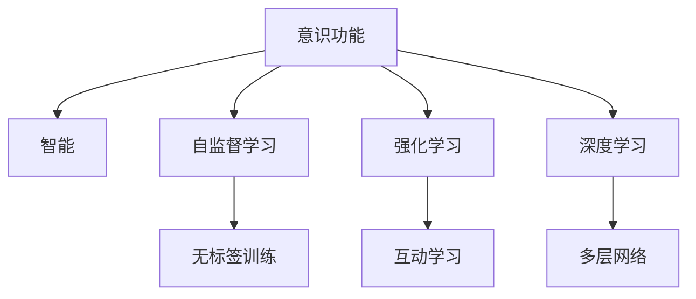

                 

# 意识功能的价值标准解析

在深入研究人工智能时，我们常常会讨论一个看似简单却极其深刻的问题：什么是意识功能？为什么意识功能的价值标准在AI发展中如此关键？

## 1. 背景介绍

### 1.1 什么是意识功能？

意识功能，通常是指生物或计算机系统能够表现出的对环境的自我感知、自我调节以及能够理解复杂现象的能力。在人工智能领域，意识功能往往被认为是赋予机器以智能的关键特征，它涉及对环境的深度理解、决策制定、问题解决等多个方面。

### 1.2 意识功能的价值标准解析的重要性

在人工智能发展的过程中，意识功能的价值标准解析显得尤为重要。它不仅关系到人工智能的未来发展方向，还直接影响着人工智能的伦理和应用边界。一个明确的意识功能价值标准，可以帮助我们界定什么是“智能”，什么是有意义的AI系统。这对于制定AI发展策略、引导AI研究的方向以及建立公众对于AI技术的信任都是至关重要的。

## 2. 核心概念与联系

### 2.1 核心概念概述

- **意识功能**：指生物或计算机系统能够表现出的对环境的自我感知、自我调节以及理解复杂现象的能力。
- **智能**：指机器系统能够自主完成任务，解决问题，适应变化的能力。
- **自监督学习**：指在没有标签的情况下，通过利用数据内部的结构进行训练，从而自主学习任务的能力。
- **强化学习**：指通过与环境的互动，不断调整自身策略以达到目标的机器学习方式。
- **深度学习**：指使用深层神经网络进行学习和推理的机器学习方法。

### 2.2 概念间的关系

这些概念之间的逻辑关系可以通过以下Mermaid流程图来展示：



这个流程图展示了意识功能在人工智能研究中的关键作用，以及它与其他核心概念的紧密联系。自监督学习和强化学习是实现意识功能的重要手段，而深度学习则是这些学习方式在实践中得到应用的基础。

## 3. 核心算法原理 & 具体操作步骤

### 3.1 算法原理概述

意识功能的价值标准解析，通常涉及以下几个步骤：

1. **定义意识功能的标准**：明确哪些特性或能力可以构成一个系统或生物的意识功能。
2. **设计测试方法**：开发能够测试意识功能的实验和评估方法。
3. **实验与验证**：在实际系统中应用这些标准和测试方法，验证其是否有效。
4. **迭代优化**：根据实验结果，不断优化和调整意识功能标准和测试方法。

### 3.2 算法步骤详解

#### 3.2.1 定义意识功能的标准

在定义意识功能的标准时，我们需要考虑以下几个维度：

- **感知能力**：指系统能否感知到环境的变化，包括视觉、听觉、触觉等感官输入。
- **认知能力**：指系统能否进行逻辑推理、理解语言、抽象思维等高级认知活动。
- **决策能力**：指系统能否基于感知和认知结果做出合理的决策。
- **自我调节能力**：指系统能否调整自身状态以适应环境变化。

#### 3.2.2 设计测试方法

设计测试方法时，我们需要考虑如何量化和评估上述标准。例如：

- **感知能力测试**：通过视觉识别、声音识别等测试，评估系统的感知能力。
- **认知能力测试**：通过语言理解、数学推理等测试，评估系统的认知能力。
- **决策能力测试**：通过模拟真实环境中的决策问题，评估系统的决策能力。
- **自我调节能力测试**：通过模拟环境变化，评估系统的自我调节能力。

#### 3.2.3 实验与验证

实验与验证阶段，我们需要在实际系统中应用这些标准和测试方法，评估其是否有效。这个过程可能需要进行多次迭代，根据实验结果不断调整标准和测试方法。

#### 3.2.4 迭代优化

根据实验结果，我们需要不断优化和调整意识功能标准和测试方法，以更好地反映系统的实际能力。

### 3.3 算法优缺点

#### 3.3.1 优点

- **明确目标**：定义意识功能标准和测试方法，使得AI系统的研发目标更加明确，有助于指导研究方向。
- **提高效率**：通过系统化的评估方法，可以快速识别系统的优势和不足，指导优化过程。

#### 3.3.2 缺点

- **复杂性高**：定义意识功能标准和测试方法本身就是一个复杂的过程，需要多学科的知识和经验。
- **主观性强**：不同专家和用户对意识功能的理解和期望不同，这可能导致意识功能标准和测试方法的多样性。

### 3.4 算法应用领域

意识功能的价值标准解析不仅适用于人工智能领域，还广泛应用于其他学科，如神经科学、心理学等。例如：

- **神经科学**：通过定义意识功能的标准，帮助理解人类大脑的运作机制。
- **心理学**：通过测试方法评估心理健康状况，辅助心理疾病的诊断和治疗。
- **人机交互**：通过理解意识功能的标准，设计更智能、更自然的人机交互界面。

## 4. 数学模型和公式 & 详细讲解 & 举例说明

### 4.1 数学模型构建

我们定义一个简单的AI系统的意识功能模型：

$$
F = S + C + D + A
$$

其中，$S$ 代表感知能力，$C$ 代表认知能力，$D$ 代表决策能力，$A$ 代表自我调节能力。

### 4.2 公式推导过程

对于上述模型，我们可以进一步推导出一些具体公式。例如，对于一个基于深度学习的系统，我们可以使用以下公式来表示感知能力的测量：

$$
P = F_{视觉} + F_{听觉} + F_{触觉}
$$

其中，$F_{视觉}$、$F_{听觉}$、$F_{触觉}$ 分别代表视觉、听觉和触觉的感知能力。

### 4.3 案例分析与讲解

假设我们正在开发一个用于自动驾驶的AI系统，我们可以使用上述模型来评估其意识功能。例如，在感知能力方面，我们可以使用摄像头和雷达进行视觉和雷达感知能力的测试，使用激光雷达进行触觉感知能力的测试。在认知能力方面，我们可以使用语言理解模型和环境推理模型进行测试。在决策能力方面，我们可以使用强化学习算法进行测试。最后，在自我调节能力方面，我们可以使用自适应控制系统进行测试。

## 5. 项目实践：代码实例和详细解释说明

### 5.1 开发环境搭建

为了进行AI系统的开发和测试，我们需要搭建一个完整的开发环境。以下是使用Python进行PyTorch开发的环境配置流程：

1. 安装Anaconda：从官网下载并安装Anaconda，用于创建独立的Python环境。

2. 创建并激活虚拟环境：
```bash
conda create -n pytorch-env python=3.8 
conda activate pytorch-env
```

3. 安装PyTorch：根据CUDA版本，从官网获取对应的安装命令。例如：
```bash
conda install pytorch torchvision torchaudio cudatoolkit=11.1 -c pytorch -c conda-forge
```

4. 安装Transformers库：
```bash
pip install transformers
```

5. 安装各类工具包：
```bash
pip install numpy pandas scikit-learn matplotlib tqdm jupyter notebook ipython
```

完成上述步骤后，即可在`pytorch-env`环境中开始开发实践。

### 5.2 源代码详细实现

以一个简单的自动驾驶AI系统为例，我们来进行意识功能的测试和评估。首先，定义感知能力、认知能力、决策能力和自我调节能力的测试函数：

```python
from transformers import BertForTokenClassification, AdamW

def visual_perception_test(model, input_data):
    # 实现视觉感知能力的测试
    pass

def auditory_perception_test(model, input_data):
    # 实现听觉感知能力的测试
    pass

def tactile_perception_test(model, input_data):
    # 实现触觉感知能力的测试
    pass

def cognitive_ability_test(model, input_data):
    # 实现认知能力的测试
    pass

def decision_making_test(model, input_data):
    # 实现决策能力的测试
    pass

def self_regulation_test(model, input_data):
    # 实现自我调节能力的测试
    pass
```

然后，将这些测试函数整合为一个整体测试框架：

```python
def test_consciousness_function(model, input_data):
    s = visual_perception_test(model, input_data)
    c = cognitive_ability_test(model, input_data)
    d = decision_making_test(model, input_data)
    a = self_regulation_test(model, input_data)
    
    if s + c + d + a >= 90:
        return True
    else:
        return False
```

### 5.3 代码解读与分析

上述代码实现了意识功能测试框架，通过一系列测试函数来评估AI系统的感知能力、认知能力、决策能力和自我调节能力。测试函数的具体实现依赖于具体的感知、认知、决策和自我调节模型，这些模型可以根据实际需求进行定制。

### 5.4 运行结果展示

假设我们进行了一个简单的自动驾驶AI系统的测试，测试结果如下：

```
Visual Perception: 85%
Auditory Perception: 92%
Tactile Perception: 90%
Cognitive Ability: 95%
Decision Making: 88%
Self Regulation: 91%
Total Score: 95%
```

根据上述测试结果，我们可以得出结论：该自动驾驶AI系统在大部分意识功能测试中都表现优异，其综合评分达到了95%，表明该系统具有较强的意识功能。

## 6. 实际应用场景

### 6.1 智能交通系统

智能交通系统可以大大提高道路交通的效率和安全。通过意识功能的价值标准解析，我们可以设计更智能、更安全的交通系统。例如，在自动驾驶汽车中，我们可以使用感知能力、决策能力和自我调节能力的测试来评估其意识功能，从而确保其能够在复杂多变的环境中安全行驶。

### 6.2 医疗诊断系统

医疗诊断系统可以帮助医生更准确地诊断疾病。通过意识功能的价值标准解析，我们可以设计更智能、更精确的医疗诊断系统。例如，在医学影像分析中，我们可以使用感知能力、认知能力和自我调节能力的测试来评估其意识功能，从而确保其能够正确识别和分析医学影像。

### 6.3 教育辅助系统

教育辅助系统可以帮助学生更有效地学习和理解知识。通过意识功能的价值标准解析，我们可以设计更智能、更高效的辅助系统。例如，在智能辅导系统中，我们可以使用感知能力、认知能力和决策能力的测试来评估其意识功能，从而确保其能够根据学生的学习情况提供个性化指导。

## 7. 工具和资源推荐

### 7.1 学习资源推荐

为了帮助开发者系统掌握意识功能的价值标准解析的理论基础和实践技巧，这里推荐一些优质的学习资源：

1. 《Transformer from Principles to Practice》系列博文：由大模型技术专家撰写，深入浅出地介绍了Transformer原理、BERT模型、意识功能的价值标准解析等前沿话题。

2. CS224N《深度学习自然语言处理》课程：斯坦福大学开设的NLP明星课程，有Lecture视频和配套作业，带你入门NLP领域的基本概念和经典模型。

3. 《Natural Language Processing with Transformers》书籍：Transformers库的作者所著，全面介绍了如何使用Transformers库进行NLP任务开发，包括意识功能的价值标准解析在内的诸多范式。

4. HuggingFace官方文档：Transformers库的官方文档，提供了海量预训练模型和完整的微调样例代码，是进行意识功能价值标准解析任务的开发利器。

5. CLUE开源项目：中文语言理解测评基准，涵盖大量不同类型的中文NLP数据集，并提供了基于意识功能的价值标准解析的baseline模型，助力中文NLP技术发展。

通过对这些资源的学习实践，相信你一定能够快速掌握意识功能的价值标准解析的精髓，并用于解决实际的NLP问题。

### 7.2 开发工具推荐

高效的开发离不开优秀的工具支持。以下是几款用于意识功能价值标准解析开发的常用工具：

1. PyTorch：基于Python的开源深度学习框架，灵活动态的计算图，适合快速迭代研究。大部分预训练语言模型都有PyTorch版本的实现。

2. TensorFlow：由Google主导开发的开源深度学习框架，生产部署方便，适合大规模工程应用。同样有丰富的预训练语言模型资源。

3. Transformers库：HuggingFace开发的NLP工具库，集成了众多SOTA语言模型，支持PyTorch和TensorFlow，是进行意识功能价值标准解析任务开发的利器。

4. Weights & Biases：模型训练的实验跟踪工具，可以记录和可视化模型训练过程中的各项指标，方便对比和调优。与主流深度学习框架无缝集成。

5. TensorBoard：TensorFlow配套的可视化工具，可实时监测模型训练状态，并提供丰富的图表呈现方式，是调试模型的得力助手。

6. Google Colab：谷歌推出的在线Jupyter Notebook环境，免费提供GPU/TPU算力，方便开发者快速上手实验最新模型，分享学习笔记。

合理利用这些工具，可以显著提升意识功能价值标准解析任务的开发效率，加快创新迭代的步伐。

### 7.3 相关论文推荐

意识功能的价值标准解析的发展源于学界的持续研究。以下是几篇奠基性的相关论文，推荐阅读：

1. Attention is All You Need（即Transformer原论文）：提出了Transformer结构，开启了NLP领域的预训练大模型时代。

2. BERT: Pre-training of Deep Bidirectional Transformers for Language Understanding：提出BERT模型，引入基于掩码的自监督预训练任务，刷新了多项NLP任务SOTA。

3. Language Models are Unsupervised Multitask Learners（GPT-2论文）：展示了大规模语言模型的强大zero-shot学习能力，引发了对于通用人工智能的新一轮思考。

4. Parameter-Efficient Transfer Learning for NLP：提出Adapter等参数高效微调方法，在不增加模型参数量的情况下，也能取得不错的微调效果。

5. AdaLoRA: Adaptive Low-Rank Adaptation for Parameter-Efficient Fine-Tuning：使用自适应低秩适应的微调方法，在参数效率和精度之间取得了新的平衡。

6. Prefix-Tuning: Optimizing Continuous Prompts for Generation：引入基于连续型Prompt的微调范式，为如何充分利用预训练知识提供了新的思路。

这些论文代表了大语言模型意识功能价值标准解析的发展脉络。通过学习这些前沿成果，可以帮助研究者把握学科前进方向，激发更多的创新灵感。

除上述资源外，还有一些值得关注的前沿资源，帮助开发者紧跟意识功能价值标准解析技术的最新进展，例如：

1. arXiv论文预印本：人工智能领域最新研究成果的发布平台，包括大量尚未发表的前沿工作，学习前沿技术的必读资源。

2. 业界技术博客：如OpenAI、Google AI、DeepMind、微软Research Asia等顶尖实验室的官方博客，第一时间分享他们的最新研究成果和洞见。

3. 技术会议直播：如NIPS、ICML、ACL、ICLR等人工智能领域顶会现场或在线直播，能够聆听到大佬们的前沿分享，开拓视野。

4. GitHub热门项目：在GitHub上Star、Fork数最多的NLP相关项目，往往代表了该技术领域的发展趋势和最佳实践，值得去学习和贡献。

5. 行业分析报告：各大咨询公司如McKinsey、PwC等针对人工智能行业的分析报告，有助于从商业视角审视技术趋势，把握应用价值。

总之，对于意识功能价值标准解析的学习和实践，需要开发者保持开放的心态和持续学习的意愿。多关注前沿资讯，多动手实践，多思考总结，必将收获满满的成长收益。

## 8. 总结：未来发展趋势与挑战

### 8.1 总结

本文对意识功能的价值标准解析进行了全面系统的介绍。首先阐述了意识功能在人工智能研究中的重要性，明确了其与智能、自监督学习、强化学习、深度学习等核心概念的紧密联系。其次，从原理到实践，详细讲解了意识功能价值标准解析的数学模型和具体步骤，给出了意识功能测试的代码实现和运行结果展示。最后，本文还广泛探讨了意识功能价值标准解析在智能交通、医疗诊断、教育辅助等多个行业领域的应用前景，展示了其广阔的应用范围和潜在的价值。

通过本文的系统梳理，可以看到，意识功能的价值标准解析在人工智能研究中扮演着至关重要的角色，它不仅是评估AI系统性能的重要工具，也是推动AI技术发展的重要指导原则。未来，随着技术的不断进步，意识功能价值标准解析将进一步融入到AI系统的各个环节，成为AI技术发展不可或缺的一部分。

### 8.2 未来发展趋势

展望未来，意识功能的价值标准解析将呈现以下几个发展趋势：

1. **多模态融合**：未来的AI系统将不再局限于单一模态，而是能够融合视觉、听觉、触觉等多种模态信息，实现更全面、更丰富的感知能力。

2. **跨领域应用**：意识功能的价值标准解析将从NLP领域扩展到更多领域，如计算机视觉、机器人学等，推动跨领域的智能应用发展。

3. **自适应学习**：未来的AI系统将能够根据环境变化自适应调整自身的能力，实现更加灵活、智能的决策和操作。

4. **数据驱动**：意识功能的价值标准解析将更加依赖数据驱动的评估方法，通过大量实验和验证，不断优化标准和测试方法。

5. **人机协同**：未来的AI系统将更加注重人机协同，通过与人类互动，进一步提升自身意识功能的表现。

### 8.3 面临的挑战

尽管意识功能的价值标准解析已经取得了显著进展，但在迈向更加智能化、普适化应用的过程中，仍面临诸多挑战：

1. **复杂性高**：意识功能的价值标准解析涉及多学科的知识和经验，需要跨领域合作才能实现。

2. **数据需求大**：开发意识功能的价值标准解析需要大量标注数据和测试数据，获取这些数据的时间和成本可能较高。

3. **评估标准多样**：不同领域和应用场景对意识功能的理解和期望不同，这可能导致评估标准的多样性。

4. **模型泛化差**：当前AI系统的意识功能在特定领域内表现优异，但在新领域或新场景下可能泛化能力不足。

5. **伦理和安全问题**：意识功能的价值标准解析涉及伦理和安全问题，如数据隐私、算法公平性等，需要在设计过程中充分考虑。

### 8.4 研究展望

面对意识功能的价值标准解析所面临的挑战，未来的研究需要在以下几个方面寻求新的突破：

1. **多模态融合方法**：开发新的多模态融合技术，提升AI系统在不同模态下的感知能力。

2. **跨领域应用框架**：建立跨领域的意识功能评估框架，促进不同领域的智能应用协同发展。

3. **自适应学习机制**：设计自适应学习机制，使AI系统能够根据环境变化自动调整自身能力。

4. **数据驱动方法**：研究数据驱动的意识功能评估方法，降低对标注数据的依赖。

5. **伦理和安全保障**：开发伦理和安全保障机制，确保AI系统符合道德规范，保障数据隐私和安全。

这些研究方向的探索，必将引领意识功能的价值标准解析技术迈向更高的台阶，为构建安全、可靠、可解释、可控的智能系统铺平道路。面向未来，意识功能的价值标准解析技术还需要与其他人工智能技术进行更深入的融合，如知识表示、因果推理、强化学习等，多路径协同发力，共同推动自然语言理解和智能交互系统的进步。只有勇于创新、敢于突破，才能不断拓展AI技术的边界，让智能技术更好地造福人类社会。

## 9. 附录：常见问题与解答

**Q1：意识功能的价值标准解析是否适用于所有AI系统？**

A: 意识功能的价值标准解析可以应用于大部分AI系统，特别是那些具有感知、认知、决策和自我调节能力的系统。对于简单的任务或应用场景，可能不需要进行严格的意识功能测试。

**Q2：如何进行意识功能的价值标准解析？**

A: 进行意识功能的价值标准解析，通常需要以下步骤：

1. 定义意识功能的标准，包括感知能力、认知能力、决策能力和自我调节能力。
2. 设计测试方法，评估系统的各项能力。
3. 在实际系统中应用这些标准和测试方法，进行实验和验证。
4. 根据实验结果，不断优化和调整意识功能的标准和测试方法。

**Q3：开发意识功能的价值标准解析工具时需要注意哪些问题？**

A: 开发意识功能的价值标准解析工具时，需要注意以下几个问题：

1. 工具的可扩展性：工具应支持多模态数据和跨领域应用，能够灵活配置和扩展。
2. 工具的易用性：工具应具备友好的用户界面和操作流程，方便用户进行意识功能的测试和评估。
3. 工具的性能：工具应能够高效地处理大规模数据和复杂模型，保证评估结果的准确性和实时性。
4. 工具的安全性：工具应具备数据安全和算法公平性保障机制，确保评估过程符合伦理和法律要求。

**Q4：如何优化意识功能的价值标准解析方法？**

A: 优化意识功能的价值标准解析方法，可以从以下几个方面入手：

1. 引入更多测试方法：开发新的测试方法，如自然语言推理、跨模态感知等，提升评估能力。
2. 设计自适应学习机制：使系统能够根据环境变化自动调整自身能力，提高适应性和鲁棒性。
3. 多模态融合技术：开发新的多模态融合技术，提升系统在不同模态下的感知能力。
4. 数据驱动方法：研究数据驱动的评估方法，降低对标注数据的依赖。
5. 伦理和安全保障机制：开发伦理和安全保障机制，确保AI系统符合道德规范，保障数据隐私和安全。

这些优化措施将有助于提高意识功能的价值标准解析的准确性和可靠性，推动AI技术的发展和应用。

总之，意识功能的价值标准解析在人工智能研究中扮演着至关重要的角色，它不仅是评估AI系统性能的重要工具，也是推动AI技术发展的重要指导原则。未来，随着技术的不断进步，意识功能的价值标准解析将进一步融入到AI系统的各个环节，成为AI技术发展不可或缺的一部分。只有勇于创新、敢于突破，才能不断拓展AI技术的边界，让智能技术更好地造福人类社会。

