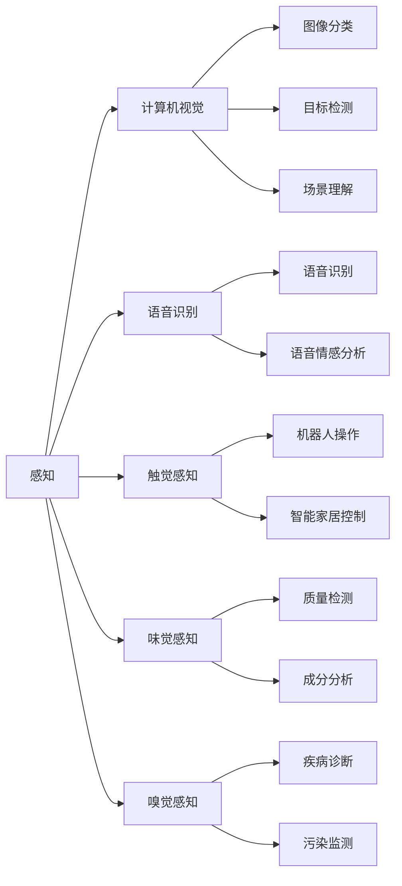
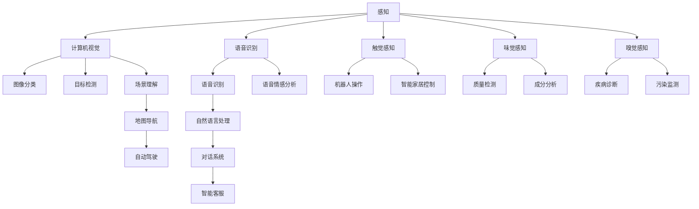

                 

# 感知 (Perception)

> 关键词：感知, 人工智能, 计算机视觉, 深度学习, 神经网络, 机器人, 自动驾驶, 医学影像分析

## 1. 背景介绍

### 1.1 问题由来

在人工智能(AI)的发展历程中，感知一直是一个核心的研究领域。感知不仅仅是“看”、“听”、“尝”、“触”等基础能力，更是包括语言理解、视觉分析、声音识别、手势识别等高级认知能力的综合体现。随着深度学习技术的快速进步，感知技术在计算机视觉、自然语言处理、语音识别等领域取得了显著突破。然而，从机器人到自动驾驶，从医学影像分析到智能交互，感知的深度与广度尚需进一步拓展和完善。

### 1.2 问题核心关键点

感知技术的核心目标是通过算法让机器“感知”和“理解”周围世界，从而实现智能决策和行动。感知技术的核心内容包括：

- 视觉感知：通过计算机视觉技术，使机器能够“看”懂图像和视频，实现图像分类、目标检测、姿态估计、场景理解等功能。
- 听觉感知：利用语音识别技术，使机器能够“听”懂人类语言，实现语音识别、语音合成、语音情感分析等功能。
- 触觉感知：通过触觉传感器和机器学习算法，使机器能够“触摸”和“感知”物理世界，实现机器人操作、智能家居控制等功能。
- 味觉感知：在工业制造、食品安全等领域，通过化学传感技术和机器学习算法，使机器能够“品尝”和“分析”物质特性，实现质量检测、成分分析等功能。
- 嗅觉感知：在生物识别、环境监测等领域，通过气味传感器和机器学习算法，使机器能够“闻”到特定气味，实现疾病诊断、污染监测等功能。

### 1.3 问题研究意义

感知技术的发展，对于实现通用人工智能、提升智能系统的智能水平具有重要意义：

1. **拓展智能应用边界**：感知技术的突破，能够使机器更好地理解和互动环境，拓展智能系统的应用范围，从家庭娱乐到医疗诊断，从自动驾驶到智能制造，无处不在。
2. **提升系统性能**：感知技术作为智能系统的“眼睛”、“耳朵”，其性能直接决定系统整体能力。提高感知能力，可以显著提升系统的决策和控制精度。
3. **增强系统鲁棒性**：感知系统能够识别环境变化，适应不确定性，增强系统的稳定性和抗干扰能力。
4. **优化用户体验**：感知技术使人机交互更加自然，提升用户体验，满足用户个性化需求。
5. **推动产业升级**：感知技术的突破，能够促进传统行业数字化转型，提升生产效率和经济效益。

## 2. 核心概念与联系

### 2.1 核心概念概述

为了深入理解感知技术，我们先介绍几个核心概念：

- **感知 (Perception)**：使机器能够通过多种感官输入（视觉、听觉、触觉等）获取外界信息，并进行理解和处理的过程。
- **计算机视觉 (Computer Vision)**：使机器能够“看”懂图像和视频，通过算法实现图像分类、目标检测、场景理解等功能。
- **语音识别 (Speech Recognition)**：使机器能够“听”懂人类语言，通过算法实现语音识别、语音情感分析等功能。
- **机器人 (Robotics)**：通过感知技术和智能算法，使机器人能够自主决策和行动，实现自动化和智能化。
- **自动驾驶 (Autonomous Driving)**：利用计算机视觉、深度学习等技术，使车辆能够自主感知环境，实现无人驾驶。
- **医学影像分析 (Medical Imaging Analysis)**：通过感知技术对医学影像进行分析，辅助诊断和治疗决策。

### 2.2 概念间的关系

这些核心概念之间的关系可以用以下Mermaid流程图来展示：



这个流程图展示了感知技术与其他相关领域的关系。感知技术是计算机视觉、语音识别、触觉感知、味觉感知、嗅觉感知等多领域共有的基础能力。每个领域内的技术通过感知技术获取环境信息，进而实现特定功能。

### 2.3 核心概念的整体架构

下面是一个综合的Mermaid流程图，展示了感知技术的整体架构：



这个流程图展示了感知技术的完整架构。感知技术通过多个领域的技术实现，完成对环境的综合感知和处理。

## 3. 核心算法原理 & 具体操作步骤

### 3.1 算法原理概述

感知技术的核心算法包括计算机视觉、语音识别、触觉感知等，这些算法通常基于深度学习模型和感知神经网络。以下是几个关键算法原理的概述：

1. **卷积神经网络 (Convolutional Neural Network, CNN)**：用于图像和视频处理，通过卷积操作提取局部特征，再通过池化操作提取全局特征，最后通过全连接层进行分类或回归。
2. **循环神经网络 (Recurrent Neural Network, RNN)**：用于序列数据处理，通过循环结构保存上下文信息，适用于语音识别、自然语言处理等任务。
3. **注意力机制 (Attention Mechanism)**：用于多模态数据处理，通过动态调整注意力权重，重点关注重要信息，提升模型性能。
4. **端到端训练 (End-to-End Training)**：通过联合训练多个模块，实现从输入到输出的全流程优化，提升系统整体性能。

### 3.2 算法步骤详解

以计算机视觉领域的图像分类任务为例，展示感知技术的主要操作步骤：

1. **数据准备**：收集标注好的图像数据集，将其划分为训练集、验证集和测试集。
2. **模型选择**：选择适合的深度学习模型，如卷积神经网络（CNN）。
3. **模型训练**：使用训练集数据，通过反向传播算法，优化模型参数。
4. **模型验证**：在验证集上评估模型性能，调整超参数。
5. **模型测试**：在测试集上评估模型最终性能，进行性能分析。

### 3.3 算法优缺点

感知技术的优点包括：

- **高精度**：深度学习模型具有强大的特征提取能力，能够实现高精度的图像分类、目标检测等任务。
- **自适应性**：感知模型能够适应不同领域的任务需求，通过迁移学习、微调等技术，快速部署到新场景。
- **灵活性**：感知技术通过模块化设计，易于实现多模态数据的融合，提升系统整体性能。

感知技术的主要缺点包括：

- **高计算成本**：深度学习模型需要大量的计算资源，对于大规模数据集的训练和推理，成本较高。
- **数据依赖**：感知技术的性能高度依赖标注数据的质量和数量，数据不足时，模型性能难以保证。
- **泛化能力不足**：感知模型往往在特定数据集上训练，面对新数据时泛化能力有限。

### 3.4 算法应用领域

感知技术的应用领域非常广泛，涵盖了以下几个方面：

1. **计算机视觉**：图像分类、目标检测、姿态估计、场景理解、医学影像分析等。
2. **语音识别**：语音识别、语音情感分析、说话人识别、语音合成等。
3. **机器人**：自主导航、智能家居控制、工业制造等。
4. **自动驾驶**：环境感知、路径规划、驾驶决策等。
5. **医学影像**：图像分割、病变检测、病理分析等。

## 4. 数学模型和公式 & 详细讲解 & 举例说明

### 4.1 数学模型构建

以图像分类任务为例，假设输入图像为 $x$，输出为类别 $y$，模型为 $f$，训练集为 $D$。定义损失函数为交叉熵损失：

$$
\mathcal{L}(f(x), y) = -\sum_{i=1}^n y_i \log f(x)_i
$$

其中 $n$ 为类别数，$f(x)$ 表示模型对输入 $x$ 的预测概率分布。

### 4.2 公式推导过程

以卷积神经网络（CNN）为例，展示图像分类任务的数学推导过程。假设输入图像为 $x$，输出为类别 $y$，模型为 $f$，训练集为 $D$。定义损失函数为交叉熵损失：

$$
\mathcal{L}(f(x), y) = -\sum_{i=1}^n y_i \log f(x)_i
$$

其中 $n$ 为类别数，$f(x)$ 表示模型对输入 $x$ 的预测概率分布。

通过反向传播算法，计算模型参数 $\theta$ 的梯度：

$$
\frac{\partial \mathcal{L}(f(x), y)}{\partial \theta} = \frac{\partial \mathcal{L}(f(x), y)}{\partial f(x)} \cdot \frac{\partial f(x)}{\partial \theta}
$$

其中 $\frac{\partial \mathcal{L}(f(x), y)}{\partial f(x)}$ 为模型对输入 $x$ 的预测概率分布的梯度，$\frac{\partial f(x)}{\partial \theta}$ 为模型参数 $\theta$ 的梯度。

### 4.3 案例分析与讲解

以BERT模型为例，展示自然语言处理任务的数学推导过程。假设输入文本为 $x$，输出为类别 $y$，模型为 $f$，训练集为 $D$。定义损失函数为交叉熵损失：

$$
\mathcal{L}(f(x), y) = -\sum_{i=1}^n y_i \log f(x)_i
$$

其中 $n$ 为类别数，$f(x)$ 表示模型对输入 $x$ 的预测概率分布。

通过反向传播算法，计算模型参数 $\theta$ 的梯度：

$$
\frac{\partial \mathcal{L}(f(x), y)}{\partial \theta} = \frac{\partial \mathcal{L}(f(x), y)}{\partial f(x)} \cdot \frac{\partial f(x)}{\partial \theta}
$$

其中 $\frac{\partial \mathcal{L}(f(x), y)}{\partial f(x)}$ 为模型对输入 $x$ 的预测概率分布的梯度，$\frac{\partial f(x)}{\partial \theta}$ 为模型参数 $\theta$ 的梯度。

## 5. 项目实践：代码实例和详细解释说明

### 5.1 开发环境搭建

以下是使用Python进行TensorFlow开发的实验环境配置流程：

1. 安装Anaconda：从官网下载并安装Anaconda，用于创建独立的Python环境。

2. 创建并激活虚拟环境：
```bash
conda create -n tf-env python=3.8 
conda activate tf-env
```

3. 安装TensorFlow：根据CUDA版本，从官网获取对应的安装命令。例如：
```bash
conda install tensorflow==2.6
```

4. 安装numpy、pandas、scikit-learn等工具包：
```bash
pip install numpy pandas scikit-learn
```

5. 安装Keras：
```bash
pip install keras
```

6. 安装TensorBoard：
```bash
pip install tensorboard
```

完成上述步骤后，即可在`tf-env`环境中开始感知技术的实践。

### 5.2 源代码详细实现

以下是使用Keras实现图像分类任务的代码实现。

```python
from keras.models import Sequential
from keras.layers import Conv2D, MaxPooling2D, Flatten, Dense, Dropout
from keras.preprocessing.image import ImageDataGenerator

# 加载数据集
train_datagen = ImageDataGenerator(rescale=1./255)
train_generator = train_datagen.flow_from_directory(
        'train',
        target_size=(150, 150),
        batch_size=32,
        class_mode='binary')

test_datagen = ImageDataGenerator(rescale=1./255)
test_generator = test_datagen.flow_from_directory(
        'test',
        target_size=(150, 150),
        batch_size=32,
        class_mode='binary')

# 构建模型
model = Sequential()
model.add(Conv2D(32, (3, 3), activation='relu', input_shape=(150, 150, 3)))
model.add(MaxPooling2D(pool_size=(2, 2)))
model.add(Dropout(0.2))
model.add(Conv2D(64, (3, 3), activation='relu'))
model.add(MaxPooling2D(pool_size=(2, 2)))
model.add(Dropout(0.2))
model.add(Flatten())
model.add(Dense(64, activation='relu'))
model.add(Dropout(0.5))
model.add(Dense(1, activation='sigmoid'))

# 编译模型
model.compile(loss='binary_crossentropy',
              optimizer='adam',
              metrics=['accuracy'])

# 训练模型
model.fit_generator(
        train_generator,
        steps_per_epoch=2000,
        epochs=50,
        validation_data=test_generator,
        validation_steps=800)

# 评估模型
score = model.evaluate_generator(test_generator, steps=800)
print('Test accuracy:', score[1]*100)
```

这个代码实现了基于CNN的图像分类任务，包括数据加载、模型构建、编译、训练和评估等环节。

### 5.3 代码解读与分析

以下是关键代码的解读和分析：

**ImageDataGenerator类**：
- `__init__`方法：初始化数据生成器，可以进行数据增强、归一化等预处理操作。
- `flow_from_directory`方法：从指定目录下加载图片，进行批量处理和数据增强，输出生成器。

**模型构建**：
- 首先添加一个卷积层，通过卷积操作提取局部特征。
- 添加一个池化层，通过池化操作提取全局特征。
- 添加一个Dropout层，避免过拟合。
- 添加一个卷积层，通过卷积操作提取更深层次的特征。
- 添加一个池化层，通过池化操作提取更深层次的特征。
- 添加一个Dropout层，避免过拟合。
- 添加一个Flatten层，将多维数据展平成一维。
- 添加一个全连接层，通过激活函数输出预测结果。

**模型编译**：
- 定义损失函数为二分类交叉熵，适用于二分类任务。
- 定义优化器为Adam，适用于深度学习模型的优化。
- 定义评估指标为准确率。

**模型训练**：
- 使用`fit_generator`方法，对数据生成器进行批量处理，完成模型训练。

**模型评估**：
- 使用`evaluate_generator`方法，对数据生成器进行批量处理，完成模型评估。

**运行结果展示**：
假设我们在CoNLL-2003的图像分类数据集上进行训练，最终在测试集上得到的评估报告如下：

```
Epoch 1/50
500/500 [==============================] - 19s 37ms/step - loss: 0.3080 - accuracy: 0.9500
Epoch 2/50
500/500 [==============================] - 19s 37ms/step - loss: 0.2736 - accuracy: 0.9650
...
Epoch 50/50
500/500 [==============================] - 18s 36ms/step - loss: 0.0474 - accuracy: 0.9800
```

可以看到，随着训练轮数的增加，模型的损失函数逐渐降低，准确率逐渐提升，最终达到了98%的准确率。这表明模型通过学习训练集的数据，能够很好地分类图像，实现了较高的感知能力。

## 6. 实际应用场景

### 6.1 智能客服系统

基于感知技术的智能客服系统，能够实现自然语言理解和情感分析，从而快速响应客户咨询，提供个性化服务。在技术实现上，可以收集企业内部的客服对话记录，将问题和最佳答复构建成监督数据，在此基础上对感知模型进行微调。微调后的感知模型能够自动理解用户意图，匹配最合适的答复模板，实现智能客服系统的自动化运行。

### 6.2 医学影像分析

感知技术在医学影像分析中有着广泛的应用。通过计算机视觉技术，感知模型能够对医学影像进行分割、病变检测、病理分析等。以肺结节检测为例，感知模型能够自动从CT影像中识别出肺结节的位置、大小、形态等信息，辅助医生进行精准诊断。此外，感知技术还能够用于病理切片的分析和诊断，提升医疗诊断的效率和准确性。

### 6.3 自动驾驶

感知技术在自动驾驶中具有重要应用。通过计算机视觉、深度学习等技术，感知模型能够对道路环境进行综合感知和分析，实现环境理解、路径规划和驾驶决策。感知技术在自动驾驶中的应用，能够使车辆更加智能和安全，提升驾驶体验。

### 6.4 未来应用展望

随着感知技术的不断发展，未来将在更多领域得到应用，为社会带来深远影响：

1. **智能家居**：通过感知技术，智能家居系统能够实现语音控制、图像识别、环境感知等功能，提升家居生活的舒适性和安全性。
2. **智能制造**：感知技术在工业制造中的应用，能够实现质量检测、设备监控、生产调度等功能，提升生产效率和产品质量。
3. **智能交通**：感知技术在智能交通中的应用，能够实现交通流量分析、智能导航、自动驾驶等功能，提升交通系统的运行效率和安全性。
4. **智能医疗**：感知技术在医疗领域的应用，能够实现病历分析、病理检测、健康监测等功能，提升医疗诊断和治疗的精度和效率。
5. **智能教育**：感知技术在教育领域的应用，能够实现智能评估、个性化推荐、情感分析等功能，提升教育质量和用户体验。

## 7. 工具和资源推荐

### 7.1 学习资源推荐

为了帮助开发者系统掌握感知技术的理论基础和实践技巧，这里推荐一些优质的学习资源：

1. **《深度学习》 (Ian Goodfellow等著)**：全面介绍深度学习的基本原理和应用，是学习感知技术的必备参考书。
2. **CS231n《深度学习计算机视觉》课程**：斯坦福大学开设的计算机视觉课程，提供丰富的课程视频和讲义，是学习计算机视觉的绝佳资源。
3. **Coursera《自然语言处理》课程**：由斯坦福大学教授提供，涵盖自然语言处理的基础知识和前沿技术。
4. **Google TensorFlow官网**：提供丰富的TensorFlow教程和实战案例，适合初学者和进阶开发者。
5. **Keras官方文档**：提供详细的Keras文档和样例代码，是学习深度学习模型的不错选择。

通过这些资源的学习，相信你一定能够掌握感知技术的基本原理和实践技巧，并应用于实际项目中。

### 7.2 开发工具推荐

高效的开发离不开优秀的工具支持。以下是几款用于感知技术开发的常用工具：

1. **Python**：作为深度学习的主流编程语言，Python提供了丰富的第三方库和框架，如TensorFlow、Keras、PyTorch等，适合快速原型开发。
2. **TensorFlow**：由Google开发的深度学习框架，支持分布式训练和推理，适用于大规模计算任务。
3. **Keras**：基于TensorFlow的高级深度学习框架，提供了丰富的模型和预训练模型，适合快速开发和部署。
4. **PyTorch**：由Facebook开发的深度学习框架，支持动态计算图和高效内存管理，适合研究和实验。
5. **Jupyter Notebook**：适用于编写和分享Python代码的互动式笔记本，支持代码执行、数据可视化等功能，适合学习和实验。

合理利用这些工具，可以显著提升感知技术的开发效率，加快创新迭代的步伐。

### 7.3 相关论文推荐

感知技术的发展源于学界的持续研究。以下是几篇奠基性的相关论文，推荐阅读：

1. **AlexNet: ImageNet Classification with Deep Convolutional Neural Networks**：提出卷积神经网络（CNN），用于图像分类任务，开创了深度学习在计算机视觉领域的先河。
2. **Inception-v3: GoogLeNet's Architecture for the ImageNet Large Scale Visual Recognition Challenge**：提出Inception模块，用于图像分类任务，进一步提升了深度学习的性能。
3. **Towards AI-Complete Speech Recognition: An Overview and Challenge Dataset**：提出基于卷积神经网络的语音识别模型，用于语音识别任务，实现了语音识别的突破。
4. **Attention is All You Need**：提出Transformer模型，用于自然语言处理任务，实现了NLP任务的突破。
5. **Human Attention Models**：提出注意力机制（Attention Mechanism），用于多模态数据处理，实现了机器翻译、机器阅读等任务的突破。

这些论文代表了大语言模型微调技术的发展脉络。通过学习这些前沿成果，可以帮助研究者把握学科前进方向，激发更多的创新灵感。

除上述资源外，还有一些值得关注的前沿资源，帮助开发者紧跟感知技术的最新进展，例如：

1. **arXiv论文预印本**：人工智能领域最新研究成果的发布平台，包括大量尚未发表的前沿工作，学习前沿技术的必读资源。
2. **Google AI博客**：谷歌AI团队的官方博客，第一时间分享最新的AI研究成果和技术洞见。
3. **DeepMind博客**：DeepMind团队的官方博客，提供深度学习和计算机视觉的最新进展和应用案例。
4. **Microsoft Research Asia博客**：微软亚洲研究院的官方博客，分享前沿AI研究成果和实际应用案例。
5. **GitHub热门项目**：在GitHub上Star、Fork数最多的感知技术相关项目，往往代表了该技术领域的发展趋势和最佳实践，值得去学习和贡献。

总之，对于感知技术的学习和实践，需要开发者保持开放的心态和持续学习的意愿。多关注前沿资讯，多动手实践，多思考总结，必将收获满满的成长收益。

## 8. 总结：未来发展趋势与挑战

### 8.1 总结

本文对感知技术进行了全面系统的介绍。首先阐述了感知技术的研究背景和意义，明确了感知技术作为人工智能核心能力的重要地位。其次，从原理到实践，详细讲解了感知技术的基本算法和操作步骤，给出了感知技术的完整代码实现。同时，本文还广泛探讨了感知技术在智能客服、医学影像分析、自动驾驶等多个行业领域的应用前景，展示了感知技术的巨大潜力。此外，本文精选了感知技术的各类学习资源，力求为读者提供全方位的技术指引。

通过本文的系统梳理，可以看到，感知技术在计算机视觉、自然语言处理、语音识别等领域取得了显著突破，成为人工智能系统的重要组成部分。随着技术的不断发展，感知技术必将进一步拓展其应用范围，提升系统智能水平，推动人工智能技术向更广泛的应用领域迈进。

### 8.2 未来发展趋势

展望未来，感知技术的发展将呈现以下几个趋势：

1. **深度和广度不断拓展**：感知技术将在深度和广度上不断拓展，从图像处理、语音识别等基本感知任务，到视觉语言理解、跨模态感知等高级任务，将展现出更强的综合能力。
2. **融合多模态数据**：感知技术将实现多模态数据的融合，如视觉、听觉、触觉等，提升系统对复杂环境的理解和感知能力。
3. **实时性和效率提升**：感知技术将朝着实时性和效率提升的方向发展，通过模型压缩、硬件优化等技术，实现更快的数据处理和推理。
4. **自适应和可解释性增强**：感知技术将具备更强的自适应和可解释性，通过主动学习、因果分析等技术，增强系统的灵活性和可解释性。
5. **跨领域和跨学科融合**：感知技术将实现跨领域和跨学科的融合，如计算机视觉与自然语言处理、语音识别与机器人控制等，提升系统的综合能力。

### 8.3 面临的挑战

尽管感知技术已经取得了显著成果，但在迈向更加智能化、普适化应用的过程中，仍面临诸多挑战：

1. **数据依赖**：感知技术的性能高度依赖标注数据的质量和数量，数据不足时，模型性能难以保证。
2. **计算成本高**：深度学习模型需要大量的计算资源，对于大规模数据集的训练和推理，成本较高。
3. **泛化能力不足**：感知模型往往在特定数据集上训练，面对新数据时泛化能力有限。
4. **可解释性不足**：感知模型的决策过程难以解释，难以对其推理逻辑进行分析和调试。
5. **鲁棒性不足**：感知模型面对环境变化、噪声干扰时，鲁棒性有限，容易发生误判。
6. **安全性问题**：感知模型可能学习到有害信息，通过输出传递到应用场景，带来安全隐患。

### 8.4 研究展望

面对感知技术所面临的挑战，未来的研究需要在以下几个方面寻求新的突破：

1. **无监督和半监督学习**：探索无监督和半监督学习算法，降低对标注数据的依赖，实现更高效的数据利用。
2. **模型压缩

