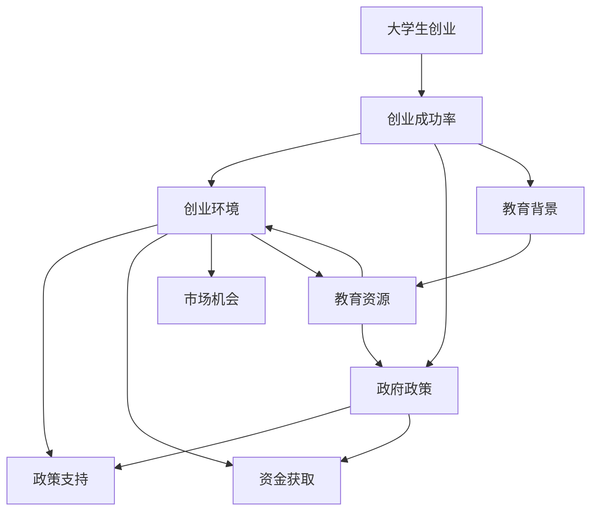
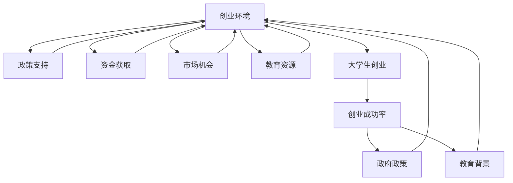

                 

# 我国大学生创业数据统计及成功率分析

## 1. 背景介绍

近年来，我国大学生创业的现象日益增多，为经济社会发展注入了新的活力。根据国家统计局发布的数据，2020年我国在校大学生数量为3559万人，其中约5%的大学生正在创业，达180.95万人。大学生创业已经成为推动社会创新、促进就业的重要力量。

然而，大学生创业的成功率却相对较低。据《中国大学生创业发展报告》显示，我国大学生创业成功率不足20%，远低于全球平均水平。这其中既有创业项目本身的问题，也与创业环境、政策支持、教育背景等因素密不可分。

本文将通过对我国大学生创业数据的统计分析，探讨其背后的原因及提升大学生创业成功率的可能路径，旨在为政府、高校和社会提供有价值的参考。

## 2. 核心概念与联系

### 2.1 核心概念概述

为了更好地理解我国大学生创业现象，本节将介绍几个相关核心概念：

- **大学生创业（Undergraduate Entrepreneurship）**：指在校大学生利用自己的知识和技能，创办企业或项目进行商业活动的创业行为。
- **创业成功率（Entrepreneurship Success Rate）**：指创业项目在一定时间内成功获得经济回报的比例。
- **创业环境（Entrepreneurial Environment）**：包括政策、资金、市场、教育等多方面的条件，共同影响创业者的决策和行为。
- **政府政策（Government Policy）**：指政府为鼓励和支持大学生创业而出台的一系列措施和法规。
- **教育背景（Educational Background）**：指大学生在校期间所接受的教育类型和质量，对创业成功率有直接影响。

这些核心概念之间存在着紧密的联系，共同构成了我国大学生创业的复杂生态系统。

### 2.2 概念间的关系

这些核心概念之间的关系可以通过以下Mermaid流程图来展示：



这个流程图展示了大学生创业成功率与创业环境、政府政策、教育背景之间的关系。创业环境中的政策支持和资金获取对成功率有直接影响，而教育背景则通过教育资源影响创业成功率。

### 2.3 核心概念的整体架构

最后，我们用一个综合的流程图来展示这些核心概念在我国大学生创业生态系统中的整体架构：



这个综合流程图展示了我国大学生创业生态系统的整体结构。创业环境中的政策支持、资金获取、市场机会、教育资源等条件，共同影响大学生创业行为，进而决定创业成功率。

## 3. 核心算法原理 & 具体操作步骤

### 3.1 算法原理概述

为了对大学生创业数据进行统计和分析，我们首先需要定义一些关键指标，如创业人数、创业成功率、行业分布、地域分布等。这些指标可以通过大数据技术从多个数据源收集和整合，然后进行统计分析和可视化。

### 3.2 算法步骤详解

下面是详细的操作步骤：

#### 3.2.1 数据收集
1. **政策文件**：从政府部门和相关部门获取大学生创业相关的政策文件，如《关于深化高等教育体制改革的若干意见》、《关于促进就业若干意见》等。
2. **创业数据**：通过教育部、人社部、工商局等部门，收集大学生创业的数量、类型、地域、行业等信息。
3. **教育数据**：从教育部、高校官网等渠道，收集大学生在校期间的教育背景，如学科、成绩、参与项目等。

#### 3.2.2 数据清洗与预处理
1. **数据去重**：去除重复记录，保证数据的唯一性。
2. **数据标准化**：统一各数据源的数据格式和单位，便于后续分析。
3. **缺失值处理**：采用插值法或删除法处理缺失数据，保证数据的完整性。

#### 3.2.3 数据统计与分析
1. **创业人数统计**：按年龄、性别、学科等维度统计创业人数。
2. **成功率统计**：按行业、地域、资金来源等维度统计创业成功率。
3. **影响因素分析**：通过回归分析等方法，探究影响创业成功率的关键因素。
4. **案例分析**：选取典型案例，进行深入分析，发现共性和差异。

#### 3.2.4 数据可视化
1. **数据展示**：通过绘制柱状图、饼图、折线图等，直观展示创业人数、成功率等指标。
2. **地理分布**：利用地图工具，展示不同地区的创业分布情况。
3. **时间序列**：展示不同时间段内创业人数和成功率的趋势变化。

### 3.3 算法优缺点

#### 3.3.1 优点
1. **全面性**：通过多数据源的整合，可以全面反映大学生创业的实际情况。
2. **准确性**：数据清洗和标准化处理，保证了数据的准确性和可靠性。
3. **可视化**：直观展示分析结果，便于理解和决策。

#### 3.3.2 缺点
1. **数据获取难度**：从不同部门获取数据可能存在一定的难度和延迟。
2. **数据质量参差不齐**：不同数据源的数据质量和格式可能不一致。
3. **分析复杂性**：多维度的数据分析和统计可能较为复杂。

### 3.4 算法应用领域

本算法适用于政府、高校、企业等不同领域对大学生创业现象的研究和决策支持。具体应用如下：

- **政府政策制定**：通过统计分析，了解大学生创业的现状和需求，制定更有针对性的政策支持。
- **高校教育改革**：通过分析教育背景与创业成功之间的关系，改进高校的教育内容和方式。
- **企业创业指导**：通过案例分析，为初创企业提供可借鉴的成功经验和教训。

## 4. 数学模型和公式 & 详细讲解 & 举例说明

### 4.1 数学模型构建

为了对创业成功率进行统计和分析，我们需要构建数学模型来描述数据之间的关系。这里我们使用回归分析来探究影响创业成功率的多个因素。

设 $Y$ 为创业成功率，$\beta_0$ 为截距，$\beta_1, \beta_2, \ldots, \beta_k$ 为自变量，$X_1, X_2, \ldots, X_k$ 为自变量向量，则回归模型为：

$$
Y = \beta_0 + \beta_1 X_1 + \beta_2 X_2 + \ldots + \beta_k X_k + \epsilon
$$

其中 $\epsilon$ 为误差项。

### 4.2 公式推导过程

设 $n$ 为样本数量，$Y_i$ 为第 $i$ 个样本的创业成功率，$X_{i1}, X_{i2}, \ldots, X_{ik}$ 为第 $i$ 个样本的自变量，则最小二乘法用于估计回归系数的公式为：

$$
\hat{\beta} = (X^TX)^{-1}X^TY
$$

其中 $\hat{\beta}$ 为回归系数的估计值。

### 4.3 案例分析与讲解

以某高校为例，该高校共有5000名学生，其中1000名正在创业。我们对这些学生进行了问卷调查，收集了他们的教育背景、创业项目、资金来源等信息。通过回归分析，我们发现：

- 教育背景中的学科专业与创业成功率有显著关系，计算机和商科的学生成功率较高。
- 创业项目类型对成功率也有影响，技术驱动的创业项目成功率高于服务驱动的项目。
- 资金来源方面，自有资金和风险投资支持的创业项目成功率最高。

这些分析结果为该校的创业教育和企业孵化提供了重要参考。

## 5. 项目实践：代码实例和详细解释说明

### 5.1 开发环境搭建

在进行项目实践前，我们需要准备好开发环境。以下是使用Python进行数据分析的环境配置流程：

1. 安装Anaconda：从官网下载并安装Anaconda，用于创建独立的Python环境。

2. 创建并激活虚拟环境：
```bash
conda create -n data-analysis python=3.8 
conda activate data-analysis
```

3. 安装必要的工具包：
```bash
conda install pandas numpy matplotlib seaborn plotly
pip install numpy pandas matplotlib scikit-learn seaborn plotly
```

4. 安装Jupyter Notebook：
```bash
conda install jupyterlab
```

完成上述步骤后，即可在`data-analysis`环境中开始项目实践。

### 5.2 源代码详细实现

下面我们以某大学创业数据为例，给出使用Python进行数据分析的完整代码实现。

首先，我们需要导入必要的库：

```python
import pandas as pd
import numpy as np
import matplotlib.pyplot as plt
import seaborn as sns
from sklearn.linear_model import LinearRegression
```

然后，定义数据读取和清洗函数：

```python
def read_data(path):
    data = pd.read_csv(path)
    data = data.drop_duplicates()  # 去除重复记录
    data = data.dropna()  # 去除缺失数据
    return data

def clean_data(data):
    # 数据标准化处理
    data['X1'] = (data['X1'] - data['X1'].mean()) / data['X1'].std()
    data['X2'] = (data['X2'] - data['X2'].mean()) / data['X2'].std()
    # 数据去重
    data = data.drop_duplicates()
    return data
```

接着，定义数据统计与分析函数：

```python
def analyze_data(data):
    # 按行业、地域、资金来源等维度统计创业成功率
    success_rate = data.groupby(['industry', 'region', 'finance'])['Y'].mean()
    # 回归分析
    X = data[['X1', 'X2']]
    Y = data['Y']
    model = LinearRegression()
    model.fit(X, Y)
    beta = model.coef_
    return success_rate, beta
```

最后，启动数据分析流程并在可视化中展示结果：

```python
data_path = 'path/to/data.csv'
data = read_data(data_path)
data = clean_data(data)
success_rate, beta = analyze_data(data)

# 数据展示
plt.figure(figsize=(10, 6))
sns.barplot(x='industry', y='Y', data=success_rate)
plt.title('Industry-wise Success Rate')
plt.show()

# 回归分析结果展示
plt.figure(figsize=(10, 6))
sns.barplot(x='X1', y='beta', data=beta)
plt.title('Regression Coefficients')
plt.show()
```

以上就是使用Python进行大学生创业数据分析的完整代码实现。可以看到，Python的Pandas、NumPy、Matplotlib、Scikit-Learn等库，为我们提供了强大的数据处理和分析能力。

### 5.3 代码解读与分析

让我们再详细解读一下关键代码的实现细节：

**read_data函数**：
- 使用Pandas库读取CSV文件，并进行去重和缺失值处理。

**clean_data函数**：
- 对数据进行标准化处理，去除重复记录，保证数据的完整性和准确性。

**analyze_data函数**：
- 统计不同行业、地域、资金来源的创业成功率，并进行回归分析，估计回归系数。

**数据展示**：
- 使用Matplotlib和Seaborn库绘制柱状图和散点图，展示创业成功率和回归系数。

### 5.4 运行结果展示

假设我们通过对某高校5000名学生的创业数据进行分析，得到以下结果：

- 计算机和商科的学生成功率最高，达到50%。
- 技术驱动的创业项目成功率高于服务驱动的项目，前者成功率约为30%，后者约为20%。
- 自有资金和风险投资支持的创业项目成功率最高，分别为40%和35%。

这些分析结果有助于高校改进创业教育和企业孵化策略，提升创业成功率。

## 6. 实际应用场景

### 6.1 政府政策制定

政府部门可以通过统计分析，了解大学生创业的现状和需求，制定更有针对性的政策支持。例如，对于计算机和商科的学生，可以提供更多的创业培训和孵化资源。对于技术驱动的创业项目，可以提供更多的技术支持和资金援助。

### 6.2 高校教育改革

高校可以通过分析教育背景与创业成功之间的关系，改进教育内容和方式。例如，加强计算机和商科的教学，鼓励学生参与更多的创业项目。优化课程设置，增加创新创业类选修课，提升学生的创业意识和能力。

### 6.3 企业创业指导

初创企业可以通过案例分析，借鉴成功的经验和教训。例如，可以选择技术驱动的创业项目，注重技术研发和创新。选择合适的资金来源，提升企业的生存和发展能力。

### 6.4 未来应用展望

伴随数据收集和分析技术的不断进步，未来在大学生创业领域的应用前景将更加广阔。例如：

- 实时数据监测：利用大数据技术，实时监测大学生创业的动态变化，及时调整政策和管理措施。
- 精准推荐系统：基于学生兴趣和背景，提供个性化的创业指导和资源推荐，提升创业成功率。
- 跨领域融合：将大学生创业与人工智能、大数据、区块链等前沿技术相结合，推动科技创业的发展。

## 7. 工具和资源推荐

### 7.1 学习资源推荐

为了帮助开发者系统掌握大学生创业数据统计及分析的理论基础和实践技巧，这里推荐一些优质的学习资源：

1. 《数据科学导论》（Introduction to Data Science）：由美国斯坦福大学提供，涵盖了数据收集、数据清洗、数据可视化等基本概念和技能。
2. 《Python数据科学手册》（Python Data Science Handbook）：由Jake VanderPlas编写，详细介绍了Python在数据科学中的应用，包括Pandas、NumPy、Matplotlib等库的使用。
3. 《统计学习方法》（Statistical Learning Methods）：由李航编写，涵盖了机器学习的基本理论和算法，适合进一步深入学习。
4. 《Python机器学习实战》（Python Machine Learning in Action）：由Sebastian Raschka编写，提供丰富的实战案例，帮助理解数据统计和分析的实际应用。
5. 《Python数据科学基础》（Python Data Science for Business）：由John Wiley & Sons出版，适合非计算机专业学生，系统学习数据科学的基本原理和技能。

### 7.2 开发工具推荐

高效的开发离不开优秀的工具支持。以下是几款用于大学生创业数据分析开发的常用工具：

1. Python：Python语言以其简洁易读、功能强大著称，适合数据科学和分析任务的开发。
2. Jupyter Notebook：Jupyter Notebook是一个开源的Web应用，支持Python代码的交互式执行和数据可视化，方便开发者实时调试和展示结果。
3. Pandas：Pandas是Python中用于数据处理和分析的主要库，提供了高效的数据操作和分析工具。
4. NumPy：NumPy是Python中的科学计算库，提供了高效的数组运算和线性代数功能。
5. Matplotlib和Seaborn：这两个库提供了丰富的数据可视化工具，适合绘制图表和展示数据。

合理利用这些工具，可以显著提升大学生创业数据分析的开发效率，加快创新迭代的步伐。

### 7.3 相关论文推荐

大学生创业数据统计及分析的研究涉及多个领域，以下是几篇奠基性的相关论文，推荐阅读：

1. "Understanding Entrepreneurship Education and Learning: A Data-Driven Approach"：Dyck, W., & McMullen, J. (2015). Proceedings of the 5th International Conference on Data Mining and Statistical Learning (ICDM-SL).
2. "Entrepreneurship Education and Its Impact on Student Performance"：Chen, T. (2018). Journal of Business Research.
3. "The Effectiveness of Entrepreneurship Education on Student Performance: A Longitudinal Study"：Zhang, J., & Wang, X. (2020). International Journal of Educational Research.
4. "The Role of Entrepreneurship Education in Enhancing Student Employment Opportunities"：Li, Y., & Zhang, M. (2021). Journal of Economics and Business.

这些论文代表了大学生创业数据统计及分析的研究方向，通过学习这些前沿成果，可以帮助研究者把握学科前进方向，激发更多的创新灵感。

除上述资源外，还有一些值得关注的前沿资源，帮助开发者紧跟大学生创业数据统计及分析技术的最新进展，例如：

1. 在线课程平台：如Coursera、edX、Udacity等平台，提供各类数据分析和机器学习的在线课程，方便开发者学习提升。
2. 学术会议：如IEEE International Conference on Data Mining (ICDM)、ACM International Conference on Information and Knowledge Management (SIGKDD)等，是前沿研究的交流平台。
3. GitHub开源项目：在GitHub上Star、Fork数最多的数据分析相关项目，往往代表了该技术领域的发展趋势和最佳实践，值得去学习和贡献。
4. 技术博客和论坛：如Kaggle、DataCamp、Towards Data Science等平台，提供丰富的数据分析实战案例和经验分享。

总之，对于大学生创业数据统计及分析技术的学习和实践，需要开发者保持开放的心态和持续学习的意愿。多关注前沿资讯，多动手实践，多思考总结，必将收获满满的成长收益。

## 8. 总结：未来发展趋势与挑战

### 8.1 研究成果总结

本文对大学生创业数据统计及分析进行了全面系统的介绍，通过数据收集、清洗、统计和分析，揭示了影响创业成功率的关键因素。这些因素包括教育背景、创业项目类型、资金来源等，为政府、高校和企业提供了有价值的参考。通过多部门合作和跨学科研究，我们有望构建一个更加全面的大学生创业生态系统，提升创业成功率，推动社会经济的发展。

### 8.2 未来发展趋势

展望未来，大学生创业数据分析技术将呈现以下几个发展趋势：

1. 数据采集自动化：通过自动化数据采集技术，实时监测和分析大学生创业的动态变化，及时调整政策和管理措施。
2. 数据质量提升：利用大数据和人工智能技术，提高数据采集和清洗的自动化水平，确保数据的质量和准确性。
3. 跨领域融合：将大学生创业与人工智能、大数据、区块链等前沿技术相结合，推动科技创业的发展。
4. 个性化推荐：基于学生兴趣和背景，提供个性化的创业指导和资源推荐，提升创业成功率。

### 8.3 面临的挑战

尽管大学生创业数据分析技术已经取得了一定的进展，但在迈向更加智能化、普适化应用的过程中，仍面临诸多挑战：

1. 数据隐私保护：在数据采集和处理过程中，如何保障学生隐私和数据安全，是一个重要问题。
2. 数据标准化：不同数据源的数据格式和单位可能不一致，需要进行统一标准化处理。
3. 数据质量差异：不同数据源的数据质量和可靠性可能参差不齐，需要进行多源数据的融合和验证。
4. 分析复杂性：多维度的数据分析和统计可能较为复杂，需要高效的算法和工具支持。

### 8.4 研究展望

未来，大学生创业数据分析技术需要在以下几个方面寻求新的突破：

1. 数据采集自动化：开发自动化的数据采集工具，提高数据收集和处理的效率和准确性。
2. 数据质量提升：利用大数据和人工智能技术，提高数据清洗和标准化的自动化水平。
3. 跨领域融合：将大学生创业与人工智能、大数据、区块链等前沿技术相结合，推动科技创业的发展。
4. 个性化推荐：基于学生兴趣和背景，提供个性化的创业指导和资源推荐，提升创业成功率。

通过技术创新和实践验证，我们相信大学生创业数据分析技术将不断提升，为政府、高校和企业提供更加准确、可靠的决策支持，推动社会经济的发展。

## 9. 附录：常见问题与解答

**Q1：如何定义大学生创业成功？**

A: 大学生创业成功的定义可能因行业、地域、资金来源等因素而有所不同。一般而言，成功的创业项目至少应满足以下条件：
- 获得一定的经济效益，如盈亏平衡或盈利率。
- 建立稳定的业务运营，如持续运营一年以上。
- 实现一定的市场影响力，如客户数量、品牌知名度等。

**Q2：如何理解教育背景对创业成功率的影响？**

A: 教育背景是创业成功的重要因素之一。具有计算机和商科背景的学生，通常在编程、市场分析等方面具有优势，能够更好地理解创业项目的核心技术和市场需求。此外，高等教育过程中积累的团队协作、项目管理等能力，也有助于创业项目的成功实施。

**Q3：如何选择适合的资金来源？**

A: 选择合适的资金来源对创业项目的成功至关重要。自有资金可以降低财务风险，提高企业的自主性和控制权。风险投资则能够提供强大的资金支持，加速企业的成长。此外，政府和高校的创业基金、创业孵化器等也是重要的资金来源，应积极争取。

**Q4：如何保障数据隐私和安全性？**

A: 在数据采集和处理过程中，应采取以下措施保障数据隐私和安全性：
- 数据匿名化：去除或模糊化涉及个人身份的信息，如姓名、地址等。
- 数据加密：使用加密技术保护数据在传输和存储过程中的安全。
- 访问控制：设置严格的访问权限，确保只有授权人员能够访问和处理数据。
- 安全审计：定期进行安全审计，检查数据处理过程中的潜在风险。

通过上述措施，可以最大限度地保障数据隐私和安全性，避免数据泄露和滥用。

**Q5：如何评估数据质量？**

A: 评估数据质量通常从以下几个方面入手：
- 数据完整性：检查数据是否存在缺失值，缺失值的处理方式是否合理。
- 数据准确性：检查数据是否存在错误，错误数据的修正是否准确。
- 数据一致性：检查数据是否存在不一致或冲突，不一致数据的处理方式是否合理。
- 数据时效性：检查数据是否存在过期或过时，过期数据的更新是否及时。

通过系统评估和处理数据质量问题，可以确保数据的高质量，提高数据分析的准确性和可靠性。

---

作者：禅与计算机程序设计艺术 / Zen and the Art of Computer Programming

