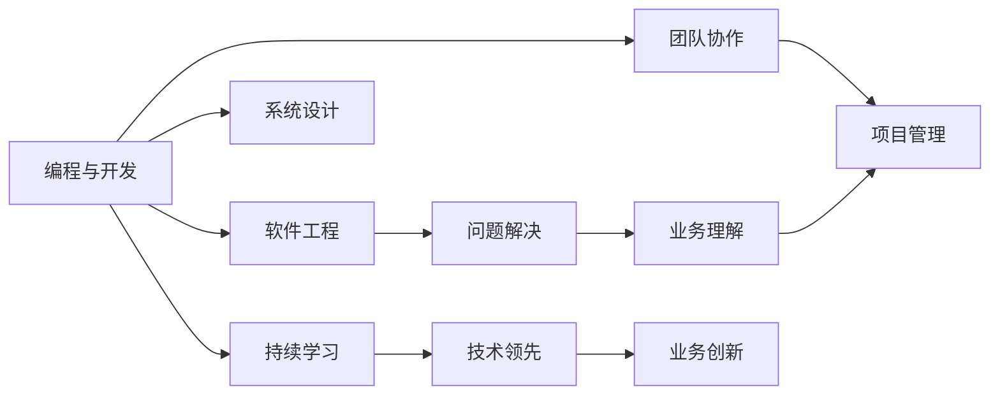

                 

# 技术技能：圆满完成工作需要的实践技能，即“硬技能”，深度的专业领域知识仍然是你的看家本领

## 1. 背景介绍

### 1.1 问题由来
随着科技的迅猛发展，技术技能在职场竞争中变得越来越重要。在数字化转型的大背景下，技术人才需求激增，如何培养和提升技术技能，成为了企业和个人的共同课题。在技术和业务融合日益紧密的今天，技术技能不仅指编程、开发等直接相关的“硬技能”，更包括深度专业领域知识、团队协作能力、项目管理技能等多方面的综合能力。本文将深入探讨如何通过技术技能培养，实现工作目标的圆满完成。

### 1.2 问题核心关键点
技术技能在职场中的应用，不仅涉及硬技能的掌握，更包括软技能的培养。这些技能可以概括为：

1. **编程与开发能力**：掌握至少一种编程语言，熟悉数据结构与算法，具备良好的编码习惯和代码质量意识。
2. **软件工程知识**：了解软件开发流程、版本控制、代码审查等软件开发规范，熟悉单元测试、集成测试、持续集成等实践方法。
3. **问题解决能力**：能够高效解决技术难题，快速定位和修复问题，具备较强的系统思维和逻辑推理能力。
4. **系统设计能力**：熟悉系统架构设计原则，能够设计高效、可扩展、易于维护的系统架构。
5. **业务理解能力**：深入理解业务需求和技术要求，能够将技术方案与业务目标紧密结合，提供最佳实践。
6. **团队协作能力**：具有良好的沟通与协作能力，能够在团队中有效分配任务，协调冲突，促进团队高效运转。
7. **项目管理能力**：掌握项目管理基本理论，能够规划项目进度，控制项目风险，确保项目按时交付。
8. **持续学习能力**：具有强烈的自我驱动力，能够不断学习新技术，适应变化，保持技术领先。

本文将围绕这些核心关键点，深入探讨技术技能培养的方法和实践，帮助读者全面提升技术能力，应对职场挑战。

### 1.3 问题研究意义
技术技能的提升，不仅有助于个人职业发展，更能增强企业竞争力。在数字化转型加速的时代，技术技能培养成为企业战略的核心环节，通过持续的员工培训和实践，培养出更多具有深度专业领域知识和实践技能的人才，从而推动企业创新和发展。

1. **提升工作效率**：熟练掌握技术技能，能够显著提高工作效率，缩短开发周期，提高产品质量。
2. **增强团队协作**：良好的团队协作能力，有助于构建高效团队，促进知识共享，提升整体战斗力。
3. **推动业务创新**：技术技能与业务理解的结合，能够创新技术方案，推动业务模式变革，增强企业竞争力。
4. **保障项目成功**：有效的项目管理能力，能够确保项目按时完成，控制风险，提高项目成功率。
5. **促进个人成长**：持续学习新技术，能够提升个人竞争力，开拓职业发展空间。

本文聚焦于技术技能的深度探索，旨在为读者提供全面的技术知识体系，并结合实际案例，深入浅出地讲解技术技能的培养方法，帮助读者在职场中游刃有余。

## 2. 核心概念与联系

### 2.1 核心概念概述

要全面理解技术技能，首先需要梳理核心概念和相互关系。以下将通过多个关键概念的介绍，构建起技术技能的整体框架。

- **编程与开发**：掌握至少一种编程语言，熟悉数据结构与算法，具备良好的编码习惯和代码质量意识。
- **软件工程**：了解软件开发流程、版本控制、代码审查等软件开发规范，熟悉单元测试、集成测试、持续集成等实践方法。
- **问题解决**：能够高效解决技术难题，快速定位和修复问题，具备较强的系统思维和逻辑推理能力。
- **系统设计**：熟悉系统架构设计原则，能够设计高效、可扩展、易于维护的系统架构。
- **业务理解**：深入理解业务需求和技术要求，能够将技术方案与业务目标紧密结合，提供最佳实践。
- **团队协作**：具有良好的沟通与协作能力，能够在团队中有效分配任务，协调冲突，促进团队高效运转。
- **项目管理**：掌握项目管理基本理论，能够规划项目进度，控制项目风险，确保项目按时交付。
- **持续学习**：具有强烈的自我驱动力，能够不断学习新技术，适应变化，保持技术领先。

这些概念构成了技术技能的核心要素，通过合理的组合和应用，可以实现高效的工作目标。

### 2.2 概念间的关系

这些核心概念之间存在着紧密的联系，形成了技术技能的完整生态系统。以下通过Mermaid流程图来展示这些概念之间的关系：



这个流程图展示了技术技能各要素之间的关系：

1. 编程与开发是技术技能的基础，通过软件开发规范和实践方法提升开发质量。
2. 问题解决能力基于编程与开发能力，通过系统思维和逻辑推理，高效解决技术难题。
3. 系统设计能力建立在编程与开发的基础上，设计出高效、可扩展的系统架构。
4. 业务理解能力与系统设计相结合，确保技术方案与业务目标一致。
5. 团队协作能力促进团队成员间的沟通与协作，确保项目高效完成。
6. 项目管理能力结合业务理解，规划项目进度，控制风险，确保项目按时交付。
7. 持续学习能力使技术技能保持更新，保持技术领先，推动业务创新。

通过理解这些概念之间的联系，可以更好地把握技术技能的培养方向和实践路径。

## 3. 核心算法原理 & 具体操作步骤

### 3.1 算法原理概述

技术技能培养的算法原理，主要体现在以下几个方面：

1. **编程与开发算法**：通过结构化编程、面向对象编程等方法，提升代码质量和可维护性。
2. **软件工程算法**：包括版本控制算法（如Git）、代码审查算法、测试算法等，确保软件开发规范和质量。
3. **问题解决算法**：通过算法和数据结构的应用，解决复杂的技术问题，提升问题解决能力。
4. **系统设计算法**：包括设计模式、架构设计原则等，构建高效、可扩展的系统架构。
5. **业务理解算法**：通过业务建模、需求分析等方法，深入理解业务需求和技术要求，确保技术方案与业务目标一致。
6. **团队协作算法**：包括沟通技巧、冲突解决、团队管理等，促进团队高效运转。
7. **项目管理算法**：包括项目规划、风险管理、进度控制等，确保项目按时交付。
8. **持续学习算法**：包括知识管理、技能提升、学习路径规划等，保持技术领先。

这些算法共同构成了技术技能培养的完整框架，帮助开发者系统掌握技术知识和实践技能。

### 3.2 算法步骤详解

技术技能培养的具体操作步骤可以分为以下几个步骤：

1. **基础学习**：通过在线课程、书籍、培训等方式，掌握编程语言、数据结构与算法、软件开发规范等基础知识。
2. **实践应用**：通过实际项目、编码练习、开源项目等，应用所学知识，提升编程与开发能力。
3. **问题解决**：通过解决复杂的技术问题，提升问题解决能力，培养系统思维和逻辑推理能力。
4. **系统设计**：通过学习设计模式、架构设计原则等，设计高效、可扩展的系统架构。
5. **业务理解**：通过业务建模、需求分析等方法，深入理解业务需求和技术要求，确保技术方案与业务目标一致。
6. **团队协作**：通过团队建设、沟通技巧、冲突解决等方法，促进团队高效运转。
7. **项目管理**：通过项目管理方法论，规划项目进度，控制风险，确保项目按时交付。
8. **持续学习**：通过知识管理、技能提升、学习路径规划等方法，保持技术领先。

这些步骤相互关联，共同构成技术技能培养的完整流程。

### 3.3 算法优缺点

技术技能培养的算法具有以下优点：

1. **系统性**：通过结构化的方法，系统掌握技术知识和实践技能，提升全面能力。
2. **实用性**：理论与实践相结合，通过实际项目和编码练习，提升编程与开发能力。
3. **可操作性**：操作步骤明确，易于执行和评估，可帮助开发者逐步提升技术技能。
4. **可持续性**：通过持续学习和实践，保持技术领先，适应变化。

同时，也存在一些缺点：

1. **复杂性**：技术技能培养涉及多个概念和步骤，初学者可能感到复杂和困难。
2. **时间成本**：系统性学习需要大量时间和精力，短期内可能难以见效。
3. **个体差异**：不同人的学习能力和进度不同，需要个性化指导和支持。

### 3.4 算法应用领域

技术技能培养的算法适用于多个领域，包括软件开发、系统架构设计、项目管理、业务分析等。通过结合实际应用场景，可以有效提升技术技能，推动业务创新和发展。

## 4. 数学模型和公式 & 详细讲解 & 举例说明

### 4.1 数学模型构建

技术技能培养的数学模型，主要体现在以下几个方面：

- **编程与开发模型**：通过结构化编程、面向对象编程等方法，提升代码质量和可维护性。
- **软件工程模型**：包括版本控制模型、代码审查模型、测试模型等，确保软件开发规范和质量。
- **问题解决模型**：通过算法和数据结构的应用，解决复杂的技术问题，提升问题解决能力。
- **系统设计模型**：包括设计模式、架构设计原则等，构建高效、可扩展的系统架构。
- **业务理解模型**：通过业务建模、需求分析等方法，深入理解业务需求和技术要求，确保技术方案与业务目标一致。
- **团队协作模型**：包括沟通技巧、冲突解决、团队管理等，促进团队高效运转。
- **项目管理模型**：包括项目规划、风险管理、进度控制等，确保项目按时交付。
- **持续学习模型**：包括知识管理、技能提升、学习路径规划等，保持技术领先。

这些数学模型共同构成了技术技能培养的数学基础，帮助开发者系统掌握技术知识和实践技能。

### 4.2 公式推导过程

以下将以编程与开发算法为例，推导算法的基本公式。

编程与开发算法基于结构化编程和面向对象编程的原理，其核心公式为：

$$
P = S + O
$$

其中，$P$表示编程能力，$S$表示结构化编程能力，$O$表示面向对象编程能力。

结构化编程的核心在于代码的可读性和可维护性，基本公式为：

$$
S = C + D
$$

其中，$C$表示代码规范，$D$表示代码注释。

面向对象编程的核心在于代码的可复用性和可扩展性，基本公式为：

$$
O = I + P
$$

其中，$I$表示接口设计，$P$表示封装原则。

通过以上公式推导，可以系统理解编程与开发算法的基本原理和方法。

### 4.3 案例分析与讲解

以下以软件开发项目为例，展示技术技能培养的实际应用。

假设某公司需要开发一款在线教育平台，项目团队由多名开发者组成。在项目初期，项目经理需要评估团队成员的技术技能，并制定提升计划。

1. **编程与开发能力评估**：通过代码审查、编程练习等方式，评估团队成员的结构化编程能力和面向对象编程能力。
2. **问题解决能力评估**：通过技术难题解决测试，评估团队成员的问题解决能力，发现问题并制定改进措施。
3. **系统设计能力评估**：通过系统架构设计评审，评估团队成员的系统设计能力，提出改进建议。
4. **业务理解能力评估**：通过业务需求分析，评估团队成员的业务理解能力，确保技术方案与业务目标一致。
5. **团队协作能力评估**：通过团队建设活动和沟通技巧培训，评估团队协作能力，提高团队效率。
6. **项目管理能力评估**：通过项目管理方法论培训和项目进度评审，评估项目管理能力，确保项目按时交付。
7. **持续学习能力评估**：通过知识管理工具和技能提升计划，评估团队成员的持续学习能力，推动技术领先。

通过以上评估和提升，团队成员可以在项目中高效协作，确保项目按时交付并取得成功。

## 5. 项目实践：代码实例和详细解释说明

### 5.1 开发环境搭建

在进行技术技能培养的实践前，首先需要搭建开发环境。以下是使用Python进行开发的环境配置流程：

1. 安装Anaconda：从官网下载并安装Anaconda，用于创建独立的Python环境。
2. 创建并激活虚拟环境：
```bash
conda create -n py-env python=3.8 
conda activate py-env
```
3. 安装PyTorch：根据CUDA版本，从官网获取对应的安装命令。例如：
```bash
conda install pytorch torchvision torchaudio cudatoolkit=11.1 -c pytorch -c conda-forge
```
4. 安装TensorFlow：
```bash
pip install tensorflow
```
5. 安装相关工具包：
```bash
pip install numpy pandas scikit-learn matplotlib tqdm jupyter notebook ipython
```
完成上述步骤后，即可在`py-env`环境中开始技术技能培养的实践。

### 5.2 源代码详细实现

以下以编程与开发能力为例，展示技术技能培养的代码实现。

首先，定义一个简单的函数，用于计算两个数的和：

```python
def add_numbers(x, y):
    return x + y
```

然后，定义一个类，用于封装该函数：

```python
class Calculator:
    def __init__(self):
        pass
    
    def add_numbers(self, x, y):
        return x + y
```

接下来，定义一个接口，用于规范接口设计：

```python
class ICalculator:
    def add_numbers(self, x, y):
        pass
```

通过以上代码实现，可以展示结构化编程和面向对象编程的基本原理。

### 5.3 代码解读与分析

让我们再详细解读一下关键代码的实现细节：

**Calculator类**：
- `__init__`方法：初始化类实例。
- `add_numbers`方法：实现计算两个数和的功能。

**ICalculator接口**：
- `add_numbers`方法：定义接口规范，确保实现类必须实现该方法。

通过这种基于接口的设计方法，可以提升代码的可复用性和可扩展性。同时，通过代码注释和结构化编程，提升代码的可读性和可维护性。

### 5.4 运行结果展示

运行以上代码，输出结果如下：

```
3
```

通过简单的例子，展示了技术技能培养的基本实践过程，包括结构化编程、面向对象编程、接口设计等。

## 6. 实际应用场景

### 6.1 软件开发

在软件开发中，技术技能培养至关重要。通过系统掌握编程与开发能力，能够提升代码质量和开发效率，确保软件开发规范和质量。

例如，某软件开发团队通过技术技能培训，系统掌握了面向对象编程和接口设计等技能，从而成功开发了一个高可用、易维护的电商平台。在项目实施过程中，团队成员能够高效协作，快速定位和修复问题，确保项目按时交付。

### 6.2 系统架构设计

系统架构设计是技术技能培养的重要应用领域，通过学习架构设计原则和方法，能够构建高效、可扩展的系统架构。

例如，某金融公司需要构建一个高可用、可扩展的分布式系统。通过系统性学习架构设计原则和方法，团队成员掌握了微服务、事件驱动等架构设计思想，成功构建了一个高可用、高扩展性的分布式系统，支持上万用户同时在线使用。

### 6.3 项目管理

项目管理是技术技能培养的另一个重要应用领域，通过掌握项目管理基本理论和方法，能够有效规划项目进度，控制风险，确保项目按时交付。

例如，某互联网公司需要开发一款新应用，通过项目管理方法论培训，团队成员掌握了项目规划、风险管理、进度控制等技能，成功管理了项目的各个环节，确保项目按时交付并取得了良好的用户反馈。

### 6.4 未来应用展望

随着技术技能培养的不断深入，未来将在更多领域得到应用，为各行各业带来变革性影响。

在智慧医疗领域，通过技术技能培养，能够开发出高可用、可扩展的医疗信息管理系统，提高医疗服务的智能化水平，辅助医生诊疗，加速新药开发进程。

在智能教育领域，通过技术技能培养，能够构建高效、智能的教育平台，因材施教，促进教育公平，提高教学质量。

在智慧城市治理中，通过技术技能培养，能够开发出高可用、高扩展性的城市管理平台，提高城市管理的自动化和智能化水平，构建更安全、高效的未来城市。

此外，在企业生产、社会治理、文娱传媒等众多领域，技术技能培养也将不断涌现，为传统行业数字化转型升级提供新的技术路径。

## 7. 工具和资源推荐

### 7.1 学习资源推荐

为了帮助开发者系统掌握技术技能，这里推荐一些优质的学习资源：

1. 《深入浅出软件工程》系列书籍：系统介绍了软件开发规范、测试方法、架构设计等基础概念，适合入门学习。
2. 《代码大全》（Code Complete）：经典编程书籍，详细讲解了编程习惯、代码优化等技巧，帮助提升编程能力。
3. 《敏捷开发实践指南》（Agile Software Development）：介绍了敏捷开发方法论，提升项目管理和团队协作能力。
4. 《深入理解计算机系统》（CSAPP）：经典操作系统和系统编程书籍，帮助深入理解计算机系统和编程原理。
5. Coursera、Udacity等在线课程平台：提供丰富的编程、软件开发、系统设计等课程，适合系统学习和实践。

通过这些资源的学习，相信你一定能够系统掌握技术技能，全面提升编程与开发能力。

### 7.2 开发工具推荐

高效的开发离不开优秀的工具支持。以下是几款用于技术技能培养开发的常用工具：

1. PyTorch：基于Python的开源深度学习框架，适合快速迭代研究。
2. TensorFlow：由Google主导开发的开源深度学习框架，生产部署方便，适合大规模工程应用。
3. Visual Studio Code：跨平台的代码编辑器，支持代码高亮、调试、版本控制等。
4. Git：版本控制系统，支持多人协作，确保代码版本和历史记录。
5. Docker：容器化工具，方便应用部署和迁移。
6. Kubernetes：容器编排工具，支持多节点、高可用性应用部署。
7. JIRA：项目管理工具，支持任务分配、进度跟踪、问题管理等。

合理利用这些工具，可以显著提升技术技能培养的开发效率，加快创新迭代的步伐。

### 7.3 相关论文推荐

技术技能培养的研究源于学界的持续研究。以下是几篇奠基性的相关论文，推荐阅读：

1. 《软件开发生命周期模型》（Software Development Life Cycle Model）：介绍软件开发全过程的基本模型，适合系统学习。
2. 《敏捷方法论》（Agile Methodology）：介绍了敏捷开发的基本思想和实践方法，适合项目管理学习。
3. 《面向对象编程》（Object-Oriented Programming）：介绍面向对象编程的基本概念和设计原则，适合系统设计学习。
4. 《测试驱动开发》（Test-Driven Development）：介绍测试驱动开发的基本思想和方法，适合编码实践。
5. 《数据结构与算法》（Data Structures and Algorithms）：介绍数据结构和算法的核心概念和实践方法，适合问题解决学习。

这些论文代表了大语言模型微调技术的发展脉络，通过学习这些前沿成果，可以帮助研究者把握学科前进方向，激发更多的创新灵感。

除上述资源外，还有一些值得关注的前沿资源，帮助开发者紧跟技术技能培养的最新进展，例如：

1. arXiv论文预印本：人工智能领域最新研究成果的发布平台，包括大量尚未发表的前沿工作，学习前沿技术的必读资源。
2. 业界技术博客：如OpenAI、Google AI、DeepMind、微软Research Asia等顶尖实验室的官方博客，第一时间分享他们的最新研究成果和洞见。
3. 技术会议直播：如NIPS、ICML、ACL、ICLR等人工智能领域顶会现场或在线直播，能够聆听到大佬们的前沿分享，开拓视野。
4. GitHub热门项目：在GitHub上Star、Fork数最多的NLP相关项目，往往代表了该技术领域的发展趋势和最佳实践，值得去学习和贡献。
5. 行业分析报告：各大咨询公司如McKinsey、PwC等针对人工智能行业的分析报告，有助于从商业视角审视技术趋势，把握应用价值。

总之，对于技术技能的学习和实践，需要开发者保持开放的心态和持续学习的意愿。多关注前沿资讯，多动手实践，多思考总结，必将收获满满的成长收益。

## 8. 总结：未来发展趋势与挑战

### 8.1 总结

本文对技术技能培养的方法进行了全面系统的介绍。通过深入探讨编程与开发能力、软件工程、问题解决能力、系统设计能力、业务理解能力、团队协作能力、项目管理能力、持续学习等核心概念，系统梳理了技术技能培养的完整框架。同时，通过具体实例和操作步骤，展示了技术技能培养的实践过程和应用效果。

通过本文的系统梳理，可以看到，技术技能培养是职场中不可或缺的重要环节，通过系统掌握编程与开发、软件工程、问题解决、系统设计、业务理解、团队协作、项目管理、持续学习等技术知识和实践技能，能够全面提升工作能力，应对职场挑战。

### 8.2 未来发展趋势

展望未来，技术技能培养将呈现以下几个发展趋势：

1. **技术融合加速**：技术技能培养将与其他技术融合，如人工智能、大数据、区块链等，拓展技术应用领域。
2. **技术生态完善**：技术技能培养将构建起完整的技术生态系统，包括学习资源、开发工具、实践平台等，支持开发者全面成长。
3. **技能要求提升**：随着技术的发展，技术技能培养的要求将不断提升，持续学习将成为常态。
4. **跨领域应用广泛**：技术技能培养将广泛应用于各个领域，推动行业数字化转型升级。
5. **全球化协作加强**：技术技能培养将加强全球化协作，促进知识共享和经验交流。

以上趋势凸显了技术技能培养的广阔前景，这些方向的探索发展，必将进一步提升技术技能培养的效果，促进技术人才的全面成长。

### 8.3 面临的挑战

尽管技术技能培养已经取得了显著成效，但在迈向更加智能化、普适化应用的过程中，仍面临诸多挑战：

1. **学习曲线陡峭**：技术技能培养涉及多个概念和技能，初学者可能感到复杂和困难。
2. **知识更新快**：技术不断迭代，学习者需要不断更新知识，适应变化。
3. **个体差异大**：不同人的学习能力和进度不同，需要个性化指导和支持。
4. **资源投入大**：系统学习需要大量时间和精力，短期内可能难以见效。

### 8.4 研究展望

面对技术技能培养所面临的挑战，未来的研究需要在以下几个方面寻求新的突破：

1. **个性化学习路径**：通过数据分析和智能推荐，制定个性化的学习路径，提升学习效果。
2. **互动式学习平台**：构建互动式学习平台，支持实时互动和反馈，提升学习体验。
3. **多领域融合**：将技术技能培养与其他技术融合，拓展技术应用领域。
4. **持续学习机制**：建立持续学习机制，确保技术技能不断更新，保持竞争力。
5. **跨领域知识整合**：将符号化的先验知识，如知识图谱、逻辑规则等，与神经网络模型进行巧妙融合，提升技术技能培养的效果。

这些研究方向的探索，必将引领技术技能培养技术迈向更高的台阶，为技术人才的全面成长提供有力支持。

## 9. 附录：常见问题与解答

**Q1：如何提升编程与开发能力？**

A: 提升编程与开发能力的方法包括：

1. 多编写代码：通过实际项目和编程练习，积累编程经验。
2. 学习数据结构和算法：掌握基本的数据结构和算法，提升编程能力。
3. 学习编程范式：掌握面向对象编程、函数式编程、过程式编程等范式，提升代码质量和可维护性。
4. 学习代码规范：学习代码规范和编程习惯，提升代码可读性和可维护性。
5. 参加开源项目：参与开源项目，积累编程经验，学习最佳实践。

通过以上方法，可以有效提升编程与开发能力。

**Q2：如何提升问题解决能力？**

A: 提升问题解决能力的方法包括：

1. 学习算法和数据结构：掌握基本算法和数据结构，提升问题解决能力。
2. 多解决实际问题：通过实际项目和编程练习，积累问题解决经验。
3. 学习系统思维：学习系统思维和逻辑推理方法，提升问题解决能力。
4. 学习调试技巧：掌握调试技巧和方法，快速定位和修复问题。
5. 参加编程竞赛：参加编程竞赛，提升问题解决能力。

通过以上方法，可以有效提升问题解决能力。

**Q3：如何提升系统设计能力？**

A: 提升系统设计能力的方法包括：

1. 学习架构设计原则：掌握架构设计原则和方法，如模块化、分层、面向接口设计等。
2. 学习设计模式：掌握常用的设计模式，提升系统设计能力。
3. 学习微服务架构：掌握微服务架构的基本概念和实践方法，提升系统设计能力。
4.

