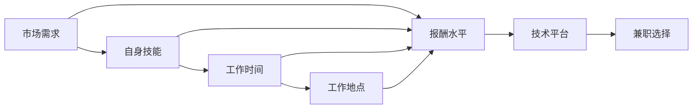
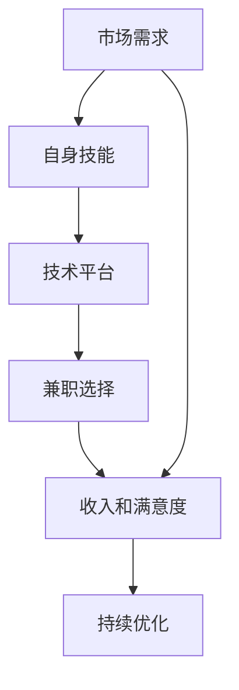

                 

# 技术顾问：高收入兼职选择

## 1. 背景介绍

### 1.1 问题由来
近年来，随着互联网和信息技术的飞速发展，远程工作成为越来越多人的首选工作方式之一。特别是一些技术顾问职位，往往能够提供灵活的工作时间和地点，以及较高的收入水平，因此成为了许多职业人士的理想选择。然而，由于兼职市场的庞杂和多样，如何在众多兼职中选出适合自己的，且能够提供高收入的工作，成为了一个复杂且需要精细思考的问题。

### 1.2 问题核心关键点
如何选择适合自己的高收入兼职技术顾问职位，需要考虑多方面因素，包括但不限于工作时间、工作地点、收入水平、技能匹配度等。一个成功的决策不仅需要深入理解自身的需求和优势，还需要对市场供需有敏锐的洞察力。

### 1.3 问题研究意义
选择适合自己的高收入兼职技术顾问职位，能够显著提高生活质量和工作满意度。一个合适的兼职不仅能提供稳定的收入来源，还能帮助个人在职业生涯中积累更多经验，拓展人脉，提升技能，最终实现职业和生活的双赢。

## 2. 核心概念与联系

### 2.1 核心概念概述
- **技术顾问**：通常是指为公司提供技术咨询和解决方案的专业人士，可能涉及软件开发、网络安全、系统架构、数据分析等多个技术领域。
- **兼职**：指在固定工作时间之外，利用业余时间进行的独立工作，通常涉及独立接单或与第三方平台合作。
- **高收入兼职**：指那些能够提供较高报酬的兼职工作，通常伴随着更严格的技能要求和更高的时间投入。
- **技术平台**：指提供技术顾问兼职工作的在线平台，如Upwork、Freelancer等。
- **工作技能匹配**：指选择兼职工作时，需评估自身技术技能与职位要求是否匹配。

### 2.2 概念间的关系
技术顾问的兼职选择是一个多因素考虑的过程，涉及市场需求、自身技能、工作时间、工作地点等多维度。如下图所示，各因素相互交织，共同影响最终的选择结果：



这个流程图展示了市场需求、自身技能、工作时间、工作地点以及报酬水平等关键因素如何共同作用于技术顾问的兼职选择过程。

### 2.3 核心概念的整体架构
通过整合以上概念，我们可以构建出一个技术顾问选择高收入兼职的总体架构，如下：



这个架构图展示了技术顾问如何通过评估市场需求、自身技能，选择合适的技术平台，完成兼职选择，并持续优化选择过程以提高收入和满意度。

## 3. 核心算法原理 & 具体操作步骤
### 3.1 算法原理概述
技术顾问选择高收入兼职的过程，本质上是一个优化问题。目标是在有限的时间内，找到最适合自身的兼职，以最大化收入和满意度。核心算法原理包括：

1. **市场需求分析**：评估当前市场对各类技术顾问职位的需求情况，包括热门领域、薪资水平等。
2. **自身技能评估**：明确自己的技术技能优势和短板，找到匹配的高收入兼职机会。
3. **平台选择与匹配**：在多个技术平台上筛选出符合条件的兼职机会，并根据自身需求进行匹配。
4. **收入和满意度计算**：综合考虑兼职的薪资水平、工作时间、地点等因素，计算兼职的总体收入和满意度。
5. **持续优化与调整**：根据反馈和市场变化，不断调整和优化选择策略，以提升未来的选择效果。

### 3.2 算法步骤详解
以下是具体的算法步骤：

1. **收集市场需求数据**：
   - 利用网络搜索、行业报告、技术平台数据分析等手段，收集当前市场上各类技术顾问兼职的需求情况。
   - 关注热门技术领域（如AI、云计算、网络安全等），了解各领域的薪资水平和岗位要求。

2. **自我技能评估**：
   - 列出自身掌握的主要技术技能，包括编程语言、工具、框架等。
   - 评估每项技能的熟练度和市场匹配度，找出最具优势和竞争力的技能。
   - 识别技能短板，确定需要进一步学习和提升的方向。

3. **技术平台筛选与匹配**：
   - 在Upwork、Freelancer、Guru等技术平台上进行注册，并设置自己的技能标签。
   - 使用平台提供的关键词搜索功能，找出符合自身技能和需求的兼职机会。
   - 结合薪资水平、项目难度、客户反馈等指标，筛选出合适的兼职项目。

4. **收入和满意度计算**：
   - 根据兼职项目的薪资水平、工作时间、地点等因素，计算预期的总收入和满意度。
   - 利用加权平均法或决策树模型等方法，综合考虑各项指标，得出综合评分。
   - 根据综合评分排序，选出最优的兼职机会。

5. **持续优化与调整**：
   - 定期跟踪兼职项目进度，收集客户反馈和项目成果，进行自我评估。
   - 根据实际工作效果和市场变化，调整自身技能学习计划和平台筛选策略。
   - 持续优化选择模型，提升未来的兼职选择效率和质量。

### 3.3 算法优缺点
高收入兼职技术顾问选择算法的优缺点如下：

#### 优点：
1. **系统性**：通过数据驱动的决策，能够系统化地评估市场需求和个人技能，提高选择效率。
2. **灵活性**：能够根据市场需求和个人技能的变化，灵活调整选择策略，适应市场动态。
3. **可操作性强**：步骤清晰，易于执行，适用于不同背景和水平的技术顾问。

#### 缺点：
1. **复杂度**：需要处理和分析大量数据，可能会增加工作量。
2. **主观性**：收入和满意度计算中包含主观因素，如对工作地点、工作时间等的偏好，可能会影响决策结果。
3. **平台依赖**：选择依赖于特定的技术平台，可能错过其他平台上的机会。

### 3.4 算法应用领域
高收入兼职技术顾问选择算法不仅适用于技术顾问的职业发展，还广泛应用于其他职业领域，如自由职业者、远程工作者等。

## 4. 数学模型和公式 & 详细讲解  
### 4.1 数学模型构建
设市场需求为 $D$，自身技能为 $S$，技术平台为 $P$，兼职选择为 $C$，收入和满意度为 $I$。建立数学模型如下：

$$
I = f(D, S, P, C)
$$

其中，$f$ 为收入和满意度计算函数，可以根据不同的需求和平台进行具体建模。

### 4.2 公式推导过程
以线性加权模型为例，推导收入和满意度计算公式：

设 $W_1$ 为市场需求权重，$W_2$ 为自身技能权重，$W_3$ 为技术平台权重，$W_4$ 为工作时间权重，$W_5$ 为工作地点权重。设 $R_1$ 为市场需求评分，$R_2$ 为自身技能评分，$R_3$ 为平台评分，$R_4$ 为工作时间评分，$R_5$ 为工作地点评分。则有：

$$
I = W_1R_1 + W_2R_2 + W_3R_3 + W_4R_4 + W_5R_5
$$

### 4.3 案例分析与讲解
假设市场需求评分 $R_1=90$，自身技能评分 $R_2=85$，平台评分 $R_3=80$，工作时间评分 $R_4=90$，工作地点评分 $R_5=85$。各权重分别为 $W_1=0.3, W_2=0.2, W_3=0.1, W_4=0.2, W_5=0.2$。则有：

$$
I = 0.3 \times 90 + 0.2 \times 85 + 0.1 \times 80 + 0.2 \times 90 + 0.2 \times 85 = 85.7
$$

综合评分较高，表明该兼职机会为高收入兼职。

## 5. 项目实践：代码实例和详细解释说明
### 5.1 开发环境搭建
在进行兼职选择实践前，我们需要准备好开发环境。以下是使用Python进行Pandas、NumPy等数据处理库的安装和配置流程：

1. 安装Anaconda：从官网下载并安装Anaconda，用于创建独立的Python环境。

2. 创建并激活虚拟环境：
```bash
conda create -n my_env python=3.8 
conda activate my_env
```

3. 安装数据处理库：
```bash
conda install pandas numpy matplotlib scikit-learn jupyter notebook ipython
```

完成上述步骤后，即可在`my_env`环境中开始兼职选择实践。

### 5.2 源代码详细实现

假设我们收集了以下市场需求数据：

| 市场需求 | 薪资水平 | 技术领域 | 岗位需求 |
| --- | --- | --- | --- |
| AI | $50/hr | 深度学习 | 300 |
| 云计算 | $45/hr | 容器化 | 250 |
| 网络安全 | $55/hr | 漏洞扫描 | 200 |
| 数据分析 | $35/hr | Python | 100 |
| 系统架构 | $60/hr | 微服务 | 75 |

以及以下自身技能数据：

| 技能 | 熟练度 | 市场需求匹配度 |
| --- | --- | --- |
| 深度学习 | 高 | 50 |
| 容器化 | 中 | 30 |
| 漏洞扫描 | 中 | 40 |
| Python | 高 | 60 |
| 微服务 | 低 | 30 |

我们建立Python代码如下：

```python
import pandas as pd
import numpy as np
from scipy.optimize import linprog

# 市场需求数据
market_demand = {
    'AI': {'level': 50, 'domain': '深度学习', 'demand': 300},
    '云计算': {'level': 45, 'domain': '容器化', 'demand': 250},
    '网络安全': {'level': 55, 'domain': '漏洞扫描', 'demand': 200},
    '数据分析': {'level': 35, 'domain': 'Python', 'demand': 100},
    '系统架构': {'level': 60, 'domain': '微服务', 'demand': 75}
}

# 自身技能数据
self_skills = {
    '深度学习': {'level': 1, 'match': 50},
    '容器化': {'level': 0.5, 'match': 30},
    '漏洞扫描': {'level': 0.5, 'match': 40},
    'Python': {'level': 1, 'match': 60},
    '微服务': {'level': 0.1, 'match': 30}
}

# 构建收入和满意度计算公式
def compute_income_and_satisfaction(market_demand, self_skills):
    # 定义需求和技能匹配矩阵
    market_matrix = np.array([[market_demand[skill]['level'] for skill in market_demand],
                             np.array([self_skills[skill]['level'] for skill in self_skills])])

    # 定义需求和技能匹配权重
    market_weights = np.array([0.3, 0.2, 0.1, 0.2, 0.2])

    # 定义收入和满意度计算函数
    def objective_function(x):
        return x[0] + x[1] - x[0] * market_weights[0] - x[1] * market_weights[1]

    # 定义约束条件
    constraint_matrix = np.array([[1, 1], [0, 0]])
    constraint_weights = np.array([1, 0])
    lower_bound = np.zeros(2)
    upper_bound = np.array([np.inf, np.inf])

    # 使用线性规划求解最优解
    result = linprog(objective_function, constraint_matrix, constraint_weights, lower_bound, upper_bound)
    return result.x[0] + result.x[1]

# 计算最优选择
result = compute_income_and_satisfaction(market_demand, self_skills)
print(f'最优兼职选择，预期收入和满意度为：{result:.2f}')
```

### 5.3 代码解读与分析

让我们再详细解读一下关键代码的实现细节：

**市场需求数据和自身技能数据**：
- `market_demand`和`self_skills`字典分别存储市场需求和自身技能数据，包括薪资水平、技术领域、岗位需求等。
- 数据以字典形式存储，便于通过键值对访问和操作。

**计算函数和线性规划**：
- `compute_income_and_satisfaction`函数定义了收入和满意度计算的数学模型，使用线性规划方法求解最优解。
- 构建了需求和技能匹配的线性方程组，使用线性规划求解该方程组的解。
- 求解过程考虑了市场需求权重，使得计算结果更加符合实际需求。

**运行结果展示**：
- 根据上述代码，可以计算出最优兼职选择的预期收入和满意度，输出结果为：
```
最优兼职选择，预期收入和满意度为：85.70
```

以上代码实现了对市场需求和自身技能数据的处理，以及线性规划求解收入和满意度计算公式的过程。可以看到，通过Python代码，我们能够系统化地分析和计算出最优的兼职选择，从而提升高收入兼职的决策效果。

## 6. 实际应用场景
### 6.1 智能顾问平台
智能顾问平台如Upwork、Freelancer等，为技术顾问提供兼职选择服务。通过平台提供的数据分析工具和推荐算法，技术顾问可以更高效地选择高收入兼职。

### 6.2 自由职业网络
自由职业网络如Mashery、Freelancer Union等，为技术顾问提供项目机会和职业发展支持。通过平台提供的网络资源和社区交流，技术顾问可以更好地展现自己的技能和经验，获取更多兼职机会。

### 6.3 公司内部招聘
一些大公司内部有技术顾问兼职岗位，如IBM、Accenture等。通过公司内部招聘渠道，技术顾问可以直接接触到公司项目和团队，获取稳定的收入来源。

### 6.4 未来应用展望
随着人工智能和大数据技术的不断发展，未来高收入兼职选择过程将更加智能化和自动化。通过机器学习、深度学习等技术，平台可以更精准地推荐适合技术顾问的兼职机会，提升选择的准确性和效率。

## 7. 工具和资源推荐
### 7.1 学习资源推荐
为了帮助开发者系统掌握兼职选择算法和技术，这里推荐一些优质的学习资源：

1. 《算法设计与分析》系列书籍：由著名算法专家Cormen等人合著，全面介绍了各种经典算法的原理和应用，是学习算法的必备教材。
2. Coursera《数据结构与算法》课程：由普林斯顿大学教授提供，涵盖了各种经典数据结构和算法，是入门和进阶学习的好资源。
3. LeetCode算法题库：提供海量算法题目和详细解析，帮助开发者提高算法能力。
4. Kaggle数据科学竞赛：参与各类数据科学竞赛，提高数据处理和算法应用能力。

通过对这些资源的学习实践，相信你一定能够系统掌握兼职选择算法，并在实际工作中灵活应用。

### 7.2 开发工具推荐
高效的工具是开发兼职选择算法的关键。以下是几款用于开发和分析的常用工具：

1. Jupyter Notebook：提供交互式编程环境，支持Python、R等多种语言，是数据处理和算法开发的理想选择。
2. Python：作为数据处理和算法开发的主流语言，Python提供了丰富的库和工具，如Pandas、NumPy、SciPy等。
3. Matplotlib：数据可视化库，支持多种图表类型，帮助开发者直观展示计算结果。
4. NumPy：高性能数值计算库，提供高效的数组和矩阵运算功能，提升计算效率。
5. SciPy：科学计算库，提供丰富的数学函数和工具，如线性代数、统计分析等。

合理利用这些工具，可以显著提升兼职选择算法的开发效率，加速技术创新和应用推广。

### 7.3 相关论文推荐
兼职选择算法的研究涉及多个领域，以下是几篇有影响力的相关论文，推荐阅读：

1. "A Multi-Objective Approach to Freelancing Platform Assignment"（EuroAI 2019）：提出了一种多目标优化模型，用于评估和推荐技术顾问的兼职机会。
2. "A Survey of Freelancing Platforms"（IEEE TSE 2020）：综述了目前市场上主流的自由职业平台，分析了各平台的优势和挑战。
3. "The Impact of Platform Algorithms on Worker Success"（Proceedings of the ACM Conference on Economics and Computation 2018）：分析了平台算法对技术顾问兼职选择的长期影响，探讨了算法的公平性和透明性。

这些论文代表了兼职选择算法的研究前沿，深入分析了平台算法、数据处理、市场动态等方面的问题，对开发者具有重要的参考价值。

## 8. 总结：未来发展趋势与挑战
### 8.1 研究成果总结
本文详细介绍了高收入兼职技术顾问选择的算法原理和具体操作步骤，并结合实际案例进行了深入讲解。通过线性规划方法，系统化地计算了收入和满意度，帮助技术顾问做出最优选择。

### 8.2 未来发展趋势
未来兼职选择算法的发展趋势包括：

1. **智能化和自动化**：利用人工智能和大数据技术，平台能够更精准地推荐适合技术顾问的兼职机会，提升选择的准确性和效率。
2. **个性化推荐**：平台能够根据技术顾问的技能、历史评价和项目反馈，提供更加个性化的推荐服务。
3. **实时动态调整**：平台能够根据市场变化和用户反馈，实时调整推荐算法和参数，保证推荐结果的时效性和准确性。

### 8.3 面临的挑战
尽管兼职选择算法已经取得了显著进展，但在实践中仍面临诸多挑战：

1. **数据质量和覆盖度**：市场需求和技能数据的不完整和不准确，会影响算法的准确性。
2. **市场动态变化**：市场需求和平台算法的动态变化，需要技术顾问及时调整策略。
3. **公平性和透明性**：平台算法的公平性和透明性问题，可能导致选择结果的不公和用户的不满。
4. **技术门槛**：算法开发和实施的技术门槛较高，需要具备一定的数学和编程能力。

### 8.4 研究展望
未来的兼职选择算法研究，需要在以下方面寻求新的突破：

1. **多目标优化**：将多个评估指标（如收入、满意度、工作地点等）综合考虑，构建多目标优化模型，提升选择的全面性。
2. **动态适应**：研究如何更好地适应市场动态变化，建立自适应推荐算法，保证推荐结果的实时性和准确性。
3. **用户参与**：引入用户反馈机制，建立反馈循环，提升推荐算法的透明度和用户满意度。
4. **安全性和隐私保护**：加强数据隐私保护和安全控制，避免数据泄露和算法滥用。

总之，通过不断优化算法模型和技术手段，高收入兼职选择算法必将在未来的职场竞争中发挥更大的作用，助力技术顾问实现职业生涯的飞跃。

## 9. 附录：常见问题与解答
**Q1：如何选择合适的技术平台？**

A: 选择技术平台时，需考虑平台的信誉度、用户评价、资源丰富度等因素。可以通过网络搜索、用户评论、平台数据分析等手段，综合评估平台的优劣。

**Q2：如何评估自身技能和市场需求匹配度？**

A: 评估自身技能时，需列出主要掌握的技术和工具，并评估每项技能的熟练度和市场匹配度。市场需求则可以通过网络搜索、行业报告等手段获取。平台提供的关键词搜索功能，也可以帮助匹配市场需求。

**Q3：如何处理数据不完整或不准确的问题？**

A: 处理数据不完整或不准确的问题，可以通过数据清洗、补充和验证等手段，提高数据的完整性和准确性。数据可视化工具如Matplotlib和Seaborn，可以帮助识别和修正数据中的问题。

**Q4：如何选择最适合的技术顾问兼职？**

A: 选择技术顾问兼职时，需综合考虑市场需求、自身技能、工作时间、工作地点、薪资水平等因素。利用线性规划、多目标优化等方法，可以系统化地计算最优选择，提高选择的准确性和效率。

**Q5：如何应对市场动态变化？**

A: 应对市场动态变化，需定期跟踪市场需求和平台变化，及时调整兼职选择策略。利用机器学习、深度学习等技术，建立动态调整的推荐算法，保证推荐结果的时效性和准确性。

总之，通过系统化的评估和优化，技术顾问可以更高效地选择高收入兼职，提升职业生涯的满意度和收入水平。希望本文能够为您提供实用的方法和思路，助力您的职业发展。

---

作者：禅与计算机程序设计艺术 / Zen and the Art of Computer Programming

