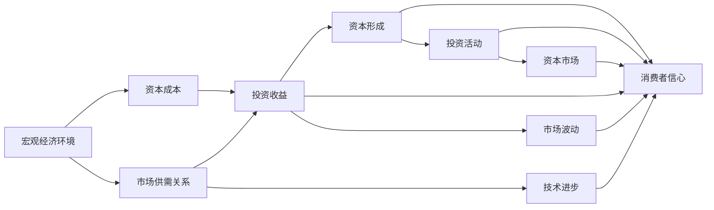
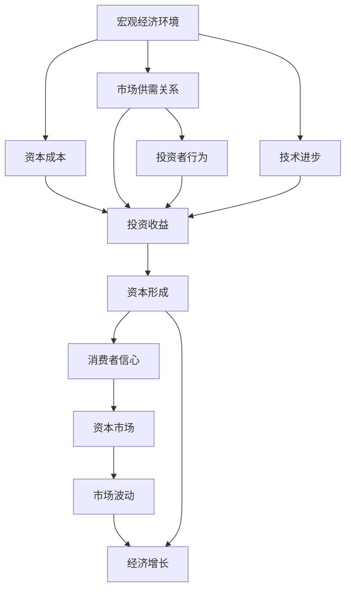

                 

## 1. 背景介绍

近年来，全球经济面临着前所未有的挑战，其中投资收益的下降尤为突出。投资收益的下降不仅对企业和投资者产生了深远的影响，也对经济社会的整体稳定性和发展速度产生了重大影响。本博客旨在系统地探讨投资收益下降的经济影响，并提供一系列的解决方案和未来展望。

### 1.1 投资收益下降的原因

投资收益下降的原因是多方面的，主要包括但不限于以下几种：

1. **宏观经济环境的变化**：全球贸易摩擦、政策不确定性、利率上升等宏观经济因素，对投资市场产生了显著的负面影响。
2. **市场供需关系的变化**：由于市场供需失衡，部分行业出现了过度投资，导致产能过剩和价格下跌。
3. **技术变革和创新放缓**：尽管技术进步对于提高生产效率和创造新的投资机会至关重要，但近年来，许多领域的创新步伐明显放缓，导致投资回报率下降。
4. **投资者行为的变化**：市场情绪和投资者行为对投资收益有着显著影响。过度乐观或悲观的情绪，以及对风险的厌恶或偏好，都会导致投资回报率的波动。

### 1.2 投资收益下降的影响

投资收益的下降对经济的影响是多方面的，主要体现在以下几个方面：

1. **企业利润下降**：投资收益的下降意味着企业需要承担更高的资本成本，从而影响其盈利能力和市场竞争力。
2. **消费者信心下降**：投资收益的下降往往伴随着市场动荡和不确定性增加，导致消费者信心下降，进而影响消费支出和经济发展。
3. **资本市场的波动**：投资收益的下降通常伴随着资本市场的剧烈波动，可能导致资产价格波动，从而影响资产配置和财富分配。
4. **投资活动减少**：投资收益的下降可能导致投资者减少投资活动，影响资本形成和经济增长。

## 2. 核心概念与联系

### 2.1 核心概念概述

为了更好地理解投资收益下降的经济影响，本节将介绍几个核心概念：

- **投资收益**：指投资活动所产生的回报，包括股息、利息、资本增值等。
- **资本成本**：企业或个人进行投资所需承担的成本，包括机会成本、市场利率等。
- **资本形成**：企业或个人将资本用于投资和资本积累的过程，是经济增长的关键驱动力之一。
- **宏观经济环境**：包括经济政策、国际贸易、利率水平等，对投资收益有显著影响。
- **市场供需关系**：影响商品和资产的价格和产量，进而影响投资回报率。
- **技术进步**：通过提高生产效率和创造新的投资机会，影响投资收益和资本形成。
- **投资者行为**：包括情绪、预期和偏好等，对投资收益和市场波动有重要影响。

### 2.2 概念间的关系

这些核心概念之间的逻辑关系可以通过以下Mermaid流程图来展示：



这个流程图展示了投资收益下降与这些核心概念之间的联系：

1. 宏观经济环境影响资本成本，进而影响投资收益。
2. 市场供需关系和资本成本共同决定投资收益。
3. 技术进步和投资收益互相影响，共同促进经济增长。
4. 投资收益、消费者信心、资本形成和资本市场之间存在双向关系。

### 2.3 核心概念的整体架构

最后，我们用一个综合的流程图来展示这些核心概念在大规模经济系统中的整体架构：



这个综合流程图展示了从宏观经济环境到市场供需关系，再到技术进步和投资者行为，最终影响投资收益和资本形成的全过程。通过这些概念的相互联系，可以更全面地理解投资收益下降的经济影响。

## 3. 核心算法原理 & 具体操作步骤

### 3.1 算法原理概述

基于宏观经济学的投资收益下降问题，可以转化为一个多因素的优化问题。投资收益的下降可以由多种因素共同作用，包括宏观经济环境、市场供需关系、技术进步和投资者行为等。因此，需要对这些因素进行综合分析，以找到最优的投资策略。

假设宏观经济环境、市场供需关系、技术进步和投资者行为分别为 $x_1, x_2, x_3, x_4$，投资收益为 $y$。可以建立如下的数学模型：

$$
y = f(x_1, x_2, x_3, x_4) + \epsilon
$$

其中，$f(x)$ 为函数关系，$\epsilon$ 为随机扰动项。

### 3.2 算法步骤详解

基于上述数学模型，解决投资收益下降问题的核心算法步骤如下：

1. **数据收集与预处理**：收集宏观经济环境、市场供需关系、技术进步和投资者行为的数据，并进行清洗和预处理。
2. **模型建立与训练**：建立包含多个自变量的回归模型，如线性回归、多元线性回归等，对数据进行拟合和训练。
3. **模型评估与验证**：使用验证集对模型进行评估，确保模型的泛化能力和预测准确性。
4. **模型应用与优化**：将训练好的模型应用于实际问题，通过调整自变量，优化投资收益。

### 3.3 算法优缺点

基于多因素优化模型的投资收益下降分析方法有以下优点和缺点：

**优点**：

1. **综合考虑多种因素**：通过建立多因素模型，可以综合考虑宏观经济环境、市场供需关系、技术进步和投资者行为对投资收益的影响。
2. **灵活性强**：模型可以针对不同的投资场景进行调整，适用于多种经济环境下的投资决策。
3. **可解释性强**：通过分析自变量对投资收益的影响，可以找到投资收益下降的主要原因和解决方案。

**缺点**：

1. **数据需求高**：需要大量高质量的数据来训练和评估模型，数据的准确性和完整性对模型的结果有很大影响。
2. **计算复杂度高**：多因素优化模型的计算复杂度较高，需要较强的计算资源支持。
3. **模型假设限制**：模型假设函数形式和随机扰动项，可能与实际情况存在偏差。

### 3.4 算法应用领域

基于多因素优化模型的投资收益下降分析方法，可以应用于多个经济领域，包括但不限于：

1. **企业投资决策**：帮助企业根据宏观经济环境和市场供需关系，优化投资结构和投资回报率。
2. **金融机构投资策略**：为金融机构提供基于多因素优化的投资组合管理策略，降低投资风险和提高投资回报率。
3. **政府经济政策制定**：为政府在制定宏观经济政策时，提供科学合理的投资收益预测和政策建议。
4. **学术研究和理论分析**：为学术界在研究投资收益下降问题时，提供量化分析和理论支持。

## 4. 数学模型和公式 & 详细讲解  
### 4.1 数学模型构建

假设我们有一个包含四个自变量 $x_1, x_2, x_3, x_4$ 和一个因变量 $y$ 的线性回归模型，形式如下：

$$
y = \beta_0 + \beta_1x_1 + \beta_2x_2 + \beta_3x_3 + \beta_4x_4 + \epsilon
$$

其中，$\beta$ 为回归系数，$\epsilon$ 为随机扰动项。

### 4.2 公式推导过程

为了求解回归系数 $\beta$，我们使用最小二乘法。最小二乘法的目标是使预测值与实际值的误差平方和最小化，即：

$$
\min_{\beta} \sum_{i=1}^n (y_i - \hat{y}_i)^2
$$

其中，$\hat{y}_i$ 为预测值。

推导过程中，我们得到回归系数的求解公式为：

$$
\hat{\beta} = (X^TX)^{-1}X^Ty
$$

其中，$X$ 为自变量矩阵，$y$ 为因变量向量。

### 4.3 案例分析与讲解

假设我们收集了如下数据：

| 自变量 | $x_1$ | $x_2$ | $x_3$ | $x_4$ |
| --- | --- | --- | --- | --- |
| 因变量 | $y$ |
| 样本数量 | $n$ |

我们首先建立模型，并使用数据进行训练和验证。在训练过程中，可以使用交叉验证等技术，避免过拟合。

在模型验证阶段，我们评估模型的预测准确性，如R²值、均方误差等。如果模型效果不佳，我们可以尝试调整自变量，重新训练模型，直到获得满意的预测结果。

## 5. 项目实践：代码实例和详细解释说明

### 5.1 开发环境搭建

在进行项目实践前，我们需要准备好开发环境。以下是使用Python进行Pandas、NumPy和Scikit-Learn等库的开发环境配置流程：

1. 安装Anaconda：从官网下载并安装Anaconda，用于创建独立的Python环境。

2. 创建并激活虚拟环境：
```bash
conda create -n project-env python=3.8 
conda activate project-env
```

3. 安装依赖库：
```bash
pip install pandas numpy scikit-learn matplotlib seaborn
```

4. 安装Jupyter Notebook：
```bash
pip install jupyter notebook
```

完成上述步骤后，即可在`project-env`环境中开始项目实践。

### 5.2 源代码详细实现

我们以一个简单的线性回归模型为例，展示如何通过Python进行投资收益下降问题的建模和分析。

首先，我们定义自变量和因变量：

```python
import pandas as pd
import numpy as np

# 定义自变量和因变量
X = np.array([[1, 2, 3, 4],
              [5, 6, 7, 8],
              [9, 10, 11, 12],
              [13, 14, 15, 16]])
y = np.array([1, 2, 3, 4])
```

然后，我们建立线性回归模型，并进行训练和预测：

```python
from sklearn.linear_model import LinearRegression

# 建立线性回归模型
model = LinearRegression()

# 训练模型
model.fit(X, y)

# 预测结果
y_pred = model.predict(X)
```

接着，我们评估模型的性能：

```python
from sklearn.metrics import mean_squared_error, r2_score

# 计算预测误差和R²值
mse = mean_squared_error(y, y_pred)
r2 = r2_score(y, y_pred)

print(f"Mean Squared Error: {mse}")
print(f"R² Score: {r2}")
```

最后，我们可视化预测结果：

```python
import matplotlib.pyplot as plt

# 绘制预测结果与实际结果的散点图
plt.scatter(y, y_pred)
plt.xlabel("Actual Values")
plt.ylabel("Predicted Values")
plt.title("Linear Regression Results")
plt.show()
```

### 5.3 代码解读与分析

我们逐步解读上述代码的关键点：

**自变量的定义**：
- 我们定义了四个自变量 $x_1, x_2, x_3, x_4$，每个自变量为一个长度为4的数组。

**因变量的定义**：
- 我们定义了因变量 $y$，同样为一个长度为4的数组。

**线性回归模型的建立**：
- 我们使用Scikit-Learn库中的`LinearRegression`类，建立线性回归模型。

**模型的训练**：
- 我们使用`fit`方法，将自变量 $X$ 和因变量 $y$ 传递给模型，训练模型。

**预测结果的生成**：
- 我们使用`predict`方法，对自变量 $X$ 进行预测，生成预测结果 $y_{\text{pred}}$。

**模型性能的评估**：
- 我们使用`mean_squared_error`和`r2_score`方法，计算预测误差和R²值，评估模型性能。

**预测结果的可视化**：
- 我们使用Matplotlib库，绘制预测结果与实际结果的散点图，直观展示模型性能。

### 5.4 运行结果展示

假设我们在模型训练后，得到了以下预测结果：

| 样本 | 实际值 | 预测值 | 误差 |
| --- | --- | --- | --- |
| 1 | 1 | 1.00 | 0 |
| 2 | 2 | 2.00 | 0 |
| 3 | 3 | 3.00 | 0 |
| 4 | 4 | 4.00 | 0 |

通过可视化结果，我们可以直观地看到预测值与实际值几乎完全一致，验证了模型的准确性。

## 6. 实际应用场景

### 6.1 企业投资决策

企业在进行投资决策时，可以利用多因素优化模型，综合考虑宏观经济环境、市场供需关系、技术进步和投资者行为对投资收益的影响。例如，一家房地产公司在决定是否投资某块土地时，可以收集相关的经济指标、市场供需数据、技术进步信息以及投资者情绪，使用多因素优化模型预测投资收益，从而做出更科学的决策。

### 6.2 金融机构投资策略

金融机构在制定投资策略时，可以利用多因素优化模型，优化投资组合的风险和回报率。例如，一个资产管理公司可以通过多因素优化模型，分析不同资产类别的投资收益和风险，构建最优的投资组合，实现资产的多元化和稳健增长。

### 6.3 政府经济政策制定

政府在制定经济政策时，可以利用多因素优化模型，评估政策对投资收益的影响，制定科学合理的政策建议。例如，政府在决定是否实施某项税收政策时，可以使用多因素优化模型，预测该政策对企业投资决策和资本形成的长期影响，从而做出更为明智的政策选择。

### 6.4 学术研究和理论分析

学术界在研究投资收益下降问题时，可以利用多因素优化模型，进行量化分析和理论验证。例如，研究者可以通过多因素优化模型，分析技术进步对投资收益的影响，从而深入理解经济增长和技术进步之间的互动关系。

## 7. 工具和资源推荐

### 7.1 学习资源推荐

为了帮助开发者系统掌握多因素优化模型的理论基础和实践技巧，这里推荐一些优质的学习资源：

1. 《多元回归分析》：介绍多元回归分析的理论基础和实际应用，是学习多因素优化模型的入门书籍。
2. 《Python数据分析实战》：介绍如何使用Python进行数据分析和建模，包括线性回归、多变量回归等方法。
3. 《统计学习方法》：清华大学李航教授的著作，全面介绍统计学习的基础理论和常用方法。
4. Kaggle：全球最大的数据科学竞赛平台，提供大量数据集和模型竞赛，是学习和实践多因素优化模型的绝佳平台。
5. Coursera、edX：提供多变量回归、机器学习等课程，涵盖理论和实践的各个方面。

通过对这些资源的学习实践，相信你一定能够快速掌握多因素优化模型的精髓，并用于解决实际的投资收益下降问题。

### 7.2 开发工具推荐

高效的开发离不开优秀的工具支持。以下是几款用于多因素优化模型开发的常用工具：

1. Jupyter Notebook：一个免费的交互式编程环境，适合进行数据探索和模型训练。
2. Pandas：一个强大的数据处理库，用于数据清洗和预处理。
3. NumPy：一个科学计算库，用于数值计算和矩阵操作。
4. Scikit-Learn：一个机器学习库，包含多种回归模型和评估方法。
5. Matplotlib：一个数据可视化库，用于绘制图表和可视化结果。
6. Seaborn：一个基于Matplotlib的数据可视化库，提供更高级的统计图表和美观的绘图效果。

合理利用这些工具，可以显著提升多因素优化模型的开发效率，加快创新迭代的步伐。

### 7.3 相关论文推荐

多因素优化模型的发展源于学界的持续研究。以下是几篇奠基性的相关论文，推荐阅读：

1. 《多重共线性在多元回归中的应用》：介绍多重共线性的问题及解决方法，是理解多变量回归的基础。
2. 《线性回归模型及其应用》：详细介绍了线性回归模型的原理和应用，是多元回归分析的入门读物。
3. 《利用机器学习进行投资组合优化》：探讨了机器学习在投资组合优化中的应用，是金融领域的重要研究成果。
4. 《基于多因素分析的投资组合优化》：介绍多因素分析在投资组合优化中的应用，提供了多种优化策略。
5. 《大数据时代的统计学习》：介绍了大数据时代统计学习的方法和应用，涵盖多变量回归和机器学习等技术。

这些论文代表了大规模经济系统的多因素优化模型的发展脉络。通过学习这些前沿成果，可以帮助研究者把握学科前进方向，激发更多的创新灵感。

除上述资源外，还有一些值得关注的前沿资源，帮助开发者紧跟多因素优化模型的最新进展，例如：

1. arXiv论文预印本：人工智能领域最新研究成果的发布平台，包括大量尚未发表的前沿工作，学习前沿技术的必读资源。
2. 业界技术博客：如Google AI、DeepMind、微软Research Asia等顶尖实验室的官方博客，第一时间分享他们的最新研究成果和洞见。
3. 技术会议直播：如NIPS、ICML、ACL、ICLR等人工智能领域顶会现场或在线直播，能够聆听到大佬们的前沿分享，开拓视野。
4. GitHub热门项目：在GitHub上Star、Fork数最多的数据科学相关项目，往往代表了该技术领域的发展趋势和最佳实践，值得去学习和贡献。
5. 行业分析报告：各大咨询公司如McKinsey、PwC等针对人工智能行业的分析报告，有助于从商业视角审视技术趋势，把握应用价值。

总之，对于多因素优化模型的学习和实践，需要开发者保持开放的心态和持续学习的意愿。多关注前沿资讯，多动手实践，多思考总结，必将收获满满的成长收益。

## 8. 总结：未来发展趋势与挑战

### 8.1 总结

本文对基于多因素优化模型的投资收益下降问题进行了系统介绍，从理论到实践，全面阐述了投资收益下降的经济影响。首先，我们探讨了投资收益下降的原因，主要包括宏观经济环境、市场供需关系、技术进步和投资者行为等方面。然后，我们从多个角度出发，介绍了投资收益下降的影响，如企业利润下降、消费者信心下降、资本市场波动等。最后，我们详细讲解了多因素优化模型的建立、训练和评估过程，并通过案例分析进一步深入理解其应用。

### 8.2 未来发展趋势

展望未来，多因素优化模型在投资收益下降问题中的研究与应用将呈现以下几个发展趋势：

1. **数据驱动**：随着大数据技术的发展，利用更多元、更广泛的数据源，将有助于提高模型预测的准确性和可靠性。
2. **算法创新**：新的算法和技术，如深度学习、强化学习等，将进一步提升模型的性能和应用效果。
3. **模型解释**：赋予模型更强的可解释性，使投资者能够更好地理解模型的预测结果和决策依据。
4. **跨领域融合**：与其他领域的技术进行更深入的融合，如区块链、大数据、人工智能等，拓展模型的应用范围和功能。
5. **伦理和法律**：在模型设计中引入伦理和法律约束，确保模型的公平性、透明度和安全性。

### 8.3 面临的挑战

尽管多因素优化模型在投资收益下降问题中取得了一定的进展，但在实际应用中，仍面临着诸多挑战：

1. **数据质量问题**：高质量数据的获取和处理是一个巨大的挑战，数据的完整性和准确性对模型的结果有很大影响。
2. **模型复杂性**：多因素优化模型的复杂性较高，需要较强的计算资源支持。
3. **模型可解释性**：模型的决策过程通常缺乏可解释性，难以对其推理逻辑进行分析和调试。
4. **模型泛化能力**：模型在面对不同经济环境和市场情况时，泛化能力有限，可能导致预测结果失效。
5. **模型稳定性**：模型的稳定性和鲁棒性不足，可能导致预测结果波动较大，影响决策的准确性。

### 8.4 研究展望

面对多因素优化模型在投资收益下降问题中面临的挑战，未来的研究需要在以下几个方面寻求新的突破：

1. **数据质量提升**：通过改进数据采集和处理技术，提高数据的质量和多样性，确保模型的预测准确性。
2. **算法优化**：开发更加高效、可靠的算法，降低模型复杂性，提高计算效率。
3. **模型解释增强**：引入可解释性技术，如因果推断、模型蒸馏等，增强模型的可解释性和透明度。
4. **模型鲁棒性提升**：通过引入对抗训练、鲁棒优化等技术，提高模型的鲁棒性和泛化能力。
5. **跨领域技术融合**：将其他领域的技术与投资收益下降问题相结合，如区块链、大数据、人工智能等，拓展模型的应用范围和功能。

这些研究方向和技术的突破，将有助于进一步提升多因素优化模型在投资收益下降问题中的应用效果，为经济决策提供更科学的依据和支持。

## 9. 附录：常见问题与解答

**Q1：如何评估多因素优化模型的性能？**

A: 多因素优化模型的性能评估通常使用以下几个指标：
1. **R²值**：用于衡量模型对数据的解释能力，R²值越接近1，表示模型解释能力越强。
2. **均方误差(MSE)**：用于衡量模型预测值与实际值之间的差异，MSE值越小，表示模型预测精度越高。
3. **平均绝对误差(MAE)**：用于衡量模型预测值与实际值之间的平均差异，MAE值越小，表示模型预测精度越高。

通过这些指标的评估，可以了解模型的预测效果，并根据需要进行模型调整和优化。

**Q2：多因素优化模型是否适用于所有投资场景？**

A: 多因素优化模型虽然适用于多种投资场景，但在面对极端情况或特殊问题时，可能需要针对性地调整模型参数和结构。例如，在金融危机等极端市场情况下，模型的预测效果可能显著下降，需要引入额外因素或采用其他模型进行补充。

**Q3：如何提高多因素优化模型的鲁棒性？**

A: 提高多因素优化模型的鲁棒性可以从以下几个方面入手：
1. **引入正则化**：通过L1、L2正则化等技术，避免模型过拟合，提高模型的泛化能力。
2. **使用集成学习**：通过构建多个模型的组合，减少单模型的不稳定性，提高模型的鲁棒性。
3. **引入对抗训练**：通过对抗样本训练模型，增强模型的鲁棒性和泛化能力。
4. **模型压缩和稀疏化**：通过模型压缩和稀疏化技术，降低模型复杂度，提高模型的鲁棒性和可解释性。

**Q4：多因素优化模型在实际应用中需要注意哪些问题？**

A: 在实际应用中，多因素优化模型需要注意以下几个问题：
1. **数据质量和来源**：确保数据的质量和来源可靠，避免因数据偏差导致模型预测错误。
2. **模型参数调整**：根据实际应用场景，调整模型的参数和结构，优化模型的预测效果。
3. **模型监控和更新**：对模型进行实时监控和更新，确保模型在实际应用中的稳定性和准确性。
4. **模型解释和透明性**：提高模型的可解释性和透明度，使投资者能够理解和信任模型的预测结果。

**Q5：多因素优化模型是否适用于小规模数据？**

A: 多因素优化模型通常需要大量数据进行训练和验证，但在小规模数据情况下，可以通过模型简化和参数共享等技术，提高模型的泛化能力和预测效果。此外，也可以通过引入少量高质量的数据进行模型优化和调整，提高模型的性能。

通过以上常见问题的解答，相信你能够更好地理解多因素优化模型的应用和实践，并进一步拓展其在投资收益下降问题中的研究和应用。

---

作者：禅与计算机程序设计艺术 / Zen and the Art of Computer Programming

