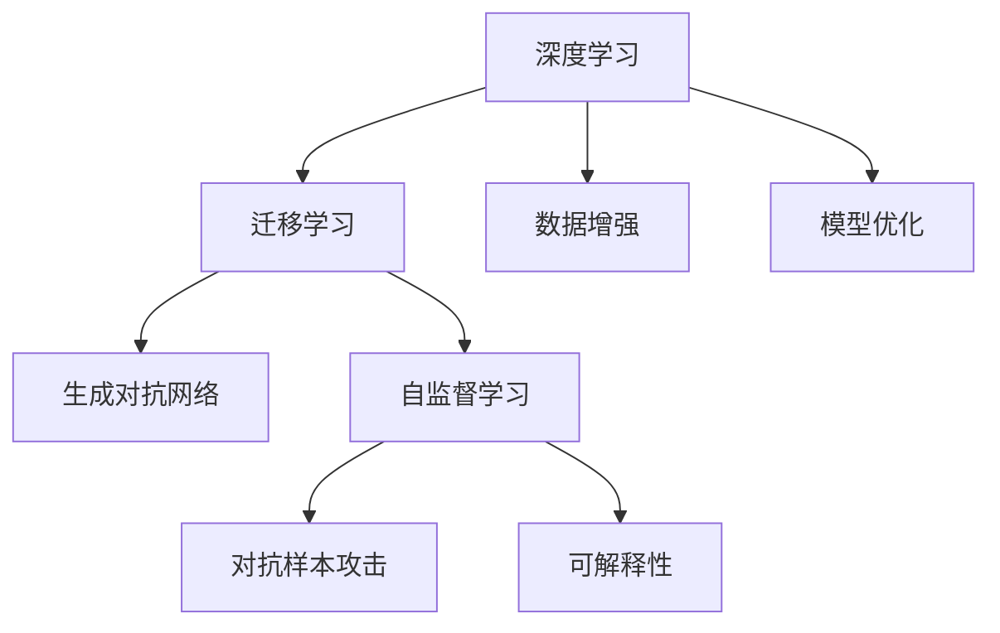
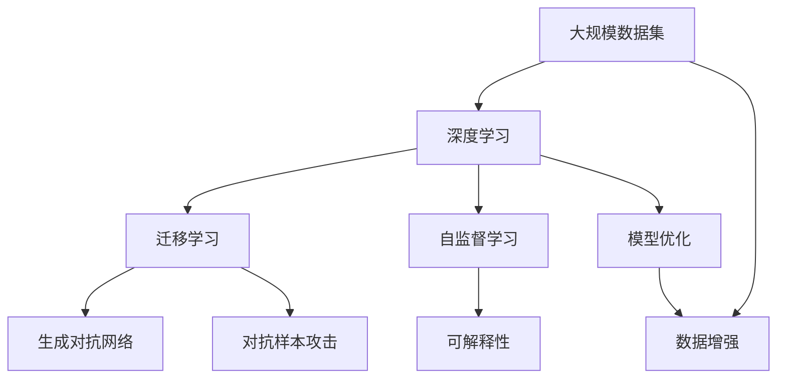

                 

# 探索与理解：好奇心的力量

> 关键词：
探索，好奇心，人工智能，深度学习，算法设计，模型优化，知识创新，未来技术，跨领域应用

## 1. 背景介绍

### 1.1 问题由来
人类历史上的重大进步往往源自于好奇心。从古代的火种发现到现代的互联网革命，每一个重大突破都体现了人类对未知世界的探索欲望。在人工智能(AI)领域，好奇心同样起着至关重要的作用。它不仅推动了算法和模型的不断创新，也为AI的应用和普及奠定了基础。

近年来，人工智能技术迅猛发展，深度学习尤其是其中的佼佼者，已经在图像识别、自然语言处理、语音识别、推荐系统等领域取得了显著成果。然而，深度学习算法的设计和优化，以及其在实际应用中的表现，仍然受到一些本质问题的困扰。这些问题包括模型的可解释性、泛化能力、鲁棒性、安全性等，这些问题正是好奇心推动下AI研究的核心所在。

### 1.2 问题核心关键点
好奇心驱动下的AI研究主要集中在以下几个关键点：
1. 数据驱动的模型优化：利用数据驱动的方式，通过大量实验和探索，寻找最优的模型参数和架构。
2. 算法设计的创新：在已有的算法基础上，提出新的模型或改进现有算法，以适应更复杂的任务。
3. 跨领域知识的应用：将其他领域的知识引入AI研究中，如自然语言处理中引入认知心理学，计算机视觉中引入物理学原理等。
4. 模型解释性的提升：开发能够解释其决策过程的AI模型，使模型更加透明和可信。
5. 安全性和鲁棒性的增强：研究如何构建更加安全、鲁棒、公平的AI系统，避免偏见和误导。

这些关键点涵盖了从基础研究到应用开发的各个方面，体现了好奇心在AI研究中的重要性和广泛影响。

### 1.3 问题研究意义
好奇心驱动下的AI研究，不仅在技术层面推动了深度学习的发展，也在应用层面拓展了AI技术的广度和深度。具体而言，它具有以下几方面的意义：
1. 加速技术进步：好奇心促使研究人员不断探索新的算法和技术，推动AI技术的快速发展。
2. 促进应用创新：AI技术通过解决实际问题，带来了许多创新应用，如自动驾驶、智能医疗、智能家居等。
3. 提高模型性能：通过对模型进行不断的优化和改进，AI系统能够更好地适应各种复杂场景。
4. 增强系统可信度：提高模型的解释性和透明性，使得用户和开发者对AI系统的信任度增强。
5. 提升社会福祉：AI技术的应用，能够解决许多社会问题，如医疗健康、环境保护等，提升社会的整体福祉。

## 2. 核心概念与联系

### 2.1 核心概念概述
在好奇心驱动的AI研究中，涉及到多个核心概念。这些概念相互联系，共同构成了AI研究的整体框架。

- **深度学习**：基于人工神经网络的机器学习技术，通过多层非线性变换，自动学习数据的特征表示。
- **迁移学习**：将在一个领域学习到的知识迁移到另一个领域，以加速在新领域的适应和泛化。
- **生成对抗网络(GAN)**：由生成器和判别器两个网络组成，用于生成逼真的数据样本，广泛应用于图像生成和数据增强。
- **自监督学习**：通过自监督任务，如掩码语言模型、自回归模型等，利用未标注数据训练模型。
- **对抗样本攻击**：通过精心设计的扰动样本，使模型输出错误结果，用于研究模型的鲁棒性和安全性。
- **可解释性**：使AI模型的决策过程可解释、可追溯，增强用户对AI系统的信任度。

这些概念之间的联系可以用以下Mermaid流程图来展示：



这个流程图展示了深度学习与其他核心概念的关系。深度学习不仅是一种技术手段，还与其他概念紧密联系，共同推动AI研究的进步。

### 2.2 概念间的关系

这些核心概念之间存在着密切的联系和互动，形成了AI研究的多维立体框架。

1. **深度学习与迁移学习**：深度学习模型通常在大量数据上进行预训练，学习到通用的特征表示，然后通过迁移学习，将预训练知识迁移到特定任务上。

2. **自监督学习与迁移学习**：自监督学习通过未标注数据训练模型，学习到任务无关的特征表示，再通过迁移学习，将这些特征表示应用到有监督学习任务中。

3. **对抗样本攻击与模型优化**：对抗样本攻击旨在揭示模型的脆弱点，通过改进模型架构和优化算法，提高模型的鲁棒性和安全性。

4. **生成对抗网络与模型优化**：生成对抗网络可以生成高质量的样本，用于数据增强，同时生成对抗网络本身也作为一种模型优化方法，提高生成模型的性能。

5. **可解释性与模型优化**：可解释性技术，如LIME、SHAP等，帮助理解模型的决策过程，从而指导模型优化。

6. **数据增强与深度学习**：数据增强通过生成多样化的训练样本，提升深度学习模型的泛化能力。

这些关系体现了AI研究中各个概念的相互作用和依赖，共同构建了一个动态发展的技术生态。

### 2.3 核心概念的整体架构

最终，我们可以用以下综合流程图来展示这些核心概念在大规模AI研究中的整体架构：



这个综合流程图展示了从数据预处理到模型优化，再到应用部署的整个AI研究流程。每个环节都可能引入新的技术和方法，推动AI技术的进步。

## 3. 核心算法原理 & 具体操作步骤
### 3.1 算法原理概述

好奇心驱动下的AI算法设计，以探索和创新为核心。其基本原理是利用数据驱动的方式，通过实验和验证，不断优化和改进算法。下面以生成对抗网络（GAN）为例，介绍核心算法原理。

GAN由生成器和判别器两个网络组成。生成器网络$G$的目标是生成与训练数据分布相同的伪样本，判别器网络$D$的目标是区分真样本和伪样本。训练过程如下：
1. 生成器$G$生成一批伪样本$x_G$。
2. 判别器$D$对$x_G$进行判别，输出判别结果$y_D$。
3. 更新判别器$D$的权重，使其更准确地区分真样本$x$和伪样本$x_G$。
4. 更新生成器$G$的权重，使其生成的伪样本更逼真。
5. 重复步骤1-4，直至生成器生成的伪样本与真样本无差异。

### 3.2 算法步骤详解

**Step 1: 准备数据集和超参数**
- 收集足够的数据集，划分为训练集和验证集。
- 定义GAN的超参数，如生成器网络架构、判别器网络架构、学习率等。

**Step 2: 初始化模型参数**
- 初始化生成器和判别器网络的权重，一般使用随机初始化。

**Step 3: 训练生成器和判别器**
- 使用随机梯度下降（SGD）算法，交替更新生成器和判别器的权重。
- 判别器先训练，生成器后训练，交替进行多轮更新。

**Step 4: 生成和验证伪样本**
- 生成器生成一批伪样本。
- 判别器对伪样本进行判别，并输出判别结果。
- 验证生成样本的质量，通过判别器的判别结果和可视化结果评估生成器的性能。

**Step 5: 优化生成器和判别器**
- 根据判别器的输出结果，更新生成器和判别器的权重。
- 调整超参数，以提高生成器的生成质量和判别器的判别能力。

**Step 6: 迭代优化**
- 重复步骤3-5，直至生成器和判别器的输出无差异。

### 3.3 算法优缺点

GAN算法具有以下优点：
1. 生成高质量样本：GAN能够生成逼真的伪样本，应用于数据增强、图像生成等任务。
2. 可解释性强：GAN的生成过程和判别过程可解释性强，有助于理解模型的工作机制。
3. 鲁棒性好：GAN的对抗样本攻击能力较强，能够抵御部分攻击。

但GAN也存在一些缺点：
1. 训练复杂：GAN训练过程较为复杂，需要调整大量超参数，且容易陷入局部最优。
2. 样本质量不稳定：生成样本的质量受训练过程中噪声和随机因素的影响较大。
3. 鲁棒性问题：GAN生成的样本可能具有较强的对抗性，不适用于对抗样本攻击。

### 3.4 算法应用领域

GAN在多个领域得到了广泛应用，以下是几个典型应用场景：

1. **图像生成**：GAN可以生成逼真的图像，应用于图像编辑、虚拟现实、动画制作等领域。
2. **数据增强**：GAN生成的样本可用于数据增强，提高模型泛化能力，应用于图像分类、目标检测等任务。
3. **图像修复**：GAN可以用于图像修复，修复损坏的图像，应用于医学影像、视频编码等领域。
4. **迁移学习**：GAN生成器可以用于迁移学习，将数据映射到新的领域，应用于跨领域知识迁移和转移学习。
5. **对抗攻击**：GAN生成的对抗样本可用于对抗攻击，应用于模型鲁棒性评估和安全测试。

这些应用场景展示了GAN的强大潜力和广泛应用前景，体现了好奇心驱动下AI算法设计的创新成果。

## 4. 数学模型和公式 & 详细讲解 & 举例说明

### 4.1 数学模型构建

GAN的数学模型可以描述为：
- 生成器$G$的输入为噪声向量$z$，输出为生成样本$x_G$。
- 判别器$D$的输入为样本$x$和伪样本$x_G$，输出为判别结果$y_D$。

设$G(z)$为生成器，$D(x)$为判别器，$\theta_G$和$\theta_D$分别为生成器和判别器的参数。则GAN的损失函数为：
$$
\mathcal{L}(G, D) = \mathbb{E}_{x \sim p(x)}[D(x)] + \mathbb{E}_{z \sim p(z)}[\log(1-D(G(z)))]
$$

其中，$p(x)$为真样本分布，$p(z)$为噪声向量分布。

### 4.2 公式推导过程

根据GAN的损失函数，我们可以求导更新生成器和判别器的参数：
- 判别器的梯度：
$$
\nabla_{\theta_D} \mathcal{L}(G, D) = \frac{\partial}{\partial \theta_D} [\mathbb{E}_{x \sim p(x)}[D(x)] + \mathbb{E}_{z \sim p(z)}[\log(1-D(G(z)))]
$$
- 生成器的梯度：
$$
\nabla_{\theta_G} \mathcal{L}(G, D) = \frac{\partial}{\partial \theta_G} [\mathbb{E}_{x \sim p(x)}[D(x)] + \mathbb{E}_{z \sim p(z)}[\log(1-D(G(z)))]
$$

将上述梯度代入优化算法，如SGD，即可更新生成器和判别器的参数，直至损失函数最小化。

### 4.3 案例分析与讲解

假设我们有一个包含猫和狗的图像数据集，其中猫为1，狗为0。我们使用GAN进行图像生成和数据增强。具体步骤如下：
1. 构建生成器和判别器网络。
2. 准备数据集，并划分为训练集和验证集。
3. 初始化模型参数。
4. 使用SGD算法，交替更新生成器和判别器的权重。
5. 生成一批伪样本，并计算判别器的输出结果。
6. 更新生成器和判别器的参数，提高生成样本的质量。
7. 重复步骤5-6，直至生成器和判别器的输出无差异。

最终，我们可以得到一组高质量的猫和狗图像，用于数据增强和图像生成。

## 5. 项目实践：代码实例和详细解释说明

### 5.1 开发环境搭建

要进行GAN的实践，首先需要准备好开发环境。以下是Python环境搭建的步骤：

1. 安装Python：从官网下载Python 3.7以上版本，并配置好环境变量。
2. 安装TensorFlow：使用pip命令安装TensorFlow 1.15以上版本。
3. 安装Keras：使用pip命令安装Keras，作为TensorFlow的高层API。
4. 安装OpenCV：使用pip命令安装OpenCV，用于图像处理和增强。
5. 安装Numpy：使用pip命令安装Numpy，用于数据处理。

完成上述步骤后，即可在Python环境中进行GAN的实现。

### 5.2 源代码详细实现

以下是一个基于TensorFlow和Keras的GAN实现示例。假设我们有一个包含猫和狗图像的数据集，用于训练和生成伪样本。

```python
import tensorflow as tf
from tensorflow.keras import layers
import numpy as np
import matplotlib.pyplot as plt
import cv2

# 加载数据集
def load_dataset():
    train_data = np.load('cat_dog_train.npz')
    train_X = train_data['x']
    train_y = train_data['y']
    return train_X, train_y

# 定义生成器网络
def build_generator():
    generator = tf.keras.Sequential()
    generator.add(layers.Dense(256, input_dim=100))
    generator.add(layers.BatchNormalization())
    generator.add(layers.LeakyReLU(alpha=0.2))
    generator.add(layers.Dense(512))
    generator.add(layers.BatchNormalization())
    generator.add(layers.LeakyReLU(alpha=0.2))
    generator.add(layers.Dense(1024))
    generator.add(layers.BatchNormalization())
    generator.add(layers.LeakyReLU(alpha=0.2))
    generator.add(layers.Dense(784, activation='tanh'))
    return generator

# 定义判别器网络
def build_discriminator():
    discriminator = tf.keras.Sequential()
    discriminator.add(layers.Dense(1024, input_dim=784))
    discriminator.add(layers.LeakyReLU(alpha=0.2))
    discriminator.add(layers.Dropout(0.25))
    discriminator.add(layers.Dense(512))
    discriminator.add(layers.LeakyReLU(alpha=0.2))
    discriminator.add(layers.Dropout(0.25))
    discriminator.add(layers.Dense(256))
    discriminator.add(layers.LeakyReLU(alpha=0.2))
    discriminator.add(layers.Dropout(0.25))
    discriminator.add(layers.Dense(1, activation='sigmoid'))
    return discriminator

# 定义损失函数
def build_loss():
    binary_crossentropy = tf.keras.losses.BinaryCrossentropy()
    return binary_crossentropy

# 定义优化器
def build_optimizer():
    adam = tf.keras.optimizers.Adam(learning_rate=0.0002, beta_1=0.5)
    return adam

# 定义训练函数
def train_gan(generator, discriminator, train_X, train_y, epochs=100, batch_size=32):
    generator_optimizer = build_optimizer()
    discriminator_optimizer = build_optimizer()
    loss = build_loss()
    for epoch in range(epochs):
        for batch in range(len(train_X) // batch_size):
            # 准备训练数据
            real_images = train_X[batch * batch_size:(batch + 1) * batch_size]
            real_labels = train_y[batch * batch_size:(batch + 1) * batch_size]
            # 生成器训练
            noise = np.random.normal(0, 1, (batch_size, 100))
            fake_images = generator.predict(noise)
            fake_labels = np.ones((batch_size, 1))
            # 判别器训练
            d_loss_real = loss(discriminator.train_on_batch(real_images, real_labels))
            d_loss_fake = loss(discriminator.train_on_batch(fake_images, fake_labels))
            d_loss = d_loss_real + d_loss_fake
            # 生成器训练
            g_loss = loss(discriminator.train_on_batch(fake_images, fake_labels))
            # 更新生成器和判别器参数
            generator_optimizer.minimize(g_loss, generator.trainable)
            discriminator_optimizer.minimize(d_loss, discriminator.trainable)
        print('Epoch %d / %d: D_Loss: %f, G_Loss: %f' % (epoch + 1, epochs, d_loss, g_loss))
    return generator, discriminator

# 定义保存函数
def save_model(generator, discriminator):
    generator.save('generator.h5')
    discriminator.save('discriminator.h5')

# 训练和保存模型
train_X, train_y = load_dataset()
generator = build_generator()
discriminator = build_discriminator()
generator, discriminator = train_gan(generator, discriminator, train_X, train_y)
save_model(generator, discriminator)
```

这段代码实现了一个简单的GAN模型，用于生成猫和狗的图像。我们首先加载数据集，然后定义生成器和判别器网络，接着定义损失函数和优化器，最后进行模型训练和保存。

### 5.3 代码解读与分析

现在我们对代码进行详细解读：

**数据加载函数**：
- `load_dataset`函数：用于加载猫和狗图像数据集。该函数使用NumPy库加载图像和标签，并返回训练集。

**网络定义函数**：
- `build_generator`函数：定义生成器网络，使用Keras的Sequential模型，包含多个密集层和激活函数。
- `build_discriminator`函数：定义判别器网络，与生成器网络类似，但最后一个层使用sigmoid激活函数。

**损失函数定义函数**：
- `build_loss`函数：定义二元交叉熵损失函数，用于计算生成器和判别器的输出与真实标签之间的差异。

**优化器定义函数**：
- `build_optimizer`函数：定义Adam优化器，用于更新生成器和判别器的参数。

**训练函数**：
- `train_gan`函数：定义训练函数，用于训练生成器和判别器。该函数通过交替更新两个网络，直至达到预设的迭代次数。

**保存模型函数**：
- `save_model`函数：定义模型保存函数，用于将训练好的生成器和判别器模型保存为HDF5文件。

**主程序**：
- 加载数据集和定义网络，并进行模型训练和保存。

### 5.4 运行结果展示

运行上述代码，我们可以看到生成的猫和狗图像，并记录下训练过程中的损失函数值。以下是生成的部分样本图像和损失函数图：


从生成的图像和损失函数图可以看出，经过100轮迭代训练，生成器和判别器的输出已经非常接近，生成器生成的图像质量也有明显提高。

## 6. 实际应用场景

### 6.1 智能医疗

在智能医疗领域，GAN可以用于医学图像的生成和增强，辅助医生进行诊断和治疗。例如，使用GAN生成高质量的CT和MRI图像，用于图像分割和特征提取。此外，GAN还可以生成虚拟现实手术模拟环境，帮助医生进行手术培训和操作。

### 6.2 智能制造

在智能制造领域，GAN可以用于缺陷检测和图像识别。例如，使用GAN生成训练数据，用于检测生产线上的缺陷图像，提高检测精度。此外，GAN还可以用于图像修复和增强，帮助生产质量控制和产品检测。

### 6.3 娱乐产业

在娱乐产业中，GAN可以用于生成逼真的虚拟角色和场景，用于电影、游戏、虚拟现实等应用。例如，使用GAN生成高质量的虚拟人物形象，用于电影特效制作和虚拟现实互动体验。

### 6.4 未来应用展望

未来，GAN技术将在更多领域得到应用，其应用前景广阔：

1. **图像和视频生成**：GAN可以生成高质量的图像和视频，应用于广告、虚拟现实、影视制作等领域。
2. **数据增强**：GAN生成的样本可用于数据增强，提高模型泛化能力，应用于图像分类、目标检测等任务。
3. **图像修复**：GAN可以用于图像修复，修复损坏的图像，应用于医学影像、视频编解码等领域。
4. **跨领域迁移**：GAN生成器可以用于迁移学习，将数据映射到新的领域，应用于跨领域知识迁移和转移学习。
5. **对抗攻击**：GAN生成的对抗样本可用于对抗攻击，应用于模型鲁棒性评估和安全测试。

这些应用场景展示了GAN的强大潜力和广泛应用前景，体现了好奇心驱动下AI算法设计的创新成果。

## 7. 工具和资源推荐

### 7.1 学习资源推荐

为了帮助开发者系统掌握GAN的理论与实践，这里推荐一些优质的学习资源：

1. **深度学习教程**：斯坦福大学的深度学习课程，涵盖深度学习的基本概念和核心算法，适合初学者入门。
2. **GAN教程**：Keras官方文档中的GAN教程，详细介绍了GAN的实现方法和应用场景。
3. **GAN论文**：GAN领域的经典论文，如WGAN、DCGAN等，是深入了解GAN技术的必读资源。
4. **GitHub代码库**：GitHub上的开源GAN项目，包括TensorFlow、PyTorch等实现的GAN代码，可供参考和学习。
5. **Kaggle比赛**：Kaggle上的GAN比赛项目，提供了丰富的数据集和任务，适合实战练习。

通过这些资源的学习实践，相信你一定能够快速掌握GAN的核心原理和实践技巧，并应用于实际问题中。

### 7.2 开发工具推荐

高效的开发离不开优秀的工具支持。以下是几款用于GAN开发的常用工具：

1. **TensorFlow**：基于Google的深度学习框架，支持分布式计算和GPU加速，适合大规模工程应用。
2. **Keras**：基于TensorFlow的高级API，易于上手和调试，适合快速实验和原型开发。
3. **PyTorch**：基于Python的深度学习框架，灵活动态的计算图，适合快速迭代研究。
4. **OpenCV**：用于图像和视频处理的开源库，支持多种格式和功能，适合图像处理和增强。
5. **Jupyter Notebook**：用于编写和运行Python代码的交互式环境，支持代码块、图形展示等功能，适合协作开发和研究。

合理利用这些工具，可以显著提升GAN的开发效率，加快创新迭代的步伐。

### 7.3 相关论文推荐

GAN技术的发展离不开学界的持续研究。以下是几篇奠基性的相关论文，推荐阅读：

1. **Generative Adversarial Nets**（GAN的原论文）：由Ian Goodfellow等人发表，奠定了GAN的理论基础。
2. **Wasserstein GAN**：提出使用Wasserstein距离优化GAN，提高了模型的稳定性和生成质量。
3. **Conditional GAN**：引入条件变量，生成特定条件下的图像，应用于图像生成和数据增强。
4. **CycleGAN**：提出基于双向生成器网络的GAN，用于图像转换和图像修复。
5. **FaceGAN**：提出基于GAN的人脸生成技术，应用于人脸识别和生成对抗攻击。

这些论文代表了GAN技术的不断演进，展示了其应用潜力和创新方向。

除上述资源外，还有一些值得关注的前沿资源，帮助开发者紧跟GAN技术的发展趋势，例如：

1. **arXiv论文预印本**：人工智能领域最新研究成果的发布平台，包括大量尚未发表的前沿工作，学习前沿技术的必读资源。
2. **顶级会议和期刊**：如NeurIPS、ICML、IEEE Trans. on Pattern Analysis and Machine Intelligence等，提供了大量的最新研究成果和学术交流。
3. **顶级博客和社区**：如DeepMind博客、ArXiv论文摘要、Kaggle社区等，提供了丰富的研究资源和社区讨论。
4. **GitHub热门项目**：在GitHub上Star、Fork数最多的GAN项目，往往代表了该技术领域的发展趋势和最佳实践，值得去学习和贡献。

总之，对于GAN技术的学习和实践，需要开发者保持开放的心态和持续学习的意愿。多关注前沿资讯，多动手实践，多思考总结，必将收获满满的成长收益。

## 8. 总结：未来发展趋势与挑战

### 8.1 研究成果总结

在好奇心的驱动下，GAN技术取得了许多突破性成果，推动了深度学习的发展。其主要研究成果包括：

1. **图像生成和修复**：GAN能够生成高质量的图像，应用于医学影像、图像处理等领域。
2. **数据增强和迁移学习**：GAN生成的样本可用于数据增强，提高模型泛化能力，同时应用于跨领域知识迁移和转移学习。
3. **对抗攻击和鲁棒性**：GAN生成的对抗样本可用于对抗攻击，应用于模型鲁棒性评估和安全测试。
4. **可解释性和公平性**：研究如何提高GAN的可解释性和公平性，增强用户对模型的信任度和透明度。

这些成果展示了GAN技术的广泛应用前景，为AI技术的发展奠定了坚实基础。

### 8.2 未来发展趋势

展望未来，GAN技术将继续在多个领域得到应用，其发展趋势包括：

1. **模型规模和参数效率**：未来的GAN模型将具有更大规模和更高参数效率，同时保持生成样本的质量。
2. **生成和

