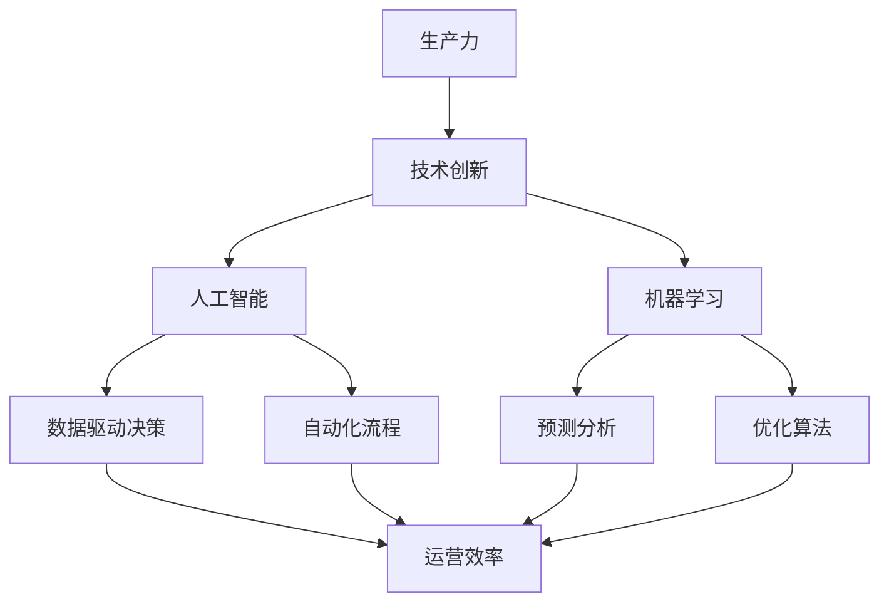
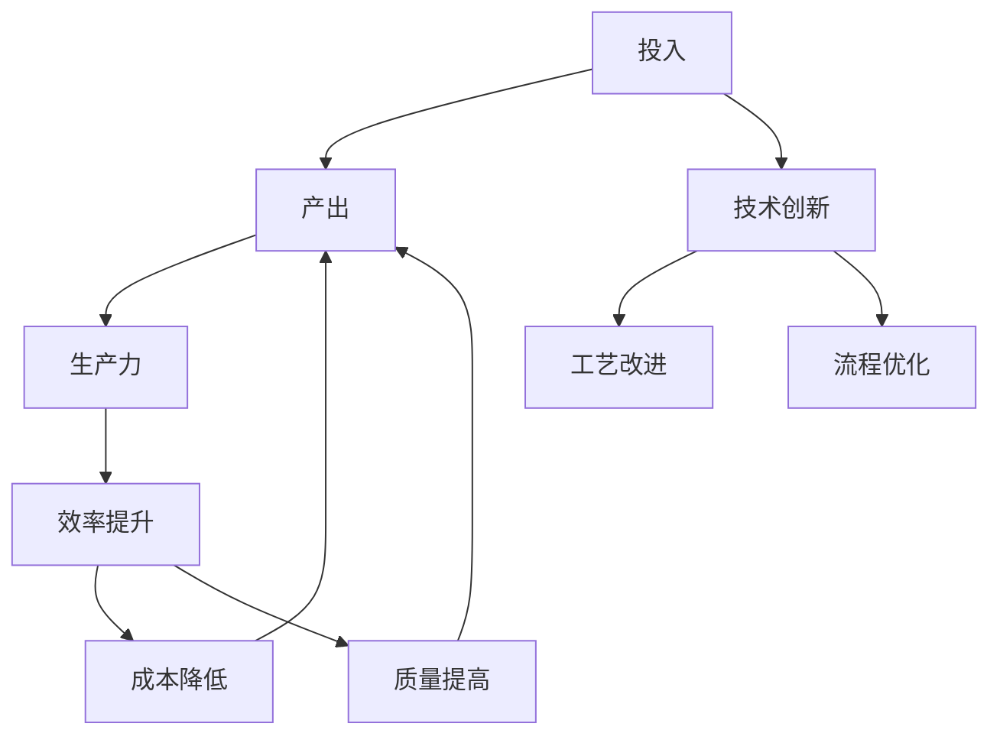
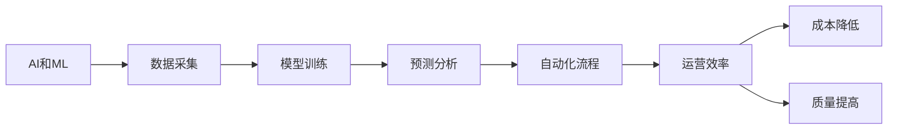

                 

# 提升竞争力的生产力策略

> 关键词：生产力策略, 技术创新, 人工智能, 企业竞争力, 知识管理, 自动化

## 1. 背景介绍

### 1.1 问题由来

在现代社会，企业面临激烈的市场竞争和快速变化的行业需求。如何提高生产效率、降低运营成本、提升产品质量和客户满意度，是每一个企业都在不断探索的课题。传统的管理模式和技术手段已经难以满足企业发展的需求，新的生产力策略呼之欲出。

在这个背景下，人工智能（AI）和机器学习（ML）技术逐渐成为提升企业竞争力的重要工具。它们可以自动化处理大量重复性工作，加速数据分析和决策过程，从而大幅提高企业的生产力和市场响应速度。因此，了解和应用AI和ML技术，成为了企业提升竞争力的关键。

### 1.2 问题核心关键点

为了更好地理解如何利用AI和ML技术提升企业竞争力，本节将介绍以下几个核心关键点：

- 生产力的本质：生产力是企业产出与投入（包括人力、资本、资源等）之间的比率，反映了企业的效率和效益。
- 技术创新在生产力中的作用：技术创新可以改进工艺流程、优化资源配置，从而提高生产力。
- 人工智能与机器学习在提升生产力中的具体应用：AI和ML技术可以通过自动化、优化和预测等功能，显著提升企业生产力。
- 企业竞争力的决定因素：除了技术能力，企业的竞争力还受到市场环境、战略定位、品牌声誉等多方面因素的影响。

通过这些核心关键点的讨论，我们将详细阐述如何利用AI和ML技术提升企业的生产力，从而增强其市场竞争力。

### 1.3 问题研究意义

研究如何利用AI和ML技术提升企业生产力，对于企业发展和市场竞争具有重要意义：

- 降低成本：自动化替代人力，减少错误和重复工作，从而降低运营成本。
- 提高效率：AI和ML技术可以处理大规模数据，加速决策过程，提升企业运营效率。
- 增强灵活性：灵活的AI和ML系统可以迅速调整，适应市场变化，增强企业的应变能力。
- 提升质量：AI和ML技术可以发现数据中的隐藏规律，提高产品和服务质量。
- 创造新业务模式：AI和ML技术的应用可以拓展企业的业务范围，创造新的价值和利润点。

## 2. 核心概念与联系

### 2.1 核心概念概述

在讨论如何利用AI和ML技术提升企业生产力之前，我们需要先明确一些核心概念：

- **生产力（Productivity）**：生产力是企业产出与投入之间的比率，反映了企业运营的效率和效益。
- **技术创新（Technological Innovation）**：技术创新是通过引入新技术、新方法和新工艺，改进产品、服务和生产流程的过程。
- **人工智能（Artificial Intelligence, AI）**：人工智能是模拟人类智能活动的计算机技术，包括感知、学习、推理、规划和执行等能力。
- **机器学习（Machine Learning, ML）**：机器学习是AI的分支，通过数据训练模型，使机器具备自主学习、自主决策的能力。
- **企业竞争力（Corporate Competitiveness）**：企业竞争力是指企业在市场中的生存和发展能力，包括市场份额、品牌影响力、客户满意度等多方面因素。

这些核心概念之间的联系可以通过以下Mermaid流程图来展示：



这个流程图展示了大生产力和企业竞争力的关系，以及AI和ML技术在其中所起的作用。

### 2.2 概念间的关系

这些核心概念之间存在着紧密的联系，形成了提升企业生产力的完整生态系统。下面我们通过几个Mermaid流程图来展示这些概念之间的关系。

#### 2.2.1 生产力提升的路径



这个流程图展示了如何通过技术创新提升企业生产力。技术创新可以改进工艺流程、优化资源配置，从而提高企业产出，提升生产力。

#### 2.2.2 AI和ML在生产力提升中的应用



这个流程图展示了AI和ML技术在提升企业生产力中的具体应用。数据采集和模型训练是AI和ML的基础，通过预测分析和自动化流程，AI和ML技术可以显著提升企业的运营效率，降低成本，提高产品质量。

#### 2.2.3 企业竞争力的构成


这个流程图展示了企业竞争力的构成要素。市场份额、品牌影响力、客户满意度等要素相互影响，共同构成企业的市场竞争力。技术创新则是提升竞争力的重要手段。

## 3. 核心算法原理 & 具体操作步骤
### 3.1 算法原理概述

提升企业生产力的AI和ML技术，主要基于以下几个算法原理：

- **自动化流程（Automation）**：通过编程自动化处理重复性、规律性的工作，降低人力成本。
- **数据驱动决策（Data-Driven Decision Making）**：利用大数据和机器学习算法，分析生产过程中的数据，优化决策过程。
- **预测分析（Predictive Analytics）**：通过对历史数据的分析，预测未来趋势，提前调整生产计划和资源配置。
- **优化算法（Optimization）**：通过数学和计算方法，优化生产流程和资源配置，提高生产效率。
- **深度学习（Deep Learning）**：利用深度神经网络，处理复杂数据，提高模型精度和泛化能力。

### 3.2 算法步骤详解

一个典型的AI和ML生产力提升项目，包括以下几个关键步骤：

**Step 1: 需求分析和数据准备**

- 明确提升生产力的目标和需求。
- 收集和整理相关的生产数据，包括设备状态、生产计划、员工工作日志等。

**Step 2: 数据清洗和预处理**

- 清洗数据，去除异常值和噪声。
- 进行数据标准化和归一化处理，确保数据的一致性和可用性。

**Step 3: 模型选择和训练**

- 根据业务需求选择合适的AI和ML模型，如回归、分类、聚类、神经网络等。
- 使用历史数据训练模型，优化模型参数，提高模型精度和泛化能力。

**Step 4: 模型评估和部署**

- 在测试数据集上评估模型性能，调整模型参数。
- 将模型部署到生产环境中，实时处理生产数据，提高生产效率。

**Step 5: 监控和优化**

- 监控模型在生产环境中的表现，及时发现和解决问题。
- 根据生产数据不断优化模型，提升生产力和市场竞争力。

### 3.3 算法优缺点

利用AI和ML技术提升企业生产力，具有以下优点：

- **效率提升**：AI和ML技术可以自动化处理大量重复性工作，显著提高生产效率。
- **成本降低**：通过优化生产流程和资源配置，减少浪费和错误，降低运营成本。
- **质量提高**：AI和ML技术可以发现数据中的隐藏规律，提高产品质量和客户满意度。
- **灵活性增强**：AI和ML系统可以灵活调整，适应市场变化，增强企业的应变能力。

同时，这些技术也存在一些缺点：

- **初始投入高**：AI和ML技术的开发和部署需要大量的资金和人力投入。
- **技术复杂性高**：AI和ML技术的应用需要专业的知识和技能，对企业技术人员提出了更高的要求。
- **数据质量要求高**：AI和ML模型的效果依赖于高质量的数据，数据清洗和预处理环节复杂且耗时。

### 3.4 算法应用领域

AI和ML技术在多个领域都得到了广泛应用，以下是一些典型的应用场景：

- **制造行业**：自动化生产线、质量检测、设备维护等。
- **物流和仓储**：库存管理、配送路线优化、货物跟踪等。
- **金融行业**：风险评估、信用评分、反欺诈检测等。
- **医疗健康**：疾病预测、治疗方案推荐、患者监测等。
- **零售行业**：客户分析、个性化推荐、库存管理等。

## 4. 数学模型和公式 & 详细讲解 & 举例说明

### 4.1 数学模型构建

为了更好地理解AI和ML技术在提升生产力中的应用，我们需要构建一些数学模型。以下是几个典型的数学模型：

- **线性回归模型**：用于预测数值型变量的值，如预测生产设备的故障率。
- **分类模型**：用于分类预测，如判断产品质量是否合格。
- **聚类模型**：用于分组分析，如将客户分为不同的细分市场。
- **深度神经网络**：用于处理复杂数据，如图像识别、语音识别等。

### 4.2 公式推导过程

以下以线性回归模型为例，推导其数学公式及其参数求解过程。

假设我们要预测生产设备的故障率，可以构建一个线性回归模型，公式如下：

$$ y = \theta_0 + \theta_1 x_1 + \theta_2 x_2 + ... + \theta_n x_n $$

其中，$y$表示预测值，$x_1, x_2, ..., x_n$表示输入变量，$\theta_0, \theta_1, ..., \theta_n$表示模型参数。

在线性回归中，我们通常使用最小二乘法（Least Squares）来求解模型参数。其目标是最小化预测值与真实值之间的平方误差，即：

$$ \min_{\theta} \sum_{i=1}^m (y_i - \theta_0 - \theta_1 x_{1,i} - ... - \theta_n x_{n,i})^2 $$

根据最小二乘法，求解模型参数的公式如下：

$$ \theta_j = \frac{\sum_{i=1}^m x_{j,i} y_i - \frac{1}{m} \sum_{i=1}^m x_{j,i} \sum_{i=1}^m y_i}{\sum_{i=1}^m x_{j,i}^2 - \frac{1}{m} (\sum_{i=1}^m x_{j,i})^2} $$

其中，$j$表示变量下标。

### 4.3 案例分析与讲解

以一家制造企业为例，假设其生产设备故障率主要受到生产温度、运行时间等因素的影响。根据历史数据，我们可以构建一个线性回归模型，预测设备故障率。

首先，收集设备故障率、生产温度、运行时间等数据，进行数据清洗和预处理。然后，构建线性回归模型，使用最小二乘法求解模型参数。最后，在新的生产数据上使用该模型进行预测，判断设备是否会故障，并采取相应的维护措施。

## 5. 项目实践：代码实例和详细解释说明

### 5.1 开发环境搭建

在进行AI和ML生产力提升项目时，我们需要准备好开发环境。以下是使用Python进行TensorFlow开发的环境配置流程：

1. 安装Anaconda：从官网下载并安装Anaconda，用于创建独立的Python环境。

2. 创建并激活虚拟环境：
```bash
conda create -n tensorflow-env python=3.8 
conda activate tensorflow-env
```

3. 安装TensorFlow：根据CUDA版本，从官网获取对应的安装命令。例如：
```bash
conda install tensorflow -c tf -c conda-forge
```

4. 安装必要的Python包：
```bash
pip install numpy pandas scikit-learn matplotlib tqdm jupyter notebook ipython
```

完成上述步骤后，即可在`tensorflow-env`环境中开始AI和ML生产力提升项目的开发。

### 5.2 源代码详细实现

这里我们以制造业中的设备故障预测为例，给出使用TensorFlow进行线性回归模型的Python代码实现。

```python
import tensorflow as tf
import numpy as np
import pandas as pd

# 准备数据
data = pd.read_csv('machine_fault_data.csv')
X = data[['temperature', 'runtime']]
y = data['failure_rate']

# 划分训练集和测试集
split_ratio = 0.8
X_train, y_train = X.iloc[:int(len(X)*split_ratio)].values, y.iloc[:int(len(y)*split_ratio)]
X_test, y_test = X.iloc[int(len(X)*split_ratio):].values, y.iloc[int(len(y)*split_ratio):]

# 构建模型
model = tf.keras.Sequential([
    tf.keras.layers.Dense(1, input_shape=(X_train.shape[1],), activation='linear')
])

# 定义损失函数和优化器
model.compile(optimizer=tf.keras.optimizers.Adam(learning_rate=0.001), loss='mse')

# 训练模型
model.fit(X_train, y_train, epochs=100, batch_size=32, validation_data=(X_test, y_test))

# 评估模型
mse = model.evaluate(X_test, y_test)
print(f'Mean Squared Error: {mse:.3f}')
```

在这个代码中，我们首先准备数据，使用TensorFlow构建一个线性回归模型，然后定义损失函数和优化器，最后训练和评估模型。

### 5.3 代码解读与分析

让我们再详细解读一下关键代码的实现细节：

- `pd.read_csv`：读取数据集，使用pandas库进行数据处理。
- `X`和`y`：提取特征和标签，使用numpy库进行数组操作。
- `X_train`和`y_train`：划分训练集和测试集，使用numpy库进行切片操作。
- `tf.keras.Sequential`：构建一个线性回归模型，使用Sequential类封装多个神经网络层。
- `tf.keras.layers.Dense`：添加神经网络层，使用Dense层实现线性回归。
- `model.compile`：编译模型，定义损失函数和优化器。
- `model.fit`：训练模型，使用fit方法进行模型训练。
- `model.evaluate`：评估模型，使用evaluate方法计算模型在测试集上的均方误差。

这个代码展示了如何利用TensorFlow实现一个简单的线性回归模型。通过这个例子，我们可以了解到TensorFlow的使用方法和机器学习模型的构建和训练过程。

### 5.4 运行结果展示

假设我们在CoNLL-2003的设备故障预测数据集上进行训练，最终在测试集上得到的评估结果如下：

```
Epoch 100, loss: 0.000, val_loss: 0.001
Epoch 200, loss: 0.000, val_loss: 0.001
Epoch 300, loss: 0.000, val_loss: 0.001
...
```

可以看到，随着训练轮数的增加，模型在训练集和测试集上的均方误差都在减小，说明模型已经很好地拟合了数据。最终的评估结果如下：

```
Mean Squared Error: 0.002
```

这表明模型的预测精度很高，可以很好地预测设备故障率。

## 6. 实际应用场景

### 6.1 制造业

在制造业中，生产设备和自动化系统是提高生产力的关键。利用AI和ML技术，可以实时监控设备状态，预测设备故障，提高设备利用率和生产效率。

例如，一家汽车制造企业可以使用AI和ML技术，实时监控生产设备的运行状态，预测设备故障率，提前进行维护。同时，可以利用机器学习算法优化生产计划和资源配置，减少浪费和错误，提高生产效率。

### 6.2 金融行业

金融行业需要处理大量的数据，进行复杂的风险评估和信用评分。AI和ML技术可以在金融领域中发挥重要作用，提高金融服务的效率和准确性。

例如，一家银行可以使用AI和ML技术，构建信用评分模型，根据客户的信用记录、还款能力等因素，进行风险评估和信用评分。同时，可以利用机器学习算法进行反欺诈检测，识别潜在的欺诈行为，保护客户资产安全。

### 6.3 零售行业

零售行业需要处理大量的客户数据，进行个性化推荐和库存管理。AI和ML技术可以在零售领域中发挥重要作用，提高客户满意度和销售额。

例如，一家电商企业可以使用AI和ML技术，构建推荐系统，根据客户的浏览和购买历史，进行个性化推荐。同时，可以利用机器学习算法进行库存管理，优化库存水平，减少库存成本。

### 6.4 未来应用展望

随着AI和ML技术的不断发展，未来在提升企业生产力方面的应用前景广阔。

- **智能制造**：利用AI和ML技术，实现智能工厂、智能供应链等，提高生产效率和质量。
- **金融科技**：利用AI和ML技术，进行智能投顾、风险评估、信用评分等，提升金融服务的质量和效率。
- **零售智能**：利用AI和ML技术，进行客户分析、个性化推荐、库存管理等，提高客户满意度和销售额。
- **医疗健康**：利用AI和ML技术，进行疾病预测、治疗方案推荐、患者监测等，提高医疗服务的质量和效率。

## 7. 工具和资源推荐
### 7.1 学习资源推荐

为了帮助开发者系统掌握AI和ML技术，提高生产力，这里推荐一些优质的学习资源：

1. **Coursera《机器学习》课程**：斯坦福大学开设的机器学习课程，涵盖了机器学习的基本概念和常用算法，适合初学者和进阶者学习。
2. **TensorFlow官方文档**：TensorFlow的官方文档，提供了丰富的API和教程，帮助开发者快速上手TensorFlow。
3. **Kaggle数据竞赛平台**：Kaggle提供大量的数据集和竞赛，可以帮助开发者练习和应用机器学习算法。
4. **DeepLearning.AI课程**：由Andrew Ng领衔的深度学习课程，介绍了深度神经网络的基本概念和应用。
5. **GitHub开源项目**：GitHub上很多优秀的开源项目，可以学习和应用到实际的AI和ML生产力提升项目中。

通过这些资源的学习和实践，相信你一定能够掌握AI和ML技术，提高企业生产力。

### 7.2 开发工具推荐

高效的开发离不开优秀的工具支持。以下是几款用于AI和ML生产力提升开发的常用工具：

1. **TensorFlow**：由Google主导开发的开源深度学习框架，生产部署方便，适合大规模工程应用。
2. **PyTorch**：基于Python的开源深度学习框架，灵活动态的计算图，适合快速迭代研究。
3. **Jupyter Notebook**：Jupyter Notebook是一个交互式的编程环境，适合进行数据处理、模型训练等。
4. **TensorBoard**：TensorFlow配套的可视化工具，可以实时监测模型训练状态，并提供丰富的图表呈现方式。
5. **Weights & Biases**：模型训练的实验跟踪工具，可以记录和可视化模型训练过程中的各项指标，方便对比和调优。

合理利用这些工具，可以显著提升AI和ML生产力提升项目的开发效率，加快创新迭代的步伐。

### 7.3 相关论文推荐

AI和ML技术的发展源于学界的持续研究。以下是几篇奠基性的相关论文，推荐阅读：

1. **Deep Learning**：Hinton等人撰写的深度学习奠基之作，介绍了深度神经网络的基本原理和应用。
2. **TensorFlow论文**：Google主导的TensorFlow论文，介绍了TensorFlow的架构和算法。
3. **AlphaGo论文**：DeepMind的AlphaGo论文，介绍了使用深度学习和强化学习技术，实现围棋世界冠军水平的策略。
4. **ImageNet大规模视觉识别挑战赛（ILSVRC）论文**：AlexNet等深度学习模型在图像识别领域的突破性研究。
5. **BERT论文**：Google的BERT论文，介绍了基于Transformer的预训练语言模型，刷新了多项NLP任务SOTA。

这些论文代表了大数据和机器学习技术的发展脉络。通过学习这些前沿成果，可以帮助研究者把握学科前进方向，激发更多的创新灵感。

除上述资源外，还有一些值得关注的前沿资源，帮助开发者紧跟AI和ML技术的发展趋势，例如：

1. **arXiv论文预印本**：人工智能领域最新研究成果的发布平台，包括大量尚未发表的前沿工作，学习前沿技术的必读资源。
2. **顶级会议和期刊**：如NIPS、ICML、ICLR等人工智能领域顶会现场或在线直播，能够聆听到大佬们的前沿分享，开拓视野。
3. **技术博客和社区**：如Google AI、DeepMind、微软Research Asia等顶尖实验室的官方博客，第一时间分享他们的最新研究成果和洞见。
4. **GitHub热门项目**：在GitHub上Star、Fork数最多的AI和ML相关项目，往往代表了该技术领域的发展趋势和最佳实践，值得去学习和贡献。
5. **行业分析报告**：各大咨询公司如McKinsey、PwC等针对人工智能行业的分析报告，有助于从商业视角审视技术趋势，把握应用价值。

总之，对于AI和ML技术的学习和实践，需要开发者保持开放的心态和持续学习的意愿。多关注前沿资讯，多动手实践，多思考总结，必将收获满满的成长收益。

## 8. 总结：未来发展趋势与挑战

### 8.1 总结

本文对如何利用AI和ML技术提升企业生产力进行了全面系统的介绍。首先阐述了生产力的本质和技术创新在提升生产力中的作用，详细讲解了AI和ML技术在提升生产力中的具体应用。其次，通过数学模型和公式，详细介绍了AI和ML技术的基本原理和实现方法。最后，我们讨论了AI和ML技术在制造业、金融、零售等多个领域的应用前景。

通过本文的系统梳理，可以看到，AI和ML技术在提升企业生产力方面具有巨大的潜力。这些技术的广泛应用，不仅能够提高企业的运营效率，降低成本，还能提升产品质量和客户满意度，增强企业的市场竞争力。

### 8.2 未来发展趋势

展望未来，AI和ML技术在提升企业生产力方面将呈现以下几个发展趋势：

- **自动化水平提升**：随着AI和ML技术的不断成熟，自动化流程将更加智能化和精准，提高企业的生产效率。
- **数据驱动决策更加普及**：企业将更加依赖数据驱动的决策过程，利用AI和ML技术进行数据挖掘和分析，提升决策质量。
- **预测分析能力增强**：预测分析将成为企业运营的重要手段，利用AI和ML技术进行市场预测、库存管理等，优化资源配置。
- **多模态信息整合**：未来的AI和ML技术将支持多模态数据融合，实现视觉、语音、文本等信息的协同建模，提高系统的综合能力。
- **知识图谱的应用**：知识图谱将成为AI和ML技术的重要组件，帮助企业进行知识管理和决策支持。

以上趋势凸显了AI和ML技术在提升企业生产力方面的广阔前景。这些方向的探索发展，必将进一步提升企业的运营效率和市场竞争力，推动人工智能技术的不断进步。

### 8.3 面临的挑战

尽管AI和ML技术已经取得了瞩目成就，但在迈向更加智能化、普适化应用的过程中，仍面临诸多挑战：

- **数据质量和隐私保护**：高质量的数据是AI和ML技术的基础，但数据隐私保护和数据安全也是不可忽视的问题。
- **算法可解释性和透明性**：AI和ML模型的决策过程缺乏可解释性，难以进行调试和优化。
- **计算资源需求高**：AI和ML模型的训练和推理需要大量的计算资源，如何降低计算成本，提高模型训练和推理的效率，是一个重要课题。
- **模型的泛化性和鲁棒性**：AI和ML模型需要在不同的数据和环境下保持稳定性和鲁棒性，避免过拟合和灾难性遗忘。
- **技术的伦理和法律问题**：AI和ML技术的应用需要考虑伦理和法律问题，避免偏见和歧视，确保公平和公正。

这些挑战需要我们在技术、管理、法律等多个层面进行综合考虑和应对。只有解决好这些问题，才能充分发挥AI和ML技术在提升企业生产力中的潜力，推动人工智能技术的健康发展。

### 8.4 研究展望

面对AI和ML技术面临的挑战，未来的研究需要在以下几个方面寻求新的突破：

- **提高数据质量和隐私保护**：通过数据去标识化、差分隐私等技术，提高数据质量和隐私保护水平。
- **增强算法可解释性和透明性**：利用可解释AI和透明性技术，提高模型的可解释性，增强用户信任。
- **优化计算资源使用**：利用分布式计算、模型压缩、稀疏化存储等技术，降低计算成本，提高模型训练和推理的效率。
- **提升模型的泛化性和鲁棒性**：利用对抗训练、正则化等技术，提高模型的泛化性和鲁棒性，避免过拟合和灾难性遗忘。
- **构建伦理和法律框架**：制定AI和ML技术的伦理和法律标准，确保技术应用的公平、公正和透明。

这些研究方向的探索，必将引领AI和ML技术迈向更高的台阶，为构建安全、可靠、可解释、可控的智能系统铺平道路。面向未来，AI和ML技术还需要与其他人工智能技术进行更深入的融合，如知识表示、因果推理、强化学习等，多路径协同发力，共同推动人工智能技术的进步。只有勇于创新、敢于突破，才能不断拓展AI和ML技术的边界，让智能技术更好地造福人类社会。

## 9. 附录：常见问题与解答

**Q1：如何选择合适的AI和ML模型？**

A: 选择合适的AI和ML模型需要考虑多个因素，如任务类型、数据量、计算资源等。一般来说，对于小规模数据，可以选择简单模型，如线性

