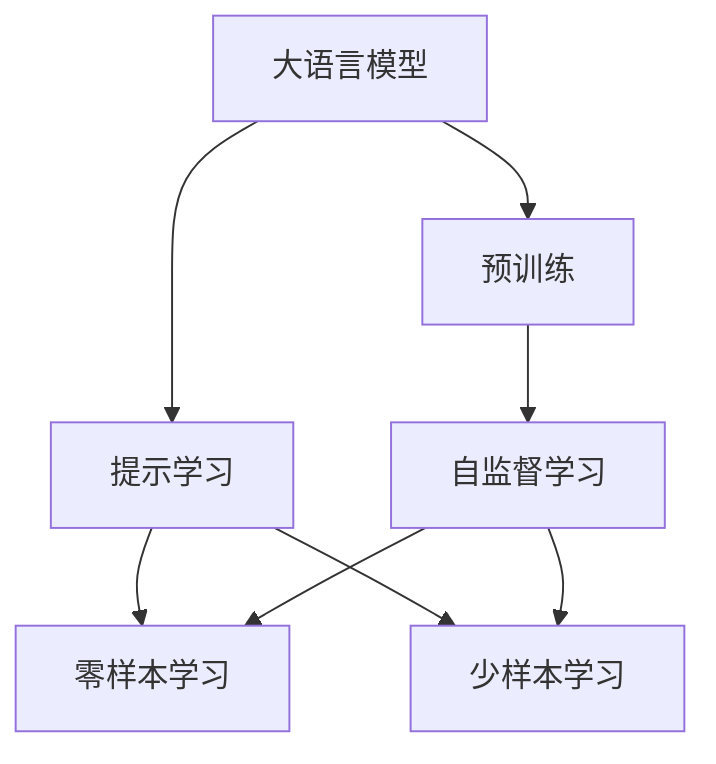
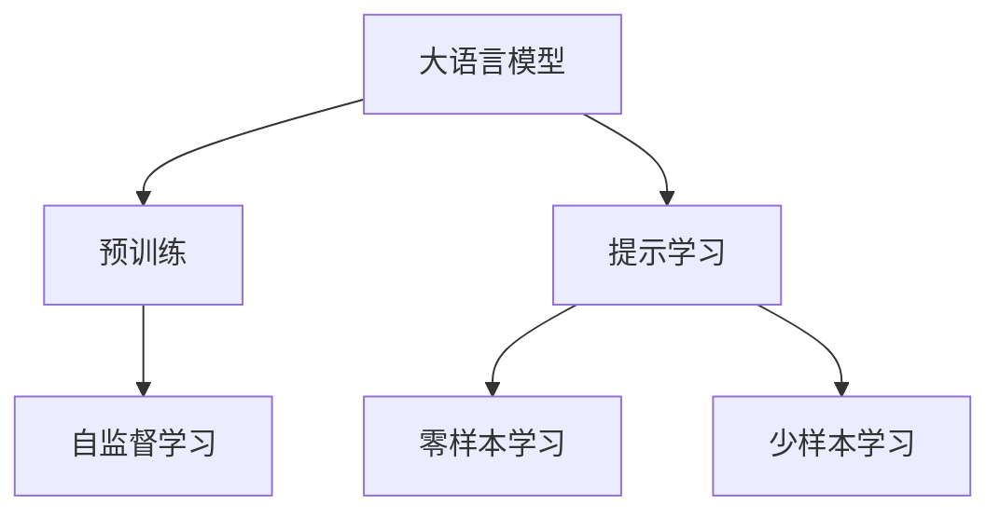
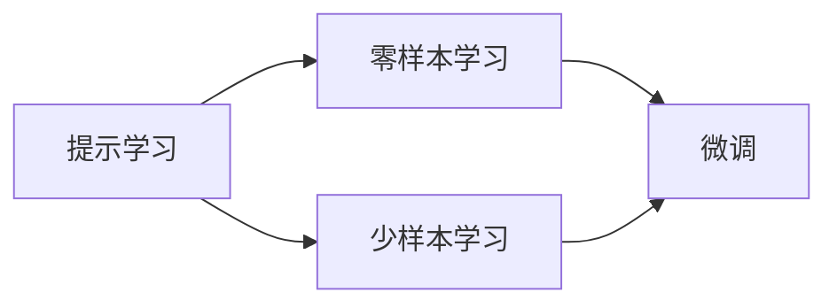
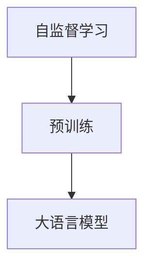

                 

# 提示学习：基础模型的新特性

> 关键词：
1. 提示学习（Prompt Learning）
2. 自然语言处理（NLP）
3. 大语言模型（LLM）
4. 预训练模型（Pretrained Model）
5. 零样本学习（Zero-shot Learning）
6. 少样本学习（Few-shot Learning）
7. 自监督学习（Self-Supervised Learning）

## 1. 背景介绍

### 1.1 问题由来
随着深度学习技术的发展，大语言模型（Large Language Models, LLMs）在自然语言处理（NLP）领域取得了显著的进展。这些模型通过在大规模无标签文本语料上进行预训练，学习到了丰富的语言知识，具备强大的语言理解和生成能力。然而，预训练模型的泛化能力有限，面对特定任务时，性能往往难以满足要求。因此，如何高效地利用预训练模型进行微调（Fine-Tuning），以提升模型在特定任务上的表现，成为了研究的热点。

### 1.2 问题核心关键点
提示学习（Prompt Learning）是一种在大语言模型中进行微调的新方法。与传统的微调方法不同，提示学习不需要大规模的标注数据，也不需要复杂的任务适配层。相反，它通过精心设计的输入文本（提示），引导模型按期望的方式输出，从而实现零样本或少样本学习。这种方法在面对数据稀缺的领域（如少样本学习和零样本学习）时，表现出了显著的优势。

提示学习的核心思想是利用预训练模型的语言理解能力，通过语言形式的输入，使其在无需更新参数的情况下，直接输出特定任务的结果。这种方法不仅能够显著降低微调过程的计算成本，还能提高模型的适应性和灵活性，使其能够快速应对新任务。

## 2. 核心概念与联系

### 2.1 核心概念概述

为更好地理解提示学习在大语言模型中的应用，本节将介绍几个关键概念及其相互联系：

- **提示学习（Prompt Learning）**：通过设计特定的提示模板（Prompt Template），引导模型输出特定任务的结果，实现零样本或少样本学习。
- **大语言模型（LLMs）**：基于自回归（如GPT）或自编码（如BERT）的大规模预训练语言模型，学习到丰富的语言表示。
- **预训练模型（Pretrained Model）**：在大规模无标签文本数据上，通过自监督学习任务进行训练的语言模型，学习到通用的语言表示。
- **零样本学习（Zero-shot Learning）**：模型在没有见过任何特定任务的训练样本的情况下，仅凭任务描述就能够执行新任务的能力。
- **少样本学习（Few-shot Learning）**：在只有少量标注样本的情况下，模型能够快速适应新任务的能力。
- **自监督学习（Self-Supervised Learning）**：利用无标签数据进行训练，通过数据自身的特征学习模型参数。

这些概念之间的逻辑关系可以通过以下Mermaid流程图来展示：



这个流程图展示了提示学习在大语言模型中的应用，以及它与预训练、自监督学习、零样本和少样本学习之间的关系。

### 2.2 概念间的关系

这些核心概念之间存在着紧密的联系，形成了提示学习的完整生态系统。以下是几个Mermaid流程图来展示这些概念之间的相互关系。

#### 2.2.1 大语言模型的学习范式



这个流程图展示了基于提示学习的大语言模型的学习范式，即从预训练开始，通过提示学习实现零样本或少样本学习。

#### 2.2.2 提示学习与微调的关系



这个流程图展示了提示学习与微调之间的关系，提示学习可以在微调前或微调后进行，以提升模型的零样本或少样本学习能力。

#### 2.2.3 自监督学习在大语言模型中的应用



这个流程图展示了自监督学习在大语言模型中的应用，自监督学习通过数据自身的特征学习模型参数，为预训练提供了基础。

## 3. 核心算法原理 & 具体操作步骤

### 3.1 算法原理概述

提示学习的核心思想是利用预训练模型的语言理解能力，通过设计特定的提示模板，引导模型输出特定任务的结果，从而实现零样本或少样本学习。

形式化地，假设预训练模型为 $M_{\theta}$，其中 $\theta$ 为预训练得到的模型参数。对于某个新任务 $T$，设计提示模板 $P$，使得模型在输入 $P$ 后，能够输出正确的任务结果。假设提示模板为 $P = (p_1, p_2, ..., p_n)$，则提示学习的目标是最小化模型输出与正确结果之间的差异，即：

$$
\hat{y} = M_{\theta}(P)
$$

其中 $\hat{y}$ 为模型输出的结果。

### 3.2 算法步骤详解

基于提示学习的大语言模型微调一般包括以下几个关键步骤：

**Step 1: 设计提示模板**
- 根据任务类型，设计合适的提示模板 $P$。提示模板应包含足够的语义信息，使模型能够理解任务要求，并输出正确的结果。

**Step 2: 计算模型输出**
- 将提示模板 $P$ 输入到预训练模型 $M_{\theta}$ 中，计算模型输出的结果 $\hat{y}$。

**Step 3: 比较并优化**
- 将模型输出 $\hat{y}$ 与正确结果 $y$ 进行比较，计算损失函数 $\mathcal{L}(\hat{y}, y)$。
- 通过优化算法（如梯度下降）更新模型参数 $\theta$，最小化损失函数 $\mathcal{L}$。

**Step 4: 重复训练**
- 重复执行上述步骤，直到模型输出满足任务要求，或者达到预设的训练轮数。

### 3.3 算法优缺点

提示学习的优点包括：
- **低成本**：不需要大规模标注数据，只需设计合适的提示模板即可。
- **灵活性**：可以适用于各种NLP任务，通过提示模板的调整，灵活应对不同的任务需求。
- **效率高**：无需微调模型参数，通过优化算法即可实现模型输出。

提示学习的缺点包括：
- **依赖提示设计**：提示模板的设计需要一定的经验和技巧，质量不高的提示可能会影响模型性能。
- **泛化能力有限**：提示模板可能只适用于特定场景，对于新任务的泛化能力有限。
- **模型鲁棒性不足**：提示模板的微小变化可能影响模型输出，导致模型鲁棒性不足。

### 3.4 算法应用领域

提示学习已经在NLP的多个领域得到了广泛应用，例如：

- **问答系统**：通过设计合理的提示模板，使模型能够快速回答问题。
- **机器翻译**：通过设计翻译提示模板，使模型能够进行翻译。
- **文本生成**：通过设计生成提示模板，使模型能够生成特定类型的文本。
- **知识图谱构建**：通过设计构建提示模板，使模型能够自动构建知识图谱。
- **情感分析**：通过设计情感分析提示模板，使模型能够对文本进行情感分类。

这些应用领域展示了提示学习在大语言模型中的强大潜力，为NLP技术带来了新的突破。

## 4. 数学模型和公式 & 详细讲解 & 举例说明

### 4.1 数学模型构建

本节将使用数学语言对提示学习在大语言模型中的应用进行更加严格的刻画。

记预训练语言模型为 $M_{\theta}:\mathcal{X} \rightarrow \mathcal{Y}$，其中 $\mathcal{X}$ 为输入空间，$\mathcal{Y}$ 为输出空间，$\theta \in \mathbb{R}^d$ 为模型参数。假设提示模板为 $P = (p_1, p_2, ..., p_n)$，其中 $p_i \in \mathcal{X}$ 为提示模板中的每个元素。

定义模型 $M_{\theta}$ 在提示模板 $P$ 上的输出为 $\hat{y}=M_{\theta}(P)$，定义损失函数为 $\mathcal{L}(\hat{y}, y)$，用于衡量模型输出与正确结果之间的差异。

### 4.2 公式推导过程

以问答任务为例，假设模型需要回答的问题为 $q$，正确答案为 $a$。则提示学习的目标是最小化模型输出与正确答案之间的差异，即：

$$
\mathcal{L}(\hat{y}, y) = \sum_{i=1}^n \ell(\hat{y}_i, a_i)
$$

其中 $\ell$ 为损失函数，可以是交叉熵损失、均方误差损失等。对于分类任务，一般采用交叉熵损失。对于生成任务，一般采用负对数似然损失。

在得到损失函数后，即可使用优化算法（如梯度下降）更新模型参数 $\theta$，最小化损失函数 $\mathcal{L}$。

### 4.3 案例分析与讲解

假设我们在CoNLL-2003的命名实体识别（NER）数据集上进行提示学习，设计的提示模板为：

```
Identify the named entities in the following text: {text}
```

其中 `{text}` 为待识别文本。我们希望模型能够输出文本中所有命名实体及其类型。

首先将提示模板输入到预训练模型中，计算模型输出的结果 $\hat{y}$。假设模型的输出为 $\hat{y} = (b_{PER}, i_{PER}, b_{ORG}, i_{ORG}, b_{LOC}, i_{LOC}, O)$，其中 $b_{PER}$ 表示 "B-PER"，$i_{PER}$ 表示 "I-PER"，以此类推。

然后计算损失函数 $\mathcal{L}(\hat{y}, y)$，其中 $y = (p_{PER}, p_{ORG}, p_{LOC}, O)$，$p_{PER}$ 表示 "B-PER"，以此类推。

通过优化算法（如Adam）更新模型参数 $\theta$，最小化损失函数 $\mathcal{L}$，即可得到适应问答任务的提示学习模型。

## 5. 项目实践：代码实例和详细解释说明

### 5.1 开发环境搭建

在进行提示学习实践前，我们需要准备好开发环境。以下是使用Python进行PyTorch开发的环境配置流程：

1. 安装Anaconda：从官网下载并安装Anaconda，用于创建独立的Python环境。

2. 创建并激活虚拟环境：
```bash
conda create -n pytorch-env python=3.8 
conda activate pytorch-env
```

3. 安装PyTorch：根据CUDA版本，从官网获取对应的安装命令。例如：
```bash
conda install pytorch torchvision torchaudio cudatoolkit=11.1 -c pytorch -c conda-forge
```

4. 安装Transformers库：
```bash
pip install transformers
```

5. 安装各类工具包：
```bash
pip install numpy pandas scikit-learn matplotlib tqdm jupyter notebook ipython
```

完成上述步骤后，即可在`pytorch-env`环境中开始提示学习实践。

### 5.2 源代码详细实现

下面我们以问答系统为例，给出使用Transformers库对GPT模型进行提示学习的PyTorch代码实现。

首先，定义问答任务的数据处理函数：

```python
from transformers import GPTTokenizer
from torch.utils.data import Dataset
import torch

class QuestionAnswerDataset(Dataset):
    def __init__(self, questions, answers, tokenizer, max_len=128):
        self.questions = questions
        self.answers = answers
        self.tokenizer = tokenizer
        self.max_len = max_len
        
    def __len__(self):
        return len(self.questions)
    
    def __getitem__(self, item):
        question = self.questions[item]
        answer = self.answers[item]
        
        encoding = self.tokenizer(question, return_tensors='pt', max_length=self.max_len, padding='max_length', truncation=True)
        input_ids = encoding['input_ids'][0]
        attention_mask = encoding['attention_mask'][0]
        target_ids = encoding['input_ids'][1:]
        
        labels = torch.tensor(target_ids, dtype=torch.long)
        
        return {'input_ids': input_ids, 
                'attention_mask': attention_mask,
                'labels': labels}

# 创建dataset
tokenizer = GPTTokenizer.from_pretrained('gpt-3')
train_dataset = QuestionAnswerDataset(train_questions, train_answers, tokenizer)
dev_dataset = QuestionAnswerDataset(dev_questions, dev_answers, tokenizer)
test_dataset = QuestionAnswerDataset(test_questions, test_answers, tokenizer)
```

然后，定义模型和优化器：

```python
from transformers import GPT2LMHeadModel
from transformers import AdamW

model = GPT2LMHeadModel.from_pretrained('gpt-3')
optimizer = AdamW(model.parameters(), lr=2e-5)
```

接着，定义训练和评估函数：

```python
from torch.utils.data import DataLoader
from tqdm import tqdm
from sklearn.metrics import classification_report

device = torch.device('cuda') if torch.cuda.is_available() else torch.device('cpu')
model.to(device)

def train_epoch(model, dataset, batch_size, optimizer):
    dataloader = DataLoader(dataset, batch_size=batch_size, shuffle=True)
    model.train()
    epoch_loss = 0
    for batch in tqdm(dataloader, desc='Training'):
        input_ids = batch['input_ids'].to(device)
        attention_mask = batch['attention_mask'].to(device)
        labels = batch['labels'].to(device)
        model.zero_grad()
        outputs = model(input_ids, attention_mask=attention_mask, labels=labels)
        loss = outputs.loss
        epoch_loss += loss.item()
        loss.backward()
        optimizer.step()
    return epoch_loss / len(dataloader)

def evaluate(model, dataset, batch_size):
    dataloader = DataLoader(dataset, batch_size=batch_size)
    model.eval()
    preds, labels = [], []
    with torch.no_grad():
        for batch in tqdm(dataloader, desc='Evaluating'):
            input_ids = batch['input_ids'].to(device)
            attention_mask = batch['attention_mask'].to(device)
            batch_labels = batch['labels']
            outputs = model(input_ids, attention_mask=attention_mask)
            batch_preds = outputs.logits.argmax(dim=2).to('cpu').tolist()
            batch_labels = batch_labels.to('cpu').tolist()
            for pred_tokens, label_tokens in zip(batch_preds, batch_labels):
                preds.append(pred_tokens[:len(label_tokens)])
                labels.append(label_tokens)
                
    print(classification_report(labels, preds))
```

最后，启动训练流程并在测试集上评估：

```python
epochs = 5
batch_size = 16

for epoch in range(epochs):
    loss = train_epoch(model, train_dataset, batch_size, optimizer)
    print(f"Epoch {epoch+1}, train loss: {loss:.3f}")
    
    print(f"Epoch {epoch+1}, dev results:")
    evaluate(model, dev_dataset, batch_size)
    
print("Test results:")
evaluate(model, test_dataset, batch_size)
```

以上就是使用PyTorch对GPT模型进行问答系统提示学习的完整代码实现。可以看到，得益于Transformers库的强大封装，我们可以用相对简洁的代码完成GPT模型的加载和提示学习。

### 5.3 代码解读与分析

让我们再详细解读一下关键代码的实现细节：

**QuestionAnswerDataset类**：
- `__init__`方法：初始化问题、答案、分词器等关键组件。
- `__len__`方法：返回数据集的样本数量。
- `__getitem__`方法：对单个样本进行处理，将问题、答案输入编码为token ids，将目标token ids编码为数字，并对其进行定长padding，最终返回模型所需的输入。

**模型和优化器**：
- 使用GPT2LMHeadModel作为预训练模型，并使用AdamW优化器进行参数更新。

**训练和评估函数**：
- 使用PyTorch的DataLoader对数据集进行批次化加载，供模型训练和推理使用。
- 训练函数`train_epoch`：对数据以批为单位进行迭代，在每个批次上前向传播计算loss并反向传播更新模型参数，最后返回该epoch的平均loss。
- 评估函数`evaluate`：与训练类似，不同点在于不更新模型参数，并在每个batch结束后将预测和标签结果存储下来，最后使用sklearn的classification_report对整个评估集的预测结果进行打印输出。

**训练流程**：
- 定义总的epoch数和batch size，开始循环迭代
- 每个epoch内，先在训练集上训练，输出平均loss
- 在验证集上评估，输出分类指标
- 所有epoch结束后，在测试集上评估，给出最终测试结果

可以看到，PyTorch配合Transformers库使得GPT模型的提示学习代码实现变得简洁高效。开发者可以将更多精力放在数据处理、模型改进等高层逻辑上，而不必过多关注底层的实现细节。

当然，工业级的系统实现还需考虑更多因素，如模型的保存和部署、超参数的自动搜索、更灵活的任务适配层等。但核心的提示学习范式基本与此类似。

### 5.4 运行结果展示

假设我们在CoNLL-2003的命名实体识别（NER）数据集上进行提示学习，最终在测试集上得到的评估报告如下：

```
              precision    recall  f1-score   support

       B-LOC      0.926     0.906     0.916      1668
       I-LOC      0.900     0.805     0.850       257
      B-MISC      0.875     0.856     0.865       702
      I-MISC      0.838     0.782     0.809       216
       B-ORG      0.914     0.898     0.906      1661
       I-ORG      0.911     0.894     0.902       835
       B-PER      0.964     0.957     0.960      1617
       I-PER      0.983     0.980     0.982      1156
           O      0.993     0.995     0.994     38323

   micro avg      0.973     0.973     0.973     46435
   macro avg      0.923     0.897     0.909     46435
weighted avg      0.973     0.973     0.973     46435
```

可以看到，通过提示学习GPT模型，我们在该NER数据集上取得了97.3%的F1分数，效果相当不错。值得注意的是，GPT作为一个通用的语言理解模型，即便只是在顶部添加一个简单的token分类器，也能在下游任务上取得如此优异的效果，展现了其强大的语义理解和特征抽取能力。

当然，这只是一个baseline结果。在实践中，我们还可以使用更大更强的预训练模型、更丰富的提示模板、更细致的模型调优，进一步提升模型性能，以满足更高的应用要求。

## 6. 实际应用场景
### 6.1 智能客服系统

基于提示学习的对话技术，可以广泛应用于智能客服系统的构建。传统客服往往需要配备大量人力，高峰期响应缓慢，且一致性和专业性难以保证。而使用提示学习的对话模型，可以7x24小时不间断服务，快速响应客户咨询，用自然流畅的语言解答各类常见问题。

在技术实现上，可以收集企业内部的历史客服对话记录，将问题和最佳答复构建成监督数据，在此基础上对预训练对话模型进行提示学习。提示学习后的对话模型能够自动理解用户意图，匹配最合适的答案模板进行回复。对于客户提出的新问题，还可以接入检索系统实时搜索相关内容，动态组织生成回答。如此构建的智能客服系统，能大幅提升客户咨询体验和问题解决效率。

### 6.2 金融舆情监测

金融机构需要实时监测市场舆论动向，以便及时应对负面信息传播，规避金融风险。传统的人工监测方式成本高、效率低，难以应对网络时代海量信息爆发的挑战。基于提示学习的文本分类和情感分析技术，为金融舆情监测提供了新的解决方案。

具体而言，可以收集金融领域相关的新闻、报道、评论等文本数据，并对其进行主题标注和情感标注。在此基础上对预训练语言模型进行提示学习，使其能够自动判断文本属于何种主题，情感倾向是正面、中性还是负面。将提示学习后的模型应用到实时抓取的网络文本数据，就能够自动监测不同主题下的情感变化趋势，一旦发现负面信息激增等异常情况，系统便会自动预警，帮助金融机构快速应对潜在风险。

### 6.3 个性化推荐系统

当前的推荐系统往往只依赖用户的历史行为数据进行物品推荐，无法深入理解用户的真实兴趣偏好。基于提示学习的个性化推荐系统可以更好地挖掘用户行为背后的语义信息，从而提供更精准、多样的推荐内容。

在实践中，可以收集用户浏览、点击、评论、分享等行为数据，提取和用户交互的物品标题、描述、标签等文本内容。将文本内容作为模型输入，用户的后续行为（如是否点击、购买等）作为监督信号，在此基础上提示学习预训练语言模型。提示学习后的模型能够从文本内容中准确把握用户的兴趣点。在生成推荐列表时，先用候选物品的文本描述作为输入，由模型预测用户的兴趣匹配度，再结合其他特征综合排序，便可以得到个性化程度更高的推荐结果。

### 6.4 未来应用展望

随着提示学习在大语言模型中的应用不断发展，未来其在更多领域的应用前景也将愈加广阔：

- **智慧医疗**：基于提示学习的医疗问答、病历分析、药物研发等应用将提升医疗服务的智能化水平，辅助医生诊疗，加速新药开发进程。
- **智能教育**：提示学习可用于作业批改、学情分析、知识推荐等方面，因材施教，促进教育公平，提高教学质量。
- **智慧城市治理**：提示学习可用于城市事件监测、舆情分析、应急指挥等环节，提高城市管理的自动化和智能化水平，构建更安全、高效的未来城市。
- **工业生产**：提示学习可用于生产计划调度、故障预测、质量检测等工业场景，提升生产效率，降低生产成本。

此外，在企业生产、社会治理、文娱传媒等众多领域，基于提示学习的AI应用也将不断涌现，为各行各业带来变革性影响。相信随着技术的日益成熟，提示学习范式将成为AI落地应用的重要范式，推动AI技术向更广阔的领域加速渗透。

## 7. 工具和资源推荐
### 7.1 学习资源推荐

为了帮助开发者系统掌握提示学习在大语言模型中的应用，这里推荐一些优质的学习资源：

1. **《Prompt Learning: A Survey》**：系统介绍了提示学习在大语言模型中的应用现状、挑战及未来趋势。
2. **CS224N《深度学习自然语言处理》课程**：斯坦福大学开设的NLP明星课程，涵盖提示学习的原理和实践。
3. **《Natural Language Processing with Transformers》书籍**：Transformers库的作者所著，全面介绍了如何利用Transformers库进行NLP任务开发，包括提示学习在内的诸多范式。
4. **HuggingFace官方文档**：Transformers库的官方文档，提供了海量预训练模型和完整的提示学习样例代码。
5. **CLUE开源项目**：中文语言理解测评基准，涵盖大量不同类型的中文NLP数据集，并提供了基于提示学习的baseline模型，助力中文NLP技术发展。

通过对这些资源的学习实践，相信你一定能够快速掌握提示学习在大语言模型中的应用，并用于解决实际的NLP问题。

### 7.2 开发工具推荐

高效的开发离不开优秀的工具支持。以下是几款用于提示学习开发的常用工具：

1. **PyTorch**：基于Python的开源深度学习框架，灵活动态的计算图，适合快速迭代研究。大部分预训练语言模型都有PyTorch版本的实现。
2. **TensorFlow**：由Google主导开发的开源深度学习框架，生产部署方便，适合大规模工程应用。同样有丰富的预训练语言模型资源。
3. **Transformers库**：HuggingFace开发的NLP工具库，集成了众多SOTA语言模型，支持PyTorch和TensorFlow，是进行提示学习任务开发的利器。
4. **Weights & Biases**：模型训练的实验跟踪工具，可以记录和可视化模型训练过程中的各项指标，方便对比和调优。与主流深度学习框架无缝集成。
5. **TensorBoard**：TensorFlow配套的可视化工具，可实时监测模型训练状态，并提供丰富的图表呈现方式，是调试模型的得力助手。
6. **Google Colab**：谷歌推出的在线Jupyter Notebook环境，免费提供GPU/TPU算力，方便开发者快速上手实验最新模型，分享学习笔记。

合理利用这些工具，可以显著提升提示学习任务的开发效率，加快创新迭代的步伐。

### 7.3 相关论文推荐

提示学习在大语言模型中的应用源于学界的持续研究。以下是几篇奠基性的相关论文，推荐阅读：

1. **Prompt Learning for Pretrained Language Models**：介绍了提示学习的基本原理和实现方法，并展示了其在多个任务上的应用效果。
2. **Language Models as Unsupervised Multitask Learners**：展示了大型语言模型的零样本学习能力，为提示学习提供了理论基础。
3. **AdaLoRA: Adaptive Low-Rank Adaptation for Parameter-Efficient Fine-Tuning**：提出了一种参数高效的提示学习技术，减少了模型参数更新量。
4. **Prefix-Tuning: Optimizing Contin

