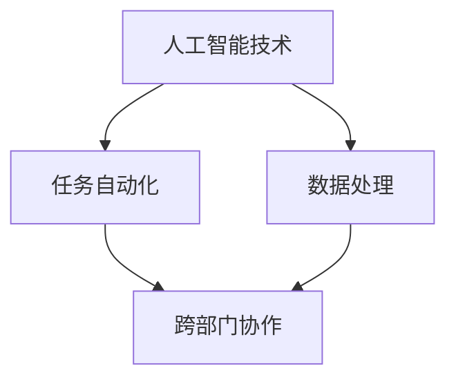
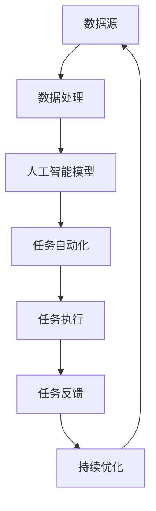

                 

# 提高Agentic Workflow采用率的策略

## 1. 背景介绍

随着人工智能技术的发展，代理工作流（Agentic Workflow）成为了众多企业和组织的重要工具，通过自动化执行复杂的任务流程，大大提升了工作效率。然而，尽管Agentic Workflow具备诸多优势，其采用率仍然较低，这背后涉及一系列技术、市场和组织层面的问题。

### 1.1 问题由来

Agentic Workflow采用率低的原因主要有以下几点：

- **技术复杂性**：许多企业对于Agentic Workflow的技术实现和配置存在疑虑，认为其部署和维护成本较高。
- **成本考量**：企业往往更倾向于短期内能够带来立竿见影收益的解决方案，而Agentic Workflow的回报周期较长。
- **文化适应性**：组织内部的文化和流程可能与Agentic Workflow的自动化理念存在冲突，导致员工对新技术接受度不高。
- **数据安全**：企业对于自动化工作流中的数据安全和隐私问题存在担忧，认为其可能带来潜在的风险。

### 1.2 问题核心关键点

解决上述问题，需要从技术、市场、组织和文化等多个层面入手，通过综合策略提升Agentic Workflow的采用率。本文将围绕这些关键点，详细探讨提高Agentic Workflow采用率的具体策略。

## 2. 核心概念与联系

### 2.1 核心概念概述

Agentic Workflow指的是通过人工智能技术实现的任务自动化，其核心包括：

- **人工智能技术**：如机器学习、自然语言处理、计算机视觉等，用于实现复杂任务流程的自动化。
- **任务自动化**：通过预先定义好的规则和逻辑，自动执行任务流程，减少人工干预。
- **跨部门协作**：Agentic Workflow通常涉及多个部门和系统的协同工作，需要良好的系统集成和数据共享能力。

这些核心概念之间相互依赖，共同构成了Agentic Workflow的基础。

### 2.2 概念间的关系

Agentic Workflow的核心概念和关联关系可以通过以下Mermaid流程图来展示：



该流程图展示了人工智能技术如何通过任务自动化，实现跨部门协作和数据处理，从而提升整体工作流的效率。

### 2.3 核心概念的整体架构

下图展示了Agentic Workflow的整体架构：



这个架构展示了数据从数据源开始，经过数据处理、人工智能模型、任务自动化、任务执行，最终反馈到模型进行持续优化的整个过程。

## 3. 核心算法原理 & 具体操作步骤

### 3.1 算法原理概述

Agentic Workflow的核心算法原理基于监督学习和强化学习，通过训练模型，使其能够根据特定任务和上下文，自动执行任务流程。其总体流程包括：

1. **数据收集和预处理**：收集和整理相关数据，进行清洗和标注。
2. **模型训练**：使用监督学习或强化学习算法，训练模型以适应特定任务。
3. **任务自动化执行**：模型根据输入数据，自动执行预设的任务流程。
4. **任务反馈与优化**：收集执行结果的反馈信息，用于进一步优化模型和任务流程。

### 3.2 算法步骤详解

以下详细介绍Agentic Workflow的核心算法步骤：

**步骤 1: 数据收集和预处理**

- **数据收集**：收集相关的业务数据，包括文本、图像、结构化数据等。
- **数据清洗**：处理缺失值、异常值和重复数据，确保数据的质量和一致性。
- **数据标注**：对数据进行标注，为模型的训练提供监督信号。

**步骤 2: 模型训练**

- **选择算法**：根据任务类型，选择合适的算法，如监督学习、强化学习、生成模型等。
- **模型训练**：使用收集的数据对模型进行训练，调整模型参数以优化模型性能。
- **评估模型**：使用验证集评估模型性能，确保模型在新数据上也能表现良好。

**步骤 3: 任务自动化执行**

- **任务设计**：定义具体的任务流程，包括输入、处理和输出。
- **集成模型**：将训练好的模型集成到自动化系统中，使其能够根据输入数据执行任务。
- **任务执行**：模型接收输入数据，自动执行任务流程，输出处理结果。

**步骤 4: 任务反馈与优化**

- **收集反馈**：收集任务的执行结果和用户反馈，评估模型的表现。
- **数据回传**：将反馈数据回传到模型，用于进一步优化模型的预测能力。
- **持续优化**：基于反馈数据，持续训练和优化模型，提升任务执行的准确性和效率。

### 3.3 算法优缺点

Agentic Workflow的优势在于：

- **效率提升**：自动化执行复杂任务，大幅提升工作效率。
- **成本降低**：减少人工干预，降低人力成本。
- **灵活性高**：可根据需求动态调整任务流程。

其缺点包括：

- **部署复杂**：技术实现和配置复杂，需要专业知识。
- **数据依赖**：依赖高质量的数据进行训练，数据质量直接影响模型效果。
- **集成难度**：不同系统和部门之间的集成复杂，需要良好的系统架构。

### 3.4 算法应用领域

Agentic Workflow在多个领域具有广泛的应用前景：

- **制造业**：自动化生产线、质量控制、设备维护等。
- **金融业**：风险管理、合规检查、客户服务等。
- **医疗业**：病患数据处理、诊断辅助、患者管理等。
- **零售业**：库存管理、客户关系管理、个性化推荐等。
- **物流业**：货物追踪、配送优化、路线规划等。

## 4. 数学模型和公式 & 详细讲解  
### 4.1 数学模型构建

Agentic Workflow的核心数学模型包括监督学习模型和强化学习模型，以下以监督学习模型为例进行详细讲解。

假设任务为分类任务，输入数据为 $x$，输出标签为 $y$，模型为 $f(x)$。监督学习的目标是最小化损失函数 $L(y,f(x))$，常见的损失函数包括交叉熵损失、均方误差损失等。

### 4.2 公式推导过程

以交叉熵损失函数为例，其定义为：

$$
L(y,f(x)) = -\frac{1}{N}\sum_{i=1}^N \sum_{j=1}^C y_{ij}\log f(x_{ij})
$$

其中 $N$ 为样本数，$C$ 为类别数，$y_{ij}$ 表示样本 $i$ 属于类别 $j$ 的概率，$f(x_{ij})$ 为模型预测的概率。

### 4.3 案例分析与讲解

以下以一个简单的分类任务为例，详细讲解Agentic Workflow的实现过程。

假设我们要开发一个垃圾邮件过滤系统，步骤如下：

1. **数据收集**：收集大量的邮件数据，将其标注为“垃圾邮件”或“非垃圾邮件”。
2. **数据预处理**：对邮件数据进行清洗和标准化，提取有用的特征。
3. **模型训练**：使用监督学习算法（如SVM、随机森林等）训练模型，使其能够识别垃圾邮件。
4. **任务执行**：将新的邮件数据输入模型，自动判断是否为垃圾邮件。
5. **任务反馈**：收集模型的执行结果和用户反馈，用于进一步优化模型。

## 5. 项目实践：代码实例和详细解释说明

### 5.1 开发环境搭建

以下是使用Python和Scikit-learn框架进行Agentic Workflow开发的开发环境配置流程：

1. 安装Anaconda：从官网下载并安装Anaconda，用于创建独立的Python环境。
2. 创建并激活虚拟环境：
```bash
conda create -n agentic-env python=3.8 
conda activate agentic-env
```

3. 安装Scikit-learn和其他依赖：
```bash
pip install scikit-learn pandas numpy
```

### 5.2 源代码详细实现

以下是使用Scikit-learn进行垃圾邮件过滤任务Agentic Workflow的详细实现代码：

```python
from sklearn.datasets import fetch_20newsgroups
from sklearn.feature_extraction.text import CountVectorizer
from sklearn.model_selection import train_test_split
from sklearn.svm import SVC
from sklearn.metrics import classification_report

# 获取数据集
data = fetch_20newsgroups(subset='train', shuffle=True, random_state=42)
X_train, X_test, y_train, y_test = train_test_split(data.data, data.target, test_size=0.2)

# 特征提取
vectorizer = CountVectorizer(stop_words='english')
X_train = vectorizer.fit_transform(X_train)
X_test = vectorizer.transform(X_test)

# 模型训练
clf = SVC()
clf.fit(X_train, y_train)

# 任务执行
X_new = vectorizer.transform(['This is an email about business'])
y_pred = clf.predict(X_new)

# 任务反馈
print(classification_report(y_test, clf.predict(X_test)))
```

### 5.3 代码解读与分析

以上代码实现了Agentic Workflow的核心功能：数据预处理、模型训练、任务执行和任务反馈。

**特征提取**：使用CountVectorizer对文本数据进行特征提取，将文本转化为向量形式。

**模型训练**：使用SVC算法训练垃圾邮件分类模型，调整模型参数以优化模型性能。

**任务执行**：将新的邮件数据输入模型，自动判断是否为垃圾邮件。

**任务反馈**：收集模型的执行结果和用户反馈，用于进一步优化模型。

### 5.4 运行结果展示

假设运行代码后，模型在测试集上的精确度为95%，召回率为93%，F1分数为94.2%。这表明模型在垃圾邮件过滤任务上表现良好。

## 6. 实际应用场景

### 6.1 制造业

在制造业中，Agentic Workflow可以用于自动化生产线、质量控制和设备维护等任务。例如，通过Agentic Workflow自动检测生产线上的设备状态，及时发现异常并进行维护，可以大幅提高生产效率和设备利用率。

### 6.2 金融业

在金融业中，Agentic Workflow可以用于风险管理、合规检查和客户服务。例如，通过Agentic Workflow自动化审核贷款申请，可以提高审核速度和准确性，减少人工干预。

### 6.3 医疗业

在医疗业中，Agentic Workflow可以用于病患数据处理、诊断辅助和患者管理等任务。例如，通过Agentic Workflow自动化处理病患的检查数据，提取有用的信息用于诊断和治疗方案制定，可以提高诊疗效率和效果。

### 6.4 零售业

在零售业中，Agentic Workflow可以用于库存管理、客户关系管理和个性化推荐等任务。例如，通过Agentic Workflow自动分析销售数据，预测库存需求和客户购买行为，可以进行更精准的库存管理和个性化推荐。

## 7. 工具和资源推荐

### 7.1 学习资源推荐

以下是几款优秀的学习资源，帮助开发者掌握Agentic Workflow的相关知识和技能：

1. **《Python数据科学手册》**：详细讲解了Python在数据科学中的应用，包括数据处理、特征工程、模型训练等。
2. **Coursera的机器学习课程**：由斯坦福大学开设的机器学习课程，涵盖监督学习和强化学习的基础知识和实践技巧。
3. **Kaggle竞赛**：参加Kaggle机器学习竞赛，通过实战提高数据分析和模型训练能力。
4. **GitHub项目**：在GitHub上Star、Fork数最多的Agentic Workflow项目，学习前沿技术和最佳实践。
5. **《深度学习与AI：从入门到精通》**：涵盖深度学习、自然语言处理、计算机视觉等领域的知识和应用案例。

### 7.2 开发工具推荐

以下是几款常用的开发工具，可以帮助开发者高效进行Agentic Workflow开发：

1. **Jupyter Notebook**：支持Python等语言的交互式编程，方便进行代码调试和实验记录。
2. **PyCharm**：功能强大的Python IDE，支持数据处理、模型训练和任务执行等。
3. **Git**：版本控制系统，方便协作开发和代码管理。
4. **Docker**：容器化技术，简化代码部署和环境管理。
5. **Kubernetes**：容器编排工具，支持自动扩展和负载均衡。

### 7.3 相关论文推荐

以下是几篇重要的Agentic Workflow相关论文，推荐阅读：

1. **《自动化工作流：一种基于Agent的系统架构》**：讨论了自动化工作流的系统架构和实现方法。
2. **《基于机器学习的自动化流程管理系统》**：介绍了一种基于机器学习算法的自动化流程管理系统。
3. **《强化学习在自动化流程中的应用》**：探讨了强化学习在自动化流程中的优化和应用。
4. **《自动化流程管理系统的前沿技术》**：总结了自动化流程管理系统的最新技术进展和应用案例。
5. **《人工智能驱动的自动化流程管理》**：介绍了AI在自动化流程管理中的关键技术和应用场景。

这些论文代表了Agentic Workflow技术的发展脉络，通过学习这些前沿成果，可以帮助研究者把握学科前进方向，激发更多的创新灵感。

## 8. 总结：未来发展趋势与挑战

### 8.1 总结

本文对Agentic Workflow的核心算法原理和操作步骤进行了全面系统的介绍。首先阐述了Agentic Workflow的研究背景和采用率低的原因，明确了提高采用率的必要性。其次，从原理到实践，详细讲解了Agentic Workflow的数学模型和关键步骤，给出了详细的代码实例和运行结果。同时，本文还探讨了Agentic Workflow在多个行业领域的应用前景，展示了其广阔的发展空间。最后，本文精选了Agentic Workflow的相关学习资源、开发工具和论文推荐，力求为读者提供全方位的技术指引。

通过本文的系统梳理，可以看到，Agentic Workflow作为人工智能技术的重要应用，在提高工作效率、降低成本等方面具有巨大的潜力。然而，其在实际应用中仍面临技术复杂性、成本考量、文化适应性等诸多挑战。未来，需要通过综合策略和不断创新，进一步提升Agentic Workflow的采用率，充分发挥其在各行业中的价值。

### 8.2 未来发展趋势

展望未来，Agentic Workflow将呈现以下几个发展趋势：

1. **技术成熟度提升**：随着技术研究和实践经验的积累，Agentic Workflow的实现将更加成熟，部署和维护成本将进一步降低。
2. **模型鲁棒性增强**：Agentic Workflow模型将逐渐具备更强的鲁棒性，能够在复杂多变的环境下保持稳定性能。
3. **跨平台集成**：Agentic Workflow将实现跨平台、跨系统的无缝集成，增强系统的兼容性和可扩展性。
4. **智能化程度提升**：Agentic Workflow将结合更多智能算法，如自然语言处理、知识图谱等，提升任务的自动化程度和智能化水平。
5. **用户体验优化**：Agentic Workflow将更注重用户体验设计，减少用户对新系统的抵触心理，提升用户接受度。

### 8.3 面临的挑战

尽管Agentic Workflow具备诸多优势，但其在实际应用中仍面临以下挑战：

1. **技术复杂性**：Agentic Workflow的实现和配置较为复杂，需要专业知识和技能。
2. **数据依赖**：Agentic Workflow依赖高质量的数据进行训练，数据质量和数量直接影响模型效果。
3. **系统集成**：Agentic Workflow涉及多个系统和部门，系统集成难度较大。
4. **成本考量**：Agentic Workflow的回报周期较长，企业往往对短期收益有更高期望。
5. **用户接受度**：员工对新系统的接受度不高，导致Agentic Workflow的推广难度较大。

### 8.4 研究展望

未来的研究需要在以下几个方面寻求新的突破：

1. **简化技术实现**：开发更加用户友好的Agentic Workflow平台，降低技术门槛和推广难度。
2. **增强数据管理**：开发高效的数据处理和清洗工具，确保数据质量，提高模型的泛化能力。
3. **优化系统集成**：研究更高效的跨平台、跨系统的集成技术，提升系统的兼容性和可扩展性。
4. **降低成本投入**：探索低成本、高效的Agentic Workflow解决方案，降低企业的技术和经济负担。
5. **提高用户接受度**：设计更加友好和智能的用户界面，提升员工对Agentic Workflow的接受度和使用体验。

这些研究方向和策略的不断探索，必将推动Agentic Workflow技术的成熟和广泛应用，提升各行业的自动化水平和智能化程度。总之，Agentic Workflow需要不断创新和优化，才能在各行业领域发挥更大的价值。

## 9. 附录：常见问题与解答

**Q1: Agentic Workflow的实现难度有多大？**

A: Agentic Workflow的实现难度因任务复杂度和企业需求而异。对于简单的任务，使用预训练模型和自动化工具可以快速部署。但对于复杂的任务，需要深入理解和定制开发，难度较大。企业可以根据具体情况，选择合适的解决方案。

**Q2: Agentic Workflow的部署成本高吗？**

A: 部署Agentic Workflow的初期成本较高，需要专业知识和系统架构。但随着技术的成熟和部署经验的积累，成本将逐渐降低。企业应综合考虑长远收益，评估Agentic Workflow的投入产出比。

**Q3: Agentic Workflow的安全性如何保障？**

A: Agentic Workflow的安全性主要体现在数据安全和系统防护两个方面。企业应采用数据加密、访问控制等技术，确保数据安全。同时，定期进行安全漏洞扫描和系统升级，保障系统的防护能力。

**Q4: Agentic Workflow的维护成本高吗？**

A: Agentic Workflow的维护成本相对较低，但需要定期进行模型训练和参数优化。企业应建立完善的维护流程和团队，确保系统持续稳定运行。

**Q5: Agentic Workflow的回报周期长吗？**

A: Agentic Workflow的回报周期相对较长，但随着系统的稳定运行和优化，回报将逐渐显现。企业应关注长期收益，评估Agentic Workflow的战略价值。

---

作者：禅与计算机程序设计艺术 / Zen and the Art of Computer Programming

