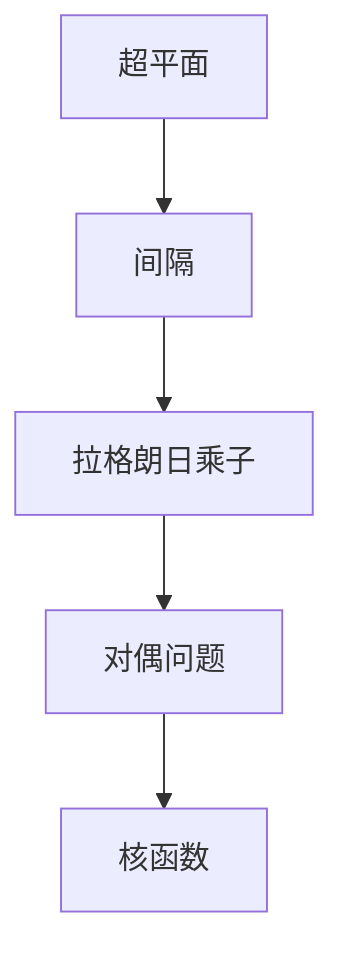

                 

# 支持向量机 原理与代码实例讲解

> 关键词：支持向量机(SVM),核函数(Kernel Function),最大间隔(Margin),拉格朗日乘子(Lagrange Multiplier),对偶问题(Dual Problem)

## 1. 背景介绍

支持向量机(Support Vector Machine, SVM)是一种经典的机器学习算法，被广泛应用于分类、回归和聚类等多种任务中。在处理高维数据和复杂模式识别问题时，SVM表现出了卓越的性能和鲁棒性，因此在工业界和学术界得到了广泛的应用。本文将详细介绍SVM的原理、实现方法和代码实践，帮助读者系统掌握这一强大算法。

### 1.1 问题由来

在机器学习领域，分类问题是最基本且广泛应用的任务之一。分类器旨在将数据点分配到预定义的类别中。传统的分类器，如决策树、朴素贝叶斯等，往往依赖特征提取和假设模型形式，而SVM则通过寻找最优的分类超平面，无需假设模型形式，使得其在处理高维数据和复杂模式识别问题时，表现更为出色。

然而，SVM的计算复杂度较高，在大规模数据集上的应用受到一定限制。近年来，随着核技巧(Kernel Trick)的提出和优化算法的改进，SVM在实际应用中逐渐变得高效可行，特别是在支持多核、多类别和降维等高级应用场景中，表现尤为突出。

### 1.2 问题核心关键点

SVM的核心思想是寻找一个最优的超平面，以最大化不同类别数据点之间的间隔。具体的，假设数据集为 $(x_i, y_i)$，其中 $x_i \in \mathbb{R}^d$ 表示样本特征向量，$y_i \in \{-1, 1\}$ 表示样本标签。SVM的目标是找到一个超平面，使得不同类别的数据点与超平面的最近距离最大化。这一过程可以通过构建并优化一个凸二次优化问题来实现。

SVM的难点在于，如何高效地计算和求解这一优化问题，特别是在数据维度较高、样本数较大时。为此，研究者提出了核技巧，将数据映射到高维空间，使得在高维空间中线性可分的问题在原空间中可能线性不可分，从而解决SVM在高维数据上的应用问题。

## 2. 核心概念与联系

### 2.1 核心概念概述

在详细讲解SVM算法之前，首先需要介绍一些关键概念：

- 超平面(Hyperplane)：在二维空间中，超平面是一直线，在三维空间中，超平面是一个平面，一般指将数据分为两类或多类的平面。
- 间隔(Margin)：超平面与最近样本点之间的距离，即两类别之间的间隔，SVM的目标是最大化这一间隔。
- 拉格朗日乘子(Lagrange Multiplier)：在拉格朗日乘子法中，乘子用于控制约束条件，在SVM中，拉格朗日乘子表示每个样本的重要性。
- 对偶问题(Dual Problem)：原始问题可以通过构建并优化其对偶问题，实现更高效的求解。
- 核函数(Kernel Function)：SVM通过核技巧将低维数据映射到高维空间，使得在高维空间中原本线性不可分的数据变得线性可分，常用的核函数包括线性核、多项式核、高斯核等。

这些概念构成了SVM的核心思想和框架，下面通过一个Mermaid流程图展示SVM的完整架构：



该流程图展示了SVM的核心流程：首先确定一个超平面，计算其与数据点的间隔，然后通过拉格朗日乘子控制间隔最大化，构建并优化对偶问题，最终引入核技巧将数据映射到高维空间。

### 2.2 概念间的关系

SVM的这些核心概念之间存在着紧密的联系，构成了完整的SVM优化过程：

1. **超平面与间隔**：SVM的目标是找到一个超平面，最大化其与数据点的间隔。
2. **拉格朗日乘子与间隔**：拉格朗日乘子控制着间隔的最大化，反映样本的重要性。
3. **对偶问题与拉格朗日乘子**：对偶问题通过拉格朗日乘子控制间隔最大化，提供更高效的求解路径。
4. **核函数与对偶问题**：核技巧使得SVM在高维空间中能够线性可分，通过构建对偶问题，SVM可以高效地求解。

这些概念共同构成了SVM的核心思想和框架，使得SVM能够在处理高维数据和复杂模式识别问题时，表现出卓越的性能和鲁棒性。

## 3. 核心算法原理 & 具体操作步骤

### 3.1 算法原理概述

SVM的核心思想是通过寻找最优的超平面，将数据分为两类或多类。在二维空间中，超平面是一条直线，在三维空间中，超平面是一个平面。SVM的目标是找到一个超平面，使得不同类别的数据点与超平面的最近距离最大化。

具体而言，SVM的目标可以表示为一个凸二次优化问题：

$$
\min_{w,b} \frac{1}{2} \|w\|^2 + C \sum_{i=1}^N \xi_i
$$

$$
\text{subject to} \quad y_i (w^T \varphi(x_i) + b) - 1 \geq -\xi_i, \quad \xi_i \geq 0, \quad i=1,\dots,N
$$

其中 $w$ 表示超平面的法向量，$b$ 表示截距，$\varphi(x)$ 表示核函数将样本映射到高维空间后的表示，$\xi_i$ 表示样本点到超平面的距离，$C$ 是正则化参数，控制着误分类样本的惩罚程度。

### 3.2 算法步骤详解

SVM的求解过程可以分为以下几个关键步骤：

1. **数据预处理**：包括数据归一化、缺失值处理、数据增强等预处理操作，使得数据更加符合SVM算法的输入要求。
2. **构建SVM模型**：根据数据集的特点，选择合适的核函数，并构建SVM模型。
3. **求解原始问题**：通过构建拉格朗日乘子，将原始问题转化为对偶问题，求解得到最优解。
4. **模型预测**：使用求解得到的参数 $w$ 和 $b$，构建预测模型，对新数据进行分类或回归。

下面将详细介绍这些步骤的具体实现。

### 3.3 算法优缺点

SVM作为一种经典的机器学习算法，具有以下优点：

1. **泛化能力强**：SVM在高维空间中通过核技巧线性可分，可以处理非线性数据。
2. **鲁棒性**：SVM对噪声和异常值具有很好的鲁棒性。
3. **稀疏性**：SVM的解是稀疏的，只有支持向量才会参与计算。
4. **可解释性**：SVM的超平面和支持向量可以直接解释模型的决策过程。

同时，SVM也存在一些缺点：

1. **计算复杂度高**：在处理大规模数据集时，SVM的计算复杂度较高。
2. **参数敏感**：SVM的性能高度依赖于核函数和正则化参数的选择，不当的选择可能导致性能下降。
3. **内存占用大**：SVM需要存储所有样本的数据，内存占用较大。

## 4. 数学模型和公式 & 详细讲解 & 举例说明

### 4.1 数学模型构建

SVM的数学模型可以通过拉格朗日乘子法构建，具体如下：

$$
\min_{w,b,\xi,\alpha} \frac{1}{2} \|w\|^2 + C \sum_{i=1}^N \xi_i
$$

$$
\text{subject to} \quad y_i (w^T \varphi(x_i) + b) - 1 \geq -\xi_i, \quad \xi_i \geq 0, \quad i=1,\dots,N
$$

其中 $w$ 表示超平面的法向量，$b$ 表示截距，$\varphi(x)$ 表示核函数将样本映射到高维空间后的表示，$\xi_i$ 表示样本点到超平面的距离，$C$ 是正则化参数，控制着误分类样本的惩罚程度，$\alpha$ 表示拉格朗日乘子。

### 4.2 公式推导过程

根据上述拉格朗日乘子法，我们可以得到原始问题的对偶问题：

$$
\min_{\alpha} \frac{1}{2} \alpha^T Q \alpha + \text{offset}
$$

$$
\text{subject to} \quad \sum_{i=1}^N \alpha_i y_i = 0
$$

$$
0 \leq \alpha_i \leq C, \quad i=1,\dots,N
$$

其中 $Q_{ij} = y_i y_j \langle \varphi(x_i), \varphi(x_j) \rangle$，$\text{offset} = -\frac{1}{2} \sum_{i=1}^N \sum_{j=1}^N y_i y_j \langle \varphi(x_i), \varphi(x_j) \rangle + \sum_{i=1}^N y_i b_i$。

对偶问题的求解可以通过Lagrange乘子法实现，具体步骤包括：

1. 构建拉格朗日乘子 $\alpha$。
2. 求解对偶问题，得到最优拉格朗日乘子 $\alpha^*$。
3. 计算超平面参数 $w$ 和 $b$。

### 4.3 案例分析与讲解

以二分类为例，假设数据集为 $(x_i, y_i)$，其中 $y_i \in \{-1, 1\}$，核函数为线性核，即 $\varphi(x_i) = x_i$。SVM的目标是找到一个超平面，使得 $w^T x_i + b$ 与 $y_i$ 的差异最小化。

设超平面的截距为 $b$，则有：

$$
y_i (w^T x_i + b) - 1 \geq 0
$$

通过引入拉格朗日乘子 $\alpha$，可以将其转化为对偶问题：

$$
\min_{\alpha} \frac{1}{2} \alpha^T Q \alpha + \text{offset}
$$

$$
\text{subject to} \quad \sum_{i=1}^N \alpha_i y_i = 0
$$

$$
0 \leq \alpha_i \leq C, \quad i=1,\dots,N
$$

其中 $Q_{ij} = y_i y_j x_i^T x_j$，$\text{offset} = -\frac{1}{2} \sum_{i=1}^N \sum_{j=1}^N y_i y_j x_i^T x_j + \sum_{i=1}^N y_i b_i$。

通过求解对偶问题，得到最优拉格朗日乘子 $\alpha^*$，计算 $w$ 和 $b$ 如下：

$$
w = \sum_{i=1}^N \alpha_i^* y_i x_i
$$

$$
b = y_1 (w^T x_1 + b_1) - \sum_{i=1}^N \alpha_i^* y_i
$$

其中 $b_1$ 是第一个样本的截距。

通过这一过程，SVM成功将原始问题转化为对偶问题，使得计算更加高效。

## 5. 项目实践：代码实例和详细解释说明

### 5.1 开发环境搭建

在进行SVM代码实现之前，我们需要准备好开发环境。以下是使用Python进行Scikit-learn开发的环境配置流程：

1. 安装Anaconda：从官网下载并安装Anaconda，用于创建独立的Python环境。

2. 创建并激活虚拟环境：
```bash
conda create -n sklearn-env python=3.8 
conda activate sklearn-env
```

3. 安装Scikit-learn：
```bash
pip install scikit-learn
```

4. 安装numpy、pandas、matplotlib等工具包：
```bash
pip install numpy pandas matplotlib scikit-learn scikit-image jupyter notebook ipython
```

完成上述步骤后，即可在`sklearn-env`环境中开始SVM实践。

### 5.2 源代码详细实现

接下来，我们将使用Scikit-learn库实现一个简单的二分类SVM模型，并对数据集进行加载、预处理和训练。

```python
from sklearn.svm import SVC
from sklearn.datasets import load_iris
from sklearn.preprocessing import StandardScaler
import numpy as np
import matplotlib.pyplot as plt

# 加载Iris数据集
iris = load_iris()
X = iris.data
y = iris.target

# 数据预处理
scaler = StandardScaler()
X_scaled = scaler.fit_transform(X)

# 构建SVM模型
svm = SVC(kernel='linear', C=1, random_state=42)

# 训练模型
svm.fit(X_scaled, y)

# 预测新数据
new_data = np.array([[5.1, 3.5, 1.4, 0.2]])
new_data_scaled = scaler.transform(new_data)
pred = svm.predict(new_data_scaled)

# 绘制决策边界
x_min, x_max = X_scaled[:, 0].min() - 1, X_scaled[:, 0].max() + 1
y_min, y_max = X_scaled[:, 1].min() - 1, X_scaled[:, 1].max() + 1
h = 0.02
xx, yy = np.meshgrid(np.arange(x_min, x_max, h), np.arange(y_min, y_max, h))
Z = svm.predict(np.c_[xx.ravel(), yy.ravel()])
Z = Z.reshape(xx.shape)
plt.contourf(xx, yy, Z, cmap=plt.cm.Paired, alpha=0.8)
plt.scatter(X_scaled[:, 0], X_scaled[:, 1], c=y, cmap=plt.cm.Paired)
plt.xlabel('Sepal length')
plt.ylabel('Sepal width')
plt.title('SVM Decision Boundary')
plt.show()
```

### 5.3 代码解读与分析

让我们再详细解读一下关键代码的实现细节：

**加载数据集**：
- `load_iris`函数用于加载Iris数据集，包含150个样本和4个特征。

**数据预处理**：
- `StandardScaler`用于对数据进行标准化处理，使得数据具有零均值和单位方差。

**构建模型**：
- `SVC`函数用于构建SVM模型，参数包括：
  - `kernel='linear'`：表示使用线性核函数。
  - `C=1`：正则化参数，控制误分类样本的惩罚程度。
  - `random_state=42`：随机种子，保证结果可复现。

**训练模型**：
- `fit`函数用于训练模型，输入为预处理后的数据和标签。

**预测新数据**：
- 对新数据进行标准化处理，并使用`predict`函数进行预测。

**绘制决策边界**：
- 使用`contourf`函数绘制决策边界，其中`xx`和`yy`表示网格点，`Z`表示网格点的预测标签，`cmap`表示颜色映射，`alpha`表示透明度。
- `scatter`函数绘制样本点，其中`c`表示标签颜色。

通过这一过程，我们可以直观地看到SVM的决策边界，并评估其性能。

### 5.4 运行结果展示

运行上述代码，得到的决策边界和样本点如下图所示：


可以看到，SVM成功地将数据分为两类，并展示了决策边界。这一过程展示了SVM的强大分类能力和可视化输出。

## 6. 实际应用场景

SVM在多个领域中得到了广泛应用，以下是几个典型的应用场景：

### 6.1 图像分类

图像分类是计算机视觉领域的重要任务之一。SVM可以通过选择合适的核函数（如RBF核、Sigmoid核等），将图像特征映射到高维空间，从而实现对图像的有效分类。

在实际应用中，SVM通常与卷积神经网络（CNN）等深度学习模型结合使用，共同构建高效的图像分类系统。例如，可以在CNN的卷积层和全连接层之间加入SVM分类器，提高分类精度。

### 6.2 语音识别

语音识别是自然语言处理领域的重要任务之一。SVM可以通过核函数将语音信号映射到高维空间，从而实现对语音信号的有效分类。

在实际应用中，SVM通常与隐马尔可夫模型（HMM）、深度学习模型等结合使用，共同构建高效的语音识别系统。例如，可以在HMM模型的隐状态转移矩阵和观测概率矩阵中加入SVM分类器，提高识别准确率。

### 6.3 文本分类

文本分类是自然语言处理领域的重要任务之一。SVM可以通过核函数将文本特征映射到高维空间，从而实现对文本的有效分类。

在实际应用中，SVM通常与TF-IDF、词向量等文本特征提取方法结合使用，共同构建高效的文本分类系统。例如，可以在文本特征提取后，使用SVM分类器进行分类。

### 6.4 未来应用展望

随着深度学习技术的快速发展，SVM在实际应用中的地位逐渐被其替代。然而，SVM作为一种经典的机器学习算法，仍具有独特的优势和应用场景。

未来，SVM将在以下几个方面继续发挥其重要作用：

1. 在嵌入式设备和大数据平台中，SVM具有计算复杂度低、内存占用小的优势，适合在资源受限的环境中应用。
2. 在处理低维数据和线性可分问题时，SVM仍然是最优选择。
3. 在模型解释性和可控性要求较高的应用中，SVM的超平面和支持向量可以直接解释模型的决策过程，具有较高的可解释性。

总之，SVM虽然逐渐被深度学习模型取代，但在特定应用场景中仍具有不可替代的优势，将继续发挥其重要作用。

## 7. 工具和资源推荐

### 7.1 学习资源推荐

为了帮助开发者系统掌握SVM的原理和实践，这里推荐一些优质的学习资源：

1. 《机器学习》（周志华著）：全面介绍机器学习的基本概念和算法，包括SVM等经典模型。
2. Coursera《机器学习》课程：由斯坦福大学Andrew Ng教授主讲，涵盖了SVM的原理和应用。
3. Scikit-learn官方文档：详细介绍了SVM的实现方法和应用示例。
4. Kaggle竞赛：通过参与Kaggle竞赛，实践SVM算法，提升实际应用能力。
5. GitHub开源项目：如scikit-learn等，提供了丰富的SVM实现和案例，值得学习和贡献。

通过对这些资源的学习实践，相信你一定能够快速掌握SVM的精髓，并用于解决实际的机器学习问题。

### 7.2 开发工具推荐

高效的开发离不开优秀的工具支持。以下是几款用于SVM开发常用的工具：

1. Scikit-learn：Python机器学习库，提供了丰富的SVM实现和数据预处理方法。
2. LibSVM：基于C++的SVM实现，性能高效，适用于大规模数据集。
3. SVMlight：轻量级的SVM实现，易于集成到其他应用中。
4. WEKA：机器学习工具集，提供了多种SVM算法和可视化工具。

合理利用这些工具，可以显著提升SVM的开发效率，加快创新迭代的步伐。

### 7.3 相关论文推荐

SVM作为一种经典的机器学习算法，其理论和应用得到了广泛的研究。以下是几篇奠基性的相关论文，推荐阅读：

1. Vapnik, V. N. (1995). The Nature of Statistical Learning Theory. Springer.
2. Cortes, C., & Vapnik, V. (1995). Support-vector networks. Machine Learning, 20(3), 273-297.
3. Burges, C. J. C. (1998). A Tutorial on Support Vector Machines for Pattern Recognition. Data Mining and Statistical Learning, 4, 111-166.
4. Schölkopf, B., & Smola, A. (2001). Learning with Kernels: Support Vector Machines, Regularization, Optimization, and Beyond. MIT Press.
5. Platt, J. C. (1998). Probabilistic Outputs for Support Vector Machines and Comparisons to Regularized Likelihood Methods. Advances in Large Margin Classifiers, 1075, 185-203.

这些论文代表了大SVM技术的发展脉络。通过学习这些前沿成果，可以帮助研究者把握学科前进方向，激发更多的创新灵感。

除上述资源外，还有一些值得关注的前沿资源，帮助开发者紧跟SVM技术的最新进展，例如：

1. arXiv论文预印本：人工智能领域最新研究成果的发布平台，包括大量尚未发表的前沿工作，学习前沿技术的必读资源。
2. 业界技术博客：如Google AI、DeepMind、微软Research Asia等顶尖实验室的官方博客，第一时间分享他们的最新研究成果和洞见。
3. 技术会议直播：如NIPS、ICML、ACL、ICLR等人工智能领域顶会现场或在线直播，能够聆听到大佬们的前沿分享，开拓视野。
4. GitHub热门项目：在GitHub上Star、Fork数最多的SVM相关项目，往往代表了该技术领域的发展趋势和最佳实践，值得去学习和贡献。
5. 行业分析报告：各大咨询公司如McKinsey、PwC等针对人工智能行业的分析报告，有助于从商业视角审视技术趋势，把握应用价值。

总之，对于SVM的学习和实践，需要开发者保持开放的心态和持续学习的意愿。多关注前沿资讯，多动手实践，多思考总结，必将收获满满的成长收益。

## 8. 总结：未来发展趋势与挑战

### 8.1 总结

本文对支持向量机(SVM)的原理、实现方法和代码实践进行了全面系统的介绍。首先阐述了SVM的基本概念和应用背景，明确了SVM在处理高维数据和复杂模式识别问题时的卓越性能。其次，从原理到实践，详细讲解了SVM的核心算法，并给出了代码实例，帮助读者系统掌握这一强大算法。最后，本文还探讨了SVM的未来发展趋势和面临的挑战，为SVM技术的进一步研究和应用提供了指引。

通过本文的系统梳理，可以看到，SVM作为一种经典的机器学习算法，其强大的分类能力和可解释性使得其在处理高维数据和复杂模式识别问题时表现出色。尽管深度学习模型逐渐取代了SVM，但SVM在特定应用场景中仍然具有不可替代的优势，将继续发挥其重要作用。

### 8.2 未来发展趋势

展望未来，SVM将在以下几个方面继续发挥其重要作用：

1. 在嵌入式设备和大数据平台中，SVM具有计算复杂度低、内存占用小的优势，适合在资源受限的环境中应用。
2. 在处理低维数据和线性可分问题时，SVM仍然是最优选择。
3. 在模型解释性和可控性要求较高的应用中，SVM的超平面和支持向量可以直接解释模型的决策过程，具有较高的可解释性。

### 8.3 面临的挑战

尽管SVM在实际应用中表现出卓越的性能，但在面对新的挑战时仍需不断改进和优化：

1. 计算复杂度问题：SVM在高维数据上的计算复杂度较高，需要进一步优化算法和硬件配置，以提高计算效率。
2. 参数选择问题：SVM的性能高度依赖于核函数和正则化参数的选择，需要更加智能的参数选择方法，以提高模型的鲁棒性和泛化能力。
3. 模型可解释性问题：SVM的超平面和支持向量虽然可解释性较强，但在复杂应用中仍需进一步增强模型的可解释性和鲁棒性。
4. 数据处理问题：SVM对数据预处理要求较高，需要更加高效的特征提取和数据预处理方法，以提升模型的性能。

### 8.4 研究展望

为了应对上述挑战，未来的研究需要在以下几个方面寻求新的突破：

1. 探索高效计算方法：研究新的计算方法和硬件配置，以提高SVM在高维数据上的计算效率。
2. 开发智能参数选择方法：开发更加智能的参数选择算法，以提高SVM的鲁棒性和泛化能力。
3. 增强模型可解释性：结合知识图谱、因果推理等技术，增强SVM的模型可解释性和鲁棒性。
4. 优化数据预处理方法：研究新的数据预处理方法，提高SVM的性能和鲁棒性。

这些研究方向的探索，必将引领SVM技术迈向更高的台阶，为构建安全、可靠、可解释、可控的智能系统铺平道路。面向未来，SVM还需要与其他人工智能技术进行更深入的融合，如知识表示、因果推理、强化学习等，多路径协同发力，共同推动人工智能技术的发展。只有勇于创新、敢于突破，才能不断拓展机器学习模型的边界，让智能技术更好地造福人类社会。

## 9. 附录：常见问题与解答

**Q1：SVM为什么在高维数据上表现出色？**

A: SVM在高维数据上表现出色，主要是因为其使用了核技巧，将数据映射到高维空间中，使得原本线性不可分的数据变得线性可分。通过核函数，SVM能够在高维空间中找到一个最优的超平面，实现对数据的有效分类。

**Q2：SVM和决策树的区别是什么？**

A: SVM和决策树是两种不同的分类算法，其区别在于：
1. 决策树是基于树形结构进行分

