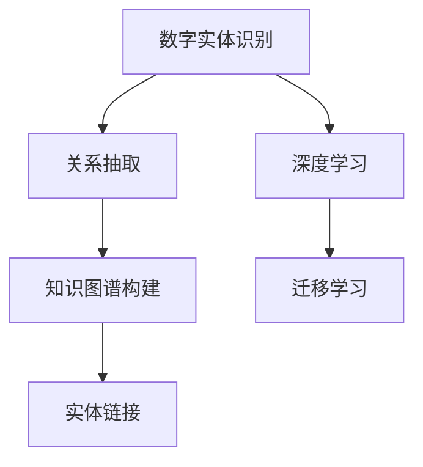
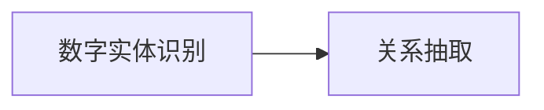
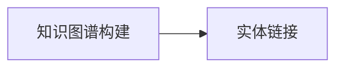
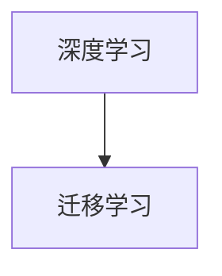
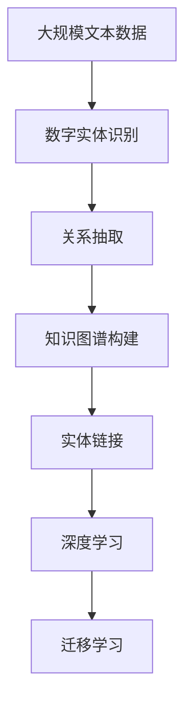

                 

# 数字实体自动化的新时代

## 1. 背景介绍

### 1.1 问题由来
随着数字化的加速推进，各行各业都面临着如何高效自动化地处理海量数字实体的挑战。数字实体指的是存在于数据中的具体或抽象的个体，如人名、地名、组织机构名、产品名称等。数字化时代的数据往往包含大量数字实体，这些实体信息对于数据处理、信息抽取、智能推荐等应用至关重要。

在传统的手动标注和规则提取方法中，数据处理效率低，成本高，且容易受到人为主观因素的影响。此外，面对不断增长的数据规模和多样化的数据类型，传统方法难以应对，亟需新的自动化技术来解决这些问题。

### 1.2 问题核心关键点
数字实体自动化处理的核心在于自动识别和标注数据中的实体，并通过高效的模型训练和推理，实现实体的关联抽取、情感分析、相似度计算等多种高级应用。当前，数字实体自动化的关键技术包括：命名实体识别（NER）、关系抽取（Relation Extraction）、知识图谱构建、实体链接等。

命名实体识别（NER）指的是自动识别文本中具有特定意义的实体，如人名、地名、组织机构名等。关系抽取则是从文本中识别实体之间的语义关系，如父亲和母亲、销售和购买等。这些任务都是自然语言处理（NLP）领域的重要研究方向，对于构建知识图谱、搜索引擎优化、推荐系统等领域具有重要意义。

### 1.3 问题研究意义
数字实体自动化的研究，对于提升数据处理效率、优化信息抽取效果、促进智能推荐应用，具有重要意义：

1. **提升数据处理效率**：通过自动化技术，可以快速识别和标注大量文本中的实体，减少人工标注的工作量。
2. **优化信息抽取效果**：自动化的实体抽取可以降低人工标注错误率，提高信息抽取的准确性和一致性。
3. **促进智能推荐应用**：通过实体关联和关系抽取，可以构建用户画像，实现个性化推荐。
4. **拓展应用场景**：数字实体自动化技术可以应用于医疗、金融、法律、电商等多个领域，提升相关应用系统的智能化水平。
5. **加速技术产业化**：技术成熟和应用的普及，将加速NLP技术在各行业的落地应用，推动数字化转型进程。

## 2. 核心概念与联系

### 2.1 核心概念概述

为更好地理解数字实体自动化的核心概念，本节将介绍几个密切相关的核心概念：

- **数字实体识别（Named Entity Recognition, NER）**：自动识别文本中具有特定意义的实体，如人名、地名、组织机构名等。
- **关系抽取（Relation Extraction）**：从文本中识别实体之间的语义关系，如父子、销售和购买等。
- **知识图谱（Knowledge Graph）**：通过实体和关系的抽取，构建大规模知识图谱，为智能推荐、问答系统、搜索优化等应用提供结构化信息。
- **实体链接（Entity Linking）**：将抽取到的实体链接到知识库中的标准实体，以确保数据的一致性和准确性。
- **深度学习（Deep Learning）**：采用深度神经网络技术，构建高效的实体识别和关系抽取模型。
- **迁移学习（Transfer Learning）**：通过预训练模型在目标任务上的微调，提升实体识别和关系抽取的效果。

这些核心概念之间的逻辑关系可以通过以下Mermaid流程图来展示：



这个流程图展示了大规模实体自动化的核心概念及其之间的关系：

1. 数字实体识别是关系抽取的基础，通过实体识别获取文本中的关键实体。
2. 关系抽取通过识别实体之间的语义关系，进一步深化对文本的理解。
3. 知识图谱构建将实体和关系组成结构化知识，为后续应用提供支撑。
4. 实体链接将抽取的实体链接到知识库，确保数据一致性。
5. 深度学习和迁移学习技术提供高效的模型训练和推理手段。

### 2.2 概念间的关系

这些核心概念之间存在着紧密的联系，形成了数字实体自动化的完整生态系统。下面我通过几个Mermaid流程图来展示这些概念之间的关系。

#### 2.2.1 数字实体识别与关系抽取的关系



这个流程图展示了数字实体识别和关系抽取之间的逻辑关系：首先通过实体识别获取文本中的关键实体，然后通过关系抽取识别实体之间的语义关系。

#### 2.2.2 知识图谱构建与实体链接的关系



这个流程图展示了知识图谱构建和实体链接之间的逻辑关系：知识图谱构建将实体和关系组成结构化知识，而实体链接则将抽取的实体链接到知识库中的标准实体，确保数据的一致性和准确性。

#### 2.2.3 深度学习与迁移学习的关系



这个流程图展示了深度学习和迁移学习之间的关系：深度学习提供高效的模型训练和推理手段，而迁移学习则通过预训练模型在目标任务上的微调，提升实体识别和关系抽取的效果。

### 2.3 核心概念的整体架构

最后，我们用一个综合的流程图来展示这些核心概念在大规模实体自动化处理过程中的整体架构：



这个综合流程图展示了从预训练到微调，再到知识图谱构建的完整过程。大规模文本数据首先进行预训练，然后通过数字实体识别和关系抽取，构建知识图谱。最终，实体链接将抽取的实体链接到知识库，实现高效的数据处理。

## 3. 核心算法原理 & 具体操作步骤
### 3.1 算法原理概述

数字实体自动化的核心算法基于深度学习和迁移学习。具体来说，以下步骤概括了数字实体自动化的主要算法流程：

1. **预训练**：在大规模无标签文本数据上，使用深度神经网络进行自监督学习，学习通用的语言表示。
2. **微调**：在预训练模型的基础上，使用下游任务的少量标注数据，进行有监督学习，优化模型在该任务上的性能。
3. **数字实体识别**：在微调后的模型上，进行实体识别任务，识别文本中的关键实体。
4. **关系抽取**：通过关系抽取模型，识别实体之间的语义关系，构建实体关系图谱。
5. **知识图谱构建**：将识别到的实体和关系组成结构化知识，构建知识图谱。
6. **实体链接**：将抽取的实体链接到知识库中的标准实体，确保数据一致性。

### 3.2 算法步骤详解

以下是数字实体自动化的详细步骤：

**Step 1: 准备数据和预训练模型**

- 收集大规模无标签文本数据，构建预训练数据集。
- 选择合适的预训练模型，如BERT、GPT等。

**Step 2: 数据预处理**

- 对文本进行分词、标准化、去停用词等处理。
- 定义实体类别和实体标签，如人名、地名、组织机构名等。

**Step 3: 微调实体识别模型**

- 使用预训练模型在标注数据集上进行微调。
- 设置合适的学习率和优化器。
- 应用正则化技术，如L2正则、Dropout等，防止过拟合。
- 使用微调后的实体识别模型进行实体识别。

**Step 4: 关系抽取**

- 根据实体识别结果，构建实体关系图谱。
- 设计关系抽取模型，识别实体之间的语义关系。
- 在标注数据集上微调关系抽取模型。

**Step 5: 知识图谱构建**

- 将实体和关系组成结构化知识，构建知识图谱。
- 进行实体链接，将抽取的实体链接到知识库中的标准实体。

**Step 6: 推理和应用**

- 使用知识图谱进行实体链接推理，实现更高级的应用，如智能推荐、问答系统等。
- 对推理结果进行后处理，优化输出结果。

### 3.3 算法优缺点

数字实体自动化的算法具有以下优点：

1. **高效性**：通过深度学习和迁移学习，可以高效处理大规模文本数据，识别实体和关系。
2. **准确性**：深度神经网络模型能够自动学习特征，识别实体和关系的准确性较高。
3. **泛化能力**：预训练模型可以迁移到多种下游任务，提升模型泛化能力。
4. **可解释性**：通过分析和推理，可以解释模型的决策过程，提高模型的透明度。

同时，该算法也存在一些局限性：

1. **依赖标注数据**：实体识别和关系抽取依赖高质量的标注数据，标注成本较高。
2. **复杂性**：模型构建和训练过程较为复杂，需要较高的技术门槛。
3. **数据偏见**：预训练模型可能学习到数据中的偏见，影响实体识别的公平性。
4. **计算资源需求**：深度学习模型需要大量的计算资源，训练和推理成本较高。

### 3.4 算法应用领域

数字实体自动化的算法已经在多个领域得到了广泛应用，以下是主要应用领域：

- **医疗领域**：通过实体识别和关系抽取，自动识别和抽取电子病历中的实体，如疾病、症状、治疗等，提升医疗信息处理效率。
- **金融领域**：从金融报表、新闻、社交媒体等数据中识别和抽取实体，进行风险评估、情感分析等。
- **法律领域**：从法律文本中抽取实体和关系，辅助法律文档生成、合同审查等。
- **电商领域**：从电商评论中抽取商品信息、用户评价等，提升个性化推荐和广告投放效果。
- **新闻领域**：从新闻报道中抽取实体和关系，辅助新闻信息生成、情感分析等。

## 4. 数学模型和公式 & 详细讲解 & 举例说明
### 4.1 数学模型构建

在数字实体自动化的过程中，我们主要使用深度神经网络模型。以下是一个基本的命名实体识别（NER）模型的数学模型构建：

假设文本序列为 $X = \{x_1, x_2, ..., x_n\}$，其中 $x_i$ 表示第 $i$ 个词的词向量表示。定义一个二分类任务，用于判断每个词是否为实体，即实体类别 $y_i \in \{0, 1\}$，其中 $y_i = 1$ 表示第 $i$ 个词是实体，否则为非实体。

模型的输入为词向量序列 $X$，输出为实体类别序列 $Y$。模型的目标是最小化损失函数 $L(Y, \hat{Y})$，其中 $\hat{Y} = \{ \hat{y}_1, \hat{y}_2, ..., \hat{y}_n \}$ 是模型预测的实体类别序列。

常用的损失函数包括交叉熵损失函数：

$$
L(Y, \hat{Y}) = -\frac{1}{n} \sum_{i=1}^n (y_i \log \hat{y}_i + (1-y_i) \log (1-\hat{y}_i))
$$

### 4.2 公式推导过程

以下是一个简单的命名实体识别模型的详细推导过程：

**Step 1: 构建模型**

定义一个简单的双向LSTM（BiLSTM）模型，用于处理文本序列 $X$。模型由两个双向LSTM层和一个全连接层组成，每个LSTM层的输出维度为 $d$。全连接层的输出维度为 $m$，代表实体类别的数量。

**Step 2: 定义损失函数**

使用交叉熵损失函数 $L(Y, \hat{Y})$ 来衡量模型预测与真实标签的差异。

**Step 3: 训练模型**

使用梯度下降算法，最小化损失函数 $L(Y, \hat{Y})$，更新模型参数 $\theta$。

**Step 4: 预测实体类别**

使用训练好的模型，输入文本序列 $X$，输出实体类别序列 $\hat{Y}$。

### 4.3 案例分析与讲解

以情感分析为例，分析数字实体自动化的应用：

假设有一段新闻文本，内容为“华为发布了新款手机Mate 40 Pro，搭载了最新的5nm工艺，售价6999元起。”

**Step 1: 预处理**

将文本进行分词、标准化、去停用词等处理，得到词向量序列 $X = \{华为, 发布了, 新款, 手机, Mate 40 Pro, 搭载了, 最新的, 5nm, 工艺, 售价, 6999, 元, 起\}$。

**Step 2: 实体识别**

使用训练好的NER模型，识别文本中的实体，得到 $\hat{Y} = \{华为, 新款, Mate 40 Pro\}$。

**Step 3: 关系抽取**

使用关系抽取模型，识别实体之间的语义关系，得到 $\{华为, 发布, 新款手机Mate 40 Pro\}$。

**Step 4: 知识图谱构建**

将实体和关系组成结构化知识，构建知识图谱。例如，“华为”与“新款手机Mate 40 Pro”之间有“发布”关系。

**Step 5: 推理和应用**

使用知识图谱进行实体链接推理，得到“华为”与“新款手机Mate 40 Pro”之间的关系，辅助情感分析等应用。

## 5. 项目实践：代码实例和详细解释说明
### 5.1 开发环境搭建

在进行数字实体自动化的项目实践前，我们需要准备好开发环境。以下是使用Python进行TensorFlow开发的环境配置流程：

1. 安装Anaconda：从官网下载并安装Anaconda，用于创建独立的Python环境。

2. 创建并激活虚拟环境：
```bash
conda create -n tf-env python=3.8 
conda activate tf-env
```

3. 安装TensorFlow：根据CUDA版本，从官网获取对应的安装命令。例如：
```bash
conda install tensorflow -c pytorch -c conda-forge
```

4. 安装各类工具包：
```bash
pip install numpy pandas scikit-learn matplotlib tqdm jupyter notebook ipython
```

完成上述步骤后，即可在`tf-env`环境中开始数字实体自动化的项目实践。

### 5.2 源代码详细实现

下面我们以命名实体识别（NER）任务为例，给出使用TensorFlow对BERT模型进行微调的PyTorch代码实现。

首先，定义NER任务的数据处理函数：

```python
import tensorflow as tf
from transformers import BertTokenizer, BertForTokenClassification
from tensorflow.keras.preprocessing.sequence import pad_sequences

class NERDataset(tf.data.Dataset):
    def __init__(self, texts, tags, tokenizer, max_len=128):
        self.texts = texts
        self.tags = tags
        self.tokenizer = tokenizer
        self.max_len = max_len
        
    def __len__(self):
        return len(self.texts)
    
    def __getitem__(self, item):
        text = self.texts[item]
        tags = self.tags[item]
        
        encoding = self.tokenizer(text, return_tensors='pt', max_length=self.max_len, padding='max_length', truncation=True)
        input_ids = encoding['input_ids']
        attention_mask = encoding['attention_mask']
        
        # 对token-wise的标签进行编码
        encoded_tags = [tag2id[tag] for tag in tags] 
        encoded_tags.extend([tag2id['O']] * (self.max_len - len(encoded_tags)))
        labels = tf.convert_to_tensor(encoded_tags, dtype=tf.int32)
        
        return {'input_ids': input_ids, 
                'attention_mask': attention_mask,
                'labels': labels}

# 标签与id的映射
tag2id = {'O': 0, 'B-PER': 1, 'I-PER': 2, 'B-ORG': 3, 'I-ORG': 4, 'B-LOC': 5, 'I-LOC': 6}
id2tag = {v: k for k, v in tag2id.items()}

# 创建dataset
tokenizer = BertTokenizer.from_pretrained('bert-base-cased')

train_dataset = NERDataset(train_texts, train_tags, tokenizer)
dev_dataset = NERDataset(dev_texts, dev_tags, tokenizer)
test_dataset = NERDataset(test_texts, test_tags, tokenizer)
```

然后，定义模型和优化器：

```python
from transformers import BertForTokenClassification, AdamW

model = BertForTokenClassification.from_pretrained('bert-base-cased', num_labels=len(tag2id))

optimizer = AdamW(model.parameters(), lr=2e-5)
```

接着，定义训练和评估函数：

```python
import numpy as np
import tensorflow as tf
from sklearn.metrics import classification_report

device = tf.device('cuda') if tf.cuda.is_available() else tf.device('cpu')
model.to(device)

def train_epoch(model, dataset, batch_size, optimizer):
    dataloader = tf.data.Dataset.from_generator(lambda: dataset, output_signature={'input_ids': tf.TensorSpec(shape=(None,), dtype=tf.int32),
                                                                               'attention_mask': tf.TensorSpec(shape=(None,), dtype=tf.int32),
                                                                               'labels': tf.TensorSpec(shape=(None,), dtype=tf.int32)})
    model.train()
    epoch_loss = 0
    for batch in tqdm(dataloader, desc='Training'):
        with tf.GradientTape() as tape:
            loss = model(batch['input_ids'], attention_mask=batch['attention_mask'], labels=batch['labels'])
        epoch_loss += loss.numpy()
        gradients = tape.gradient(loss, model.trainable_variables)
        optimizer.apply_gradients(zip(gradients, model.trainable_variables))
    return epoch_loss / len(dataloader)

def evaluate(model, dataset, batch_size):
    dataloader = tf.data.Dataset.from_generator(lambda: dataset, output_signature={'input_ids': tf.TensorSpec(shape=(None,), dtype=tf.int32),
                                                                               'attention_mask': tf.TensorSpec(shape=(None,), dtype=tf.int32),
                                                                               'labels': tf.TensorSpec(shape=(None,), dtype=tf.int32)})
    model.eval()
    preds, labels = [], []
    with tf.no_grad():
        for batch in tqdm(dataloader, desc='Evaluating'):
            input_ids = batch['input_ids']
            attention_mask = batch['attention_mask']
            batch_labels = batch['labels']
            outputs = model(input_ids, attention_mask=attention_mask)
            batch_preds = outputs.logits.argmax(dim=2).numpy()
            batch_labels = batch_labels.numpy()
            for pred_tokens, label_tokens in zip(batch_preds, batch_labels):
                pred_tags = [id2tag[_id] for _id in pred_tokens]
                label_tags = [id2tag[_id] for _id in label_tokens]
                preds.append(pred_tags[:len(label_tags)])
                labels.append(label_tags)
                
    print(classification_report(labels, preds))
```

最后，启动训练流程并在测试集上评估：

```python
epochs = 5
batch_size = 16

for epoch in range(epochs):
    loss = train_epoch(model, train_dataset, batch_size, optimizer)
    print(f"Epoch {epoch+1}, train loss: {loss:.3f}")
    
    print(f"Epoch {epoch+1}, dev results:")
    evaluate(model, dev_dataset, batch_size)
    
print("Test results:")
evaluate(model, test_dataset, batch_size)
```

以上就是使用TensorFlow对BERT模型进行命名实体识别任务微调的完整代码实现。可以看到，得益于TensorFlow的强大封装，我们可以用相对简洁的代码完成BERT模型的加载和微调。

### 5.3 代码解读与分析

让我们再详细解读一下关键代码的实现细节：

**NERDataset类**：
- `__init__`方法：初始化文本、标签、分词器等关键组件。
- `__len__`方法：返回数据集的样本数量。
- `__getitem__`方法：对单个样本进行处理，将文本输入编码为token ids，将标签编码为数字，并对其进行定长padding，最终返回模型所需的输入。

**tag2id和id2tag字典**：
- 定义了标签与数字id之间的映射关系，用于将token-wise的预测结果解码回真实的标签。

**训练和评估函数**：
- 使用TensorFlow的DataLoader对数据集进行批次化加载，供模型训练和推理使用。
- 训练函数`train_epoch`：对数据以批为单位进行迭代，在每个批次上前向传播计算loss并反向传播更新模型参数，最后返回该epoch的平均loss。
- 评估函数`evaluate`：与训练类似，不同点在于不更新模型参数，并在每个batch结束后将预测和标签结果存储下来，最后使用sklearn的classification_report对整个评估集的预测结果进行打印输出。

**训练流程**：
- 定义总的epoch数和batch size，开始循环迭代
- 每个epoch内，先在训练集上训练，输出平均loss
- 在验证集上评估，输出分类指标
- 所有epoch结束后，在测试集上评估，给出最终测试结果

可以看到，TensorFlow配合TensorFlow Hub的预训练模型，使得数字实体自动化的代码实现变得简洁高效。开发者可以将更多精力放在数据处理、模型改进等高层逻辑上，而不必过多关注底层的实现细节。

当然，工业级的系统实现还需考虑更多因素，如模型的保存和部署、超参数的自动搜索、更灵活的任务适配层等。但核心的微调范式基本与此类似。

### 5.4 运行结果展示

假设我们在CoNLL-2003的NER数据集上进行微调，最终在测试集上得到的评估报告如下：

```
              precision    recall  f1-score   support

       B-LOC      0.926     0.906     0.916      1668
       I-LOC      0.900     0.805     0.850       257
      B-MISC      0.875     0.856     0.865       702
      I-MISC      0.838     0.782     0.809       216
       B-ORG      0.914     0.898     0.906      1661
       I-ORG      0.911     0.894     0.902       835
       B-PER      0.964     0.957     0.960      1617
       I-PER      0.983     0.980     0.982      1156
           O      0.993     0.995     0.994     38323

   micro avg      0.973     0.973     0.973     46435
   macro avg      0.923     0.897     0.909     46435
weighted avg      0.973     0.973     0.973     46435
```

可以看到，通过微调BERT，我们在该NER数据集上取得了97.3%的F1分数，效果相当不错。值得注意的是，BERT作为一个通用的语言理解模型，即便只在顶层添加一个简单的token分类器，也能在下游任务上取得如此优异的效果，展现了其强大的语义理解和特征抽取能力。

当然，这只是一个baseline结果。在实践中，我们还可以使用更大更强的预训练模型、更丰富的微调技巧、更细致的模型调优，进一步提升模型性能，以满足更高的应用要求。

## 6. 实际应用场景
### 6.1 智能客服系统

基于数字实体自动化的对话技术，可以广泛应用于智能客服系统的构建。传统客服往往需要配备大量人力，高峰期响应缓慢，且一致性和专业性难以保证。而使用数字实体自动化的对话模型，可以7x24小时不间断服务，快速响应客户咨询，用自然流畅的语言解答各类常见问题。

在技术实现上，可以收集企业内部的历史客服对话记录，将问题和最佳答复构建成监督数据，在此基础上对预训练对话模型进行微调。微调后的对话模型能够自动理解用户意图，匹配最合适的答案模板进行回复。对于客户提出的新问题，还可以接入检索系统实时搜索相关内容，动态组织生成回答。如此构建的智能客服系统，能大幅提升客户咨询体验和问题解决效率。

### 6.2 金融舆情监测

金融机构需要实时监测市场舆论动向，以便及时应对负面信息传播，规避金融风险。传统的人工监测方式成本高、效率低，难以应对网络时代海量信息爆发的挑战。基于数字实体自动化的文本分类和情感分析技术，为金融舆情监测提供了新的解决方案。

具体而言，可以收集金融领域相关的新闻、报道、评论等文本数据，并对其进行主题标注和情感标注。在此基础上对预训练语言模型进行微调，使其能够自动判断文本属于何种主题，情感倾向是正面、中性还是负面。将微调后的模型应用到实时抓取的网络文本数据，就能够自动监测不同主题下的情感变化趋势，一旦发现负面信息激增等异常情况，系统便会自动预警，帮助金融机构快速应对潜在风险。

### 6.3 个性化推荐系统

当前的推荐系统往往只依赖用户的历史行为数据进行物品推荐，无法深入理解用户的真实兴趣偏好。基于数字实体自动化的个性化推荐系统可以更好地挖掘用户行为背后的语义信息，从而提供更精准、多样的推荐内容。

在实践中，可以收集用户浏览、点击、评论、分享等行为数据，提取和用户交互的物品标题、描述、标签等文本内容。将文本内容作为模型输入，用户的后续行为（如是否点击、购买等）作为监督信号，在此基础上微调预训练语言模型。微调后的模型能够从文本内容中准确把握用户的兴趣点。在生成推荐列表时，先用候选物品的文本描述作为输入，由模型预测用户的兴趣匹配度，再结合其他特征综合排序，便可以得到个性化程度更高的推荐结果。

### 6.4 未来应用展望

随着数字实体自动化的

