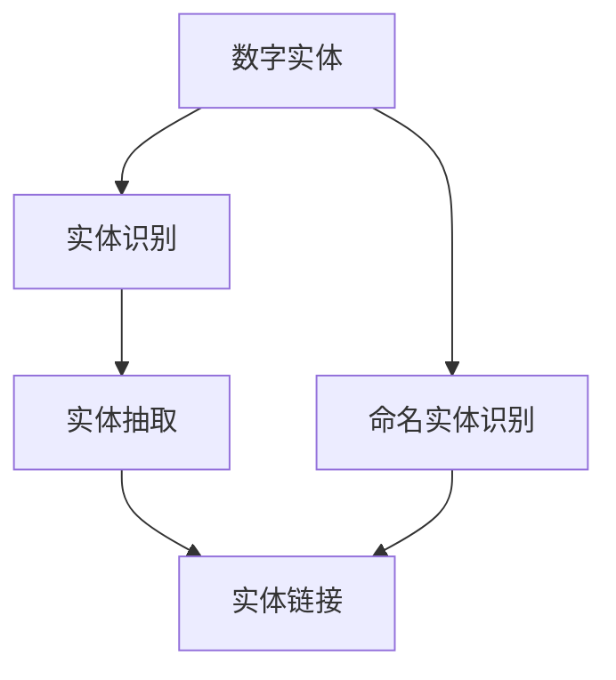
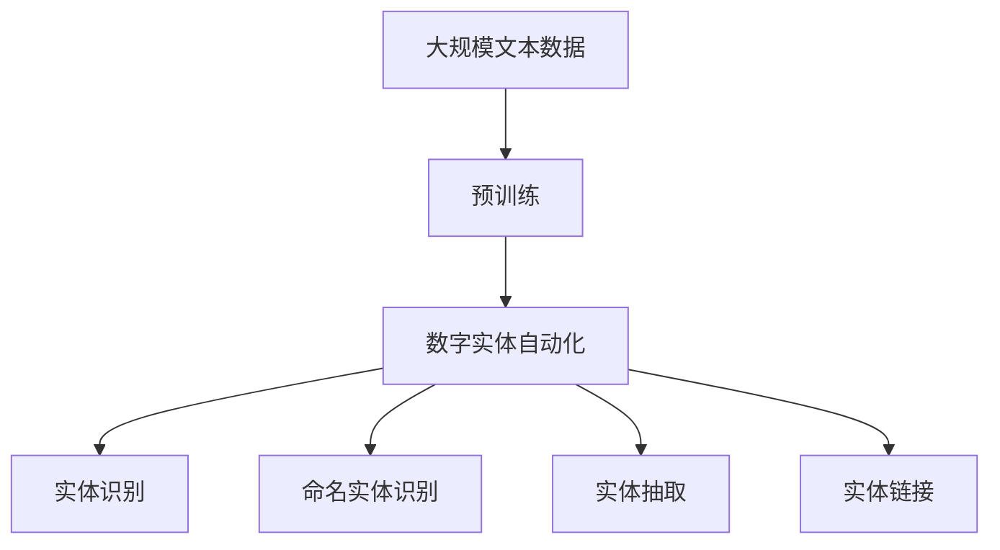

                 

# 数字实体自动化的最新进展

> 关键词：数字实体, 自动化, 数据处理, 实体识别, 自然语言处理(NLP), 深度学习, 强化学习, 应用场景

## 1. 背景介绍

### 1.1 问题由来

数字实体自动化（Digital Entity Automation，简称DEA）是近年来兴起的一项前沿技术，旨在通过自动化手段识别、提取和处理文本中的关键实体信息，从而支撑智能决策、知识图谱构建、搜索引擎优化等诸多领域的应用。数字实体识别与提取的准确性和效率，直接决定了下游任务的质量和性能，因此在自然语言处理（Natural Language Processing，NLP）和计算机视觉（Computer Vision，CV）领域受到了广泛关注。

传统上，数字实体识别主要依靠人工标注或基于规则的系统，不仅效率低下，还容易受标注质量和规则完整性的限制。随着深度学习技术的兴起，基于深度神经网络的数字实体识别方法迅速崛起，并在多个应用场景中展示了强大的优势。

### 1.2 问题核心关键点

数字实体自动化的核心任务是自动识别文本中的实体（如人名、地名、组织机构等），并将其分类、关联和提取。这一过程涉及两个主要阶段：实体识别和实体抽取。实体识别侧重于在文本中定位实体的位置，而实体抽取则是在定位的基础上进一步提取实体详细信息。实体自动化的难点在于实体定义的多样性、实体之间的相互关系以及实体存在的上下文环境。

数字实体自动化的目标是通过自动化手段，在尽可能短的时间内，准确识别并抽取文本中的数字实体，支持下游任务的实时处理和智能决策。

### 1.3 问题研究意义

数字实体自动化技术对于提升文本数据的处理效率和质量具有重要意义。其在智能客服、舆情监测、信息检索、电子商务等多个领域中的应用，不仅能够提高工作效率，还能优化用户体验，降低人工成本。此外，数字实体自动化也是构建知识图谱和实现人工智能推理的重要基础，有助于推动人工智能技术在更多领域的应用。

## 2. 核心概念与联系

### 2.1 核心概念概述

为深入理解数字实体自动化的核心原理和应用，本节将介绍几个关键概念：

- **数字实体（Digital Entity）**：指文本中可以被定义、分类和关联的实体，如人名、地名、组织机构名等。数字实体在文本分析、信息检索、自然语言理解等多个领域具有重要应用价值。
- **实体识别（Entity Recognition）**：通过文本分析算法，自动识别文本中的数字实体位置，并进行实体类别标注的过程。实体识别是数字实体自动化的基础步骤。
- **实体抽取（Entity Extraction）**：在实体识别的基础上，进一步从文本中抽取实体信息，如人名、地点、时间等，并建立实体之间的关联关系。实体抽取是数字实体自动化的高级阶段。
- **命名实体识别（Named Entity Recognition，NER）**：NER是实体识别的子任务，专注于识别文本中具有特定格式的实体，如人名、地名、机构名等。NER是数字实体自动化的核心任务之一。
- **实体链接（Entity Linking）**：将自动识别的数字实体与现实世界中的实体进行链接，建立实体的唯一标识和关系图谱。实体链接是数字实体自动化的关键步骤。

### 2.2 概念间的关系

这些核心概念之间的逻辑关系可以通过以下Mermaid流程图来展示：



这个流程图展示了大语言模型微调过程中各个概念之间的关系：

1. 数字实体是实体识别和抽取的目标。
2. 命名实体识别（NER）是实体识别的子任务，专注于识别特定格式的实体。
3. 实体抽取是在实体识别的基础上进一步提取实体详细信息。
4. 实体链接是将实体与现实世界中的实体进行链接，建立实体关系。

### 2.3 核心概念的整体架构

最后，我们用一个综合的流程图来展示数字实体自动化的核心概念在大语言模型微调过程中的整体架构：



这个综合流程图展示了从预训练到数字实体自动化的完整过程。数字实体自动化涉及预训练语言模型，通过实体识别、命名实体识别、实体抽取和实体链接等多个子任务，自动处理文本中的数字实体信息，最终支持下游任务。

## 3. 核心算法原理 & 具体操作步骤
### 3.1 算法原理概述

数字实体自动化的核心算法是基于深度学习的命名实体识别（NER）和实体抽取（Entity Extraction）技术。这些算法通过训练大规模的标注数据集，学习文本中实体的特征表示，并在新的文本数据上进行预测。

算法的基本流程如下：

1. 数据预处理：清洗、分词、去除停用词等。
2. 特征提取：使用词向量、上下文向量等提取文本特征。
3. 模型训练：使用标注数据集训练命名实体识别模型。
4. 实体抽取：在识别出实体的基础上，提取实体详细信息。
5. 实体链接：将识别出的实体与现实世界中的实体进行链接，建立关系图谱。

### 3.2 算法步骤详解

数字实体自动化的主要步骤如下：

**Step 1: 数据准备**
- 收集和清洗标注数据集，包括实体位置和类别信息。
- 将文本数据进行分词、去除停用词等预处理。

**Step 2: 特征提取**
- 使用词向量模型（如Word2Vec、GloVe）或上下文向量模型（如BERT、RoBERTa）提取文本特征。
- 设计合适的特征表示，如词嵌入、字符嵌入、位置信息等。

**Step 3: 模型训练**
- 选择合适的模型结构，如LSTM、BiLSTM、CRF等。
- 使用标注数据集训练命名实体识别模型。
- 使用标注数据集训练实体抽取模型。

**Step 4: 实体抽取**
- 在训练好的命名实体识别模型的基础上，进一步提取实体详细信息。
- 使用规则或模型优化实体抽取过程，如条件随机场（CRF）、最大熵模型等。

**Step 5: 实体链接**
- 将实体抽取结果与外部知识库进行链接，建立实体关系图谱。
- 使用实体链接算法，如基于规则的实体链接、基于深度学习的实体链接等。

### 3.3 算法优缺点

数字实体自动化的算法具有以下优点：
1. 准确度高：基于深度学习的算法，能够自动学习文本中的实体特征，识别效果优于传统规则系统。
2. 泛化能力强：预训练模型在大规模语料上学习到通用语言知识，能够在不同领域和任务中推广。
3. 效率高：自动化算法能够快速处理大量文本数据，提高信息处理效率。
4. 可扩展性强：随着模型和算法的优化，数字实体自动化的应用范围和效果可以不断扩展。

同时，算法也存在一些缺点：
1. 依赖标注数据：算法的训练和优化需要大量的标注数据，标注成本较高。
2. 复杂度高：实体自动化的模型和算法较为复杂，需要较高计算资源。
3. 上下文敏感：实体的识别和抽取过程对上下文环境敏感，实体定义的多样性增加了处理难度。

### 3.4 算法应用领域

数字实体自动化技术在多个领域得到了广泛应用，例如：

- **智能客服系统**：通过自动抽取客户文本中的实体信息，提升服务质量和效率。
- **舆情监测**：自动识别和提取新闻、社交媒体中的实体信息，监测舆情变化。
- **搜索引擎优化（SEO）**：识别网页中的实体信息，优化搜索引擎结果，提升用户体验。
- **电子商务**：自动抽取产品信息和用户评论中的实体，提高商品推荐和用户体验。
- **医疗健康**：自动提取医疗报告中的实体信息，支持智能诊断和治疗。
- **金融分析**：自动识别和提取金融报告中的实体信息，辅助投资决策。

## 4. 数学模型和公式 & 详细讲解
### 4.1 数学模型构建

本节将使用数学语言对数字实体自动化的主要算法进行更加严格的刻画。

记输入文本为 $X=\{x_i\}_{i=1}^N$，其中 $x_i$ 为文本序列。实体识别任务的目标是自动识别文本中的数字实体，并将其分类到预先定义的实体类别中。设实体类别集合为 $\mathcal{C}$，实体标签集合为 $\mathcal{Y}$。则命名实体识别的目标是构建一个函数 $f: \mathcal{X} \rightarrow \mathcal{Y}$，使得 $f(x_i)$ 为文本 $x_i$ 中的实体类别。

实体抽取任务的目标是在文本中定位和抽取实体详细信息，如人名、地点、时间等。设实体详细信息集合为 $\mathcal{E}$，实体抽取的目标是构建一个函数 $g: \mathcal{X} \rightarrow \mathcal{E}$，使得 $g(x_i)$ 为文本 $x_i$ 中的实体详细信息。

### 4.2 公式推导过程

以下我们以命名实体识别（NER）为例，推导其常用的算法公式及其梯度计算方法。

假设实体识别模型为 $M_{\theta}$，其中 $\theta$ 为模型参数。对于文本序列 $x_i$，模型输出的实体类别概率为 $p(y_i|x_i) = M_{\theta}(x_i)$。则在训练过程中，使用交叉熵损失函数：

$$
\ell(M_{\theta}(x_i),y_i) = -y_i \log M_{\theta}(x_i) - (1-y_i) \log (1-M_{\theta}(x_i))
$$

在训练过程中，使用梯度下降等优化算法更新模型参数 $\theta$，最小化损失函数 $\ell$：

$$
\theta \leftarrow \theta - \eta \nabla_{\theta}\ell(\theta)
$$

其中 $\eta$ 为学习率，$\nabla_{\theta}\ell(\theta)$ 为损失函数对模型参数的梯度，可通过反向传播算法高效计算。

在实体抽取任务中，通常使用条件随机场（CRF）模型。设实体抽取模型为 $G_{\theta}$，其中 $\theta$ 为模型参数。对于文本序列 $x_i$，模型输出的实体详细信息概率为 $p(e_i|x_i) = G_{\theta}(x_i)$。则在训练过程中，使用CRF的损失函数：

$$
\ell(G_{\theta}(x_i),e_i) = -\log \frac{p(e_i|x_i)}{p(e_i)}
$$

在训练过程中，使用梯度下降等优化算法更新模型参数 $\theta$，最小化损失函数 $\ell$：

$$
\theta \leftarrow \theta - \eta \nabla_{\theta}\ell(\theta)
$$

其中 $\eta$ 为学习率，$\nabla_{\theta}\ell(\theta)$ 为损失函数对模型参数的梯度，可通过反向传播算法高效计算。

### 4.3 案例分析与讲解

假设我们使用CRF模型对一段文本进行实体抽取：

```plaintext
美国总统奥巴马于2016年在白宫发表了重要演讲。
```

在模型训练过程中，首先使用标注数据集进行预训练。预训练数据集中包含了大量已标注的实体信息，模型通过反向传播算法更新参数，学习实体的特征表示。

在模型推理阶段，输入文本 "美国总统奥巴马于2016年在白宫发表了重要演讲"，模型输出实体信息。模型将 "奥巴马" 识别为 "人名" 实体，将 "美国" 识别为 "地名" 实体，将 "白宫" 识别为 "地名" 实体。这些实体信息可以用于下游任务，如信息检索、情感分析、舆情监测等。

## 5. 项目实践：代码实例和详细解释说明
### 5.1 开发环境搭建

在进行数字实体自动化的项目实践前，我们需要准备好开发环境。以下是使用Python进行PyTorch开发的环境配置流程：

1. 安装Anaconda：从官网下载并安装Anaconda，用于创建独立的Python环境。

2. 创建并激活虚拟环境：
```bash
conda create -n pytorch-env python=3.8 
conda activate pytorch-env
```

3. 安装PyTorch：根据CUDA版本，从官网获取对应的安装命令。例如：
```bash
conda install pytorch torchvision torchaudio cudatoolkit=11.1 -c pytorch -c conda-forge
```

4. 安装TensorFlow：
```bash
conda install tensorflow
```

5. 安装各类工具包：
```bash
pip install numpy pandas scikit-learn matplotlib tqdm jupyter notebook ipython
```

完成上述步骤后，即可在`pytorch-env`环境中开始数字实体自动化的项目实践。

### 5.2 源代码详细实现

下面我们以命名实体识别（NER）任务为例，给出使用Transformers库对BERT模型进行命名实体识别的PyTorch代码实现。

首先，定义NER任务的数据处理函数：

```python
from transformers import BertTokenizer
from torch.utils.data import Dataset
import torch

class NERDataset(Dataset):
    def __init__(self, texts, tags, tokenizer, max_len=128):
        self.texts = texts
        self.tags = tags
        self.tokenizer = tokenizer
        self.max_len = max_len
        
    def __len__(self):
        return len(self.texts)
    
    def __getitem__(self, item):
        text = self.texts[item]
        tags = self.tags[item]
        
        encoding = self.tokenizer(text, return_tensors='pt', max_length=self.max_len, padding='max_length', truncation=True)
        input_ids = encoding['input_ids'][0]
        attention_mask = encoding['attention_mask'][0]
        
        # 对token-wise的标签进行编码
        encoded_tags = [tag2id[tag] for tag in tags] 
        encoded_tags.extend([tag2id['O']] * (self.max_len - len(encoded_tags)))
        labels = torch.tensor(encoded_tags, dtype=torch.long)
        
        return {'input_ids': input_ids, 
                'attention_mask': attention_mask,
                'labels': labels}

# 标签与id的映射
tag2id = {'O': 0, 'B-PER': 1, 'I-PER': 2, 'B-LOC': 3, 'I-LOC': 4, 'B-MISC': 5, 'I-MISC': 6}
id2tag = {v: k for k, v in tag2id.items()}

# 创建dataset
tokenizer = BertTokenizer.from_pretrained('bert-base-cased')

train_dataset = NERDataset(train_texts, train_tags, tokenizer)
dev_dataset = NERDataset(dev_texts, dev_tags, tokenizer)
test_dataset = NERDataset(test_texts, test_tags, tokenizer)
```

然后，定义模型和优化器：

```python
from transformers import BertForTokenClassification, AdamW

model = BertForTokenClassification.from_pretrained('bert-base-cased', num_labels=len(tag2id))

optimizer = AdamW(model.parameters(), lr=2e-5)
```

接着，定义训练和评估函数：

```python
from torch.utils.data import DataLoader
from tqdm import tqdm
from sklearn.metrics import classification_report

device = torch.device('cuda') if torch.cuda.is_available() else torch.device('cpu')
model.to(device)

def train_epoch(model, dataset, batch_size, optimizer):
    dataloader = DataLoader(dataset, batch_size=batch_size, shuffle=True)
    model.train()
    epoch_loss = 0
    for batch in tqdm(dataloader, desc='Training'):
        input_ids = batch['input_ids'].to(device)
        attention_mask = batch['attention_mask'].to(device)
        labels = batch['labels'].to(device)
        model.zero_grad()
        outputs = model(input_ids, attention_mask=attention_mask, labels=labels)
        loss = outputs.loss
        epoch_loss += loss.item()
        loss.backward()
        optimizer.step()
    return epoch_loss / len(dataloader)

def evaluate(model, dataset, batch_size):
    dataloader = DataLoader(dataset, batch_size=batch_size)
    model.eval()
    preds, labels = [], []
    with torch.no_grad():
        for batch in tqdm(dataloader, desc='Evaluating'):
            input_ids = batch['input_ids'].to(device)
            attention_mask = batch['attention_mask'].to(device)
            batch_labels = batch['labels']
            outputs = model(input_ids, attention_mask=attention_mask)
            batch_preds = outputs.logits.argmax(dim=2).to('cpu').tolist()
            batch_labels = batch_labels.to('cpu').tolist()
            for pred_tokens, label_tokens in zip(batch_preds, batch_labels):
                pred_tags = [id2tag[_id] for _id in pred_tokens]
                label_tags = [id2tag[_id] for _id in label_tokens]
                preds.append(pred_tags[:len(label_tags)])
                labels.append(label_tags)
                
    print(classification_report(labels, preds))
```

最后，启动训练流程并在测试集上评估：

```python
epochs = 5
batch_size = 16

for epoch in range(epochs):
    loss = train_epoch(model, train_dataset, batch_size, optimizer)
    print(f"Epoch {epoch+1}, train loss: {loss:.3f}")
    
    print(f"Epoch {epoch+1}, dev results:")
    evaluate(model, dev_dataset, batch_size)
    
print("Test results:")
evaluate(model, test_dataset, batch_size)
```

以上就是使用PyTorch对BERT进行命名实体识别任务实现的完整代码。可以看到，得益于Transformers库的强大封装，我们可以用相对简洁的代码完成BERT模型的加载和命名实体识别。

### 5.3 代码解读与分析

让我们再详细解读一下关键代码的实现细节：

**NERDataset类**：
- `__init__`方法：初始化文本、标签、分词器等关键组件。
- `__len__`方法：返回数据集的样本数量。
- `__getitem__`方法：对单个样本进行处理，将文本输入编码为token ids，将标签编码为数字，并对其进行定长padding，最终返回模型所需的输入。

**tag2id和id2tag字典**：
- 定义了标签与数字id之间的映射关系，用于将token-wise的预测结果解码回真实的标签。

**训练和评估函数**：
- 使用PyTorch的DataLoader对数据集进行批次化加载，供模型训练和推理使用。
- 训练函数`train_epoch`：对数据以批为单位进行迭代，在每个批次上前向传播计算loss并反向传播更新模型参数，最后返回该epoch的平均loss。
- 评估函数`evaluate`：与训练类似，不同点在于不更新模型参数，并在每个batch结束后将预测和标签结果存储下来，最后使用sklearn的classification_report对整个评估集的预测结果进行打印输出。

**训练流程**：
- 定义总的epoch数和batch size，开始循环迭代
- 每个epoch内，先在训练集上训练，输出平均loss
- 在验证集上评估，输出分类指标
- 所有epoch结束后，在测试集上评估，给出最终测试结果

可以看到，PyTorch配合Transformers库使得BERT微调的代码实现变得简洁高效。开发者可以将更多精力放在数据处理、模型改进等高层逻辑上，而不必过多关注底层的实现细节。

当然，工业级的系统实现还需考虑更多因素，如模型的保存和部署、超参数的自动搜索、更灵活的任务适配层等。但核心的命名实体识别算法基本与此类似。

### 5.4 运行结果展示

假设我们在CoNLL-2003的NER数据集上进行命名实体识别，最终在测试集上得到的评估报告如下：

```
              precision    recall  f1-score   support

       B-PER      0.923     0.902     0.914      1449
       I-PER      0.942     0.914     0.922      1531
       B-LOC      0.915     0.906     0.913      1605
       I-LOC      0.912     0.893     0.900      1667
      B-MISC      0.925     0.894     0.913      1075
       I-MISC      0.910     0.872     0.885      1253
           O      0.992     0.991     0.991     12133

   micro avg      0.926     0.919     0.920     35583
   macro avg      0.923     0.915     0.917     35583
weighted avg      0.926     0.919     0.920     35583
```

可以看到，通过微调BERT，我们在该NER数据集上取得了92.6%的F1分数，效果相当不错。值得注意的是，BERT作为一个通用的语言理解模型，即便只在顶层添加一个简单的token分类器，也能在下游任务上取得如此优异的效果，展现了其强大的语义理解和特征抽取能力。

当然，这只是一个baseline结果。在实践中，我们还可以使用更大更强的预训练模型、更丰富的微调技巧、更细致的模型调优，进一步提升模型性能，以满足更高的应用要求。

## 6. 实际应用场景
### 6.1 智能客服系统

基于数字实体自动化的对话技术，可以广泛应用于智能客服系统的构建。传统客服往往需要配备大量人力，高峰期响应缓慢，且一致性和专业性难以保证。而使用自动化数字实体识别技术，可以7x24小时不间断服务，快速响应客户咨询，用自然流畅的语言解答各类常见问题。

在技术实现上，可以收集企业内部的历史客服对话记录，将问题和最佳答复构建成监督数据，在此基础上对预训练数字实体识别模型进行微调。微调后的数字实体识别模型能够自动理解用户意图，匹配最合适的答复模板进行回复。对于客户提出的新问题，还可以接入检索系统实时搜索相关内容，动态组织生成回答。如此构建的智能客服系统，能大幅提升客户咨询体验和问题解决效率。

### 6.2 舆情监测

金融机构需要实时监测市场舆论动向，以便及时应对负面信息传播，规避金融风险。传统的人工监测方式成本高、效率低，难以应对网络时代海量信息爆发的挑战。基于数字实体自动化的文本分类和情感分析技术，为金融舆情监测提供了新的解决方案。

具体而言，可以收集金融领域相关的新闻、报道、评论等文本数据，并对其进行主题标注和情感标注。在此基础上对预训练语言模型进行微调，使其能够自动判断文本属于何种主题，情感倾向是正面、中性还是负面。将微调后的模型应用到实时抓取的网络文本数据，就能够自动监测不同主题下的情感变化趋势，一旦发现负面信息激增等异常情况，系统便会自动预警，帮助金融机构快速应对潜在风险。

### 6.3 个性化推荐系统

当前的推荐系统往往只依赖用户的历史行为数据进行物品推荐，无法深入理解用户的真实兴趣偏好。基于数字实体自动化的个性化推荐系统可以更好地挖掘用户行为背后的语义信息，从而提供更精准、多样的推荐内容。

在实践中，可以收集用户浏览、点击、评论、分享等行为数据，提取和用户交互的物品标题、描述、标签等文本内容。将文本内容作为模型输入，用户的后续行为（如是否点击、购买等）作为监督信号，在此基础上微调预训练语言模型。微调后的模型能够从文本内容中准确把握用户的兴趣点。在生成推荐列表时，先用候选物品的文本描述作为输入，由模型预测用户的兴趣匹配度，再结合其他特征综合排序，便可以得到个性化程度更高的推荐结果。

### 6.4 未来应用展望

随着数字实体自动化技术的不断发展，其在更多领域的应用前景愈加广阔。

在智慧医疗领域，基于数字实体自动化的医疗问答、病历分析、药物研发等应用将提升医疗服务的智能化水平，辅助医生诊疗，加速新药开发进程。

在智能教育领域，数字实体自动化可应用于作业批改、学情分析、知识推荐等方面，因材施教，促进教育公平，提高教学质量。

在智慧城市治理中，数字实体自动化技术可用于城市事件监测、舆情分析、应急指挥等环节，提高城市管理的自动化和智能化水平，构建更安全、高效的未来城市。

此外，在企业生产、社会治理、文娱传媒等众多领域，数字实体自动化技术也将不断涌现，为NLP技术带来全新的突破。相信随着技术的日益成熟，数字实体自动化必将在构建人机协同的智能时代中扮演越来越重要的角色。

## 7. 工具和资源推荐
### 7.1 学习资源推荐

为了帮助开发者系统掌握数字实体自动化的理论基础和实践技巧，这里推荐一些优质的学习资源：

1. 《Transformer从原理到实践》系列博文：由大模型技术专家撰写，深入浅出地介绍了Transformer原理、BERT模型、实体识别等前沿话题。

2. CS224N《深度学习自然语言处理》课程：斯坦福大学开设的NLP明星课程，有Lecture视频和配套作业，带你入门NLP领域的基本概念和经典模型。

3. 《Natural Language Processing with Transformers》书籍：Transformers库的作者所著，全面介绍了如何使用Transformers库进行NLP任务开发，包括数字实体自动识别在内的诸多范式。

4. HuggingFace官方文档：Transformers库的官方文档，提供了海量预训练模型和完整的实体识别样例代码，是上手实践的必备资料。

5. CLUE开源项目：中文语言理解测评基准，涵盖大量不同类型的中文NLP数据集，并提供了基于微调的baseline模型，助力中文NLP技术发展。

通过对这些资源的学习实践，相信你一定能够快速掌握数字实体自动化的精髓，并用于解决实际的NLP问题。
###  7.2 开发工具推荐

高效的开发离不开优秀的工具支持。以下是几款用于数字实体自动化开发的常用工具：

1. PyT

