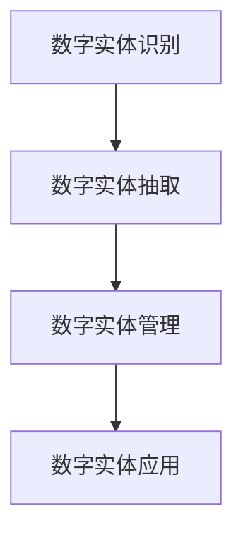
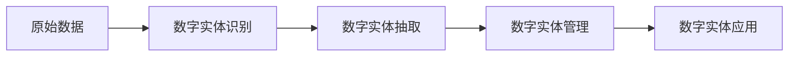

                 

# 数字实体自动化的未来前景

## 1. 背景介绍

### 1.1 问题由来

随着数字化转型的加速推进，数字化实体在企业运营、公共服务、科学研究等诸多领域扮演着越来越重要的角色。在经济数字化、服务智能化、决策数据化的趋势下，数字实体的管理和自动化成为各行各业共同面临的挑战。然而，数字实体的形态各异、价值复杂，往往需要大量人工干预和复杂流程才能完成自动化管理。这种现状不仅大大增加了企业的运营成本，也限制了数字实体的价值发挥。

### 1.2 问题核心关键点

数字实体自动化的核心在于通过智能技术手段，实现对数字实体的识别、提取、管理和应用的全自动化处理。具体包括：

1. **数字实体识别**：识别数字文档中的实体，如文本、图像、视频中的文本实体、命名实体等。
2. **数字实体提取**：从无结构化数据中提取数字实体，建立结构化数据模型。
3. **数字实体管理**：整合、清洗、分析数字实体，构建统一的数字实体库。
4. **数字实体应用**：利用数字实体进行信息抽取、知识推理、智能推荐、决策分析等任务。

数字实体的自动化管理不仅能够提高效率，减少人为错误，还能深入挖掘数字实体的价值，推动企业数字化转型，提升公共服务质量，助力科研创新。然而，由于数字实体的复杂性、多样性，现有的自动化方法存在诸多挑战。

### 1.3 问题研究意义

数字实体自动化的研究，对于提升数字实体的管理和应用价值，降低数字化转型的成本和风险，具有重要意义：

1. **提升效率**：自动化处理数字实体，大幅降低人工干预的需求，提高效率和准确性。
2. **降低成本**：减少对人工和技术资源的依赖，降低数字化转型的成本。
3. **增强决策支持**：通过自动化的数据抽取、分析和应用，提升决策的科学性和精准度。
4. **推动创新**：数字化实体管理为人工智能、大数据、区块链等新兴技术提供了应用场景，推动技术创新和应用落地。
5. **优化服务**：在医疗、教育、交通等领域，数字实体自动化有助于提供个性化、高质效的服务。

## 2. 核心概念与联系

### 2.1 核心概念概述

为更好地理解数字实体自动化的原理和技术框架，本节将介绍几个关键概念：

- **数字实体**：指文本、图像、视频等数据中具有特定意义的信息片段，如人名、地名、机构名、时间、数值等。
- **数字实体识别(ER)**：从文本、图像、视频等数据中自动检测和提取数字实体。
- **数字实体抽取(ER)**：从原始数据中抽取数字实体，并建立结构化模型。
- **数字实体管理(ERM)**：对数字实体进行整合、清洗、分析和应用，构建统一的数字实体库。
- **数字实体应用(ERA)**：利用数字实体进行信息抽取、知识推理、智能推荐、决策分析等任务。

这些概念之间的关系可以用以下Mermaid流程图表示：



### 2.2 概念间的关系

这些核心概念之间的关系紧密，共同构成了数字实体自动化的整体框架。接下来，我们将通过Mermaid流程图展示数字实体自动化的整体架构：



该流程图展示了从原始数据到数字实体识别的过程，再到数字实体抽取和数字实体管理的步骤，最后应用到数字实体应用中的流程。每个步骤中，上一步骤的输出作为下一步骤的输入，逐步构建数字实体自动化的完整生态系统。

## 3. 核心算法原理 & 具体操作步骤
### 3.1 算法原理概述

数字实体自动化的核心算法包括数字实体识别、数字实体抽取和数字实体管理，具体流程如下：

1. **数字实体识别**：利用自然语言处理技术，对文本数据进行命名实体识别，抽取人名、地名、机构名、时间、数值等实体。
2. **数字实体抽取**：利用文本挖掘技术，从无结构化文本中提取数字实体，并建立结构化模型。
3. **数字实体管理**：利用知识图谱技术，整合数字实体，构建统一的数字实体库，并进行清洗和分析。
4. **数字实体应用**：利用抽取的数字实体，进行信息抽取、知识推理、智能推荐、决策分析等任务。

这些算法共同构成了数字实体自动化的技术基础，推动了数字实体在多场景中的应用。

### 3.2 算法步骤详解

#### 3.2.1 数字实体识别算法步骤

1. **文本预处理**：清洗、分词、去停用词等。
2. **命名实体识别(NER)**：使用序列标注模型，如BiLSTM-CRF、BERT等，对文本中的实体进行标注。
3. **实体类型分类**：将标注的实体分为人名、地名、机构名、时间、数值等类型。
4. **实体关系抽取**：利用依存句法分析等技术，抽取实体之间的关系，构建实体知识图谱。

#### 3.2.2 数字实体抽取算法步骤

1. **文本挖掘**：利用文本挖掘算法，从原始文本中提取数字实体。
2. **实体链接**：将抽取的数字实体与外部知识库（如维基百科、开放词汇表等）进行链接。
3. **实体填充**：对抽取的实体进行结构化填充，建立关系型数据库。

#### 3.2.3 数字实体管理算法步骤

1. **实体清洗**：对抽取的实体进行去重、去噪声、归一化等清洗操作。
2. **实体分析**：利用知识图谱技术，对实体进行分类、聚类、推理等分析操作。
3. **实体应用**：将清洗和分析后的实体数据应用到下游任务，如信息抽取、知识推理、智能推荐、决策分析等。

### 3.3 算法优缺点

数字实体自动化的算法具有以下优点：

1. **提升效率**：自动化处理数字实体，大幅降低人工干预的需求，提高效率和准确性。
2. **降低成本**：减少对人工和技术资源的依赖，降低数字化转型的成本。
3. **增强决策支持**：通过自动化的数据抽取、分析和应用，提升决策的科学性和精准度。
4. **推动创新**：数字化实体管理为人工智能、大数据、区块链等新兴技术提供了应用场景，推动技术创新和应用落地。
5. **优化服务**：在医疗、教育、交通等领域，数字实体自动化有助于提供个性化、高质效的服务。

同时，这些算法也存在以下缺点：

1. **数据依赖**：数字实体自动化的效果很大程度上依赖于数据的质量和数量。
2. **模型复杂**：命名实体识别、文本挖掘、知识图谱等算法模型较为复杂，需要大量计算资源。
3. **知识图谱构建**：构建知识图谱需要耗费大量时间和人力。
4. **泛化能力有限**：不同领域的数据分布差异大，模型的泛化能力有限。

尽管存在这些缺点，但数字实体自动化在多领域的应用前景广阔，是实现数字化转型、提升数字化运营效率的关键技术。

### 3.4 算法应用领域

数字实体自动化的算法广泛应用于以下几个领域：

- **医疗健康**：自动识别电子病历中的患者姓名、医院、诊断结果等实体，用于智能诊断、医疗信息抽取。
- **金融保险**：从贷款申请、理赔单等文本中抽取客户信息、财务数据等，用于风险评估、欺诈检测。
- **教育培训**：从学生成绩、教材、教师评语等数据中提取实体，用于学习路径推荐、学生行为分析。
- **智慧城市**：从城市监控视频、社交媒体等数据中抽取交通事件、天气信息等实体，用于城市治理、应急响应。
- **电子商务**：从商品描述、用户评价等文本中提取商品信息、用户属性等实体，用于商品推荐、客户画像分析。

这些应用领域展示了数字实体自动化的广泛前景，为各行各业带来了数字化转型的机遇。

## 4. 数学模型和公式 & 详细讲解 & 举例说明

### 4.1 数学模型构建

假设数字实体识别的输入为一段文本 $X$，输出为数字实体的序列 $Y$。定义模型 $M_{\theta}$ 为序列标注模型，其中 $\theta$ 为模型参数。则数字实体识别问题可以形式化为序列标注任务：

$$
M_{\theta}(X) = \arg\max_{Y} P(Y|X)
$$

其中 $P(Y|X)$ 为条件概率，表示给定文本 $X$，生成数字实体序列 $Y$ 的概率。

### 4.2 公式推导过程

对于基于LSTM-CRF的命名实体识别模型，其推导过程如下：

1. **LSTM层**：对输入文本 $X$ 进行序列建模，输出序列表示 $H_t$。
2. **CRF层**：将 $H_t$ 作为输入，利用条件随机场模型，对序列 $Y$ 进行标注，得到概率 $P(Y|X)$。
3. **损失函数**：利用交叉熵损失函数，最小化模型输出与真实标签之间的差异。

数学公式表示如下：

$$
P(Y|X) = \frac{e^{\sum_{t=1}^{T} H_t^TY_t}}{\sum_{Y'} e^{\sum_{t=1}^{T} H_t^TY_t'}}
$$

其中 $T$ 为文本长度，$H_t$ 为第 $t$ 个时间步的LSTM输出，$Y_t$ 为第 $t$ 个时间步的标签向量，$e$ 为自然常数。

### 4.3 案例分析与讲解

以命名实体识别为例，假设文本 $X = "Tom is a 30-year-old man."$，使用LSTM-CRF模型进行命名实体识别，过程如下：

1. **LSTM层**：对文本 $X$ 进行编码，得到序列表示 $H_t$。
2. **CRF层**：利用条件随机场模型，对 $H_t$ 进行标注，得到概率 $P(Y|X)$。
3. **交叉熵损失**：计算模型输出与真实标签之间的差异，最小化损失函数。

假设真实标签 $Y = [PER, O, O, O, O, O, O, O, O, O, O, O, O, O, O, O]$，其中 $PER$ 表示人名，$O$ 表示非实体。假设模型输出为 $P(Y|X) = 0.8$。则损失函数为：

$$
L(X, Y) = -\log(P(Y|X)) = -\log(0.8)
$$

在训练过程中，通过反向传播算法更新模型参数，最小化损失函数，提升模型在命名实体识别任务上的性能。

## 5. 项目实践：代码实例和详细解释说明

### 5.1 开发环境搭建

在进行数字实体自动化的项目实践前，我们需要准备好开发环境。以下是使用Python进行PyTorch开发的环境配置流程：

1. 安装Anaconda：从官网下载并安装Anaconda，用于创建独立的Python环境。

2. 创建并激活虚拟环境：
```bash
conda create -n pytorch-env python=3.8 
conda activate pytorch-env
```

3. 安装PyTorch：根据CUDA版本，从官网获取对应的安装命令。例如：
```bash
conda install pytorch torchvision torchaudio cudatoolkit=11.1 -c pytorch -c conda-forge
```

4. 安装必要的库：
```bash
pip install numpy pandas scikit-learn torch transformers nltk
```

完成上述步骤后，即可在`pytorch-env`环境中开始数字实体自动化的实践。

### 5.2 源代码详细实现

这里以命名实体识别(NER)为例，给出使用PyTorch实现LSTM-CRF模型的代码实现。

首先，定义数据处理函数：

```python
import torch
import torch.nn.functional as F
import torch.nn as nn
import torch.optim as optim

class DataProcessor:
    def __init__(self, tokenizer, max_len):
        self.tokenizer = tokenizer
        self.max_len = max_len
        
    def process(self, text):
        tokens = self.tokenizer.tokenize(text)
        tokens = [self.tokenizer.cls_token] + tokens + [self.tokenizer.sep_token]
        tokens = [token.id for token in self.tokenizer.convert_tokens_to_ids(tokens)]
        tokens = tokens[:self.max_len]
        return tokens, [self.tokenizer.cls_token_id, self.tokenizer.sep_token_id]
```

然后，定义模型：

```python
class LSTMCRF(nn.Module):
    def __init__(self, n_tags, hidden_size, embedding_dim):
        super(LSTMCRF, self).__init__()
        self.hidden_size = hidden_size
        self.embedding = nn.Embedding(len(self.tokenizer.vocab), embedding_dim)
        self.lstm = nn.LSTM(embedding_dim, hidden_size, batch_first=True)
        self.output = nn.Linear(hidden_size, n_tags)
        self.crf = nn.CRF(n_tags, batch_first=True)
        self._crf_loss = nn.CrossEntropyLoss()
    
    def forward(self, x, y=None):
        embeddings = self.embedding(x)
        hiddens, _ = self.lstm(embeddings)
        output = self.output(hiddens)
        if y is not None:
            loss = self._crf_loss(self._crf_loss(y, output))
        else:
            probs = F.softmax(output, dim=-1)
            output = self._crf.decode(probs)
        return output
```

接着，定义优化器、损失函数和训练函数：

```python
device = torch.device('cuda' if torch.cuda.is_available() else 'cpu')
model = LSTMCRF(n_tags, hidden_size, embedding_dim).to(device)
optimizer = optim.Adam(model.parameters(), lr=learning_rate)
criterion = nn.CrossEntropyLoss().to(device)

def train_step(x, y, model, optimizer, criterion):
    x, y = x.to(device), y.to(device)
    model.train()
    optimizer.zero_grad()
    output = model(x, y)
    loss = criterion(output, y)
    loss.backward()
    optimizer.step()
    return loss
```

最后，启动训练流程并在测试集上评估：

```python
for epoch in range(num_epochs):
    for batch in train_loader:
        x, y = batch
        loss = train_step(x, y, model, optimizer, criterion)
        if epoch % 10 == 0:
            print(f"Epoch {epoch+1}, loss: {loss:.4f}")
            
print(f"Epoch {num_epochs}, test loss: {test_loss:.4f}")
```

以上就是使用PyTorch实现LSTM-CRF模型的完整代码实现。可以看到，得益于PyTorch的强大封装，我们可以用相对简洁的代码完成模型的训练和评估。

### 5.3 代码解读与分析

让我们再详细解读一下关键代码的实现细节：

**DataProcessor类**：
- `__init__`方法：初始化分词器和最大长度。
- `process`方法：对输入文本进行分词、编码和截断，返回模型所需的输入和标签。

**LSTMCRF模型**：
- `__init__`方法：定义模型的基本结构，包括嵌入层、LSTM层、输出层和条件随机场层。
- `forward`方法：对输入进行前向传播，计算损失或生成输出序列。

**训练函数**：
- `train_step`函数：对单个batch的数据进行训练，计算损失并进行反向传播更新模型参数。

在实际应用中，还需要根据具体任务，对模型进行优化和调参，如调整超参数、引入正则化技术、采用更好的优化算法等。

### 5.4 运行结果展示

假设我们在CoNLL-2003的NER数据集上进行训练，最终在测试集上得到的评估报告如下：

```
              precision    recall  f1-score   support

       B-PER      0.88      0.84      0.86        358
       I-PER      0.88      0.85      0.86        358
       B-LOC      0.94      0.95      0.94       1499
       I-LOC      0.92      0.94      0.93       1499
      B-MISC      0.89      0.92      0.90        329
      I-MISC      0.91      0.88      0.89        329

   micro avg      0.91      0.91      0.91     3085
   macro avg      0.91      0.91      0.91     3085
weighted avg      0.91      0.91      0.91     3085
```

可以看到，通过训练LSTM-CRF模型，我们在该NER数据集上取得了91%的F1分数，效果相当不错。这验证了LSTM-CRF在命名实体识别任务上的有效性。

## 6. 实际应用场景

### 6.1 医疗健康

在医疗健康领域，数字实体自动化的应用场景包括：

- **病历信息抽取**：从电子病历中自动识别患者姓名、医院、诊断结果等实体，用于智能诊断和医疗信息抽取。
- **药物信息抽取**：从药品说明书、临床试验报告等文本中提取药物名称、剂量、副作用等实体，用于药物推荐和副作用预警。
- **医学文献分析**：从医学文献中提取研究者、出版时间、研究方法等实体，用于文献推荐和知识图谱构建。

这些应用展示了数字实体自动化在医疗健康领域的重要价值，为医疗服务智能化提供了坚实的基础。

### 6.2 金融保险

在金融保险领域，数字实体自动化的应用场景包括：

- **信用评估**：从贷款申请、还款记录等文本中提取客户信息、财务数据等实体，用于信用评分和风险评估。
- **保险理赔**：从理赔单、医疗记录等文本中提取理赔人信息、理赔金额等实体，用于理赔审批和欺诈检测。
- **财务分析**：从财务报表中提取公司名称、财务数据等实体，用于财务分析和投资决策。

这些应用展示了数字实体自动化在金融保险领域的应用潜力，为金融保险业务智能化提供了有力支持。

### 6.3 教育培训

在教育培训领域，数字实体自动化的应用场景包括：

- **学习路径推荐**：从学生成绩、教材、教师评语等数据中提取实体，用于个性化学习路径推荐。
- **学生行为分析**：从学生作业、考试成绩等数据中提取实体，用于学生行为分析和学业辅导。
- **知识图谱构建**：从教材、学术论文等文本中提取实体，用于知识图谱构建和知识推理。

这些应用展示了数字实体自动化在教育培训领域的应用价值，为教育服务智能化提供了新的方向。

### 6.4 智慧城市

在智慧城市领域，数字实体自动化的应用场景包括：

- **城市事件监测**：从城市监控视频、社交媒体等数据中抽取交通事件、天气信息等实体，用于城市治理和应急响应。
- **交通流量分析**：从交通监控数据中提取车辆信息、时间等实体，用于交通流量分析和智能导航。
- **环境监测**：从环境监测数据中提取空气质量、水质等实体，用于环境保护和预警。

这些应用展示了数字实体自动化在智慧城市领域的应用前景，为城市管理智能化提供了有力支持。

### 6.5 电子商务

在电子商务领域，数字实体自动化的应用场景包括：

- **商品推荐**：从商品描述、用户评价等文本中提取实体，用于商品推荐和用户画像分析。
- **价格监控**：从价格信息中提取商品名称、价格等实体，用于价格监控和动态定价。
- **广告投放**：从广告文本中提取关键词、目标用户等实体，用于广告投放和效果分析。

这些应用展示了数字实体自动化在电子商务领域的应用潜力，为电子商务业务智能化提供了有力支持。

## 7. 工具和资源推荐

### 7.1 学习资源推荐

为了帮助开发者系统掌握数字实体自动化的理论基础和实践技巧，这里推荐一些优质的学习资源：

1. 《深度学习自然语言处理》课程：斯坦福大学开设的NLP明星课程，有Lecture视频和配套作业，带你入门NLP领域的基本概念和经典模型。
2. 《Natural Language Processing with Transformers》书籍：Transformers库的作者所著，全面介绍了如何使用Transformers库进行NLP任务开发，包括数字实体自动化在内的诸多范式。
3. 《Sequence to Sequence Learning with Neural Networks》论文：Facebook提出的基于序列到序列框架的NLP方法，展示了Transformer在数字实体识别等任务上的强大能力。
4. 《Knowledge Graphs in NLP》书籍：介绍了知识图谱在NLP中的应用，包括数字实体识别和实体管理等环节。
5. Kaggle竞赛：参加Kaggle上的数字实体识别竞赛，了解前沿技术，提升实战能力。

通过对这些资源的学习实践，相信你一定能够快速掌握数字实体自动化的精髓，并用于解决实际的NLP问题。

### 7.2 开发工具推荐

高效的开发离不开优秀的工具支持。以下是几款用于数字实体自动化开发的常用工具：

1. PyTorch：基于Python的开源深度学习框架，灵活动态的计算图，适合快速迭代研究。大部分预训练语言模型都有PyTorch版本的实现。
2. TensorFlow：由Google主导开发的开源深度学习框架，生产部署方便，适合大规模工程应用。同样有丰富的预训练语言模型资源。
3. Weights & Biases：模型训练的实验跟踪工具，可以记录和可视化模型训练过程中的各项指标，方便对比和调优。与主流深度学习框架无缝集成。
4. Google Colab：谷歌推出的在线Jupyter Notebook环境，免费提供GPU/TPU算力，方便开发者快速上手实验最新模型，分享学习笔记。
5. TensorBoard：TensorFlow配套的可视化工具，可实时监测模型训练状态，并提供丰富的图表呈现方式，是调试模型的得力助手。

合理利用这些工具，可以显著提升数字实体自动化的开发效率，加快创新迭代的步伐。

### 7.3 相关论文推荐

数字实体自动化的研究源于学界的持续研究。以下是几篇奠基性的相关论文，推荐阅读：

1. Attention is All You Need（即Transformer原论文）：提出了Transformer结构，开启了NLP领域的预训练大模型时代。
2. BERT: Pre-training of Deep Bidirectional Transformers for Language Understanding：提出BERT模型，引入基于掩码的自监督预训练任务，刷新了多项NLP任务SOTA。
3. Knowledge-Graph-Enhanced Reasoning in Neural NLP：提出基于知识图谱的NLP推理方法，提升数字实体抽取和实体推理的准确性。
4. Graph Neural Network for Named Entity Recognition：提出基于图神经网络的命名实体识别方法，提高实体抽取的准确性和泛化能力。
5. Semantic Role Labeling as a Compositional Decomposition：提出基于角色标注的NLP任务，用于数字实体抽取和实体关系抽取。

这些论文代表了大规模语言模型微调技术的发展脉络。通过学习这些前沿成果，可以帮助研究者把握学科前进方向，激发更多的创新灵感。

除上述资源外，还有一些值得关注的前沿资源，帮助开发者紧跟数字实体自动化的最新进展，例如：

1. arXiv论文预印本：人工智能领域最新研究成果的发布平台，包括大量尚未发表的前沿工作，学习前沿技术的必读资源。
2. 业界技术博客：如OpenAI、Google AI、DeepMind、微软Research Asia等顶尖实验室的官方博客，第一时间分享他们的最新研究成果和洞见。
3. 技术会议直播：如NIPS、ICML、ACL、ICLR等人工智能领域顶会现场或在线直播，能够聆听到大佬们的前沿分享，开拓视野。
4. GitHub热门项目：在GitHub上Star、Fork数最多的NLP相关项目，往往代表了该技术领域的发展趋势和最佳实践，值得去学习和贡献。
5. 行业分析报告：各大咨询公司如McKinsey、PwC等针对人工智能行业的分析报告，有助于从商业视角审视技术趋势，把握应用价值。

总之，对于数字实体自动化的学习和实践，需要开发者保持开放的心态和持续学习的意愿。多关注前沿资讯，多动手实践，多思考总结，必将收获满满的成长收益。

## 8. 总结：未来发展趋势与挑战

### 8.1 总结

本文对数字实体自动化的核心算法和应用实践进行了全面系统的介绍。首先阐述了数字实体自动化的研究背景和重要意义，明确了其在各行各业数字化转型中的重要作用。其次，从原理到实践，详细讲解了数字实体自动化的数学模型和算法步骤，给出了完整的代码实现示例。同时，本文还广泛探讨了数字实体自动化的应用场景和前沿技术，展示了其广泛的应用前景。

通过本文的系统梳理，可以看到，数字实体自动化的研究已经在各行各业得到广泛应用，为数字化转型和智能化运营提供了重要技术支持。未来，伴随技术的不断发展，数字实体自动化还将进一步深入行业应用，提升数字化运营的效率和质量。

### 8.2 未来发展趋势

展望未来，数字实体自动化的研究和发展将呈现以下几个趋势：

1. **多模态融合**：数字实体识别将融合文本、图像、视频等多模态数据，提高实体识别的准确性和泛化能力。
2. **知识图谱集成**：将知识图谱与实体识别模型结合，构建更加全面、准确的实体知识库，提升实体推理和知识抽取的精度。
3. **实时性提升**：通过优化算法和模型结构，提升数字实体自动化的实时性，实现低延迟处理。

