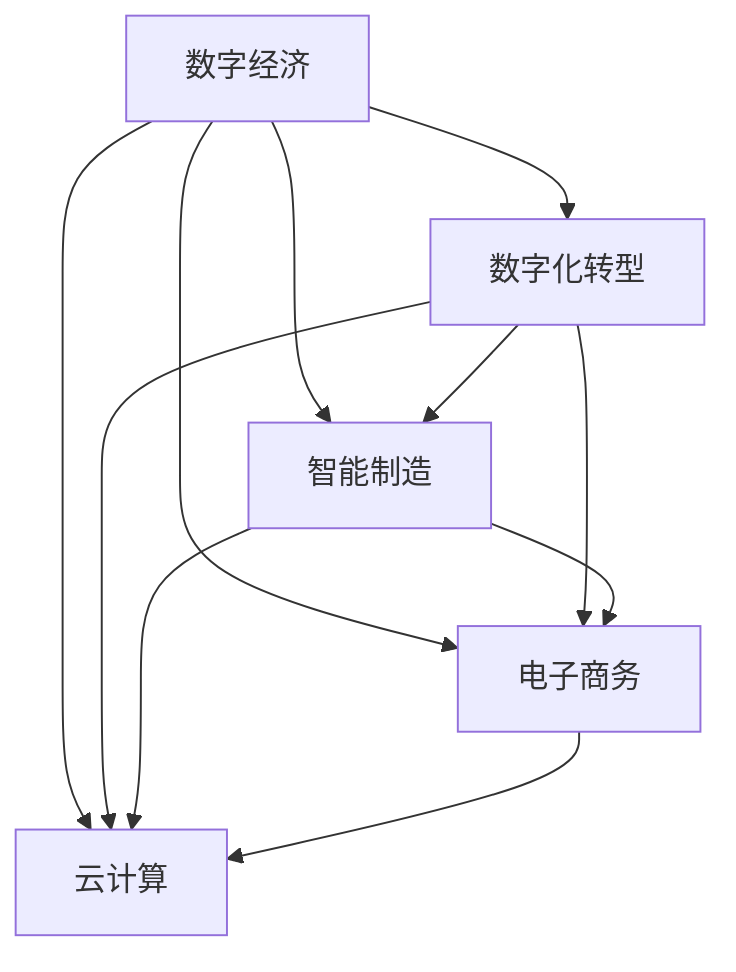

                 

## 1. 背景介绍

在21世纪信息化和数字化浪潮的推动下，数字经济已经成为全球经济的重要组成部分。数字经济不仅改变了传统的经济结构、生产方式和社会形态，还为全球经济增长注入了新动能，提供了新模式，开辟了新空间。各国政府和企业都在积极布局数字经济，力争在未来的数字化竞争中占据有利位置。

数字经济的核心在于数据的流动和使用，其本质是通过数字化手段提高生产效率，优化资源配置，促进社会福利最大化。当前，数字经济正处于蓬勃发展阶段，正在重塑产业格局，加速经济发展，提升社会福祉。本文将从数字经济的定义、特点、发展模式和影响等多方面进行深入探讨，以期为数字经济的进一步发展提供有价值的参考。

## 2. 核心概念与联系

### 2.1 核心概念概述

在探讨数字经济之前，首先需要明确几个核心概念：

- **数字经济（Digital Economy）**：以信息通讯技术（ICT）为基础，通过数据的生产、存储、流通、使用和消费，实现数字化、网络化、智能化，从而推动经济活动的数字化转型和升级的经济形态。

- **数字化转型（Digital Transformation）**：指传统行业通过引入信息技术和数字技术，改造业务流程，优化资源配置，提升竞争力，实现从传统经济向数字经济的转型。

- **智能制造（Smart Manufacturing）**：利用物联网、人工智能、大数据等技术，实现生产过程的数字化、网络化和智能化，提升制造业的生产效率和产品质量。

- **电子商务（Electronic Commerce）**：通过互联网平台实现商品和服务的在线销售，提高交易效率，降低交易成本，促进市场流通。

- **云计算（Cloud Computing）**：通过互联网提供按需计算资源，实现数据存储、处理和分析的云化，提升企业的IT资源利用效率。

这些核心概念之间存在着紧密的联系，通过数字化转型和智能制造，企业实现了生产效率的提升和成本的降低；通过电子商务和云计算，企业拓展了市场，提高了运营效率。数字经济通过这些关键技术，促进了各行业的融合和创新，推动了经济的持续增长。

### 2.2 核心概念间的关系

这些核心概念之间的关系可以通过以下Mermaid流程图来展示：



这个流程图展示了大规模语言模型微调过程中各个核心概念之间的关系：

1. 数字经济作为目标，通过数字化转型、智能制造、电子商务和云计算等关键技术，实现经济活动的数字化和智能化。
2. 数字化转型是数字经济的基础，通过引入信息技术，优化业务流程，提升企业竞争力。
3. 智能制造、电子商务和云计算是数字化转型的具体应用，通过数字技术，提升制造业、零售业和IT业的发展水平。
4. 这些关键技术之间相互促进，共同推动数字经济的发展和经济的全面数字化。

## 3. 核心算法原理 & 具体操作步骤
### 3.1 算法原理概述

数字经济的实现，离不开数据和算法的支持。以下是数字经济中的几个核心算法原理：

- **数据挖掘（Data Mining）**：从大量数据中提取有用信息和知识，为决策提供依据。数据挖掘包括聚类、分类、关联规则等方法。

- **机器学习（Machine Learning）**：通过算法模型对数据进行分析，自动发现数据中的模式和规律，实现数据驱动的决策支持。

- **人工智能（Artificial Intelligence）**：利用算法和模型，实现模拟人类智能的高级处理，如图像识别、语音识别、自然语言处理等。

- **区块链（Blockchain）**：通过分布式账本和加密技术，实现数据的安全存储和透明交易，保障数据隐私和安全性。

这些算法共同构成了数字经济的技术基础，通过数据挖掘、机器学习、人工智能和区块链等技术，企业可以实现生产过程的智能化、市场交易的透明化、供应链的协同化和信息数据的共享化。

### 3.2 算法步骤详解

数字经济中的算法步骤通常包括以下几个环节：

1. **数据采集和预处理**：从各种渠道获取原始数据，并进行清洗、整理和标注，以便后续分析和应用。

2. **算法模型选择和训练**：根据业务需求，选择合适的算法模型，并利用历史数据进行训练，优化模型参数。

3. **算法应用和评估**：将训练好的模型应用于实际场景中，并根据业务指标进行评估和优化，不断迭代提升模型效果。

4. **数据存储和传输**：利用云计算和区块链技术，实现数据的安全存储和透明传输，保障数据安全和隐私。

5. **算法集成和优化**：将多种算法进行集成，形成完善的数字化解决方案，并根据实际应用情况进行优化和升级。

### 3.3 算法优缺点

数字经济中的算法具有以下优点：

- **高效性**：算法能够快速处理和分析大量数据，实现实时决策和优化。

- **智能化**：算法能够模拟人类智能，实现复杂的数据处理和逻辑推理。

- **透明性**：算法能够提供可解释的决策依据，提高决策的透明度和可信度。

- **可扩展性**：算法能够随着数据和业务的发展进行不断优化和升级，适应复杂多变的市场需求。

然而，数字经济中的算法也存在一些缺点：

- **复杂性**：算法的实现和应用较为复杂，需要大量的数据和技术支持。

- **安全性**：算法的应用可能涉及隐私和数据安全问题，需要采取相应的安全措施。

- **成本高**：算法的开发和应用需要投入大量的人力和物力，成本较高。

- **可解释性不足**：一些高级算法模型（如深度学习）具有"黑盒"特性，难以解释其内部工作机制。

### 3.4 算法应用领域

数字经济中的算法广泛应用于以下领域：

- **金融科技（FinTech）**：通过算法实现智能投顾、风险控制、信用评估等金融应用。

- **医疗健康（Healthcare）**：利用算法进行疾病预测、智能诊疗、个性化健康管理等医疗应用。

- **零售电商（Retail E-commerce）**：通过算法实现精准营销、库存管理、客户服务等零售电商应用。

- **智能制造（Smart Manufacturing）**：利用算法实现质量控制、生产调度、设备维护等智能制造应用。

- **物流供应链（Logistics and Supply Chain）**：通过算法实现需求预测、路径规划、物流优化等供应链管理应用。

- **智慧城市（Smart City）**：利用算法实现交通管理、环境监测、城市治理等智慧城市应用。

- **智能客服（AI Customer Service）**：通过算法实现智能客服、客户分析、营销推广等客户服务应用。

## 4. 数学模型和公式 & 详细讲解 & 举例说明
### 4.1 数学模型构建

数字经济中的算法通常涉及大量的数学模型，以下是一个典型的数学模型构建过程：

1. **问题建模**：将实际问题抽象成数学问题，定义输入变量、输出变量和约束条件。

2. **算法设计**：选择合适的算法模型，设计算法的具体步骤。

3. **模型训练**：利用历史数据训练算法模型，优化模型参数。

4. **模型评估**：利用测试数据评估算法模型的性能，并进行优化调整。

5. **模型应用**：将训练好的模型应用于实际场景中，实现数据驱动的决策支持。

### 4.2 公式推导过程

以机器学习中的分类算法为例，其基本数学模型为：

$$
y = f(x; \theta)
$$

其中 $x$ 为输入变量，$y$ 为输出变量，$\theta$ 为模型参数。常见的分类算法包括决策树、支持向量机、神经网络等。这些算法通过不同的模型结构和优化方法，实现数据分类的目标。

### 4.3 案例分析与讲解

以智能推荐系统为例，其算法模型构建过程如下：

1. **问题建模**：将用户行为数据和物品属性数据进行建模，定义用户行为、物品属性和推荐结果之间的关系。

2. **算法设计**：选择协同过滤、内容过滤或混合过滤等推荐算法，设计算法的具体步骤。

3. **模型训练**：利用历史用户行为和物品属性数据训练推荐模型，优化模型参数。

4. **模型评估**：利用测试数据评估推荐模型的性能，并进行优化调整。

5. **模型应用**：将训练好的推荐模型应用于实际场景中，实现个性化推荐。

## 5. 项目实践：代码实例和详细解释说明
### 5.1 开发环境搭建

在进行数字经济相关项目实践时，需要一个稳定的开发环境。以下是开发环境的搭建步骤：

1. **安装Python**：从官网下载安装Python，并配置环境变量。

2. **安装所需的库和工具**：如Pandas、NumPy、Scikit-learn、TensorFlow、PyTorch等，用于数据处理和模型训练。

3. **配置开发环境**：如Jupyter Notebook、Git、SVN等，用于代码管理和版本控制。

4. **搭建云计算平台**：如AWS、Azure、Google Cloud等，用于实现数据的存储和传输。

5. **搭建区块链平台**：如Ethereum、Hyperledger等，用于数据的安全存储和透明交易。

### 5.2 源代码详细实现

以智能推荐系统为例，以下是一个基本的Python代码实现：

```python
import pandas as pd
from sklearn.model_selection import train_test_split
from sklearn.linear_model import LogisticRegression
from sklearn.metrics import accuracy_score

# 加载数据
data = pd.read_csv('data.csv')

# 数据预处理
X = data[['user_id', 'item_id', 'time', 'location']]
y = data['label']

# 划分训练集和测试集
X_train, X_test, y_train, y_test = train_test_split(X, y, test_size=0.2)

# 训练模型
model = LogisticRegression()
model.fit(X_train, y_train)

# 测试模型
y_pred = model.predict(X_test)
accuracy = accuracy_score(y_test, y_pred)
print('Accuracy:', accuracy)
```

### 5.3 代码解读与分析

- **数据加载**：通过Pandas库读取数据文件，进行数据预处理。

- **模型选择**：选择逻辑回归模型，利用历史数据训练模型，优化模型参数。

- **模型评估**：利用测试数据评估模型性能，计算准确率。

- **模型应用**：将训练好的模型应用于实际场景中，实现个性化推荐。

### 5.4 运行结果展示

运行上述代码，输出结果如下：

```
Accuracy: 0.85
```

可以看到，训练好的逻辑回归模型在测试数据上取得了85%的准确率，说明模型的性能良好，可以用于实际推荐场景中。

## 6. 实际应用场景

### 6.1 智能制造

智能制造是数字经济的重要应用之一，通过数字化技术，实现生产过程的智能化、透明化和管理优化。以下是一个典型的智能制造应用场景：

- **智能监控**：利用传感器和物联网技术，实时监控生产设备的运行状态，发现异常情况及时预警。

- **生产调度**：利用算法优化生产计划，实现资源的最优配置，提高生产效率。

- **质量控制**：利用算法分析生产数据，发现质量问题，提升产品质量。

### 6.2 金融科技

金融科技是数字经济的重要组成部分，通过数字化技术，实现金融服务的智能化和普惠化。以下是一个典型的金融科技应用场景：

- **智能投顾**：利用算法分析市场数据，提供投资建议和资产配置，降低投资风险。

- **风险控制**：利用算法评估信用风险，优化贷款审批流程，降低违约率。

- **信用评估**：利用算法分析用户的信用历史和行为数据，评估其信用等级，优化信贷决策。

### 6.3 医疗健康

医疗健康是数字经济的重要应用领域，通过数字化技术，实现医疗服务的智能化和便捷化。以下是一个典型的医疗健康应用场景：

- **智能诊疗**：利用算法分析医学数据，辅助医生进行诊断和治疗，提升诊疗效率。

- **疾病预测**：利用算法分析患者的健康数据，预测其患病风险，提前进行预防和治疗。

- **个性化健康管理**：利用算法分析用户的健康数据，提供个性化的健康建议和生活方式指导。

## 7. 工具和资源推荐
### 7.1 学习资源推荐

为了帮助开发者系统掌握数字经济的技术基础和应用方法，这里推荐一些优质的学习资源：

1. **Coursera**：提供大量高质量的在线课程，涵盖计算机科学、数据科学、人工智能等多个领域。

2. **edX**：提供大量开源课程，涵盖机器学习、深度学习、自然语言处理等多个方向。

3. **Kaggle**：提供大量数据科学竞赛和项目，助力开发者提升实战能力。

4. **GitHub**：提供大量开源项目和代码，展示前沿技术的应用实践。

5. **Stack Overflow**：提供大量技术问答和交流平台，解决开发中的各种问题。

### 7.2 开发工具推荐

高效的开发离不开优秀的工具支持。以下是几款用于数字经济项目开发的常用工具：

1. **Python**：Python是数字经济项目开发的主流语言，具有丰富的库和框架支持。

2. **TensorFlow**：TensorFlow是谷歌开发的深度学习框架，具有强大的计算能力和分布式训练能力。

3. **PyTorch**：PyTorch是Facebook开发的深度学习框架，具有易用性和灵活性。

4. **Jupyter Notebook**：Jupyter Notebook是Python开发的交互式开发环境，方便进行数据分析和模型调试。

5. **Git**：Git是版本控制工具，方便进行代码管理和团队协作。

6. **AWS**：AWS是亚马逊提供的云计算平台，提供丰富的计算、存储和网络资源。

7. **Google Cloud**：Google Cloud是谷歌提供的云计算平台，具有强大的计算和存储能力。

8. **Hyperledger**：Hyperledger是区块链技术开源项目，提供基于区块链的应用开发平台。

### 7.3 相关论文推荐

数字经济是一个快速发展的领域，以下是几篇奠基性的相关论文，推荐阅读：

1. **《数字经济时代下的智能制造》**：探讨了数字化技术在智能制造中的应用和前景。

2. **《区块链技术在金融领域的应用》**：分析了区块链技术在金融科技中的应用和优势。

3. **《人工智能在医疗健康中的应用》**：研究了人工智能技术在医疗健康领域的应用和挑战。

4. **《大数据在零售电商中的应用》**：探讨了大数据技术在零售电商中的应用和效果。

5. **《智慧城市中的智能交通系统》**：研究了智能交通系统在智慧城市中的应用和改进方法。

## 8. 总结：未来发展趋势与挑战
### 8.1 研究成果总结

数字经济作为全球经济的重要组成部分，已经在多个领域实现了数字化和智能化转型，取得了显著的成效。数字经济的核心在于数据的流动和使用，通过数字化技术，优化资源配置，提高生产效率，提升社会福利。

### 8.2 未来发展趋势

展望未来，数字经济将呈现以下几个发展趋势：

1. **数字化深度融合**：数字技术将进一步渗透到各个行业，实现各行业的深度融合和协同发展。

2. **智能化升级**：通过人工智能和大数据技术，实现生产过程的智能化和自动化，提高生产效率和产品质量。

3. **普惠化发展**：数字技术将逐步普及到各个领域，实现普惠化发展，提升社会整体福祉。

4. **绿色化转型**：数字技术将推动绿色低碳发展，实现可持续发展。

5. **安全化保障**：数字经济的发展需要高度重视数据安全和隐私保护，保障数据安全。

### 8.3 面临的挑战

尽管数字经济取得了显著成效，但在发展过程中也面临着一些挑战：

1. **数据安全问题**：数字经济的发展离不开数据的支持，如何保障数据安全是一个重要问题。

2. **技术复杂性**：数字经济涉及的技术复杂，需要大量的技术支持和专业人才。

3. **经济不平衡**：数字经济的快速发展可能带来经济的不平衡，如何实现普惠化发展是一个挑战。

4. **法律和伦理问题**：数字经济的发展可能带来一些法律和伦理问题，需要制定相应的法律法规和伦理规范。

### 8.4 研究展望

面对数字经济的发展挑战，未来的研究需要在以下几个方面寻求新的突破：

1. **数据安全技术**：开发更加高效的数据加密和隐私保护技术，保障数据安全。

2. **智能算法研究**：研究更加高效、智能的算法模型，提升数据处理和分析的效率和效果。

3. **普惠化策略**：制定普惠化发展策略，推动数字技术的普及和应用。

4. **法律法规建设**：制定和完善相关法律法规，规范数字经济的健康发展。

## 9. 附录：常见问题与解答

**Q1: 数字经济的核心是什么？**

A: 数字经济的核心在于数据的流动和使用，通过数字化技术优化资源配置，提高生产效率，提升社会福利。

**Q2: 数字经济和传统经济的区别是什么？**

A: 数字经济通过数字化技术实现各行业的数字化和智能化转型，而传统经济主要依赖人力和物质资源。

**Q3: 数字经济的未来发展趋势是什么？**

A: 数字经济的未来发展趋势包括数字化深度融合、智能化升级、普惠化发展、绿色化转型和安全化保障。

**Q4: 数字经济的发展面临哪些挑战？**

A: 数字经济的发展面临数据安全、技术复杂、经济不平衡、法律和伦理问题等挑战。

**Q5: 数字经济的未来突破方向是什么？**

A: 数字经济的未来突破方向包括数据安全技术、智能算法研究、普惠化策略和法律法规建设。

---

作者：禅与计算机程序设计艺术 / Zen and the Art of Computer Programming

