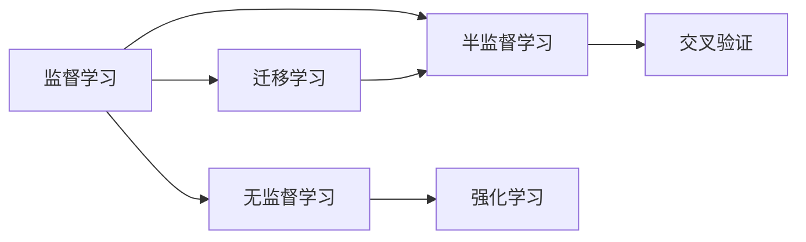

                 

# 数学模型在AI中的应用

## 1. 背景介绍

### 1.1 问题由来

数学模型在人工智能（AI）中的应用可以追溯到早期的人工智能研究中。随着深度学习技术的兴起，数学模型，特别是统计学习模型，在AI中发挥了重要作用。深度神经网络、支持向量机、随机森林等模型已经广泛应用于图像识别、语音识别、自然语言处理等领域。这些模型的构建和优化依赖于大量的数学原理，包括概率统计、线性代数、微积分等。

### 1.2 问题核心关键点

本文旨在深入探讨数学模型在AI中的核心概念、原理和应用，具体包括：

1. **模型构建与优化**：包括如何选择模型、模型参数的优化方法等。
2. **模型训练与预测**：涉及模型的训练过程、损失函数、梯度下降等。
3. **模型评估与调参**：包括如何评估模型性能、如何选择超参数等。
4. **应用领域**：探讨数学模型在图像识别、自然语言处理、推荐系统等领域的实际应用。

## 2. 核心概念与联系

### 2.1 核心概念概述

为了更好地理解数学模型在AI中的应用，我们需要了解以下几个关键概念：

1. **监督学习**：利用标注数据训练模型，使其能够对新的未标注数据进行预测。
2. **无监督学习**：不使用标注数据，从数据的内在结构中学习知识。
3. **半监督学习**：结合少量标注数据和大量未标注数据进行学习。
4. **强化学习**：通过与环境的交互，学习最优策略以最大化奖励。
5. **迁移学习**：利用在某一任务上训练的模型，对另一相似任务进行迁移学习。
6. **交叉验证**：通过将数据集划分为训练集和验证集，评估模型的泛化能力。

### 2.2 概念间的关系

这些核心概念之间存在着密切的联系，构成了AI学习模型的生态系统。以下是一个Mermaid流程图，展示了这些概念之间的逻辑关系：



这个流程图展示了监督学习与无监督学习之间的关系，以及半监督学习、强化学习、迁移学习和交叉验证的相互依赖关系。

## 3. 核心算法原理 & 具体操作步骤

### 3.1 算法原理概述

AI中的数学模型主要通过优化算法进行训练，以最小化损失函数。以监督学习为例，假设我们有一个包含输入和输出的数据集，模型的目标是最小化预测输出与真实输出之间的误差。

设 $M$ 为模型，$x$ 为输入，$y$ 为输出，$\theta$ 为模型参数，$L$ 为损失函数，则模型的优化目标可以表示为：

$$
\min_\theta L(M_\theta(x), y)
$$

其中，$M_\theta(x)$ 表示模型在输入 $x$ 下，通过参数 $\theta$ 计算出的输出。常见的损失函数包括均方误差（MSE）、交叉熵（Cross-Entropy）等。

### 3.2 算法步骤详解

1. **模型选择与初始化**：选择适当的模型结构，并初始化模型参数。
2. **损失函数定义**：根据具体任务，定义损失函数。
3. **优化器选择**：选择合适的优化算法，如随机梯度下降（SGD）、Adam等。
4. **训练迭代**：通过迭代优化算法，更新模型参数，使得损失函数最小化。
5. **模型评估**：在验证集或测试集上评估模型性能，确定是否需要调整超参数。
6. **超参数调优**：根据模型性能，调整学习率、批大小等超参数。
7. **模型应用**：将训练好的模型应用于实际预测任务。

### 3.3 算法优缺点

数学模型在AI中具有以下优点：

- **泛化能力强**：能够从有限的训练数据中学习到数据的潜在结构。
- **理论基础扎实**：基于严格的数学理论，可以进行严格的分析和优化。
- **应用广泛**：适用于多种AI任务，如图像识别、自然语言处理、推荐系统等。

但同时，数学模型也存在一些缺点：

- **计算复杂度高**：需要大量的计算资源进行模型训练。
- **数据依赖性强**：依赖于高质量的数据集，数据偏差可能导致模型性能下降。
- **模型解释性差**：许多模型如深度神经网络，难以解释其内部决策过程。

### 3.4 算法应用领域

数学模型在AI中的应用非常广泛，主要包括以下几个领域：

1. **计算机视觉**：如卷积神经网络（CNN）在图像分类、目标检测等任务中应用广泛。
2. **自然语言处理**：如循环神经网络（RNN）、Transformer在语言模型、机器翻译、情感分析等任务中应用广泛。
3. **推荐系统**：如协同过滤、基于内容的推荐系统等，通过学习用户行为和物品属性，推荐系统可以提供个性化的产品或服务。
4. **语音识别**：如深度神经网络在语音识别、语音合成等任务中表现出色。
5. **时间序列分析**：如ARIMA、LSTM等模型在股票预测、气象预测等时间序列预测任务中应用广泛。

## 4. 数学模型和公式 & 详细讲解

### 4.1 数学模型构建

构建数学模型时，首先需要选择合适的模型结构和优化算法。

**模型结构**：包括线性模型、逻辑回归、决策树、神经网络等。以神经网络为例，其主要结构包括输入层、隐藏层和输出层。

**优化算法**：常用的优化算法包括随机梯度下降（SGD）、Adam、Adagrad等。这些算法通过迭代更新模型参数，使得损失函数最小化。

### 4.2 公式推导过程

以线性回归模型为例，其优化目标是：

$$
\min_\theta \frac{1}{2m} \sum_{i=1}^m (y_i - M_\theta(x_i))^2
$$

其中，$m$ 为样本数量，$y_i$ 为第 $i$ 个样本的真实输出，$M_\theta(x_i)$ 为模型在输入 $x_i$ 下的预测输出。

通过求导，可以得到梯度下降的更新规则：

$$
\theta_{t+1} = \theta_t - \eta \nabla_\theta L(\theta_t)
$$

其中，$\eta$ 为学习率，$\nabla_\theta L(\theta_t)$ 为损失函数对参数 $\theta$ 的梯度。

### 4.3 案例分析与讲解

以图像分类任务为例，我们利用卷积神经网络（CNN）进行模型构建和优化。

**模型构建**：使用CNN模型，包括卷积层、池化层和全连接层。卷积层提取图像的局部特征，池化层降低特征图的大小，全连接层进行分类。

**优化算法**：使用Adam优化算法，设置学习率为 $0.001$，批量大小为 $128$。

**训练过程**：在训练集上进行迭代优化，每 $10$ 个epoch输出一次验证集上的准确率和损失函数。

**结果分析**：在验证集上达到 $85\%$ 的准确率，说明模型能够有效学习图像分类任务。

## 5. 项目实践：代码实例和详细解释说明

### 5.1 开发环境搭建

搭建开发环境前，需要准备以下资源：

1. **Python**：安装Python 3.7及以上版本。
2. **PyTorch**：安装PyTorch 1.7及以上版本。
3. **TensorFlow**：安装TensorFlow 2.0及以上版本。
4. **scikit-learn**：安装scikit-learn 0.24及以上版本。
5. **Jupyter Notebook**：安装Jupyter Notebook 6.4及以上版本。

### 5.2 源代码详细实现

以线性回归为例，以下是使用PyTorch实现的代码：

```python
import torch
import torch.nn as nn
import torch.optim as optim

# 定义线性回归模型
class LinearRegression(nn.Module):
    def __init__(self, input_size):
        super(LinearRegression, self).__init__()
        self.linear = nn.Linear(input_size, 1)

    def forward(self, x):
        return self.linear(x)

# 加载数据集
data = torch.randn(100, 10)
labels = torch.randn(100, 1)

# 初始化模型和优化器
model = LinearRegression(input_size=10)
optimizer = optim.Adam(model.parameters(), lr=0.001)
loss_fn = nn.MSELoss()

# 训练模型
for epoch in range(100):
    optimizer.zero_grad()
    predictions = model(data)
    loss = loss_fn(predictions, labels)
    loss.backward()
    optimizer.step()

    if (epoch + 1) % 10 == 0:
        print('Epoch [{}/{}], Loss: {:.4f}'.format(epoch+1, 100, loss.item()))
```

### 5.3 代码解读与分析

上述代码实现了线性回归模型的训练过程。

- 首先定义了一个线性回归模型，包括一个线性层。
- 加载数据集，包括输入数据和标签。
- 初始化模型、优化器和损失函数。
- 在每个epoch中，计算模型的预测输出和损失函数，进行梯度更新。
- 每 $10$ 个epoch输出一次损失函数。

## 6. 实际应用场景

### 6.1 计算机视觉

数学模型在计算机视觉中的应用非常广泛。例如，卷积神经网络（CNN）在图像分类、目标检测、图像生成等任务中表现出色。

- **图像分类**：如LeNet、AlexNet、VGG等模型在ImageNet等数据集上取得了优异成绩。
- **目标检测**：如Faster R-CNN、YOLO等模型在COCO等数据集上表现优异。
- **图像生成**：如GAN等模型可以生成高质量的图像。

### 6.2 自然语言处理

数学模型在自然语言处理中的应用也非常广泛。例如，循环神经网络（RNN）、Transformer等模型在语言模型、机器翻译、情感分析等任务中表现出色。

- **语言模型**：如LSTM、GRU等模型可以预测下一个词。
- **机器翻译**：如Seq2Seq、Transformer等模型可以实现自动翻译。
- **情感分析**：如RNN等模型可以进行情感分类。

### 6.3 推荐系统

数学模型在推荐系统中的应用也非常广泛。例如，协同过滤、基于内容的推荐系统等模型在电商、视频网站等平台中广泛应用。

- **协同过滤**：通过用户行为和物品属性，推荐相似的物品。
- **基于内容的推荐**：通过物品的属性，推荐相似的物品。
- **深度学习推荐**：使用深度神经网络，推荐个性化产品或服务。

## 7. 工具和资源推荐

### 7.1 学习资源推荐

1. **Coursera《机器学习》**：由斯坦福大学教授Andrew Ng主讲，涵盖机器学习的基本概念和算法。
2. **Udacity《深度学习》**：涵盖深度学习的基本概念和算法，包括卷积神经网络、循环神经网络等。
3. **Kaggle**：数据科学竞赛平台，提供丰富的数据集和竞赛机会。
4. **arXiv**：人工智能领域的预印本平台，可以查阅最新的研究论文。
5. **GitHub**：开源代码平台，可以找到高质量的AI代码和项目。

### 7.2 开发工具推荐

1. **PyTorch**：深度学习框架，支持动态计算图，适合研究和快速迭代。
2. **TensorFlow**：深度学习框架，支持静态计算图，适合大规模工程部署。
3. **scikit-learn**：机器学习库，支持常用的统计学习模型。
4. **Jupyter Notebook**：交互式笔记本，支持Python和R等多种语言。
5. **TensorBoard**：模型可视化工具，可以实时监控模型训练过程。

### 7.3 相关论文推荐

1. **ImageNet Classification with Deep Convolutional Neural Networks**：Alex Krizhevsky等人，介绍卷积神经网络在图像分类中的应用。
2. **Natural Language Processing with Deep Learning**：Yoshua Bengio等人，介绍深度学习在自然语言处理中的应用。
3. **Deep Learning for Recommender Systems**：Jian Tang等人，介绍深度学习在推荐系统中的应用。
4. **Gan Generative Adversarial Nets**：Ian Goodfellow等人，介绍生成对抗网络在图像生成中的应用。
5. **Attention is All You Need**：Ashish Vaswani等人，介绍Transformer在自然语言处理中的应用。

## 8. 总结：未来发展趋势与挑战

### 8.1 总结

本文深入探讨了数学模型在AI中的应用，包括模型构建、优化算法、训练过程、评估方法等。通过具体的代码实例，展示了如何在Python中使用PyTorch进行线性回归模型的训练。同时，本文还探讨了数学模型在计算机视觉、自然语言处理、推荐系统等领域的广泛应用。

### 8.2 未来发展趋势

未来，数学模型在AI中的应用将继续深化，主要体现在以下几个方面：

1. **模型结构优化**：通过神经网络结构搜索等技术，寻找最优的模型结构。
2. **优化算法改进**：通过自适应学习率、动量等技术，提升优化算法的性能。
3. **跨模态融合**：将图像、语音、文本等多种模态数据进行融合，提升模型的综合能力。
4. **强化学习结合**：通过强化学习技术，提升模型在复杂环境中的决策能力。
5. **深度学习与符号学习的结合**：将符号化的先验知识与深度学习模型结合，提升模型的解释性和可解释性。

### 8.3 面临的挑战

尽管数学模型在AI中取得了显著进展，但仍面临以下挑战：

1. **计算资源消耗大**：训练大模型需要大量的计算资源，导致成本高昂。
2. **数据依赖性强**：依赖于高质量的数据集，数据偏差可能导致模型性能下降。
3. **模型解释性差**：许多模型如深度神经网络，难以解释其内部决策过程。
4. **泛化能力弱**：在某些任务上，模型可能无法泛化到新数据。
5. **对抗攻击脆弱**：模型可能被对抗样本攻击，导致输出不稳定。

### 8.4 研究展望

为了应对这些挑战，未来的研究需要在以下几个方面进行深入探索：

1. **模型压缩与优化**：通过模型剪枝、量化等技术，减小模型的计算和存储开销。
2. **对抗样本鲁棒性**：通过生成对抗样本等技术，提升模型的鲁棒性。
3. **模型可解释性**：通过可解释性模型和可视化工具，提升模型的可解释性。
4. **多模态数据融合**：通过多模态数据融合技术，提升模型的综合能力。
5. **跨模态迁移学习**：通过跨模态迁移学习技术，提升模型的泛化能力。

## 9. 附录：常见问题与解答

**Q1：如何选择合适的模型结构？**

A: 根据具体任务和数据特点选择合适的模型结构。一般来说，数据维度较高，选择卷积神经网络；数据维度较低，选择全连接神经网络；任务为分类任务，选择多层感知器（MLP）；任务为序列数据，选择循环神经网络（RNN）或Transformer。

**Q2：如何调整模型参数？**

A: 调整模型参数通常通过超参数调优实现。常用的超参数包括学习率、批大小、正则化参数等。常用的调优方法包括网格搜索、随机搜索、贝叶斯优化等。

**Q3：如何评估模型性能？**

A: 评估模型性能通常通过交叉验证实现。将数据集划分为训练集和验证集，评估模型在验证集上的性能。常用的性能指标包括准确率、召回率、F1分数等。

**Q4：如何处理对抗样本？**

A: 处理对抗样本通常通过生成对抗样本等技术实现。常用的生成方法包括FGSM、PGD等。

**Q5：如何提高模型可解释性？**

A: 提高模型可解释性通常通过可解释性模型和可视化工具实现。常用的可解释性模型包括LIME、SHAP等。常用的可视化工具包括TensorBoard、NeuronScopes等。

---

作者：禅与计算机程序设计艺术 / Zen and the Art of Computer Programming

