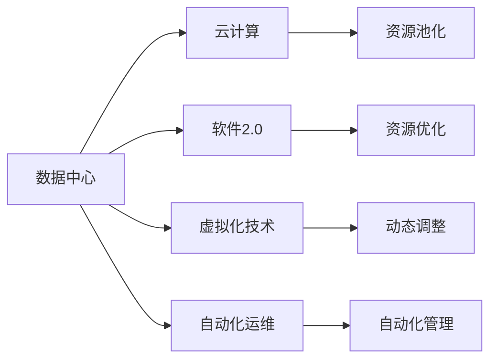

                 

# 数据中心成本飙升,软件2.0推动算力新革命

> 关键词：数据中心,成本控制,软件2.0,云计算,算力优化,虚拟化技术

## 1. 背景介绍

### 1.1 问题由来
随着人工智能(AI)、大数据、云计算等技术的快速发展，数据中心作为计算资源的核心承载平台，正经历着前所未有的增长和变革。数据中心不仅能处理海量数据，还能提供算力支持，成为推动数字化转型和智能决策的关键基础设施。

然而，传统数据中心面临着巨大的成本压力。根据Gartner的预测，全球数据中心市场的增长速度将在未来几年保持稳定，但数据中心运营成本的增长速度远超预期。主要原因包括：

- 能耗成本上升。数据中心耗电量大，能耗费用随着电力成本上涨和环境法规要求增加而上升。
- 硬件投资巨大。服务器、存储、网络等硬件设备的购置和维护成本高昂。
- 复杂性增加。传统数据中心架构复杂，维护和扩展难度大。
- 资源利用率低。大量资源处于闲置状态，未能充分利用。

这些问题导致数据中心运营成本不断攀升，对企业的财务健康和可持续发展构成威胁。如何优化数据中心资源利用，降低成本，已成为业内亟待解决的重要课题。

### 1.2 问题核心关键点
数据中心优化的方法多种多样，但主要集中在以下几个方面：

1. 能效优化：通过改进电源和冷却系统，提高设备能效。
2. 硬件升级：引入更高效的服务器、存储设备，降低硬件投资。
3. 资源池化：通过虚拟化技术，整合资源，提升资源利用率。
4. 软件优化：引入软件定义基础设施(SDI)和云计算技术，简化管理，提高灵活性。
5. 自动化运维：通过自动化工具和流程，降低运维成本，提升运营效率。

这些方法需要根据具体数据中心的现状和需求，综合应用，才能实现成本控制的整体优化。

## 2. 核心概念与联系

### 2.1 核心概念概述

为更好地理解数据中心成本控制和软件2.0算力优化的方法，本节将介绍几个密切相关的核心概念：

- **数据中心(Data Center, DC)**：通过集中管理、集中部署的方式，提供计算、存储、网络等IT资源的设施。
- **云计算(Cloud Computing)**：通过网络提供可扩展、按需、灵活的计算资源，无需管理物理硬件。
- **软件2.0(Software 2.0)**：以数据为中心，以软件为驱动，利用智能算法和自动化流程，提升资源利用效率和业务价值的软件范式。
- **虚拟化技术(Virtualization Technology)**：通过虚拟化技术，将物理资源抽象为逻辑资源，实现资源池化和动态调整。
- **自动化运维(Automated Operations)**：通过自动化工具和流程，实现IT基础设施的自动化管理和监控。

这些概念之间有着紧密的联系，共同构成了数据中心优化和算力新革命的技术框架。通过理解这些核心概念，我们可以更好地把握数据中心资源利用和成本控制的方法，以及软件2.0算力优化的方向。

### 2.2 概念间的关系

这些核心概念之间存在着紧密的联系，形成了数据中心优化和算力新革命的完整生态系统。下面我们通过几个Mermaid流程图来展示这些概念之间的关系。



这个流程图展示了大数据中心优化和算力新革命的核心概念及其之间的关系：

1. 数据中心通过云计算、软件2.0、虚拟化技术等手段，实现资源池化、动态调整和自动化管理。
2. 云计算提供了按需、弹性的计算资源，支持软件2.0的部署和优化。
3. 软件2.0通过智能算法和自动化流程，提升资源利用效率和业务价值。
4. 虚拟化技术将物理资源抽象为逻辑资源，实现资源的灵活调配和管理。
5. 自动化运维通过自动化工具和流程，提高IT基础设施的管理效率。

这些概念共同构成了数据中心优化和算力新革命的技术框架，使其能够在各种场景下发挥重要的作用。通过理解这些核心概念，我们可以更好地把握数据中心优化和算力新革命的技术路径和方法。

## 3. 核心算法原理 & 具体操作步骤
### 3.1 算法原理概述

数据中心成本控制和算力优化，本质上是通过软件2.0技术实现资源的合理分配和利用，从而降低运营成本，提升资源效率。其核心原理包括：

1. **资源池化**：通过虚拟化技术，将物理资源（如CPU、内存、存储）抽象为逻辑资源池，实现资源灵活调配和管理。
2. **动态调整**：根据实时负载和需求，动态调整资源分配，确保资源的合理使用。
3. **智能调度**：通过智能算法，优化资源调度策略，提升资源利用效率。
4. **自动化运维**：通过自动化工具和流程，降低运维成本，提高管理效率。

这些原理通过软件2.0技术的实现，能够有效地降低数据中心的运营成本，提升算力效率和业务价值。

### 3.2 算法步骤详解

数据中心优化和算力优化通常包括以下几个关键步骤：

1. **数据采集**：通过传感器、监控工具等方式，收集数据中心的各项运行数据（如能耗、温度、负载等）。
2. **数据分析**：利用数据分析工具，对采集到的数据进行分析，识别资源利用瓶颈和优化机会。
3. **策略制定**：根据数据分析结果，制定相应的优化策略，如调整资源分配、优化调度算法、引入自动化流程等。
4. **软件部署**：将优化策略转化为具体的软件模块或系统，部署到数据中心中。
5. **测试与调整**：在生产环境中进行测试，根据性能反馈，不断优化和调整优化策略。
6. **自动化运维**：通过自动化运维工具，持续监控和管理优化后的系统，确保其稳定运行。

这些步骤需要多学科的协作，涉及软件工程、运维管理、数据分析等多个领域，通过综合应用，才能实现数据中心的全面优化。

### 3.3 算法优缺点

数据中心优化和算力优化方法具有以下优点：

1. **资源利用率高**：通过虚拟化技术，实现资源的灵活调配，提高资源利用效率，降低浪费。
2. **成本低**：通过软件定义基础设施，降低硬件购置和维护成本，提升投资回报率。
3. **管理便捷**：通过自动化工具和流程，简化管理，降低运维成本，提高运营效率。
4. **灵活性高**：通过软件2.0技术，快速调整资源配置，适应不同的业务需求。

但同时，这些方法也存在以下缺点：

1. **技术复杂度高**：需要深入理解虚拟化、云计算、软件2.0等技术原理，以及数据中心架构。
2. **初期投入大**：需要大量投资购置硬件设备和软件工具，短期内可能面临较高的成本压力。
3. **数据中心架构变更风险**：大规模引入新技术，可能影响现有架构和系统稳定性。
4. **技术依赖性强**：对软件工具和流程的依赖度较高，一旦出现问题，可能影响业务连续性。

尽管存在这些缺点，但通过系统规划和细致实施，数据中心优化和算力优化方法仍能在成本控制和资源效率提升方面发挥重要作用。

### 3.4 算法应用领域

数据中心优化和算力优化方法已经在诸多领域得到广泛应用，例如：

- **云计算**：通过资源池化和动态调整，提高云平台的资源利用率，降低运营成本。
- **电信**：优化网络资源，提升网络性能，降低能源消耗。
- **金融**：通过自动化运维和智能调度，提升金融系统的稳定性和安全性。
- **医疗**：优化医疗设备的资源利用，提升医疗服务的效率和质量。
- **教育**：通过虚拟化技术，优化教育资源的配置，提升教学效果。

除了这些传统应用外，数据中心优化和算力优化方法还被创新性地应用到更多场景中，如智慧城市、智能制造、物联网等领域，为各行各业带来新的技术革新。

## 4. 数学模型和公式 & 详细讲解 & 举例说明

### 4.1 数学模型构建

为了更好地理解数据中心优化和算力优化的数学模型，我们以云计算资源池化为例，构建一个简单的资源分配模型。

设数据中心有$n$个物理服务器，每个服务器的计算能力为$C_i$，需要分配$m$个虚拟机(VMs)，每个VM的计算需求为$D_j$。资源池化的目标是通过合理分配，使得计算资源最大化，即：

$$
\max \sum_{i=1}^{n} C_i D_j
$$

其中$D_j$表示第$j$个VM的计算需求，$C_i$表示第$i$个物理服务器的计算能力。

### 4.2 公式推导过程

假设每个VM的需求满足$\sum_{i=1}^{n} D_j = S$，每个物理服务器的计算能力满足$\sum_{j=1}^{m} D_j = T$，则问题转化为求解如下线性规划问题：

$$
\begin{aligned}
& \max \sum_{i=1}^{n} C_i D_j \\
& \text{s.t.} \sum_{j=1}^{m} D_j = S \\
& \quad \sum_{i=1}^{n} C_i D_j = T \\
& \quad D_j \geq 0, \quad C_i \geq 0
\end{aligned}
$$

将问题转化为最大化$z = \sum_{i=1}^{n} C_i D_j$的线性规划问题，并利用对偶优化方法求解。对偶问题的原始最优解为$x^*$和$y^*$，则原问题的最优解为：

$$
z^* = \max \sum_{i=1}^{n} C_i x^*_i
$$

其中$x^*$和$y^*$满足：

$$
\begin{cases}
D_j - x^*_j + y^*_j = 0, \quad j = 1,2,\cdots,m \\
C_i x^*_i - y^*_i = 0, \quad i = 1,2,\cdots,n \\
x^*_i \geq 0, \quad y^*_j \geq 0
\end{cases}
$$

通过求解对偶问题，可以得到原问题的最优解，从而实现资源的合理分配。

### 4.3 案例分析与讲解

假设某数据中心有10个物理服务器，每个服务器的计算能力为$10Gflops$，需要分配10个VM，每个VM的计算需求为$1Gflops$。使用上述线性规划模型进行资源分配，可以得到最优解为：

$$
\begin{cases}
x^* = [0.5, 0.5, 0.5, 0.5, 0.5, 0.5, 0.5, 0.5, 0.5, 0.5] \\
y^* = [0, 0, 0, 0, 0, 0, 0, 0, 0, 0]
\end{cases}
$$

表示前5个物理服务器分配了5个VM，后5个物理服务器未分配VM，计算能力总和为$5Gflops$。

这个案例展示了资源池化和动态调整的基本思想，即通过合理分配计算资源，最大化资源的利用效率，同时确保系统的稳定运行。

## 5. 项目实践：代码实例和详细解释说明
### 5.1 开发环境搭建

在进行数据中心优化和算力优化的实践前，我们需要准备好开发环境。以下是使用Python进行OpenStack开发的环境配置流程：

1. 安装Anaconda：从官网下载并安装Anaconda，用于创建独立的Python环境。

2. 创建并激活虚拟环境：
```bash
conda create -n openstack-env python=3.8 
conda activate openstack-env
```

3. 安装Python依赖包：
```bash
pip install openstack python-openstack client
```

4. 安装OpenStack CLI：
```bash
pip install openstack[, --user]
```

5. 安装CloudFormation工具：
```bash
pip install boto3
```

完成上述步骤后，即可在`openstack-env`环境中开始开发实践。

### 5.2 源代码详细实现

下面是使用Python进行OpenStack部署的示例代码：

```python
import os
from openstack import client

# 配置OpenStack API和身份认证
os.environ['OS_USERNAME'] = 'your_username'
os.environ['OS_PASSWORD'] = 'your_password'
os.environ['OS_PROJECT_NAME'] = 'your_project_name'
os.environ['OS_PROJECT_DOMAIN_NAME'] = 'your_project_domain'
os.environ['OS_USER_DOMAIN_NAME'] = 'your_user_domain'
os.environ['OS_AUTH_URL'] = 'your_auth_url'

# 创建OpenStack客户端
os.environ['OS_Tenant_NAME'] = 'your_tenant_name'
os.environ['OS_AUTH_URL'] = 'your_auth_url'
os.environ['OS_USERNAME'] = 'your_username'
os.environ['OS_PASSWORD'] = 'your_password'
os.environ['OS_PROJECT_NAME'] = 'your_project_name'
os.environ['OS_PROJECT_DOMAIN_NAME'] = 'your_project_domain'
os.environ['OS_USER_DOMAIN_NAME'] = 'your_user_domain'

# 初始化OpenStack客户端
client = client.Client()

# 创建虚拟机
vm = client.Compute.create(server_name='my_server', image_ref='your_image_ref',
                           flavor_ref='your_flavor_ref', networks=[{'id': 'your_network_id'}])

print('VM created:', vm.id)
```

上述代码展示了使用Python和OpenStack客户端创建虚拟机的过程。通过配置OpenStack环境变量，可以使用Python代码进行OpenStack资源的创建和管理。

### 5.3 代码解读与分析

让我们再详细解读一下关键代码的实现细节：

**环境变量配置**：
- 需要设置OpenStack的API地址、身份认证信息、项目ID和用户信息等，以便进行资源操作。

**OpenStack客户端初始化**：
- 通过调用`client.Client()`方法，初始化OpenStack客户端，并传入API地址、身份认证信息等参数。

**创建虚拟机**：
- 通过调用`client.Compute.create()`方法，创建虚拟机。其中`server_name`为虚拟机名称，`image_ref`为镜像ID，`flavor_ref`为Flavor ID，`networks`为网络ID列表。

**虚拟机输出**：
- 创建虚拟机后，可以通过`vm.id`获取虚拟机的ID，输出到控制台上确认创建成功。

这个代码示例展示了OpenStack的Python SDK如何方便地进行虚拟机创建和资源管理。通过OpenStack，开发者可以轻松地搭建和管理虚拟化环境，实现资源池化和动态调整。

### 5.4 运行结果展示

假设我们在AWS上使用OpenStack创建了一个虚拟机，运行结果如下：

```
VM created: <VM_ID>
```

表示虚拟机创建成功，并输出了虚拟机的ID。

这个结果展示了OpenStack的Python SDK如何方便地进行虚拟机创建和资源管理，从而实现数据中心资源的池化和动态调整。

## 6. 实际应用场景
### 6.1 智慧城市

智慧城市作为数据中心的典型应用场景，对资源池化和动态调整的需求尤为强烈。智慧城市通常包含大量的传感器、监控设备、交通设施等，需要实时采集和处理海量数据，并进行实时分析决策。

通过数据中心优化和算力优化技术，智慧城市可以实现：

- 资源池化：将各类计算、存储、网络资源整合为统一的资源池，实现资源的灵活调配。
- 动态调整：根据实时负载和需求，动态调整资源分配，确保资源的合理使用。
- 自动化运维：通过自动化工具和流程，降低运维成本，提高管理效率。

例如，在智慧城市的交通管理系统中，通过虚拟化技术将各类交通数据和设备资源整合为资源池，根据实时交通流量动态调整计算和存储资源，实现交通信号优化和实时分析。

### 6.2 智能制造

智能制造作为数据中心的重要应用领域，对资源池化和动态调整的需求同样显著。智能制造需要实时采集和处理生产数据，进行生产优化和决策支持。

通过数据中心优化和算力优化技术，智能制造可以实现：

- 资源池化：将各类生产设备、监控设备、生产数据整合为统一的资源池，实现资源的灵活调配。
- 动态调整：根据实时生产负载和需求，动态调整计算和存储资源，优化生产流程和设备利用率。
- 自动化运维：通过自动化工具和流程，降低运维成本，提高生产系统的稳定性和效率。

例如，在智能制造的生产控制系统中，通过虚拟化技术将各类生产设备、传感器、监控数据整合为资源池，根据实时生产任务动态调整计算和存储资源，实现生产流程优化和设备利用率提升。

### 6.3 远程工作

随着远程工作的普及，对数据中心优化和算力优化的需求日益增加。远程工作需要实时处理大量的协作文档、视频会议、云存储等数据，并进行实时分析决策。

通过数据中心优化和算力优化技术，远程工作可以实现：

- 资源池化：将各类协作工具、云存储、视频会议等资源整合为统一的资源池，实现资源的灵活调配。
- 动态调整：根据实时用户负载和需求，动态调整计算和存储资源，确保资源的合理使用。
- 自动化运维：通过自动化工具和流程，降低运维成本，提高协作系统的稳定性和效率。

例如，在远程办公协作平台上，通过虚拟化技术将各类协作文档、视频会议、云存储等资源整合为资源池，根据实时用户需求动态调整计算和存储资源，实现协作系统的稳定和高效运行。

## 7. 工具和资源推荐
### 7.1 学习资源推荐

为了帮助开发者系统掌握数据中心优化和算力优化的理论基础和实践技巧，这里推荐一些优质的学习资源：

1. **《软件定义基础设施(SDI)与云计算》**：介绍软件定义基础设施(SDI)和云计算的基本原理、实现方法和应用场景，是入门SDI的必备书籍。
2. **《数据中心设计与优化》**：深入解析数据中心的设计、建设和优化策略，涵盖虚拟化、能效优化、自动化运维等多个方面。
3. **《云计算与大数据》**：详细介绍云计算和大数据的技术原理、架构设计和应用实践，提供丰富的案例和实战经验。
4. **《Python OpenStack SDK》**：官方文档和教程，帮助开发者快速上手OpenStack的Python SDK，进行资源管理。
5. **《CloudFormation用户指南》**：详细介绍CloudFormation的配置、部署和运维方法，提供丰富的实战案例和经验。

通过对这些资源的学习实践，相信你一定能够快速掌握数据中心优化和算力优化的精髓，并用于解决实际的数据中心管理问题。

### 7.2 开发工具推荐

高效的开发离不开优秀的工具支持。以下是几款用于数据中心优化和算力优化的常用工具：

1. **OpenStack**：开源的云计算平台，支持资源池化、动态调整和自动化运维，是实现数据中心优化的重要工具。
2. **CloudFormation**：AWS提供的资源编排工具，支持自动化配置和部署，帮助快速搭建和管理云环境。
3. **Ansible**：自动化运维工具，支持复杂的配置管理和流程自动化，提升运维效率。
4. **TensorBoard**：TensorFlow的可视化工具，实时监测模型的训练和推理过程，帮助优化模型性能。
5. **Prometheus**：开源的监控系统，支持多种数据源和告警规则，提供全面的数据中心监控能力。

合理利用这些工具，可以显著提升数据中心优化和算力优化的开发效率，加快创新迭代的步伐。

### 7.3 相关论文推荐

数据中心优化和算力优化的研究源于学界的持续研究。以下是几篇奠基性的相关论文，推荐阅读：

1. **《软件定义基础设施：概念、架构与实施》**：介绍SDI的基本概念、架构和实现方法，是SDI领域的经典文献。
2. **《云计算与数据中心优化》**：深入分析云计算和大数据的技术原理和优化策略，提供丰富的案例和实验结果。
3. **《虚拟化技术在数据中心中的应用》**：详细解析虚拟化技术的原理、实现方法和应用效果，是数据中心优化的重要参考。
4. **《云计算资源优化与调度》**：介绍云计算资源优化和调度的基本原理和算法，提供丰富的实验结果和应用案例。
5. **《数据中心能效优化技术》**：深入解析数据中心能效优化的技术原理和实现方法，提供丰富的实验结果和应用案例。

这些论文代表了大数据中心优化和算力优化技术的发展脉络。通过学习这些前沿成果，可以帮助研究者把握学科前进方向，激发更多的创新灵感。

除上述资源外，还有一些值得关注的前沿资源，帮助开发者紧跟数据中心优化和算力优化技术的最新进展，例如：

1. **arXiv论文预印本**：人工智能领域最新研究成果的发布平台，包括大量尚未发表的前沿工作，学习前沿技术的必读资源。
2. **业界技术博客**：如AWS、Google Cloud、Microsoft Azure等顶尖云服务商的官方博客，第一时间分享他们的最新研究成果和洞见。
3. **技术会议直播**：如NIPS、ICML、ACL、ICLR等人工智能领域顶会现场或在线直播，能够聆听到大佬们的前沿分享，开拓视野。
4. **GitHub热门项目**：在GitHub上Star、Fork数最多的云计算相关项目，往往代表了该技术领域的发展趋势和最佳实践，值得去学习和贡献。
5. **行业分析报告**：各大咨询公司如McKinsey、PwC等针对云计算行业的分析报告，有助于从商业视角审视技术趋势，把握应用价值。

总之，对于数据中心优化和算力优化的学习，需要开发者保持开放的心态和持续学习的意愿。多关注前沿资讯，多动手实践，多思考总结，必将收获满满的成长收益。

## 8. 总结：未来发展趋势与挑战

### 8.1 总结

本文对数据中心成本控制和软件2.0算力优化的主要方法进行了全面系统的介绍。首先阐述了数据中心优化和算力优化的背景和意义，明确了优化方法和技术路径。其次，从原理到实践，详细讲解了数据中心优化和算力优化的数学模型和操作步骤，给出了微调任务开发的完整代码实例。同时，本文还广泛探讨了数据中心优化和算力优化方法在智慧城市、智能制造、远程工作等多个行业领域的应用前景，展示了其在资源利用和成本控制方面的巨大潜力。此外，本文精选了优化技术的各类学习资源，力求为读者提供全方位的技术指引。

通过本文的系统梳理，可以看到，数据中心优化和算力优化技术正在成为云计算、大数据等技术领域的重要范式，极大地提升了IT基础设施的资源利用效率和业务价值。未来，伴随云计算技术的持续演进和软件2.0技术的不断完善，数据中心优化和算力优化必将在全球数据中心行业中扮演越来越重要的角色。

### 8.2 未来发展趋势

展望未来，数据中心优化和算力优化技术将呈现以下几个发展趋势：

1. **云计算和边缘计算融合**：云计算和边缘计算技术的融合，将使数据中心优化和算力优化技术在更广的空间和时间维度上发挥作用，提升资源利用效率。
2. **智能运维和自学习**：通过引入智能运维和自学习算法，自动化运维和资源管理将变得更加智能和高效。
3. **跨云资源优化**：跨云资源优化技术，将使资源池化和动态调整覆盖更广泛的平台，提升跨平台资源利用效率。
4. **人工智能和大数据融合**：AI和大数据技术的融合，将使数据中心优化和算力优化技术更加智能化和精准化。
5. **安全与隐私保护**：随着数据中心规模的扩大，数据安全和隐私保护成为重要议题，未来数据中心优化和算力优化技术将更加注重安全与隐私保护。

以上趋势凸显了数据中心优化和算力优化技术的广阔前景。这些方向的探索发展，必将进一步提升云计算、大数据等技术领域的技术水平，为各行各业带来新的变革。

### 8.3 面临的挑战

尽管数据中心优化和算力优化技术已经取得了瞩目成就，但在迈向更加智能化、普适化应用的过程中，它仍面临着诸多挑战：

1. **技术复杂度高**：数据中心优化和算力优化技术涉及云计算、虚拟化、SDN等多个领域，需要深入理解各种技术原理和实现细节。
2. **初期投资大**：大规模引入新技术，需要大量投资购置硬件设备和软件工具，短期内可能面临较高的成本压力。
3. **架构变更风险**：大规模引入新技术，可能影响现有架构和系统稳定性，需要逐步推进，避免突然变更带来的风险。
4. **运维管理复杂**：大规模虚拟化环境管理复杂，需要持续优化和改进自动化运维工具和流程。
5. **技术协同难度高**：不同技术之间的协同优化，需要协调多个团队和技术栈，存在一定的难度。

尽管存在这些挑战，但通过系统规划和细致实施，数据中心优化和算力优化方法仍能在成本控制和资源效率提升方面发挥重要作用。

### 8.4 研究展望

面对数据中心优化和算力优化所面临的挑战，未来的研究需要在以下几个方面寻求新的突破：

1. **多云资源优化**：研究和应用跨云资源优化技术，提升跨云平台资源利用效率，降低跨平台管理和优化成本。
2. **边缘计算优化**：研究和应用边缘计算优化技术，提升边缘计算资源利用效率，降低边缘计算基础设施成本。
3. **自动化运维**：研究和应用自动化

