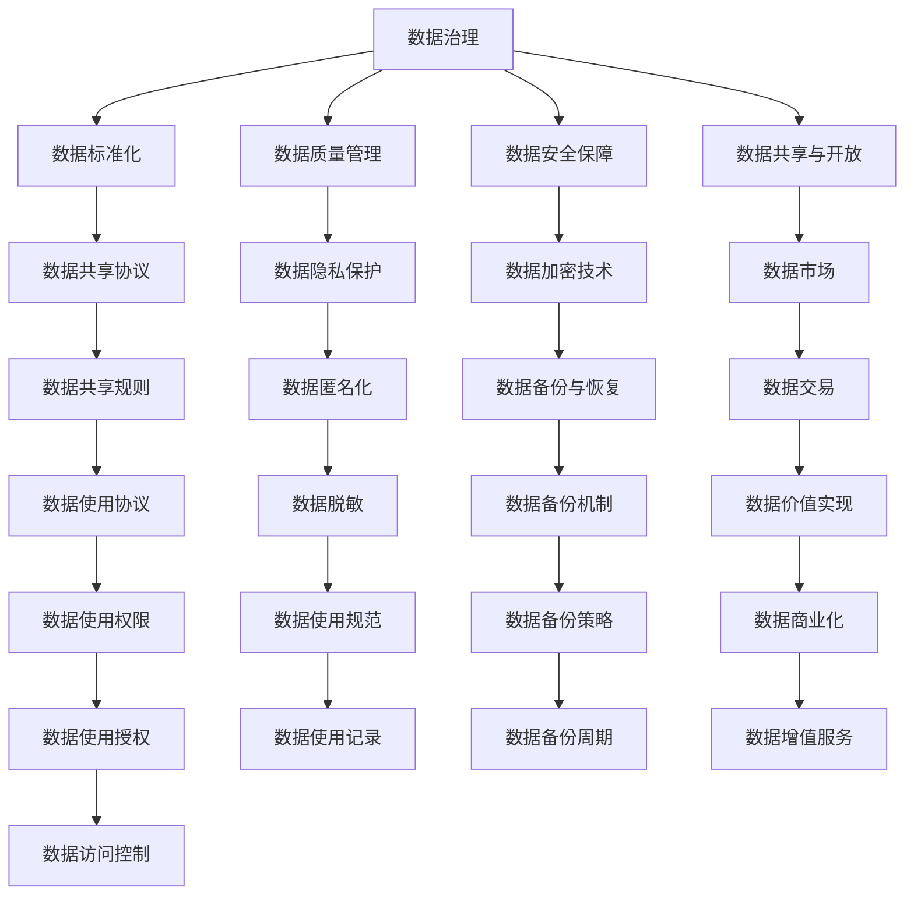

                 

# 数据主权博弈,软件2.0推动数据治理体系重构

在数字经济时代，数据成为了最珍贵的生产要素，但数据的主权问题却成为全球范围内激烈的博弈焦点。数据的获取、使用、存储和共享，在传统的数据治理体系中存在诸多不足。本文将从数据主权博弈的现状出发，探讨软件2.0技术如何驱动数据治理体系的重构，以期通过技术创新，打破数据治理的困局，构建公平、透明、高效的数据生态系统。

## 1. 背景介绍

### 1.1 问题由来

在过去二十年里，随着互联网的普及和数据技术的不断进步，数据逐渐成为驱动经济增长的核心要素。大数据、人工智能、区块链等技术的兴起，更是让数据治理问题愈发重要。但数据治理问题并未随着技术的发展得到充分解决，反而在数据的获取、使用、存储和共享等方面存在诸多不足，引起了数据主权博弈的激烈争斗。

数据主权涉及数据的归属、控制和利用，是数据治理的根本问题。从政府、企业到个人，各方主体都试图在数据主权博弈中占据有利地位。如何平衡数据主权与数据共享，是当前数据治理体系面临的重大挑战。

### 1.2 问题核心关键点

数据主权博弈的核心关键点包括以下几点：

- **数据归属**：数据的来源、所有权归属问题。
- **数据使用**：数据如何被采集、处理、分析。
- **数据存储**：数据如何被存储、备份和恢复。
- **数据共享**：数据的共享模式和协议，如何保护隐私和权益。
- **数据安全**：如何确保数据在传输和存储过程中的安全。
- **数据权益**：数据的权益分配，包括所有权、使用权、收益权等。

这些关键点交织在一起，构成了一个复杂的数据主权博弈系统。各主体在博弈中争夺数据的主导权和控制权，试图在数据治理的规则中占据有利位置。

## 2. 核心概念与联系

### 2.1 核心概念概述

在探讨数据主权博弈的过程中，需要理解几个关键的概念：

- **数据治理**：通过制定规则、标准和政策，确保数据的合法、合规和安全使用。
- **数据治理体系**：包括数据标准化、数据质量管理、数据安全保障、数据共享与开放等组成部分，是数据治理的基础架构。
- **数据主权**：指数据的归属权、使用权和控制权，是数据治理的核心议题。
- **数据共享**：指在合法合规的前提下，数据的使用和流通。
- **数据隐私保护**：在数据共享和使用过程中，如何保护个人隐私。
- **数据权益**：数据的归属、使用、收益等方面的权益分配。

这些概念之间存在紧密的联系，共同构成了数据治理的复杂体系。本文将从数据主权博弈的现状出发，探讨软件2.0技术如何驱动数据治理体系的重构。

### 2.2 概念间的关系

通过以下Mermaid流程图来展示这些核心概念之间的关系：



这个流程图展示了数据治理的各个组成部分及其相互关系。从数据标准化到数据共享与开放，再到数据共享协议、数据隐私保护等，构成了一个完整的治理体系。

## 3. 核心算法原理 & 具体操作步骤
### 3.1 算法原理概述

数据主权博弈的核心算法原理主要基于博弈论和经济学理论。博弈论中的零和博弈、纳什均衡、占优策略等概念，以及经济学中的边际效益、边际成本等理论，为数据主权博弈提供了理论基础。

在数据主权博弈中，各主体通过制定策略，试图最大化自身利益。例如，企业希望通过数据获取和分析提升竞争优势，个人希望保护自己的隐私，政府则需要在保护隐私和促进经济发展之间寻找平衡。通过博弈论中的策略和协议，各方主体可以在数据治理中达成某种程度的均衡。

### 3.2 算法步骤详解

数据主权博弈的算法步骤主要包括以下几个方面：

1. **定义博弈模型**：明确参与者、策略集、支付函数等基本要素，建立博弈模型。
2. **求解纳什均衡**：通过求解纳什均衡，找到各主体在博弈中的最优策略。
3. **优化博弈规则**：通过调整博弈规则，促进各方主体达成共赢。
4. **执行协议和规则**：各主体根据协议和规则，执行数据共享和使用策略。
5. **评估和反馈**：定期评估数据治理的效果，根据反馈调整策略和规则。

### 3.3 算法优缺点

数据主权博弈算法具有以下优点：

- **理论基础**：博弈论和经济学理论提供了坚实的理论基础，帮助各方主体在博弈中寻找最优策略。
- **模型灵活**：模型可以根据具体问题和需求进行调整，适应不同的数据治理场景。

但该算法也存在以下缺点：

- **复杂性高**：博弈模型设计复杂，需要考虑多种因素和变量，难以在实际应用中广泛应用。
- **计算量大**：求解纳什均衡等优化问题需要大量的计算资源和时间。
- **依赖数据**：博弈模型对数据的依赖性较强，需要高质量的数据支持。

### 3.4 算法应用领域

数据主权博弈算法在多个领域得到了广泛应用，包括：

- **金融科技**：金融数据治理，如何在保护隐私的同时，确保数据共享和利用。
- **医疗健康**：医疗数据的共享和开放，如何在保护患者隐私的前提下，促进医疗研究。
- **政府数据治理**：政府数据的共享和使用，如何在保护公共利益和促进经济发展之间找到平衡。
- **智能制造**：工业数据的治理，如何在保护企业商业机密的前提下，促进工业数字化转型。
- **互联网数据治理**：互联网平台数据的治理，如何在保护用户隐私的前提下，提高数据利用效率。

## 4. 数学模型和公式 & 详细讲解
### 4.1 数学模型构建

数据主权博弈的数学模型构建主要基于博弈论和经济学理论。以下是一个简单的博弈模型构建示例：

- **参与者**：企业A、企业B、个人C
- **策略集**：企业A可以选择“数据共享”或“数据保护”，企业B可以选择“数据利用”或“数据安全”，个人C可以选择“同意共享”或“拒绝共享”。
- **支付函数**：各策略组合下的支付结果，例如：
  - 企业A选择“数据共享”，企业B选择“数据利用”，个人C选择“同意共享”，支付结果为（1,2,1），表示企业A获得1单位收益，企业B获得2单位收益，个人C获得1单位收益。
  - 企业A选择“数据共享”，企业B选择“数据利用”，个人C选择“拒绝共享”，支付结果为（-1,2,-1），表示企业A获得-1单位收益，企业B获得2单位收益，个人C获得-1单位收益。

通过构建博弈模型，可以分析各参与者在不同策略下的支付结果，找出纳什均衡点，从而优化博弈规则，促进各方的共赢。

### 4.2 公式推导过程

设参与者A的策略集为 $S_A=\{s_{A1}, s_{A2}, \ldots, s_{Am}\}$，参与者B的策略集为 $S_B=\{s_{B1}, s_{B2}, \ldots, s_{Bn}\}$，参与者C的策略集为 $S_C=\{s_{C1}, s_{C2}, \ldots, s_{Cp}\}$。

设参与者A在策略 $s_{Ai}$ 下的收益为 $U_A(s_{Ai}, s_{Bi}, s_{Ci})$，参与者B在策略 $s_{Bi}$ 下的收益为 $U_B(s_{Ai}, s_{Bi}, s_{Ci})$，参与者C在策略 $s_{Ci}$ 下的收益为 $U_C(s_{Ai}, s_{Bi}, s_{Ci})$。

通过求解纳什均衡，找到满足以下条件的策略组合 $(s^*, s^*, s^*)$：
$$
\begin{aligned}
U_A(s^*_A, s^*_B, s^*_C) &\geq U_A(s_{Ai}, s^*_B, s^*_C) \quad \forall i \in [1, m] \\
U_B(s^*_A, s^*_B, s^*_C) &\geq U_B(s^*_A, s_{Bi}, s^*_C) \quad \forall i \in [1, n] \\
U_C(s^*_A, s^*_B, s^*_C) &\geq U_C(s^*_A, s^*_B, s_{Ci}) \quad \forall i \in [1, p]
\end{aligned}
$$

通过求解上述纳什均衡，可以确定各参与者在博弈中的最优策略，从而优化数据治理规则。

### 4.3 案例分析与讲解

假设一个平台上的数据治理问题，平台上的企业、个人和用户都试图最大化自身利益。平台企业希望通过数据获取和分析提升平台价值，个人希望保护自己的隐私，用户希望获得高质量的服务。

构建如下博弈模型：

- 企业A可以选择“数据共享”或“数据保护”。
- 个人C可以选择“同意共享”或“拒绝共享”。
- 平台用户可以选择“使用服务”或“不使用服务”。

支付函数如下：

- 企业A选择“数据共享”，个人C选择“同意共享”，平台用户选择“使用服务”，支付结果为（1,2,3）。
- 企业A选择“数据共享”，个人C选择“拒绝共享”，平台用户选择“不使用服务”，支付结果为（-1,-2,-3）。

通过求解纳什均衡，找到各参与者在博弈中的最优策略。最终确定数据共享规则，例如个人需同意后才能共享数据，用户需提供必要的数据隐私协议后才能使用服务。

## 5. 项目实践：代码实例和详细解释说明
### 5.1 开发环境搭建

在进行数据主权博弈的实践前，需要准备好开发环境。以下是使用Python进行项目开发的环境配置流程：

1. 安装Anaconda：从官网下载并安装Anaconda，用于创建独立的Python环境。

2. 创建并激活虚拟环境：
```bash
conda create -n data-governance python=3.8 
conda activate data-governance
```

3. 安装必要的库：
```bash
conda install numpy pandas matplotlib scikit-learn
```

4. 安装博弈论库：
```bash
pip install sympy
```

完成上述步骤后，即可在`data-governance`环境中进行数据主权博弈的实践。

### 5.2 源代码详细实现

以下是一个简单的数据主权博弈博弈树模型实现：

```python
import sympy as sp

# 定义参与者A的策略集
S_A = sp FiniteSet('s1', 's2')

# 定义参与者B的策略集
S_B = sp FiniteSet('s1', 's2')

# 定义参与者C的策略集
S_C = sp FiniteSet('s1', 's2')

# 定义支付函数
U_A = sp Function('U_A')
U_B = sp Function('U_B')
U_C = sp Function('U_C')

# 构建博弈树
tree = sp GameTree(S_A, S_B, S_C)

# 求解纳什均衡
nash_equilibrium = tree.NashEquilibrium()

print(nash_equilibrium)
```

这个代码实现了简单的博弈树模型，求解纳什均衡。在实际应用中，需要根据具体问题和需求，设计更复杂的博弈模型。

### 5.3 代码解读与分析

代码中主要使用了Sympy库来构建博弈树和求解纳什均衡。通过Sympy，可以方便地定义策略集、支付函数和求解均衡。

博弈树的构建涉及各参与者的策略集和支付函数，需要根据具体问题进行定义。求解纳什均衡的过程，可以通过Sympy的求解函数完成。求解结果将返回一个包含最优策略的列表，各参与者可以根据最优策略调整博弈规则。

### 5.4 运行结果展示

假设博弈树求解结果为 `(s1, s1, s1)`，表示企业A选择“数据共享”，个人C选择“同意共享”，平台用户选择“使用服务”，各参与者都达到了最优策略。根据博弈结果，可以制定相应数据共享规则，例如个人需同意后才能共享数据，用户需提供必要的数据隐私协议后才能使用服务。

## 6. 实际应用场景
### 6.1 智能制造数据治理

在智能制造中，数据治理问题尤为突出。各企业之间的数据共享和利用，需要在保护商业机密的前提下进行。通过数据主权博弈模型，可以优化各企业的博弈规则，促进数据共享。

具体而言，可以通过以下步骤进行数据治理：

1. 构建数据共享协议：定义各企业的数据使用规则、数据保护措施、数据共享机制等。
2. 优化博弈规则：通过博弈模型分析，找到各企业在数据共享中的最优策略。
3. 执行协议和规则：各企业根据协议和规则进行数据共享和利用。
4. 评估和反馈：定期评估数据共享效果，根据反馈调整博弈规则。

### 6.2 金融科技数据治理

在金融科技领域，数据治理问题同样复杂。银行、保险公司等机构在数据共享和利用过程中，需要在保护客户隐私的前提下，确保数据安全。

通过数据主权博弈模型，可以优化各机构的数据治理规则：

1. 构建数据共享协议：定义各机构的数据使用规则、数据保护措施、数据共享机制等。
2. 优化博弈规则：通过博弈模型分析，找到各机构在数据共享中的最优策略。
3. 执行协议和规则：各机构根据协议和规则进行数据共享和利用。
4. 评估和反馈：定期评估数据共享效果，根据反馈调整博弈规则。

### 6.3 医疗健康数据治理

在医疗健康领域，数据治理问题同样重要。医院、保险公司、科研机构等机构在数据共享和利用过程中，需要在保护患者隐私的前提下，促进医疗研究。

通过数据主权博弈模型，可以优化各机构的数据治理规则：

1. 构建数据共享协议：定义各机构的数据使用规则、数据保护措施、数据共享机制等。
2. 优化博弈规则：通过博弈模型分析，找到各机构在数据共享中的最优策略。
3. 执行协议和规则：各机构根据协议和规则进行数据共享和利用。
4. 评估和反馈：定期评估数据共享效果，根据反馈调整博弈规则。

## 7. 工具和资源推荐
### 7.1 学习资源推荐

为了帮助开发者系统掌握数据主权博弈的理论基础和实践技巧，这里推荐一些优质的学习资源：

1. 《博弈论基础》书籍：由著名博弈论专家编写，全面介绍了博弈论的基本概念和经典模型，是入门博弈论理论的必读书籍。
2. 《数据主权博弈分析》课程：由数据治理专家讲授，涵盖数据主权博弈的理论基础和实际应用案例，是理解数据主权博弈的入门课程。
3. 《数据治理体系建设》书籍：系统介绍了数据治理体系的构建方法和实施步骤，是构建数据治理体系的重要参考。
4. 《数据隐私保护》课程：由数据隐私保护专家讲授，涵盖数据隐私保护的基本概念和实施方法，是保护数据隐私的重要学习资源。
5. 《人工智能伦理》课程：由人工智能伦理专家讲授，涵盖人工智能伦理的基本概念和实施方法，是数据治理伦理的重要学习资源。

通过这些资源的学习实践，相信你一定能够快速掌握数据主权博弈的精髓，并用于解决实际的数据治理问题。

### 7.2 开发工具推荐

高效的开发离不开优秀的工具支持。以下是几款用于数据主权博弈开发的常用工具：

1. Sympy：Python的符号计算库，支持构建复杂的博弈模型和求解均衡。
2. Gurobi：商业优化软件，支持线性、非线性规划和混合整数规划等优化问题。
3. Jupyter Notebook：交互式编程环境，方便开发者进行代码调试和实验。
4. TensorFlow：深度学习框架，支持分布式计算和模型训练，可用于复杂的博弈优化问题。
5. Scikit-learn：机器学习库，支持数据预处理、特征工程等数据治理技术。

合理利用这些工具，可以显著提升数据主权博弈的开发效率，加快创新迭代的步伐。

### 7.3 相关论文推荐

数据主权博弈和数据治理技术的发展源于学界的持续研究。以下是几篇奠基性的相关论文，推荐阅读：

1. 《博弈论基础》书籍：介绍了博弈论的基本概念和经典模型，是数据主权博弈理论的基础。
2. 《数据治理体系建设》论文：系统介绍了数据治理体系的构建方法和实施步骤，提供了数据治理的实践参考。
3. 《数据主权博弈分析》论文：探讨了数据主权博弈的理论基础和实际应用，是理解数据主权博弈的重要文献。
4. 《人工智能伦理》论文：探讨了人工智能伦理的基本概念和实施方法，是数据治理伦理的重要研究。

这些论文代表了大数据治理技术的发展脉络。通过学习这些前沿成果，可以帮助研究者把握学科前进方向，激发更多的创新灵感。

## 8. 总结：未来发展趋势与挑战
### 8.1 总结

本文对数据主权博弈的现状和软件2.0技术在数据治理中的应用进行了全面系统的介绍。首先阐述了数据主权博弈的现状和重要性，明确了数据主权博弈在数据治理中的核心地位。其次，从理论到实践，详细讲解了数据主权博弈的算法原理和具体操作步骤，给出了数据主权博弈任务开发的完整代码实例。同时，本文还广泛探讨了数据主权博弈方法在智能制造、金融科技、医疗健康等多个行业领域的应用前景，展示了数据主权博弈的广阔应用空间。最后，本文精选了数据主权博弈的各类学习资源，力求为读者提供全方位的技术指引。

通过本文的系统梳理，可以看到，数据主权博弈在数据治理中的重要性和复杂性。软件2.0技术通过博弈模型和算法优化，可以有效地解决数据治理中的博弈问题，提升数据治理的效率和公平性。未来，伴随软件2.0技术的不断进步，数据治理体系必将进一步优化，为数据生态系统的健康发展提供有力支持。

### 8.2 未来发展趋势

展望未来，数据主权博弈技术将呈现以下几个发展趋势：

1. 数据治理规则的自动化：随着软件2.0技术的发展，数据治理规则的制定和执行将变得更加自动化和智能化。
2. 数据治理的动态化：数据治理规则将根据数据分布的变化而动态调整，以适应不断变化的数据生态系统。
3. 数据治理的多元化：数据治理将不再局限于单一方面，而是从数据获取、处理、共享等多个维度进行优化。
4. 数据治理的透明化：数据治理的决策过程将更加透明，数据主体的权益保护将得到更好的保障。
5. 数据治理的伦理化：数据治理将更加注重伦理道德问题，确保数据治理在公平、正义的前提下进行。

这些趋势凸显了数据主权博弈技术的广阔前景。通过软件2.0技术的持续演进，数据治理将更加智能、高效、透明和公正。

### 8.3 面临的挑战

尽管软件2.0技术在数据治理中的应用前景广阔，但在迈向更加智能化、普适化应用的过程中，仍面临诸多挑战：

1. 数据隐私保护：如何在数据共享和使用过程中，保护个人隐私，避免数据泄露和滥用。
2. 数据安全保障：如何确保数据在传输和存储过程中的安全性，防止数据篡改和攻击。
3. 数据治理的公平性：如何在数据主权博弈中，平衡各数据主体的利益，避免数据治理中的不公平现象。
4. 数据治理的复杂性：如何应对数据治理中的复杂问题，确保数据治理的效率和效果。
5. 数据治理的跨领域应用：如何将数据治理的规则和算法应用于不同领域，确保数据治理的普适性。

这些挑战凸显了数据主权博弈技术的复杂性和多样性。未来的研究需要在这些方面进行深入探索，不断突破技术瓶颈。

### 8.4 研究展望

面对数据主权博弈面临的诸多挑战，未来的研究需要在以下几个方面寻求新的突破：

1. 探索数据隐私保护的新技术：研发更加先进的数据隐私保护技术，如差分隐私、同态加密等，确保数据共享和使用中的隐私保护。
2. 优化数据治理的算法和规则：通过更加先进的算法和规则设计，提升数据治理的公平性和效率。
3. 推动数据治理的跨领域应用：将数据治理的规则和算法应用于不同领域，确保数据治理的普适性。
4. 强化数据治理的伦理约束：建立数据治理的伦理约束机制，确保数据治理的公正性和公平性。

这些研究方向的探索，将引领数据主权博弈技术迈向更高的台阶，为数据生态系统的健康发展提供有力支持。面向未来，数据主权博弈技术需要与其他技术进行更深入的融合，如知识图谱、人工智能等，多路径协同发力，共同推动数据治理体系的进步。只有勇于创新、敢于突破，才能不断拓展数据主权博弈技术的边界，构建公平、透明、高效的数据治理生态系统。

