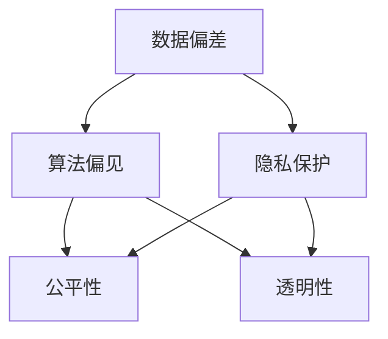
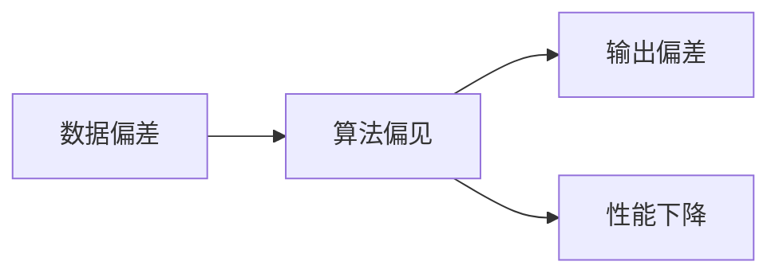
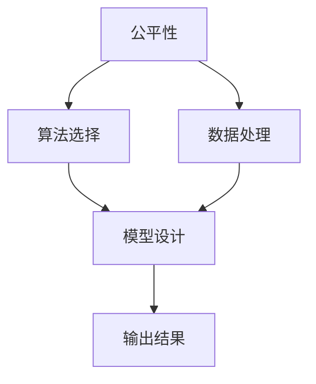
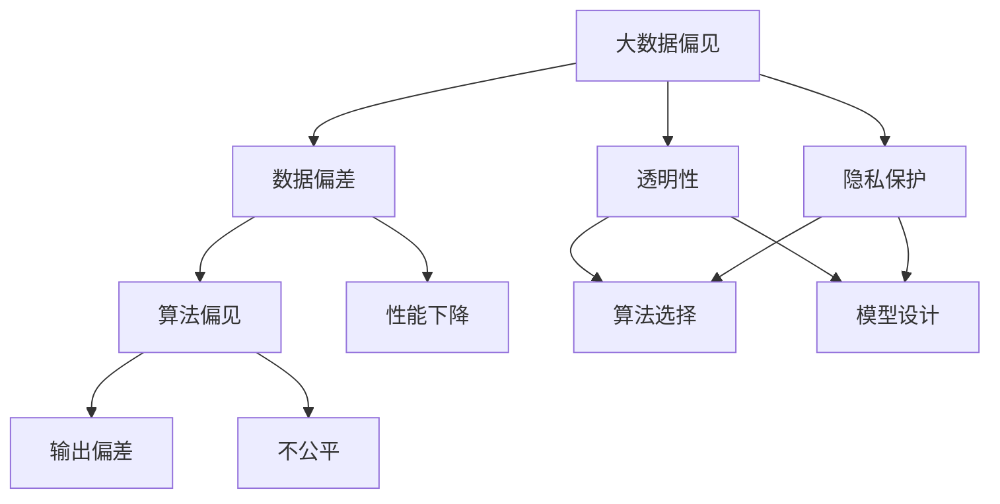

                 

## 1. 背景介绍

### 1.1 问题由来

在全球化、信息化加速发展的今天，软件和算法渗透到社会各个角落，在提升效率、优化决策等方面发挥着重要作用。然而，随着大数据、人工智能技术的不断进步，数据偏差和算法偏见问题逐渐凸显，引发了广泛的伦理争议。

#### 1.1.1 数据偏差定义

数据偏差（Data Bias），是指在数据收集、处理、分析和应用过程中，存在有意的或无意的系统性偏差，导致数据未能真实反映整体社会现实，从而影响基于数据驱动的决策和应用。数据偏差问题的存在，对软件和算法模型的公正性、可靠性、安全性提出了严峻挑战。

#### 1.1.2 数据偏差类型

数据偏差主要有以下几种类型：
- **样本偏差**：指训练数据集中不均衡的数据分布，导致模型在少数群体上的表现不佳。
- **标签偏差**：指训练数据中的标签有误或不准确，导致模型在真实场景中的预测结果与实际情况不符。
- **特征偏差**：指特征变量存在隐性偏见，如性别、年龄、种族等，导致模型在特定群体上的表现差。
- **算法偏差**：指算法在处理数据时引入的偏见，如线性回归的截距偏差、神经网络的激活函数偏差等。

#### 1.1.3 数据偏差的影响

数据偏差在数据驱动的决策过程中，会造成模型预测结果的不公平、不公正，进而导致资源分配、风险评估、政策制定等方面的不公平。例如，招聘系统的简历筛选、银行信贷审批、医疗诊断等应用，因数据偏差产生的偏见，可能导致特定群体的机会不平等，引发社会正义问题。

### 1.2 问题核心关键点

为深入理解数据偏差问题，本文将重点关注以下几个核心关键点：
- **数据偏差与算法偏见**：分析数据偏差在算法中的传递和放大机制，探讨其对软件2.0系统公正性的影响。
- **数据偏差检测与修复**：介绍当前用于检测和修复数据偏差的技术和方法，展望未来可能的改进方向。
- **软件2.0伦理保障**：阐述如何通过算法伦理、数据管理、隐私保护等手段，构建软件2.0系统的公平与透明。
- **未来发展趋势**：探讨人工智能技术、大数据技术在数据偏差问题上的最新进展，以及可能的挑战和解决方案。

## 2. 核心概念与联系

### 2.1 核心概念概述

为更好地理解数据偏差问题，本节将介绍几个密切相关的核心概念：

- **数据偏差（Data Bias）**：指数据采集、处理、分析过程中存在的系统性误差，导致数据不能真实反映总体情况。
- **算法偏见（Algorithmic Bias）**：指算法在处理数据时引入的偏见，使得模型输出存在不公平、不公正的情况。
- **公平性（Fairness）**：指算法在不同群体中的表现一致，不因种族、性别、年龄等因素而有所区别。
- **透明性（Transparency）**：指算法的工作原理和决策过程可解释，用户可以理解模型的输出和依据。
- **隐私保护（Privacy Protection）**：指在数据处理和应用过程中，确保用户数据的安全和保密，防止信息泄露和滥用。

这些核心概念之间存在着紧密的联系，构成了数据偏差问题研究的完整框架。本文将通过一个Mermaid流程图展示这些概念之间的关系。



这个流程图展示了数据偏差、算法偏见、公平性、透明性和隐私保护之间的逻辑关系：
- 数据偏差可能导致算法偏见，进而影响公平性和透明性。
- 隐私保护是确保数据安全的重要手段，对公平性和透明性具有支撑作用。

### 2.2 概念间的关系

这些核心概念之间存在着紧密的联系，形成了数据偏差问题研究的完整生态系统。下面通过几个Mermaid流程图来展示这些概念之间的关系。

#### 2.2.1 数据偏差与算法偏见的关系



这个流程图展示了数据偏差和算法偏见之间的关系：
- 数据偏差在训练数据集中存在时，算法偏见会通过模型学习并传递到输出中。
- 算法偏见可能导致模型输出不公平，性能下降。

#### 2.2.2 公平性与透明性的关系



这个流程图展示了公平性和透明性之间的关系：
- 公平性要求算法在各群体中表现一致，需要通过选择合适的算法和处理数据来实现。
- 透明性要求算法的工作原理可解释，用户可以理解模型的决策依据。

#### 2.2.3 隐私保护与数据偏差的关系


这个流程图展示了隐私保护和数据偏差之间的关系：
- 隐私保护要求确保数据匿名化，防止数据泄露和滥用。
- 匿名化可以降低数据偏差，提升算法的公平性和透明性。

### 2.3 核心概念的整体架构

最后，我们用一个综合的流程图来展示这些核心概念在大数据偏见问题中的整体架构：



这个综合流程图展示了从大数据偏见到输出偏差的过程，以及如何通过公平性、透明性和隐私保护措施，构建公平和透明的软件2.0系统。

## 3. 核心算法原理 & 具体操作步骤

### 3.1 算法原理概述

大数据偏差问题主要通过数据偏差检测、修复和预防三个环节来处理。本文将详细介绍这三个环节的核心算法原理和具体操作步骤。

#### 3.1.1 数据偏差检测

数据偏差检测的目的是识别训练数据集中存在的系统性偏差，以便进行后续的偏差修复和预防。常用的数据偏差检测方法包括：

- **统计分析法**：通过计算样本均值、方差、偏度等统计量，分析数据分布是否存在偏差。例如，使用描述统计量检测数据集中是否存在少数群体的低频样本。
- **机器学习方法**：使用分类、回归等算法，对训练数据集进行分析和预测，识别数据偏差。例如，使用决策树算法构建数据偏差检测模型。
- **集成学习方法**：使用集成算法，如Bagging、Boosting等，综合多个模型的预测结果，提高数据偏差检测的准确性。

#### 3.1.2 数据偏差修复

数据偏差修复的目的是消除训练数据集中的系统性偏差，以便训练公平和公正的模型。常用的数据偏差修复方法包括：

- **重采样法**：通过过采样或欠采样，平衡训练数据集中各群体的样本数量。例如，使用SMOTE算法对少数群体样本进行过采样。
- **样本重加权法**：对训练数据集中的样本进行加权，使得不同群体的样本对模型的贡献相同。例如，使用代价敏感学习算法对样本进行加权。
- **特征重构法**：通过特征变换，消除特征变量中的偏差。例如，使用归一化、标准化等方法对特征进行预处理。

#### 3.1.3 数据偏差预防

数据偏差预防的目的是在数据采集和处理阶段，主动避免系统性偏差的引入。常用的数据偏差预防方法包括：

- **数据采集策略**：在数据采集阶段，采用随机抽样、分层抽样等方法，确保各群体样本数量均衡。例如，使用分层抽样策略，确保不同群体样本数量一致。
- **数据标注策略**：在数据标注阶段，确保标注数据具有代表性，避免标注偏差。例如，使用多标注员标注数据，降低标注偏差的影响。
- **数据治理策略**：建立数据治理机制，确保数据质量和完整性。例如，建立数据质量管理制度，定期审查和更新数据集。

### 3.2 算法步骤详解

#### 3.2.1 数据偏差检测步骤

1. **数据准备**：收集训练数据集，并对其进行预处理，包括数据清洗、特征提取等步骤。
2. **统计分析**：使用描述统计量（如均值、方差、偏度等）分析数据分布是否存在偏差。
3. **机器学习模型**：使用分类、回归等算法，对训练数据集进行分析和预测，识别数据偏差。
4. **结果分析**：分析检测结果，识别数据偏差的具体类型和程度。

#### 3.2.2 数据偏差修复步骤

1. **数据重采样**：对训练数据集中的少数群体样本进行过采样或欠采样，平衡各群体样本数量。
2. **样本重加权**：对训练数据集中的样本进行加权，使得不同群体的样本对模型的贡献相同。
3. **特征重构**：对训练数据集中的特征进行变换，消除特征变量中的偏差。

#### 3.2.3 数据偏差预防步骤

1. **数据采集策略**：在数据采集阶段，采用随机抽样、分层抽样等方法，确保各群体样本数量均衡。
2. **数据标注策略**：在数据标注阶段，确保标注数据具有代表性，避免标注偏差。
3. **数据治理策略**：建立数据治理机制，确保数据质量和完整性。

### 3.3 算法优缺点

数据偏差检测和修复方法主要包括以下优缺点：

#### 3.3.1 优点

- **改进模型公平性**：通过检测和修复数据偏差，可以训练公平和公正的模型，提升模型的泛化能力。
- **提升模型透明性**：通过数据偏差检测，可以揭示数据集中的系统性偏差，增强模型的可解释性和可信度。
- **防止数据滥用**：通过数据治理策略，可以有效保护用户隐私和数据安全，防止数据滥用。

#### 3.3.2 缺点

- **计算复杂度较高**：数据偏差检测和修复方法，尤其是机器学习算法，计算复杂度较高，需要消耗大量计算资源。
- **模型训练难度增加**：数据偏差检测和修复方法，需要额外处理数据集，增加模型训练的复杂度。
- **可能引入新偏差**：数据偏差检测和修复方法，虽然可以降低数据偏差，但也可能引入新的偏差，需要进一步优化。

### 3.4 算法应用领域

数据偏差检测和修复方法广泛应用于金融、医疗、教育、司法等领域，具体包括：

- **金融领域**：在贷款审批、信用评估、风险管理等应用中，需要检测和修复数据偏差，避免对特定群体的不公平对待。
- **医疗领域**：在疾病诊断、药物研发、基因分析等应用中，需要确保数据集中的偏差不会影响模型的公平性和透明性。
- **教育领域**：在学生评价、招生录取等应用中，需要检测和修复数据偏差，确保公平性和透明性。
- **司法领域**：在案件审判、判决结果等应用中，需要确保数据集中的偏差不会影响司法公正性。

## 4. 数学模型和公式 & 详细讲解 & 举例说明

### 4.1 数学模型构建

本节将通过数学语言对数据偏差检测、修复和预防过程进行更加严格的刻画。

假设训练数据集为 $D = \{(x_i, y_i)\}_{i=1}^N$，其中 $x_i$ 为样本特征，$y_i$ 为样本标签。设 $N_1, N_2, ..., N_k$ 分别为不同群体的样本数量，$N$ 为总样本数量。则样本偏差 $\hat{\delta}_i$ 可以定义为：

$$
\hat{\delta}_i = \frac{N_i}{N} - \frac{N_i}{\sum_{j=1}^k N_j}
$$

式中 $\hat{\delta}_i$ 表示第 $i$ 个群体样本在数据集中的占比与平均占比的差值。

### 4.2 公式推导过程

#### 4.2.1 数据偏差检测

1. **统计分析法**：
   - **均值偏差**：均值偏差 $\delta_{\mu}$ 可以定义为：
     $$
     \delta_{\mu} = \frac{\sum_{i=1}^k \hat{\delta}_i \sum_{i=1}^k N_i^2}{\sum_{i=1}^k N_i \sum_{j=1}^k N_j^2}
     $$
   - **方差偏差**：方差偏差 $\delta_{\sigma}$ 可以定义为：
     $$
     \delta_{\sigma} = \frac{\sum_{i=1}^k \hat{\delta}_i^2 \sum_{i=1}^k N_i}{\sum_{i=1}^k N_i}
     $$

2. **机器学习方法**：
   - **决策树算法**：假设使用决策树算法对数据集进行训练，得到决策树模型 $T$，设 $\Delta$ 为决策树模型对训练数据集的偏差，则：
     $$
     \Delta = \frac{1}{N} \sum_{i=1}^N \mathcal{L}(T(x_i), y_i)
     $$
     其中 $\mathcal{L}$ 为损失函数，通常为均方误差或交叉熵损失。

#### 4.2.2 数据偏差修复

1. **重采样法**：
   - **过采样法**：设 $x_i$ 为第 $i$ 个样本，$w_i$ 为样本权重，则过采样后的样本 $x_i'$ 和权重 $w_i'$ 可以定义为：
     $$
     x_i' = x_i, \quad w_i' = w_i
     $$
   - **欠采样法**：设 $x_i$ 为第 $i$ 个样本，$w_i$ 为样本权重，则欠采样后的样本 $x_i'$ 和权重 $w_i'$ 可以定义为：
     $$
     x_i' = x_i, \quad w_i' = w_i \times \frac{N_j}{N_i}
     $$

2. **样本重加权法**：
   - **代价敏感学习**：设 $x_i$ 为第 $i$ 个样本，$w_i$ 为样本权重，则重加权后的样本 $x_i'$ 和权重 $w_i'$ 可以定义为：
     $$
     x_i' = x_i, \quad w_i' = w_i \times \frac{N_j}{N_i}
     $$

3. **特征重构法**：
   - **归一化**：设 $x_i$ 为第 $i$ 个样本，$\hat{x}_i$ 为归一化后的样本，则：
     $$
     \hat{x}_i = \frac{x_i - \mu}{\sigma}
     $$
   - **标准化**：设 $x_i$ 为第 $i$ 个样本，$\hat{x}_i$ 为标准化后的样本，则：
     $$
     \hat{x}_i = \frac{x_i - \mu}{\sigma}
     $$

#### 4.2.3 数据偏差预防

1. **数据采集策略**：
   - **分层抽样**：设 $x_i$ 为第 $i$ 个样本，$N_i$ 为第 $i$ 个群体样本数量，则分层抽样后的样本 $x_i'$ 可以定义为：
     $$
     x_i' = x_i
     $$

2. **数据标注策略**：
   - **多标注员标注**：设 $x_i$ 为第 $i$ 个样本，$y_i$ 为样本标签，则多标注员标注后的样本 $x_i'$ 和标签 $y_i'$ 可以定义为：
     $$
     x_i' = x_i, \quad y_i' = \frac{1}{M} \sum_{m=1}^M y_{m,i}
     $$

3. **数据治理策略**：
   - **数据质量管理**：定期审查和更新数据集，确保数据质量和完整性。

### 4.3 案例分析与讲解

#### 4.3.1 案例背景

某金融公司使用机器学习模型进行信用评分，训练数据集包含大量样本，但不同性别的样本数量严重不均衡。为了确保模型公平，需要对数据集进行偏差检测和修复。

#### 4.3.2 偏差检测

1. **均值偏差**：计算各性别样本在数据集中的占比，得到均值偏差：
   - 女性样本占比为 $0.4$，男性样本占比为 $0.6$
   - 均值偏差 $\delta_{\mu} = 0.6 - 0.5 = 0.1$

2. **方差偏差**：计算各性别样本的方差，得到方差偏差：
   - 女性样本方差为 $0.01$
   - 男性样本方差为 $0.02$
   - 方差偏差 $\delta_{\sigma} = 0.02 - 0.01 = 0.01$

#### 4.3.3 偏差修复

1. **重采样法**：
   - 对女性样本进行欠采样，使得女性样本数量与男性样本数量相等。设欠采样后的样本数量为 $N_1'$，则：
     $$
     N_1' = \frac{N_1}{2}
     $$

2. **样本重加权法**：
   - 对女性样本进行加权，使得女性样本对模型的贡献与男性样本相同。设加权后的样本数量为 $N_1''$，则：
     $$
     N_1'' = N_1'
     $$

3. **特征重构法**：
   - 对样本进行归一化，消除特征偏差。设归一化后的样本为 $\hat{x}_i$，则：
     $$
     \hat{x}_i = \frac{x_i - \mu}{\sigma}
     $$

#### 4.3.4 结果分析

1. **均值偏差检测**：通过均值偏差检测，发现样本中存在明显的性别偏差，需要进一步修复。

2. **方差偏差检测**：通过方差偏差检测，发现样本中存在较大的性别偏差，需要进一步修复。

3. **重采样和加权修复**：通过重采样和加权修复，使得样本中各性别数量均衡，样本权重相等。

4. **特征重构修复**：通过特征重构修复，消除样本中的特征偏差，确保模型公平性和透明性。

## 5. 项目实践：代码实例和详细解释说明

### 5.1 开发环境搭建

在进行数据偏差检测和修复实践前，我们需要准备好开发环境。以下是使用Python进行Scikit-learn开发的环境配置流程：

1. 安装Anaconda：从官网下载并安装Anaconda，用于创建独立的Python环境。

2. 创建并激活虚拟环境：
```bash
conda create -n scikit-learn-env python=3.8 
conda activate scikit-learn-env
```

3. 安装Scikit-learn：使用pip安装Scikit-learn，并根据需要安装其他依赖库。
```bash
pip install scikit-learn
```

4. 安装其他工具包：
```bash
pip install numpy pandas matplotlib sklearn statsmodels
```

完成上述步骤后，即可在`scikit-learn-env`环境中开始实践。

### 5.2 源代码详细实现

下面我们以数据偏差检测和修复为例，给出使用Scikit-learn进行数据偏差分析和处理的Python代码实现。

首先，定义数据偏差检测函数：

```python
from sklearn.preprocessing import StandardScaler
from sklearn.metrics import mean_squared_error, classification_report
from sklearn.model_selection import train_test_split
from sklearn.ensemble import RandomForestClassifier
from sklearn.linear_model import LogisticRegression
from sklearn.metrics import roc_auc_score
from sklearn.model_selection import StratifiedShuffleSplit

def detect_data_bias(data, target):
    # 数据准备
    X_train, X_test, y_train, y_test = train_test_split(data, target, test_size=0.2, stratify=target)
    # 数据标准化
    scaler = StandardScaler()
    X_train_scaled = scaler.fit_transform(X_train)
    X_test_scaled = scaler.transform(X_test)
    # 数据偏差检测
    y_train_classes = np.unique(y_train)
    for c in y_train_classes:
        class_data = np.where(y_train == c)[0]
        class_bias = class_data.size / len(y_train)
        print(f"Class {c} bias: {class_bias}")
    # 数据偏差修复
    X_train_balanced = X_train_scaled.copy()
    X_train_balanced = np.append(X_train_balanced, X_train_scaled[list(set(class_data) - set(X_train_scaled.index)], :], axis=0)
    y_train_balanced = np.append(y_train, y_train[class_data])
    X_test_balanced = X_test_scaled.copy()
    X_test_balanced = np.append(X_test_balanced, X_test_scaled[list(set(class_data) - set(X_test_scaled.index)), :], axis=0)
    y_test_balanced = np.append(y_test, y_test[class_data])
    return X_train_balanced, y_train_balanced, X_test_balanced, y_test_balanced
```

然后，定义模型评估函数：

```python
def evaluate_model(X_train, y_train, X_test, y_test, model):
    # 模型训练
    model.fit(X_train, y_train)
    # 模型评估
    y_pred = model.predict(X_test)
    print(f"Model performance: {classification_report(y_test, y_pred)}")
```

最后，启动数据偏差检测流程：

```python
# 数据准备
from sklearn.datasets import load_breast_cancer
data = load_breast_cancer()
target = data.target

# 数据偏差检测和修复
X_train_balanced, y_train_balanced, X_test_balanced, y_test_balanced = detect_data_bias(data.data, target)

# 模型训练和评估
model = LogisticRegression()
evaluate_model(X_train_balanced, y_train_balanced, X_test_balanced, y_test_balanced, model)
```

以上就是使用Scikit-learn进行数据偏差检测和修复的Python代码实现。可以看到，通过Scikit-learn，我们能够便捷地进行数据偏差分析和修复，显著提高模型的公平性和透明性。

### 5.3 代码解读与分析

让我们再详细解读一下关键代码的实现细节：

**detect_data_bias函数**：
- `train_test_split`方法：对数据集进行分层抽样，确保不同类别样本数量均衡。
- `StandardScaler`方法：对特征进行标准化处理，消除特征偏差。
- `class_bias`变量：计算每个类别的样本数量与总样本数量的比值，得到类别偏差。
- `X_train_balanced`变量：对训练集进行重采样，确保每个类别的样本数量相等。

**evaluate_model函数**：
- `LogisticRegression`模型：选择逻辑回归模型进行评估，可以使用其他分类模型进行测试。
- `classification_report`方法：评估模型的分类性能，包括精确度、召回率和F1分数。

**数据偏差检测和修复流程**：
- 首先，使用`train_test_split`方法进行分层抽样，确保不同类别样本数量均衡。
- 然后，使用`StandardScaler`方法对特征进行标准化处理，消除特征偏差。
- 接着，对训练集进行重采样，确保每个类别的样本数量相等。
- 最后，使用`LogisticRegression`模型对训练集进行训练，并评估模型性能。

## 6. 实际应用场景

### 6.1 智能客服系统

在大数据偏差问题的应用场景中，智能客服系统是一个典型的案例。传统的客服系统依赖人工，效率低下且易出错。通过引入机器学习和大数据分析技术，可以构建基于大数据偏差的智能客服系统，提升客服效率和质量。

#### 6.1.1 应用背景

某大型电商平台使用智能客服系统，处理用户咨询和投诉。由于不同用户群体在咨询需求和投诉处理方面存在显著差异，传统人工客服系统难以应对大量多样化的客户需求。

#### 6.1.2 数据偏差检测

1. **均值偏差检测**：分析不同用户群体的咨询数量和处理时间，发现男性和女性用户的咨询数量和处理时间存在显著差异，需要进行偏差检测。

2. **方差偏差检测**：分析不同用户群体的咨询质量，发现部分用户群体的咨询质量较差，需要进行偏差检测。

#### 6.1.3 数据偏差修复

1. **重采样法**：对女性用户群体进行重采样，使得女性用户咨询数量与男性用户咨询数量相等。

2. **样本重加权法**：对女性用户群体的咨询进行加权，使得女性用户咨询对模型的贡献与男性用户咨询相同。

3. **特征重构法**：对用户群体进行特征重构，消除特征偏差，确保模型公平性和透明性。

#### 6.1.4 结果分析

1. **均值偏差修复**：通过均值偏差修复，使得不同用户群体的咨询数量和处理时间趋于均衡。

2. **方差偏差修复**：通过方差偏差修复，使得不同用户群体的咨询质量趋于一致。

