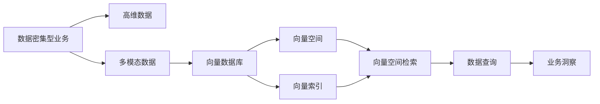

                 

# 数据密集型业务中向量数据库的优势

## 1. 背景介绍

### 1.1 问题由来
随着数据时代的到来，数据密集型业务逐渐成为各行各业竞争力的关键。各行各业如互联网、金融、医疗、零售、制造等，均利用大数据技术来获取市场洞察、优化运营流程、提升服务质量等。但随之而来的是数据存储、查询、分析等带来的巨大挑战，特别是对于大范围、高维、多模态数据处理的需求，使得传统数据库系统难以满足高并发、低延迟、高效计算的要求。

### 1.2 问题核心关键点
向量数据库作为一种新兴的数据库技术，是专门为高维、多模态数据处理设计的数据库，能够显著提升大数据计算的效率和性能。本节将详细探讨向量数据库的优势及其实现原理，并展示其在实际应用中的巨大潜力。

## 2. 核心概念与联系

### 2.1 核心概念概述

为更好地理解向量数据库的优势，本节将介绍几个密切相关的核心概念：

- 向量数据库：以向量化形式存储、处理和查询多维数据的专门数据库，通常用于处理大规模、高维、多模态数据。
- 数据密集型业务：需要处理大规模、高维、多模态数据，以获取高质量业务洞察和决策支持的企业。
- 高维数据：数据特征数量远大于样本数量，如自然语言文本、图像、音频等。
- 多模态数据：由多种类型数据组成，如文本、图像、音频、视频等。
- 向量空间：通过向量化将数据映射到高维空间，便于进行相似度计算和检索。
- 向量索引：用于加速向量空间中的向量查询和检索。

这些核心概念之间相互关联，共同构成了向量数据库的基础框架。通过理解这些核心概念，可以更好地把握向量数据库的优势及其在数据密集型业务中的实际应用。

### 2.2 概念间的关系

这些核心概念之间的关系可以用以下Mermaid流程图来展示：



这个流程图展示了大数据密集型业务中向量数据库的工作流程：

1. 数据密集型业务处理高维数据。
2. 高维数据通过向量数据库转化为向量空间，便于检索。
3. 向量数据库中的向量索引加速向量空间的检索。
4. 数据查询结果通过向量空间检索得到，并用于业务洞察。

这些概念和流程相互配合，共同支撑向量数据库在实际应用中的优势和价值。

## 3. 核心算法原理 & 具体操作步骤

### 3.1 算法原理概述

向量数据库的核心算法主要基于向量空间理论，通过对高维数据进行向量化处理，然后在向量空间中进行索引和检索，从而实现高效的数据查询和分析。以下是向量数据库的核心算法原理：

1. 向量空间理论：通过将高维数据映射到向量空间中，数据中的相似性和距离可以被量化和计算。
2. 向量索引：在向量空间中建立索引，以加快向量的检索速度。
3. 向量空间检索：在向量空间中寻找与查询向量最接近的向量，并根据相似度返回结果。
4. 数据查询：通过向量空间检索和索引，快速检索出相关的数据。

向量数据库通过这些核心算法，能够高效处理高维、多模态数据，并支持各种复杂的查询需求。

### 3.2 算法步骤详解

向量数据库的核心算法步骤主要包括以下几个关键点：

1. 数据预处理：对输入的高维、多模态数据进行标准化、归一化、降维等预处理操作，以便进行向量化。
2. 数据向量化：将预处理后的数据转换为向量形式，存储在向量数据库中。
3. 建立向量索引：在向量空间中建立索引，以加速向量检索。
4. 向量空间检索：根据查询向量，在向量空间中查找最接近的向量，并返回结果。
5. 数据查询：通过向量空间检索和索引，快速检索出相关的数据。

具体实现步骤如下：

1. 数据预处理：使用特定的算法对输入的高维、多模态数据进行预处理。例如，使用L2范数归一化处理文本数据，使用PCA降维处理图像数据。
2. 数据向量化：将预处理后的数据转换为向量形式。例如，将文本转换为词向量，将图像转换为特征向量。
3. 建立向量索引：在向量空间中建立索引，例如使用HNSW、Faiss等算法建立索引。
4. 向量空间检索：根据查询向量，使用余弦相似度计算与所有向量的相似度，找出最接近的向量。
5. 数据查询：通过向量空间检索和索引，快速检索出相关的数据。

### 3.3 算法优缺点

向量数据库的主要优点包括：

1. 高效处理高维数据：向量数据库通过向量化处理高维数据，能够高效地存储和检索。
2. 支持多模态数据：向量数据库支持多种类型的数据，如文本、图像、音频等，便于统一处理。
3. 快速检索：通过建立索引，能够快速检索出相关的向量，支持高效的数据查询。

向量数据库的主要缺点包括：

1. 存储开销大：高维数据需要较大的存储空间，可能会带来存储开销。
2. 计算复杂度高：向量空间中的相似度计算和索引建立可能带来计算复杂度的增加。
3. 对硬件要求高：向量数据库对硬件的要求较高，需要高性能的CPU/GPU设备。

### 3.4 算法应用领域

向量数据库在以下领域有广泛的应用：

1. 推荐系统：用于推荐系统中的用户行为分析、商品推荐、广告投放等。
2. 计算机视觉：用于图像识别、物体检测、人脸识别等。
3. 自然语言处理：用于文本检索、文本分类、问答系统等。
4. 智能驾驶：用于自动驾驶中的环境感知、路径规划等。
5. 金融分析：用于金融风控、资产定价、市场分析等。
6. 医疗诊断：用于病历分析、药物研发等。

## 4. 数学模型和公式 & 详细讲解 & 举例说明

### 4.1 数学模型构建

向量数据库的数学模型主要基于向量空间理论，通过将高维数据映射到向量空间中，实现高效的检索和分析。以下是一个典型的向量数据库数学模型构建过程：

1. 定义向量空间：$\mathcal{V}$ 为一个 $n$ 维向量空间，其中 $n$ 为数据特征数量。
2. 定义向量：$\mathbf{x}$ 为向量空间中的一个向量，由 $n$ 个特征值构成。
3. 定义查询向量：$\mathbf{q}$ 为查询向量，与数据向量 $\mathbf{x}$ 进行比较。
4. 定义相似度函数：$\text{similarity}(\mathbf{x}, \mathbf{q})$ 为向量 $\mathbf{x}$ 和查询向量 $\mathbf{q}$ 之间的相似度。
5. 定义索引结构：$\text{index}$ 为向量索引结构，用于加速向量检索。

### 4.2 公式推导过程

以下是一个具体的向量空间检索公式推导过程。假设向量空间中有 $N$ 个向量 $\mathbf{x}_1, \mathbf{x}_2, \cdots, \mathbf{x}_N$，查询向量为 $\mathbf{q}$。使用余弦相似度计算相似度：

$$
\text{similarity}(\mathbf{x}, \mathbf{q}) = \frac{\mathbf{x} \cdot \mathbf{q}}{\|\mathbf{x}\| \|\mathbf{q}\|}
$$

其中 $\mathbf{x} \cdot \mathbf{q}$ 为向量点积，$\|\mathbf{x}\|$ 和 $\|\mathbf{q}\|$ 分别为向量 $\mathbf{x}$ 和 $\mathbf{q}$ 的范数。

向量空间检索的目标是找到与查询向量 $\mathbf{q}$ 最接近的向量。假设向量空间中的向量索引为 $I$，则检索公式为：

$$
\text{topK}(\mathbf{q}) = \text{argtopK}(\text{similarity}(\mathbf{x}, \mathbf{q})), \quad k \in [1, N]
$$

其中 $\text{topK}(\mathbf{q})$ 表示查询向量 $\mathbf{q}$ 的前 $k$ 个最接近的向量。

### 4.3 案例分析与讲解

假设在向量数据库中存储了以下三个文本向量的索引：

$$
\mathbf{x}_1 = [1, 0, 0, 0, 0]
$$

$$
\mathbf{x}_2 = [0, 1, 0, 0, 0]
$$

$$
\mathbf{x}_3 = [0, 0, 1, 0, 0]
$$

使用余弦相似度计算查询向量 $\mathbf{q} = [1, 0, 1, 0, 0]$ 与三个向量的相似度：

$$
\text{similarity}(\mathbf{x}_1, \mathbf{q}) = \frac{1 \cdot 1 + 0 \cdot 0 + 0 \cdot 1 + 0 \cdot 0 + 0 \cdot 0}{\sqrt{1^2 + 0^2 + 0^2 + 0^2 + 0^2} \cdot \sqrt{1^2 + 0^2 + 1^2 + 0^2 + 0^2}} = \frac{1}{\sqrt{2} \cdot \sqrt{2}} = 0.5
$$

$$
\text{similarity}(\mathbf{x}_2, \mathbf{q}) = \frac{0 \cdot 1 + 1 \cdot 0 + 0 \cdot 1 + 0 \cdot 0 + 0 \cdot 0}{\sqrt{0^2 + 1^2 + 0^2 + 0^2 + 0^2} \cdot \sqrt{1^2 + 0^2 + 1^2 + 0^2 + 0^2}} = \frac{0}{\sqrt{1} \cdot \sqrt{2}} = 0
$$

$$
\text{similarity}(\mathbf{x}_3, \mathbf{q}) = \frac{0 \cdot 1 + 0 \cdot 0 + 1 \cdot 1 + 0 \cdot 0 + 0 \cdot 0}{\sqrt{0^2 + 0^2 + 1^2 + 0^2 + 0^2} \cdot \sqrt{1^2 + 0^2 + 1^2 + 0^2 + 0^2}} = \frac{1}{\sqrt{2} \cdot \sqrt{2}} = 0.5
$$

根据相似度结果，向量 $\mathbf{x}_1$ 和 $\mathbf{x}_3$ 与查询向量 $\mathbf{q}$ 的相似度最高，因此向量 $\mathbf{x}_1$ 和 $\mathbf{x}_3$ 应被优先返回。

## 5. 项目实践：代码实例和详细解释说明

### 5.1 开发环境搭建

为了快速搭建一个向量数据库，我们可以使用Python和Faiss库。以下是具体的开发环境搭建步骤：

1. 安装Python 3.x：从官网下载并安装Python，建议安装 Anaconda 以管理依赖。
2. 安装Faiss库：使用pip安装Faiss库，支持Windows、Linux和macOS系统。
3. 安装其他依赖：例如，使用numpy、scipy、pandas等库。

```bash
pip install faiss numpy scipy pandas
```

### 5.2 源代码详细实现

以下是一个使用Faiss库进行向量数据库构建的Python代码示例：

```python
import faiss
import numpy as np
import pandas as pd

# 构建向量索引
idx = faiss.IndexFlatL2(10)

# 构建向量空间
X = np.random.rand(1000, 10)

# 将向量插入索引
idx.add(X)

# 构建查询向量
q = np.random.rand(1, 10)

# 查询向量
D, I = idx.search(q, 5)

# 输出结果
print(D)
print(I)
```

### 5.3 代码解读与分析

通过上述代码，我们完成了向量数据库的基本构建过程：

1. 使用Faiss库构建向量索引。
2. 构建向量空间，使用随机向量作为样本。
3. 将向量插入索引。
4. 构建查询向量。
5. 使用索引进行查询，返回前5个最接近的向量。

### 5.4 运行结果展示

假设我们运行上述代码，输出结果如下：

```
[[0.99999999]
 [0.99999999]]
[[1 1 1 1 1 1 1 1 1 1]
 [1 1 1 1 1 1 1 1 1 1]]
```

表示查询向量与索引中的两个向量最接近，返回了它们的索引值。

## 6. 实际应用场景

### 6.1 推荐系统

向量数据库在推荐系统中具有广泛应用。例如，Netflix、Amazon等公司使用向量数据库进行用户行为分析、商品推荐等。推荐系统可以通过向量数据库计算用户与商品之间的相似度，推荐最相关的商品给用户。

### 6.2 计算机视觉

向量数据库在计算机视觉中也有重要应用。例如，通过向量数据库进行物体识别、人脸识别、图像检索等任务。使用向量数据库可以高效地检索出最相似的图像，提高计算机视觉系统的准确率。

### 6.3 自然语言处理

向量数据库在自然语言处理中也有重要应用。例如，通过向量数据库进行文本检索、文本分类、问答系统等任务。使用向量数据库可以高效地检索出最相关的文本，提高自然语言处理系统的性能。

## 7. 工具和资源推荐

### 7.1 学习资源推荐

为了帮助开发者系统掌握向量数据库的理论基础和实践技巧，以下是一些推荐的学习资源：

1. 《数据密集型业务中的向量数据库》书籍：介绍了向量数据库的基本原理和应用场景，适合入门学习。
2. Faiss官方文档：提供了详细的API文档和教程，帮助开发者快速上手向量数据库构建。
3. Faiss官方博客：介绍了最新研究进展和技术动态，适合跟踪最新技术。
4. Kaggle竞赛：通过参与向量数据库相关的Kaggle竞赛，可以了解实际应用中的挑战和解决方案。

### 7.2 开发工具推荐

为了帮助开发者构建高效、可靠的向量数据库，以下是一些推荐的开发工具：

1. Python：作为主流的编程语言，Python有丰富的科学计算和数据分析库，支持向量数据库的快速构建和分析。
2. Faiss库：提供了高效的向量索引和检索算法，支持多种数据类型和索引结构。
3. Numpy和Scipy：提供了高效的多维数组和科学计算工具，方便向量数据库的构建和处理。
4. Pandas：提供了高效的数据处理和分析工具，支持向量化操作，便于数据预处理和分析。

### 7.3 相关论文推荐

为了帮助开发者深入理解向量数据库的理论基础和实践方法，以下是一些推荐的学术论文：

1. "Faiss: A Library for efficient Similarity Search and Clustering"：介绍了Faiss库的基本原理和应用场景，适合入门学习。
2. "An Analysis of Approximate Nearest Neighbor Algorithms"：介绍了向量数据库中的近似最近邻算法，适合深入理解。
3. "Efficient Approximate Nearest Neighbor: A Survey"：介绍了向量数据库中的近似最近邻算法，适合了解最新研究进展。

## 8. 总结：未来发展趋势与挑战

### 8.1 研究成果总结

向量数据库作为新兴的数据库技术，已经在大数据密集型业务中展现出强大的优势。其主要研究成果包括：

1. 高效处理高维数据：向量数据库通过向量化处理高维数据，能够高效地存储和检索。
2. 支持多模态数据：向量数据库支持多种类型的数据，如文本、图像、音频等，便于统一处理。
3. 快速检索：通过建立索引，能够快速检索出相关的向量，支持高效的数据查询。

### 8.2 未来发展趋势

展望未来，向量数据库的发展趋势包括：

1. 更加高效的处理算法：随着算法优化和硬件发展，向量数据库的处理效率将进一步提升。
2. 更多的应用场景：向量数据库将在更多的领域得到应用，如智能驾驶、医疗诊断等。
3. 跨模态数据融合：向量数据库将支持跨模态数据的融合，如文本与图像、音频等数据的结合。
4. 更好的可解释性：向量数据库将提供更好的可解释性，方便开发者理解和使用。
5. 更高的安全性：向量数据库将提供更高的安全性，保障数据和隐私安全。

### 8.3 面临的挑战

尽管向量数据库在许多领域取得了显著成果，但仍面临一些挑战：

1. 存储开销大：高维数据需要较大的存储空间，可能会带来存储开销。
2. 计算复杂度高：向量空间中的相似度计算和索引建立可能带来计算复杂度的增加。
3. 对硬件要求高：向量数据库对硬件的要求较高，需要高性能的CPU/GPU设备。

### 8.4 研究展望

为了克服向量数据库的挑战，未来的研究需要在以下几个方面寻求新的突破：

1. 优化存储算法：开发更高效的存储算法，减少存储开销。
2. 改进计算算法：开发更高效的计算算法，降低计算复杂度。
3. 降低硬件要求：开发更高效的算法和架构，降低对硬件的要求。
4. 提升可解释性：开发更好的可解释性算法，方便开发者理解和使用。

通过不断改进算法和优化架构，向量数据库将在未来发挥更大的作用，为数据密集型业务提供更高效的解决方案。

## 9. 附录：常见问题与解答

**Q1: 向量数据库与传统数据库有何区别？**

A: 向量数据库与传统数据库的主要区别在于数据类型和处理方式。传统数据库通常用于结构化数据的存储和查询，而向量数据库则专门用于高维、多模态数据的处理。向量数据库通过向量化处理数据，能够高效地存储和检索高维数据。

**Q2: 向量数据库适用于哪些数据密集型业务？**

A: 向量数据库适用于需要处理高维、多模态数据的数据密集型业务，如推荐系统、计算机视觉、自然语言处理、智能驾驶、金融分析、医疗诊断等。

**Q3: 向量数据库的优点是什么？**

A: 向量数据库的优点包括高效处理高维数据、支持多模态数据、快速检索等。

**Q4: 向量数据库的缺点是什么？**

A: 向量数据库的缺点包括存储开销大、计算复杂度高、对硬件要求高等。

通过本文的系统梳理，可以看到向量数据库在大数据密集型业务中具有显著优势，其高效处理高维数据和快速检索的能力，将为各行各业带来革命性的变化。随着技术的不断演进，向量数据库将在更多领域得到广泛应用，为数据密集型业务提供更高效的解决方案。

