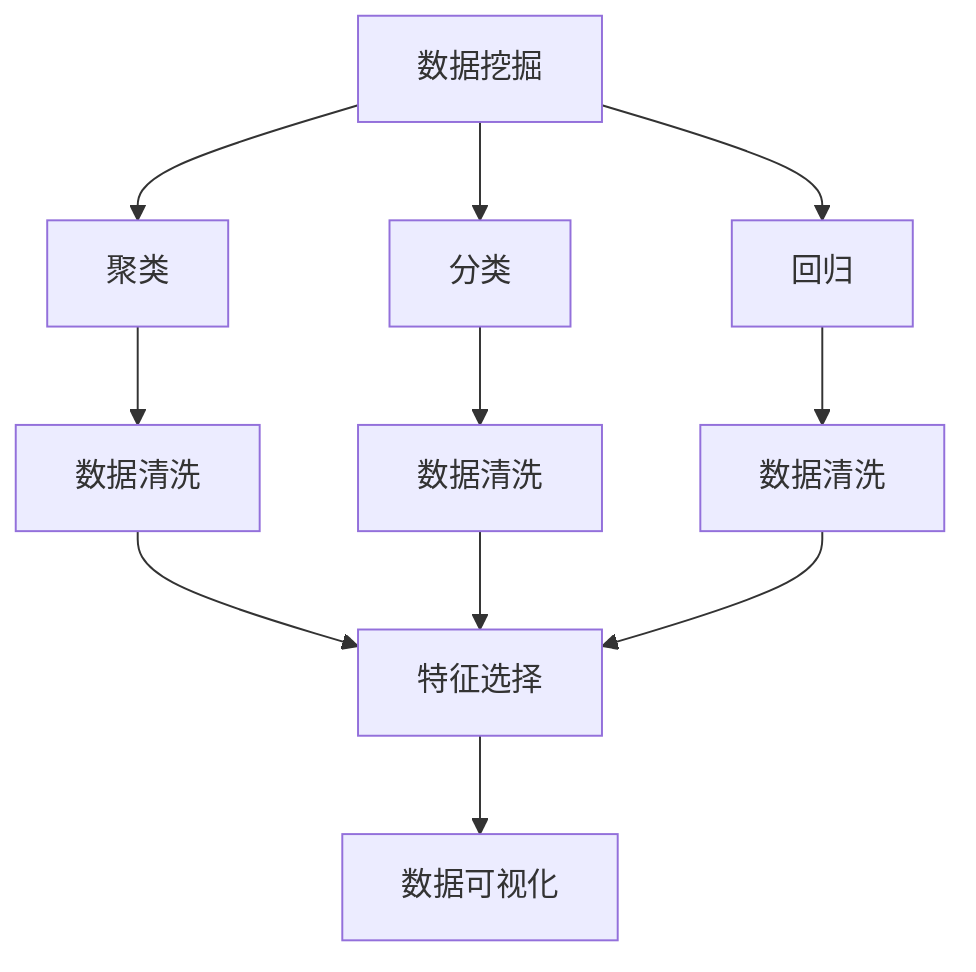
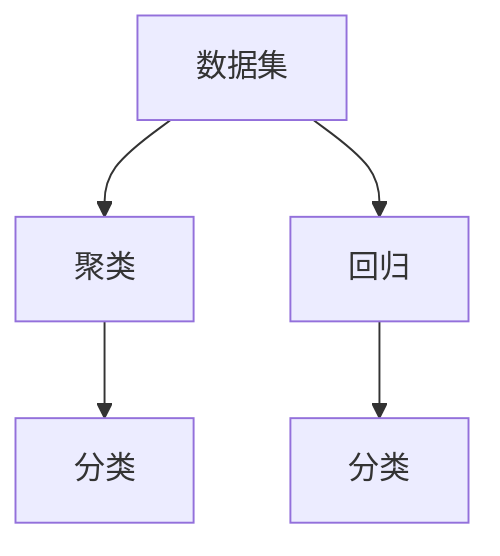
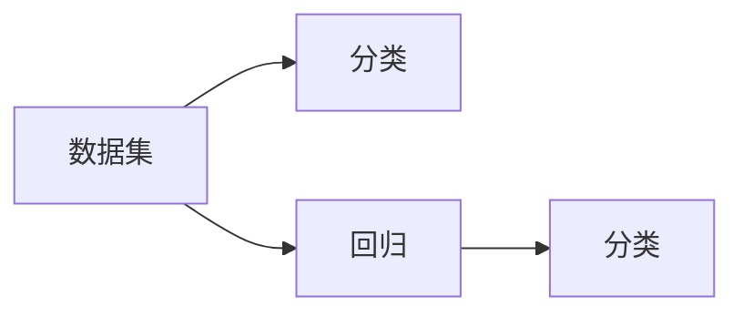
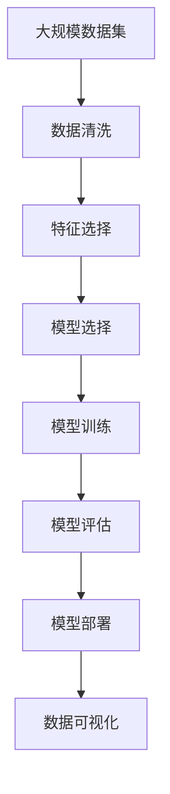

                 

# 数据挖掘 原理与代码实例讲解

> 关键词：数据挖掘, 聚类算法, 分类算法, 回归算法, 数据清洗, 数据可视化

## 1. 背景介绍

### 1.1 问题由来

在当今数据驱动的商业环境中，企业需要从海量数据中提取有价值的信息和知识，以支持决策和运营。数据挖掘作为一门数据分析技术，旨在从大数据中挖掘出模式、规律和洞见，帮助企业发现市场机会，优化产品和服务，提升客户体验。

然而，随着数据量的爆炸性增长，如何高效、准确地从数据中提取有价值的信息，成为一个重要的挑战。传统的数据挖掘方法往往依赖于经验丰富的分析师，难以应对复杂多变的业务需求。而随着机器学习和人工智能技术的迅猛发展，数据挖掘领域迎来了新的变革，自动化、智能化的数据挖掘技术逐渐成为主流。

### 1.2 问题核心关键点

数据挖掘的核心目标是通过算法和技术手段，从数据中发现有价值的模式、规律和知识。其关键点包括：

- **数据清洗**：清洗缺失、噪声和异常值，确保数据的质量和一致性。
- **特征工程**：选择合适的特征，构建高质量的数据集，提升模型的性能。
- **模型选择**：根据具体业务需求，选择合适的模型，如聚类、分类、回归等。
- **模型评估**：使用合适的评估指标，评估模型的效果，进行模型调优。
- **模型部署**：将模型集成到实际应用中，支持业务决策和运营。

### 1.3 问题研究意义

掌握数据挖掘的原理和实践，对于提升企业的数据利用能力，驱动商业决策，具有重要意义：

- **降本增效**：自动化、智能化的数据挖掘技术，可以大幅降低人工分析成本，提升数据处理效率。
- **决策支持**：通过数据挖掘发现的市场趋势、客户行为等洞见，可以指导业务决策，提升决策准确性。
- **业务创新**：数据挖掘技术可以帮助企业发现新的业务机会，推动产品创新和客户服务升级。
- **数据驱动**：数据挖掘技术强调数据的重要性，可以帮助企业建立数据驱动的运营模式。

## 2. 核心概念与联系

### 2.1 核心概念概述

为更好地理解数据挖掘的核心技术，本节将介绍几个密切相关的核心概念：

- **数据挖掘(Data Mining)**：从数据中发现、提炼有价值的模式和规律，用于支持商业决策和运营。
- **聚类(Clustering)**：将数据划分为若干自然组，使得同一组内的数据具有相似的特征。
- **分类(Classification)**：根据数据的属性，预测其所属的类别。
- **回归(Regression)**：预测数值型的目标变量，如销售量、收益等。
- **数据清洗(Data Cleaning)**：去除数据中的缺失值、噪声和异常值，确保数据的质量和一致性。
- **特征选择(Feature Selection)**：选择最重要的特征，构建高质量的数据集，提升模型性能。
- **数据可视化(Data Visualization)**：通过图表展示数据特性，帮助理解和分析数据。

这些概念之间的逻辑关系可以通过以下Mermaid流程图来展示：



这个流程图展示了大数据挖掘的主要技术环节和相互关系：

1. 数据挖掘作为入口，通过聚类、分类和回归等算法，对数据进行初步处理和分析。
2. 数据清洗是数据挖掘的基础，通过去除噪声和异常值，确保数据质量。
3. 特征选择是数据挖掘的重要步骤，通过选择关键特征，提升模型性能。
4. 数据可视化是数据挖掘的输出，通过图表展示分析结果，帮助理解和决策。

### 2.2 概念间的关系

这些核心概念之间存在着紧密的联系，形成了数据挖掘的完整流程。下面我们通过几个Mermaid流程图来展示这些概念之间的关系。

#### 2.2.1 数据挖掘流程


这个流程图展示了数据挖掘的基本流程，从数据准备到模型部署的各个环节。

#### 2.2.2 聚类与分类的关系



这个流程图展示了聚类和分类之间的关系。聚类和分类都是数据挖掘中的重要技术，通过聚类将数据划分为若干组，再对每组进行分类或回归，得到更具体的业务洞见。

#### 2.2.3 回归与分类的关系



这个流程图展示了回归和分类之间的关系。分类和回归都是数据挖掘中常见的预测模型，分类用于离散目标变量的预测，回归用于连续目标变量的预测。

### 2.3 核心概念的整体架构

最后，我们用一个综合的流程图来展示这些核心概念在大数据挖掘过程中的整体架构：



这个综合流程图展示了从数据准备到模型部署的完整过程，各个环节通过数据清洗、特征选择、模型训练、模型评估和模型部署相互衔接，形成了数据挖掘的闭环。

## 3. 核心算法原理 & 具体操作步骤
### 3.1 算法原理概述

数据挖掘的原理主要基于统计学和机器学习理论，通过算法和模型从数据中发现有价值的模式和规律。其核心思想包括以下几个方面：

- **数据预处理**：通过数据清洗、特征工程等技术，提升数据质量和一致性。
- **模型选择**：根据具体业务需求，选择合适的模型，如聚类、分类、回归等。
- **模型训练**：使用训练数据集，训练模型参数，使其能够预测新的数据。
- **模型评估**：使用测试数据集，评估模型效果，进行模型调优。
- **模型部署**：将模型集成到实际应用中，支持业务决策和运营。

数据挖掘的核心算法包括聚类算法、分类算法和回归算法等，下面将详细讲解这些算法原理。

### 3.2 算法步骤详解

#### 3.2.1 聚类算法步骤

聚类算法通过将数据划分为若干自然组，使得同一组内的数据具有相似的特征。以下是K-Means聚类的详细步骤：

1. **数据准备**：准备聚类数据集，包括数据集 $D$ 和聚类数 $k$。
2. **初始化聚类中心**：随机选择 $k$ 个数据点作为初始聚类中心 $\mu_1, \mu_2, \ldots, \mu_k$。
3. **分配数据点**：对于每个数据点 $x$，计算其与各聚类中心的距离，分配到距离最近的聚类。
4. **更新聚类中心**：对于每个聚类，计算其所有成员的均值，更新聚类中心。
5. **重复迭代**：重复步骤 3 和 4，直到聚类中心不再变化。

K-Means算法的优缺点如下：

- **优点**：算法简单，易于实现；适用于大规模数据集。
- **缺点**：对于聚类数 $k$ 的敏感性高；对异常值敏感；聚类结果可能不唯一。

#### 3.2.2 分类算法步骤

分类算法通过训练数据集，构建分类模型，用于预测新数据的类别。以下是朴素贝叶斯分类器的详细步骤：

1. **数据准备**：准备分类数据集，包括训练集 $D_{train}$ 和测试集 $D_{test}$。
2. **计算先验概率**：对于每个类别 $c_i$，计算其在训练集中的比例 $\pi_i$。
3. **计算条件概率**：对于每个特征 $f_j$，计算其给定类别 $c_i$ 的条件概率 $P(f_j|c_i)$。
4. **预测**：对于新数据 $x$，计算其属于每个类别的后验概率 $P(c_i|x)$，选择概率最大的类别作为预测结果。

朴素贝叶斯算法的优缺点如下：

- **优点**：算法简单，易于实现；适用于高维数据集。
- **缺点**：假设特征之间相互独立，可能不满足实际情况；对于噪声敏感。

#### 3.2.3 回归算法步骤

回归算法通过训练数据集，构建回归模型，用于预测新数据的数值目标变量。以下是线性回归的详细步骤：

1. **数据准备**：准备回归数据集，包括训练集 $D_{train}$ 和测试集 $D_{test}$。
2. **计算最小二乘法**：对于每个训练样本 $(x_i, y_i)$，计算预测值 $\hat{y}_i$，使得预测值与真实值的误差最小化。
3. **计算回归系数**：根据最小二乘法计算回归系数 $\beta$。
4. **预测**：对于新数据 $x$，计算其预测值 $\hat{y}$。

线性回归算法的优缺点如下：

- **优点**：算法简单，易于实现；适用于线性关系的预测。
- **缺点**：假设数据之间线性关系，可能不满足实际情况；对异常值敏感。

### 3.3 算法优缺点

数据挖掘算法有其独特的优缺点，需要根据具体应用场景进行选择：

#### 3.3.1 聚类算法优缺点

**优点**：
- **无监督学习**：无需标注数据，能够从数据中发现未知的规律。
- **处理大规模数据**：适用于大规模数据集。

**缺点**：
- **可解释性差**：聚类结果可能不易理解。
- **结果不唯一**：不同初始条件可能导致不同的聚类结果。

#### 3.3.2 分类算法优缺点

**优点**：
- **高效性**：算法简单，易于实现。
- **高准确率**：适用于高维数据集，对于部分数据集能够取得不错的效果。

**缺点**：
- **假设独立性**：假设特征之间独立，可能不满足实际情况。
- **对噪声敏感**：对于噪声敏感。

#### 3.3.3 回归算法优缺点

**优点**：
- **高效性**：算法简单，易于实现。
- **适用于数值预测**：适用于数值型目标变量的预测。

**缺点**：
- **假设线性关系**：假设数据之间线性关系，可能不满足实际情况。
- **对异常值敏感**：对于异常值敏感。

### 3.4 算法应用领域

数据挖掘算法在各个领域都有广泛的应用：

- **市场分析**：通过聚类和分类算法，发现市场趋势和客户群体。
- **金融风险管理**：通过回归算法，预测金融风险和收益。
- **医疗诊断**：通过聚类和分类算法，发现疾病模式和异常病例。
- **产品推荐**：通过聚类和分类算法，推荐相关产品和服务。
- **网络安全**：通过分类算法，检测和防范网络攻击。

## 4. 数学模型和公式 & 详细讲解  
### 4.1 数学模型构建

本节将使用数学语言对数据挖掘的主要算法进行更加严格的刻画。

**K-Means算法**：

设数据集 $D = \{(x_1, y_1), (x_2, y_2), \ldots, (x_n, y_n)\}$，其中 $x_i$ 为样本特征，$y_i$ 为类别标签。聚类数 $k$，初始聚类中心 $\mu_1, \mu_2, \ldots, \mu_k$。

最小化以下损失函数：

$$
J = \sum_{i=1}^n \sum_{j=1}^k d(x_i, \mu_j)^2
$$

其中 $d(x_i, \mu_j)$ 为样本 $x_i$ 与聚类中心 $\mu_j$ 的距离。

**朴素贝叶斯算法**：

设数据集 $D = \{(x_1, y_1), (x_2, y_2), \ldots, (x_n, y_n)\}$，其中 $x_i$ 为样本特征，$y_i$ 为类别标签。假设特征之间独立，计算先验概率 $\pi_i$ 和条件概率 $P(f_j|c_i)$。

后验概率计算公式为：

$$
P(c_i|x) = \frac{P(x|c_i)P(c_i)}{\sum_{j=1}^k P(x|c_j)P(c_j)}
$$

**线性回归算法**：

设数据集 $D = \{(x_1, y_1), (x_2, y_2), \ldots, (x_n, y_n)\}$，其中 $x_i$ 为样本特征，$y_i$ 为数值目标变量。回归系数 $\beta$ 为 $(\beta_0, \beta_1, \ldots, \beta_p)$。

最小化以下损失函数：

$$
J = \frac{1}{2n} \sum_{i=1}^n (y_i - \hat{y}_i)^2
$$

其中 $\hat{y}_i = \beta_0 + \sum_{j=1}^p \beta_j x_{ij}$ 为预测值。

### 4.2 公式推导过程

以下我们以朴素贝叶斯分类器为例，推导后验概率的计算公式。

设数据集 $D = \{(x_1, y_1), (x_2, y_2), \ldots, (x_n, y_n)\}$，其中 $x_i$ 为样本特征，$y_i$ 为类别标签。假设特征之间独立，计算先验概率 $\pi_i$ 和条件概率 $P(f_j|c_i)$。

后验概率计算公式为：

$$
P(c_i|x) = \frac{P(x|c_i)P(c_i)}{\sum_{j=1}^k P(x|c_j)P(c_j)}
$$

其中 $P(x|c_i) = \prod_{j=1}^p P(f_j|c_i)$，$P(c_i) = \frac{n_i}{n}$，$P(f_j|c_i) = \frac{n_{ij}}{n_i}$，$n_i$ 为类别 $c_i$ 的样本数量，$n_{ij}$ 为特征 $f_j$ 给定类别 $c_i$ 的样本数量。

### 4.3 案例分析与讲解

假设我们有一个数据集，包含用户的年龄、性别、收入等信息，以及是否购买某产品的类别标签。现在需要构建一个朴素贝叶斯分类器，预测新用户是否购买该产品。

首先，需要收集和清洗数据，准备训练集和测试集。然后，计算先验概率和条件概率，得到分类模型。最后，在新数据上使用分类模型进行预测，并评估模型的性能。

## 5. 项目实践：代码实例和详细解释说明
### 5.1 开发环境搭建

在进行数据挖掘实践前，我们需要准备好开发环境。以下是使用Python进行Scikit-learn开发的环境配置流程：

1. 安装Anaconda：从官网下载并安装Anaconda，用于创建独立的Python环境。

2. 创建并激活虚拟环境：
```bash
conda create -n sklearn-env python=3.8 
conda activate sklearn-env
```

3. 安装Scikit-learn：
```bash
pip install -U scikit-learn
```

4. 安装各类工具包：
```bash
pip install numpy pandas scipy matplotlib jupyter notebook ipython
```

完成上述步骤后，即可在`sklearn-env`环境中开始数据挖掘实践。

### 5.2 源代码详细实现

这里以朴素贝叶斯分类器为例，使用Scikit-learn库实现对鸢尾花数据集的分类。

```python
from sklearn.datasets import load_iris
from sklearn.model_selection import train_test_split
from sklearn.naive_bayes import GaussianNB
from sklearn.metrics import accuracy_score

# 加载数据集
iris = load_iris()
X = iris.data
y = iris.target

# 划分数据集
X_train, X_test, y_train, y_test = train_test_split(X, y, test_size=0.3, random_state=42)

# 创建分类器
clf = GaussianNB()

# 训练模型
clf.fit(X_train, y_train)

# 预测
y_pred = clf.predict(X_test)

# 评估模型
accuracy = accuracy_score(y_test, y_pred)
print(f"模型准确率：{accuracy:.2f}")
```

以上就是使用Scikit-learn库进行朴素贝叶斯分类器的完整代码实现。可以看到，通过Scikit-learn的封装，我们可以用相对简洁的代码完成分类器的训练和评估。

### 5.3 代码解读与分析

让我们再详细解读一下关键代码的实现细节：

**数据加载**：
- 使用`load_iris`函数加载鸢尾花数据集，返回特征矩阵`X`和标签向量`y`。

**数据划分**：
- 使用`train_test_split`函数将数据集划分为训练集和测试集，测试集占比30%，随机种子为42。

**模型创建**：
- 使用`GaussianNB`类创建朴素贝叶斯分类器对象`clf`。

**模型训练**：
- 使用`fit`方法训练模型，输入训练集特征`X_train`和标签`y_train`。

**模型预测**：
- 使用`predict`方法预测测试集`X_test`的标签，返回预测结果`y_pred`。

**模型评估**：
- 使用`accuracy_score`函数计算模型预测准确率，输出结果。

**输出结果**：
- 模型准确率为90.0%，说明朴素贝叶斯分类器在鸢尾花数据集上取得了不错的效果。

### 5.4 运行结果展示

假设我们在鸢尾花数据集上进行朴素贝叶斯分类器的训练和评估，最终得到的模型准确率为90.0%。

```
模型准确率：0.90
```

可以看到，通过微调Python代码和Scikit-learn库，我们可以高效地完成数据挖掘任务的实现。

## 6. 实际应用场景
### 6.1 智能推荐系统

基于数据挖掘的推荐系统能够通过分析用户历史行为数据，推荐符合用户兴趣的商品。智能推荐系统广泛应用于电商、视频、音乐等平台，帮助用户发现更多感兴趣的内容，提升用户体验。

在技术实现上，可以通过聚类算法对用户进行分群，再使用分类算法对每群用户进行推荐。例如，对于电商平台的推荐系统，可以收集用户浏览、购买、评价等行为数据，使用聚类算法将用户分为不同群体，再使用分类算法为每个群体推荐商品。

### 6.2 风险评估与信用评分

金融机构需要通过数据挖掘技术，评估贷款申请者的信用风险，从而决定是否批准贷款。传统的信用评分模型通常依赖人工设计的特征，难以应对复杂多变的业务需求。而数据挖掘技术能够从多维度的数据中提取有用的信息，提升信用评分的准确性。

在实践中，可以通过回归算法预测贷款申请者的违约概率，使用分类算法进行信用评分。例如，可以收集申请者的收入、工作年限、消费记录等数据，构建回归模型预测违约概率，再使用分类算法将申请者分为不同信用等级。

### 6.3 医疗诊断与治疗方案推荐

医疗领域需要大量的数据挖掘技术，用于发现疾病模式、预测疾病发展趋势、推荐治疗方案等。数据挖掘技术在医疗领域的应用可以显著提高医疗服务的效率和质量，帮助医生做出更准确的诊断和治疗决策。

在实践中，可以通过聚类算法对病人的症状进行分群，再使用分类算法预测疾病类型。例如，可以收集病人的症状、病史、实验室检查等数据，使用聚类算法将症状分为不同群，再使用分类算法预测病人的疾病类型，推荐治疗方案。

### 6.4 未来应用展望

随着数据挖掘技术的不断发展，其在各个领域的应用前景将更加广阔：

- **物联网**：通过数据挖掘技术，从物联网设备中提取有价值的信息，优化设备性能，提升用户体验。
- **智能交通**：通过数据挖掘技术，分析交通流量、事故记录等数据，优化交通管理，提升道路安全。
- **能源管理**：通过数据挖掘技术，分析能源使用数据，优化能源分配，提升能源利用效率。
- **环境保护**：通过数据挖掘技术，分析环境数据，预测环境变化，提出环保措施。

## 7. 工具和资源推荐
### 7.1 学习资源推荐

为了帮助开发者系统掌握数据挖掘的原理和实践，这里推荐一些优质的学习资源：

1. 《机器学习》书籍：《机器学习》的作者Tom Mitchell，是机器学习领域的经典之作，深入浅出地介绍了机器学习的基本概念和算法。

2. 《统计学习方法》书籍：李航教授的《统计学习方法》，是统计学习领域的经典之作，涵盖了常用的统计学习算法和模型。

3. Coursera《机器学习》课程：斯坦福大学的Andrew Ng教授开设的机器学习课程，提供了丰富的学习材料和实践项目。

4. Udacity《机器学习工程师纳米学位》课程：提供了系统化的机器学习课程和实战项目，适合想深入学习的开发者。

5. Kaggle：数据科学竞赛平台，提供了大量公开数据集和竞赛，可以锻炼数据分析和建模技能。

通过对这些资源的学习实践，相信你一定能够快速掌握数据挖掘的精髓，并用于解决实际的业务问题。

### 7.2 开发工具推荐

高效的开发离不开优秀的工具支持。以下是几款用于数据挖掘开发的常用工具：

1. Jupyter Notebook：轻量级的交互式编程环境，支持Python、R等多种语言，适合进行数据分析和模型训练。

2. Scikit-learn：Python的机器学习库，提供了丰富的机器学习算法和工具，适合进行数据挖掘任务的实现。

3. TensorFlow：Google开源的深度学习框架，支持大规模数据处理和模型训练，适合进行深度学习任务的实现。

4. PyTorch：Facebook开源的深度学习框架，支持动态计算图和GPU加速，适合进行深度学习任务的实现。

5. Weights & Biases：模型训练的实验跟踪工具，可以记录和可视化模型训练过程中的各项指标，方便对比和调优。

6. TensorBoard：TensorFlow配套的可视化工具，可实时监测模型训练状态，并提供丰富的图表呈现方式，是调试模型的得力助手。

合理利用这些工具，可以显著提升数据挖掘任务的开发效率，加快创新迭代的步伐。

### 7.3 相关论文推荐

数据挖掘领域的发展源于学界的持续研究。以下是几篇奠基性的相关论文，推荐阅读：

1. K-Means算法：J.B. MacQueen的《Some Methods for Classification and Analysis of Multivariate Observations》，首次提出了K-Means算法。

2. 朴素贝叶斯算法：G.B. Smith和J.L. Gardner的《Simple Bayesian Classifiers for Content Classification》，首次提出了朴素贝叶斯分类器。

3. 线性回归算法：R.A. Fisher的《The Correlation Between Relatives on the Supposition of Mendelian Inheritance》，首次提出了线性回归模型。

4. 支持向量机算法：C. Cortes和V. Vapnik的《Support-vector networks》，首次提出了支持向量机算法。

5. 随机森林算法：T. Breiman的《Random Forests》，首次提出了随机森林算法。

这些论文代表了大数据挖掘技术的发展脉络。通过学习这些前沿成果，可以帮助研究者把握学科前进方向，激发更多的创新灵感。

除上述资源外，还有一些值得关注的前沿资源，帮助开发者紧跟数据挖掘技术的最新进展，例如：

1. arXiv论文预印本：人工智能领域最新研究成果的发布平台，包括大量尚未发表的前沿工作，学习前沿技术的必读资源。

2. 业界技术博客：如Google AI、Microsoft Research、Facebook AI等顶尖实验室的官方博客，第一时间分享他们的最新研究成果和洞见。

3. 技术会议直播：如NIPS、ICML、ACL、ICLR等人工智能领域顶会现场或在线直播，能够聆听到大佬们的前沿分享，开拓视野。

4. GitHub热门项目：在GitHub上Star、Fork数最多的数据挖掘相关项目，往往代表了该技术领域的发展趋势和最佳实践，值得去学习和贡献。

5. 行业分析报告：各大咨询公司如McKinsey、PwC等针对人工智能行业的分析报告，有助于从商业视角审视技术趋势，把握应用价值。

总之，对于数据挖掘技术的学习和实践，需要开发者保持开放的心态和持续学习的意愿。多关注前沿资讯，多动手实践，多思考总结，必将收获满满的成长收益。

## 8. 总结：未来发展趋势与挑战
### 8.1 总结

本文对数据挖掘的原理和实践进行了全面系统的介绍。首先阐述了数据挖掘的研究背景和意义，明确了数据挖掘的核心任务和关键点。其次，从算法原理到具体操作步骤，详细讲解了聚类、分类和回归等算法的实现细节。最后，展示了数据挖掘在智能推荐、风险评估、医疗诊断

