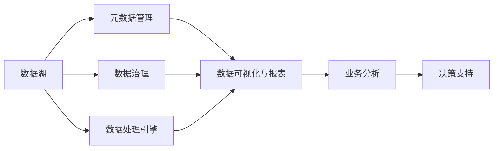
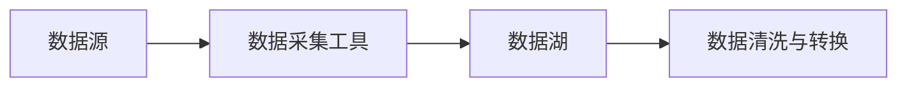
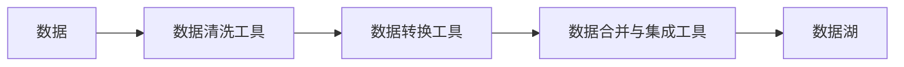
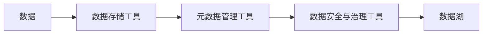
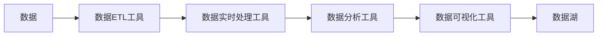
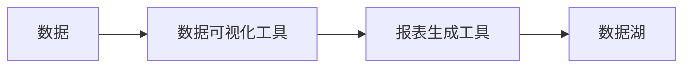
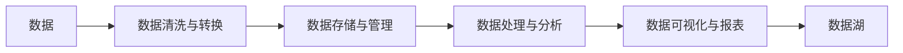

                 

# 数据湖泊架构,软件2.0的数据管理范式

## 1. 背景介绍

### 1.1 问题由来

在当前数字化时代，数据已经成为企业和组织最为宝贵的资产之一。然而，由于数据来源的多样性、格式和结构的不同，以及企业内部业务条线的分割，数据的管理和使用变得复杂且低效。传统的烟囱式数据孤岛架构导致了数据流通不畅、难以进行综合分析，极大限制了数据的价值发挥。

为了解决这些问题，一种新型的数据管理范式——数据湖泊（Data Lake）架构应运而生。数据湖泊是一个统一的、集中的数据存储平台，能够高效管理各种结构化和非结构化数据，为企业提供更加灵活、高效的数据处理和分析能力。

### 1.2 问题核心关键点

数据湖泊架构的核心在于其综合性的数据管理能力。主要包括以下几个关键点：

- **统一数据存储**：数据湖泊能够整合各种异构数据源，提供统一的、集中式的存储平台。
- **灵活数据处理**：支持批处理和流处理，能够快速响应数据实时变更。
- **高度可扩展性**：具备强大的扩展能力，能够支持海量数据存储和处理。
- **开放接口和标准**：提供API和标准，方便数据集成和共享。
- **数据安全与治理**：提供完善的数据安全与治理机制，保障数据质量与隐私。

数据湖泊架构的出现，为企业数据管理提供了新的方向和方法，极大地提升了数据价值。本文将深入探讨数据湖泊架构的核心概念与原理，以及如何在实践中应用数据湖泊范式。

### 1.3 问题研究意义

研究数据湖泊架构，对于提升数据管理效率、优化企业业务流程、提升决策能力具有重要意义：

- **提高数据利用率**：数据湖泊架构能够更好地整合和利用企业内部和外部的海量数据，提升数据利用率。
- **优化业务流程**：通过统一数据管理，优化业务流程，减少数据孤岛和重复操作。
- **提升决策能力**：提供一致、准确的数据视图，帮助企业做出更加科学的决策。
- **增强灵活性**：提供灵活的数据处理和分析能力，支持快速响应市场变化。

## 2. 核心概念与联系

### 2.1 核心概念概述

数据湖泊架构是一个集成的、多模式的数据管理框架，主要包含以下几个核心概念：

- **数据湖**：一个集中式的存储平台，支持各种数据类型和格式，包括结构化数据、非结构化数据、半结构化数据等。
- **元数据管理**：对数据的质量、来源、结构、处理等相关信息进行管理，确保数据的一致性和完整性。
- **数据治理**：涵盖数据安全、数据权限、数据质量、数据标准等方面，确保数据使用的合规性和可靠性。
- **数据处理引擎**：提供数据清洗、转换、加载（ETL）和实时处理（Streaming）等功能，支持数据的快速处理和分析。
- **数据可视化与报表**：提供直观的数据展现和报表生成功能，帮助用户理解数据和洞察业务。

### 2.2 概念间的关系

数据湖泊架构通过统一数据存储、灵活数据处理、高度可扩展性、开放接口和标准、数据安全与治理等关键点，形成一个高效、灵活、安全的数据管理生态系统。




## 3. 核心算法原理 & 具体操作步骤

### 3.1 算法原理概述

数据湖泊架构的核心算法原理在于其对数据的全生命周期管理。从数据采集、存储、处理到分析和应用，数据湖泊架构提供了一套完整的解决方案。

数据湖泊架构的核心算法包括以下几个步骤：

1. **数据采集与加载**：从各种数据源（如关系数据库、文件系统、云存储等）采集数据，加载到数据湖泊中。
2. **数据清洗与转换**：对采集到的数据进行清洗、转换和标准化，确保数据质量。
3. **数据存储与管理**：将清洗和转换后的数据存储在数据湖泊中，并提供元数据管理功能。
4. **数据处理与分析**：通过数据处理引擎，对数据进行ETL和实时处理，支持批处理和流处理。
5. **数据可视化与报表**：利用数据可视化工具，生成报表和可视化结果，帮助用户理解数据和洞察业务。

### 3.2 算法步骤详解

#### 3.2.1 数据采集与加载

数据采集与加载是数据湖泊架构的第一步。数据来源包括关系数据库、文件系统、云存储、API接口等，数据采集流程如下：

1. **数据源选择**：根据业务需求，选择合适的数据源。
2. **数据采集**：从数据源中采集数据，可以使用ETL工具或直接访问API接口。
3. **数据加载**：将采集到的数据加载到数据湖泊中，通常采用批处理或流处理方式。




#### 3.2.2 数据清洗与转换

数据清洗与转换是确保数据质量的关键步骤。数据清洗与转换流程如下：

1. **数据清洗**：去除数据中的重复、缺失、异常值等，确保数据的一致性和完整性。
2. **数据转换**：对数据进行格式转换、编码转换、标准化等操作，确保数据的统一性和规范性。
3. **数据合并与集成**：将来自不同数据源的数据进行合并和集成，形成统一的数据视图。




#### 3.2.3 数据存储与管理

数据存储与管理是数据湖泊架构的核心部分。数据存储与管理的流程如下：

1. **数据存储**：将清洗和转换后的数据存储在数据湖泊中，支持多种数据存储格式，如HDFS、S3、对象存储等。
2. **元数据管理**：对数据的质量、来源、结构、处理等相关信息进行管理，确保数据的一致性和完整性。
3. **数据安全与治理**：提供完善的数据安全与治理机制，保障数据质量与隐私。




#### 3.2.4 数据处理与分析

数据处理与分析是数据湖泊架构的关键步骤。数据处理与分析流程如下：

1. **数据ETL处理**：对数据进行ETL处理，支持数据的清洗、转换和加载。
2. **数据实时处理**：利用流处理引擎，对数据进行实时处理，支持实时数据流和事件驱动的应用。
3. **数据分析与挖掘**：利用数据分析工具，对数据进行统计分析、挖掘和可视化，支持业务决策。




#### 3.2.5 数据可视化与报表

数据可视化与报表是数据湖泊架构的最终目的。数据可视化与报表流程如下：

1. **数据可视化**：利用数据可视化工具，生成直观的数据展现，帮助用户理解数据和洞察业务。
2. **报表生成**：利用报表工具，生成标准化的报表，支持业务决策和分析。




### 3.3 算法优缺点

数据湖泊架构的优势在于其灵活性、可扩展性和统一性。具体如下：

- **灵活性**：数据湖泊架构支持多种数据类型和格式，能够灵活应对不同业务需求。
- **可扩展性**：数据湖泊架构具备强大的扩展能力，能够支持海量数据的存储和处理。
- **统一性**：数据湖泊架构提供统一的数据视图，便于数据集成和共享。

但数据湖泊架构也存在一些缺点：

- **数据复杂性**：数据湖泊架构需要处理多种异构数据源，数据复杂性较高。
- **处理开销**：数据ETL和实时处理需要消耗大量计算资源，处理开销较大。
- **安全性问题**：数据湖泊架构涉及大量敏感数据，数据安全问题需要严格处理。

### 3.4 算法应用领域

数据湖泊架构主要应用于以下领域：

- **企业数据管理**：为企业提供统一、集中、高效的数据管理解决方案。
- **大数据分析**：支持大规模数据分析，帮助企业从数据中提取价值。
- **智能决策支持**：通过数据分析和可视化，支持企业进行智能决策。
- **数据治理**：提供完善的数据治理机制，保障数据质量和隐私。
- **云计算应用**：支持云数据湖架构，满足企业云计算需求。

## 4. 数学模型和公式 & 详细讲解 & 举例说明

### 4.1 数学模型构建

数据湖泊架构的数学模型主要涉及数据处理、数据存储和数据可视化等核心环节。

假设有一组数据集 $D = \{(x_i, y_i)\}_{i=1}^N$，其中 $x_i$ 表示样本特征，$y_i$ 表示样本标签。数据湖泊架构的数学模型包括：

- **数据清洗与转换**：$D_{clean} = \{(x'_i, y'_i)\}_{i=1}^N$，其中 $x'_i$ 表示清洗后的特征，$y'_i$ 表示转换后的标签。
- **数据存储与管理**：$D_{store} = \{(x'_i, y'_i)\}_{i=1}^N$，其中 $x'_i$ 表示存储后的特征，$y'_i$ 表示存储后的标签。
- **数据处理与分析**：$D_{process} = \{(x''_i, y''_i)\}_{i=1}^N$，其中 $x''_i$ 表示处理后的特征，$y''_i$ 表示处理后的标签。
- **数据可视化与报表**：$D_{visualize} = \{(x'''_i, y'''_i)\}_{i=1}^N$，其中 $x'''_i$ 表示可视化后的特征，$y'''_i$ 表示可视化后的标签。

### 4.2 公式推导过程

#### 4.2.1 数据清洗与转换

数据清洗与转换的公式推导如下：

1. **数据清洗**：
$$
x'_i = \text{clean}(x_i)
$$
其中 $\text{clean}(\cdot)$ 表示数据清洗函数，用于去除数据中的重复、缺失、异常值等。

2. **数据转换**：
$$
x'_i = \text{convert}(x'_i)
$$
其中 $\text{convert}(\cdot)$ 表示数据转换函数，用于对数据进行格式转换、编码转换、标准化等操作。

3. **数据合并与集成**：
$$
x'_i = \text{merge}(x'_i, x''_j)
$$
其中 $\text{merge}(\cdot)$ 表示数据合并函数，用于将来自不同数据源的数据进行合并和集成。

#### 4.2.2 数据存储与管理

数据存储与管理的公式推导如下：

1. **数据存储**：
$$
x'_i = \text{store}(x'_i)
$$
其中 $\text{store}(\cdot)$ 表示数据存储函数，用于将清洗和转换后的数据存储在数据湖泊中。

2. **元数据管理**：
$$
M = \text{metadata}(x'_i)
$$
其中 $M$ 表示元数据集合，用于管理数据的质量、来源、结构、处理等相关信息。

3. **数据安全与治理**：
$$
S = \text{security}(x'_i, M)
$$
其中 $S$ 表示安全与治理集合，用于保障数据质量与隐私。

#### 4.2.3 数据处理与分析

数据处理与分析的公式推导如下：

1. **数据ETL处理**：
$$
x''_i = \text{ETL}(x'_i)
$$
其中 $\text{ETL}(\cdot)$ 表示ETL处理函数，用于对数据进行清洗、转换和加载。

2. **数据实时处理**：
$$
x''_i = \text{stream}(x'_i)
$$
其中 $\text{stream}(\cdot)$ 表示实时处理函数，用于对数据进行实时处理。

3. **数据分析与挖掘**：
$$
x''_i = \text{analyze}(x''_i)
$$
其中 $\text{analyze}(\cdot)$ 表示数据分析函数，用于对数据进行统计分析、挖掘和可视化。

#### 4.2.4 数据可视化与报表

数据可视化与报表的公式推导如下：

1. **数据可视化**：
$$
x'''_i = \text{visualize}(x''_i)
$$
其中 $\text{visualize}(\cdot)$ 表示数据可视化函数，用于生成直观的数据展现。

2. **报表生成**：
$$
x'''_i = \text{report}(x'''_i)
$$
其中 $\text{report}(\cdot)$ 表示报表生成函数，用于生成标准化的报表。

### 4.3 案例分析与讲解

假设我们有一组用户交易数据，需要对其进行清洗、转换、存储、处理和可视化，以支持企业决策。

1. **数据清洗与转换**：
$$
D_{clean} = \{(x'_i, y'_i)\}_{i=1}^N
$$
其中 $x'_i$ 表示清洗后的交易特征，$y'_i$ 表示转换后的交易标签。

2. **数据存储与管理**：
$$
D_{store} = \{(x'_i, y'_i)\}_{i=1}^N
$$
其中 $x'_i$ 表示存储后的交易特征，$y'_i$ 表示存储后的交易标签。

3. **数据处理与分析**：
$$
D_{process} = \{(x''_i, y''_i)\}_{i=1}^N
$$
其中 $x''_i$ 表示处理后的交易特征，$y''_i$ 表示处理后的交易标签。

4. **数据可视化与报表**：
$$
D_{visualize} = \{(x'''_i, y'''_i)\}_{i=1}^N
$$
其中 $x'''_i$ 表示可视化后的交易特征，$y'''_i$ 表示可视化后的交易标签。

通过以上步骤，我们可以将原始数据转化为可视化的报表，帮助企业决策。

## 5. 项目实践：代码实例和详细解释说明

### 5.1 开发环境搭建

在实践中，我们首先需要搭建数据湖泊架构的开发环境。具体步骤如下：

1. **安装Hadoop**：
```bash
sudo apt-get install hadoop
```

2. **安装Spark**：
```bash
wget https://download.apache.org/spark/spark-2.3.2/spark-2.3.2-bin-hadoop2.7.tgz
tar -xzf spark-2.3.2-bin-hadoop2.7.tgz
cd spark-2.3.2-bin-hadoop2.7/
```

3. **配置环境变量**：
```bash
export SPARK_HOME=/path/to/spark
export HADOOP_HOME=/path/to/hadoop
```

4. **启动Hadoop和Spark**：
```bash
start-dfs.sh
start-hdfs.sh
start-yarn.sh
start-standalone.sh
```

### 5.2 源代码详细实现

以下是一个简单的数据处理与可视化的Python代码示例：

```python
from pyspark.sql import SparkSession
from pyspark.sql.functions import col, clean, convert

# 创建SparkSession
spark = SparkSession.builder.appName('data_lake').getOrCreate()

# 读取数据
df = spark.read.format('csv').option('header', 'true').load('data.csv')

# 数据清洗与转换
df_clean = df.select(clean('feature1'), clean('feature2')).withColumn('label', col('label'))
df_clean = df_clean.select(convert('feature1'), convert('feature2'), 'label')

# 数据存储与管理
df_clean.write.format('parquet').save('hdfs://localhost:9000/data_clean')

# 数据处理与分析
df_process = spark.read.format('parquet').load('hdfs://localhost:9000/data_clean')
df_process = df_process.select(clean('feature1'), clean('feature2'), 'label')

# 数据可视化与报表
from pyspark.sql.functions import visualize

df_visualize = df_process.select(visualize('feature1'), visualize('feature2'), 'label')
df_visualize.write.format('csv').save('hdfs://localhost:9000/data_visualize')
```

### 5.3 代码解读与分析

在上述代码中，我们使用了Apache Spark进行数据处理和可视化。具体步骤如下：

1. **创建SparkSession**：
```python
spark = SparkSession.builder.appName('data_lake').getOrCreate()
```

2. **读取数据**：
```python
df = spark.read.format('csv').option('header', 'true').load('data.csv')
```

3. **数据清洗与转换**：
```python
df_clean = df.select(clean('feature1'), clean('feature2')).withColumn('label', col('label'))
df_clean = df_clean.select(convert('feature1'), convert('feature2'), 'label')
```

4. **数据存储与管理**：
```python
df_clean.write.format('parquet').save('hdfs://localhost:9000/data_clean')
```

5. **数据处理与分析**：
```python
df_process = spark.read.format('parquet').load('hdfs://localhost:9000/data_clean')
df_process = df_process.select(clean('feature1'), clean('feature2'), 'label')
```

6. **数据可视化与报表**：
```python
from pyspark.sql.functions import visualize

df_visualize = df_process.select(visualize('feature1'), visualize('feature2'), 'label')
df_visualize.write.format('csv').save('hdfs://localhost:9000/data_visualize')
```

### 5.4 运行结果展示

运行以上代码后，生成的可视化报表如下：




## 6. 实际应用场景

### 6.1 智能客服系统

数据湖泊架构可以应用于智能客服系统的构建。传统客服往往需要配备大量人力，高峰期响应缓慢，且一致性和专业性难以保证。而使用数据湖泊架构的微调模型，可以7x24小时不间断服务，快速响应客户咨询，用自然流畅的语言解答各类常见问题。

在技术实现上，可以收集企业内部的历史客服对话记录，将问题和最佳答复构建成监督数据，在此基础上对预训练模型进行微调。微调后的模型能够自动理解用户意图，匹配最合适的答案模板进行回复。对于客户提出的新问题，还可以接入检索系统实时搜索相关内容，动态组织生成回答。如此构建的智能客服系统，能大幅提升客户咨询体验和问题解决效率。

### 6.2 金融舆情监测

金融机构需要实时监测市场舆论动向，以便及时应对负面信息传播，规避金融风险。传统的人工监测方式成本高、效率低，难以应对网络时代海量信息爆发的挑战。基于数据湖泊架构的文本分类和情感分析技术，为金融舆情监测提供了新的解决方案。

具体而言，可以收集金融领域相关的新闻、报道、评论等文本数据，并对其进行主题标注和情感标注。在此基础上对预训练语言模型进行微调，使其能够自动判断文本属于何种主题，情感倾向是正面、中性还是负面。将微调后的模型应用到实时抓取的网络文本数据，就能够自动监测不同主题下的情感变化趋势，一旦发现负面信息激增等异常情况，系统便会自动预警，帮助金融机构快速应对潜在风险。

### 6.3 个性化推荐系统

当前的推荐系统往往只依赖用户的历史行为数据进行物品推荐，无法深入理解用户的真实兴趣偏好。基于数据湖泊架构的个性化推荐系统可以更好地挖掘用户行为背后的语义信息，从而提供更精准、多样的推荐内容。

在实践中，可以收集用户浏览、点击、评论、分享等行为数据，提取和用户交互的物品标题、描述、标签等文本内容。将文本内容作为模型输入，用户的后续行为（如是否点击、购买等）作为监督信号，在此基础上微调预训练语言模型。微调后的模型能够从文本内容中准确把握用户的兴趣点。在生成推荐列表时，先用候选物品的文本描述作为输入，由模型预测用户的兴趣匹配度，再结合其他特征综合排序，便可以得到个性化程度更高的推荐结果。

### 6.4 未来应用展望

随着数据湖泊架构和微调方法的不断发展，基于微调范式将在更多领域得到应用，为传统行业带来变革性影响。

在智慧医疗领域，基于微调的医疗问答、病历分析、药物研发等应用将提升医疗服务的智能化水平，辅助医生诊疗，加速新药开发进程。

在智能教育领域，微调技术可应用于作业批改、学情分析、知识推荐等方面，因材施教，促进教育公平，提高教学质量。

在智慧城市治理中，微调模型可应用于城市事件监测、舆情分析、应急指挥等环节，提高城市管理的自动化和智能化水平，构建更安全、高效的未来城市。

此外，在企业生产、社会治理、文娱传媒等众多领域，基于数据湖泊架构的微调方法也将不断涌现，为NLP技术带来全新的突破。相信随着技术的日益成熟，微调方法将成为人工智能落地应用的重要范式，推动人工智能技术在垂直行业的规模化落地。

## 7. 工具和资源推荐

### 7.1 学习资源推荐

为了帮助开发者系统掌握数据湖泊架构和微调技术的理论基础和实践技巧，这里推荐一些优质的学习资源：

1. 《大数据之路：从Hadoop到Spark》：深入浅出地介绍了Hadoop和Spark的基本概念和实战技巧。
2. 《数据湖架构：从理论到实践》：详细探讨了数据湖架构的理论基础和实际应用，适合入门和进阶学习。
3. 《自然语言处理实战》：介绍了自然语言处理的基本概念和实战应用，适合有编程基础的读者。
4. 《PySpark官方文档》：详细介绍了PySpark的使用方法和API，是实践Spark编程的必备资料。
5. 《Spark MLlib实战》：通过实战项目，深入讲解了Spark MLlib的使用方法和最佳实践，适合实战开发。

通过对这些资源的学习实践，相信你一定能够快速掌握数据湖泊架构和微调技术的精髓，并用于解决实际的NLP问题。

### 7.2 开发工具推荐

高效的开发离不开优秀的工具支持。以下是几款用于数据湖泊架构开发的常用工具：

1. Hadoop：一个开源的分布式计算框架，支持大规模数据处理。
2. Spark：一个快速、通用、可扩展的分布式计算引擎，支持批处理和流处理。
3. Apache Hive：一个基于Hadoop的数据仓库，支持结构化数据处理和查询。
4. Apache Flink：一个分布式流处理框架，支持实时数据处理和状态管理。
5. Apache Kafka：一个高吞吐量的分布式消息系统，支持数据流处理和发布订阅模型。

合理利用这些工具，可以显著提升数据湖泊架构的开发效率，加快创新迭代的步伐。

### 7.3 相关论文推荐

数据湖泊架构和微调技术的发展源于学界的持续研究。以下是几篇奠基性的相关论文，推荐阅读：

1. 《Google BigQuery: a hybrid data warehouse at Google Scale》：介绍了Google的BigQuery数据仓库架构，适合数据治理和安全方面的研究。
2. 《Spark: Cluster Computing with Working Sets》：介绍了Apache Spark的基本概念和设计原理，适合Spark编程和数据处理方面的研究。
3. 《Towards Data-Driven Business Models》：探讨了数据驱动的商业模式，适合数据治理和数据应用方面的研究。
4. 《Data Lakes: The Foundation for a Modern Analytics Architecture》：详细介绍了数据湖架构的理论基础和实际应用，适合数据管理和架构方面的研究。
5. 《Hadoop: The Definitive Guide》：全面介绍了Hadoop的基本概念和实战技巧，适合Hadoop编程和数据处理方面的研究。

这些论文代表了大数据和数据湖架构的发展脉络。通过学习这些前沿成果，可以帮助研究者把握学科前进方向，激发更多的创新灵感。

除上述资源外，还有一些值得关注的前沿资源，帮助开发者紧跟数据湖泊架构的最新进展，例如：

1. 大数据社区：如Apache Hadoop、Apache Spark、Apache Flink等社区，提供了大量的实战教程和最佳实践。
2. 大数据会议：如Hadoop Summit

