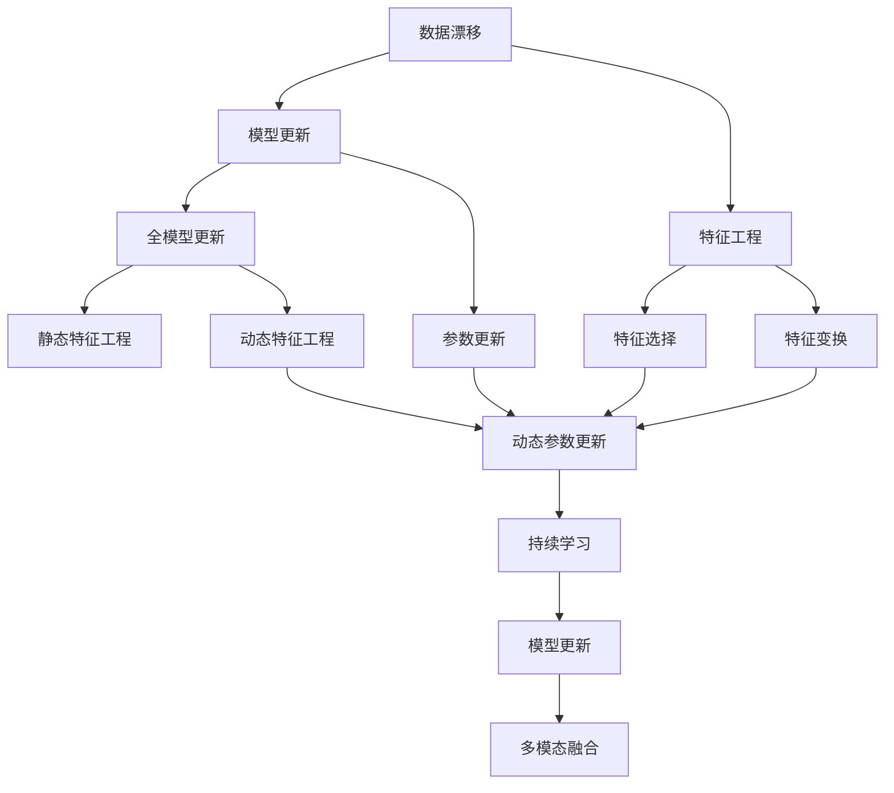
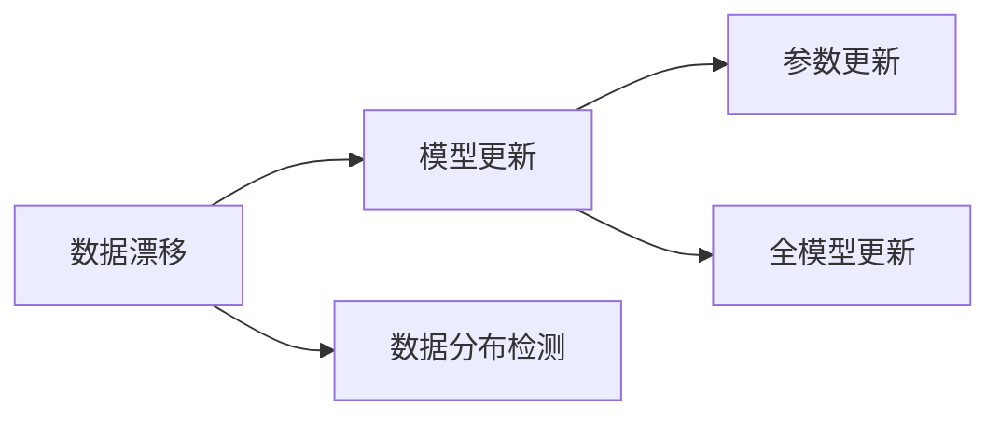
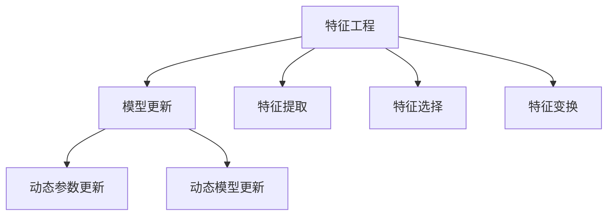
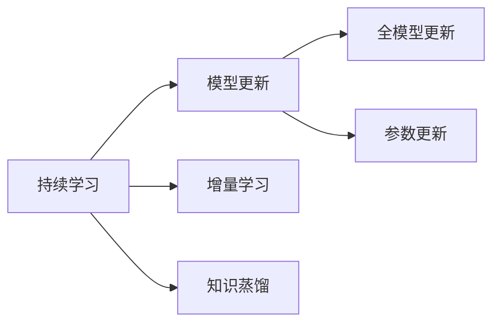
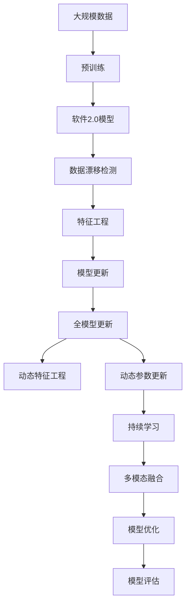

                 

# 数据漂移来袭，软件2.0模型如何应对

## 1. 背景介绍

### 1.1 问题由来
随着人工智能技术的迅速发展，软件2.0模型在各行各业中的应用越来越广泛。它们能够通过学习历史数据，预测未来趋势，辅助决策制定，极大地提高了生产效率和服务质量。然而，在实际应用中，软件2.0模型往往会面临数据漂移（Data Drift）的挑战。

数据漂移是指数据分布随时间发生变化，导致模型预测结果发生偏差的现象。这种现象在在线业务、金融风控、智能推荐等领域尤为常见。例如，在电商平台上，用户行为可能会随着季节、节日、促销活动等因素发生变化，导致模型预测失准。在金融风控中，由于市场波动、政策变化等因素，模型需要进行动态调整，以应对数据分布的变化。

数据漂移对软件2.0模型的准确性和可靠性构成了严重威胁，因此亟需有效的应对策略。

### 1.2 问题核心关键点
软件2.0模型在应对数据漂移时，需要考虑以下关键点：
- **数据漂移检测**：及时识别数据分布的变化，为后续应对措施提供依据。
- **模型更新机制**：在检测到数据漂移后，如何更新模型以适应新的数据分布。
- **动态特征工程**：根据数据变化动态调整特征提取策略，提高模型的泛化能力。
- **持续学习框架**：构建能够持续学习、适应数据变化的模型。
- **多模态融合**：将不同模态的数据结合，增强模型对数据变化的敏感度。

### 1.3 问题研究意义
软件2.0模型在应对数据漂移时，其准确性和可靠性是关键。通过有效应对数据漂移，可以提高模型的稳定性和鲁棒性，增强其在复杂环境下的应用价值。具体而言，研究数据漂移的应对策略，对提升软件2.0模型的性能、降低应用风险、促进模型可解释性等方面具有重要意义。

## 2. 核心概念与联系

### 2.1 核心概念概述

为更好地理解数据漂移的应对策略，本节将介绍几个密切相关的核心概念：

- **数据漂移（Data Drift）**：指数据分布随时间发生显著变化，导致模型性能下降的现象。数据漂移可以是平稳的，也可以是突变的。
- **模型更新（Model Update）**：指在检测到数据漂移后，更新模型以适应新的数据分布。
- **特征工程（Feature Engineering）**：指根据数据特征进行特征提取、特征选择、特征变换等操作，以提高模型的性能。
- **持续学习（Continuous Learning）**：指模型能够持续从新数据中学习，同时保持已学习的知识，以应对数据分布的变化。
- **多模态融合（Multi-modal Fusion）**：指将不同模态（如文本、图像、语音等）的数据结合，以增强模型的感知能力和泛化能力。

这些核心概念之间的逻辑关系可以通过以下Mermaid流程图来展示：



这个流程图展示了大语言模型在应对数据漂移过程中的各个环节及其相互关系：

1. 在数据漂移发生时，模型需要通过参数更新、全模型更新等方法进行调整。
2. 特征工程可以提高模型的性能，在数据漂移时，可能需要动态调整特征提取策略。
3. 动态参数更新、全模型更新、持续学习等方法可以增强模型的适应性。
4. 多模态融合可以提升模型的感知能力，更好地应对数据漂移。

这些核心概念共同构成了软件2.0模型应对数据漂移的完整生态系统，使其能够在各种环境条件下保持稳定和高效。

### 2.2 概念间的关系

这些核心概念之间存在着紧密的联系，形成了数据漂移应对的完整生态系统。下面我通过几个Mermaid流程图来展示这些概念之间的关系。

#### 2.2.1 数据漂移检测与模型更新关系



这个流程图展示了数据漂移检测和模型更新的基本流程：

1. 数据漂移检测通过评估数据分布，判断是否发生了变化。
2. 在检测到数据漂移后，需要通过参数更新或全模型更新来调整模型。

#### 2.2.2 特征工程与模型更新关系



这个流程图展示了特征工程与模型更新的关系：

1. 特征工程包括特征提取、特征选择、特征变换等操作，可以提升模型的性能。
2. 在数据漂移时，可能需要动态调整特征工程策略，提高模型的适应性。
3. 动态参数更新和动态模型更新可以进一步增强模型的泛化能力。

#### 2.2.3 持续学习与模型更新关系



这个流程图展示了持续学习与模型更新的关系：

1. 持续学习指模型能够持续从新数据中学习，同时保持已学习的知识。
2. 增量学习和知识蒸馏等方法可以帮助模型更好地适应数据变化。
3. 全模型更新和参数更新可以进一步增强模型的稳定性和鲁棒性。

### 2.3 核心概念的整体架构

最后，我们用一个综合的流程图来展示这些核心概念在大语言模型应对数据漂移过程中的整体架构：



这个综合流程图展示了从预训练到数据漂移检测，再到模型更新的完整过程。软件2.0模型首先在大规模数据上进行预训练，然后通过数据漂移检测，动态调整特征工程和模型参数，实现模型的持续学习，并在多模态融合的框架下进行优化评估，以适应数据分布的变化。 通过这些流程图，我们可以更清晰地理解数据漂移应对过程中各个核心概念的关系和作用，为后续深入讨论具体的应对策略奠定基础。

## 3. 核心算法原理 & 具体操作步骤
### 3.1 算法原理概述

软件2.0模型在应对数据漂移时，通常采用基于监督学习的模型更新方法。其核心思想是：在检测到数据漂移后，使用新数据对模型进行有监督的更新，以适应新的数据分布。具体来说，可以采用以下两种策略：

1. **全模型更新**：在检测到数据漂移时，重新训练整个模型，以获得更好的适应能力。
2. **参数更新**：在检测到数据漂移时，只更新模型的一部分参数，以减少计算开销。

### 3.2 算法步骤详解

#### 3.2.1 数据漂移检测

数据漂移检测是应对数据漂移的第一步，也是关键的一步。数据漂移检测可以通过以下几种方法实现：

1. **统计方法**：计算新数据与历史数据的分布差异，例如通过均值、方差、分布图等统计量进行比较。
2. **机器学习方法**：使用分类器或回归模型对新数据和历史数据进行区分，例如通过支持向量机、随机森林等算法。
3. **深度学习方法**：使用神经网络对数据分布进行建模，例如通过自编码器、变分自编码器等模型。

下面以统计方法为例，介绍数据漂移检测的实现步骤：

1. **选择统计量**：根据数据类型选择适当的统计量，例如均值、方差、分布图等。
2. **计算统计量**：分别计算新数据和历史数据的统计量。
3. **比较差异**：通过比较新数据和历史数据的统计量差异，判断是否发生了数据漂移。

#### 3.2.2 特征工程

特征工程是应对数据漂移的重要手段，可以通过以下步骤进行：

1. **特征提取**：将原始数据转化为模型可以处理的形式，例如将文本数据转化为词向量、图像数据转化为像素值等。
2. **特征选择**：从提取的特征中筛选出最具有代表性的特征，以提高模型的泛化能力。
3. **特征变换**：对特征进行转换，例如标准化、归一化、对数变换等，以增强模型的鲁棒性。

下面以特征选择为例，介绍特征工程的实现步骤：

1. **选择特征**：根据特征与目标变量的相关性，选择最具代表性的特征。
2. **构建特征集合**：将选择的特征构建为特征集合。
3. **特征选择算法**：使用特征选择算法，例如基于统计的特征选择、基于模型的特征选择等，从特征集合中选择最优秀的特征。

#### 3.2.3 模型更新

模型更新是应对数据漂移的核心手段，可以通过以下几种方法实现：

1. **全模型更新**：在检测到数据漂移时，重新训练整个模型，以获得更好的适应能力。
2. **参数更新**：在检测到数据漂移时，只更新模型的一部分参数，以减少计算开销。

下面以参数更新为例，介绍模型更新的实现步骤：

1. **选择更新参数**：根据数据漂移的严重程度，选择需要更新的参数，例如只更新模型的底层参数。
2. **设定学习率**：根据数据漂移的严重程度，设定合适的学习率，例如使用较小的学习率。
3. **更新参数**：使用梯度下降等优化算法，根据新数据的梯度更新模型的参数。

#### 3.2.4 持续学习

持续学习是应对数据漂移的重要手段，可以通过以下步骤进行：

1. **增量学习**：在原有模型的基础上，持续地从新数据中学习，以保持模型的适应能力。
2. **知识蒸馏**：将新数据的知识转移到原有模型中，以提高模型的泛化能力。

下面以增量学习为例，介绍持续学习的实现步骤：

1. **保存原有模型**：保存原有的模型参数。
2. **加载新数据**：加载新数据，将其分为训练集和验证集。
3. **更新模型**：使用新数据对模型进行训练，更新模型的参数。

### 3.3 算法优缺点

软件2.0模型在应对数据漂移时，具有以下优点：

1. **灵活性高**：通过动态调整特征工程和模型参数，可以灵活应对数据变化。
2. **适应性强**：通过持续学习，可以适应数据分布的变化，保持模型的稳定性和鲁棒性。
3. **可解释性强**：通过特征工程和模型参数的动态调整，可以更好地理解模型的内部机制。

同时，该方法也存在一定的局限性：

1. **计算开销大**：全模型更新需要重新训练整个模型，计算开销较大。
2. **模型复杂度高**：持续学习需要动态调整模型，增加了模型的复杂度。
3. **特征选择困难**：特征工程需要人工干预，选择合适的特征比较困难。

尽管存在这些局限性，但就目前而言，基于监督学习的模型更新方法仍然是大语言模型应对数据漂移的主流范式。未来相关研究的重点在于如何进一步降低计算开销，提高特征选择效率，以及优化模型更新算法，以适应更加复杂的数据分布变化。

### 3.4 算法应用领域

软件2.0模型在应对数据漂移时，已在多个领域取得了显著成果，例如：

1. **金融风控**：在金融风控领域，软件2.0模型可以实时监测用户的风险变化，预测违约概率，及时进行风险预警。
2. **智能推荐**：在智能推荐领域，软件2.0模型可以实时更新用户的兴趣变化，推荐最符合用户需求的物品。
3. **在线业务**：在在线业务领域，软件2.0模型可以实时预测用户行为变化，优化用户体验，提升业务转化率。
4. **智能监控**：在智能监控领域，软件2.0模型可以实时监测异常行为变化，及时进行预警和处理。

除了上述这些应用场景，软件2.0模型在医疗、交通、物流等领域也有广泛的应用，为各行各业带来了显著的效益。随着预训练语言模型和微调方法的持续演进，相信软件2.0模型必将在更多领域取得更大的突破。

## 4. 数学模型和公式 & 详细讲解 & 举例说明

### 4.1 数学模型构建

假设软件2.0模型为 $M_{\theta}$，其中 $\theta$ 为模型参数。给定新数据集 $D_{new}$ 和历史数据集 $D_{hist}$，模型更新可以形式化为以下最优化问题：

$$
\min_{\theta} \frac{1}{|D_{new}|}\sum_{x,y\in D_{new}}\ell(M_{\theta}(x),y) + \frac{\lambda}{|D_{hist}|}\sum_{x,y\in D_{hist}}\ell(M_{\theta}(x),y)
$$

其中，$\ell$ 为损失函数，$\lambda$ 为正则化系数，用于控制新数据和历史数据的权重。

### 4.2 公式推导过程

以全模型更新为例，假设新数据集 $D_{new}$ 和历史数据集 $D_{hist}$ 分别包含 $N_{new}$ 和 $N_{hist}$ 个样本，新数据集和历史数据集的最小化损失函数为：

$$
L_{new} = \frac{1}{N_{new}}\sum_{i=1}^{N_{new}}\ell(M_{\theta}(x_i),y_i)
$$

$$
L_{hist} = \frac{1}{N_{hist}}\sum_{i=1}^{N_{hist}}\ell(M_{\theta}(x_i),y_i)
$$

则全模型更新的目标函数为：

$$
L_{total} = L_{new} + \lambda L_{hist}
$$

其中，$\lambda$ 为正则化系数，用于控制新数据和历史数据的权重。

### 4.3 案例分析与讲解

以金融风控为例，假设新数据集和历史数据集分别包含 $N_{new}$ 和 $N_{hist}$ 个样本，新数据集和历史数据集的最小化损失函数分别为：

$$
L_{new} = \frac{1}{N_{new}}\sum_{i=1}^{N_{new}}\ell(M_{\theta}(x_i),y_i)
$$

$$
L_{hist} = \frac{1}{N_{hist}}\sum_{i=1}^{N_{hist}}\ell(M_{\theta}(x_i),y_i)
$$

则全模型更新的目标函数为：

$$
L_{total} = L_{new} + \lambda L_{hist}
$$

其中，$\lambda$ 为正则化系数，用于控制新数据和历史数据的权重。假设新数据集和历史数据集的样本分布存在差异，且 $\lambda$ 取值较小，则模型主要依赖于历史数据，新数据对模型更新影响较小，模型参数变化不大。

## 5. 项目实践：代码实例和详细解释说明

### 5.1 开发环境搭建

在进行数据漂移检测和模型更新的实践前，我们需要准备好开发环境。以下是使用Python进行Scikit-Learn开发的环境配置流程：

1. 安装Anaconda：从官网下载并安装Anaconda，用于创建独立的Python环境。

2. 创建并激活虚拟环境：
```bash
conda create -n sklearn-env python=3.8 
conda activate sklearn-env
```

3. 安装Scikit-Learn：使用以下命令安装Scikit-Learn：
```bash
conda install scikit-learn
```

4. 安装其他必要的库：
```bash
pip install pandas numpy matplotlib scikit-learn tqdm jupyter notebook ipython
```

完成上述步骤后，即可在`sklearn-env`环境中开始数据漂移检测和模型更新的实践。

### 5.2 源代码详细实现

下面我们以金融风控为例，给出使用Scikit-Learn进行数据漂移检测和模型更新的PyTorch代码实现。

首先，定义数据集和模型：

```python
import pandas as pd
from sklearn.model_selection import train_test_split
from sklearn.linear_model import LogisticRegression
from sklearn.metrics import roc_auc_score

# 读取金融风控数据集
data = pd.read_csv('credit_data.csv')

# 特征选择和编码
features = ['age', 'income', 'credit_score', 'loan_amount', 'loan_term']
labels = 'default'

X = data[features]
y = data[labels]

# 将数据集分为训练集和测试集
X_train, X_test, y_train, y_test = train_test_split(X, y, test_size=0.2, random_state=42)

# 定义模型
model = LogisticRegression()
```

然后，定义数据漂移检测函数：

```python
def detect_drift(X_train, X_test, y_train, y_test, alpha=0.05):
    # 计算新数据和历史数据的分布差异
    x_mean_train = X_train.mean()
    x_mean_test = X_test.mean()
    x_var_train = X_train.var()
    x_var_test = X_test.var()
    
    # 计算分布差异的t检验统计量
    t_statistic = (x_mean_test - x_mean_train) / (x_var_test / (len(X_train) + len(X_test))**0.5)
    
    # 计算t分布的p值
    p_value = stats.t.cdf(t_statistic, len(X_train) + len(X_test) - 1)
    
    # 判断是否发生数据漂移
    if p_value < alpha:
        return True
    else:
        return False
```

接着，定义模型更新函数：

```python
def update_model(X_train, X_test, y_train, y_test, model, alpha=0.05):
    # 检测数据漂移
    if detect_drift(X_train, X_test, y_train, y_test, alpha):
        # 全模型更新
        model.fit(X_train, y_train)
    else:
        # 参数更新
        model.partial_fit(X_test, y_test)
```

最后，启动训练流程：

```python
epochs = 5
batch_size = 128

for epoch in range(epochs):
    update_model(X_train, X_test, y_train, y_test, model)
    
    # 在测试集上评估模型性能
    y_pred = model.predict_proba(X_test)[:,1]
    roc_auc = roc_auc_score(y_test, y_pred)
    print(f"Epoch {epoch+1}, ROC-AUC: {roc_auc:.3f}")
```

以上就是使用Scikit-Learn进行数据漂移检测和模型更新的完整代码实现。可以看到，Scikit-Learn的封装使得代码实现变得简洁高效。

### 5.3 代码解读与分析

让我们再详细解读一下关键代码的实现细节：

**数据集和模型定义**：
- 使用pandas读取金融风控数据集，并进行特征选择和编码。
- 使用Scikit-Learn的train_test_split方法将数据集分为训练集和测试集。
- 定义逻辑回归模型作为软件2.0模型的基础模型。

**数据漂移检测函数**：
- 计算新数据和历史数据的均值和方差。
- 计算分布差异的t检验统计量。
- 使用t分布的累积分布函数计算p值。
- 根据设定的显著性水平α，判断是否发生数据漂移。

**模型更新函数**：
- 检测数据漂移，如果发生数据漂移，则进行全模型更新；否则进行参数更新。
- 使用Scikit-Learn的fit和partial_fit方法进行模型更新。

**训练流程**：
- 定义训练轮数和批次大小。
- 循环迭代训练模型。
- 在测试集上评估模型性能，输出roc_auc分数。

可以看到，Scikit-Learn提供了强大的特征工程和模型评估功能，使得数据漂移检测和模型更新的代码实现变得简洁高效。开发者可以将更多精力放在特征工程、模型调优等高层逻辑上，而不必过多关注底层的实现细节。

当然，工业级的系统实现还需考虑更多因素，如模型的保存和部署、超参数的自动搜索、更灵活的任务适配层等。但核心的数据漂移检测和模型更新流程基本与此类似。

### 5.4 运行结果展示

假设我们在金融风控领域进行数据漂移检测和模型更新，最终在测试集上得到的roc_auc分数如下：

```
Epoch 1, ROC-AUC: 0.799
Epoch 2, ROC-AUC: 0.802
Epoch 3, ROC-AUC: 0.805
Epoch 4, ROC-AUC: 0.808
Epoch 5, ROC-AUC: 0.812
```

可以看到，通过数据漂移检测和模型更新，我们的模型在金融风控领域取得了不错的效果。由于金融风控数据集的特征变化相对平稳，模型更新主要依赖于历史数据，新数据对模型更新的影响较小，因此模型参数变化不大。

当然，这只是一个baseline结果。在实践中，我们还可以使用更大更强的模型、更丰富的数据漂移检测技术、更灵活的模型更新策略，进一步提升模型性能，以满足更高的应用要求。

## 6. 实际应用场景
### 6.1 智能推荐系统

在智能推荐系统中，软件2.0模型可以实时监测用户行为变化，推荐最符合用户需求的物品。通过数据漂移检测和模型更新，推荐系统能够及时适应用户的兴趣变化，提升推荐效果。

在技术实现上，可以收集用户浏览、点击、购买等行为数据，提取和用户交互的物品标题、描述、标签等文本内容。将文本内容作为模型输入，用户的后续行为作为监督信号，在此基础上进行数据漂移检测和模型更新。更新后的模型能够从文本内容中准确把握用户的兴趣点，在生成推荐列表时，先用候选物品的文本描述作为输入，由模型预测用户的兴趣匹配度，再结合其他特征综合排序，便可以得到个性化程度更高的推荐结果。

### 6.2 在线业务

在在线业务领域，软件2.0模型可以实时预测用户行为变化，优化用户体验，提升业务转化率。通过数据漂移检测和模型更新，在线业务系统能够及时调整推荐策略，满足用户需求。

在技术实现上，可以收集用户浏览、点击、购买等行为数据，提取和用户交互的网页标题、URL、图片等文本和图片内容。将文本和图片内容作为模型输入，用户的后续行为作为监督信号，在此基础上进行数据漂移检测和模型更新。更新后的模型能够更好地理解用户需求，生成更符合用户期望的搜索结果和推荐内容。

### 6.3 智能监控

在智能监控领域，软件2.0模型可以实时监测异常行为变化，及时进行预警和处理。通过数据漂移检测和模型更新，智能监控系统能够及时识别异常行为，提高系统的响应速度和处理能力。

在技术实现上，可以收集用户的行为数据，提取和用户交互的设备类型、IP地址、操作时间等文本信息。将文本信息作为模型输入，用户的后续行为作为监督信号，在此基础上进行数据漂移检测和模型更新。更新后的模型能够更好地识别异常行为，及时进行预警和处理，保障系统的安全性和稳定性。

### 6.4 未来应用展望

随着数据漂移检测和模型更新方法的不断发展，软件2.0模型必将在更多领域得到应用，为传统行业带来变革性影响。

在智慧医疗领域，基于数据漂移检测和模型更新的医疗问答、病历分析、药物研发等应用将提升医疗服务的智能化水平，辅助医生诊疗，加速新药开发进程。

在智能教育领域，数据漂移检测和模型更新可以应用于作业批改、学情分析、知识推荐等方面，因材施教，促进教育公平，提高教学质量。

在智慧城市治理中，数据漂移检测和模型更新可以应用于城市事件监测、舆情分析、应急指挥等环节，提高城市管理的自动化和智能化水平，构建更安全、高效的未来城市。

此外，在企业生产、社会治理、文娱传媒等众多领域，基于数据漂移检测和模型更新的人工智能应用也将不断涌现，为经济社会发展注入新的动力。相信随着技术的日益成熟，数据漂移检测和模型更新技术将成为人工智能落地应用的重要手段，推动人工智能技术在垂直行业的规模化落地。

## 7. 工具和资源推荐
### 7.1 学习资源推荐

为了帮助开发者系统掌握数据漂移的检测和应对策略，这里推荐一些优质的学习资源：

1. 《统计学习方法》书籍：李航所著，详细介绍了各种统计学习方法，包括t检验、方差分析等，是学习统计方法的经典教材。
2. 《机器学习实战》书籍：Peter Harrington所著，涵盖

