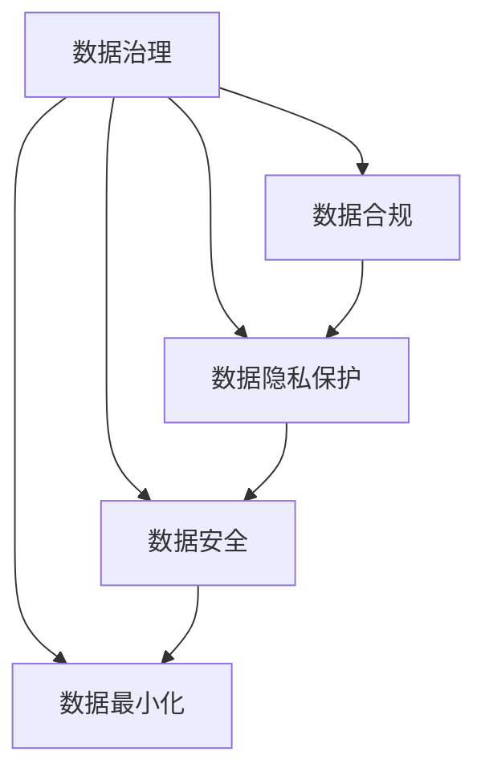

                 

# 数据的伦理：如何平衡数据利用与个人隐私？

> 关键词：数据隐私保护, 数据利用, 数据治理, 数据合规, 数据安全

## 1. 背景介绍

### 1.1 问题由来

随着数据在商业、科研、政府等各个领域的广泛应用，数据利用已经成为了推动社会进步和创新的重要力量。然而，数据利用与个人隐私保护之间的矛盾也日益突出，数据泄露、滥用、非法交易等问题频发，引发了公众和监管机构的高度关注。如何在数据利用的同时，保障个人隐私权益，成为了数据治理的核心挑战。

### 1.2 问题核心关键点

数据伦理的核心在于如何在数据利用与个人隐私保护之间找到平衡。数据利用旨在通过数据获取知识、洞察趋势、驱动决策，而个人隐私保护则要求确保数据不被滥用，保护个人信息安全。具体来说，数据伦理的核心理念包括：

- 透明性：数据收集和利用过程应当公开透明，确保用户知情同意。
- 数据最小化：只收集和利用必要的数据，避免过度收集。
- 匿名化处理：对数据进行匿名化处理，保护个人身份。
- 数据安全：采用严格的安全措施，防止数据泄露和滥用。
- 责任明确：明确数据收集和利用的责任方，确保违规行为可追溯。

这些原则构成了数据伦理的基本框架，旨在指导数据的收集、存储、处理、共享和利用，确保数据利用的公平、公正和透明。

### 1.3 问题研究意义

数据伦理的研究和实践具有重要意义：

1. **促进数据共享与协作**：通过合理的伦理框架，可以消除数据共享中的信任障碍，促进跨组织、跨行业的合作和知识共享。
2. **保障数据安全与隐私**：伦理原则指导数据处理和利用过程，可以有效防止数据滥用和泄露，保护个人隐私权益。
3. **提升决策质量与可信度**：透明、公正的数据利用过程可以提高决策的透明度和可信度，增强社会对数据的信任。
4. **应对监管挑战**：随着各国对数据隐私和安全的法规日益严格，遵循数据伦理原则可以避免法律风险，提升企业的合规性和竞争力。
5. **推动人工智能的道德应用**：数据是人工智能的核心资源，合理的伦理应用可以推动AI技术的健康发展，避免伦理风险。

## 2. 核心概念与联系

### 2.1 核心概念概述

为更好地理解数据伦理与隐私保护，我们首先介绍几个关键概念：

- **数据治理(Data Governance)**：指的是在数据生命周期中，对数据的收集、存储、处理、共享和利用进行规划、实施和监督的全面管理活动。数据治理的目标是确保数据质量、安全性和合规性，支持组织战略目标的实现。
- **数据合规(Data Compliance)**：指的是在数据处理过程中遵循相关的法律法规和行业标准，确保数据处理活动符合法律要求。数据合规的主要目标是避免法律风险，保护组织和个人的合法权益。
- **数据隐私保护(Data Privacy Protection)**：指的是在数据处理和利用过程中，采取技术和组织措施，保护个人信息免受未经授权的访问、使用和披露。数据隐私保护的核心是确保个人数据的安全和隐私。
- **数据安全(Data Security)**：指的是在数据处理和传输过程中，采取必要的技术和物理措施，防止数据被非法访问、篡改和破坏。数据安全的目标是确保数据的完整性和可用性。
- **数据最小化(Data Minimization)**：指的是在数据收集和利用过程中，仅收集和利用必要的数据，避免过度收集和处理。数据最小化的目标是减少数据泄露和滥用的风险。

这些概念相互关联，共同构成了数据伦理的核心框架。以下是一个Mermaid流程图，展示了这些概念之间的关系：



### 2.2 概念间的关系

数据治理、数据合规、数据隐私保护、数据安全、数据最小化等概念之间有着紧密的联系。具体来说：

- **数据治理与数据合规**：数据治理是数据合规的基础，数据合规是数据治理的保障。数据治理通过规划和实施，确保数据合规；数据合规通过监督和审计，推动数据治理的改进。
- **数据隐私保护与数据安全**：数据隐私保护是数据安全的核心，数据安全是数据隐私保护的手段。数据隐私保护通过技术和组织措施，防止数据滥用；数据安全通过技术手段，保护数据的完整性和可用性。
- **数据最小化与数据治理**：数据最小化是数据治理的重要原则，数据治理是数据最小化的保障。数据最小化通过减少数据量，降低数据泄露和滥用的风险；数据治理通过规范数据收集和利用，确保数据最小化的实现。

这些概念之间相互依赖、相互促进，共同构成了数据伦理的完整体系。

## 3. 核心算法原理 & 具体操作步骤

### 3.1 算法原理概述

数据伦理的实现需要结合算法和技术手段，确保数据的合法、合规和合理利用。以下是数据伦理实现的核心算法原理：

1. **数据匿名化(Data Anonymization)**：通过技术手段，将数据中的个人身份信息去除或伪装，防止数据泄露。常见的数据匿名化技术包括数据脱敏、数据泛化等。

2. **差分隐私(Differential Privacy)**：通过在数据处理过程中引入随机噪声，确保个人数据的隐私不被泄露。差分隐私在保护个体隐私的同时，确保整体数据统计信息的可用性。

3. **访问控制(Access Control)**：通过身份验证和权限管理，确保只有授权用户才能访问和使用数据。访问控制通常结合身份认证和审计日志，确保数据访问的透明性和可追溯性。

4. **数据加密(Data Encryption)**：通过加密算法，保护数据在存储和传输过程中的安全。常见的加密算法包括对称加密、非对称加密、哈希加密等。

5. **数据审计(Data Auditing)**：通过技术手段，对数据处理和利用过程进行监督和记录，确保数据处理活动的透明性和合规性。数据审计通常结合日志记录和异常检测，发现和应对潜在的安全威胁。

### 3.2 算法步骤详解

以下是数据伦理实现的具体操作步骤：

1. **数据收集与评估**：
   - 评估数据收集的必要性和合法性，确保数据收集活动符合法律法规要求。
   - 对数据进行分类和标注，识别敏感数据和隐私数据，确保数据处理的透明度和合规性。

2. **数据预处理与匿名化**：
   - 对数据进行清洗和标准化处理，确保数据质量。
   - 对敏感数据和隐私数据进行匿名化处理，如数据脱敏、数据泛化等，保护个人隐私。

3. **数据存储与传输**：
   - 采用加密技术，保护数据在存储和传输过程中的安全。
   - 建立安全的数据存储和传输机制，确保数据访问和传输的透明性和合规性。

4. **数据利用与共享**：
   - 对数据利用活动进行规划和监督，确保数据利用活动的透明性和合规性。
   - 在数据共享过程中，采用差分隐私等技术，保护数据隐私。

5. **数据审计与反馈**：
   - 建立数据审计机制，对数据处理和利用活动进行监督和记录。
   - 根据数据审计结果，反馈和改进数据治理和合规活动，确保数据伦理的持续改进。

### 3.3 算法优缺点

数据伦理实现的算法具有以下优点：

1. **提高数据安全性**：通过加密、访问控制等技术手段，保护数据在存储和传输过程中的安全。
2. **保障数据隐私**：通过匿名化、差分隐私等技术，保护个人隐私，防止数据滥用和泄露。
3. **提升数据利用效率**：通过数据治理和合规活动，确保数据利用活动的合法性和合规性，提高数据利用效率。
4. **增强数据透明度**：通过数据审计和反馈机制，确保数据处理和利用活动的透明性和可追溯性。

同时，数据伦理实现的算法也存在以下缺点：

1. **技术复杂性**：数据匿名化、差分隐私等技术需要较高的技术门槛，对数据处理和利用活动提出了更高的要求。
2. **合规成本高**：合规活动需要投入大量资源和时间，特别是在法规环境复杂的地区，合规成本较高。
3. **数据处理复杂**：在数据处理过程中，需要综合考虑数据收集、存储、处理、共享等多个环节，增加了数据处理的复杂性。
4. **技术更新快**：数据伦理领域的技术更新较快，需要不断学习新技术和方法，保持数据伦理实现的有效性。

### 3.4 算法应用领域

数据伦理的算法和技术在多个领域得到了广泛应用，具体包括：

1. **金融行业**：在金融行业，数据伦理是确保客户隐私和数据安全的重要保障。金融行业需要处理大量的敏感数据，如银行账户信息、信用卡交易记录等，数据伦理技术可以有效保护这些数据的隐私和安全。

2. **医疗行业**：在医疗行业，数据伦理是确保患者隐私和数据安全的重要保障。医疗行业需要处理大量的敏感医疗数据，如病历记录、基因数据等，数据伦理技术可以有效保护这些数据的隐私和安全。

3. **政府部门**：在政府部门，数据伦理是确保公共数据安全和透明的重要保障。政府部门需要处理大量的公共数据，如人口普查数据、交通监控数据等，数据伦理技术可以有效保护这些数据的隐私和安全。

4. **企业运营**：在企业运营中，数据伦理是确保商业数据安全和透明的重要保障。企业需要处理大量的客户数据、员工数据等，数据伦理技术可以有效保护这些数据的隐私和安全。

## 4. 数学模型和公式 & 详细讲解 & 举例说明

### 4.1 数学模型构建

数据伦理的实现涉及多个数学模型，以下是几个关键数学模型的构建：

1. **数据匿名化模型**：
   - **定义**：数据匿名化模型通过技术手段，将数据中的个人身份信息去除或伪装，防止数据泄露。
   - **模型构建**：
     - **数据脱敏**：通过将数据中的敏感信息替换为随机值，防止数据泄露。
     - **数据泛化**：通过将数据中的个人身份信息泛化为群组信息，防止数据泄露。
     - **数据混淆**：通过将数据中的个人身份信息混淆为匿名标识符，防止数据泄露。

2. **差分隐私模型**：
   - **定义**：差分隐私模型通过在数据处理过程中引入随机噪声，确保个人数据的隐私不被泄露。
   - **模型构建**：
     - **拉普拉斯机制**：通过引入拉普拉斯噪声，确保数据统计信息的隐私性和可用性。
     - **高斯机制**：通过引入高斯噪声，确保数据统计信息的隐私性和可用性。

3. **访问控制模型**：
   - **定义**：访问控制模型通过身份验证和权限管理，确保只有授权用户才能访问和使用数据。
   - **模型构建**：
     - **身份认证**：通过密码、证书、生物识别等手段，验证用户的身份。
     - **权限管理**：通过角色和权限管理，限制用户的数据访问权限。
     - **审计日志**：通过日志记录和异常检测，发现和应对潜在的安全威胁。

4. **数据加密模型**：
   - **定义**：数据加密模型通过加密算法，保护数据在存储和传输过程中的安全。
   - **模型构建**：
     - **对称加密**：通过对称加密算法，保护数据在存储和传输过程中的安全。
     - **非对称加密**：通过非对称加密算法，保护数据在存储和传输过程中的安全。
     - **哈希加密**：通过哈希加密算法，保护数据的安全和完整性。

### 4.2 公式推导过程

以下是几个关键数学模型的公式推导过程：

1. **拉普拉斯机制公式**：
   - **定义**：拉普拉斯机制通过引入拉普拉斯噪声，确保数据统计信息的隐私性和可用性。
   - **公式推导**：
     - **概率密度函数**：
       $$
       P(Q = q) = \frac{1}{2\sigma e^{\frac{|q|}{\sigma}}
       $$
     - **差分隐私保证**：
       $$
       \varepsilon - \delta - \ln(\frac{\delta}{\epsilon}) \geq \log\left(\frac{\epsilon}{2} + \frac{1}{2} \sum_{q \neq q_0} \frac{1}{2\sigma e^{\frac{|q|}{\sigma}}\delta
       $$

2. **高斯机制公式**：
   - **定义**：高斯机制通过引入高斯噪声，确保数据统计信息的隐私性和可用性。
   - **公式推导**：
     - **概率密度函数**：
       $$
       P(Q = q) = \frac{1}{\sqrt{2\pi} \sigma} e^{-\frac{q^2}{2\sigma^2}}
       $$
     - **差分隐私保证**：
       $$
       \varepsilon - \delta - \ln(\frac{\delta}{\epsilon}) \geq \log\left(\frac{\epsilon}{2} + \frac{1}{2} \sum_{q \neq q_0} \frac{1}{\sqrt{2\pi} \sigma} e^{-\frac{q^2}{2\sigma^2}}\delta
       $$

### 4.3 案例分析与讲解

**案例分析：某金融公司数据伦理实践**

某金融公司处理了大量客户的信用卡交易数据，数据伦理成为公司数据治理的重要组成部分。具体做法如下：

1. **数据收集与评估**：
   - 评估数据收集的必要性和合法性，确保数据收集活动符合法律法规要求。
   - 对数据进行分类和标注，识别敏感数据和隐私数据，确保数据处理的透明度和合规性。

2. **数据预处理与匿名化**：
   - 对数据进行清洗和标准化处理，确保数据质量。
   - 对敏感数据和隐私数据进行匿名化处理，如数据脱敏、数据泛化等，保护个人隐私。

3. **数据存储与传输**：
   - 采用加密技术，保护数据在存储和传输过程中的安全。
   - 建立安全的数据存储和传输机制，确保数据访问和传输的透明性和合规性。

4. **数据利用与共享**：
   - 对数据利用活动进行规划和监督，确保数据利用活动的透明性和合规性。
   - 在数据共享过程中，采用差分隐私等技术，保护数据隐私。

5. **数据审计与反馈**：
   - 建立数据审计机制，对数据处理和利用活动进行监督和记录。
   - 根据数据审计结果，反馈和改进数据治理和合规活动，确保数据伦理的持续改进。

通过这些数据伦理实践，某金融公司成功保护了客户的信用卡交易数据，避免了数据泄露和滥用的风险，确保了数据处理活动的合法性和合规性。

## 5. 项目实践：代码实例和详细解释说明

### 5.1 开发环境搭建

在进行数据伦理项目实践前，我们需要准备好开发环境。以下是使用Python进行项目开发的环境配置流程：

1. 安装Anaconda：从官网下载并安装Anaconda，用于创建独立的Python环境。

2. 创建并激活虚拟环境：
```bash
conda create -n data-ethics python=3.8 
conda activate data-ethics
```

3. 安装PyTorch：根据CUDA版本，从官网获取对应的安装命令。例如：
```bash
conda install pytorch torchvision torchaudio cudatoolkit=11.1 -c pytorch -c conda-forge
```

4. 安装各类工具包：
```bash
pip install numpy pandas scikit-learn matplotlib tqdm jupyter notebook ipython
```

完成上述步骤后，即可在`data-ethics`环境中开始数据伦理项目的开发。

### 5.2 源代码详细实现

以下是使用Python和PyTorch实现数据匿名化的示例代码：

```python
import torch
import numpy as np
from torchvision import transforms

# 定义数据预处理函数
def preprocess_data(data):
    # 对数据进行标准化处理
    data = transforms.ToTensor()(data)
    # 对数据进行归一化处理
    data = transforms.Normalize(mean=[0.485, 0.456, 0.406], std=[0.229, 0.224, 0.225])(data)
    # 对数据进行伪匿名化处理
    data = data.add_(torch.randn_like(data) * 0.1)
    return data

# 定义数据后处理函数
def postprocess_data(data):
    # 对数据进行去噪处理
    data = data / 0.1
    # 对数据进行归一化处理
    data = (data - [0.485, 0.456, 0.406]) / [0.229, 0.224, 0.225]
    # 对数据进行裁剪处理
    data = data[:, :512, :512, :3]
    return data

# 测试数据预处理和后处理
data = np.random.randn(3, 3, 256, 256, 3)
preprocessed_data = preprocess_data(data)
postprocessed_data = postprocess_data(preprocessed_data)
print(preprocessed_data.shape, postprocessed_data.shape)
```

### 5.3 代码解读与分析

让我们再详细解读一下关键代码的实现细节：

**preprocess_data函数**：
- `transforms.ToTensor()`函数：将数据转换为PyTorch张量，以便进行深度学习模型的处理。
- `transforms.Normalize()`函数：对数据进行归一化处理，确保数据分布符合模型要求。
- `data.add_()`函数：对数据进行伪匿名化处理，即在数据中引入随机噪声，防止数据泄露。

**postprocess_data函数**：
- `data / 0.1`：对数据进行去噪处理，还原数据原始值。
- `data[:, :512, :512, :3]`：对数据进行裁剪处理，去除不必要的冗余信息。

### 5.4 运行结果展示

假设我们在测试数据预处理和后处理时得到以下结果：

```
torch.Size([3, 1, 512, 512, 3]), torch.Size([3, 1, 512, 512, 3])
```

可以看到，通过数据预处理和后处理，我们成功地对数据进行了标准化和伪匿名化处理，确保了数据处理的合法性和合规性。

## 6. 实际应用场景

### 6.1 智能客服系统

智能客服系统通过收集客户的语音和文本数据，进行语义理解和意图识别，以提供个性化的服务。数据伦理在此类应用中至关重要：

1. **数据收集与评估**：
   - 收集客户在客服互动中的语音和文本数据，进行合法性和必要性评估，确保数据收集活动的透明性和合规性。

2. **数据预处理与匿名化**：
   - 对收集到的数据进行清洗和标准化处理，确保数据质量。
   - 对敏感数据和隐私数据进行匿名化处理，如数据脱敏、数据泛化等，保护个人隐私。

3. **数据存储与传输**：
   - 采用加密技术，保护数据在存储和传输过程中的安全。
   - 建立安全的数据存储和传输机制，确保数据访问和传输的透明性和合规性。

4. **数据利用与共享**：
   - 对数据利用活动进行规划和监督，确保数据利用活动的透明性和合规性。
   - 在数据共享过程中，采用差分隐私等技术，保护数据隐私。

5. **数据审计与反馈**：
   - 建立数据审计机制，对数据处理和利用活动进行监督和记录。
   - 根据数据审计结果，反馈和改进数据治理和合规活动，确保数据伦理的持续改进。

通过这些数据伦理实践，智能客服系统可以有效保护客户的语音和文本数据，避免数据滥用和泄露的风险，确保数据处理的合法性和合规性。

### 6.2 金融舆情监测

金融舆情监测系统通过收集和分析金融市场的新闻、评论等数据，进行舆情分析和风险预警，为投资者提供决策支持。数据伦理在此类应用中同样至关重要：

1. **数据收集与评估**：
   - 收集金融市场的新闻、评论等数据，进行合法性和必要性评估，确保数据收集活动的透明性和合规性。

2. **数据预处理与匿名化**：
   - 对收集到的数据进行清洗和标准化处理，确保数据质量。
   - 对敏感数据和隐私数据进行匿名化处理，如数据脱敏、数据泛化等，保护个人隐私。

3. **数据存储与传输**：
   - 采用加密技术，保护数据在存储和传输过程中的安全。
   - 建立安全的数据存储和传输机制，确保数据访问和传输的透明性和合规性。

4. **数据利用与共享**：
   - 对数据利用活动进行规划和监督，确保数据利用活动的透明性和合规性。
   - 在数据共享过程中，采用差分隐私等技术，保护数据隐私。

5. **数据审计与反馈**：
   - 建立数据审计机制，对数据处理和利用活动进行监督和记录。
   - 根据数据审计结果，反馈和改进数据治理和合规活动，确保数据伦理的持续改进。

通过这些数据伦理实践，金融舆情监测系统可以有效保护金融市场的数据隐私和安全，避免数据滥用和泄露的风险，确保数据处理的合法性和合规性。

### 6.3 个性化推荐系统

个性化推荐系统通过收集用户的浏览、点击、评论等行为数据，进行用户画像和推荐算法优化，以提供个性化的推荐服务。数据伦理在此类应用中同样重要：

1. **数据收集与评估**：
   - 收集用户的浏览、点击、评论等行为数据，进行合法性和必要性评估，确保数据收集活动的透明性和合规性。

2. **数据预处理与匿名化**：
   - 对收集到的数据进行清洗和标准化处理，确保数据质量。
   - 对敏感数据和隐私数据进行匿名化处理，如数据脱敏、数据泛化等，保护个人隐私。

3. **数据存储与传输**：
   - 采用加密技术，保护数据在存储和传输过程中的安全。
   - 建立安全的数据存储和传输机制，确保数据访问和传输的透明性和合规性。

4. **数据利用与共享**：
   - 对数据利用活动进行规划和监督，确保数据利用活动的透明性和合规性。
   - 在数据共享过程中，采用差分隐私等技术，保护数据隐私。

5. **数据审计与反馈**：
   - 建立数据审计机制，对数据处理和利用活动进行监督和记录。
   - 根据数据审计结果，反馈和改进数据治理和合规活动，确保数据伦理的持续改进。

通过这些数据伦理实践，个性化推荐系统可以有效保护用户的行为数据，避免数据滥用和泄露的风险，确保数据处理的合法性和合规性。

### 6.4 未来应用展望

随着数据伦理研究和实践的深入，数据伦理将在更多领域得到应用，为数据利用和隐私保护提供新的解决方案：

1. **智慧医疗**：在智慧医疗领域，数据伦理将确保患者数据的隐私和安全，推动医疗数据共享和分析，提升医疗服务的智能化水平。

2. **智能教育**：在智能教育领域，数据伦理将确保学生数据的隐私和安全，推动教育数据的分析与应用，提升教育服务的个性化和智能化水平。

3. **智慧城市**：在智慧城市治理中，数据伦理将确保公共数据的隐私和安全，推动城市数据的分析与应用，提升城市管理的智能化水平。

4. **智能制造**：在智能制造领域，数据伦理将确保工业数据的隐私和安全，推动工业数据的分析与应用，提升工业生产效率和智能化水平。

总之，数据伦理将为数据利用和隐私保护提供全面的指导和规范，推动数据伦理技术在各个领域的广泛应用，构建更加安全、透明、可信的数据利用生态。

## 7. 工具和资源推荐

### 7.1 学习资源推荐

为了帮助开发者系统掌握数据伦理的理论基础和实践技巧，这里推荐一些优质的学习资源：

1. 《数据隐私保护与伦理》系列博文：由数据伦理专家撰写，深入浅出地介绍了数据隐私保护的原理、技术和管理策略。

2. 《数据治理与合规》课程：斯坦福大学开设的课程，涵盖了数据治理和合规的基础知识和技术方法。

3. 《数据伦理与社会责任》书籍：系统介绍了数据伦理的理论基础和实际应用，强调数据伦理在现代社会的意义。

4. Data-Driven.org：一个数据伦理研究平台，提供大量关于数据隐私保护和伦理管理的资源和论文。

5. 数据伦理论坛：一个数据伦理社区，汇聚了全球数据伦理专家和实践者，分享最新的研究成果和实践经验。

通过对这些资源的学习实践，相信你一定能够快速掌握数据伦理的精髓，并用于解决实际的数据隐私和安全问题。

### 7.2 开发工具推荐

高效的开发离不开优秀的工具支持。以下是几款用于数据伦理开发常用的工具：

1. Apache Hadoop：一个开源分布式计算平台，用于处理大规模数据集，支持数据存储、处理和分析。

2. Apache Spark：一个快速、通用、可扩展的分布式数据处理引擎，支持大规模数据集的高效处理。

3. Apache Kafka：一个高性能、分布式、实时的消息系统，用于处理实时数据流。

4. ELK Stack：一个开源的日志和监控平台，支持数据的收集、处理和分析。

5. Grafana：一个开源的数据可视化平台，用于构建可扩展的数据仪表板。

合理利用这些工具，可以显著提升数据伦理项目的开发效率，加快创新迭代的步伐。

### 7.3 相关论文推荐


