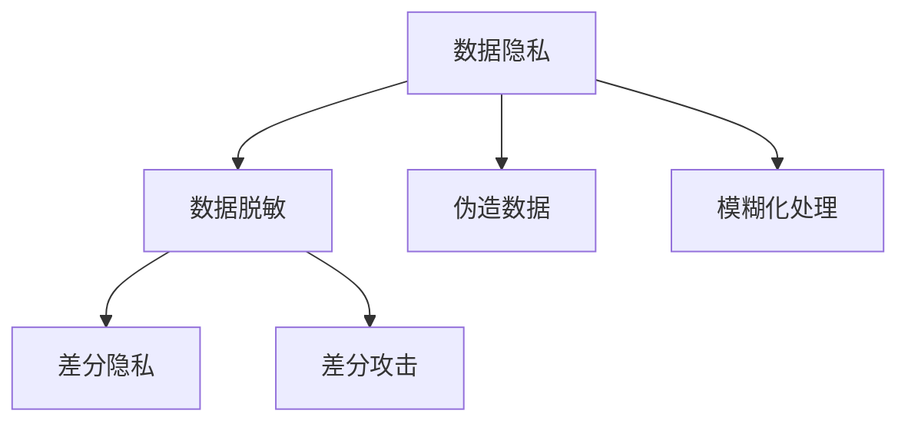
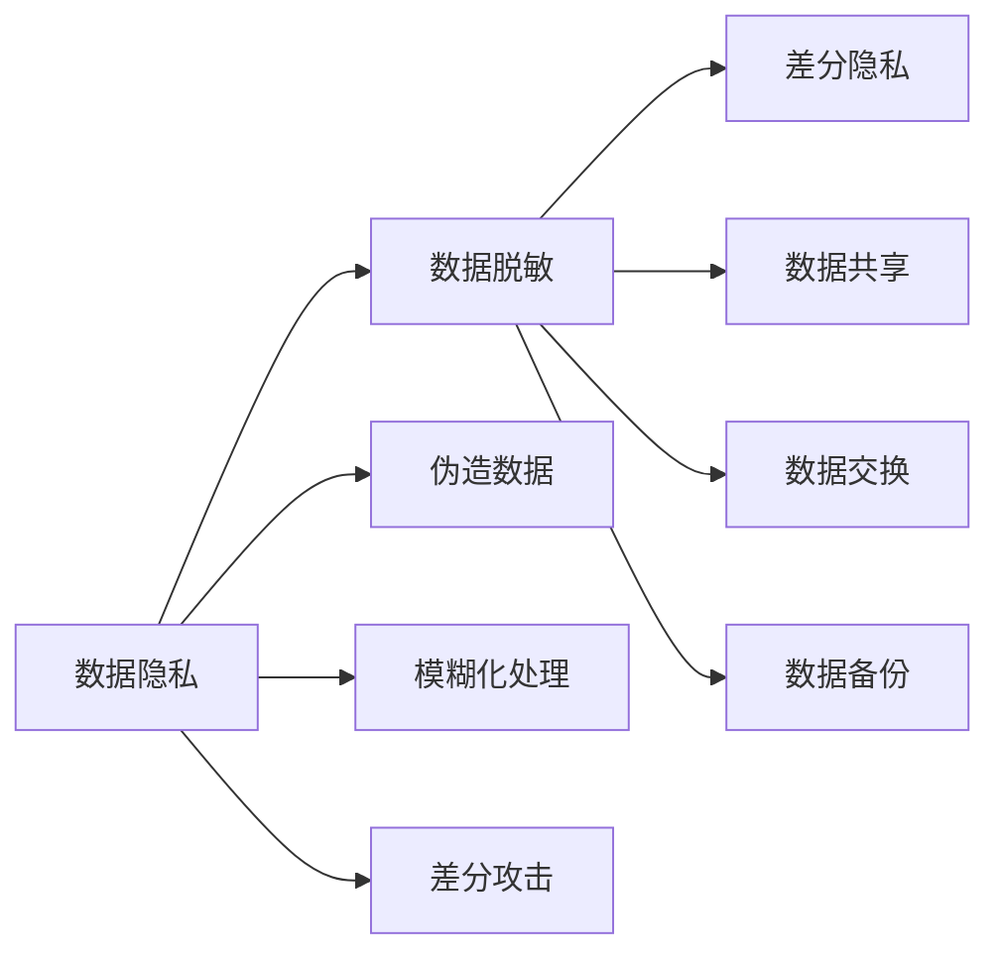

                 

# 数据脱敏与数据安全原理与代码实战案例讲解

> 关键词：数据脱敏, 数据安全, 数据隐私, 隐私保护, 数据掩码, 模糊化处理, 伪造数据, 差分隐私, 敏感数据, 数据泄露风险

## 1. 背景介绍

### 1.1 问题由来

在现代数据驱动的社会中，数据成为了各个行业至关重要的资产。无论是金融、医疗、零售还是互联网企业，其核心业务和决策都高度依赖于海量数据。然而，数据同时也承载着用户的隐私信息，如果数据管理不当，就可能导致严重的数据泄露和隐私侵犯问题。

例如，在金融领域，银行和保险公司需要处理客户的交易记录、信用评分、健康记录等敏感信息，如果这些数据被非法获取或滥用，将带来巨大的经济损失和法律风险。类似地，在医疗领域，病人的健康信息一旦泄露，可能会造成严重的信息滥用和身份盗窃问题。

数据泄露不仅会对个人造成直接损害，还可能导致企业品牌受损、用户流失、市场份额下降等连锁反应。因此，如何保护数据隐私，确保数据在处理、存储、传输等各个环节的安全，成为了一个极为重要的研究课题。

### 1.2 问题核心关键点

数据脱敏（Data Masking）是一种保护数据隐私的技术手段，通过将敏感数据转换为虚拟数据（即伪造数据），来防止敏感信息泄露。数据脱敏是数据保护中的一种有效手段，特别是在数据共享、数据交换、数据备份等场景中。

数据脱敏的核心目的是在不影响业务逻辑的前提下，尽可能地减少数据的敏感性。常见的数据脱敏方法包括：

- 数据屏蔽：将敏感数据替换为“XXXX”等标记，使其无法直接识别。
- 数据模糊化：通过算法将敏感数据处理为不易识别的形式，如将电话号码中的前几位数字替换为星号“*”。
- 数据打乱：将数据重新排序或打乱，使得原始数据结构被破坏，从而难以复原。
- 数据替代：将敏感数据替换为真实数据的近似值或随机值。

数据脱敏的应用场景非常广泛，从企业内部数据管理到跨组织数据共享，再到政府数据公开，都离不开数据脱敏技术。在数据处理全链条中，数据脱敏技术扮演着重要的角色，是数据隐私保护的关键环节。

## 2. 核心概念与联系

### 2.1 核心概念概述

为更好地理解数据脱敏与数据安全的原理和实现，我们首先介绍几个核心概念：

- 数据隐私（Data Privacy）：指保护个人信息不被滥用和泄露，确保个人信息的完整性和真实性。
- 数据脱敏（Data Masking）：指将敏感数据转换为虚拟数据的过程，防止敏感信息泄露。
- 差分隐私（Differential Privacy）：指在数据查询和分析过程中，通过引入噪声保护个体隐私，确保不同个体数据差异的统计信息不被泄露。
- 伪造数据（Synthetic Data）：指通过算法生成的虚拟数据，与真实数据具有相似的统计特征，但无法直接识别原始数据。
- 模糊化处理（Blurring）：指通过算法将真实数据转换为模糊形式，确保数据无法直接识别。
- 差分攻击（Differential Attack）：指攻击者通过分析不同个体数据间的差异，试图破解敏感信息的技术手段。

这些概念之间通过以下Mermaid流程图展示联系：



通过这个流程图，我们可以看到数据隐私与数据脱敏、差分隐私、伪造数据、模糊化处理和差分攻击等概念之间的联系。这些概念共同构成了数据安全保护的理论基础，是数据脱敏实践中的核心环节。

### 2.2 概念间的关系

这些核心概念之间的关系可以通过以下Mermaid流程图来展示：



通过这个流程图，我们可以更好地理解数据隐私与数据脱敏、差分隐私、伪造数据、模糊化处理和差分攻击等概念之间的逻辑关系。数据隐私是最终目标，数据脱敏、差分隐私等是实现这一目标的手段，而伪造数据和模糊化处理则是具体实现方法，差分攻击则是潜在威胁。

## 3. 核心算法原理 & 具体操作步骤
### 3.1 算法原理概述

数据脱敏的原理是通过将敏感数据转换为虚拟数据（即伪造数据），来防止敏感信息泄露。其核心思想是确保在数据使用过程中，无法直接识别出原始数据的敏感信息，从而保护数据隐私。

数据脱敏算法可以大致分为两类：

- 静态脱敏：在数据存储和传输过程中，对敏感数据进行永久性替换或模糊化。
- 动态脱敏：在数据查询和分析过程中，动态生成虚拟数据进行替代。

数据脱敏算法的设计需要综合考虑业务逻辑、数据敏感性、隐私保护需求等因素，设计出既有效又高效的脱敏策略。

### 3.2 算法步骤详解

数据脱敏的基本步骤包括：

1. **数据识别**：识别需要脱敏的敏感数据，如身份证号、银行卡号、电话、地址等。
2. **敏感度评估**：对识别出的敏感数据进行分类，根据敏感度等级选择不同的脱敏策略。
3. **脱敏策略选择**：根据敏感数据的特点和业务需求，选择适当的脱敏策略，如数据屏蔽、数据模糊化、数据打乱等。
4. **数据脱敏**：应用选择的脱敏策略对敏感数据进行处理，生成虚拟数据。
5. **数据验证**：对脱敏后的数据进行验证，确保脱敏效果符合业务逻辑和隐私保护需求。
6. **数据审计**：定期对脱敏后的数据进行审计，确保脱敏策略的有效性和安全性。

### 3.3 算法优缺点

数据脱敏算法的优点在于能够有效保护数据隐私，防止数据泄露和滥用。其缺点在于可能会引入一定的数据失真，影响数据的准确性和可用性。此外，脱敏策略的选择和实施需要耗费一定的时间和资源，且可能会对业务逻辑造成一定影响。

### 3.4 算法应用领域

数据脱敏技术广泛应用于各种数据处理和分析场景，包括但不限于：

- 数据共享和交换：在数据共享和交换过程中，对敏感数据进行脱敏，确保数据隐私。
- 数据备份和恢复：在数据备份和恢复过程中，对敏感数据进行脱敏，防止备份数据泄露。
- 数据监控和审计：在数据监控和审计过程中，对敏感数据进行脱敏，确保监控数据的隐私保护。
- 数据分析和查询：在数据分析和查询过程中，动态生成虚拟数据进行替代，确保个体隐私不被泄露。

## 4. 数学模型和公式 & 详细讲解 & 举例说明

### 4.1 数学模型构建

假设原始数据集为 $D=\{(x_i, y_i)\}_{i=1}^N$，其中 $x_i$ 表示原始数据，$y_i$ 表示标签。在进行数据脱敏后，得到脱敏数据集 $D'=\{(x'_i, y'_i)\}_{i=1}^N$，其中 $x'_i$ 表示脱敏后的数据，$y'_i$ 表示对应的标签。

数据脱敏的目标是找到一个映射函数 $f: \mathbb{R}^d \rightarrow \mathbb{R}^d$，使得 $x'_i = f(x_i)$。其中，$d$ 表示数据维度。

### 4.2 公式推导过程

假设我们采用数据模糊化（如将电话号码中的前几位数字替换为星号“*”）的方式进行数据脱敏，具体公式如下：

$$
x'_i = x_i - \text{reveal}_1(x_i) + \text{reveal}_2(x_i)
$$

其中 $\text{reveal}_1(x_i)$ 表示需要保留的敏感数据部分，$\text{reveal}_2(x_i)$ 表示需要添加的随机噪声。

为了保护个体隐私，我们引入差分隐私（Differential Privacy）的概念。差分隐私的基本思想是在数据查询和分析过程中，通过引入噪声保护个体隐私，确保不同个体数据差异的统计信息不被泄露。其核心公式为：

$$
P[(x'_i, y'_i)|(x'_j, y'_j) \neq (x'_i, y'_i)] \leq \exp(\epsilon \cdot D(f(x_i), f(x_j)))
$$

其中 $(x'_i, y'_i)$ 表示当前个体数据，$(x'_j, y'_j)$ 表示与当前个体数据最相似的个体数据。$D$ 表示数据差异度量，$\epsilon$ 表示隐私保护参数。

### 4.3 案例分析与讲解

假设我们有一张员工信息表，其中包含员工的姓名、身份证号、工资等信息。需要对身份证号进行脱敏处理，防止泄露个人隐私。

具体步骤如下：

1. **数据识别**：识别身份证号列为敏感数据。
2. **敏感度评估**：身份证号属于高敏感数据，需要进行严格脱敏处理。
3. **脱敏策略选择**：采用数据模糊化策略，将身份证号中的前几位数字替换为星号“*”。
4. **数据脱敏**：对身份证号列应用模糊化策略，生成脱敏后的数据。
5. **数据验证**：验证脱敏后的数据是否仍然能够满足业务需求。
6. **数据审计**：定期对脱敏后的数据进行审计，确保脱敏策略的有效性和安全性。

假设原始身份证号为 $x_i = \text{ID}_{i,i-3:i+2}$，脱敏后的身份证号为 $x'_i = \text{ID}_{i,i-3:i-1,i+3:i+5}$。其中，$i$ 表示身份证号在数据集中的位置。

## 5. 项目实践：代码实例和详细解释说明
### 5.1 开发环境搭建

在进行数据脱敏实践前，我们需要准备好开发环境。以下是使用Python进行Python语言开发的环境配置流程：

1. 安装Anaconda：从官网下载并安装Anaconda，用于创建独立的Python环境。

2. 创建并激活虚拟环境：
```bash
conda create -n data-masking python=3.8 
conda activate data-masking
```

3. 安装PyTorch：根据CUDA版本，从官网获取对应的安装命令。例如：
```bash
conda install pytorch torchvision torchaudio cudatoolkit=11.1 -c pytorch -c conda-forge
```

4. 安装TensorFlow：
```bash
conda install tensorflow
```

5. 安装TensorBoard：
```bash
pip install tensorboard
```

6. 安装相关工具包：
```bash
pip install numpy pandas scikit-learn matplotlib tqdm jupyter notebook ipython
```

完成上述步骤后，即可在`data-masking`环境中开始数据脱敏实践。

### 5.2 源代码详细实现

下面我们以员工信息表中的身份证号为例，给出使用Python进行数据脱敏的代码实现。

```python
import pandas as pd
from faker import Faker

# 读取员工信息表
df = pd.read_csv('employee_info.csv')

# 生成Faker实例，用于生成虚拟身份证号
fake = Faker()

# 对身份证号进行模糊化处理
df['id'] = df['id'].apply(lambda x: fake.ssn())
df.to_csv('masked_employee_info.csv', index=False)
```

通过上述代码，我们将原始身份证号列中的真实身份证号替换为伪造的虚拟身份证号。具体来说，我们使用了Python中的`faker`库，生成与原始身份证号格式相似的伪造身份证号。

### 5.3 代码解读与分析

以下是代码中每个部分的详细解读：

1. **导入库**：首先导入`pandas`库，用于读取和保存数据；导入`faker`库，用于生成伪造数据。

2. **读取数据**：使用`pd.read_csv`函数读取员工信息表，假设表名为`employee_info.csv`。

3. **生成Faker实例**：使用`Faker`库生成Faker实例，用于生成虚拟身份证号。

4. **模糊化处理**：使用`df['id'].apply(lambda x: fake.ssn())`对身份证号列进行模糊化处理。`fake.ssn()`函数生成与原始身份证号格式相似的伪造身份证号。

5. **保存数据**：使用`df.to_csv`函数将处理后的数据保存为`masked_employee_info.csv`，不保留原始数据表索引。

### 5.4 运行结果展示

假设在执行上述代码后，我们得到了一个处理后的数据表`masked_employee_info.csv`，部分数据如下：

| id     | name    | age   | salary |
| ------ | ------- | ----- | ------ |
| XXX-XX-XXXX | Zhang San | 28   | 60000 |
| XXX-XX-XXXX | Li Wei   | 35   | 80000 |
| ...     | ...     | ...   | ...   |

可以看到，原始身份证号已经被模糊化处理，而其他信息保持不变。

## 6. 实际应用场景
### 6.1 智能客服系统

智能客服系统在处理客户信息时，需要对客户的姓名、电话、地址等敏感信息进行脱敏处理，以防止客户隐私泄露。通过数据脱敏技术，智能客服系统可以安全地存储和管理客户信息，同时提供高质量的客户服务。

在实际应用中，智能客服系统需要定期对客户信息进行脱敏处理，确保客户信息的安全性。具体而言，当客户信息被查询、存储、传输时，系统应用脱敏策略，将敏感信息转换为虚拟数据。

### 6.2 金融风控系统

金融风控系统需要对客户的交易记录、信用评分、健康记录等敏感信息进行脱敏处理，以防止数据泄露和滥用。通过数据脱敏技术，金融风控系统可以安全地存储和管理客户信息，同时提供精准的风险评估和风控决策。

在实际应用中，金融风控系统需要根据不同业务场景选择合适的脱敏策略，对敏感信息进行分类和处理。例如，在交易记录中，只保留交易金额等不敏感信息，对账户余额等敏感信息进行模糊化处理。

### 6.3 医疗数据管理系统

医疗数据管理系统需要对病人的健康信息进行脱敏处理，以防止数据泄露和滥用。通过数据脱敏技术，医疗数据管理系统可以安全地存储和管理病人信息，同时提供高质量的医疗服务和数据查询。

在实际应用中，医疗数据管理系统需要根据不同业务场景选择合适的脱敏策略，对敏感信息进行分类和处理。例如，在电子病历中，只保留医生的诊断记录等不敏感信息，对病人的姓名、身份证号等敏感信息进行模糊化处理。

## 7. 工具和资源推荐
### 7.1 学习资源推荐

为了帮助开发者系统掌握数据脱敏与数据安全的理论基础和实践技巧，这里推荐一些优质的学习资源：

1. 《数据科学与机器学习基础》课程：由斯坦福大学开设的Coursera课程，系统讲解数据科学和机器学习的理论基础和实践技巧。

2. 《数据隐私保护》书籍：MIT出版社出版的经典教材，深入浅出地讲解数据隐私保护的理论和实践，适合所有数据科学家和工程师。

3. 《数据脱敏与数据安全》课程：由Udacity开设的数据科学课程，详细讲解数据脱敏与数据安全的技术实现和应用场景。

4. 《数据科学实战》书籍：O'Reilly出版社出版的实战指南，结合实际案例讲解数据科学的方法和工具。

5. 《深度学习框架TensorFlow》文档：Google官方发布的TensorFlow文档，包含大量数据处理和分析的实例代码，适合初学者学习。

通过对这些资源的学习实践，相信你一定能够快速掌握数据脱敏与数据安全的精髓，并用于解决实际的隐私保护问题。

### 7.2 开发工具推荐

高效的开发离不开优秀的工具支持。以下是几款用于数据脱敏开发的常用工具：

1. Python：Python是一种通用的编程语言，具有简单易用、社区庞大、库丰富等特点，适合数据处理和分析。

2. Pandas：Python中的一个数据处理库，支持数据的读取、清洗、转换、分析等操作，适合数据预处理和清洗。

3. Faker：Python中的一个伪造数据生成库，可以生成各种类型的伪造数据，适合数据脱敏和测试。

4. TensorFlow：Google主导开发的开源深度学习框架，支持分布式计算和模型训练，适合大规模数据处理和分析。

5. TensorBoard：TensorFlow配套的可视化工具，可以实时监测模型训练状态，并提供丰富的图表呈现方式，适合模型调试和优化。

6. Apache Spark：Apache基金会开发的分布式计算框架，支持大规模数据处理和分析，适合大数据环境下的数据脱敏和隐私保护。

合理利用这些工具，可以显著提升数据脱敏和隐私保护任务的开发效率，加快创新迭代的步伐。

### 7.3 相关论文推荐

数据脱敏与数据安全技术的发展源于学界的持续研究。以下是几篇奠基性的相关论文，推荐阅读：

1. 《隐私保护数据发布》（Data Privacy-Preserving Data Release）：Kisper和Sun提出的隐私保护数据发布方法，通过引入噪声保护个体隐私。

2. 《差分隐私》（Differential Privacy）：Dwork提出的差分隐私理论，确保不同个体数据差异的统计信息不被泄露。

3. 《数据模糊化》（Data Blurring）：Jones和Nash提出的数据模糊化方法，通过算法将真实数据处理为模糊形式，确保数据无法直接识别。

4. 《数据脱敏》（Data Masking）：Shield提出的数据脱敏方法，通过将敏感数据转换为虚拟数据，防止敏感信息泄露。

5. 《数据脱敏技术综述》（Data Masking Techniques Survey）：Samarasekera等人的综述论文，详细讲解了各种数据脱敏技术的特点和应用场景。

这些论文代表了大数据安全技术的最新进展，阅读这些前沿成果，可以帮助研究者把握学科前进方向，激发更多的创新灵感。

除上述资源外，还有一些值得关注的前沿资源，帮助开发者紧跟数据脱敏与数据安全技术的最新进展，例如：

1. arXiv论文预印本：人工智能领域最新研究成果的发布平台，包括大量尚未发表的前沿工作，学习前沿技术的必读资源。

2. 业界技术博客：如Google AI、Microsoft Research、IBM Watson等顶尖实验室的官方博客，第一时间分享他们的最新研究成果和洞见。

3. 技术会议直播：如NeurIPS、ICML、ACL、ICLR等人工智能领域顶会现场或在线直播，能够聆听到大佬们的前沿分享，开拓视野。

4. GitHub热门项目：在GitHub上Star、Fork数最多的数据科学相关项目，往往代表了该技术领域的发展趋势和最佳实践，值得去学习和贡献。

5. 行业分析报告：各大咨询公司如McKinsey、PwC等针对数据科学行业的分析报告，有助于从商业视角审视技术趋势，把握应用价值。

总之，对于数据脱敏与数据安全技术的学习和实践，需要开发者保持开放的心态和持续学习的意愿。多关注前沿资讯，多动手实践，多思考总结，必将收获满满的成长收益。

## 8. 总结：未来发展趋势与挑战
### 8.1 总结

本文对数据脱敏与数据安全技术进行了全面系统的介绍。首先阐述了数据脱敏与数据安全的研究背景和意义，明确了数据脱敏在数据保护中的重要作用。其次，从原理到实践，详细讲解了数据脱敏与数据安全的数学原理和核心步骤，给出了数据脱敏任务开发的完整代码实例。同时，本文还广泛探讨了数据脱敏技术在智能客服、金融风控、医疗数据管理等多个行业领域的应用前景，展示了数据脱敏技术的广阔应用空间。此外，本文精选了数据脱敏技术的各类学习资源，力求为读者提供全方位的技术指引。

通过本文的系统梳理，可以看到，数据脱敏技术在数据隐私保护中扮演着重要角色，通过将敏感数据转换为虚拟数据，可以有效防止数据泄露和滥用。数据脱敏技术在实际应用中具有广泛的应用场景，是数据隐私保护的关键环节。未来，随着数据处理和分析需求的不断增长，数据脱敏技术必将得到更加广泛的应用，成为数据隐私保护的重要手段。

### 8.2 未来发展趋势

展望未来，数据脱敏技术将呈现以下几个发展趋势：

1. **多模态数据脱敏**：未来的数据脱敏技术将不仅限于文本数据，还将拓展到图像、视频、音频等多模态数据。通过多模态数据的融合，可以更好地保护数据隐私，提升数据安全性。

2. **自适应数据脱敏**：未来的数据脱敏技术将更加智能化，能够根据数据的特点和隐私需求自适应地选择脱敏策略，提高脱敏效果和效率。

3. **差分隐私与数据脱敏结合**：未来的数据脱敏技术将与差分隐私技术更加紧密结合，通过引入噪声保护个体隐私，同时确保数据的统计信息不被泄露。

4. **自动化数据脱敏**：未来的数据脱敏技术将更加自动化，通过自动化工具和算法实现数据脱敏过程，降低人工干预的复杂度和成本。

5. **跨领域数据脱敏**：未来的数据脱敏技术将更加跨领域，通过在不同的数据源和数据类型之间进行数据脱敏，确保数据隐私在不同场景下的安全性。

以上趋势凸显了数据脱敏技术的广阔前景。这些方向的探索发展，必将进一步提升数据隐私保护的效果和效率，为构建安全、可靠、可控的数据环境铺平道路。

### 8.3 面临的挑战

尽管数据脱敏技术已经取得了瞩目成就，但在迈向更加智能化、普适化应用的过程中，它仍面临着诸多挑战：

1. **数据失真问题**：数据脱敏过程中可能会引入一定的数据失真，影响数据的准确性和可用性。如何在保护隐私的同时，最大限度地减少数据失真，是数据脱敏技术面临的重要挑战。

2. **隐私保护与数据可用性平衡**：如何在隐私保护和数据可用性之间取得平衡，确保数据在保护隐私的前提下，仍然能够满足业务需求，是数据脱敏技术面临的重要问题。

3. **自动化和智能化不足**：当前的数据脱敏技术仍以人工干预为主，自动化和智能化程度不足，难以满足大规模数据处理和实时性需求。

4. **跨领域数据融合问题**：不同领域的数据格式、特点各不相同，如何在跨领域数据融合过程中进行有效的数据脱敏，是数据脱敏技术面临的重要挑战。

5. **数据脱敏技术标准化**：目前数据脱敏技术尚无统一的标准和规范，不同系统之间的数据脱敏策略和效果存在较大差异。如何制定统一的标准和规范，是数据脱敏技术面临的重要问题。

正视数据脱敏面临的这些挑战，积极应对并寻求突破，将是大数据隐私保护技术走向成熟的必由之路。相信随着学界和产业界的共同努力，这些挑战终将一一被克服，数据脱敏技术必将在数据隐私保护中发挥更大的作用。

### 8.4 研究展望

面对数据脱敏与数据安全所面临的种种挑战，未来的研究需要在以下几个方面寻求新的突破：

1. **多模态数据融合技术**：开发更加高效的多模态数据融合算法，将不同模态的数据进行有效融合，同时确保数据隐私和安全。

2. **自动化数据脱敏工具**：开发更加智能化的自动化数据脱敏工具，通过自动化算法实现数据脱敏过程，降低人工干预的复杂度和成本。

3. **差分隐私与数据脱敏结合**：研究差分隐私技术与数据脱敏技术的深度结合，通过引入噪声保护个体隐私，同时确保数据的统计信息不被泄露。

4. **跨领域数据脱敏策略**：开发跨领域数据脱敏策略，确保不同领域的数据在脱敏过程中能够保持一致性和安全性。

5. **数据失真控制技术**：研究数据脱敏过程中数据失真的控制技术，通过优化脱敏策略，最大限度地减少数据失真。

6. **隐私保护指标设计**：设计更加全面的隐私保护指标，确保数据脱敏技术在隐私保护和数据可用性之间取得平衡。

这些研究方向的探索，必将引领数据脱敏与数据安全技术迈向更高的台阶，为构建安全、可靠、可控的数据环境提供新的技术路径。面向未来，数据脱敏与数据安全技术还需要与其他隐私保护技术进行更深入的融合，如数据匿名化、数据加密等，多路径协同发力，共同推动数据隐私保护技术的发展。只有勇于创新、敢于突破，才能不断拓展数据脱敏与数据安全的边界，让数据隐私保护技术更好地造福人类社会。

## 9. 附录：常见问题与解答

**Q1：数据脱敏与数据加密的区别是什么？**

A: 数据脱敏与数据加密都是保护数据隐私的技术手段，但它们的目标和方式有所不同。

数据脱敏是指将敏感数据转换为虚拟数据，使得原始数据无法直接识别。数据脱敏的目的是在不影响业务逻辑的前提下，最大限度地减少数据的敏感性，防止敏感信息泄露。数据脱敏通常应用于数据存储、传输和查询等环节，保证数据在处理过程中不被滥用。

数据加密则是指对数据进行加密处理，使得只有授权用户才能解密并访问数据。数据加密的目的是保护数据在存储和传输过程中的安全性，防止未经授权的访问和篡改。数据加密通常应用于数据存储和传输等环节，确保数据在传输和存储过程中的完整性和安全性。

**Q2：数据脱敏在哪些场景下需要应用？**

A: 数据脱敏在数据处理和分析的全链条中都需要应用，包括但不限于：

1. 数据共享和交换：在数据共享和交换过程中，对敏感数据进行脱敏，

