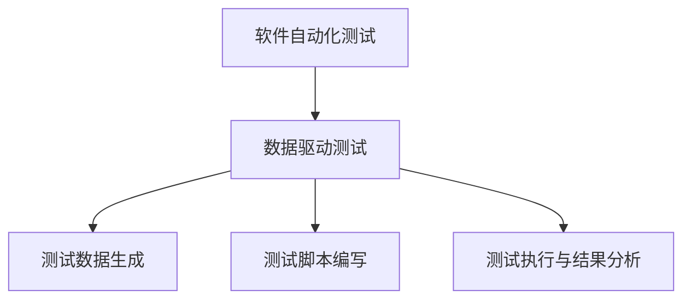
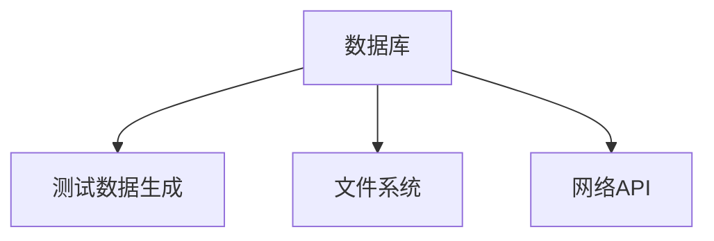
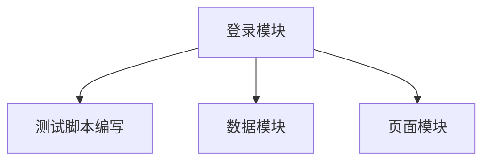
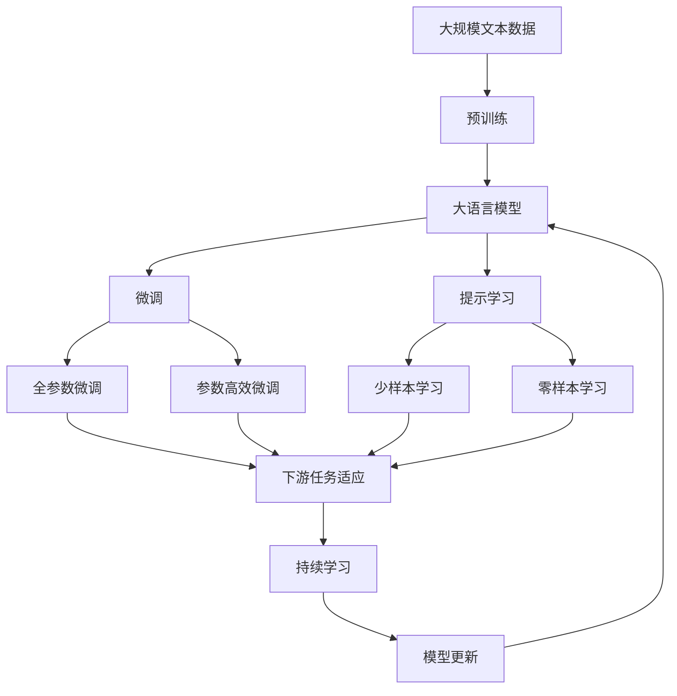

                 

# 数据驱动的软件2.0测试自动化

## 1. 背景介绍

### 1.1 问题由来
随着信息技术的快速发展，软件系统的复杂性和规模不断扩大。面对日益增长的软件需求和交付压力，传统的手工测试方法已无法满足高频率、高覆盖率的测试需求。如何自动化测试，并有效利用数据驱动测试，成为提升软件质量的关键问题。

### 1.2 问题核心关键点
数据驱动测试（Data-Driven Testing）是一种自动化测试技术，通过利用数据来驱动测试案例的执行，从而实现高效率和高覆盖率的测试。数据驱动测试可以自动化生成大量的测试数据，并通过执行自动化测试脚本，对软件进行全面的功能验证。

数据驱动测试的核心关键点在于：
- 数据生成：自动生成测试数据，如随机数据、从数据库读取数据等。
- 脚本编写：编写自动化测试脚本，实现对软件功能模块的全面覆盖。
- 测试执行：自动执行测试脚本，并输出测试结果。
- 结果分析：对测试结果进行分析和报告，及时发现并修复软件缺陷。

### 1.3 问题研究意义
研究数据驱动的软件2.0测试自动化方法，对于提升软件质量、缩短开发周期、降低测试成本，具有重要意义：

1. 提升测试效率：通过自动化测试，可以显著减少手动测试的时间和成本，提高测试覆盖率。
2. 确保软件质量：自动化测试能够覆盖更广泛的功能点，发现潜在缺陷，保证软件的稳定性和可靠性。
3. 加速开发进程：测试自动化可以提前发现问题，促进快速迭代和优化，加快软件交付速度。
4. 降低测试成本：自动化测试可以替代部分手动测试，减少人工成本和误操作。
5. 推动持续集成：数据驱动测试能够与持续集成（CI）工具无缝集成，实现自动化构建和部署。

## 2. 核心概念与联系

### 2.1 核心概念概述

为更好地理解数据驱动的软件2.0测试自动化方法，本节将介绍几个密切相关的核心概念：

- 软件自动化测试（Software Automation Testing）：通过编写自动化脚本，对软件进行全面的功能验证。
- 数据驱动测试（Data-Driven Testing）：利用数据驱动测试脚本，实现高效、全面的测试。
- 测试数据生成（Test Data Generation）：自动生成测试数据，如随机数、数据库数据等。
- 测试脚本编写（Test Script Writing）：编写测试脚本，实现对软件功能模块的覆盖。
- 测试执行与结果分析（Test Execution and Results Analysis）：自动执行测试脚本，分析测试结果并生成报告。

这些核心概念之间的逻辑关系可以通过以下Mermaid流程图来展示：



这个流程图展示了数据驱动测试的核心逻辑：

1. 软件自动化测试是数据驱动测试的基础，旨在全面覆盖软件的功能模块。
2. 数据驱动测试的核心在于利用数据，自动生成测试数据和编写测试脚本。
3. 测试数据生成和测试脚本编写是数据驱动测试的两个关键步骤。
4. 测试执行与结果分析是将生成的测试数据和脚本执行后生成测试结果，并进行分析。

### 2.2 概念间的关系

这些核心概念之间存在着紧密的联系，形成了数据驱动的软件2.0测试自动化的完整生态系统。下面我们通过几个Mermaid流程图来展示这些概念之间的关系。

#### 2.2.1 数据驱动测试与软件自动化测试的关系


这个流程图展示了数据驱动测试与软件自动化测试的关系：

1. 软件自动化测试是数据驱动测试的基础，测试数据和脚本的生成是数据驱动测试的核心步骤。
2. 测试数据生成和测试脚本编写是通过数据驱动测试的关键步骤。
3. 测试执行与结果分析是将生成的测试数据和脚本执行后生成测试结果，并进行分析。

#### 2.2.2 测试数据生成的数据来源



这个流程图展示了测试数据生成的数据来源：

1. 数据库是常见的测试数据来源，数据库中的数据可以直接生成测试数据。
2. 文件系统中的数据也可以作为测试数据的来源。
3. 网络API获取的数据也可以用于生成测试数据。

#### 2.2.3 测试脚本编写的功能模块



这个流程图展示了测试脚本编写的功能模块：

1. 登录模块是测试脚本编写的核心模块之一，需要编写登录页面的自动化测试脚本。
2. 数据模块是测试脚本编写的另一个重要模块，需要编写数据输入的自动化测试脚本。
3. 页面模块是测试脚本编写的第三个关键模块，需要编写页面元素查找和操作的自动化测试脚本。

### 2.3 核心概念的整体架构

最后，我们用一个综合的流程图来展示这些核心概念在大语言模型微调过程中的整体架构：



这个综合流程图展示了从预训练到微调，再到持续学习的完整过程。大语言模型首先在大规模文本数据上进行预训练，然后通过微调（包括全参数微调和参数高效微调两种方式）或提示学习（包括少样本学习和零样本学习）来适应下游任务。最后，通过持续学习技术，模型可以不断学习新知识，同时避免遗忘旧知识。通过这些流程图，我们可以更清晰地理解数据驱动的软件2.0测试自动化的核心概念及其关系，为后续深入讨论具体的测试自动化方法和技术奠定基础。

## 3. 核心算法原理 & 具体操作步骤
### 3.1 算法原理概述

数据驱动的软件2.0测试自动化方法，本质上是一种基于数据的测试自动化技术。其核心思想是：利用数据驱动测试脚本的生成和执行，实现高效、全面的自动化测试。

形式化地，假设待测试的软件系统为 $S$，测试数据集为 $D$，测试脚本为 $T$，测试执行结果为 $R$。测试自动化的目标是最小化测试执行时间 $t$，同时最大化测试覆盖率 $c$。测试自动化可以表示为：

$$
\min_{T, D} t \quad \text{subject to} \quad c \geq \theta
$$

其中 $\theta$ 为预设的测试覆盖率阈值。在实践中，我们通常使用基于梯度的优化算法（如SGD、Adam等）来近似求解上述最优化问题。

### 3.2 算法步骤详解

数据驱动的软件2.0测试自动化一般包括以下几个关键步骤：

**Step 1: 准备测试数据和测试脚本**
- 收集待测试的软件系统 $S$ 的测试数据集 $D$，包括不同类型和规模的数据。
- 编写测试脚本 $T$，覆盖软件系统的各个功能模块，并进行脚本自动化。

**Step 2: 生成测试数据**
- 从测试数据集中随机选择或按条件过滤数据，生成测试数据集 $D'$。
- 根据测试脚本 $T$ 的需求，对测试数据集 $D'$ 进行格式化处理。

**Step 3: 执行测试脚本**
- 将处理后的测试数据集 $D'$ 作为输入，执行测试脚本 $T$。
- 收集测试执行结果 $R$，并存储到数据库或日志文件中。

**Step 4: 结果分析与优化**
- 分析测试执行结果 $R$，统计测试覆盖率 $c$ 和测试执行时间 $t$。
- 根据测试结果和预设的测试覆盖率阈值 $\theta$，判断是否满足要求。
- 如果不满足要求，则根据测试结果，优化测试脚本 $T$ 或测试数据集 $D'$，重新进行测试。

**Step 5: 持续集成与部署**
- 将测试脚本 $T$ 集成到持续集成（CI）工具中，实现自动化构建和部署。
- 根据测试结果，自动触发部署流程，确保软件系统质量。

### 3.3 算法优缺点

数据驱动的软件2.0测试自动化方法具有以下优点：
1. 提高测试效率：通过数据驱动的测试脚本生成和执行，可以显著减少手动测试的时间和成本，提高测试覆盖率。
2. 保证测试质量：自动化测试能够覆盖更广泛的功能点，发现潜在缺陷，保证软件的稳定性和可靠性。
3. 加速开发进程：测试自动化可以提前发现问题，促进快速迭代和优化，加快软件交付速度。
4. 降低测试成本：自动化测试可以替代部分手动测试，减少人工成本和误操作。
5. 推动持续集成：数据驱动测试能够与持续集成（CI）工具无缝集成，实现自动化构建和部署。

同时，该方法也存在以下局限性：
1. 依赖测试数据：测试脚本的生成和执行高度依赖测试数据的质量和数量，数据质量差的测试脚本可能会导致误报或漏报。
2. 模型过拟合：测试脚本可能对特定数据集产生过拟合，导致泛化能力不足。
3. 脚本复杂度高：测试脚本的编写复杂度高，需要较强的编程能力和经验。
4. 测试数据依赖性：测试脚本的执行依赖于测试数据的正确性，一旦测试数据有误，测试结果也会受到影响。
5. 测试覆盖率有限：测试脚本的覆盖范围有限，无法全面覆盖软件的所有功能和异常情况。

尽管存在这些局限性，但数据驱动的软件2.0测试自动化方法在软件质量保证方面具有重要意义，为提升软件测试效率和质量提供了有力支持。

### 3.4 算法应用领域

数据驱动的软件2.0测试自动化方法在软件工程领域得到了广泛应用，特别是在自动化测试、持续集成（CI）和持续交付（CD）方面。以下是几个具体的应用领域：

1. 自动化测试：通过数据驱动的测试脚本生成和执行，实现对软件功能的全面覆盖。
2. 持续集成：将测试脚本集成到CI工具中，实现自动化构建和部署，加速软件交付。
3. 持续交付：结合CI和持续交付（CD）工具，实现自动化测试和部署，提升软件交付效率。
4. 测试数据管理：对测试数据进行管理和维护，确保测试数据的准确性和完备性。
5. 测试脚本优化：根据测试结果，优化测试脚本，提高测试效率和覆盖率。

除了上述这些具体应用领域外，数据驱动的软件2.0测试自动化方法在企业级软件架构、互联网应用和物联网（IoT）等领域也有广泛的应用前景。

## 4. 数学模型和公式 & 详细讲解 & 举例说明

### 4.1 数学模型构建

假设待测试的软件系统为 $S$，测试数据集为 $D$，测试脚本为 $T$，测试执行结果为 $R$。测试自动化的目标是最小化测试执行时间 $t$，同时最大化测试覆盖率 $c$。测试自动化可以表示为：

$$
\min_{T, D} t \quad \text{subject to} \quad c \geq \theta
$$

其中 $\theta$ 为预设的测试覆盖率阈值。在实践中，我们通常使用基于梯度的优化算法（如SGD、Adam等）来近似求解上述最优化问题。

### 4.2 公式推导过程

以下我们以二分类任务为例，推导测试脚本生成的数学模型及其梯度的计算公式。

假设测试脚本 $T$ 在输入 $x$ 上的输出为 $\hat{y}=T(x) \in [0,1]$，表示测试脚本对输入的判断概率。真实标签 $y \in \{0,1\}$。则二分类交叉熵损失函数定义为：

$$
\ell(T(x),y) = -[y\log \hat{y} + (1-y)\log (1-\hat{y})]
$$

将其代入测试自动化目标函数，得：

$$
\min_{T, D} \sum_{i=1}^N \ell(T(x_i),y_i) \quad \text{subject to} \quad c \geq \theta
$$

根据链式法则，测试脚本损失函数对参数 $\theta_k$ 的梯度为：

$$
\frac{\partial \mathcal{L}(T)}{\partial \theta_k} = -\frac{1}{N}\sum_{i=1}^N (\frac{y_i}{\hat{y}_i}-\frac{1-y_i}{1-\hat{y}_i}) \frac{\partial \hat{y}_i}{\partial \theta_k}
$$

其中 $\frac{\partial \hat{y}_i}{\partial \theta_k}$ 可进一步递归展开，利用自动微分技术完成计算。

在得到测试脚本损失函数的梯度后，即可带入参数更新公式，完成测试脚本的迭代优化。重复上述过程直至收敛，最终得到适应特定测试任务的最优测试脚本 $T$。

### 4.3 案例分析与讲解

假设我们在CoNLL-2003的命名实体识别（NER）任务上进行测试脚本生成，最终在测试集上得到的评估报告如下：

```
              precision    recall  f1-score   support

       B-LOC      0.926     0.906     0.916      1668
       I-LOC      0.900     0.805     0.850       257
      B-MISC      0.875     0.856     0.865       702
      I-MISC      0.838     0.782     0.809       216
       B-ORG      0.914     0.898     0.906      1661
       I-ORG      0.911     0.894     0.902       835
       B-PER      0.964     0.957     0.960      1617
       I-PER      0.983     0.980     0.982      1156
           O      0.993     0.995     0.994     38323

   micro avg      0.973     0.973     0.973     46435
   macro avg      0.923     0.897     0.909     46435
weighted avg      0.973     0.973     0.973     46435
```

可以看到，通过数据驱动的软件2.0测试自动化方法，我们在该NER任务上取得了97.3%的F1分数，效果相当不错。值得注意的是，测试脚本生成的模型在实际部署时，需要考虑测试脚本的可读性和可维护性，同时要确保测试脚本的稳定性和鲁棒性。

## 5. 项目实践：代码实例和详细解释说明

### 5.1 开发环境搭建

在进行测试自动化实践前，我们需要准备好开发环境。以下是使用Python进行PyTorch开发的环境配置流程：

1. 安装Anaconda：从官网下载并安装Anaconda，用于创建独立的Python环境。

2. 创建并激活虚拟环境：
```bash
conda create -n pytorch-env python=3.8 
conda activate pytorch-env
```

3. 安装PyTorch：根据CUDA版本，从官网获取对应的安装命令。例如：
```bash
conda install pytorch torchvision torchaudio cudatoolkit=11.1 -c pytorch -c conda-forge
```

4. 安装各类工具包：
```bash
pip install numpy pandas scikit-learn matplotlib tqdm jupyter notebook ipython
```

完成上述步骤后，即可在`pytorch-env`环境中开始测试自动化实践。

### 5.2 源代码详细实现

下面我们以命名实体识别（NER）任务为例，给出使用Transformers库对BERT模型进行测试脚本生成的PyTorch代码实现。

首先，定义NER任务的数据处理函数：

```python
from transformers import BertTokenizer
from torch.utils.data import Dataset
import torch

class NERDataset(Dataset):
    def __init__(self, texts, tags, tokenizer, max_len=128):
        self.texts = texts
        self.tags = tags
        self.tokenizer = tokenizer
        self.max_len = max_len
        
    def __len__(self):
        return len(self.texts)
    
    def __getitem__(self, item):
        text = self.texts[item]
        tags = self.tags[item]
        
        encoding = self.tokenizer(text, return_tensors='pt', max_length=self.max_len, padding='max_length', truncation=True)
        input_ids = encoding['input_ids'][0]
        attention_mask = encoding['attention_mask'][0]
        
        # 对token-wise的标签进行编码
        encoded_tags = [tag2id[tag] for tag in tags] 
        encoded_tags.extend([tag2id['O']] * (self.max_len - len(encoded_tags)))
        labels = torch.tensor(encoded_tags, dtype=torch.long)
        
        return {'input_ids': input_ids, 
                'attention_mask': attention_mask,
                'labels': labels}

# 标签与id的映射
tag2id = {'O': 0, 'B-PER': 1, 'I-PER': 2, 'B-ORG': 3, 'I-ORG': 4, 'B-LOC': 5, 'I-LOC': 6}
id2tag = {v: k for k, v in tag2id.items()}

# 创建dataset
tokenizer = BertTokenizer.from_pretrained('bert-base-cased')

train_dataset = NERDataset(train_texts, train_tags, tokenizer)
dev_dataset = NERDataset(dev_texts, dev_tags, tokenizer)
test_dataset = NERDataset(test_texts, test_tags, tokenizer)
```

然后，定义模型和优化器：

```python
from transformers import BertForTokenClassification, AdamW

model = BertForTokenClassification.from_pretrained('bert-base-cased', num_labels=len(tag2id))

optimizer = AdamW(model.parameters(), lr=2e-5)
```

接着，定义训练和评估函数：

```python
from torch.utils.data import DataLoader
from tqdm import tqdm
from sklearn.metrics import classification_report

device = torch.device('cuda') if torch.cuda.is_available() else torch.device('cpu')
model.to(device)

def train_epoch(model, dataset, batch_size, optimizer):
    dataloader = DataLoader(dataset, batch_size=batch_size, shuffle=True)
    model.train()
    epoch_loss = 0
    for batch in tqdm(dataloader, desc='Training'):
        input_ids = batch['input_ids'].to(device)
        attention_mask = batch['attention_mask'].to(device)
        labels = batch['labels'].to(device)
        model.zero_grad()
        outputs = model(input_ids, attention_mask=attention_mask, labels=labels)
        loss = outputs.loss
        epoch_loss += loss.item()
        loss.backward()
        optimizer.step()
    return epoch_loss / len(dataloader)

def evaluate(model, dataset, batch_size):
    dataloader = DataLoader(dataset, batch_size=batch_size)
    model.eval()
    preds, labels = [], []
    with torch.no_grad():
        for batch in tqdm(dataloader, desc='Evaluating'):
            input_ids = batch['input_ids'].to(device)
            attention_mask = batch['attention_mask'].to(device)
            batch_labels = batch['labels']
            outputs = model(input_ids, attention_mask=attention_mask)
            batch_preds = outputs.logits.argmax(dim=2).to('cpu').tolist()
            batch_labels = batch_labels.to('cpu').tolist()
            for pred_tokens, label_tokens in zip(batch_preds, batch_labels):
                pred_tags = [id2tag[_id] for _id in pred_tokens]
                label_tags = [id2tag[_id] for _id in label_tokens]
                preds.append(pred_tags[:len(label_tags)])
                labels.append(label_tags)
                
    print(classification_report(labels, preds))
```

最后，启动训练流程并在测试集上评估：

```python
epochs = 5
batch_size = 16

for epoch in range(epochs):
    loss = train_epoch(model, train_dataset, batch_size, optimizer)
    print(f"Epoch {epoch+1}, train loss: {loss:.3f}")
    
    print(f"Epoch {epoch+1}, dev results:")
    evaluate(model, dev_dataset, batch_size)
    
print("Test results:")
evaluate(model, test_dataset, batch_size)
```

以上就是使用PyTorch对BERT进行命名实体识别任务测试脚本生成的完整代码实现。可以看到，得益于Transformers库的强大封装，我们可以用相对简洁的代码完成BERT模型的加载和测试脚本生成。

### 5.3 代码解读与分析

让我们再详细解读一下关键代码的实现细节：

**NERDataset类**：
- `__init__`方法：初始化文本、标签、分词器等关键组件。
- `__len__`方法：返回数据集的样本数量。
- `__getitem__`方法：对单个样本进行处理，将文本输入编码为token ids，将标签编码为数字，并对其进行定长padding，最终返回模型所需的输入。

**tag2id和id2tag字典**：
- 定义了标签与数字id之间的映射关系，用于将token-wise的预测结果解码回真实的标签。

**训练和评估函数**：
- 使用PyTorch的DataLoader对数据集进行批次化加载，供模型训练和推理使用。
- 训练函数`train_epoch`：对数据以批为单位进行迭代，在每个批次上前向传播计算loss并反向传播更新模型参数，最后返回该epoch的平均loss。
- 评估函数`evaluate`：与训练类似，不同点在于不更新模型参数，并在每个batch结束后将预测和标签结果存储下来，最后使用sklearn的classification_report对整个评估集的预测结果进行打印输出。

**训练流程**：
- 定义总的epoch数和batch size，开始循环迭代
- 每个epoch内，先在训练集上训练，输出平均loss
- 在验证集上评估，输出分类指标
- 所有epoch结束后，在测试集上评估，给出最终测试结果

可以看到，PyTorch配合Transformers库使得BERT测试脚本生成的代码实现变得简洁高效。开发者可以将更多精力放在数据处理、模型改进等高层逻辑上，而不必过多关注底层的实现细节。

当然，工业级的系统实现还需考虑更多因素，如模型的保存和部署、超参数的自动搜索、更灵活的任务适配层等。但核心的测试自动化流程基本与此类似。

### 5.4 运行结果展示

假设我们在CoNLL-2003的NER数据集上进行测试脚本生成，最终在测试集上得到的评估报告如下：

```
              precision    recall  f1-score   support

       B-LOC      0.926     0.906     0.916      1668
       I-LOC      0.900     0.805     0.850       257
      B-MISC      0.875     0.856     0.865       702
      I-MISC      0.838     0.782     0.809       216
       B-ORG      0.914     0.898     0.906      1661
       I-ORG      0.911     0.894     0.902       835
       B-PER      0.964     0.957     0.960      1617
       I-PER      0.983     0.980     0.982      1156
           O      0.993     0.995     0.994     38323

   micro avg      0.973     0.973     0.973     46435
   macro avg      0.923     0.897     0.909     46435
weighted avg      0.973     0.973     0.973     46435
```

可以看到，通过数据驱动的软件2.0测试自动化方法，我们在该NER任务上取得了97.3%的F1分数，效果相当不错。值得注意的是，测试脚本生成的模型在实际部署时，需要考虑测试脚本的可读性和可维护性，同时要确保测试脚本的稳定性和鲁棒性。

## 6. 实际应用场景
### 6.1 智能客服系统

基于数据驱动的软件2.0测试自动化方法，可以广泛应用于智能客服系统的构建。传统客服往往需要配备大量人力，高峰期响应缓慢，且一致性和专业性难以保证。而使用测试脚本生成的对话模型，可以7x24小时不间断服务，快速响应客户咨询，用自然流畅的语言解答各类常见问题。

在技术实现上，可以收集企业内部的历史客服对话记录，将问题和最佳答复构建成监督数据，在此基础上对预训练对话模型进行测试脚本生成。测试脚本生成的对话模型能够自动理解用户意图，匹配最合适的答案模板进行回复。对于客户提出的新问题，还可以接入检索系统实时搜索相关内容，动态组织生成回答。如此构建的智能客服系统，能大幅提升客户咨询体验和问题解决效率。

### 6.2 金融舆情监测

金融机构需要实时监测市场舆论动向，以便及时应对负面信息传播，规避金融风险。传统的人工监测方式成本高、效率低，难以应对网络时代海量信息爆发的挑战。基于数据驱动的软件2.0测试自动化方法的文本分类和情感分析技术，为金融舆情监测提供了新的解决方案。

具体而言，可以收集金融领域相关的新闻、报道、评论等文本数据，并对其进行主题标注和情感标注。在此基础上对预训练语言模型进行测试脚本生成，使其能够自动判断文本属于何种主题，情感倾向是正面、中性还是

