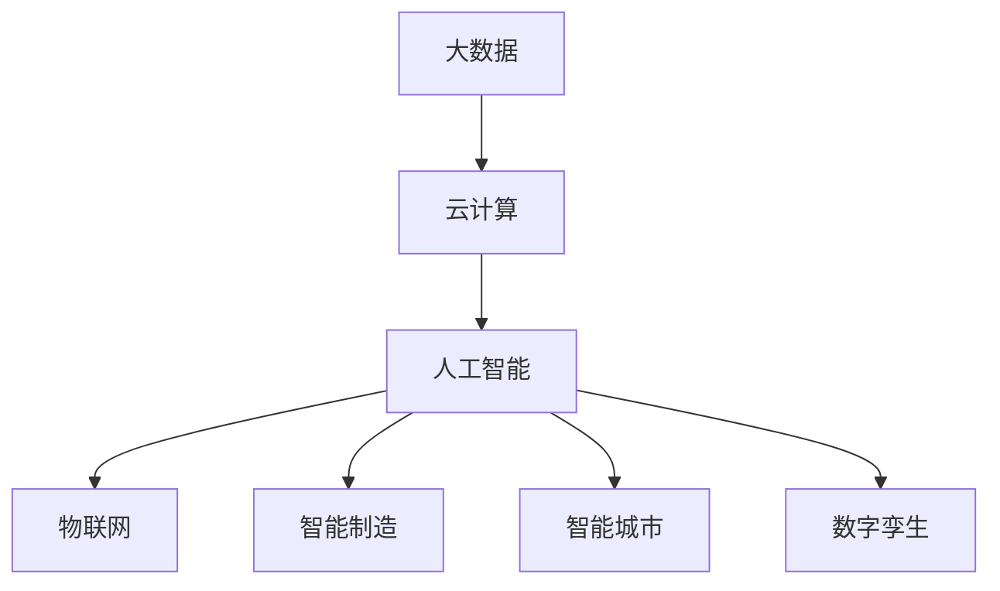
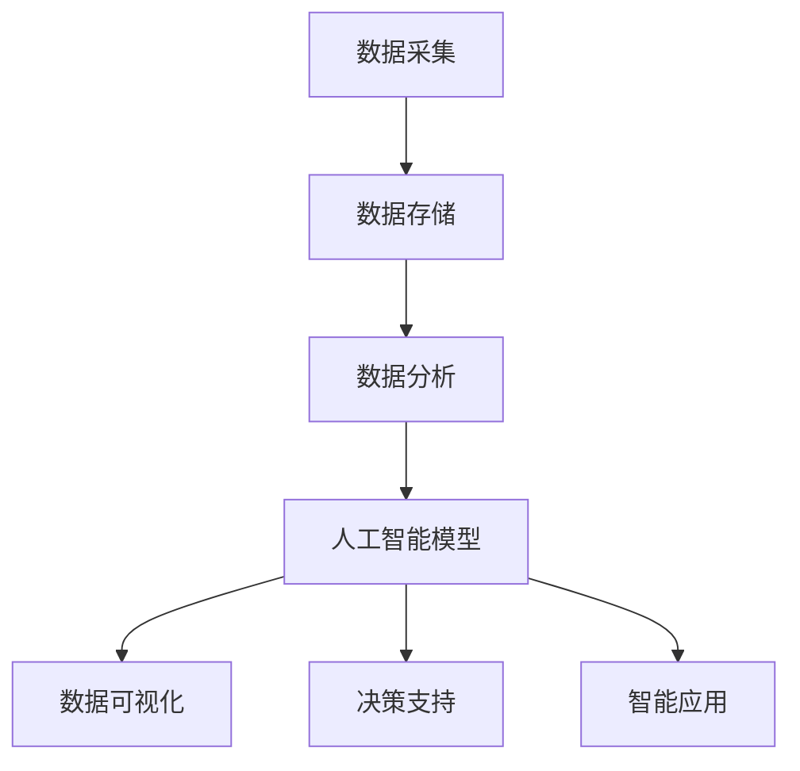

                 

# 数智时代的到来与发展趋势

> 关键词：人工智能,数字化转型,工业4.0,大数据,物联网,智能制造,智能城市,数字孪生,未来工作

## 1. 背景介绍

### 1.1 问题由来
随着科技的不断进步，人工智能(AI)正逐渐渗透到各行各业，推动着传统行业的数字化转型，催生出“数智时代”这一全新概念。人工智能技术不仅仅局限于算法和模型本身，更是包括数据采集、存储、计算、分析、应用等多个环节的综合能力体现。数智时代的到来，标志着人类社会进入了一个全新的发展阶段，不仅提升了生产力水平，也极大改变了人们的生活方式。

### 1.2 问题核心关键点
数智时代的核心是数据智能与数智技术深度融合，使得企业和组织能够高效地从海量数据中提取有价值的信息，实现精准决策和业务创新。这一过程中，大数据、云计算、物联网、人工智能等技术的综合应用，是实现数智转型的关键所在。数智时代不仅带来了技术革新，也提出了诸多挑战，如数据隐私、模型鲁棒性、伦理道德等。本文将系统性地探讨数智时代的到来及其发展趋势，重点分析核心概念和算法原理，给出具体的操作步骤，并通过案例分析进行详细讲解。

### 1.3 问题研究意义
研究数智时代的到来与发展趋势，对于理解未来技术趋势、指导企业数字化转型、提升社会生产力具有重要意义：

1. 帮助企业把握技术发展方向，避免因盲目追求技术而陷入发展误区。
2. 通过技术应用，提升企业决策效率和业务创新能力，实现高效管理。
3. 推动社会生产力的跨越式发展，促进经济社会的全面进步。
4. 提供相关知识普及和教育资源，助力行业技术人才的培养。

## 2. 核心概念与联系

### 2.1 核心概念概述

数智时代涉及众多核心概念，这些概念共同构成了数智转型的基础架构。以下是数智时代的关键概念及其简要介绍：

1. **人工智能**：通过算法和模型，使计算机系统具备智能化的决策和推理能力。

2. **大数据**：指规模庞大、类型多样的数据集，是实现数智转型的基础。

3. **云计算**：基于互联网的计算服务模式，提供按需弹性计算资源。

4. **物联网**：通过传感器、终端设备等将物理世界的数据收集到互联网络中，实现智能化管理。

5. **智能制造**：将人工智能、大数据、云计算等技术应用于制造业，提升生产效率和产品质量。

6. **智能城市**：利用信息通信技术，构建智慧、高效的城市管理和服务体系。

7. **数字孪生**：构建虚拟数字模型，实现物理实体的数字化仿真和模拟。

这些概念之间的关系可以通过以下Mermaid流程图来展示：



### 2.2 概念间的关系

通过上述流程图，我们可以看出大数据、云计算、人工智能等概念之间的内在联系。这些技术相互融合，共同驱动数智时代的到来。例如：

1. **大数据与人工智能**：大数据为人工智能提供了丰富的训练数据，使模型具备更强的泛化能力。
2. **云计算与人工智能**：云计算提供了弹性的计算资源，支持大规模模型的训练和部署。
3. **物联网与人工智能**：物联网采集的数据通过人工智能进行处理，提升智能化管理水平。
4. **智能制造与人工智能**：人工智能在制造业中实现自动化生产、质量检测、供应链管理等功能。
5. **智能城市与人工智能**：人工智能在城市管理中实现交通优化、安防监控、能源管理等功能。
6. **数字孪生与人工智能**：人工智能通过数字孪生实现对物理实体的仿真和模拟，提升决策精度。

### 2.3 核心概念的整体架构

大语言模型微调的核心概念架构如下所示，其中包含各个概念的相互关系和数据流向：



这一架构清晰地展示了数据在数智时代的流动过程，即从数据采集、存储，到分析、模型训练，再到可视化、决策支持，最后应用于实际业务场景。

## 3. 核心算法原理 & 具体操作步骤

### 3.1 算法原理概述

数智时代的核心算法原理主要集中在数据处理、模型训练和应用部署等方面。其中，数据处理包括数据清洗、特征提取、数据增强等，模型训练包括监督学习、无监督学习、强化学习等，应用部署则包括模型推理、评估和优化等。以下是数智时代核心算法的原理概述：

1. **数据处理**：通过数据清洗、特征提取、数据增强等手段，提高数据质量，为后续模型训练提供良好的数据基础。

2. **模型训练**：利用大数据、云计算等技术，进行大规模模型训练，提升模型的泛化能力和性能。

3. **应用部署**：通过模型推理、评估和优化等步骤，将训练好的模型部署到实际应用中，实现业务智能化。

### 3.2 算法步骤详解

数智时代的算法步骤可以分为以下几个主要阶段：

1. **数据预处理**：对原始数据进行清洗、特征提取、归一化等处理，保证数据质量。

2. **模型设计**：选择合适的模型结构，如卷积神经网络(CNN)、循环神经网络(RNN)、生成对抗网络(GAN)等，进行模型设计。

3. **模型训练**：利用大规模数据和云计算资源，进行模型训练，优化模型参数。

4. **模型评估**：通过交叉验证、AUC、ROC曲线等方法，评估模型性能，确保模型泛化能力。

5. **模型部署**：将训练好的模型部署到实际应用中，进行实时推理和优化。

### 3.3 算法优缺点

数智时代的算法具有以下优点：

1. **高效性**：通过大数据和云计算，可以高效地进行模型训练和推理，提升业务处理效率。

2. **精确性**：利用先进算法和技术，提升模型的预测精度和泛化能力。

3. **可扩展性**：通过分布式计算和云计算，支持模型在各种规模下的应用。

4. **低成本**：通过自动化和智能化管理，减少人力成本和时间成本。

数智时代的算法也存在以下缺点：

1. **高依赖性**：对数据质量和计算资源依赖较大，数据缺失或不完整会影响模型效果。

2. **复杂性**：算法设计和实现较为复杂，需要具备较高技术水平。

3. **伦理道德问题**：模型决策过程不透明，可能涉及隐私和伦理问题。

4. **过拟合风险**：在大规模数据上训练的模型，可能会过拟合训练数据，导致泛化能力下降。

### 3.4 算法应用领域

数智时代的算法应用广泛，涵盖各个行业，包括但不限于以下几个领域：

1. **智能制造**：通过物联网采集设备运行数据，利用AI进行故障预测、质量检测、供应链管理等。

2. **智能城市**：通过智慧交通、智慧安防、智慧能源等系统，实现城市智能化管理。

3. **金融科技**：通过大数据、AI技术进行风险评估、信用评估、智能投顾等。

4. **医疗健康**：通过AI进行医学影像分析、疾病预测、个性化治疗等。

5. **零售电商**：通过推荐系统、智能客服、库存管理等提升客户体验和运营效率。

6. **自动驾驶**：通过感知、决策、控制等AI技术，实现自动驾驶车辆。

## 4. 数学模型和公式 & 详细讲解 & 举例说明

### 4.1 数学模型构建

数智时代涉及的数学模型主要集中在机器学习和深度学习领域，包括监督学习、无监督学习、强化学习等。以下以监督学习为例，展示数学模型构建过程：

假设原始数据集为 $D = \{(x_i, y_i)\}_{i=1}^N$，其中 $x_i$ 为输入特征向量，$y_i$ 为标签。

定义损失函数 $\mathcal{L}(\theta)$，其中 $\theta$ 为模型参数。通过优化损失函数，求解最优参数：

$$
\hat{\theta} = \mathop{\arg\min}_{\theta} \mathcal{L}(\theta)
$$

常用的损失函数包括交叉熵损失、均方误差损失等。

### 4.2 公式推导过程

以交叉熵损失为例，推导损失函数及其梯度的计算公式：

假设模型输出为 $f(x)$，真实标签为 $y$，则交叉熵损失函数定义为：

$$
\mathcal{L}(y, f(x)) = -\frac{1}{N}\sum_{i=1}^N y_i \log f(x_i)
$$

其中 $f(x_i)$ 为模型在输入 $x_i$ 上的输出。

利用链式法则，损失函数对模型参数 $\theta$ 的梯度为：

$$
\nabla_{\theta}\mathcal{L}(y, f(x)) = -\frac{1}{N}\sum_{i=1}^N \frac{y_i}{f(x_i)} \nabla_{\theta}f(x_i)
$$

通过反向传播算法，可以高效计算出梯度，进行模型参数更新。

### 4.3 案例分析与讲解

以智能推荐系统为例，展示数智时代算法在实际应用中的具体实现。

假设推荐系统需要根据用户历史行为数据 $D_h = \{(x_{h,i}, y_{h,i})\}_{i=1}^N$ 预测用户对物品 $x_t$ 的兴趣，并推荐物品 $x_r$。

定义推荐模型为 $f(x_t; \theta)$，其中 $\theta$ 为模型参数。

通过历史数据 $D_h$ 训练模型，最小化交叉熵损失：

$$
\hat{\theta} = \mathop{\arg\min}_{\theta} \mathcal{L}(D_h, f(x_t; \theta))
$$

利用训练好的模型 $f(x_t; \hat{\theta})$，根据用户兴趣 $x_t$ 预测推荐物品 $x_r$。

通过不断迭代优化，提升推荐效果。

## 5. 项目实践：代码实例和详细解释说明

### 5.1 开发环境搭建

开发数智时代项目，需要具备Python、PyTorch等工具。以下介绍开发环境搭建步骤：

1. 安装Anaconda，创建虚拟环境。
2. 安装PyTorch、TensorFlow等深度学习框架。
3. 安装必要的工具包，如Numpy、Pandas、Scikit-learn等。
4. 配置Jupyter Notebook或PyCharm等IDE环境。

### 5.2 源代码详细实现

以推荐系统为例，展示数智时代项目的代码实现。

```python
import numpy as np
import pandas as pd
import torch
import torch.nn as nn
import torch.optim as optim
from sklearn.model_selection import train_test_split

# 数据预处理
def preprocess_data(df):
    # 数据清洗、特征提取、归一化等
    # 返回处理后的数据集
    pass

# 模型定义
class RecommendationModel(nn.Module):
    def __init__(self):
        super(RecommendationModel, self).__init__()
        # 定义模型结构，如卷积层、全连接层等
        pass
    
    def forward(self, x):
        # 定义前向传播过程
        pass

# 训练模型
def train_model(model, data_train, data_val, batch_size, learning_rate):
    # 定义优化器、损失函数
    optimizer = optim.Adam(model.parameters(), lr=learning_rate)
    criterion = nn.CrossEntropyLoss()
    # 训练模型
    pass

# 评估模型
def evaluate_model(model, data_test, batch_size):
    # 评估模型性能
    pass

# 主函数
if __name__ == '__main__':
    # 加载数据
    data = pd.read_csv('data.csv')
    # 数据预处理
    data_processed = preprocess_data(data)
    # 划分数据集
    train, val, test = train_test_split(data_processed, test_size=0.2, random_state=42)
    # 训练模型
    model = RecommendationModel()
    train_model(model, train, val, batch_size=64, learning_rate=0.001)
    # 评估模型
    evaluate_model(model, test, batch_size=64)
```

### 5.3 代码解读与分析

以上代码实现了推荐系统的基础功能，包括数据预处理、模型定义、训练和评估。其中，预处理函数 `preprocess_data` 对原始数据进行清洗、特征提取、归一化等处理，确保数据质量。模型定义函数 `RecommendationModel` 使用PyTorch定义推荐模型的结构和前向传播过程。训练函数 `train_model` 使用交叉熵损失和Adam优化器进行模型训练，并在验证集上评估模型性能。评估函数 `evaluate_model` 在测试集上评估模型性能。

## 6. 实际应用场景

### 6.1 智能制造

数智时代在智能制造中的应用主要体现在以下几个方面：

1. **故障预测**：利用传感器数据，通过机器学习算法预测设备故障，提前进行维护，避免生产中断。
2. **质量检测**：通过图像处理和深度学习技术，实时检测产品缺陷，提升产品质量。
3. **供应链管理**：利用大数据和AI技术，优化供应链管理，提升物流效率。

### 6.2 智能城市

智能城市通过物联网、大数据、AI等技术，实现智慧管理，提升城市运行效率和居民生活质量。

1. **智慧交通**：通过摄像头、传感器等设备，实时监测交通状况，优化交通流量，提升交通效率。
2. **智慧安防**：通过视频监控、人脸识别等技术，提升城市安防水平。
3. **智慧能源**：通过智能电网、分布式能源等技术，实现能源的智能化管理，提升能源利用效率。

### 6.3 金融科技

金融科技通过AI和大数据技术，实现金融服务的智能化和数字化。

1. **风险评估**：利用大数据和AI技术，对客户进行风险评估，优化信贷审批流程。
2. **智能投顾**：通过AI算法，为客户提供个性化的投资建议。
3. **反欺诈检测**：利用机器学习算法，检测金融欺诈行为，提升金融安全。

### 6.4 医疗健康

医疗健康通过AI和大数据技术，实现疾病的精准诊断和治疗。

1. **医学影像分析**：通过深度学习技术，分析医学影像，辅助医生进行疾病诊断。
2. **疾病预测**：利用大数据和AI技术，预测疾病发展趋势，提升诊疗效率。
3. **个性化治疗**：通过AI算法，制定个性化的治疗方案，提升治疗效果。

## 7. 工具和资源推荐

### 7.1 学习资源推荐

1. 《深度学习》系列教材：由斯坦福大学Andrew Ng教授主讲，深入浅出地介绍了深度学习的基本概念和算法。

2. 《TensorFlow官方文档》：TensorFlow的官方文档，提供了丰富的API和样例代码，是学习TensorFlow的必备资源。

3. 《Python数据科学手册》：Python数据科学的基础指南，涵盖了Numpy、Pandas、Matplotlib等常用库的使用。

4. 《自然语言处理综论》：自然语言处理的经典教材，涵盖词法分析、句法分析、语义分析等多个方面。

5. Coursera、Udacity等在线教育平台：提供了大量高质量的AI和数据科学课程，适合系统学习。

### 7.2 开发工具推荐

1. PyTorch：基于Python的深度学习框架，支持动态计算图和GPU加速。

2. TensorFlow：由Google开发的深度学习框架，支持分布式计算和TPU加速。

3. Jupyter Notebook：交互式编程环境，支持Python、R等语言，适合数据科学和机器学习开发。

4. PyCharm：Python开发IDE，支持代码高亮、自动补全、调试等特性，适合复杂项目开发。

5. Visual Studio Code：轻量级代码编辑器，支持多种编程语言和扩展，适合快速原型开发。

### 7.3 相关论文推荐

1. DeepMind的《Playing Atari with Deep Reinforcement Learning》：展示了深度强化学习在复杂环境下的应用。

2. Google的《TensorFlow: A System for Large-Scale Machine Learning》：介绍了TensorFlow的设计理念和实现细节。

3. OpenAI的《OpenAI Gym》：开源的AI环境库，支持多种环境模拟，用于AI算法的评估和测试。

4. Microsoft的《Azure AI》：介绍了Azure AI平台的功能和服务，包括计算资源、数据管理和模型部署等。

## 8. 总结：未来发展趋势与挑战

### 8.1 研究成果总结

数智时代作为科技发展的必然趋势，已经成为全球各行业的共识。数智时代通过大数据、AI等技术，推动了各行各业的数字化转型和智能化升级。数智时代带来了诸多机遇，同时也面临着诸多挑战，如数据隐私、模型鲁棒性、伦理道德等。未来，数智时代将进一步深化，成为人类社会发展的重要推动力。

### 8.2 未来发展趋势

1. **技术融合**：AI、大数据、云计算等技术将进一步融合，推动更多行业数字化转型。

2. **边缘计算**：随着物联网设备数量的增加，边缘计算将逐渐普及，提升数据处理效率。

3. **AI伦理**：数智时代的发展需要重视AI伦理问题，确保技术的公平、透明和可信。

4. **自动化和智能化**：数智时代将进一步推动自动化和智能化，提升生产力水平。

5. **人机协同**：数智时代将实现更加紧密的人机协同，提升人机交互体验。

### 8.3 面临的挑战

数智时代在发展过程中面临诸多挑战：

1. **数据隐私**：数智时代对数据的依赖性较大，如何保护用户隐私，是重要问题。

2. **模型鲁棒性**：AI模型可能出现过拟合或泛化能力不足的问题，如何提升模型鲁棒性，需要进一步研究。

3. **伦理道德**：AI技术的决策过程可能涉及伦理道德问题，如何规范AI行为，确保其符合社会价值观，需要更多研究和探索。

4. **资源限制**：数智时代对计算资源和算力要求较高，如何高效利用资源，需要持续优化。

5. **安全性**：数智时代可能存在安全漏洞，如何保障系统安全，避免潜在风险，需要更多技术手段。

### 8.4 研究展望

数智时代的未来研究展望主要集中在以下几个方面：

1. **数据隐私保护**：开发更加高效、安全的数据隐私保护技术，确保用户数据安全。

2. **模型鲁棒性提升**：开发新的算法和技术，提升模型的泛化能力和鲁棒性。

3. **AI伦理规范**：制定AI伦理规范，确保AI技术的公平、透明和可信。

4. **资源优化**：开发更加高效的计算资源管理和优化技术，提升系统性能。

5. **安全性保障**：开发新的安全技术，保障数智系统的安全稳定运行。

数智时代作为未来科技发展的必然趋势，其发展前景广阔。只有在技术、伦理、法律等各个方面进行全面研究，才能确保数智技术健康发展，为人类社会带来更多福祉。

## 9. 附录：常见问题与解答

**Q1: 什么是数智时代？**

A: 数智时代是指通过数据智能和数智技术深度融合，实现数字化转型和智能化升级的时代。数智时代通过AI、大数据、云计算等技术，推动各行各业实现自动化、智能化、协同化。

**Q2: 数智时代的核心技术有哪些？**

A: 数智时代的核心技术包括AI、大数据、云计算、物联网、智能制造、智能城市、数字孪生等。

**Q3: 数智时代的未来发展方向是什么？**

A: 数智时代的未来发展方向包括技术融合、边缘计算、AI伦理、自动化和智能化、人机协同等。

**Q4: 数智时代的发展面临哪些挑战？**

A: 数智时代的发展面临数据隐私、模型鲁棒性、伦理道德、资源限制、安全性等挑战。

**Q5: 如何提升数智系统的安全性？**

A: 通过数据加密、访问控制、异常检测、备份恢复等手段，提升数智系统的安全性。

---

作者：禅与计算机程序设计艺术 / Zen and the Art of Computer Programming

