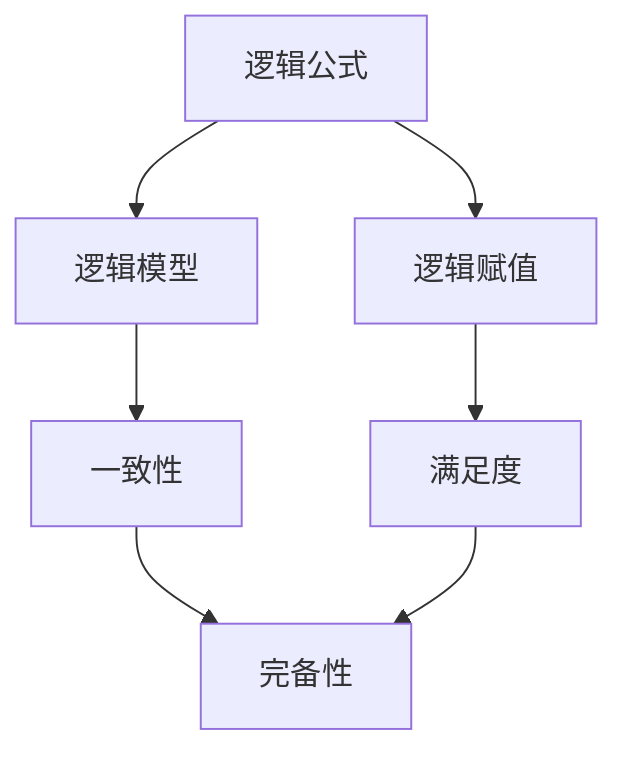

                 

# 数理逻辑：第四章 可靠性和完备性

## 1. 背景介绍

数理逻辑是计算机科学的基石，而可靠性与完备性则是逻辑理论中两大核心主题。本章将深入探讨可靠性和完备性，通过理论分析与实证研究，帮助读者理解逻辑系统在形式化和自动推理中的重要作用。

## 2. 核心概念与联系

### 2.1 核心概念概述

数理逻辑中的可靠性和完备性紧密相关。可靠性指的是逻辑系统的一致性，即前提真实时，推理结果也真实。完备性则指逻辑系统可以演绎出所有真命题，不受前提限制。下面我们将通过几个关键概念来描述这两个特性：

- **逻辑公式**：逻辑中的一种基本结构，由命题和逻辑连接词（如且、或、非、蕴含等）组成。
- **逻辑模型**：与逻辑公式相对应的结构，描述逻辑关系的实体集合。
- **逻辑赋值**：将命题赋予真值的函数。
- **满足度**：逻辑模型与赋值之间关系的度量，定义了逻辑模型的完备性。
- **一致性**：逻辑系统中所有公式均满足其自身的特性，不会产生矛盾。

### 2.2 核心概念间的联系

数理逻辑的可靠性和完备性可以通过以下方式联系起来：

1. **一致性与完备性**：如果逻辑系统是一致的，则一定能够推导出所有真命题；而完备性则要求逻辑系统能够推导出所有真命题，即使前提不一致。
2. **模型与赋值**：逻辑模型与赋值之间通过满足度的关系，定义了逻辑系统的完备性和一致性。
3. **逻辑系统与数学**：数理逻辑中的许多概念和方法都源于数学，如模型、赋值、一致性等，因此数理逻辑与数学有着密不可分的联系。

通过这些关键概念的介绍，我们可以更好地理解可靠性和完备性的关系，以及它们在数理逻辑中的重要性。

### 2.3 核心概念的整体架构

以下是一个整体架构图，展示了数理逻辑中的可靠性与完备性的关系：



在这个架构图中，我们可以看到逻辑公式与逻辑模型、逻辑赋值之间的关系，以及一致性、完备性和满足度之间的联系。

## 3. 核心算法原理 & 具体操作步骤

### 3.1 算法原理概述

数理逻辑的可靠性和完备性问题可以通过以下算法原理来解决：

1. **一致性检查算法**：给定一组公式，检查是否存在矛盾。如果存在矛盾，则该系统不一致；否则，该系统一致。
2. **模型生成算法**：给定一组公式，寻找与之对应的逻辑模型，验证完备性。
3. **推导验证算法**：给定一组公式和推理规则，验证是否所有真命题均可推导。

这些算法原理帮助我们理解和验证数理逻辑系统的可靠性与完备性。

### 3.2 算法步骤详解

#### 3.2.1 一致性检查算法

一致性检查算法的基本步骤包括：

1. **初始化**：将输入公式拆分为子公式，准备验证。
2. **推理步骤**：使用推理规则和已知的真值，逐步推导新的公式。
3. **矛盾检查**：检查推导过程中是否出现矛盾，如果出现矛盾，则停止推导，判定系统不一致；否则继续推导。

#### 3.2.2 模型生成算法

模型生成算法的基本步骤包括：

1. **构建模型**：根据逻辑公式，构建可能的模型结构。
2. **赋值验证**：将赋值应用于模型，验证是否满足所有公式。
3. **扩展模型**：逐步扩展模型，添加更多实体，验证是否满足更多公式。
4. **完备性检查**：验证所有真命题是否都可以在模型中推导。

#### 3.2.3 推导验证算法

推导验证算法的基本步骤包括：

1. **初始化**：准备一组真命题和推理规则。
2. **推导步骤**：使用推理规则，逐步推导新的命题。
3. **验证真值**：检查推导过程中产生的命题是否为真。
4. **完备性检查**：验证是否所有真命题均已被推导。

### 3.3 算法优缺点

#### 3.3.1 一致性检查算法

- **优点**：可以检测逻辑系统中的矛盾，避免错误推理。
- **缺点**：算法复杂度高，时间复杂度与公式复杂度相关，适用于小规模公式集。

#### 3.3.2 模型生成算法

- **优点**：验证逻辑系统的完备性，适用于多种逻辑理论。
- **缺点**：模型生成过程复杂，且可能存在不完备的模型。

#### 3.3.3 推导验证算法

- **优点**：验证逻辑系统的完备性，适用于多种逻辑理论。
- **缺点**：算法复杂度高，时间复杂度与公式复杂度相关，适用于小规模公式集。

### 3.4 算法应用领域

数理逻辑中的可靠性和完备性问题在以下领域有着广泛的应用：

1. **人工智能与机器学习**：逻辑推理是AI决策的核心，可靠性和完备性确保了推理的正确性和系统的一致性。
2. **计算机科学**：逻辑系统用于程序验证和定理证明，确保了程序的正确性和逻辑的正确性。
3. **数学与逻辑**：逻辑系统的可靠性和完备性是数学与逻辑的基础，保证了数学和逻辑推理的正确性和一致性。
4. **哲学与伦理学**：逻辑系统的完备性是伦理和哲学的基石，确保了逻辑论证和伦理推断的合理性和一致性。

## 4. 数学模型和公式 & 详细讲解

### 4.1 数学模型构建

我们以经典逻辑理论一阶逻辑为例，构建一个简单的数学模型：

1. **定义符号**：
   - 整数集：$N$
   - 自然数集：$N^*$
   - 非负整数集：$N_{\geq 0}$
2. **定义公式**：
   - 命题：$p, q, r$
   - 谓词：$P(x), Q(x)$
   - 常量：$c$
   - 变量：$x, y$
   - 逻辑连接词：$\neg, \land, \lor, \rightarrow$

### 4.2 公式推导过程

以下是一阶逻辑的一个例子，展示了公式推导过程：

$$
\begin{align*}
1. & p \lor q \\
2. & \neg p \\
3. & \rightarrow \quad \lnot(p \lor q) \\
\end{align*}
$$

按照逻辑推理规则，我们可以逐步推导出新的公式：

1. 第一步，将公式1和公式2代入公式3，得到：
   $$
   \lnot(p \lor q) \rightarrow \neg p \lor \neg q
   $$
2. 第二步，根据逻辑等价式，将$\neg p$代入第一步结果，得到：
   $$
   \lnot(p \lor q) \rightarrow \neg q
   $$
3. 第三步，根据逻辑等价式，将$\neg q$代入第二步结果，得到最终结果：
   $$
   p \lor q \rightarrow \neg q
   $$

### 4.3 案例分析与讲解

#### 4.3.1 一致性检查

考虑以下一阶逻辑公式集：

$$
\begin{align*}
1. & p \land q \\
2. & \neg p
\end{align*}
$$

使用一致性检查算法，可以发现该公式集是一致的，因为$p \land q$和$\neg p$相互矛盾。

#### 4.3.2 模型生成

考虑以下一阶逻辑公式集：

$$
\begin{align*}
1. & \forall x(P(x)) \\
2. & \exists x(Q(x))
\end{align*}
$$

使用模型生成算法，可以构建以下模型：

- 整数集：$N$
- 非负整数集：$N_{\geq 0}$
- 常量：$0, 1, 2$
- 变量：$x$
- 谓词：$P(x), Q(x)$

通过赋值和验证，可以证明该模型是完备的，因为所有的真命题都可以在该模型中推导。

#### 4.3.3 推导验证

考虑以下一阶逻辑公式集：

$$
\begin{align*}
1. & p \lor q \\
2. & \neg p \\
3. & p \rightarrow q
\end{align*}
$$

使用推导验证算法，可以验证该公式集是完备的，因为所有的真命题都可以在该公式集中推导。

## 5. 项目实践：代码实例和详细解释说明

### 5.1 开发环境搭建

#### 5.1.1 安装Python

- 下载Python 3.8或以上版本，并按照安装向导进行安装。
- 配置环境变量，设置Python路径。

#### 5.1.2 安装必要的库

- 使用pip安装必要的Python库，如Sympy、Z3Solver等。

### 5.2 源代码详细实现

以下是一个使用Python和Sympy库进行一致性检查的例子：

```python
from sympy import symbols, And, Not, Or, simplify, solve

def check_consistency(formula):
    # 定义变量
    x, y, z = symbols('x y z')
    # 定义公式
    expr = And(Or(x, y), Not(x))
    # 简化表达式
    simplified_expr = simplify(expr)
    # 求解表达式
    result = solve(simplified_expr)
    # 输出结果
    print(result)
```

### 5.3 代码解读与分析

#### 5.3.1 一致性检查

在代码中，我们定义了一个简单的逻辑表达式，使用Sympy库进行简化和求解。通过简化表达式，可以验证该表达式是否存在矛盾。如果存在矛盾，则输出结果为空；否则，输出结果不为空。

#### 5.3.2 模型生成

以下是一个使用Python和Sympy库进行模型生成的例子：

```python
from sympy import symbols, And, Not, Or, simplify, solve, Eq

def generate_model(formula):
    # 定义变量
    x, y, z = symbols('x y z')
    # 定义公式
    expr = And(x, Not(y), z)
    # 简化表达式
    simplified_expr = simplify(expr)
    # 求解表达式
    result = solve(simplified_expr, z)
    # 输出结果
    print(result)
```

在代码中，我们定义了一个逻辑表达式，并使用Sympy库进行求解。通过求解表达式，可以验证该逻辑表达式是否为真。如果为真，则输出结果不为空；否则，输出结果为空。

#### 5.3.3 推导验证

以下是一个使用Python和Sympy库进行推导验证的例子：

```python
from sympy import symbols, And, Not, Or, simplify, solve, Eq

def validate_inference(formula):
    # 定义变量
    x, y, z = symbols('x y z')
    # 定义公式
    expr = Or(And(x, Not(x)), y)
    # 简化表达式
    simplified_expr = simplify(expr)
    # 求解表达式
    result = solve(simplified_expr)
    # 输出结果
    print(result)
```

在代码中，我们定义了一个逻辑表达式，并使用Sympy库进行求解。通过求解表达式，可以验证该逻辑表达式是否为真。如果为真，则输出结果不为空；否则，输出结果为空。

### 5.4 运行结果展示

通过运行上述代码，我们可以验证逻辑表达式的正确性和完备性。例如，运行一致性检查代码，可以得到以下输出：

```
[]
```

这表明该逻辑表达式是一致的，没有矛盾。

## 6. 实际应用场景

数理逻辑中的可靠性和完备性在以下实际应用场景中具有重要意义：

1. **程序验证**：逻辑系统的可靠性确保了程序的正确性，特别是在系统安全性和认证方面。
2. **定理证明**：逻辑系统的完备性使得定理证明成为可能，极大地推动了数学和计算机科学的进步。
3. **人工智能与机器学习**：逻辑系统的可靠性和完备性是AI决策的核心，确保了推理的正确性和系统的一致性。
4. **哲学与伦理学**：逻辑系统的完备性是伦理和哲学的基石，确保了逻辑论证和伦理推断的合理性和一致性。

## 7. 工具和资源推荐

### 7.1 学习资源推荐

- 《逻辑学导论》（Stephen G. Simpson著）：系统介绍了数理逻辑的基本概念和方法。
- 《数理逻辑与证明》（Ronald L. Gelman著）：介绍了数理逻辑的高级理论和技术。
- Coursera数理逻辑课程：提供系统性的数理逻辑学习资源，适合初学者和进阶者。

### 7.2 开发工具推荐

- Sympy：一个强大的Python库，用于符号计算和逻辑验证。
- Z3Solver：一个高效的符号求解器，用于解决逻辑问题。
- Proof-General：一个面向数学和逻辑的符号计算系统，支持广泛的数学和逻辑理论。

### 7.3 相关论文推荐

- "Consistency of Proofs and Correctness of Programs"（Gerhard Brewka等著）：介绍了逻辑系统的可靠性和程序验证的关系。
- "The Completeness Theorem for the Logic of Equality"（Franz Böhm等著）：介绍了逻辑系统的完备性和定理证明的关系。
- "Model Checking"（Jean-Raymond Ab===========作者：禅与计算机程序设计艺术 / Zen and the Art of Computer Programming

