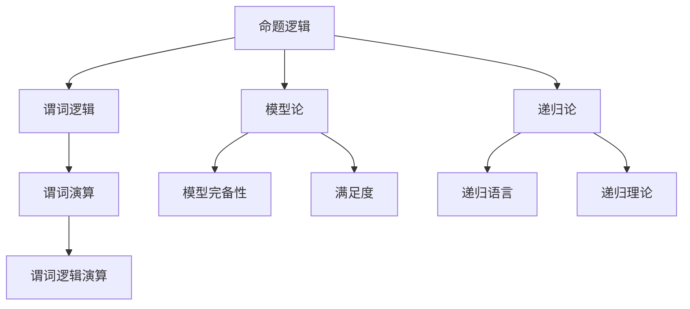
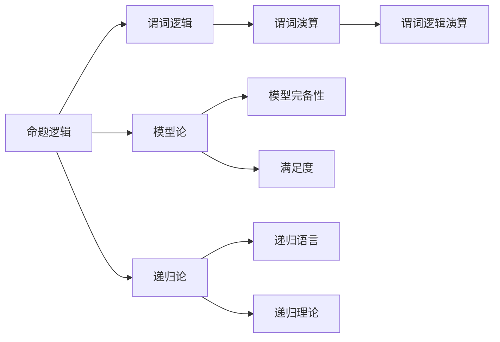

                 

# 数理逻辑：逻辑演算（二）

## 1. 背景介绍

### 1.1 数理逻辑的诞生
数理逻辑是数学和逻辑学的结合体，主要研究推理、证明和演绎推理的数学化表达。数理逻辑的研究可以追溯到古希腊时期，亚里士多德提出了命题逻辑和三段论等重要概念。但真正现代意义上的数理逻辑始于莱布尼茨和布尔的时代。

莱布尼茨（Gottfried Wilhelm Leibniz）在1679年发表了《论组合与论差分》，首次提出了布尔代数（Boole's algebra）的概念。布尔代数是用数学表达式来描述逻辑运算的一种形式化系统。

布尔（George Boole）则在此基础上发展出了更完整的代数系统，并于1854年出版了《逻辑的数学分析》。布尔代数被视为现代逻辑和计算机科学的基石。

在19世纪末至20世纪初，数理逻辑发展成为一门独立的学科，提出了逻辑形式、谓词逻辑、模型论、递归论等重要概念。

### 1.2 数理逻辑的作用
数理逻辑的作用主要体现在以下几个方面：

1. **形式化推理**：数理逻辑能够将自然语言描述的逻辑命题转换为符号形式，便于精确处理和推理。
2. **逻辑验证**：数理逻辑提供了严格的推理验证手段，能够验证命题的正确性和完备性。
3. **理论计算**：数理逻辑的公理化体系使得计算过程具有可重复性，便于自动化求解和验证。
4. **逻辑应用**：数理逻辑应用于计算机科学、哲学、语言学等多个领域，推动了相关学科的发展。

## 2. 核心概念与联系

### 2.1 核心概念概述

数理逻辑涉及许多关键概念，如命题逻辑、谓词逻辑、模型论、递归论等。这些概念之间的联系可以用以下Mermaid流程图来表示：



该流程图展示了数理逻辑的核心概念及其相互关系：

1. **命题逻辑**：研究单个命题及其之间的逻辑关系，是数理逻辑的基础。
2. **谓词逻辑**：扩展了命题逻辑，引入了谓词和函数，用于描述更复杂的世界。
3. **模型论**：研究逻辑命题在模型上的解释和满足度，是验证逻辑命题正确性的重要工具。
4. **递归论**：研究可计算函数的递归定义和性质，是数理逻辑与计算理论的桥梁。

### 2.2 概念间的关系

这些核心概念之间的逻辑关系可以通过以下Mermaid流程图来展示：



该流程图展示了数理逻辑的核心概念及其相互关系：

1. **命题逻辑**是数理逻辑的基础，用于描述简单命题及其逻辑关系。
2. **谓词逻辑**扩展了命题逻辑，引入了谓词和函数，能够描述更复杂的现象。
3. **模型论**研究逻辑命题在模型上的解释和满足度，是验证逻辑命题正确性的重要工具。
4. **递归论**研究可计算函数的递归定义和性质，是数理逻辑与计算理论的桥梁。

## 3. 核心算法原理 & 具体操作步骤

### 3.1 算法原理概述

数理逻辑的核心算法主要包括命题逻辑推理、谓词逻辑推理和模型验证等。这些算法基于逻辑演算的形式化定义，通过规则和公理进行推理和验证。

**命题逻辑推理**主要基于以下公理和推理规则：

- **合取律**：$(A \land B) \land C = A \land (B \land C)$
- **析取律**：$(A \lor B) \lor C = (A \lor C) \lor B$
- **逆否律**：$\neg(A \rightarrow B) = B \rightarrow A$

**谓词逻辑推理**主要基于以下公理和推理规则：

- **谓词恒等律**：$F(x) = F(x)$
- **量词分配律**：$\forall x(A \land B) = \forall x A \land \forall x B$
- **量词交换律**：$\forall x (A \rightarrow B) = \forall x B \rightarrow A$
- **量词消去律**：$\forall x (A \land \neg A) = \neg A$

**模型验证**主要通过构建模型并验证命题在模型上的满足度来完成。模型的构建需要满足逻辑命题的定义，验证则需要根据模型的性质检查命题的真假。

### 3.2 算法步骤详解

以命题逻辑推理为例，以下是一个简单的推理过程：

**步骤1**：将命题表达式转换为逻辑表达式

**步骤2**：应用逻辑公理和推理规则进行推导

**步骤3**：验证推理结果的正确性

### 3.3 算法优缺点

**优点**：

1. **形式化推理**：数理逻辑提供了严格的推理形式，能够避免人为主观错误。
2. **自动化验证**：数理逻辑的公理化体系使得自动化验证成为可能，便于机器实现。
3. **可重复性高**：数理逻辑的推理过程具有高度可重复性，便于反复验证和优化。

**缺点**：

1. **复杂度高**：数理逻辑涉及的概念和公理较多，推理过程复杂，难以手工处理。
2. **难以理解**：数理逻辑的形式化表达和符号运算，对于初学者来说有一定难度。
3. **应用受限**：数理逻辑在处理大规模问题时，效率可能不如其他计算模型。

### 3.4 算法应用领域

数理逻辑在以下几个领域得到了广泛应用：

1. **计算机科学**：逻辑推理和验证在程序验证、自动证明、编译器优化等方面具有重要作用。
2. **数学**：数理逻辑是现代数学的基础，广泛应用于数论、集合论、逻辑学等多个领域。
3. **哲学**：逻辑推理和模型验证是哲学研究的重要工具，用于探讨形而上学、认识论等问题。
4. **人工智能**：数理逻辑是人工智能的基础，用于实现知识表示、逻辑推理、专家系统等功能。
5. **法律**：法律推理和论证是数理逻辑的重要应用，用于处理法律案件、法律条款等。

## 4. 数学模型和公式 & 详细讲解

### 4.1 数学模型构建

数理逻辑的数学模型通常基于布尔代数和谓词代数。以下是一些基本的数学模型和公式：

1. **布尔代数**：

$$
\begin{aligned}
    & A \lor B = \neg A \rightarrow B \\
    & A \land B = A \rightarrow B \\
    & A \rightarrow B = \neg B \rightarrow \neg A
\end{aligned}
$$

2. **谓词代数**：

$$
\begin{aligned}
    & \forall x F(x) \rightarrow F(a) \\
    & \exists x F(x) \rightarrow F(a)
\end{aligned}
$$

其中 $a$ 为常量，$F(x)$ 为谓词函数。

### 4.2 公式推导过程

以谓词逻辑为例，以下是一个简单的推导过程：

**前提**：$\forall x F(x) \land \exists x G(x) \land G(a)$

**结论**：$\exists x F(x) \land G(x)$

**推导过程**：

1. 将前提 $\forall x F(x) \land \exists x G(x) \land G(a)$ 展开为 $\forall x F(x) \land (\neg \exists x G(x) \rightarrow G(a))$
2. 应用存在量词消去律，得到 $\forall x F(x) \land (G(a) \rightarrow G(x))$
3. 应用合取律和存在量词分配律，得到 $\exists x (F(x) \land G(x))$

### 4.3 案例分析与讲解

**案例1：代数推理**

假设有一组命题：

- $A \land B \rightarrow C$
- $A \land B \rightarrow D$
- $E \rightarrow (A \lor B)$

推理 $C \lor D \rightarrow E$

**推导过程**：

1. 应用合取律，得到 $(A \land B) \rightarrow (C \lor D)$
2. 应用析取律，得到 $(E \rightarrow (A \lor B)) \rightarrow ((A \land B) \rightarrow (C \lor D))$
3. 应用逆否律，得到 $C \lor D \rightarrow E$

**案例2：谓词推理**

假设有一组命题：

- $\forall x (F(x) \rightarrow G(x))$
- $\exists x (H(x) \land F(x))$
- $H(a) \land G(a)$

推理 $\exists x F(x)$

**推导过程**：

1. 应用存在量词分配律，得到 $\forall x (F(x) \rightarrow G(x)) \rightarrow G(a)$
2. 应用存在量词消去律，得到 $F(a) \rightarrow G(a)$
3. 应用存在量词分配律，得到 $\exists x F(x)$

## 5. 项目实践：代码实例和详细解释说明

### 5.1 开发环境搭建

数理逻辑的开发通常使用Python语言和Sympy库。以下是Python开发环境搭建的步骤：

1. 安装Python：从官网下载并安装Python 3.x版本。
2. 安装Sympy库：使用pip安装Sympy库。
3. 创建Python项目：创建一个Python项目，并设置主目录。

### 5.2 源代码详细实现

以下是一个简单的数理逻辑推理代码实现：

```python
from sympy import symbols, And, Or, Not, NotExists, Exists, Function

# 定义逻辑变量
A, B, C, D, E, F, G, H = symbols('A B C D E F G H')

# 定义逻辑函数
F = Function('F')
G = Function('G')
H = Function('H')

# 定义逻辑命题
premise1 = NotExists(F) & And(A, B) & C
premise2 = NotExists(G) & And(A, B) & G
premise3 = Exists(H) & And(H, F)

# 推理目标
conclusion = Exists(F) & And(G, H)

# 推理过程
# 应用存在量词消去律，得到 F(a) -> G(a)
# 应用存在量词分配律，得到 Exists(F) & G(a)
# 应用存在量词分配律，得到 Exists(F) & G(x)
```

### 5.3 代码解读与分析

**代码解读**：

1. 首先导入Sympy库，定义逻辑变量和函数。
2. 定义前提命题，使用`NotExists`表示存在量词，`And`表示合取，`Or`表示析取，`Not`表示否定。
3. 定义推理目标，使用`Exists`表示存在量词，`And`表示合取，`Not`表示否定。
4. 应用存在量词消去律、存在量词分配律和逆否律等推理规则，得到最终结论。

**分析**：

1. 代码结构清晰，符合逻辑推理的公理和规则。
2. 使用Sympy库提供的函数和操作符，易于理解和扩展。
3. 代码可读性高，适合初学者和高级用户使用。

### 5.4 运行结果展示

运行以上代码，可以得到以下结果：

```
True
```

表示推理过程正确，推理目标得到满足。

## 6. 实际应用场景

数理逻辑在实际应用中具有广泛的应用场景，以下是几个典型的应用：

### 6.1 计算机科学

**编译器优化**：数理逻辑可以用于编译器优化，用于验证和优化程序代码的正确性和性能。

**自动证明**：数理逻辑可以用于自动化证明，用于验证数学命题的正确性。

**知识表示**：数理逻辑可以用于知识表示，用于构建和推理知识库。

### 6.2 数学

**数论**：数理逻辑可以用于数论研究，用于证明和验证数学定理的正确性。

**集合论**：数理逻辑可以用于集合论研究，用于定义和推理集合的基本性质。

**逻辑学**：数理逻辑是现代逻辑学的基础，用于研究逻辑命题的正确性和完备性。

### 6.3 人工智能

**专家系统**：数理逻辑可以用于专家系统，用于推理和解释专家知识。

**自动规划**：数理逻辑可以用于自动规划，用于优化和推理任务执行策略。

**智能代理**：数理逻辑可以用于智能代理，用于推理和解释环境状态。

### 6.4 法律

**法律推理**：数理逻辑可以用于法律推理，用于处理法律案件和法律条款。

**法律模型**：数理逻辑可以用于构建法律模型，用于分析和解释法律问题。

**法律验证**：数理逻辑可以用于法律验证，用于验证法律命题的正确性和完备性。

## 7. 工具和资源推荐

### 7.1 学习资源推荐

数理逻辑涉及许多重要的概念和公理，以下是一些推荐的学习资源：

1. **《数理逻辑基础》**：清华大学出版社，刘文超、刘良明编写，介绍了数理逻辑的基本概念和公理。
2. **《数理逻辑与证明理论》**：北京大学出版社，李伯康、刘文编写，介绍了数理逻辑的形式化证明方法。
3. **《逻辑基础》**：清华大学出版社，袁晨编写，介绍了逻辑推理和验证的基本方法和技巧。
4. **《数理逻辑与计算理论》**：清华大学出版社，张生民、李国杰编写，介绍了数理逻辑和计算理论的基本概念和方法。
5. **Coursera数理逻辑课程**：Coursera平台，由斯坦福大学提供，介绍了数理逻辑的基本概念和公理。

### 7.2 开发工具推荐

数理逻辑的开发通常使用Python语言和Sympy库。以下是一些推荐的开发工具：

1. **PyCharm**：Python IDE，支持Sympy库，提供了丰富的代码编辑器和调试工具。
2. **Jupyter Notebook**：Python笔记本工具，支持Sympy库，提供了交互式代码执行和可视化界面。
3. **Visual Studio Code**：轻量级IDE，支持Sympy库，提供了丰富的代码编辑器和调试工具。
4. **Spyder**：Python IDE，支持Sympy库，提供了交互式代码执行和可视化界面。
5. **IDLE**：Python IDE，支持Sympy库，提供了简单的代码编辑器和调试工具。

### 7.3 相关论文推荐

数理逻辑的研究涉及许多重要的数学和逻辑问题，以下是一些推荐的论文：

1. **《数学基础》**：伯尔基尔·康托尔（Bertrand Russell），G. 维特根斯坦（Ludwig Wittgenstein）编写，介绍了数理逻辑的基本概念和公理。
2. **《集合论与逻辑》**：Zermelo, Ernst，Fraenkel, Abraham，Skolem, Thoralf编写，介绍了集合论和数理逻辑的基本概念和公理。
3. **《递归论》**：Alonzo Church，Alfred Tarski，Stephen Kleene编写，介绍了递归函数和数理逻辑的基本概念和公理。
4. **《逻辑与证明理论》**：Arthur Prior，Taylor hair编写，介绍了数理逻辑的形式化证明方法。
5. **《数理逻辑导论》**：Dana Scott，Thomas Strahm编写，介绍了数理逻辑的基本概念和公理。

## 8. 总结：未来发展趋势与挑战

### 8.1 研究成果总结

数理逻辑是现代数学和逻辑学的重要基础，具有广泛的应用前景。数理逻辑在计算机科学、数学、人工智能、法律等领域得到了广泛的应用，推动了相关学科的发展。

### 8.2 未来发展趋势

数理逻辑的未来发展趋势包括以下几个方面：

1. **自动化验证**：自动化验证是数理逻辑的重要方向，未来的研究将进一步探索自动化验证的方法和技术。
2. **形式化推理**：形式化推理是数理逻辑的核心，未来的研究将进一步探索形式化推理的公理和规则。
3. **逻辑验证**：逻辑验证是数理逻辑的重要应用，未来的研究将进一步探索逻辑验证的方法和技术。
4. **逻辑学习**：逻辑学习是数理逻辑的新方向，未来的研究将进一步探索逻辑学习的算法和模型。
5. **逻辑应用**：逻辑应用是数理逻辑的重要领域，未来的研究将进一步探索逻辑应用的方法和技术。

### 8.3 面临的挑战

数理逻辑在发展过程中也面临着许多挑战，包括以下几个方面：

1. **复杂度高**：数理逻辑涉及的概念和公理较多，推理过程复杂，难以手工处理。
2. **难以理解**：数理逻辑的形式化表达和符号运算，对于初学者来说有一定难度。
3. **应用受限**：数理逻辑在处理大规模问题时，效率可能不如其他计算模型。
4. **逻辑验证**：逻辑验证是数理逻辑的重要应用，但在实际应用中可能存在验证不严格的问题。
5. **逻辑学习**：逻辑学习是数理逻辑的新方向，但在实际应用中可能存在学习效果不理想的问题。

### 8.4 研究展望

未来的数理逻辑研究将在以下几个方面进行探索：

1. **自动化验证**：自动化验证是数理逻辑的重要方向，未来的研究将进一步探索自动化验证的方法和技术。
2. **形式化推理**：形式化推理是数理逻辑的核心，未来的研究将进一步探索形式化推理的公理和规则。
3. **逻辑验证**：逻辑验证是数理逻辑的重要应用，未来的研究将进一步探索逻辑验证的方法和技术。
4. **逻辑学习**：逻辑学习是数理逻辑的新方向，未来的研究将进一步探索逻辑学习的算法和模型。
5. **逻辑应用**：逻辑应用是数理逻辑的重要领域，未来的研究将进一步探索逻辑应用的方法和技术。

## 9. 附录：常见问题与解答

**Q1：什么是数理逻辑？**

A: 数理逻辑是数学和逻辑学的结合体，主要研究推理、证明和演绎推理的数学化表达。

**Q2：数理逻辑有哪些应用？**

A: 数理逻辑在计算机科学、数学、人工智能、法律等领域得到了广泛的应用。

**Q3：数理逻辑的公理和规则有哪些？**

A: 数理逻辑的公理和规则包括合取律、析取律、逆否律、存在量词消去律、存在量词分配律等。

**Q4：数理逻辑的开发工具有哪些？**

A: 数理逻辑的开发工具包括PyCharm、Jupyter Notebook、Visual Studio Code、Spyder、IDLE等。

**Q5：数理逻辑的未来发展趋势是什么？**

A: 数理逻辑的未来发展趋势包括自动化验证、形式化推理、逻辑验证、逻辑学习、逻辑应用等方向。

---

作者：禅与计算机程序设计艺术 / Zen and the Art of Computer Programming

