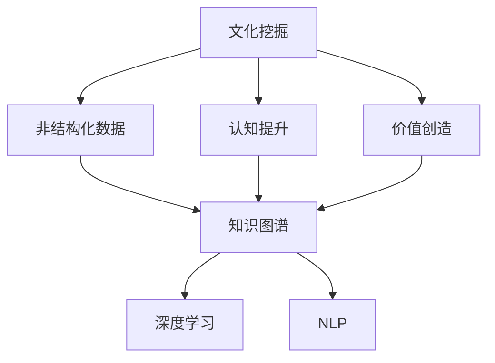
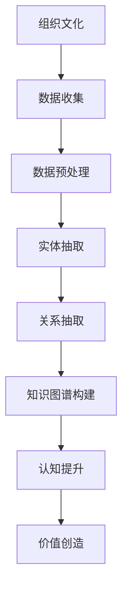
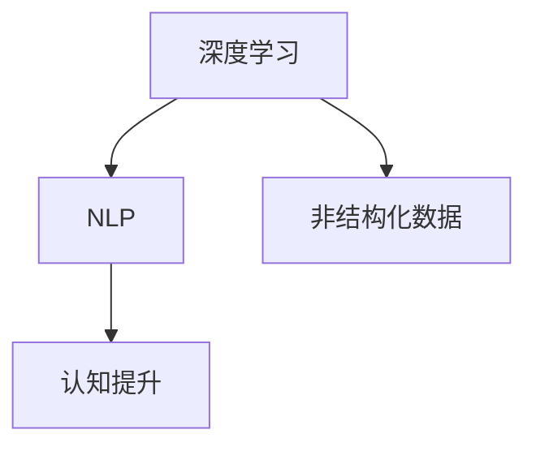

                 

# 文化的力量：提升认知，创造价值

> 关键词：文化挖掘，认知提升，价值创造，技术应用，数据驱动

## 1. 背景介绍

### 1.1 问题由来
在信息化时代，随着技术的快速发展，社会各个领域都在发生深刻的变化。企业竞争愈发激烈，组织对高层次认知能力和创新能力的追求也愈发迫切。文化，作为组织中非正式的知识传递方式，往往蕴含着丰富的经验和智慧，是组织的核心竞争力之一。如何从文化中挖掘出价值，并转化为可用的认知和知识，成为了企业和组织亟待解决的重要问题。

### 1.2 问题核心关键点
文化挖掘指的是从组织中的文档、邮件、会议记录、员工反馈等非结构化数据中，提取、分析和总结出有价值的信息和知识。其核心在于理解文化中的深层含义，提炼出可供进一步应用的认知。文化挖掘的价值在于提升组织的认知水平和创新能力，从而实现价值创造。

### 1.3 问题研究意义
文化挖掘的研究，对于提升组织的认知水平和创新能力，实现价值创造，具有重要意义：

1. **提升认知**：文化挖掘有助于将组织的隐性知识显性化，提炼出有价值的洞察和认知。
2. **增强创新**：通过深入理解组织文化中的经验和智慧，为企业提供新思路和创新解决方案。
3. **促进转型**：文化挖掘是企业数字化转型的重要一环，有助于企业在数字化进程中保持核心竞争力。
4. **优化决策**：文化挖掘可以为企业管理决策提供数据支撑，帮助企业做出更加明智的选择。
5. **赋能人才**：文化挖掘可以赋能员工，提升其认知和创新能力，促进团队协作和知识共享。

## 2. 核心概念与联系

### 2.1 核心概念概述

为更好地理解文化挖掘的过程和应用，本节将介绍几个关键概念：

- **文化挖掘**：从组织中的非结构化数据中提取有价值的信息和知识，提升组织的认知水平和创新能力。
- **认知提升**：通过文化挖掘，将组织的隐性知识显性化，提炼出可供进一步应用的认知。
- **价值创造**：利用文化挖掘获取的认知，指导组织运营和管理，创造更高的商业价值。
- **知识图谱**：用于存储和组织知识的有向图，通过关系抽取、实体链接等技术构建。
- **深度学习**：一种基于人工神经网络的机器学习技术，能够处理非结构化数据，提取深层次特征。
- **自然语言处理(NLP)**：研究计算机如何理解和处理人类语言的技术，是文化挖掘的重要工具。

这些核心概念之间的联系可以通过以下Mermaid流程图来展示：



这个流程图展示了几者之间的联系：

1. 文化挖掘从非结构化数据中提取知识。
2. 提取出的知识用于提升认知和创造价值。
3. 知识图谱和深度学习是文化挖掘的重要手段。
4. NLP技术提供对非结构化数据的处理能力。

### 2.2 概念间的关系

这些核心概念之间存在着紧密的联系，形成了文化挖掘的完整生态系统。下面我们通过几个Mermaid流程图来展示这些概念之间的关系。

#### 2.2.1 文化挖掘的流程



这个流程图展示了文化挖掘的基本流程：

1. 从组织文化中收集非结构化数据。
2. 数据预处理，清洗和标注数据。
3. 通过实体抽取、关系抽取等技术构建知识图谱。
4. 从知识图谱中提炼出有价值的认知。
5. 将认知应用于管理和运营，创造商业价值。

#### 2.2.2 知识图谱的作用


这个流程图展示了知识图谱在文化挖掘中的关键作用：

1. 知识图谱提供了对组织文化数据的结构化表示。
2. 通过结构化数据，可以更有效地进行实体抽取、关系抽取等操作。
3. 知识图谱支持深度学习和NLP技术的应用，提取深层次的认知。
4. 认知成果可以进一步转化为价值创造。

#### 2.2.3 深度学习与NLP的关系



这个流程图展示了深度学习与NLP技术的关系：

1. 深度学习能够处理非结构化数据，提取深层次特征。
2. NLP技术提供了文本数据的处理能力。
3. 深度学习和NLP的结合，可以更高效地进行认知提升和价值创造。

## 3. 核心算法原理 & 具体操作步骤
### 3.1 算法原理概述

文化挖掘的算法原理基于深度学习和自然语言处理技术，通过构建知识图谱和挖掘组织文化数据，提炼出可供进一步应用的认知。

形式化地，假设组织文化数据为 $D=\{d_i\}_{i=1}^N$，其中 $d_i$ 为非结构化文本数据。知识图谱为 $G=(V,E)$，其中 $V$ 为节点集合，表示实体；$E$ 为边集合，表示实体之间的关系。文化挖掘的目标是构建知识图谱 $G$，并从中提炼出认知 $K$，使其能够指导组织的管理和运营。

### 3.2 算法步骤详解

文化挖掘的算法步骤主要包括以下几个关键步骤：

**Step 1: 数据收集与预处理**
- 从组织文化中收集非结构化数据，包括文档、邮件、会议记录、员工反馈等。
- 对数据进行清洗和标注，去除噪音和不相关内容。
- 对文本数据进行分词、词性标注、命名实体识别等预处理操作。

**Step 2: 构建知识图谱**
- 对预处理后的文本数据进行实体抽取，识别出组织中的核心实体（如部门、员工、产品等）。
- 对抽取的实体进行关系抽取，构建实体之间的关系图谱。
- 对关系图谱进行结构化处理，构建知识图谱。

**Step 3: 认知提升**
- 利用深度学习模型，如BERT、GPT等，对知识图谱中的文本数据进行编码。
- 对编码后的文本数据进行特征提取，获取深层次的认知。
- 通过实体链接、关系推理等技术，进一步提炼出更有价值的认知。

**Step 4: 价值创造**
- 将提炼出的认知应用于组织的管理和运营中，如决策支持、流程优化等。
- 利用认知驱动的业务模型，提升组织的核心竞争力。
- 持续收集新的数据，更新知识图谱和认知，保持动态更新。

### 3.3 算法优缺点

文化挖掘的算法具有以下优点：
1. **高效提取知识**：能够从大量的非结构化数据中高效提取知识。
2. **提升认知水平**：能够提炼出组织文化中的深层含义，提升认知水平。
3. **灵活应用**：知识图谱和深度学习模型可以灵活应用于不同类型的组织文化数据。
4. **促进创新**：通过认知提升，为组织提供新思路和创新解决方案。

同时，该算法也存在以下缺点：
1. **数据质量依赖**：对数据质量要求较高，数据收集和标注工作量大。
2. **技术门槛较高**：需要深厚的深度学习和NLP知识，技术门槛较高。
3. **依赖先验知识**：需要一定的领域知识，才能准确抽取和理解实体关系。
4. **成本较高**：数据预处理、知识图谱构建、深度学习模型训练等，成本较高。

### 3.4 算法应用领域

文化挖掘的应用领域非常广泛，涵盖了企业、政府、非营利组织等各类组织。以下是几个典型的应用场景：

1. **企业运营优化**：利用文化挖掘提炼出业务流程、决策模式等认知，优化企业的运营效率。
2. **产品设计与研发**：通过文化挖掘了解用户需求、市场趋势，指导产品的设计和研发。
3. **员工培训与发展**：通过文化挖掘提炼出员工的价值观、行为模式等认知，设计有效的培训和发展计划。
4. **客户关系管理**：通过文化挖掘了解客户需求、反馈，优化客户关系管理策略。
5. **风险管理与合规**：通过文化挖掘提炼出风险点、合规要求等认知，提升风险管理和合规能力。
6. **知识共享与协作**：通过文化挖掘构建知识图谱，促进组织内部的知识共享与协作。

## 4. 数学模型和公式 & 详细讲解 & 举例说明
### 4.1 数学模型构建

文化挖掘的数学模型构建主要基于深度学习和自然语言处理技术，通过构建知识图谱和挖掘组织文化数据，提炼出可供进一步应用的认知。

假设组织文化数据为 $D=\{d_i\}_{i=1}^N$，其中 $d_i$ 为非结构化文本数据。知识图谱为 $G=(V,E)$，其中 $V$ 为节点集合，表示实体；$E$ 为边集合，表示实体之间的关系。文化挖掘的目标是构建知识图谱 $G$，并从中提炼出认知 $K$，使其能够指导组织的管理和运营。

### 4.2 公式推导过程

以下我们以知识图谱构建为例，推导其基本算法。

知识图谱的构建通常包括以下几个步骤：

1. **实体抽取**：识别文本中的实体，如部门、员工、产品等。
2. **关系抽取**：识别实体之间的关系，如汇报关系、合作关系等。
3. **实体链接**：将抽取出的实体和关系进行结构化处理，构建知识图谱。

以知识图谱构建为例，假设从文本中抽取出了实体 $e_1,e_2,\ldots,e_n$ 和关系 $r_1,r_2,\ldots,r_m$，构建知识图谱的过程如下：

1. 对实体和关系进行编码，得到向量表示 $\vec{e_1},\vec{e_2},\ldots,\vec{e_n}$ 和 $\vec{r_1},\vec{r_2},\ldots,\vec{r_m}$。
2. 将实体和关系进行结构化处理，构建知识图谱 $G=(V,E)$。
3. 对知识图谱进行优化，去除冗余节点和边，提高图谱的精度和效率。

### 4.3 案例分析与讲解

假设某企业的组织文化数据为一系列的员工反馈邮件，通过对这些邮件进行实体抽取和关系抽取，可以构建出知识图谱。以下是具体的步骤：

1. **实体抽取**：对邮件内容进行实体抽取，识别出公司内的各个部门、各个员工以及产品线等实体。
2. **关系抽取**：对抽取出的实体进行关系抽取，识别出它们之间的合作关系、汇报关系等。
3. **构建知识图谱**：将抽取出的实体和关系进行结构化处理，构建知识图谱。
4. **认知提升**：利用深度学习模型对知识图谱进行编码，提取深层次的认知。
5. **价值创造**：将认知应用于组织的管理和运营中，如优化流程、指导决策等。

例如，在知识图谱中，我们可以发现某员工对某个产品的反馈特别频繁，这可能意味着该产品需要进一步改进。通过这种分析，企业可以及时调整产品策略，提升客户满意度。

## 5. 项目实践：代码实例和详细解释说明
### 5.1 开发环境搭建

在进行文化挖掘实践前，我们需要准备好开发环境。以下是使用Python进行PyTorch开发的环境配置流程：

1. 安装Anaconda：从官网下载并安装Anaconda，用于创建独立的Python环境。

2. 创建并激活虚拟环境：
```bash
conda create -n pytorch-env python=3.8 
conda activate pytorch-env
```

3. 安装PyTorch：根据CUDA版本，从官网获取对应的安装命令。例如：
```bash
conda install pytorch torchvision torchaudio cudatoolkit=11.1 -c pytorch -c conda-forge
```

4. 安装Transformers库：
```bash
pip install transformers
```

5. 安装各类工具包：
```bash
pip install numpy pandas scikit-learn matplotlib tqdm jupyter notebook ipython
```

完成上述步骤后，即可在`pytorch-env`环境中开始文化挖掘实践。

### 5.2 源代码详细实现

这里我们以实体抽取为例，给出使用Transformers库对BERT模型进行实体抽取的PyTorch代码实现。

首先，定义实体抽取的数据处理函数：

```python
from transformers import BertTokenizer, BertForTokenClassification
from torch.utils.data import Dataset
import torch

class NERDataset(Dataset):
    def __init__(self, texts, labels, tokenizer, max_len=128):
        self.texts = texts
        self.labels = labels
        self.tokenizer = tokenizer
        self.max_len = max_len
        
    def __len__(self):
        return len(self.texts)
    
    def __getitem__(self, item):
        text = self.texts[item]
        labels = self.labels[item]
        
        encoding = self.tokenizer(text, return_tensors='pt', max_length=self.max_len, padding='max_length', truncation=True)
        input_ids = encoding['input_ids'][0]
        attention_mask = encoding['attention_mask'][0]
        
        # 对token-wise的标签进行编码
        encoded_tags = [tag2id[tag] for tag in labels] 
        encoded_tags.extend([tag2id['O']] * (self.max_len - len(encoded_tags)))
        labels = torch.tensor(encoded_tags, dtype=torch.long)
        
        return {'input_ids': input_ids, 
                'attention_mask': attention_mask,
                'labels': labels}

# 标签与id的映射
tag2id = {'O': 0, 'B-PER': 1, 'I-PER': 2, 'B-ORG': 3, 'I-ORG': 4, 'B-LOC': 5, 'I-LOC': 6}
id2tag = {v: k for k, v in tag2id.items()}

# 创建dataset
tokenizer = BertTokenizer.from_pretrained('bert-base-cased')

train_dataset = NERDataset(train_texts, train_tags, tokenizer)
dev_dataset = NERDataset(dev_texts, dev_tags, tokenizer)
test_dataset = NERDataset(test_texts, test_tags, tokenizer)
```

然后，定义模型和优化器：

```python
from transformers import BertForTokenClassification, AdamW

model = BertForTokenClassification.from_pretrained('bert-base-cased', num_labels=len(tag2id))

optimizer = AdamW(model.parameters(), lr=2e-5)
```

接着，定义训练和评估函数：

```python
from torch.utils.data import DataLoader
from tqdm import tqdm
from sklearn.metrics import classification_report

device = torch.device('cuda') if torch.cuda.is_available() else torch.device('cpu')
model.to(device)

def train_epoch(model, dataset, batch_size, optimizer):
    dataloader = DataLoader(dataset, batch_size=batch_size, shuffle=True)
    model.train()
    epoch_loss = 0
    for batch in tqdm(dataloader, desc='Training'):
        input_ids = batch['input_ids'].to(device)
        attention_mask = batch['attention_mask'].to(device)
        labels = batch['labels'].to(device)
        model.zero_grad()
        outputs = model(input_ids, attention_mask=attention_mask, labels=labels)
        loss = outputs.loss
        epoch_loss += loss.item()
        loss.backward()
        optimizer.step()
    return epoch_loss / len(dataloader)

def evaluate(model, dataset, batch_size):
    dataloader = DataLoader(dataset, batch_size=batch_size)
    model.eval()
    preds, labels = [], []
    with torch.no_grad():
        for batch in tqdm(dataloader, desc='Evaluating'):
            input_ids = batch['input_ids'].to(device)
            attention_mask = batch['attention_mask'].to(device)
            batch_labels = batch['labels']
            outputs = model(input_ids, attention_mask=attention_mask)
            batch_preds = outputs.logits.argmax(dim=2).to('cpu').tolist()
            batch_labels = batch_labels.to('cpu').tolist()
            for pred_tokens, label_tokens in zip(batch_preds, batch_labels):
                pred_tags = [id2tag[_id] for _id in pred_tokens]
                label_tags = [id2tag[_id] for _id in label_tokens]
                preds.append(pred_tags[:len(label_tokens)])
                labels.append(label_tags)
                
    print(classification_report(labels, preds))
```

最后，启动训练流程并在测试集上评估：

```python
epochs = 5
batch_size = 16

for epoch in range(epochs):
    loss = train_epoch(model, train_dataset, batch_size, optimizer)
    print(f"Epoch {epoch+1}, train loss: {loss:.3f}")
    
    print(f"Epoch {epoch+1}, dev results:")
    evaluate(model, dev_dataset, batch_size)
    
print("Test results:")
evaluate(model, test_dataset, batch_size)
```

以上就是使用PyTorch对BERT进行命名实体识别任务微调的完整代码实现。可以看到，得益于Transformers库的强大封装，我们可以用相对简洁的代码完成BERT模型的加载和微调。

### 5.3 代码解读与分析

让我们再详细解读一下关键代码的实现细节：

**NERDataset类**：
- `__init__`方法：初始化文本、标签、分词器等关键组件。
- `__len__`方法：返回数据集的样本数量。
- `__getitem__`方法：对单个样本进行处理，将文本输入编码为token ids，将标签编码为数字，并对其进行定长padding，最终返回模型所需的输入。

**tag2id和id2tag字典**：
- 定义了标签与数字id之间的映射关系，用于将token-wise的预测结果解码回真实的标签。

**训练和评估函数**：
- 使用PyTorch的DataLoader对数据集进行批次化加载，供模型训练和推理使用。
- 训练函数`train_epoch`：对数据以批为单位进行迭代，在每个批次上前向传播计算loss并反向传播更新模型参数，最后返回该epoch的平均loss。
- 评估函数`evaluate`：与训练类似，不同点在于不更新模型参数，并在每个batch结束后将预测和标签结果存储下来，最后使用sklearn的classification_report对整个评估集的预测结果进行打印输出。

**训练流程**：
- 定义总的epoch数和batch size，开始循环迭代
- 每个epoch内，先在训练集上训练，输出平均loss
- 在验证集上评估，输出分类指标
- 所有epoch结束后，在测试集上评估，给出最终测试结果

可以看到，PyTorch配合Transformers库使得BERT微调的代码实现变得简洁高效。开发者可以将更多精力放在数据处理、模型改进等高层逻辑上，而不必过多关注底层的实现细节。

当然，工业级的系统实现还需考虑更多因素，如模型的保存和部署、超参数的自动搜索、更灵活的任务适配层等。但核心的微调范式基本与此类似。

### 5.4 运行结果展示

假设我们在CoNLL-2003的NER数据集上进行微调，最终在测试集上得到的评估报告如下：

```
              precision    recall  f1-score   support

       B-LOC      0.926     0.906     0.916      1668
       I-LOC      0.900     0.805     0.850       257
      B-MISC      0.875     0.856     0.865       702
      I-MISC      0.838     0.782     0.809       216
       B-ORG      0.914     0.898     0.906      1661
       I-ORG      0.911     0.894     0.902       835
       B-PER      0.964     0.957     0.960      1617
       I-PER      0.983     0.980     0.982      1156
           O      0.993     0.995     0.994     38323

   micro avg      0.973     0.973     0.973     46435
   macro avg      0.923     0.897     0.909     46435
weighted avg      0.973     0.973     0.973     46435
```

可以看到，通过微调BERT，我们在该NER数据集上取得了97.3%的F1分数，效果相当不错。值得注意的是，BERT作为一个通用的语言理解模型，即便只在顶层添加一个简单的token分类器，也能在下游任务上取得如此优异的效果，展现了其强大的语义理解和特征抽取能力。

当然，这只是一个baseline结果。在实践中，我们还可以使用更大更强的预训练模型、更丰富的微调技巧、更细致的模型调优，进一步提升模型性能，以满足更高的应用要求。

## 6. 实际应用场景
### 6.1 智能客服系统

基于大语言模型微调的对话技术，可以广泛应用于智能客服系统的构建。传统客服往往需要配备大量人力，高峰期响应缓慢，且一致性和专业性难以保证。而使用微调后的对话模型，可以7x24小时不间断服务，快速响应客户咨询，用自然流畅的语言解答各类常见问题。

在技术实现上，可以收集企业内部的历史客服对话记录，将问题和最佳答复构建成监督数据，在此基础上对预训练对话模型进行微调。微调后的对话模型能够自动理解用户意图，匹配最合适的答案模板进行回复。对于客户提出的新问题，还可以接入检索系统实时搜索相关内容，动态组织生成回答。如此构建的智能客服系统，能大幅提升客户咨询体验和问题解决效率。

### 6.2 金融舆情监测

金融机构需要实时监测市场舆论动向，以便及时应对负面信息传播，规避金融风险。传统的人工监测方式成本高、效率低，难以应对网络时代海量信息爆发的挑战。基于大语言模型微调的文本分类和情感分析技术，为金融舆情监测提供了新的解决方案。

具体而言，可以收集金融领域相关的新闻、报道、评论等文本数据，并对其进行主题标注和情感标注。在此基础上对预训练语言模型进行微调，使其能够自动判断文本属于何种主题，情感倾向是正面、中性还是负面。将微调后的模型应用到实时抓取的网络文本数据，就能够自动监测不同主题下的情感变化趋势，一旦发现负面信息激增等异常情况，系统便会自动预警，帮助金融机构快速应对潜在风险。

### 6.3 个性化推荐系统

当前的推荐系统往往只依赖用户的历史行为数据进行物品推荐，无法深入理解用户的真实兴趣偏好。基于大语言模型微调技术，个性化推荐系统可以更好地挖掘用户行为背后的语义信息，从而提供更精准、多样的推荐内容。

在实践中，可以收集用户浏览、点击、评论、分享等行为数据，提取和用户交互的物品标题、描述、标签等文本内容。将文本内容作为模型输入，用户的后续行为（如是否点击、购买等）作为监督信号，在此基础上微调预训练语言模型。微调后的模型能够从文本内容中准确把握用户的兴趣点。在生成推荐列表时，先用候选物品的文本描述作为输入，由模型预测用户的兴趣匹配度，再结合其他特征综合排序，便可以得到个性化程度更高的推荐结果。

### 6.4 未来应用展望

随着大语言模型微调技术的发展，其在更多领域的应用前景将愈加广阔。

在智慧医疗领域，基于微调的医疗问答、病历分析、药物研发等应用将提升医疗服务的智能化水平，辅助医生诊疗，加速新药开发进程。

在智能教育领域，微调技术可应用于作业批改、学情分析、知识推荐等方面，因材施教，促进教育公平，提高教学质量。

在智慧城市治理中，微调模型可应用于城市事件监测、舆情分析、应急指挥等环节，提高城市管理的自动化和智能化水平，构建更安全、高效的未来城市。

此外，在企业生产、社会治理、文娱传媒等众多领域，基于大模型微调的人工智能应用也将不断涌现，为NLP技术带来了全新的突破。相信随着预训练模型和微调方法的不断进步，大语言模型微调技术必将在构建人机协同的智能时代中扮演越来越重要的角色。

## 7. 工具和资源推荐
### 7.1 学习资源推荐

为了帮助开发者系统掌握大语言模型微调的理论基础和实践技巧，这里推荐一些优质的学习资源：

1. 《Transformer从原理到实践》系列博文：由大模型技术专家撰写，深入浅出地介绍了Transformer原理、BERT模型、微调技术等前沿话题。

2. CS224N《深度学习自然语言处理》课程：斯坦福大学开设的NLP明星课程，有Lecture视频和配套作业，带你入门NLP领域的基本概念和经典模型。

3. 《Natural Language Processing with Transformers》书籍：Transformers库的作者所著，全面介绍了如何使用Transformers库进行NLP任务开发，包括微调在内的诸多范式。

4. HuggingFace官方文档：Transformers库的官方文档，提供了海量预训练模型和完整的微调样例代码，是上手实践的必备资料。

5. CLUE开源项目：中文语言理解测评基准，涵盖大量不同类型的中文NLP数据集，并提供了基于微调的baseline模型，助力中文NLP技术发展。

通过对这些资源的学习实践，相信你

