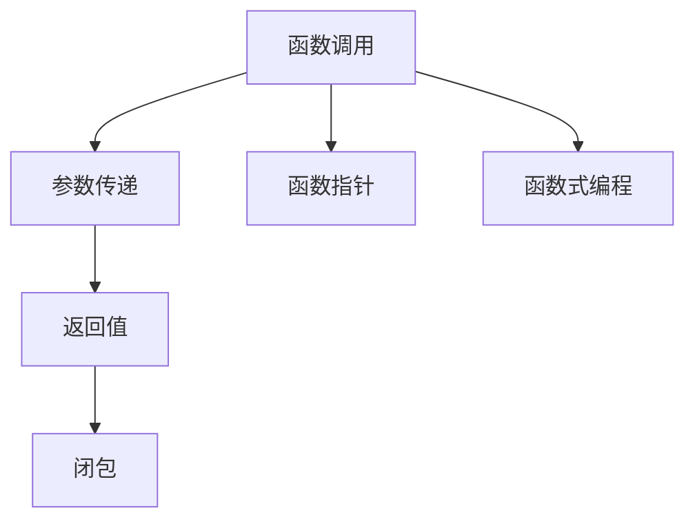
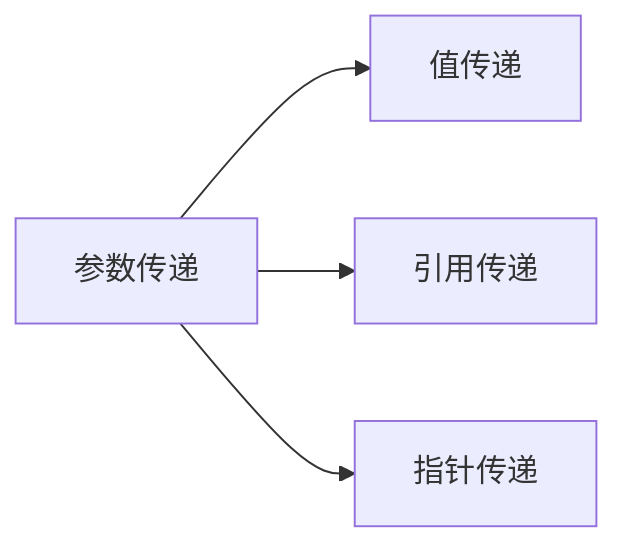
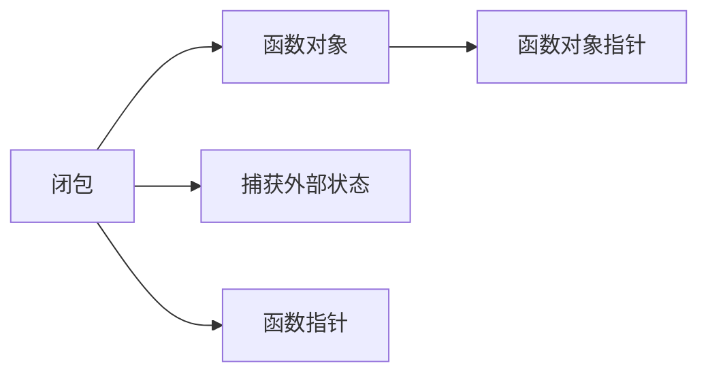
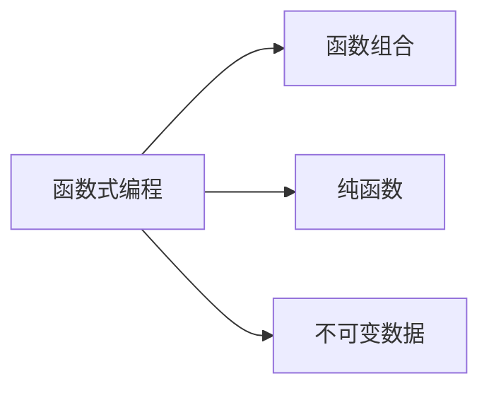
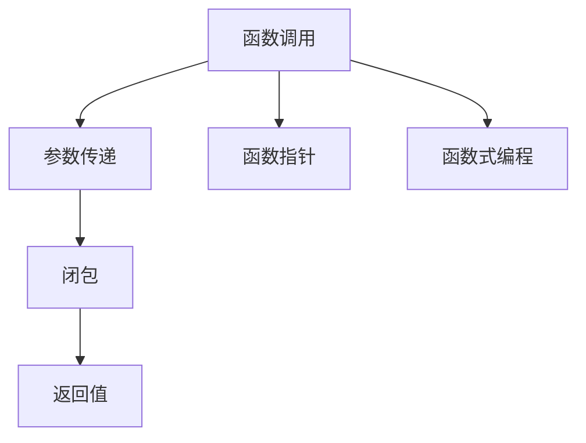

                 

# 新特性：Function Calling 介绍与实战

> 关键词：函数调用, 参数传递, 返回值, 闭包, 函数指针, 函数式编程

## 1. 背景介绍

### 1.1 问题由来
在编程中，函数调用是一个基本的概念，但是它所涉及的细节和最佳实践常常被忽视。随着软件开发的日益复杂，函数的正确使用和优化变得越来越重要。函数调用不仅可以提高代码的模块化和可读性，还能减少代码的重复和提高程序的性能。因此，深入了解函数调用的原理和实现方式，对于提升编程能力至关重要。

### 1.2 问题核心关键点
函数调用涉及到参数传递、返回值、闭包、函数指针等概念，这些概念之间相互关联，决定了函数调用的行为和性能。理解函数调用的机制可以帮助开发者编写更加高效、可维护的代码，同时也能避免一些常见的编程错误，如空指针引用、内存泄漏等问题。

### 1.3 问题研究意义
深入研究函数调用机制，对于提高编程技能、优化程序性能、提升代码可读性和可维护性具有重要意义。此外，理解函数调用的内部实现，还有助于深入学习编译器、解释器的原理，从而进一步提升技术水平。

## 2. 核心概念与联系

### 2.1 核心概念概述

为更好地理解函数调用的机制，本节将介绍几个关键概念：

- **函数调用**：在程序中，函数调用是指从调用函数的位置跳转到函数定义的地址，执行函数体内的代码。

- **参数传递**：函数调用时，传递给函数的参数可以是值、引用或指针。

- **返回值**：函数执行完毕后，返回给调用者的结果值。

- **闭包**：函数和其周围状态的组合，可以捕获外部变量的值，并在函数内部使用。

- **函数指针**：指向函数对象的指针，可以用于动态绑定函数。

- **函数式编程**：一种编程范式，将计算看作函数的求值过程，强调函数的组合和抽象。

这些概念之间的逻辑关系可以通过以下Mermaid流程图来展示：



这个流程图展示了一些核心概念及其之间的关系：

1. 函数调用是程序的执行起点。
2. 参数传递是函数调用中的关键操作。
3. 返回值是函数调用的结果。
4. 闭包可以捕获外部状态。
5. 函数指针可以动态绑定函数。
6. 函数式编程强调函数的组合和抽象。

### 2.2 概念间的关系

这些核心概念之间存在着紧密的联系，形成了函数调用的完整生态系统。下面我们通过几个Mermaid流程图来展示这些概念之间的关系。

#### 2.2.1 函数调用的基本流程


这个流程图展示了函数调用的基本流程：

1. 调用函数时，程序的执行流跳转到函数入口。
2. 在函数体内执行代码。
3. 函数执行完毕后，返回结果值。
4. 返回值被传递回调用位置。

#### 2.2.2 参数传递的方式



这个流程图展示了参数传递的三种方式：

1. 值传递：传递给函数的参数值在函数内部被复制一份，函数内部对参数的修改不会影响调用位置的参数。
2. 引用传递：传递给函数的参数引用被传递到函数内部，函数内部对参数的修改会影响调用位置的参数。
3. 指针传递：传递给函数的参数指针指向函数体内变量的地址，函数内部对变量的修改也会影响调用位置的变量。

#### 2.2.3 闭包和函数指针的关系



这个流程图展示了闭包和函数指针之间的关系：

1. 闭包是由函数和其周围状态组成的对象。
2. 函数指针指向函数对象。
3. 闭包可以捕获外部状态，函数指针可以动态绑定函数对象。

#### 2.2.4 函数式编程的特性



这个流程图展示了函数式编程的特性：

1. 函数式编程强调函数的组合和抽象。
2. 纯函数是只依赖输入，不改变外部状态的函数。
3. 不可变数据是不可修改的，用于保证程序的正确性和并发性。

### 2.3 核心概念的整体架构

最后，我们用一个综合的流程图来展示这些核心概念在函数调用中的整体架构：



这个综合流程图展示了从参数传递到闭包、返回值的整个过程，以及函数指针和函数式编程的概念。通过这些流程图，我们可以更清晰地理解函数调用的机制和各概念之间的联系。

## 3. 核心算法原理 & 具体操作步骤
### 3.1 算法原理概述

函数调用的原理涉及调用栈、寄存器、参数传递、返回值等概念。函数调用时，程序会将当前位置的上下文信息（如返回地址、局部变量等）保存在调用栈中，然后跳转到函数定义的地址，执行函数体内代码，并在函数执行完毕后将结果返回给调用位置，同时从调用栈中恢复上下文信息。

在函数体内，参数传递和返回值是两个重要步骤。参数传递可以使用值传递、引用传递和指针传递等方式，根据具体语言的语法和实现而定。返回值可以是任意类型，包括基本类型、结构体、对象等，用于向调用位置传递函数执行的结果。

### 3.2 算法步骤详解

函数调用的具体操作步骤可以归纳为以下几个步骤：

1. 生成调用栈帧（Frame）：保存当前函数的上下文信息，包括返回地址、局部变量、参数等。
2. 跳转到函数入口地址：根据函数名或函数指针，跳转到函数定义的地址。
3. 执行函数体：在函数体内执行代码，可以调用其他函数。
4. 保存返回值：将函数执行的结果保存到返回地址处。
5. 恢复调用栈：从调用栈中恢复上下文信息，继续执行调用位置的下一条指令。

以C语言为例，函数调用的过程如下：

1. 生成调用栈帧：
   ```c
   push {ebp};        // 保存返回地址
   mov ebp, esp;      // 设置ebp为当前栈顶
   sub esp, 0x18;     // 预留函数内部使用栈空间
   ```

2. 跳转到函数入口地址：
   ```c
   jmp func;         // 跳转到函数func的入口地址
   ```

3. 执行函数体：
   ```c
   // 函数体代码
   ```

4. 保存返回值：
   ```c
   mov eax, result;   // 将返回值保存在eax寄存器
   ```

5. 恢复调用栈：
   ```c
   mov esp, ebp;      // 恢复栈顶
   pop ebp;
   ret;              // 返回调用位置
   ```

### 3.3 算法优缺点

函数调用的优点包括：

1. 提高代码的可读性和模块化：函数可以将复杂的代码块分解为更小、更易于理解和维护的函数。
2. 避免代码重复：函数可以在多个位置调用，减少代码的重复和冗余。
3. 提高程序的性能：函数调用可以在编译时被优化，减少代码的执行时间。

函数调用的缺点包括：

1. 开销较大：函数调用的过程中需要保存和恢复上下文信息，会带来一定的开销。
2. 可能会影响性能：过多的函数调用会降低程序的性能，特别是递归调用时。
3. 需要注意参数传递和返回值的类型：参数传递和返回值的选择会影响代码的正确性和可维护性。

### 3.4 算法应用领域

函数调用广泛应用于各种编程语言和开发平台中，包括但不限于：

- **操作系统**：函数调用是操作系统内核调度和管理的基础。
- **编译器和解释器**：编译器和解释器将源代码翻译成机器码或解释执行，函数调用是代码翻译和执行的核心操作。
- **数据库**：数据库查询和操作通常是通过函数调用来实现的。
- **图形界面**：函数调用是图形界面处理用户输入和输出的重要手段。

此外，函数调用还广泛应用于软件开发工具和框架中，如IDE、框架、库等。

## 4. 数学模型和公式 & 详细讲解  
### 4.1 数学模型构建

函数调用的数学模型可以用调用栈（Call Stack）来表示。调用栈是一个先进后出（LIFO）的数据结构，用于保存函数的上下文信息。每次函数调用时，调用栈会生成一个新的栈帧（Frame），保存函数的局部变量、参数和返回地址等信息。函数执行完毕后，栈帧从调用栈中弹出，继续执行调用位置的下一条指令。

调用栈可以用如下形式表示：

```
top           bottom
-----------------------+---------------+
|  FunctionA+arg1+arg2  |  FunctionB    |
-----------------------+---------------+
|  FunctionB+arg3     |  FunctionC    |
-----------------------+---------------+
| ...                | ...          |
-----------------------+---------------+
```

其中，`FunctionA`、`FunctionB`、`FunctionC`等表示函数名，`arg1`、`arg2`、`arg3`等表示函数参数。

### 4.2 公式推导过程

函数调用的数学公式可以表示为：

$$
C = F(A, P)
$$

其中，`C`表示函数调用，`A`表示调用函数，`P`表示传递给函数的参数。

假设函数`A`有`n`个参数，每个参数的类型为`t`，函数体为`B`。函数调用的过程可以用以下步骤表示：

1. 生成调用栈帧：
   $$
   push\_span\_stack\_args(t_1, t_2, ..., t_n)
   $$

2. 跳转到函数入口地址：
   $$
   jmp\_address(A)
   $$

3. 执行函数体：
   $$
   F = A(B)
   $$

4. 保存返回值：
   $$
   result = F
   $$

5. 恢复调用栈：
   $$
   pop\_span\_stack\_args()
   $$

### 4.3 案例分析与讲解

以C语言为例，以下是一个函数调用的代码示例：

```c
int add(int a, int b) {
    return a + b;
}

int main() {
    int result = add(1, 2);
    return 0;
}
```

函数调用的过程如下：

1. 生成调用栈帧：
   ```c
   push {ebp};        // 保存返回地址
   mov ebp, esp;      // 设置ebp为当前栈顶
   sub esp, 0x18;     // 预留函数内部使用栈空间
   ```

2. 跳转到函数入口地址：
   ```c
   jmp add;         // 跳转到add函数的入口地址
   ```

3. 执行函数体：
   ```c
   int a = 1;
   int b = 2;
   int result = a + b; // 执行add函数体
   ```

4. 保存返回值：
   ```c
   mov eax, result;   // 将返回值保存在eax寄存器
   ```

5. 恢复调用栈：
   ```c
   mov esp, ebp;      // 恢复栈顶
   pop ebp;
   ret;              // 返回调用位置
   ```

## 5. 项目实践：代码实例和详细解释说明
### 5.1 开发环境搭建

在进行函数调用实践前，我们需要准备好开发环境。以下是使用C语言进行函数调用的开发环境配置流程：

1. 安装GCC编译器：从官网下载并安装GCC编译器，用于编译和链接C代码。

2. 安装Nano编辑工具：Nano是一个轻量级的文本编辑器，用于编写和编辑C代码。

3. 编写C代码：在文本编辑器中编写C代码，包括函数定义和调用。

4. 编译和运行C代码：使用GCC编译器编译C代码，生成可执行文件，使用命令行工具运行程序。

### 5.2 源代码详细实现

下面以C语言为例，给出一个函数调用的完整代码实现。

```c
#include <stdio.h>

int add(int a, int b) {
    return a + b;
}

int main() {
    int result = add(1, 2);
    printf("Result: %d\n", result);
    return 0;
}
```

### 5.3 代码解读与分析

让我们再详细解读一下关键代码的实现细节：

**add函数定义**：
- `int add(int a, int b)`：定义了一个返回整型值的`add`函数，接收两个整型参数。
- `{}`：函数体，包含函数执行的代码块。
- `return a + b;`：函数返回计算结果。

**main函数调用**：
- `int result = add(1, 2);`：调用`add`函数，并将结果保存在`result`变量中。
- `printf("Result: %d\n", result);`：打印函数的执行结果。

**编译和运行**：
- 使用GCC编译器编译代码：
  ```bash
  gcc -o program program.c
  ```

- 运行生成的可执行文件：
  ```bash
  ./program
  ```

### 5.4 运行结果展示

编译运行上述代码，输出结果为：

```
Result: 3
```

这表示`add`函数成功执行，计算了两个整数的和，并将结果返回给`main`函数。

## 6. 实际应用场景
### 6.1 函数式编程的运用

函数式编程是一种编程范式，强调函数的组合和抽象。函数式编程的函数调用通常不需要参数，而是通过组合函数来构建复杂的逻辑。以下是一个简单的函数式编程示例：

```c
#include <stdio.h>

void print_hello() {
    printf("Hello, world!\n");
}

int main() {
    print_hello();
    return 0;
}
```

在这个例子中，`print_hello`函数不需要参数，直接调用即可执行。函数式编程的函数调用通常用于构建复杂逻辑的代码块。

### 6.2 闭包的应用

闭包是一个函数和其周围状态的组合，可以捕获外部变量的值。以下是一个简单的闭包示例：

```c
#include <stdio.h>

void print_name() {
    int name = 100;
    printf("Name: %d\n", name);
}

int main() {
    void (*fn)() = print_name;
    fn();
    return 0;
}
```

在这个例子中，`print_name`函数定义了一个局部变量`name`，并在函数返回时打印该变量的值。在`main`函数中，`fn`变量指向`print_name`函数的地址，可以通过指针调用该函数，执行打印操作。

### 6.3 函数指针的使用

函数指针是一个指向函数对象的指针，可以用于动态绑定函数。以下是一个简单的函数指针示例：

```c
#include <stdio.h>

void print_hello() {
    printf("Hello, world!\n");
}

void print_bye() {
    printf("Goodbye!\n");
}

int main() {
    void (*fn)() = print_hello;
    fn();
    
    fn = print_bye;
    fn();
    
    return 0;
}
```

在这个例子中，`fn`变量先指向`print_hello`函数的地址，然后指向`print_bye`函数的地址，分别执行两个函数。函数指针的使用可以实现动态绑定函数的功能，提升代码的灵活性和可维护性。

### 6.4 函数调用的优化

函数调用的优化通常通过以下几种方式实现：

1. 内联函数：将函数体直接插入调用位置，避免函数调用的开销。

2. 函数重载：使用不同的函数名和参数列表，提高代码的可读性和可维护性。

3. 模板函数：使用C++中的模板函数，提高代码的通用性和复用性。

4. 宏定义：使用C语言中的宏定义，实现函数调用的简化和优化。

通过这些优化方式，可以提高函数的执行效率和代码的可维护性。

## 7. 工具和资源推荐
### 7.1 学习资源推荐

为了帮助开发者深入理解函数调用的原理和应用，这里推荐一些优质的学习资源：

1. 《C Primer Plus》：由Stephen Prata编写的C语言入门书籍，详细介绍了C语言的语法和函数调用的实现方式。

2. 《Effective C Programming》：由Paul McJones编写的C语言进阶书籍，提供了许多函数调用的优化技巧和最佳实践。

3. 《Functional Programming in C》：由Hans�llman编写的函数式编程书籍，介绍了函数式编程的原理和函数调用的方式。

4. 《The Art of Assembly Language Programming》：由Randall Hyde编写的汇编语言编程书籍，详细介绍了函数调用的内部实现和优化方法。

5. 《Code Complete》：由Steve McConnell编写的编程指南书籍，提供了函数调用的最佳实践和代码规范。

通过这些资源的学习，相信你一定能够深入理解函数调用的原理和应用，并应用于实际的编程实践中。

### 7.2 开发工具推荐

高效的开发离不开优秀的工具支持。以下是几款用于函数调用开发的常用工具：

1. Visual Studio：Microsoft提供的集成开发环境，支持C/C++等语言的开发和调试，是主流编程工具之一。

2. Eclipse：开源的集成开发环境，支持C/C++等语言的开发和调试，提供了丰富的插件和扩展。

3. Xcode：Apple提供的集成开发环境，支持C/C++等语言的开发和调试，适用于Mac平台。

4. IntelliJ IDEA：JetBrains提供的集成开发环境，支持C/C++等语言的开发和调试，提供了丰富的插件和扩展。

5. PyCharm：JetBrains提供的Python集成开发环境，支持Python等语言的开发和调试，提供了丰富的插件和扩展。

合理利用这些工具，可以显著提升函数调用的开发效率，加快创新迭代的步伐。

### 7.3 相关论文推荐

函数调用技术的不断发展得益于学界的持续研究。以下是几篇奠基性的相关论文，推荐阅读：

1. "The Call Graph of Machine Programs" by D.W.Denning：这篇经典论文详细介绍了函数调用的调用栈和调用图，是理解函数调用机制的必读之作。

2. "Functional Programming in Haskell" by Richard Bird：这篇论文介绍了Haskell中的函数式编程和函数调用方式，为理解函数式编程提供了深入的洞察。

3. "Dynamic Programming" by Richard Bellman：这篇论文介绍了动态规划算法，其中函数调用的递归实现是其重要组成部分。

4. "Compiling High-Performance Code Using Graphite" by Doug McIlroy：这篇论文介绍了Graphite编译器，是理解编译器中函数调用优化算法的经典之作。

这些论文代表了大语言模型微调技术的发展脉络。通过学习这些前沿成果，可以帮助研究者把握学科前进方向，激发更多的创新灵感。

除上述资源外，还有一些值得关注的前沿资源，帮助开发者紧跟函数调用技术的最新进展，例如：

1. GitHub热门项目：在GitHub上Star、Fork数最多的C/C++相关项目，往往代表了该技术领域的发展趋势和最佳实践，值得去学习和贡献。

2. arXiv论文预印本：人工智能领域最新研究成果的发布平台，包括大量尚未发表的前沿工作，学习前沿技术的必读资源。

3. 技术会议直播：如ACM SIGPLAN、IEEE TPDS等计算机体系结构和技术会议现场或在线直播，能够聆听到大佬们的前沿分享，开拓视野。

4. 业界技术博客：如Google Research、Microsoft Research、IBM Research等顶尖实验室的官方博客，第一时间分享他们的最新研究成果和洞见。

5. 技术期刊和会议论文：如ACM TOPLAS、IEEE TCS、OOPSLA等顶级期刊和会议，提供最前沿的研究成果和最新的技术动态。

总之，对于函数调用技术的学习和实践，需要开发者保持开放的心态和持续学习的意愿。多关注前沿资讯，多动手实践，多思考总结，必将收获满满的成长收益。

## 8. 总结：未来发展趋势与挑战

### 8.1 总结

本文对函数调用的机制和应用进行了全面系统的介绍。首先阐述了函数调用的背景和意义，明确了函数调用在提高代码可读性、模块化和性能优化方面的独特价值。其次，从原理到实践，详细讲解了函数调用的数学模型、公式推导和操作步骤，给出了函数调用任务开发的完整代码实例。同时，本文还广泛探讨了函数调用在函数式编程、闭包、函数指针等概念中的应用，展示了函数调用范式的巨大潜力。

通过本文的系统梳理，可以看到，函数调用是编程语言中不可或缺的一部分，对于提高程序的可读性、模块化和性能优化具有重要意义。函数调用不仅能够帮助开发者编写更加高效、可维护的代码，还能避免一些常见的编程错误，如空指针引用、内存泄漏等问题。

### 8.2 未来发展趋势

展望未来，函数调用的发展趋势包括以下几个方面：

1. 函数式编程的普及：函数式编程的函数调用方式将逐渐普及，提高代码的可读性和可维护性。

2. 函数调用的优化：随着编译器和解释器技术的进步，函数调用的优化将更加高效，减少开销和提升性能。

3. 闭包和函数指针的应用：闭包和函数指针将广泛应用于各种编程语言和开发平台中，提高代码的灵活性和可维护性。

4. 函数调用的新特性：未来的函数调用可能引入更多的新特性，如协程、异步函数等，提升代码的并发性和响应性。

5. 函数调用与AI的结合：函数调用和人工智能技术的结合将带来更多的创新应用，如智能编程助手、自动化测试等。

以上趋势凸显了函数调用技术的广阔前景。这些方向的探索发展，必将进一步提升函数调用的性能和应用范围，为软件开发带来新的动力。

### 8.3 面临的挑战

尽管函数调用技术已经取得了瞩目成就，但在迈向更加智能化、普适化应用的过程中，它仍面临着诸多挑战：

1. 函数调用开销：函数调用的开销较大，可能会影响程序的性能，特别是在递归调用时。

2. 函数调用的可维护性：函数调用可能会使代码变得复杂，难以维护。

3. 函数调用与多线程的协同：函数调用和多线程的协同需要仔细考虑，避免死锁和竞态条件等问题。

4. 函数调用的并发性：函数调用和并发编程需要结合使用，保证并发代码的正确性和性能。

5. 函数调用与动态语言的结合：函数调用和动态语言的结合需要解决动态绑定和函数重载等问题。

6. 函数调用的安全性：函数调用和代码注入等安全问题需要仔细考虑，避免恶意代码的注入和执行。

正视函数调用面临的这些挑战，积极应对并寻求突破，将使函数调用技术更加成熟，为软件工程的进步提供坚实的基础。

### 8.4 研究展望

面对函数调用所面临的挑战，未来的研究需要在以下几个方面寻求新的突破：

1. 函数调用的优化算法：研究和开发更高效的函数调用优化算法，减少开销，提升性能。

2. 函数调用的可维护性：研究和开发更易于维护的函数调用方式，提高代码的可读性和可维护性。

3. 函数调用的并发性：研究和开发更适用于并发编程的函数调用方式，提高并发代码的正确性和性能。

4. 函数调用的安全性：研究和开发更安全的函数调用方式，防止恶意代码的注入和执行。

这些研究方向的探索，必将引领函数调用技术迈向更高的台阶，为软件工程的进步提供坚实的基础。

## 9. 附录：常见问题与解答

**Q1：什么是函数调用？**

A: 函数调用是指从调用函数的位置跳转到函数定义的地址，执行函数体内的代码。函数调用包括参数传递和返回值，是编程语言中基本的操作。

**Q2：什么是参数传递？**

A: 参数传递是函数调用时，将函数参数的值、引用或指针传递给函数体的过程。参数传递的方式包括值传递、引用传递和指针传递，每种方式都有不同的使用场景。

**Q3：什么是闭包？**

A: 闭包是一个函数和其周围状态的组合，可以捕获外部变量的值。闭包可以用于保存状态，在函数内部使用外部变量的值。

**Q4：什么是函数指针？**

A: 函数指针是一个指向函数对象的指针，可以用于动态绑定函数。函数指针可以用于实现函数重载和动态调用函数等操作。

**Q5：什么是函数式编程？**

A: 函数式编程是一种编程范式，强调函数的组合和抽象。函数式编程的函数调用通常不需要参数，而是通过组合函数来构建复杂的逻辑。

**Q6：

