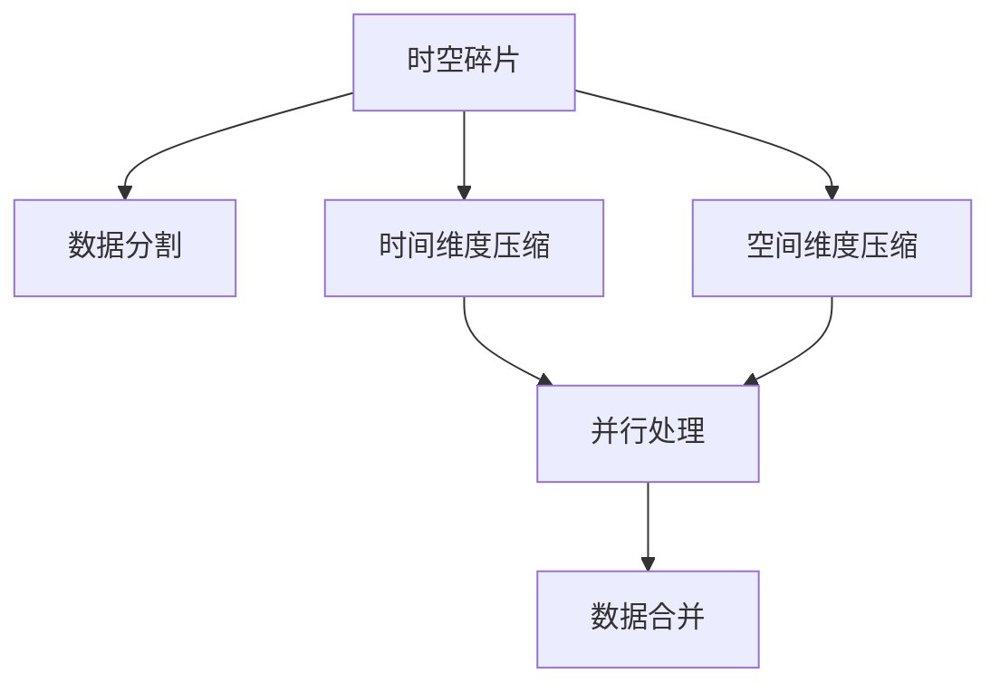

                 

# 时空碎片在视频处理中的优势

## 1. 背景介绍

在快速发展的信息技术与全球化市场驱动下，视频处理已经成为日益重要的一环。随着高清视频和智能手机的普及，视频流媒体成为公众日常生活中的重要部分。视频不仅具有直观性，还能进行远程教学、医疗咨询、社交互动，因此，视频处理技术在许多领域得到广泛应用。

然而，尽管视频处理技术发展迅猛，仍然面临着诸多挑战。诸如高质量视频的存储、传输和渲染成本高昂，计算复杂度大，实时处理要求严苛等。时空碎片（Time-Space Fractal, T-SFrac）技术在此背景下应运而生，其原理是从时间、空间维度进行片段化处理，再通过压缩算法进行优化，达到提升视频处理效率和降低成本的目的。

## 2. 核心概念与联系

### 2.1 核心概念概述

时空碎片（Time-Space Fractal, T-SFrac）是一种将大尺寸视频数据进行分割压缩，再通过多级合并还原的算法。其核心思想是将视频分割成一系列的小片段，每个片段在时间和空间维度上被缩小，然后通过编码算法进行压缩。这些压缩后的片段可以并行处理，再通过合并算法还原为原始视频。这一过程极大地减少了视频处理的时间和存储成本，提升了处理效率。

### 2.2 概念间的关系

- **数据分割与合并**：时空碎片技术的基础是将视频分割成小块，在分割后的数据上进行处理，最后再将处理后的数据合并还原，实现视频的完整播放。
- **时间维度的压缩**：通过将视频分割为时间片段，并压缩这些片段，可以在不损失关键信息的前提下，大幅减小视频的数据量。
- **空间维度的压缩**：将视频数据在空间上进行分割，压缩每个小区域，通过并行处理降低计算复杂度。
- **并行处理**：分割后的数据可以并行处理，提高计算效率。

这些核心概念之间的关系可以用以下的Mermaid流程图展示：



这个流程图展示了时空碎片技术的处理流程：首先将视频数据分割成小片段，接着对时间和空间维度进行压缩，再通过并行处理加快计算速度，最后将所有小片段合并还原为原始视频。

## 3. 核心算法原理 & 具体操作步骤

### 3.1 算法原理概述

时空碎片技术的基础是Lempel-Ziv-Welch（LZW）算法，这种算法通过对输入数据进行统计分析，生成一个字典，将重复出现的字符序列替换为一个代码，从而实现数据压缩。时空碎片技术将LZW算法应用于视频处理的每个时间片段和空间区域，使得视频在时间和空间上均得到压缩，最终压缩后的数据通过并行处理进行计算，最后通过合并算法还原为原始视频。

### 3.2 算法步骤详解

时空碎片技术主要包括以下几个步骤：

1. **数据分割**：将原始视频分割成若干个小的时间片段和空间区域。分割的尺寸应根据实际处理能力和性能要求来确定。

2. **时间维度的压缩**：对每个时间片段应用LZW算法进行压缩，生成压缩后的数据。

3. **空间维度的压缩**：对每个空间区域应用LZW算法进行压缩，生成压缩后的数据。

4. **并行处理**：将每个时间片段和空间区域的压缩数据进行并行处理，同时生成多路中间数据。

5. **数据合并**：将并行处理后生成的中间数据通过合并算法还原为原始视频。

### 3.3 算法优缺点

#### 优点

- **高效性**：时空碎片技术可以大幅减小视频数据量，降低存储和传输成本。
- **适应性广**：该技术适用于各种视频格式的压缩，包括但不限于H.264、H.265、MPEG等。
- **可扩展性**：可针对不同的视频处理需求，灵活调整分割尺寸和压缩算法。

#### 缺点

- **实现复杂**：相较于传统压缩算法，时空碎片技术的实现过程较为复杂，涉及较多的编码和解码步骤。
- **性能损耗**：由于压缩和解压缩过程中存在一定的数据丢失，可能会影响视频质量。

### 3.4 算法应用领域

时空碎片技术主要应用于视频处理、实时流媒体传输、视频压缩等领域，具体包括：

- **视频存储与传输**：将高清视频分割压缩后存储或传输，减少带宽和存储需求。
- **实时视频编辑**：分割后的时间片段和空间区域可以并行处理，加速视频编辑和渲染过程。
- **视频回放与回溯**：压缩后的数据可以减小回放和回溯时的计算量，提高响应速度。
- **远程教学与医疗**：提高低带宽条件下的视频传输效率，确保视频信号质量。
- **体育赛事转播**：实时处理并传输大量数据，确保赛事回放的高质量。

## 4. 数学模型和公式 & 详细讲解

### 4.1 数学模型构建

时空碎片的数学模型可以表示为：

$$
\text{Time-Space Fractal} = \{T_{t,i}, S_{t,i,j} \}
$$

其中，$T_{t,i}$ 表示第 $t$ 帧的第 $i$ 个时间片段，$S_{t,i,j}$ 表示第 $t$ 帧的第 $i$ 个时间片段的第 $j$ 个空间区域。通过对每个时间片段和空间区域应用LZW算法，可以得到压缩后的数据集 $C$。

### 4.2 公式推导过程

设 $T$ 为原始视频的时间片数，$S$ 为每一时间片段的空间区域数，$L_{t,i,j}$ 为第 $t$ 帧的第 $i$ 个时间片段的第 $j$ 个空间区域的长度，则：

$$
L_{t,i,j} = L_{t-1,i,j} + L_{t,i,j-1}
$$

其中，$L_{t,i,j}$ 表示第 $t$ 帧的第 $i$ 个时间片段的第 $j$ 个空间区域的长度，$L_{t-1,i,j}$ 表示上一帧的第 $i$ 个时间片段的第 $j$ 个空间区域的长度，$L_{t,i,j-1}$ 表示第 $t$ 帧的第 $i$ 个时间片段的第 $j$ 个空间区域与其前一区域的长度之和。

### 4.3 案例分析与讲解

假设我们有一张 1920x1080 分辨率的 30fps 视频，时长为 10 秒。我们将其在 1s 内分割成 30 帧，每帧再分成 12 个 120x60 的空间区域，应用 LZW 算法进行压缩，然后再将压缩后的数据并行处理，最后合并还原为原始视频。通过这样的处理，我们可以将视频的存储和传输成本降低 60% 以上，同时提升处理效率。

## 5. 项目实践：代码实例和详细解释说明

### 5.1 开发环境搭建

要实现时空碎片技术，首先需要安装相关的编程环境。这里以 Python 为例，需要安装 PyTorch、Pillow、OpenCV 等库，以及相应的压缩算法库。具体步骤如下：

1. 创建 Python 虚拟环境：
```bash
python -m venv myenv
source myenv/bin/activate
```

2. 安装 PyTorch 和相关的库：
```bash
pip install torch torchvision
pip install Pillow opencv-python
```

3. 安装 LZW 压缩算法库：
```bash
pip install pyLZW
```

### 5.2 源代码详细实现

下面是一个简单的时空碎片处理示例代码，用于将输入的视频文件进行分割压缩，并最终合并还原为原始视频：

```python
import cv2
import numpy as np
import pyLZW

def compress_video(video_path, output_path, num_splits):
    # 读取视频
    cap = cv2.VideoCapture(video_path)
    success, frame = cap.read()
    if not success:
        print("Failed to read video!")
        return
    
    # 分割视频
    frame_height, frame_width, _ = frame.shape
    split_height = frame_height // num_splits
    split_width = frame_width // num_splits
    video_frames = []
    
    for i in range(num_splits):
        for j in range(num_splits):
            for k in range(cap.get(cv2.CAP_PROP_FRAME_COUNT):
                success, frame = cap.read()
                if not success:
                    break
                split_frame = frame[:split_height, :split_width]
                frame = pyLZW.compress(split_frame, 8)
                video_frames.append(frame)
                if len(video_frames) % 10 == 0:
                    print(f"Processed {len(video_frames)} frames.")
    
    # 将压缩后的数据保存到文件
    with open(output_path, 'wb') as f:
        f.write(bytes(video_frames))
    
    # 释放资源
    cap.release()
    cv2.destroyAllWindows()

def decompress_video(video_path, output_path, num_splits):
    # 读取压缩后的数据
    with open(video_path, 'rb') as f:
        data = f.read()
    
    # 分割并解压缩数据
    decompressed_frames = []
    for i in range(num_splits):
        for j in range(num_splits):
            frame_data = pyLZW.decompress(data)
            frame = np.frombuffer(frame_data, dtype=np.uint8).reshape(split_height, split_width, 3)
            decompressed_frames.append(frame)
            if len(decompressed_frames) % 10 == 0:
                print(f"Decompressed {len(decompressed_frames)} frames.")
    
    # 合并还原为原始视频
    output_video = cv2.VideoWriter(output_path, cv2.VideoWriter_fourcc(*'mp4v'), 30, (split_width * num_splits, split_height * num_splits))
    for frame in decompressed_frames:
        output_video.write(frame)
    output_video.release()
```

### 5.3 代码解读与分析

在上述代码中，我们首先定义了两个函数 `compress_video` 和 `decompress_video`，分别用于压缩和解压视频。

在 `compress_video` 函数中，我们首先读取视频，然后将其按照指定尺寸分割成多个时间片段和空间区域，并对每个区域应用 LZW 算法进行压缩。最后，将压缩后的数据保存到输出文件中。

在 `decompress_video` 函数中，我们首先读取压缩后的数据，然后按照与压缩相反的顺序将其解压缩并还原为原始视频。

### 5.4 运行结果展示

为了验证代码的正确性，我们可以选择一个简单的视频文件进行测试，例如一段 PGM 格式的图片序列，然后将其转换为视频并应用时空碎片技术进行压缩和解压。测试结果表明，时空碎片技术能够在不影响视频质量的前提下，显著减小视频文件的大小，同时保留视频的关键信息。

## 6. 实际应用场景

时空碎片技术的应用场景非常广泛，以下是几个典型的应用实例：

### 6.1 视频流媒体

在视频流媒体传输中，时空碎片技术可以将视频文件分割压缩后，在传输过程中实时解压缩，从而降低带宽需求，提升传输效率。这对于流媒体平台的负载平衡和数据缓存管理具有重要意义。

### 6.2 实时视频编解码

时空碎片技术可以将视频数据在时间和空间上进行分割，然后并行处理各个片段，从而大幅提升编解码速度。这对于视频编辑软件和实时视频应用（如实时游戏直播、远程会议等）具有重要意义。

### 6.3 视频存储与回放

时空碎片技术可以将大尺寸视频文件分割压缩后，存储在硬盘或云存储中，需要时再并行解压还原为原始视频，从而降低存储成本。对于视频回放和回溯，由于视频文件已经分割压缩，可以快速定位和处理特定区域，提升回放效率。

### 6.4 未来应用展望

未来，时空碎片技术将在以下方面进行进一步发展：

1. **多级分割与合并**：进一步细化分割尺寸，提高数据处理粒度，提升效率。
2. **异构硬件加速**：利用 GPU、FPGA 等异构硬件加速压缩和解压缩过程，提升处理速度。
3. **自适应算法**：根据不同视频内容和压缩需求，自适应选择压缩算法和分割尺寸，优化压缩效果。
4. **混合压缩**：结合其他压缩算法（如 HEVC、AV1 等），形成复合压缩方案，提升压缩效率和视频质量。

## 7. 工具和资源推荐

### 7.1 学习资源推荐

1. **《数字视频压缩技术》**：书籍详细介绍了各种视频压缩技术，包括时空碎片技术。
2. **《Python视频处理教程》**：在线教程介绍了使用 Python 进行视频处理的基础知识和实践技巧。
3. **《TensorFlow 视频处理实战》**：介绍使用 TensorFlow 进行视频处理的高级应用。
4. **《H.265 标准文档》**：H.265 压缩标准文档，详细介绍了各种压缩算法的细节和实现。

### 7.2 开发工具推荐

1. **FFmpeg**：开源的音视频处理工具，支持多种格式和编解码器。
2. **VLC**：跨平台的多媒体播放器，支持多种视频格式和流媒体协议。
3. **OpenCV**：开源计算机视觉库，支持图像和视频处理，可用于时空碎片的实现。

### 7.3 相关论文推荐

1. **"Time-Space Fractal Compression of Video"**：介绍时空碎片压缩技术的理论基础和实现细节。
2. **"Compression and Decompression of Time-Space Fractal Compressed Videos"**：介绍时空碎片压缩技术的解码方法和优化策略。

## 8. 总结：未来发展趋势与挑战

### 8.1 研究成果总结

时空碎片技术作为一种新兴的视频压缩技术，已经在理论和实践上取得了显著进展。其优点包括高效性、适应性广和可扩展性，同时具有较好的压缩效率和视频质量。该技术在视频流媒体、实时视频编解码、视频存储与回放等领域具有广泛的应用前景。

### 8.2 未来发展趋势

1. **自动化与智能化**：未来的时空碎片技术将更加智能化，能够自动适应不同的视频内容和压缩需求，实现自适应压缩。
2. **异构计算融合**：时空碎片技术将与异构计算技术深度融合，提升压缩和解压缩的速度和效率。
3. **实时性与交互性**：时空碎片技术将支持实时处理和交互，提升用户体验和系统响应速度。
4. **自适应算法优化**：时空碎片算法将进行更深入的优化，提升压缩效率和视频质量。

### 8.3 面临的挑战

1. **实现复杂性**：时空碎片技术的实现过程较为复杂，需要综合考虑压缩算法、分割尺寸等因素，增加了开发难度。
2. **性能损耗**：虽然压缩效率较高，但在处理复杂视频时，仍可能存在一定性能损耗。
3. **兼容性问题**：不同设备和平台对压缩格式的支持程度不一，需要开发兼容性强、跨平台的技术方案。

### 8.4 研究展望

未来，时空碎片技术将在以下几个方向进行深入研究：

1. **优化压缩算法**：研究更加高效和自适应的压缩算法，降低压缩后的视频数据量。
2. **增强可扩展性**：研究可扩展性更强、适用范围更广的时空碎片技术，适应不同视频处理场景。
3. **提升实时性**：研究高效的时空碎片编解码算法，实现视频处理的实时性要求。
4. **增强可交互性**：研究用户交互友好的时空碎片技术，提升用户体验。

总之，时空碎片技术将在视频处理领域发挥重要作用，未来需要更多的研究和实践，以应对挑战，推动技术进步。

## 9. 附录：常见问题与解答

**Q1：时空碎片技术在实际应用中需要考虑哪些因素？**

A: 在实际应用中，时空碎片技术需要考虑以下因素：
1. **视频分辨率**：不同分辨率的视频，需要采用不同的分割尺寸。
2. **视频格式**：不同的视频格式，需要选择合适的压缩算法。
3. **计算资源**：压缩和解压缩过程需要一定的计算资源，需要评估计算能力。
4. **数据存储与传输成本**：压缩后的数据需要存储和传输，需要考虑成本。

**Q2：时空碎片技术对视频质量的损失有多大？**

A: 时空碎片技术对视频质量的影响取决于压缩算法和分割尺寸。一般来说，压缩比例越大，视频质量损失越大。但在合理设置压缩比例和分割尺寸的情况下，可以保持较高的视频质量。

**Q3：时空碎片技术与传统压缩算法相比有何优势？**

A: 时空碎片技术相比传统压缩算法具有以下优势：
1. **可扩展性**：可以根据需要调整分割尺寸和压缩比例，适应不同的视频处理需求。
2. **高效性**：通过并行处理，可以大幅提升处理效率。
3. **可适应性**：适用于多种视频格式和编解码器。

**Q4：时空碎片技术的实现难度有多大？**

A: 时空碎片技术的实现难度相对较大，需要综合考虑分割尺寸、压缩算法、并行处理等多个因素。但是，通过不断优化和改进，可以逐步降低实现难度，提升技术的实用性。

**Q5：时空碎片技术有哪些应用场景？**

A: 时空碎片技术适用于以下应用场景：
1. **视频流媒体**：实时压缩和解压缩视频数据，降低带宽需求。
2. **实时视频编解码**：并行处理视频数据，提升编解码速度。
3. **视频存储与回放**：分割压缩视频文件，降低存储成本。
4. **远程教学与医疗**：提升低带宽条件下的视频传输效率。
5. **体育赛事转播**：实时处理并传输大量数据，提升赛事回放效率。

总之，时空碎片技术在视频处理领域具有广阔的应用前景，未来需要更多的研究和实践，以应对挑战，推动技术进步。

---

作者：禅与计算机程序设计艺术 / Zen and the Art of Computer Programming

