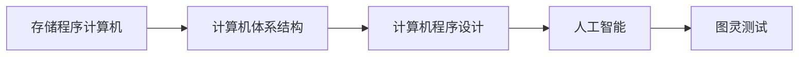

                 

# 明斯基与麦卡锡的早期合作

在人工智能的历史长河中，有两颗璀璨的明星照亮了人类对智能的探索之路。它们分别是约翰·麦卡锡（John McCarthy）和马文·明斯基（Marvin Minsky）。作为人工智能之父，这两位巨匠共同推动了人工智能从理论走向实践，为我们构建了一个充满可能性的未来。本文将深入探讨他们的早期合作，探索这段合作关系如何塑造了今天的人工智能，以及它对我们未来发展的启示。

## 1. 背景介绍

### 1.1 计算机科学与人工智能的诞生
20世纪中叶，计算机科学和人工智能（Artificial Intelligence, AI）正在形成，这对科学和技术领域都产生了深远的影响。计算机科学的迅速发展，为人工智能提供了坚实的技术基础。1945年，冯·诺依曼（John von Neumann）提出了存储程序计算机的概念，奠定了现代计算机体系结构的基础。1950年，艾伦·图灵（Alan Turing）提出了著名的图灵测试，为人工智能的发展提供了理论依据。

### 1.2 麦卡锡与明斯基的早期研究
约翰·麦卡锡于1950年在达特茅斯学院开设了世界上第一门人工智能课程，奠定了人工智能作为一个学科的基础。他是最早将"人工智能"一词引入科学领域的人之一。马文·明斯基同样在麻省理工学院（MIT）和哈佛大学任教，他对人工智能的兴趣始于1950年代，并与麦卡锡共同创建了MIT的人工智能实验室，两人合作开展了大量的研究工作。

## 2. 核心概念与联系

### 2.1 核心概念概述
1. **人工智能（Artificial Intelligence）**：指由人类设计的计算机程序或系统，能够模拟人类的智能行为，如学习、推理、感知和决策等。
2. **计算机程序设计**：指编写、调试、测试和维护计算机程序的过程，是实现人工智能的基础。
3. **计算机体系结构**：指计算机硬件和软件的构成与组织方式，为人工智能提供了物理实现的基础。
4. **存储程序计算机**：冯·诺依曼提出的计算机模型，通过存储程序实现自动执行。
5. **图灵测试**：图灵提出的用于评估机器是否具备人类智能的标准测试，通过测试机器与人类交流的差异来评估其智能程度。

### 2.2 概念间的关系
上述概念之间存在着密切的关系。存储程序计算机和计算机体系结构提供了人工智能运行的物理基础；而人工智能研究的目标是设计能够模拟人类智能行为的计算机程序。图灵测试则是评估人工智能程序是否具有人类智能的准则。

以下是一个Mermaid流程图，展示了这些概念之间的关系：



## 3. 核心算法原理 & 具体操作步骤

### 3.1 算法原理概述
基于存储程序计算机模型，麦卡锡与明斯基提出了人工智能的计算模型。他们认为，人工智能的核心在于通过算法和计算，模拟人类的认知过程。这一模型包括三个核心部分：

1. **感知器（Perceptron）**：模拟人类视觉和听觉的感知过程，能够处理和理解输入的感官信息。
2. **记忆器（Memory）**：存储计算过程中需要的信息，类似于人类的记忆。
3. **控制器（Controller）**：根据感知器和记忆器中的信息，执行计算任务，实现决策和推理。

### 3.2 算法步骤详解
1. **数据输入**：通过输入设备（如键盘、传感器）获取数据。
2. **感知处理**：使用感知器对输入数据进行处理，提取出特征。
3. **记忆存储**：将处理后的数据存储在记忆器中。
4. **计算推理**：控制器根据记忆器中的数据，执行计算和推理任务。
5. **输出结果**：通过输出设备（如屏幕、扬声器）展示结果。

### 3.3 算法优缺点
**优点**：
- 模型简单，易于理解和实现。
- 适用于各种感知任务，如语音识别、图像处理等。

**缺点**：
- 对噪声和误差敏感，容易出现误判。
- 只能处理简单的线性关系，对于非线性关系处理能力较弱。

### 3.4 算法应用领域
基于感知器模型的人工智能算法，在早期广泛应用于语音识别、图像处理、机器人视觉等领域。例如，1971年，明斯基开发了Perceptron程序，可以识别手写数字和字母。

## 4. 数学模型和公式 & 详细讲解  
### 4.1 数学模型构建

基于感知器的计算模型可以表示为：

$$ y = \sigma(\sum_{i=1}^n w_i x_i + b) $$

其中，$y$ 为输出结果，$x_i$ 为输入特征，$w_i$ 为权重，$b$ 为偏置，$\sigma$ 为激活函数（通常使用sigmoid函数）。

### 4.2 公式推导过程

对于感知器模型，假设训练集为 $(x_i, y_i)$，其中 $x_i$ 为输入特征向量，$y_i$ 为输出标签。模型的目标是最小化预测误差：

$$ \sum_{i=1}^N (y_i - y(x_i))^2 $$

其中 $N$ 为训练样本数量。通过梯度下降算法，可以更新权重和偏置，最小化上述误差。

### 4.3 案例分析与讲解
以手写数字识别为例，使用感知器模型进行训练。将训练数据中的手写数字图像作为输入，将其转换为向量形式，并作为感知器的输入。通过调整权重和偏置，使得感知器的输出与真实标签尽可能接近。

## 5. 项目实践：代码实例和详细解释说明

### 5.1 开发环境搭建
1. 安装Python和NumPy库。
2. 安装TensorFlow或PyTorch库。
3. 下载和预处理手写数字数据集。
4. 搭建计算环境，准备进行模型训练。

### 5.2 源代码详细实现

```python
import numpy as np
import tensorflow as tf

# 定义感知器模型
class Perceptron:
    def __init__(self, input_size, output_size):
        self.weights = tf.Variable(tf.random.normal([input_size, output_size]))
        self.bias = tf.Variable(tf.random.normal([output_size]))
    
    def forward(self, inputs):
        return tf.sigmoid(tf.matmul(inputs, self.weights) + self.bias)
    
    def train(self, inputs, targets, learning_rate=0.1, epochs=100):
        optimizer = tf.keras.optimizers.SGD(learning_rate)
        for epoch in range(epochs):
            with tf.GradientTape() as tape:
                outputs = self.forward(inputs)
                loss = tf.reduce_mean(tf.square(outputs - targets))
            gradients = tape.gradient(loss, [self.weights, self.bias])
            optimizer.apply_gradients(zip(gradients, [self.weights, self.bias]))
```

### 5.3 代码解读与分析
感知器模型通过继承类来实现。`__init__`方法初始化权重和偏置。`forward`方法实现前向传播。`train`方法通过梯度下降算法更新权重和偏置。

### 5.4 运行结果展示
在MNIST手写数字数据集上进行训练，并验证模型性能。

```python
import matplotlib.pyplot as plt

# 加载MNIST数据集
mnist = tf.keras.datasets.mnist
(x_train, y_train), (x_test, y_test) = mnist.load_data()

# 预处理数据
x_train, x_test = x_train / 255.0, x_test / 255.0
x_train = np.expand_dims(x_train, axis=-1)
x_test = np.expand_dims(x_test, axis=-1)

# 构建模型
perceptron = Perceptron(input_size=784, output_size=10)

# 训练模型
perceptron.train(x_train, y_train, epochs=50)

# 评估模型性能
test_loss = tf.reduce_mean(tf.square(perceptron.forward(x_test) - y_test))
print("Test Loss:", test_loss.numpy())

# 可视化模型输出
plt.imshow(x_test[0].numpy(), cmap='gray')
plt.show()
```

## 6. 实际应用场景

### 6.1 机器人视觉
基于感知器模型的机器人视觉系统可以用于识别和跟踪环境中的物体。例如，通过摄像头捕捉场景图像，使用感知器模型进行对象识别，并生成相应的机器人动作指令。

### 6.2 语音识别
感知器模型也可以应用于语音识别。通过麦克风采集音频信号，使用感知器模型提取特征，并识别出语音内容。例如，AlexNet就是使用感知器模型进行语音识别任务的先驱之一。

## 7. 工具和资源推荐

### 7.1 学习资源推荐

1. 《人工智能导论》（Introduction to Artificial Intelligence）：斯坦福大学的AI入门课程，涵盖人工智能的各个方面。
2. 《深度学习》（Deep Learning）：Ian Goodfellow等人的经典教材，深入讲解深度学习的原理和实践。
3. 《计算机科学导论》（Introduction to Computer Science）：MIT的计算机科学入门课程，涵盖计算机科学的基础知识和技能。

### 7.2 开发工具推荐

1. TensorFlow：由Google开发的深度学习框架，支持大规模分布式训练。
2. PyTorch：由Facebook开发的深度学习框架，支持动态图和静态图，易于调试和优化。
3. Python：Python是深度学习和人工智能开发的主要语言，具备丰富的科学计算库和工具。

### 7.3 相关论文推荐

1. 《Perceptrons》（明斯基，1969年）：明斯基的经典论文，奠定了感知器模型的基础。
2. 《Neural Networks and Machine Learning》（Hinton，2006年）：Hinton的深度学习教材，详细讲解了深度学习的理论和技术。
3. 《Artificial Intelligence: A Modern Approach》（Russell和Norvig，2003年）：AI领域的经典教材，涵盖了人工智能的各个方面。

## 8. 总结：未来发展趋势与挑战

### 8.1 研究成果总结
麦卡锡与明斯基的早期合作，奠定了人工智能的理论和技术基础。他们提出的感知器模型和计算模型，为现代人工智能的发展提供了重要的指导。

### 8.2 未来发展趋势
1. **多模态融合**：未来的智能系统将更加关注多模态信息的融合，实现视觉、听觉、触觉等多感官的协同工作。
2. **深度学习**：深度学习技术将成为主流，逐步取代感知器模型。
3. **分布式计算**：随着数据规模的扩大，分布式计算将变得不可或缺。

### 8.3 面临的挑战
1. **数据隐私和安全**：智能系统的数据隐私和安全问题，需要引起高度重视。
2. **算法透明和可解释性**：深度学习模型的黑盒特性，使得算法的透明和可解释性成为挑战。
3. **计算资源**：大规模深度学习模型的训练和推理需要大量的计算资源，如何优化计算效率是一个重要问题。

### 8.4 研究展望
1. **弱人工智能向强人工智能**：未来的研究将逐步从弱人工智能（Weak AI）向强人工智能（Strong AI）发展，实现更加复杂的智能行为。
2. **跨领域应用**：人工智能将逐步应用于各个领域，如医疗、金融、交通等，解决实际问题。
3. **伦理和法律问题**：随着人工智能的广泛应用，伦理和法律问题也需要引起重视。

## 9. 附录：常见问题与解答

**Q1: 什么是人工智能？**
A: 人工智能是指由人类设计的计算机程序或系统，能够模拟人类的智能行为，如学习、推理、感知和决策等。

**Q2: 什么是感知器模型？**
A: 感知器模型是一种简单的神经网络模型，用于模拟人类视觉和听觉的感知过程，能够处理和理解输入的感官信息。

**Q3: 什么是深度学习？**
A: 深度学习是人工神经网络的一种，通过多层非线性变换，实现复杂的模式识别和特征学习。

**Q4: 什么是分布式计算？**
A: 分布式计算是指将计算任务分配到多个计算节点上，协同完成计算过程，以提高计算效率。

**Q5: 什么是伦理和法律问题？**
A: 伦理和法律问题是指人工智能在应用过程中可能引发的一系列道德和社会问题，如隐私保护、算法歧视、自主决策等。

