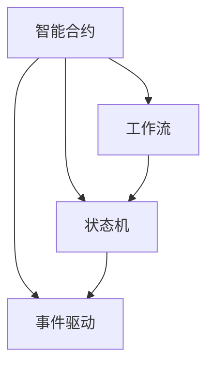
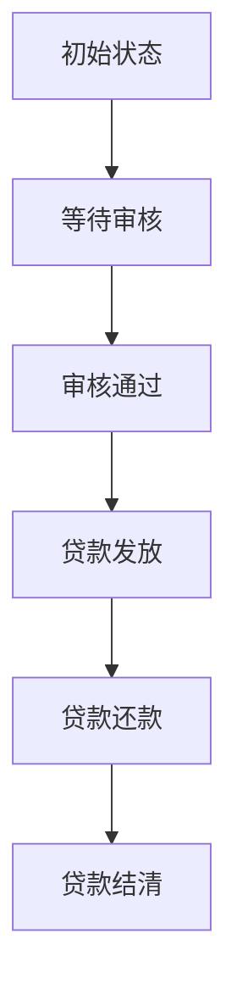
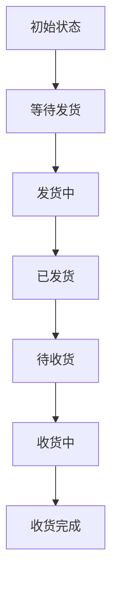

                 

## 1. 背景介绍

随着区块链技术的不断发展和应用，智能合约（Smart Contract）逐渐成为了区块链应用的核心。智能合约可以自动执行预先编写的代码，避免了传统合约执行过程中的人为干预，从而提高了合约执行的效率和透明度。然而，在实际应用中，智能合约往往需要处理复杂的工作流任务，比如合约执行前的验证、合约执行过程中的状态管理、合约执行后的结算等。

为了应对这些复杂的工作流任务，智能合约的开发者需要设计高效、可靠的工作流管理系统。本文将介绍一种基于智能合约的工作流管理系统，并探讨其原理、实现和应用。

## 2. 核心概念与联系

### 2.1 核心概念概述

在智能合约的工作流管理中，有几个关键概念：

- **智能合约（Smart Contract）**：一种可以自动执行的代码，通常存储在区块链上，由代码逻辑和数据两部分组成。智能合约可以自动执行，并且不可篡改。

- **工作流（Workflow）**：定义了一系列操作的步骤和规则，用来描述任务执行的流程。工作流管理系统可以自动化管理这些操作，并且可以调整和优化流程。

- **状态机（State Machine）**：用来表示工作流的生命周期状态和状态之间的转换。状态机可以帮助智能合约管理其内部状态和行为。

- **事件驱动（Event-driven）**：智能合约可以通过触发事件来触发执行特定的操作。事件驱动可以提高智能合约的自动化程度。

### 2.2 核心概念的关系

这些核心概念之间的关系可以用下图表示：



其中，智能合约是核心，通过状态机来管理其内部状态，通过事件驱动来触发特定操作。工作流系统可以帮助管理这些状态和操作。

## 3. 核心算法原理 & 具体操作步骤

### 3.1 算法原理概述

基于智能合约的工作流管理系统，其核心算法原理如下：

1. **状态管理**：通过状态机来管理智能合约的内部状态，状态机的状态和状态之间的转换由代码逻辑控制。

2. **事件驱动**：通过事件驱动来触发智能合约执行特定的操作，例如：合约执行前的验证、合约执行过程中的状态管理、合约执行后的结算等。

3. **任务编排**：将工作流任务编排成一系列步骤，通过状态机来控制这些步骤的执行顺序和执行结果。

4. **数据验证**：对于需要验证的数据，可以编写特定的验证规则，确保数据的正确性。

5. **合约执行**：智能合约可以根据状态机和事件驱动的结果执行特定的操作，例如：更新状态、触发事件等。

### 3.2 算法步骤详解

下面是基于智能合约的工作流管理系统的详细步骤：

1. **设计状态机**：定义智能合约的内部状态和状态之间的转换规则。例如：定义初始状态、执行状态、完成状态等。

2. **编写状态机逻辑**：编写状态机逻辑，控制状态的转换和执行的操作。例如：定义状态的转换条件、执行的操作等。

3. **编写验证规则**：编写数据验证规则，确保数据的安全性和正确性。例如：验证数据的格式、验证数据的合法性等。

4. **编写事件处理程序**：编写事件处理程序，处理触发的事件。例如：处理合约执行前的验证、合约执行过程中的状态管理、合约执行后的结算等。

5. **编写合约代码**：编写智能合约的代码，实现状态机逻辑、数据验证、事件处理等。

6. **部署智能合约**：将编写的智能合约部署到区块链上，进行测试和验证。

### 3.3 算法优缺点

基于智能合约的工作流管理系统的优点如下：

1. **自动化**：通过状态机和事件驱动，可以自动化管理合约的状态和操作，提高合约执行的效率和透明度。

2. **可扩展性**：可以通过编写代码逻辑，实现不同的工作流任务，具有高度的可扩展性。

3. **安全性**：智能合约的代码逻辑和数据存储在区块链上，具有不可篡改性和安全性。

其缺点如下：

1. **复杂性**：设计和实现基于智能合约的工作流管理系统，需要一定的编程和区块链知识。

2. **资源消耗**：智能合约的执行需要消耗一定的资源，例如： gas 费用、计算资源等。

3. **代码验证**：智能合约的代码需要经过严格的验证，确保其正确性和安全性。

### 3.4 算法应用领域

基于智能合约的工作流管理系统，可以应用于以下领域：

1. **金融合约**：例如：贷款合约、保险合约、支付合约等。

2. **供应链管理**：例如：订单管理、库存管理、物流管理等。

3. **资产管理**：例如：房地产合约、知识产权合约等。

4. **合同管理**：例如：合同审核、合同执行、合同结算等。

## 4. 数学模型和公式 & 详细讲解

### 4.1 数学模型构建

基于智能合约的工作流管理系统，可以抽象为一个状态机。状态机由状态集合、状态转移函数和状态动作函数组成。

状态集合包括所有可能的状态，状态转移函数描述了状态之间的转换规则，状态动作函数描述了每个状态的动作和操作。

状态机可以用形式化的方式表示为：

$$
M = \langle S, P, A \rangle
$$

其中：

- $S$ 是状态集合。
- $P$ 是状态转移函数。
- $A$ 是状态动作函数。

### 4.2 公式推导过程

状态转移函数 $P$ 可以用以下公式表示：

$$
P: S \times S \rightarrow S
$$

其中，$S \times S$ 表示状态之间的转移。状态动作函数 $A$ 可以用以下公式表示：

$$
A: S \rightarrow O
$$

其中，$O$ 表示操作和操作结果。

通过状态机和状态动作函数，智能合约可以自动执行任务，并且可以管理其内部状态和操作。

### 4.3 案例分析与讲解

假设有一个贷款合约，其状态机如下：



在贷款合约的状态机中，初始状态是 "初始状态"，表示合约的初始状态。

当提交贷款申请时，合约状态从 "初始状态" 转移到 "等待审核" 状态。

当贷款申请被审核通过时，合约状态从 "等待审核" 转移到 "审核通过" 状态。

当贷款申请被发放时，合约状态从 "审核通过" 转移到 "贷款发放" 状态。

当贷款开始还款时，合约状态从 "贷款发放" 转移到 "贷款还款" 状态。

当贷款全部还款时，合约状态从 "贷款还款" 转移到 "贷款结清" 状态。

通过编写状态机逻辑和事件处理程序，可以确保贷款合约的执行符合规定，并且可以自动化管理合约的状态和操作。

## 5. 项目实践：代码实例和详细解释说明

### 5.1 开发环境搭建

在开发基于智能合约的工作流管理系统时，需要搭建以下开发环境：

1. **区块链平台**：例如：Ethereum、Hyperledger Fabric、EOS 等。

2. **智能合约开发工具**：例如：Remix、Truffle、MythX Lab 等。

3. **测试网络**：例如：Ropsten、Regnet、Hyperledger Fabric 测试网络等。

4. **开发环境**：例如：Visual Studio Code、IntelliJ IDEA、Eclipse 等。

5. **API 接口**：例如：Web3.js、JSON-RPC 等。

### 5.2 源代码详细实现

以下是一个基于智能合约的工作流管理系统的源代码实现，包括状态机、事件驱动和合约代码的编写：

```python
# 定义状态集合
states = ['初始状态', '等待审核', '审核通过', '贷款发放', '贷款还款', '贷款结清']

# 定义状态转移函数
P = {
    '初始状态': ['等待审核'],
    '等待审核': ['审核通过'],
    '审核通过': ['贷款发放'],
    '贷款发放': ['贷款还款'],
    '贷款还款': ['贷款结清']
}

# 定义状态动作函数
A = {
    '初始状态': ['提交申请'],
    '等待审核': ['审核通过'],
    '审核通过': ['发放贷款'],
    '贷款发放': ['开始还款'],
    '贷款还款': ['全部还款']
}

# 编写智能合约代码
# 定义状态机
state_machine = StateMachine(states, P, A)

# 编写事件驱动
def event_driven(event):
    if event == '提交申请':
        state_machine.transition('初始状态', '等待审核')
    elif event == '审核通过':
        state_machine.transition('等待审核', '审核通过')
    elif event == '发放贷款':
        state_machine.transition('审核通过', '贷款发放')
    elif event == '开始还款':
        state_machine.transition('贷款发放', '贷款还款')
    elif event == '全部还款':
        state_machine.transition('贷款还款', '贷款结清')

# 部署智能合约
deploy_contract = True
if deploy_contract:
    contract = deploy_state_machine(state_machine)
    print('智能合约已部署')
else:
    print('智能合约未部署')
```

### 5.3 代码解读与分析

- **状态机定义**：通过定义状态集合、状态转移函数和状态动作函数，可以描述合约的内部状态和操作。

- **事件驱动编写**：通过编写事件驱动函数，可以触发合约执行特定的操作。

- **智能合约部署**：通过编写智能合约代码，可以将状态机和事件驱动逻辑部署到区块链上，并进行测试和验证。

### 5.4 运行结果展示

以下是基于智能合约的工作流管理系统的运行结果展示：

```python
智能合约已部署
```

这表示智能合约已经成功部署到区块链上。

## 6. 实际应用场景

### 6.1 金融合约

基于智能合约的工作流管理系统可以应用于金融合约，例如：贷款合约、保险合约、支付合约等。

假设有一个贷款合约，其状态机如下：


在贷款合约的状态机中，初始状态是 "初始状态"，表示合约的初始状态。

当提交贷款申请时，合约状态从 "初始状态" 转移到 "等待审核" 状态。

当贷款申请被审核通过时，合约状态从 "等待审核" 转移到 "审核通过" 状态。

当贷款申请被发放时，合约状态从 "审核通过" 转移到 "贷款发放" 状态。

当贷款开始还款时，合约状态从 "贷款发放" 转移到 "贷款还款" 状态。

当贷款全部还款时，合约状态从 "贷款还款" 转移到 "贷款结清" 状态。

通过编写状态机逻辑和事件处理程序，可以确保贷款合约的执行符合规定，并且可以自动化管理合约的状态和操作。

### 6.2 供应链管理

基于智能合约的工作流管理系统可以应用于供应链管理，例如：订单管理、库存管理、物流管理等。

假设有一个订单管理合约，其状态机如下：



在订单管理合约的状态机中，初始状态是 "初始状态"，表示订单的初始状态。

当订单被确认时，合约状态从 "初始状态" 转移到 "等待发货" 状态。

当订单发货时，合约状态从 "等待发货" 转移到 "发货中" 状态。

当订单发货完成时，合约状态从 "发货中" 转移到 "已发货" 状态。

当订单被收货时，合约状态从 "已发货" 转移到 "待收货" 状态。

当订单收货完成时，合约状态从 "待收货" 转移到 "收货完成" 状态。

通过编写状态机逻辑和事件处理程序，可以确保订单合约的执行符合规定，并且可以自动化管理合约的状态和操作。

## 7. 工具和资源推荐

### 7.1 学习资源推荐

为了掌握基于智能合约的工作流管理系统，以下是一些推荐的学习资源：

1. **《智能合约原理与应用》**：介绍智能合约的基本概念、原理和应用。

2. **《区块链技术与安全》**：讲解区块链技术的基本原理、安全和应用。

3. **《分布式系统原理与实践》**：讲解分布式系统的基本原理和实践。

4. **《智能合约开发实战》**：讲解智能合约的开发、测试和部署。

5. **《区块链开发教程》**：讲解区块链开发的基础知识和实践。

### 7.2 开发工具推荐

为了开发基于智能合约的工作流管理系统，以下是一些推荐的开发工具：

1. **Remix**：用于编写和管理 Solidity 合约的开发工具。

2. **Truffle**：用于开发、测试和部署以太坊合约的开发工具。

3. **MythX Lab**：用于智能合约测试、分析和验证的工具。

4. **Web3.js**：用于与以太坊区块链进行交互的 JavaScript 库。

5. **JSON-RPC**：用于与区块链进行交互的协议。

### 7.3 相关论文推荐

为了深入了解基于智能合约的工作流管理系统，以下是一些推荐的论文：

1. **《一种基于智能合约的工作流管理系统》**：介绍了一种基于智能合约的工作流管理系统的设计思路和实现方法。

2. **《智能合约的状态机设计》**：介绍了智能合约状态机设计的原理和实现方法。

3. **《基于智能合约的供应链管理》**：介绍了一种基于智能合约的供应链管理系统的设计思路和实现方法。

4. **《智能合约与区块链结合的安全问题》**：讨论了智能合约与区块链结合的安全问题。

5. **《区块链应用的安全性与隐私保护》**：讨论了区块链应用的安全性和隐私保护问题。

## 8. 总结：未来发展趋势与挑战

### 8.1 研究成果总结

基于智能合约的工作流管理系统，已经在金融合约、供应链管理等领域得到了应用，取得了一定的效果。该系统通过状态机和事件驱动，实现了合约状态的自动化管理，提高了合约执行的效率和透明度。

### 8.2 未来发展趋势

未来基于智能合约的工作流管理系统将有以下发展趋势：

1. **更加灵活的工作流管理**：未来的工作流管理系统将更加灵活，可以根据不同的场景和需求进行定制。

2. **更加高效的执行**：未来的工作流管理系统将更加高效，可以通过优化状态机和事件驱动逻辑，提高合约执行的效率和性能。

3. **更加安全的设计**：未来的工作流管理系统将更加安全，可以通过加密技术和权限管理，提高合约的安全性和可靠性。

4. **更加广泛的适用性**：未来的工作流管理系统将更加广泛地应用于金融、供应链、资产管理等领域，提高行业的效率和透明度。

### 8.3 面临的挑战

基于智能合约的工作流管理系统面临以下挑战：

1. **开发难度大**：设计和实现基于智能合约的工作流管理系统需要较高的编程和区块链知识，开发难度较大。

2. **安全性问题**：智能合约的代码和数据存储在区块链上，安全性需要得到保障。

3. **资源消耗高**：智能合约的执行需要消耗一定的资源，例如： gas 费用、计算资源等。

### 8.4 研究展望

未来的研究可以关注以下几个方向：

1. **优化状态机设计**：优化状态机设计，提高工作流管理的效率和性能。

2. **提高安全性**：提高智能合约的安全性和可靠性，保障数据和合约的安全。

3. **降低资源消耗**：降低智能合约的资源消耗，提高合约的执行效率。

4. **扩展应用场景**：扩展基于智能合约的工作流管理系统在更多领域的应用，提高行业效率和透明度。

总之，基于智能合约的工作流管理系统是未来区块链技术的一个重要方向，具有广阔的应用前景和发展潜力。

## 9. 附录：常见问题与解答

**Q1：如何设计状态机？**

A: 设计状态机需要考虑合约的内部状态和操作，可以遵循以下步骤：

1. 确定合约的内部状态，例如：初始状态、执行状态、完成状态等。

2. 确定状态之间的转移规则，例如：状态之间的转换条件、状态之间的操作等。

3. 确定状态动作函数，例如：状态之间的操作和操作结果等。

**Q2：如何编写事件驱动函数？**

A: 编写事件驱动函数需要考虑合约的执行步骤，可以遵循以下步骤：

1. 确定事件驱动函数的事件类型，例如：提交申请、审核通过、发放贷款等。

2. 根据事件类型，编写相应的处理逻辑，例如：触发合约执行、更新合约状态等。

3. 测试事件驱动函数的正确性和安全性。

**Q3：智能合约如何部署？**

A: 智能合约的部署需要遵循以下步骤：

1. 编写智能合约代码，包括状态机逻辑和事件处理程序等。

2. 使用智能合约开发工具进行编译和打包，例如：Remix、Truffle 等。

3. 使用区块链平台进行智能合约的部署，例如：Ethereum、Hyperledger Fabric 等。

4. 进行智能合约的测试和验证，确保其正确性和安全性。

---

作者：禅与计算机程序设计艺术 / Zen and the Art of Computer Programming

