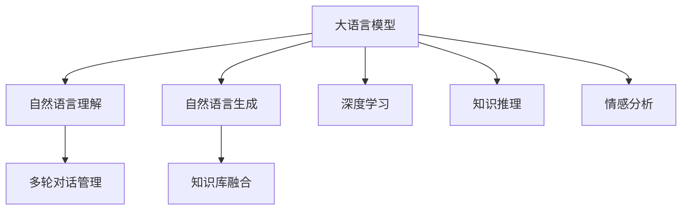
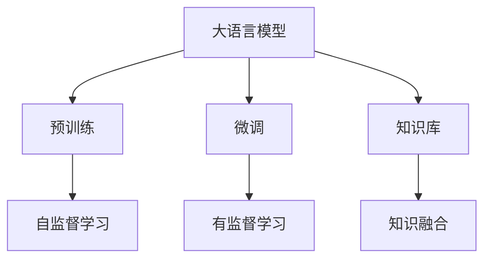
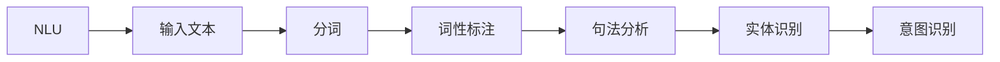
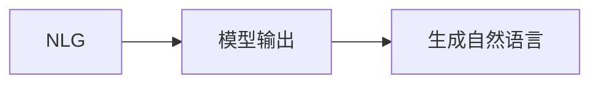
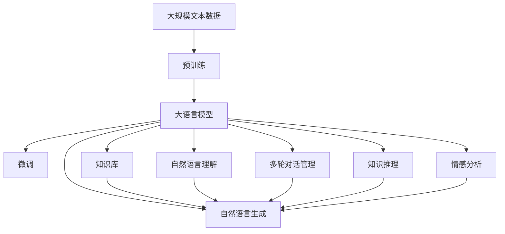

                 

# 智能对话系统中的AI LLM：突破交互的界限

> 关键词：
1. 人工智能（AI）
2. 大型语言模型（LLM）
3. 智能对话系统
4. 自然语言处理（NLP）
5. 深度学习
6. 对话生成
7. 用户交互

## 1. 背景介绍

### 1.1 问题由来

在数字化时代的浪潮中，人类与机器之间的交互日益频繁。无论是智能客服、虚拟助手，还是自动翻译、文本摘要，智能对话系统正以越来越高的频率进入人们的日常生活和工作。然而，传统的对话系统往往依赖于规则引擎、模板匹配等手段，难以灵活应对复杂的自然语言交互。

随着深度学习和大语言模型的崛起，基于自然语言理解的对话系统迎来了新的突破。这些系统不再依赖硬编码的规则，而是通过大量无监督学习的文本数据，学会了从语言模型中提取上下文信息，生成自然流畅的对话。其中，大语言模型（Large Language Models, LLMs）作为当前NLP领域最炙手可热的技术，以其强大的语言理解和生成能力，推动了智能对话系统的快速发展。

### 1.2 问题核心关键点

智能对话系统中的AI LLM主要通过以下几个核心关键点来实现交互的突破：

- **自然语言理解（NLU）**：大语言模型通过学习大规模无标签文本数据，掌握了语言的基本结构和规律，能够理解人类自然语言的语法、语义和情感等特征。
- **对话生成（NLG）**：在理解用户意图的基础上，大语言模型能够生成符合语法规则和语境的自然语言响应，使得系统能够与用户进行自然流畅的对话。
- **多轮对话管理**：智能对话系统不仅需要理解单轮对话，还需要在多轮对话中维持语境连贯性和信息一致性，大语言模型可以通过记忆化、状态跟踪等技术实现这一目标。
- **知识库融合**：为了增强系统的实用性和可信度，智能对话系统通常会引入知识库，大语言模型可以通过预训练和微调将知识库中的信息融入到对话中，提升系统的知识和常识推理能力。
- **用户反馈机制**：智能对话系统还需要通过用户反馈来不断优化和提升自身性能，大语言模型可以通过学习用户交互数据，调整自身的生成策略和对话策略。

### 1.3 问题研究意义

研究大语言模型在智能对话系统中的应用，对于提升对话系统的交互体验、增强系统的实用性和智能性、加速NLP技术的产业化进程，具有重要意义：

1. **提升用户体验**：智能对话系统通过深度学习和大语言模型的自然语言理解与生成能力，可以实现自然流畅、上下文连贯的对话，大大提升用户的交互体验。
2. **增强系统智能**：大语言模型通过学习大规模文本数据，掌握了丰富的语言知识和常识，能够进行复杂的知识推理和情感分析，从而提升系统的智能化水平。
3. **加速技术产业化**：相比于传统的规则引擎和模板匹配技术，基于大语言模型的智能对话系统具有更高的灵活性和可扩展性，可以更快速地应用于各种场景，加速技术落地。
4. **带来技术创新**：大语言模型带来的自然语言理解和生成技术，促进了NLP领域的一系列技术创新，如零样本学习、少样本学习、因果推理等，为智能对话系统提供了更多可能性。
5. **赋能产业升级**：智能对话系统在智能客服、医疗咨询、金融顾问等领域的广泛应用，推动了传统行业的数字化转型，带来了业务流程的优化和效率的提升。

## 2. 核心概念与联系

### 2.1 核心概念概述

为更好地理解大语言模型在智能对话系统中的应用，本节将介绍几个密切相关的核心概念：

- **大语言模型（LLMs）**：以自回归（如GPT）或自编码（如BERT）模型为代表的大规模预训练语言模型。通过在大规模无标签文本语料上进行预训练，学习通用的语言表示，具备强大的语言理解和生成能力。

- **自然语言理解（NLU）**：指将人类自然语言转换为机器可理解的形式，包括分词、词性标注、句法分析、实体识别、意图识别等任务。

- **自然语言生成（NLG）**：指将机器理解的形式转换为人类可理解的自然语言，包括文本生成、对话生成、摘要生成等任务。

- **对话生成（Dialogue Generation）**：指在多轮对话中，机器能够生成符合语法规则和语境的自然语言响应，从而实现与用户的自然交互。

- **知识库（Knowledge Base）**：指包含各类领域知识、事实、规则等信息的知识库，用于增强对话系统的实用性和可信度。

- **深度学习（Deep Learning）**：指通过构建深度神经网络，从数据中自动学习特征和模型，以解决复杂问题。

- **知识推理（Knowledge Reasoning）**：指在对话中，机器能够根据知识库中的信息进行推理，解答用户的查询或提出建议。

- **情感分析（Sentiment Analysis）**：指分析文本中表达的情感倾向，如正面、中性或负面。

这些核心概念之间的逻辑关系可以通过以下Mermaid流程图来展示：



这个流程图展示了大语言模型在智能对话系统中的核心作用和关键流程：

1. 大语言模型通过自然语言理解，将用户输入转换为机器可理解的形式。
2. 通过自然语言生成，大语言模型生成符合语法规则和语境的自然语言响应。
3. 通过多轮对话管理，大语言模型维持对话连贯性和信息一致性。
4. 通过知识库融合，大语言模型利用知识库中的信息进行推理和建议。
5. 通过深度学习，大语言模型从数据中自动学习特征和模型。
6. 通过知识推理，大语言模型根据知识库中的信息进行推理。
7. 通过情感分析，大语言模型分析文本中的情感倾向。

### 2.2 概念间的关系

这些核心概念之间存在着紧密的联系，形成了智能对话系统的完整生态系统。下面我通过几个Mermaid流程图来展示这些概念之间的关系。

#### 2.2.1 大语言模型的学习范式



这个流程图展示了大语言模型的学习和应用范式：

1. 大语言模型通过预训练获得基础能力。
2. 在特定领域任务上，通过微调优化模型的性能。
3. 在对话系统中，引入知识库，增强系统的实用性和可信度。
4. 预训练主要采用自监督学习方法，学习语言的基本结构和规律。
5. 微调主要采用有监督学习方法，通过特定领域的标注数据优化模型的特定任务性能。
6. 知识库融合是通过深度学习将知识库中的信息融入到对话中。

#### 2.2.2 自然语言理解的原理



这个流程图展示了自然语言理解的基本流程：

1. 输入文本经过分词、词性标注、句法分析等步骤，转换为机器可理解的形式。
2. 通过实体识别和意图识别，系统能够理解用户的意图和输入的具体信息。

#### 2.2.3 自然语言生成的原理



这个流程图展示了自然语言生成的基本流程：

1. 模型输出表示机器生成的文本，经过自然语言生成器，生成符合语法规则和语境的自然语言。

### 2.3 核心概念的整体架构

最后，我们用一个综合的流程图来展示这些核心概念在大语言模型在智能对话系统中的应用：



这个综合流程图展示了从预训练到微调，再到多轮对话管理、知识推理和情感分析的完整过程。大语言模型首先在大规模文本数据上进行预训练，然后通过微调优化模型的特定任务性能，引入知识库增强系统的实用性和可信度，通过自然语言理解和生成实现与用户的自然交互，通过多轮对话管理维持对话连贯性和信息一致性，通过知识推理和情感分析提供更准确、更富情感的响应。通过这些核心概念的协同作用，大语言模型在智能对话系统中实现了交互的突破，推动了智能对话技术的发展。

## 3. 核心算法原理 & 具体操作步骤
### 3.1 算法原理概述

智能对话系统中的AI LLM主要基于深度学习和大语言模型，通过自然语言理解、自然语言生成、知识推理等技术，实现了与用户的自然交互。其核心思想是通过大量无监督学习的文本数据，学习到语言的基本结构和规律，然后在特定任务上通过微调优化模型的性能，从而实现与用户的自然交互。

形式化地，假设大语言模型为 $M_{\theta}$，其中 $\theta$ 为模型参数。给定对话系统中的任务 $T$ 的对话数据集 $D=\{(x_i, y_i)\}_{i=1}^N$，其中 $x_i$ 为输入文本，$y_i$ 为系统生成的自然语言响应。微调的目标是找到新的模型参数 $\hat{\theta}$，使得：

$$
\hat{\theta}=\mathop{\arg\min}_{\theta} \mathcal{L}(M_{\theta},D)
$$

其中 $\mathcal{L}$ 为针对对话系统设计的损失函数，用于衡量模型预测输出与真实标签之间的差异。常见的损失函数包括交叉熵损失、均方误差损失等。

通过梯度下降等优化算法，微调过程不断更新模型参数 $\theta$，最小化损失函数 $\mathcal{L}$，使得模型输出逼近真实标签。由于 $\theta$ 已经通过预训练获得了较好的初始化，因此即便在少量标注样本上微调，也能较快收敛到理想的模型参数 $\hat{\theta}$。

### 3.2 算法步骤详解

智能对话系统中的AI LLM基于监督学习的大语言模型微调方法，一般包括以下几个关键步骤：

**Step 1: 准备预训练模型和对话数据集**
- 选择合适的预训练语言模型 $M_{\theta}$ 作为初始化参数，如 GPT、BERT 等。
- 准备对话系统中的对话数据集 $D$，划分为训练集、验证集和测试集。一般要求对话数据与预训练数据的分布不要差异过大。

**Step 2: 添加任务适配层**
- 根据对话任务类型，在预训练模型顶层设计合适的输出层和损失函数。
- 对于对话生成任务，通常在顶层添加解码器，输出概率分布，并以负对数似然为损失函数。
- 对于对话匹配任务，可以添加二分类器，输出判断是否匹配的概率，并以交叉熵损失函数进行训练。

**Step 3: 设置微调超参数**
- 选择合适的优化算法及其参数，如 AdamW、SGD 等，设置学习率、批大小、迭代轮数等。
- 设置正则化技术及强度，包括权重衰减、Dropout、Early Stopping 等。
- 确定冻结预训练参数的策略，如仅微调顶层，或全部参数都参与微调。

**Step 4: 执行梯度训练**
- 将训练集对话数据分批次输入模型，前向传播计算损失函数。
- 反向传播计算参数梯度，根据设定的优化算法和学习率更新模型参数。
- 周期性在验证集上评估模型性能，根据性能指标决定是否触发 Early Stopping。
- 重复上述步骤直到满足预设的迭代轮数或 Early Stopping 条件。

**Step 5: 测试和部署**
- 在测试集上评估微调后模型 $M_{\hat{\theta}}$ 的性能，对比微调前后的效果。
- 使用微调后的模型对新对话进行推理预测，集成到实际的应用系统中。
- 持续收集新的对话数据，定期重新微调模型，以适应对话场景的变化。

以上是基于监督学习微调大语言模型的一般流程。在实际应用中，还需要针对具体对话任务的特点，对微调过程的各个环节进行优化设计，如改进训练目标函数，引入更多的正则化技术，搜索最优的超参数组合等，以进一步提升模型性能。

### 3.3 算法优缺点

智能对话系统中的AI LLM基于监督学习的大语言模型微调方法具有以下优点：

1. 简单高效。只需准备少量标注对话数据，即可对预训练模型进行快速适配，获得较大的性能提升。
2. 通用适用。适用于各种NLP对话任务，包括对话生成、对话匹配、问答等，设计简单的任务适配层即可实现微调。
3. 参数高效。利用参数高效微调技术，在固定大部分预训练参数的情况下，仍可取得不错的提升。
4. 效果显著。在学术界和工业界的诸多任务上，基于微调的方法已经刷新了最先进的性能指标。

同时，该方法也存在一定的局限性：

1. 依赖标注数据。微调的效果很大程度上取决于标注数据的质量和数量，获取高质量标注数据的成本较高。
2. 迁移能力有限。当目标任务与预训练数据的分布差异较大时，微调的性能提升有限。
3. 负面效果传递。预训练模型的固有偏见、有害信息等，可能通过微调传递到下游任务，造成负面影响。
4. 可解释性不足。微调模型的决策过程通常缺乏可解释性，难以对其推理逻辑进行分析和调试。

尽管存在这些局限性，但就目前而言，基于监督学习的微调方法仍是大语言模型应用的最主流范式。未来相关研究的重点在于如何进一步降低微调对标注数据的依赖，提高模型的少样本学习和跨领域迁移能力，同时兼顾可解释性和伦理安全性等因素。

### 3.4 算法应用领域

智能对话系统中的AI LLM在NLP领域已经得到了广泛的应用，覆盖了几乎所有常见任务，例如：

- 智能客服系统：对用户咨询进行智能回复，提供7x24小时不间断服务，提升客户满意度。
- 虚拟助手：执行用户的指令和查询，如日程安排、信息查询、娱乐推荐等。
- 对话生成：生成符合语法规则和语境的自然语言响应，实现与用户的自然交互。
- 问答系统：对自然语言问题给出准确的回答，提升知识检索和信息推荐的效率。
- 翻译系统：将源语言文本翻译成目标语言，促进跨语言交流。
- 摘要系统：将长文本压缩成简短摘要，提升信息检索和阅读效率。

除了上述这些经典任务外，智能对话系统中的AI LLM还被创新性地应用到更多场景中，如可控文本生成、常识推理、代码生成、数据增强等，为NLP技术带来了全新的突破。随着预训练模型和微调方法的不断进步，相信NLP技术将在更广阔的应用领域大放异彩。

## 4. 数学模型和公式 & 详细讲解  
### 4.1 数学模型构建

本节将使用数学语言对基于监督学习的大语言模型微调过程进行更加严格的刻画。

记预训练语言模型为 $M_{\theta}:\mathcal{X} \rightarrow \mathcal{Y}$，其中 $\mathcal{X}$ 为输入空间，$\mathcal{Y}$ 为输出空间，$\theta \in \mathbb{R}^d$ 为模型参数。假设微调任务的训练集为 $D=\{(x_i,y_i)\}_{i=1}^N, x_i \in \mathcal{X}, y_i \in \mathcal{Y}$。

定义模型 $M_{\theta}$ 在对话数据集 $D$ 上的经验风险为：

$$
\mathcal{L}(\theta) = \frac{1}{N} \sum_{i=1}^N \ell(M_{\theta}(x_i),y_i)
$$

其中 $\ell$ 为损失函数，用于衡量模型预测输出与真实标签之间的差异。常见的损失函数包括交叉熵损失、均方误差损失等。

微调的优化目标是最小化经验风险，即找到最优参数：

$$
\theta^* = \mathop{\arg\min}_{\theta} \mathcal{L}(\theta)
$$

在实践中，我们通常使用基于梯度的优化算法（如SGD、Adam等）来近似求解上述最优化问题。设 $\eta$ 为学习率，$\lambda$ 为正则化系数，则参数的更新公式为：

$$
\theta \leftarrow \theta - \eta \nabla_{\theta}\mathcal{L}(\theta) - \eta\lambda\theta
$$

其中 $\nabla_{\theta}\mathcal{L}(\theta)$ 为损失函数对参数 $\theta$ 的梯度，可通过反向传播算法高效计算。

### 4.2 公式推导过程

以下我们以对话生成任务为例，推导负对数似然损失函数及其梯度的计算公式。

假设模型 $M_{\theta}$ 在输入 $x$ 上的输出为 $\hat{y}=M_{\theta}(x) \in [0,1]$，表示样本属于正类的概率。真实标签 $y \in \{0,1\}$。则二分类交叉熵损失函数定义为：

$$
\ell(M_{\theta}(x),y) = -[y\log \hat{y} + (1-y)\log (1-\hat{y})]
$$

将其代入经验风险公式，得：

$$
\mathcal{L}(\theta) = -\frac{1}{N}\sum_{i=1}^N [y_i\log M_{\theta}(x_i)+(1-y_i)\log(1-M_{\theta}(x_i))]
$$

根据链式法则，损失函数对参数 $\theta_k$ 的梯度为：

$$
\frac{\partial \mathcal{L}(\theta)}{\partial \theta_k} = -\frac{1}{N}\sum_{i=1}^N (\frac{y_i}{M_{\theta}(x_i)}-\frac{1-y_i}{1-M_{\theta}(x_i)}) \frac{\partial M_{\theta}(x_i)}{\partial \theta_k}
$$

其中 $\frac{\partial M_{\theta}(x_i)}{\partial \theta_k}$ 可进一步递归展开，利用自动微分技术完成计算。

在得到损失函数的梯度后，即可带入参数更新公式，完成模型的迭代优化。重复上述过程直至收敛，最终得到适应对话任务的最优模型参数 $\theta^*$。

## 5. 项目实践：代码实例和详细解释说明
### 5.1 开发环境搭建

在进行微调实践前，我们需要准备好开发环境。以下是使用Python进行PyTorch开发的环境配置流程：

1. 安装Anaconda：从官网下载并安装Anaconda，用于创建独立的Python环境。

2. 创建并激活虚拟环境：
```bash
conda create -n pytorch-env python=3.8 
conda activate pytorch-env
```

3. 安装PyTorch：根据CUDA版本，从官网获取对应的安装命令。例如：
```bash
conda install pytorch torchvision torchaudio cudatoolkit=11.1 -c pytorch -c conda-forge
```

4. 安装Transformers库：
```bash
pip install transformers
```

5. 安装各类工具包：
```bash
pip install numpy pandas scikit-learn matplotlib tqdm jupyter notebook ipython
```

完成上述步骤后，即可在`pytorch-env`环境中开始微调实践。

### 5.2 源代码详细实现

下面我以对话生成任务为例，给出使用Transformers库对GPT模型进行微调的PyTorch代码实现。

首先，定义对话生成任务的数据处理函数：

```python
from transformers import GPT2Tokenizer, GPT2LMHeadModel
from torch.utils.data import Dataset
import torch

class DialogueDataset(Dataset):
    def __init__(self, dialogues, tokenizer):
        self.dialogues = dialogues
        self.tokenizer = tokenizer
        
    def __len__(self):
        return len(self.dialogues)
    
    def __getitem__(self, item):
        dialogue = self.dialogues[item]
        texts = dialogue['input'] + dialogue['response']
        encoding = self.tokenizer(texts, return_tensors='pt', max_length=128, padding='max_length', truncation=True)
        input_ids = encoding['input_ids'][0]
        attention_mask = encoding['attention_mask'][0]
        return {'input_ids': input_ids, 
                'attention_mask': attention_mask}

# 定义对话数据集
tokenizer = GPT2Tokenizer.from_pretrained('gpt2')

train_dataset = DialogueDataset(train_data, tokenizer)
val_dataset = DialogueDataset(val_data, tokenizer)
test_dataset = DialogueDataset(test_data, tokenizer)
```

然后，定义模型和优化器：

```python
from transformers import AdamW

model = GPT2LMHeadModel.from_pretrained('gpt2', num_labels=2)
model.train()

optimizer = AdamW(model.parameters(), lr=2e-5)
```

接着，定义训练和评估函数：

```python
from torch.utils.data import DataLoader
from tqdm import tqdm
from sklearn.metrics import accuracy_score

device = torch.device('cuda') if torch.cuda.is_available() else torch.device('cpu')
model.to(device)

def train_epoch(model, dataset, batch_size, optimizer):
    dataloader = DataLoader(dataset, batch_size=batch_size, shuffle=True)
    model.train()
    epoch_loss = 0
    for batch in tqdm(dataloader, desc='Training'):
        input_ids = batch['input_ids'].to(device)
        attention_mask = batch['attention_mask'].to(device)
        labels = batch['labels'].to(device)
        model.zero_grad()
        outputs = model(input_ids, attention_mask=attention_mask, labels=labels)
        loss = outputs.loss
        epoch_loss += loss.item()
        loss.backward()
        optimizer.step()
    return epoch_loss / len(dataloader)

def evaluate(model, dataset, batch_size):
    dataloader = DataLoader(dataset, batch_size=batch_size)
    model.eval()
    preds, labels = [], []
    with torch.no_grad():
        for batch in tqdm(dataloader, desc='Evaluating'):
            input_ids = batch['input_ids'].to(device)
            attention_mask = batch['attention_mask'].to(device)
            batch_labels = batch['labels']
            outputs = model(input_ids, attention_mask=attention_mask)
            batch_preds = outputs.logits.argmax(dim=2).to('cpu').tolist()
            batch_labels = batch_labels.to('cpu').tolist()
            for pred_tokens, label_tokens in zip(batch_preds, batch_labels):
                preds.append(pred_tokens[:len(label_tokens)])
                labels.append(label_tokens)
                
    print(accuracy_score(labels, preds))
```

最后，启动训练流程并在测试集上评估：

```python
epochs = 5
batch_size = 16

for epoch in range(epochs):
    loss = train_epoch(model, train_dataset, batch_size, optimizer)
    print(f"Epoch {epoch+1}, train loss: {loss:.3f}")
    
    print(f"Epoch {epoch+1}, val accuracy: {evaluate(model, val_dataset, batch_size)}")
    
print(f"Epoch {epochs}, test accuracy: {evaluate(model, test_dataset, batch_size)}")
```

以上就是使用PyTorch对GPT进行对话生成任务微调的完整代码实现。可以看到，得益于Transformers库的强大封装，我们可以用相对简洁的代码完成GPT模型的加载和微调。

### 5.3 代码解读与分析

让我们再详细解读一下关键代码的实现细节：

**DialogueDataset类**：
- `__init__`方法：初始化对话数据和分词器。
- `__len__`方法：返回对话数据的数量。
- `__getitem__`方法：对单个对话进行处理，将输入和响应拼接，进行分词和编码，最终返回模型所需的输入。

**模型和优化器**：
- 使用GPT2LMHeadModel作为预训练模型的顶层，添加一个二分类器作为输出层。
- 使用AdamW优化器，设置学习率、批大小等超参数。

**训练和评估函数**：
- 使用PyTorch的DataLoader对对话数据进行批次化加载，供模型训练和推理使用。
- 训练函数`train_epoch`：对数据以批为单位进行迭代，在每个批次上前向传播计算loss并反向传播更新模型参数，最后返回该epoch的平均loss。
- 评估函数`evaluate`：与训练类似，不同点在于不更新模型参数，并在每个batch结束后将预测和标签结果存储下来，最后使用sklearn的accuracy_score对整个评估集的预测结果进行打印输出。

**训练流程**：
- 定义总的epoch数和批大小，开始循环迭代
- 每个epoch内，先在训练集上训练，输出平均loss
- 在验证集上评估，输出准确率


