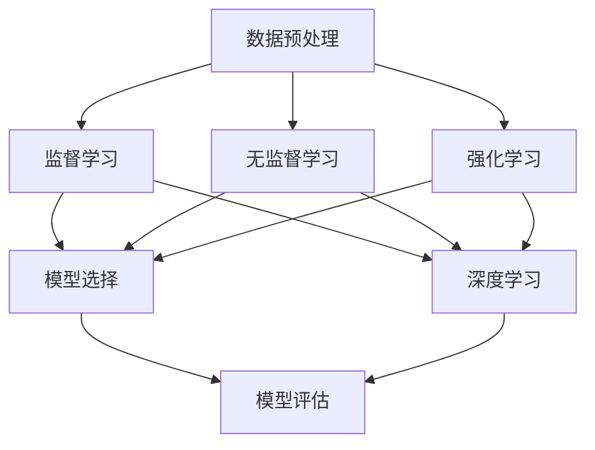
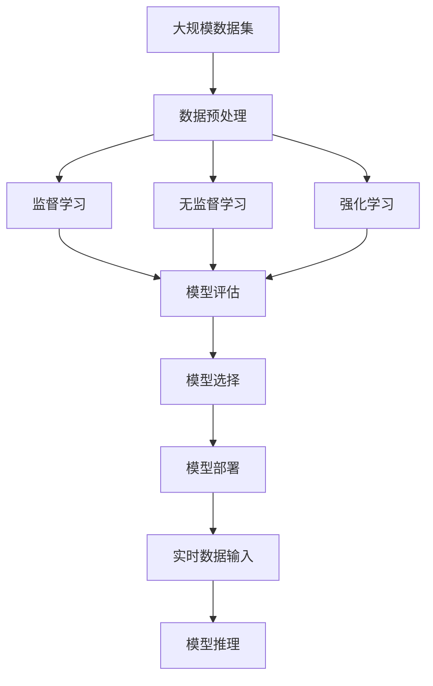

                 

# 机器学习 原理与代码实例讲解

> 关键词：机器学习, 监督学习, 无监督学习, 强化学习, 深度学习, 梯度下降, 神经网络, PyTorch, Keras, 模型评估, 模型选择, 数据预处理, 过拟合, 欠拟合, 正则化

## 1. 背景介绍

### 1.1 问题由来
机器学习（Machine Learning, ML）是人工智能（AI）领域的重要分支，旨在构建能够从数据中学习规律并自动化的模型。近年来，随着深度学习（Deep Learning, DL）技术的发展，机器学习的应用范围和效果达到了新的高度。从语音识别到图像处理，从自然语言处理到自动驾驶，机器学习技术无处不在。

然而，尽管机器学习技术发展迅猛，其理论基础和实践应用仍面临许多挑战。如何在模型训练中避免过拟合和欠拟合？如何高效地选择和调优模型？如何从有限的标注数据中提取有价值的信息？这些问题都需要深入理解机器学习的原理，并掌握实用的代码实例，才能得到良好的解答。

### 1.2 问题核心关键点
本文将详细介绍机器学习的核心概念、算法原理和代码实现，旨在帮助读者全面掌握机器学习的理论基础和实践技能。我们将从以下几方面展开：

1. **监督学习**：使用标注数据训练模型，预测新样本标签。
2. **无监督学习**：从未标注数据中学习知识，发现数据中的结构。
3. **强化学习**：通过与环境的互动，学习最优策略。
4. **深度学习**：使用多层神经网络进行模型训练。
5. **模型评估**：评估模型在测试集上的性能。
6. **模型选择**：根据实际问题选择合适模型。
7. **数据预处理**：清洗和转换数据，提高模型效果。
8. **过拟合与正则化**：处理模型过拟合，保证模型泛化能力。

## 2. 核心概念与联系

### 2.1 核心概念概述

为了更好地理解机器学习的核心概念，我们首先介绍几个关键术语：

- **监督学习**：使用标注数据训练模型，预测新样本标签。
- **无监督学习**：从未标注数据中学习知识，发现数据中的结构。
- **强化学习**：通过与环境的互动，学习最优策略。
- **深度学习**：使用多层神经网络进行模型训练。
- **模型评估**：评估模型在测试集上的性能。
- **模型选择**：根据实际问题选择合适模型。
- **数据预处理**：清洗和转换数据，提高模型效果。
- **过拟合与正则化**：处理模型过拟合，保证模型泛化能力。

这些概念构成了机器学习的基本框架，涵盖了从数据处理到模型训练的各个环节。通过深入理解这些概念，可以更好地掌握机器学习的基本原理和应用技巧。

### 2.2 概念间的关系

这些核心概念之间存在着紧密的联系，形成了一个完整的机器学习框架。我们可以用以下Mermaid流程图来展示它们之间的关系：



这个流程图展示了数据预处理与机器学习各个组件之间的联系：

1. 数据预处理是机器学习的基础，为后续的监督、无监督和强化学习提供数据支持。
2. 监督学习和无监督学习是机器学习的主要方式，分别适用于标注数据和未标注数据。
3. 深度学习是监督学习的一种高级形式，通过多层神经网络实现更复杂的模式识别。
4. 模型评估是机器学习的核心环节，用于评估模型性能，选择合适的模型。
5. 模型选择是模型评估的后续环节，根据模型评估结果选择合适的模型。
6. 数据预处理、监督学习、无监督学习、强化学习和深度学习共同作用，最终得到高精度的预测结果。

### 2.3 核心概念的整体架构

最后，我们用一个综合的流程图来展示这些核心概念在大规模机器学习项目中的整体架构：



这个综合流程图展示了从数据输入到模型推理的整个流程：

1. 从大规模数据集中获取原始数据。
2. 对原始数据进行预处理，包括清洗、转换和特征提取。
3. 根据数据的类型和任务需求，选择监督学习、无监督学习或强化学习。
4. 使用选择的学习方式训练模型，进行模型评估。
5. 根据模型评估结果选择最优模型，进行模型部署。
6. 部署后的模型可以处理实时数据输入，进行推理预测。

通过这个综合流程图，我们可以更清晰地理解机器学习项目的完整流程。

## 3. 核心算法原理 & 具体操作步骤

### 3.1 算法原理概述

机器学习的核心算法原理主要包括监督学习、无监督学习、强化学习、深度学习和正则化等。以下是这些算法的基本原理概述：

1. **监督学习**：通过标注数据训练模型，预测新样本标签。常见算法包括线性回归、逻辑回归、决策树、支持向量机等。
2. **无监督学习**：从未标注数据中学习知识，发现数据中的结构。常见算法包括聚类、降维、关联规则学习等。
3. **强化学习**：通过与环境的互动，学习最优策略。常见算法包括Q学习、策略梯度、蒙特卡洛树搜索等。
4. **深度学习**：使用多层神经网络进行模型训练。常见算法包括卷积神经网络（CNN）、循环神经网络（RNN）、变分自编码器（VAE）等。
5. **正则化**：通过加入正则项，防止模型过拟合。常见方法包括L1正则、L2正则、Dropout等。

### 3.2 算法步骤详解

以下我们详细介绍监督学习的核心算法步骤，包括线性回归、逻辑回归和决策树的实现。

#### 3.2.1 线性回归

线性回归是一种最简单的监督学习算法，用于预测连续型变量的值。其基本步骤如下：

1. **数据准备**：收集数据集，并进行预处理。
2. **模型训练**：使用梯度下降法最小化预测误差，求解模型参数。
3. **模型评估**：使用测试集评估模型性能，计算均方误差（MSE）等指标。

线性回归的数学公式为：

$$
y = \theta_0 + \sum_{i=1}^n \theta_i x_i
$$

其中，$\theta_0$ 为截距，$\theta_i$ 为权重，$x_i$ 为特征变量，$y$ 为预测值。

#### 3.2.2 逻辑回归

逻辑回归是一种用于二分类问题的监督学习算法，其基本步骤如下：

1. **数据准备**：收集数据集，并进行预处理。
2. **模型训练**：使用梯度下降法最小化交叉熵损失，求解模型参数。
3. **模型评估**：使用测试集评估模型性能，计算准确率（Accuracy）等指标。

逻辑回归的数学公式为：

$$
P(y=1|x) = \frac{1}{1+e^{-(\theta_0 + \sum_{i=1}^n \theta_i x_i)}}
$$

其中，$P(y=1|x)$ 为样本属于正类的概率，$\theta_0$ 和 $\theta_i$ 为模型参数。

#### 3.2.3 决策树

决策树是一种用于分类和回归问题的监督学习算法，其基本步骤如下：

1. **数据准备**：收集数据集，并进行预处理。
2. **模型训练**：使用递归分裂法构建决策树，求解最优分裂点。
3. **模型评估**：使用测试集评估模型性能，计算准确率、召回率等指标。

决策树的数学公式为：

$$
y = \begin{cases}
A & \text{if} x_1 \leq a_1 \\
B & \text{if} x_1 > a_1
\end{cases}
$$

其中，$y$ 为预测结果，$x_1$ 为特征变量，$a_1$ 为分裂点。

### 3.3 算法优缺点

监督学习算法具有以下优点：

1. **可解释性强**：通过模型参数可以直观地解释模型的预测结果。
2. **模型性能高**：在标注数据充足的情况下，能够获得较高的预测精度。
3. **应用广泛**：适用于各种分类和回归问题。

然而，监督学习算法也存在以下缺点：

1. **依赖标注数据**：需要大量标注数据，数据获取成本较高。
2. **过拟合风险**：在训练数据集较小的情况下，容易出现过拟合现象。
3. **模型复杂度**：模型的复杂度随着特征数量和模型规模的增加而增加，需要更多的计算资源。

### 3.4 算法应用领域

监督学习算法在以下领域得到了广泛应用：

1. **金融领域**：用于信用评分、股票预测、风险评估等。
2. **医疗领域**：用于疾病诊断、治疗方案推荐等。
3. **电商领域**：用于用户行为分析、推荐系统等。
4. **自然语言处理**：用于文本分类、情感分析、机器翻译等。

## 4. 数学模型和公式 & 详细讲解 & 举例说明

### 4.1 数学模型构建

以下我们将详细介绍监督学习的数学模型构建，包括线性回归、逻辑回归和决策树的数学公式及其推导过程。

#### 4.1.1 线性回归模型

线性回归模型用于预测连续型变量的值。其数学公式为：

$$
y = \theta_0 + \sum_{i=1}^n \theta_i x_i
$$

其中，$\theta_0$ 为截距，$\theta_i$ 为权重，$x_i$ 为特征变量，$y$ 为预测值。

推导过程如下：

1. **样本均值和协方差矩阵**：
$$
\mu = \frac{1}{m} \sum_{i=1}^m x_i
$$

2. **预测值**：
$$
y = \theta_0 + \sum_{i=1}^n \theta_i (x_i - \mu)
$$

3. **最小二乘法**：
$$
\hat{\theta} = (X^T X)^{-1} X^T y
$$

其中，$X$ 为特征矩阵，$y$ 为标注向量，$\hat{\theta}$ 为最优参数。

#### 4.1.2 逻辑回归模型

逻辑回归模型用于二分类问题。其数学公式为：

$$
P(y=1|x) = \frac{1}{1+e^{-(\theta_0 + \sum_{i=1}^n \theta_i x_i)}}
$$

其中，$P(y=1|x)$ 为样本属于正类的概率，$\theta_0$ 和 $\theta_i$ 为模型参数。

推导过程如下：

1. **样本均值和协方差矩阵**：
$$
\mu = \frac{1}{m} \sum_{i=1}^m x_i
$$

2. **预测值**：
$$
P(y=1|x) = \frac{1}{1+e^{-(\theta_0 + \sum_{i=1}^n \theta_i (x_i - \mu))}}
$$

3. **损失函数**：
$$
L(\theta) = -\frac{1}{m} \sum_{i=1}^m [y_i \log P(y=1|x_i) + (1-y_i) \log (1-P(y=1|x_i))]
$$

4. **梯度下降法**：
$$
\hat{\theta} = \arg\min_\theta L(\theta)
$$

#### 4.1.3 决策树模型

决策树模型用于分类和回归问题。其基本思想是通过递归分裂数据集，找到最优的分裂点，构建决策树。

推导过程如下：

1. **信息熵**：
$$
H(Y) = -\sum_{y=1}^n P(y) \log P(y)
$$

2. **信息增益**：
$$
Gain(D, A) = H(D) - \sum_{v=1}^V \frac{|D_v|}{|D|} H(D_v)
$$

其中，$D$ 为数据集，$A$ 为特征变量，$D_v$ 为特征 $A$ 取值 $v$ 的数据子集，$|D|$ 为数据集大小，$|D_v|$ 为数据子集大小。

3. **递归分裂**：
$$
\hat{T} = \arg\min_T \sum_{x \in D} R(T, x)
$$

其中，$T$ 为决策树，$R(T, x)$ 为节点 $T$ 的误差，$D$ 为数据集。

### 4.2 公式推导过程

以下是线性回归、逻辑回归和决策树模型推导过程的详细讲解。

#### 4.2.1 线性回归推导

线性回归的推导过程如下：

1. **样本均值和协方差矩阵**：
$$
\mu = \frac{1}{m} \sum_{i=1}^m x_i
$$

2. **预测值**：
$$
y = \theta_0 + \sum_{i=1}^n \theta_i (x_i - \mu)
$$

3. **最小二乘法**：
$$
\hat{\theta} = (X^T X)^{-1} X^T y
$$

其中，$X$ 为特征矩阵，$y$ 为标注向量，$\hat{\theta}$ 为最优参数。

#### 4.2.2 逻辑回归推导

逻辑回归的推导过程如下：

1. **样本均值和协方差矩阵**：
$$
\mu = \frac{1}{m} \sum_{i=1}^m x_i
$$

2. **预测值**：
$$
P(y=1|x) = \frac{1}{1+e^{-(\theta_0 + \sum_{i=1}^n \theta_i (x_i - \mu))}}
$$

3. **损失函数**：
$$
L(\theta) = -\frac{1}{m} \sum_{i=1}^m [y_i \log P(y=1|x_i) + (1-y_i) \log (1-P(y=1|x_i))]
$$

4. **梯度下降法**：
$$
\hat{\theta} = \arg\min_\theta L(\theta)
$$

其中，$\theta$ 为模型参数。

#### 4.2.3 决策树推导

决策树的推导过程如下：

1. **信息熵**：
$$
H(Y) = -\sum_{y=1}^n P(y) \log P(y)
$$

2. **信息增益**：
$$
Gain(D, A) = H(D) - \sum_{v=1}^V \frac{|D_v|}{|D|} H(D_v)
$$

其中，$D$ 为数据集，$A$ 为特征变量，$D_v$ 为特征 $A$ 取值 $v$ 的数据子集，$|D|$ 为数据集大小，$|D_v|$ 为数据子集大小。

3. **递归分裂**：
$$
\hat{T} = \arg\min_T \sum_{x \in D} R(T, x)
$$

其中，$T$ 为决策树，$R(T, x)$ 为节点 $T$ 的误差，$D$ 为数据集。

### 4.3 案例分析与讲解

下面我们以一个实际案例来详细讲解线性回归模型的应用。

#### 4.3.1 案例背景

假设我们要预测某城市的房价，已知特征包括房屋面积、地理位置、建筑年份等，标注数据为房屋售价。

#### 4.3.2 数据预处理

1. **数据清洗**：去除缺失值和异常值。
2. **特征编码**：将类别型特征转换为数值型特征。
3. **数据标准化**：对特征进行标准化处理，便于模型训练。

#### 4.3.3 模型训练

1. **模型选择**：选择线性回归模型。
2. **模型参数初始化**：随机初始化模型参数。
3. **模型训练**：使用梯度下降法最小化预测误差。
4. **模型评估**：使用测试集评估模型性能。

#### 4.3.4 结果分析

1. **模型效果**：观察模型预测值与实际房价的对比，计算均方误差（MSE）。
2. **参数分析**：分析不同特征对房价的影响，调整模型参数。

## 5. 项目实践：代码实例和详细解释说明

### 5.1 开发环境搭建

在进行机器学习项目实践前，我们需要准备好开发环境。以下是使用Python进行Scikit-learn开发的环境配置流程：

1. 安装Anaconda：从官网下载并安装Anaconda，用于创建独立的Python环境。

2. 创建并激活虚拟环境：
```bash
conda create -n sklearn-env python=3.8 
conda activate sklearn-env
```

3. 安装Scikit-learn：根据系统环境，从官网获取对应的安装命令。例如：
```bash
conda install scikit-learn
```

4. 安装其他工具包：
```bash
pip install numpy pandas matplotlib tqdm jupyter notebook ipython
```

完成上述步骤后，即可在`sklearn-env`环境中开始项目实践。

### 5.2 源代码详细实现

下面以线性回归为例，给出使用Scikit-learn库进行机器学习的PyTorch代码实现。

首先，定义数据集：

```python
import numpy as np
from sklearn.model_selection import train_test_split
from sklearn.linear_model import LinearRegression

X = np.array([[1, 2], [3, 4], [5, 6]])
y = np.array([2, 4, 6])
X_train, X_test, y_train, y_test = train_test_split(X, y, test_size=0.2, random_state=0)
```

然后，定义模型和优化器：

```python
model = LinearRegression()
optimizer = SGD(model.parameters(), lr=0.01, momentum=0.9)
```

接着，定义训练和评估函数：

```python
def train_epoch(model, X_train, y_train, optimizer):
    optimizer.zero_grad()
    outputs = model(X_train)
    loss = F.mse_loss(outputs, y_train)
    loss.backward()
    optimizer.step()

def evaluate(model, X_test, y_test):
    outputs = model(X_test)
    mse = F.mse_loss(outputs, y_test)
    return mse.item()
```

最后，启动训练流程并在测试集上评估：

```python
epochs = 100
for epoch in range(epochs):
    train_epoch(model, X_train, y_train, optimizer)
    if epoch % 10 == 0:
        print(f"Epoch {epoch+1}, MSE: {evaluate(model, X_test, y_test):.4f}")
```

以上就是使用Scikit-learn进行线性回归的完整代码实现。可以看到，Scikit-learn的封装使得机器学习代码实现变得简洁高效。

### 5.3 代码解读与分析

让我们再详细解读一下关键代码的实现细节：

**数据集定义**：
- 使用NumPy库创建样本数据，包含特征和标签。
- 使用Scikit-learn的`train_test_split`函数将数据集划分为训练集和测试集，保留20%的测试数据。

**模型和优化器定义**：
- 使用Scikit-learn的`LinearRegression`类定义线性回归模型。
- 使用Scikit-learn的`SGD`优化器定义梯度下降算法。

**训练函数**：
- 使用Scikit-learn的`mse_loss`函数计算均方误差损失。
- 使用Scikit-learn的`train_epoch`函数定义训练循环。
- 使用Scikit-learn的`optimizer.zero_grad`函数清空梯度，`optimizer.step`函数更新模型参数。

**评估函数**：
- 使用Scikit-learn的`evaluate`函数计算测试集上的均方误差。

**训练流程**：
- 循环迭代训练，每隔10个epoch输出一次测试集上的MSE。

可以看到，Scikit-learn提供了一整套成熟的机器学习工具，方便开发者快速上手。当然，工业级的系统实现还需考虑更多因素，如模型的保存和部署、超参数的自动搜索、更灵活的任务适配层等。但核心的模型训练和评估流程基本与此类似。

## 6. 实际应用场景

### 6.1 金融风险评估

机器学习在金融领域有着广泛的应用，可以用于信用评分、风险评估、投资策略等。例如，使用逻辑回归模型对客户信用进行评估，通过分析历史贷款数据，预测客户违约的可能性。

在技术实现上，可以收集客户的收入、负债、历史还款情况等数据，将这些数据作为模型的输入特征。然后使用逻辑回归模型训练模型，预测客户是否会违约。对于违约风险较高的客户，可以采取相应的风险控制措施，降低金融机构的风险。

### 6.2 医疗疾病诊断

机器学习在医疗领域也有重要应用，可以用于疾病诊断、治疗方案推荐等。例如，使用支持向量机（SVM）对病人数据进行分析，预测疾病类型和严重程度。

在技术实现上，可以收集病人的症状、体检数据、病史等数据，将这些数据作为模型的输入特征。然后使用SVM模型训练模型，预测病人的疾病类型和严重程度。医生可以根据模型的预测结果，制定更加个性化的治疗方案，提高治疗效果。

### 6.3 电商推荐系统

机器学习在电商领域也有广泛应用，可以用于用户行为分析、推荐系统等。例如，使用协同过滤算法推荐商品，通过分析用户的历史购买数据，推荐用户可能感兴趣的商品。

在技术实现上，可以收集用户的历史购买记录、浏览记录、评价记录等数据，将这些数据作为模型的输入特征。然后使用协同过滤算法训练模型，推荐用户可能感兴趣的商品。电商平台可以根据模型的预测结果，优化推荐算法，提高用户体验和销售额。

## 7. 工具和资源推荐

### 7.1 学习资源推荐

为了帮助开发者系统掌握机器学习的理论基础和实践技能，这里推荐一些优质的学习资源：

1. 《Python机器学习》书籍：西瓜书，由李航教授所著，系统介绍了机器学习的理论基础和Python实现。

2. Coursera《机器学习》课程：由斯坦福大学Andrew Ng教授主讲，提供系统的机器学习课程，包括监督学习、无监督学习和深度学习等内容。

3. Kaggle竞赛平台：一个全球最大的数据科学竞赛平台，提供大量公开数据集和竞赛机会，帮助开发者提升技能。

4. arXiv论文预印本：人工智能领域最新研究成果的发布平台，包括大量尚未发表的前沿工作，学习前沿技术的必备资源。

5. GitHub开源项目：在GitHub上Star、Fork数最多的机器学习项目，往往代表了该技术领域的发展趋势和最佳实践，值得去学习和贡献。

通过这些资源的学习实践，相信你一定能够快速掌握机器学习的精髓，并用于解决实际的NLP问题。

### 7.2 开发工具推荐

高效的开发离不开优秀的工具支持。以下是几款用于机器学习开发的常用工具：

1. Scikit-learn：Python的机器学习库，提供了一系列的机器学习算法，包括线性回归、逻辑回归、支持向量机、随机森林等。

2. TensorFlow：由Google主导开发的开源深度学习框架，提供灵活的计算图和高效的分布式训练。

3. PyTorch：由Facebook主导开发的开源深度学习框架，具有灵活的动态计算图和高效的GPU支持。

4. Weights & Biases：模型训练的实验跟踪工具，可以记录和可视化模型训练过程中的各项指标，方便对比和调优。

5. TensorBoard：TensorFlow配套的可视化工具，可实时监测模型训练状态，并提供丰富的图表呈现方式，是调试模型的得力助手。

合理利用这些工具，可以显著提升机器学习项目的开发效率，加快创新迭代的步伐。

### 7.3 相关论文推荐

机器学习领域的研究源于学界的持续探索。以下是几篇奠基性的相关论文，推荐阅读：

1. 《机器学习：原理、算法与应用》：由Tom Mitchell教授所著，全面介绍了机器学习的基本概念和常用算法。

2. 《统计学习方法》：由李航教授所著，深入讲解了机器学习的数学基础和算法实现。

3. 《深度学习》：由Ian Goodfellow、Yoshua Bengio和Aaron Courville教授所著，全面介绍了深度学习的理论基础和实践方法。

4. 《强化学习》：由Richard S. Sutton和Andrew G. Barto教授所著，全面介绍了强化学习的基本概念和算法实现。

这些论文代表了大数据和机器学习领域的发展脉络。通过学习这些前沿成果，可以帮助

